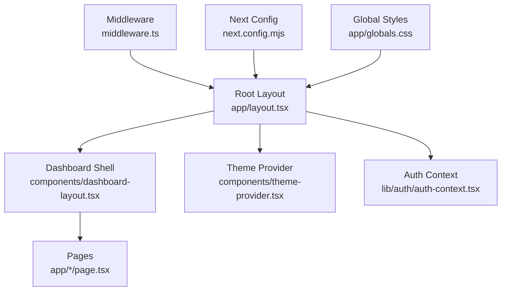
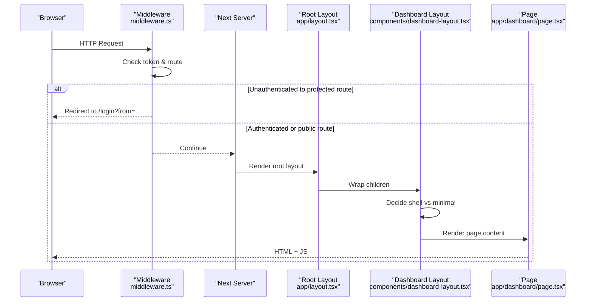
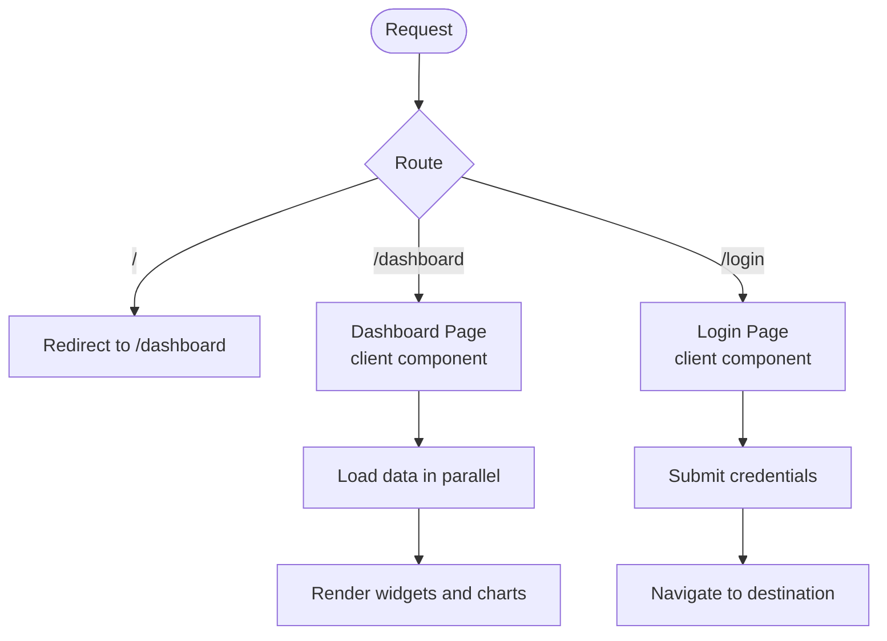
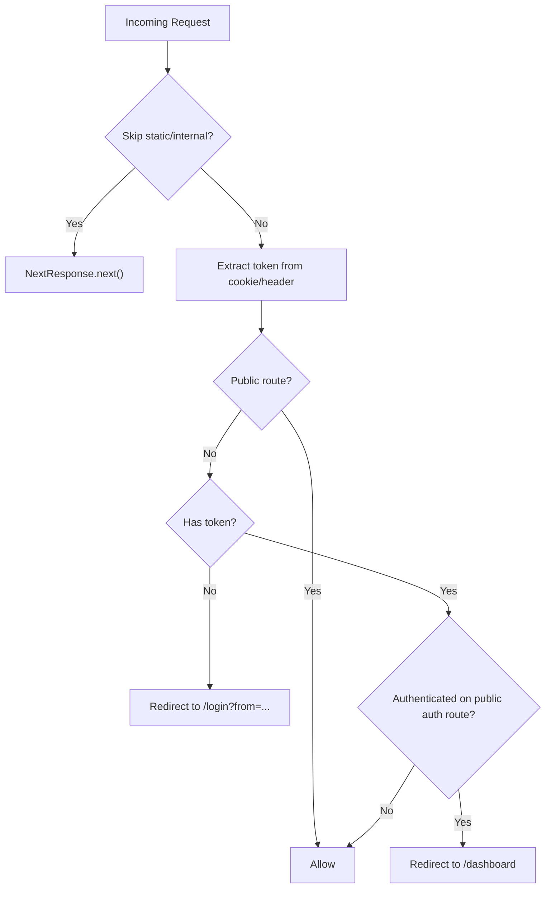
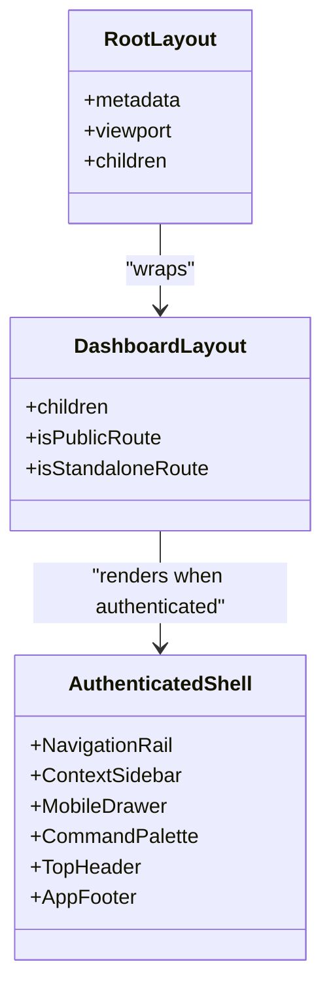
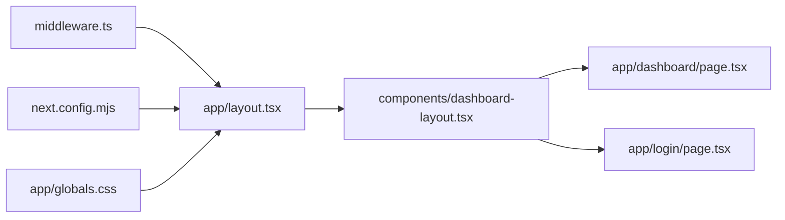

# Application Structure

<cite>
**Referenced Files in This Document**
- [next.config.mjs](file://apps/web/next.config.mjs)
- [middleware.ts](file://apps/web/middleware.ts)
- [layout.tsx](file://apps/web/app/layout.tsx)
- [page.tsx](file://apps/web/app/page.tsx)
- [dashboard-layout.tsx](file://apps/web/components/dashboard-layout.tsx)
- [theme-provider.tsx](file://apps/web/components/theme-provider.tsx)
- [globals.css](file://apps/web/app/globals.css)
- [package.json](file://apps/web/package.json)
- [dashboard/page.tsx](file://apps/web/app/dashboard/page.tsx)
- [login/page.tsx](file://apps/web/app/login/page.tsx)
</cite>

## Table of Contents
1. Introduction
2. Project Structure
3. Core Components
4. Architecture Overview
5. Detailed Component Analysis
6. Dependency Analysis
7. Performance Considerations
8. Troubleshooting Guide
9. Conclusion

## Introduction
This document explains the Ananya ERP Next.js application structure and architecture with a focus on the App Router, middleware, configuration, layout patterns, server-side rendering (SSR) and client hydration strategies, and performance optimizations. It also provides practical guidance for creating new routes, implementing layouts, configuring application-wide settings, environment variables, build configurations, and deployment considerations specific to Next.js.

## Project Structure
The web application follows Next.js App Router conventions under apps/web:
- app/: Defines routes using directories and files like page.tsx and layout.tsx. The root layout sets global metadata, theme provider, authentication context, and the dashboard shell.
- components/: Reusable UI and layout components, including the authenticated dashboard shell and theme provider.
- lib/: Shared utilities, API clients, navigation contexts, and auth context.
- public/: Static assets such as service worker and manifest.

**Diagram sources**
- [layout.tsx:1-63](file://apps/web/app/layout.tsx#L1-L63)
- [dashboard-layout.tsx:1-131](file://apps/web/components/dashboard-layout.tsx#L1-L131)
- [theme-provider.tsx:1-12](file://apps/web/components/theme-provider.tsx#L1-L12)
- [middleware.ts:1-55](file://apps/web/middleware.ts#L1-L55)
- [next.config.mjs:1-30](file://apps/web/next.config.mjs#L1-L30)
- [globals.css:1-281](file://apps/web/app/globals.css#L1-L281)

**Section sources**
- [layout.tsx:1-63](file://apps/web/app/layout.tsx#L1-L63)
- [dashboard-layout.tsx:1-131](file://apps/web/components/dashboard-layout.tsx#L1-L131)
- [theme-provider.tsx:1-12](file://apps/web/components/theme-provider.tsx#L1-L12)
- [middleware.ts:1-55](file://apps/web/middleware.ts#L1-L55)
- [next.config.mjs:1-30](file://apps/web/next.config.mjs#L1-L30)
- [globals.css:1-281](file://apps/web/app/globals.css#L1-L281)

## Core Components
- Root Layout: Provides global metadata, viewport, theme provider, authentication context, and wraps all pages with the dashboard shell.
- Dashboard Layout: Renders either a minimal main container for public or standalone routes or an authenticated shell with navigation rail, sidebar, header, command palette, and footer.
- Theme Provider: Wraps the app with next-themes to support light/dark modes.
- Middleware: Enforces authentication by inspecting cookies or Authorization headers, redirects unauthenticated users to login, and prevents authenticated users from accessing certain public routes.
- Global Styles: Tailwind CSS setup with design tokens and print styles.

Key responsibilities:
- Routing: App Router file-based routing; root page redirects to /dashboard.
- Authentication: Middleware protects routes; dashboard layout adapts chrome based on auth state.
- Theming: System-aware theme via next-themes.
- Configuration: Next.js config for output mode, image handling, and custom headers for service worker.

**Section sources**
- [layout.tsx:1-63](file://apps/web/app/layout.tsx#L1-L63)
- [dashboard-layout.tsx:1-131](file://apps/web/components/dashboard-layout.tsx#L1-L131)
- [theme-provider.tsx:1-12](file://apps/web/components/theme-provider.tsx#L1-L12)
- [middleware.ts:1-55](file://apps/web/middleware.ts#L1-L55)
- [globals.css:1-281](file://apps/web/app/globals.css#L1-L281)

## Architecture Overview
The request lifecycle integrates middleware, App Router layouts/pages, and runtime providers:

**Diagram sources**
- [middleware.ts:1-55](file://apps/web/middleware.ts#L1-L55)
- [layout.tsx:1-63](file://apps/web/app/layout.tsx#L1-L63)
- [dashboard-layout.tsx:1-131](file://apps/web/components/dashboard-layout.tsx#L1-L131)
- [dashboard/page.tsx:1-492](file://apps/web/app/dashboard/page.tsx#L1-L492)

## Detailed Component Analysis

### App Router Organization and Pages
- Root redirect: The root page redirects to /dashboard to centralize entry.
- Dashboard page: A client component that aggregates multiple data sources concurrently, manages widget preferences, and renders a responsive grid of widgets.
- Login page: A client component handling sign-in flow, error states, and post-login redirection.

**Diagram sources**
- [page.tsx:1-6](file://apps/web/app/page.tsx#L1-L6)
- [dashboard/page.tsx:1-492](file://apps/web/app/dashboard/page.tsx#L1-L492)
- [login/page.tsx:1-202](file://apps/web/app/login/page.tsx#L1-L202)

**Section sources**
- [page.tsx:1-6](file://apps/web/app/page.tsx#L1-L6)
- [dashboard/page.tsx:1-492](file://apps/web/app/dashboard/page.tsx#L1-L492)
- [login/page.tsx:1-202](file://apps/web/app/login/page.tsx#L1-L202)

### Middleware Implementation
- Public routes: Explicitly allowlisted for unauthenticated access.
- Token extraction: Reads cookie or Authorization header.
- Redirect logic: Unauthenticated users are redirected to /login with a return path; authenticated users are redirected away from certain public routes.
- Matcher: Skips static assets and internal Next.js paths.

**Diagram sources**
- [middleware.ts:1-55](file://apps/web/middleware.ts#L1-L55)

**Section sources**
- [middleware.ts:1-55](file://apps/web/middleware.ts#L1-L55)

### Layouts and Chrome Strategy
- Root layout: Sets metadata, viewport, theme provider, auth context, and PWA registration.
- Dashboard layout:
  - Public or standalone routes render a minimal container without navigation chrome.
  - Authenticated routes render a full shell with navigation rail, context sidebar, mobile drawer, command palette, top header, and footer.
  - Standalone routes (e.g., scanner) intentionally avoid shell chrome while still respecting auth.

**Diagram sources**
- [layout.tsx:1-63](file://apps/web/app/layout.tsx#L1-L63)
- [dashboard-layout.tsx:1-131](file://apps/web/components/dashboard-layout.tsx#L1-L131)

**Section sources**
- [layout.tsx:1-63](file://apps/web/app/layout.tsx#L1-L63)
- [dashboard-layout.tsx:1-131](file://apps/web/components/dashboard-layout.tsx#L1-L131)

### SSR, Hydration, and Client Components
- Root layout is a server component by default, enabling SSR and global metadata.
- Dashboard and Login pages use "use client" directives, making them client components that hydrate interactive UI and perform network requests on the client.
- Providers (theme, auth) are mounted in the root layout to be available throughout the app.

Practical implications:
- Use server components for initial data fetching where possible to reduce client bundle size and improve TTFB.
- Keep heavy interactivity in client components; leverage Suspense boundaries for progressive loading.

**Section sources**
- [layout.tsx:1-63](file://apps/web/app/layout.tsx#L1-L63)
- [dashboard/page.tsx:1-492](file://apps/web/app/dashboard/page.tsx#L1-L492)
- [login/page.tsx:1-202](file://apps/web/app/login/page.tsx#L1-L202)

### Configuration and Environment
- Build output: Set to standalone for efficient deployments.
- Images: Disabled optimization to simplify hosting environments.
- Headers: Custom headers for service worker caching control and scope.
- Scripts: Dev, build, start, lint, type generation, and tests defined in package scripts.

Environment variables:
- No explicit env usage is visible in the analyzed files. Configure environment variables through your deployment platform’s environment settings and consume them via process.env in server code or appropriate client-safe patterns.

**Section sources**
- [next.config.mjs:1-30](file://apps/web/next.config.mjs#L1-L30)
- [package.json:1-55](file://apps/web/package.json#L1-L55)

## Dependency Analysis
High-level dependencies among core pieces:

**Diagram sources**
- [middleware.ts:1-55](file://apps/web/middleware.ts#L1-L55)
- [layout.tsx:1-63](file://apps/web/app/layout.tsx#L1-L63)
- [dashboard-layout.tsx:1-131](file://apps/web/components/dashboard-layout.tsx#L1-L131)
- [dashboard/page.tsx:1-492](file://apps/web/app/dashboard/page.tsx#L1-L492)
- [login/page.tsx:1-202](file://apps/web/app/login/page.tsx#L1-L202)
- [next.config.mjs:1-30](file://apps/web/next.config.mjs#L1-L30)
- [globals.css:1-281](file://apps/web/app/globals.css#L1-L281)

**Section sources**
- [middleware.ts:1-55](file://apps/web/middleware.ts#L1-L55)
- [layout.tsx:1-63](file://apps/web/app/layout.tsx#L1-L63)
- [dashboard-layout.tsx:1-131](file://apps/web/components/dashboard-layout.tsx#L1-L131)
- [dashboard/page.tsx:1-492](file://apps/web/app/dashboard/page.tsx#L1-L492)
- [login/page.tsx:1-202](file://apps/web/app/login/page.tsx#L1-L202)
- [next.config.mjs:1-30](file://apps/web/next.config.mjs#L1-L30)
- [globals.css:1-281](file://apps/web/app/globals.css#L1-L281)

## Performance Considerations
- Output mode: Standalone output reduces deployment footprint and improves cold starts.
- Image optimization: Disabled to avoid CDN-specific requirements; consider enabling optimized images if your hosting supports it.
- Service worker headers: Prevent caching of sw.js to ensure updates propagate reliably.
- Client-side data loading: The dashboard fetches multiple endpoints concurrently; keep this pattern for fast perceived performance.
- Print styles: Comprehensive print rules minimize reflows and ensure clean outputs.

Recommendations:
- Prefer server components for initial data where feasible to reduce client work.
- Use React Suspense for streaming UI during data loads.
- Leverage Next.js caching and revalidation strategies for data-heavy pages.
- Monitor bundle sizes and tree-shake unused libraries.

[No sources needed since this section provides general guidance]

## Troubleshooting Guide
Common issues and resolutions:
- Redirect loops: Ensure middleware allowslist includes all necessary public routes and that session tokens are correctly set/read.
- Service worker not updating: Verify custom headers for sw.js are applied and browser cache is cleared.
- Layout chrome missing: Confirm user is authenticated and not on a public or standalone route; check dashboard layout conditions.
- Build errors ignored: TypeScript build errors are ignored in config; fix type issues to prevent runtime surprises.

**Section sources**
- [middleware.ts:1-55](file://apps/web/middleware.ts#L1-L55)
- [next.config.mjs:1-30](file://apps/web/next.config.mjs#L1-L30)
- [dashboard-layout.tsx:1-131](file://apps/web/components/dashboard-layout.tsx#L1-L131)

## Conclusion
Ananya ERP’s Next.js application uses a clear App Router structure with a robust middleware layer for authentication, a flexible dashboard shell for authenticated experiences, and a client-driven dashboard for real-time operations. Configuration emphasizes deployability and reliability, while global styles provide consistent theming and print behavior. Following the patterns outlined here will help you add routes, implement layouts, configure settings, and optimize performance effectively.

[No sources needed since this section summarizes without analyzing specific files]