# Base UI Components

<cite>
**Referenced Files in This Document**
- [button.tsx](file://apps/web/components/ui/button.tsx)
- [input.tsx](file://apps/web/components/ui/input.tsx)
- [form.tsx](file://apps/web/components/ui/form.tsx)
- [dialog.tsx](file://apps/web/components/ui/dialog.tsx)
- [select.tsx](file://apps/web/components/ui/select.tsx)
- [checkbox.tsx](file://apps/web/components/ui/checkbox.tsx)
- [radio-group.tsx](file://apps/web/components/ui/radio-group.tsx)
- [switch.tsx](file://apps/web/components/ui/switch.tsx)
- [tabs.tsx](file://apps/web/components/ui/tabs.tsx)
- [dropdown-menu.tsx](file://apps/web/components/ui/dropdown-menu.tsx)
- [label.tsx](file://apps/web/components/ui/label.tsx)
- [popover.tsx](file://apps/web/components/ui/popover.tsx)
- [textarea.tsx](file://apps/web/components/ui/textarea.tsx)
- [components.json](file://apps/web/components.json)
- [globals.css](file://apps/web/app/globals.css)
- [postcss.config.mjs](file://apps/web/postcss.config.mjs)
</cite>

## Table of Contents
1. [Introduction](#introduction)
2. [Project Structure](#project-structure)
3. [Core Components](#core-components)
4. [Architecture Overview](#architecture-overview)
5. [Detailed Component Analysis](#detailed-component-analysis)
6. [Dependency Analysis](#dependency-analysis)
7. [Performance Considerations](#performance-considerations)
8. [Troubleshooting Guide](#troubleshooting-guide)
9. [Conclusion](#conclusion)

## Introduction
This document describes the base UI component library built with shadcn/ui and Tailwind CSS. It covers fundamental primitives such as buttons, inputs, forms, dialogs, selects, checkboxes, radio groups, switches, tabs, and dropdown menus. For each component, you will find prop interfaces, usage patterns, styling customization options, accessibility features, composition guidance, theme integration, responsive behavior, best practices for form handling and validation, keyboard navigation, performance considerations, and browser compatibility notes.

The components are thin wrappers around accessible primitives from @base-ui/react and styled with Tailwind CSS utilities. The project uses semantic color tokens via CSS variables and class-based dark mode.

## Project Structure
The UI components live under apps/web/components/ui. Configuration for shadcn is defined in apps/web/components.json, which sets aliases, Tailwind CSS entry, and icon library. Global styles and theme tokens are declared in apps/web/app/globals.css. PostCSS is configured to use the Tailwind plugin.

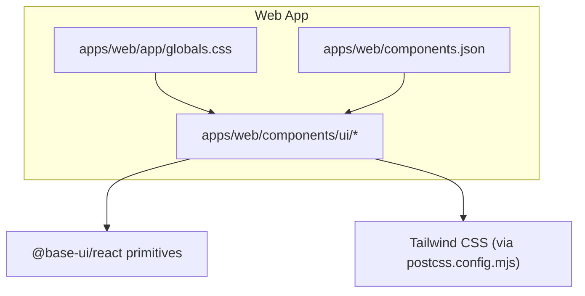

**Diagram sources**
- [globals.css:1-39](file://apps/web/app/globals.css#L1-L39)
- [components.json:1-22](file://apps/web/components.json#L1-L22)
- [postcss.config.mjs:1-8](file://apps/web/postcss.config.mjs#L1-L8)

**Section sources**
- [components.json:1-22](file://apps/web/components.json#L1-L22)
- [globals.css:1-39](file://apps/web/app/globals.css#L1-L39)
- [postcss.config.mjs:1-8](file://apps/web/postcss.config.mjs#L1-L8)

## Core Components
This section summarizes the core primitives, their responsibilities, and how they integrate with the theme and accessibility model.

- Button: Accessible button primitive with variant and size variants; supports icons and keyboard focus states.
- Input: Text input with consistent sizing, disabled and invalid states, and focus ring.
- Form: React Hook Form integration providing FormProvider, FormField, FormItem, FormLabel, FormControl, FormDescription, and FormMessage with proper aria attributes.
- Dialog: Modal dialog with overlay, portal, header/footer, title, description, and close behavior.
- Select: Accessible select with grouped items, labels, separators, scroll arrows, and positioning.
- Checkbox: Single selection toggle with indicator and state classes.
- Radio Group: Mutually exclusive selection group with item indicators.
- Switch: Toggle control with size variants and thumb animation.
- Tabs: Tabbed interface with list, trigger, content, and orientation support.
- Dropdown Menu: Contextual menu with items, separators, labels, and groups.
- Label: Accessible label element for form controls.
- Popover: Floating content anchored to a trigger with header/title/description.
- Textarea: Multi-line text input with consistent styling and validation states.

All components use semantic tokens (e.g., primary, destructive, muted, border, input, ring) mapped from CSS variables, ensuring consistent theming and dark mode support.

**Section sources**
- [button.tsx:1-59](file://apps/web/components/ui/button.tsx#L1-L59)
- [input.tsx:1-21](file://apps/web/components/ui/input.tsx#L1-L21)
- [form.tsx:1-169](file://apps/web/components/ui/form.tsx#L1-L169)
- [dialog.tsx:1-157](file://apps/web/components/ui/dialog.tsx#L1-L157)
- [select.tsx:1-221](file://apps/web/components/ui/select.tsx#L1-L221)
- [checkbox.tsx:1-29](file://apps/web/components/ui/checkbox.tsx#L1-L29)
- [radio-group.tsx:1-39](file://apps/web/components/ui/radio-group.tsx#L1-L39)
- [switch.tsx:1-33](file://apps/web/components/ui/switch.tsx#L1-L33)
- [tabs.tsx:1-83](file://apps/web/components/ui/tabs.tsx#L1-L83)
- [dropdown-menu.tsx:1-117](file://apps/web/components/ui/dropdown-menu.tsx#L1-L117)
- [label.tsx:1-21](file://apps/web/components/ui/label.tsx#L1-L21)
- [popover.tsx:1-91](file://apps/web/components/ui/popover.tsx#L1-L91)
- [textarea.tsx:1-19](file://apps/web/components/ui/textarea.tsx#L1-L19)

## Architecture Overview
The UI layer composes accessible primitives from @base-ui/react and applies Tailwind utility classes. Theme tokens are provided by global CSS variables and consumed through Tailwind’s semantic color system. Dark mode is class-based via .dark on the root element.

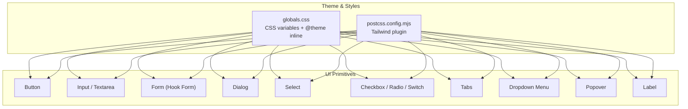

**Diagram sources**
- [globals.css:1-39](file://apps/web/app/globals.css#L1-L39)
- [postcss.config.mjs:1-8](file://apps/web/postcss.config.mjs#L1-L8)
- [button.tsx:1-59](file://apps/web/components/ui/button.tsx#L1-L59)
- [input.tsx:1-21](file://apps/web/components/ui/input.tsx#L1-L21)
- [form.tsx:1-169](file://apps/web/components/ui/form.tsx#L1-L169)
- [dialog.tsx:1-157](file://apps/web/components/ui/dialog.tsx#L1-L157)
- [select.tsx:1-221](file://apps/web/components/ui/select.tsx#L1-L221)
- [checkbox.tsx:1-29](file://apps/web/components/ui/checkbox.tsx#L1-L29)
- [radio-group.tsx:1-39](file://apps/web/components/ui/radio-group.tsx#L1-L39)
- [switch.tsx:1-33](file://apps/web/components/ui/switch.tsx#L1-L33)
- [tabs.tsx:1-83](file://apps/web/components/ui/tabs.tsx#L1-L83)
- [dropdown-menu.tsx:1-117](file://apps/web/components/ui/dropdown-menu.tsx#L1-L117)
- [popover.tsx:1-91](file://apps/web/components/ui/popover.tsx#L1-L91)
- [label.tsx:1-21](file://apps/web/components/ui/label.tsx#L1-L21)

## Detailed Component Analysis

### Button
- Purpose: Primary interactive element with multiple visual variants and sizes.
- Props: Inherits all props from the underlying primitive plus variant and size.
- Variants: default, outline, secondary, ghost, destructive, link.
- Sizes: default, xs, sm, lg, icon, icon-xs, icon-sm, icon-lg.
- Styling: Uses cva for variant/size combinations; integrates with semantic tokens for colors and rings.
- Accessibility: Focus-visible ring, disabled state, aria-invalid support when used within forms.
- Composition: Works well with icons; data-slot enables testing hooks.

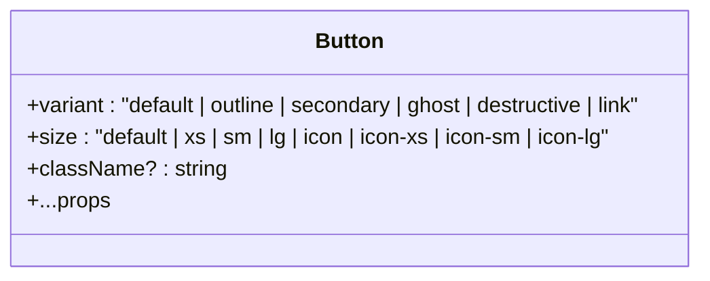

**Diagram sources**
- [button.tsx:6-41](file://apps/web/components/ui/button.tsx#L6-L41)
- [button.tsx:43-58](file://apps/web/components/ui/button.tsx#L43-L58)

**Section sources**
- [button.tsx:1-59](file://apps/web/components/ui/button.tsx#L1-L59)

### Input
- Purpose: Standard text input field.
- Props: All native input props plus className.
- Styling: Consistent height, border, placeholder, focus ring, disabled and invalid states.
- Accessibility: Native semantics; integrates with form validation via aria-invalid.

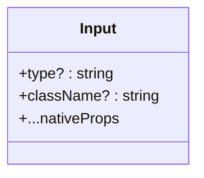

**Diagram sources**
- [input.tsx:6-17](file://apps/web/components/ui/input.tsx#L6-L17)

**Section sources**
- [input.tsx:1-21](file://apps/web/components/ui/input.tsx#L1-L21)

### Form (React Hook Form Integration)
- Purpose: Provides structured form building blocks with validation and accessibility.
- Components:
  - Form: Wraps children with FormProvider.
  - FormField: Binds a field to react-hook-form Controller and provides context.
  - FormItem: Groups label, control, description, message.
  - FormLabel: Accessible label linked to control id.
  - FormControl: Slot that wires id, aria-describedby, and aria-invalid.
  - FormDescription: Optional helper text.
  - FormMessage: Error message display.
- Accessibility: Proper ids, aria-describedby, aria-invalid, and error state propagation.
- Validation: Integrates with react-hook-form; use FieldPath and FieldValues for type safety.

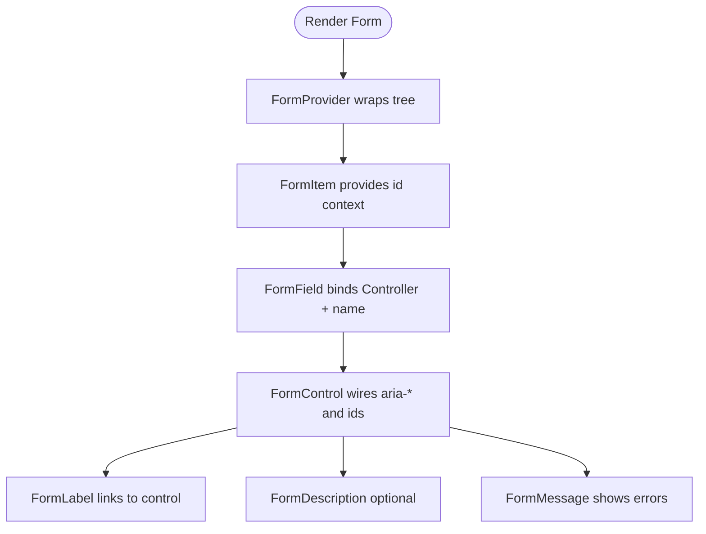

**Diagram sources**
- [form.tsx:19-66](file://apps/web/components/ui/form.tsx#L19-L66)
- [form.tsx:76-157](file://apps/web/components/ui/form.tsx#L76-L157)

**Section sources**
- [form.tsx:1-169](file://apps/web/components/ui/form.tsx#L1-L169)

### Dialog
- Purpose: Modal overlay with accessible focus management and keyboard handling.
- Components:
  - Dialog: Root container.
  - DialogTrigger: Opens the dialog.
  - DialogPortal: Renders portal.
  - DialogClose: Closes the dialog.
  - DialogOverlay: Backdrop with fade transitions.
  - DialogContent: Centered popup with optional close button.
  - DialogHeader/DialogFooter: Layout helpers.
  - DialogTitle/DialogDescription: Semantic headings and descriptions.
- Styling: Responsive max-width, animations, and z-index layering.
- Accessibility: Focus trap, escape key handling, role attributes managed by primitive.

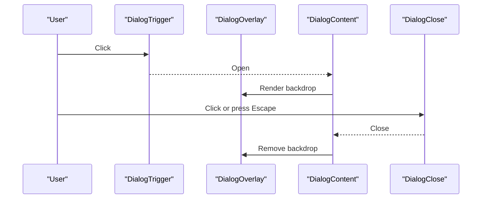

**Diagram sources**
- [dialog.tsx:10-24](file://apps/web/components/ui/dialog.tsx#L10-L24)
- [dialog.tsx:26-79](file://apps/web/components/ui/dialog.tsx#L26-L79)
- [dialog.tsx:82-143](file://apps/web/components/ui/dialog.tsx#L82-L143)

**Section sources**
- [dialog.tsx:1-157](file://apps/web/components/ui/dialog.tsx#L1-L157)

### Select
- Purpose: Accessible select with grouping, labels, separators, and scrolling.
- Components:
  - Select: Root with items extraction from children if not provided.
  - SelectTrigger: Displays selected value and chevron.
  - SelectContent: Portal with positioner and animated popup.
  - SelectGroup/SelectLabel/SelectSeparator: Organize options.
  - SelectItem: Individual option with indicator.
  - SelectScrollUpButton/SelectScrollDownButton: Scroll controls.
  - SelectValue: Displays current selection.
- Styling: Size variants, focus ring, invalid state, and smooth slide-in animations.
- Accessibility: Keyboard navigation, role attributes, and focus management handled by primitive.

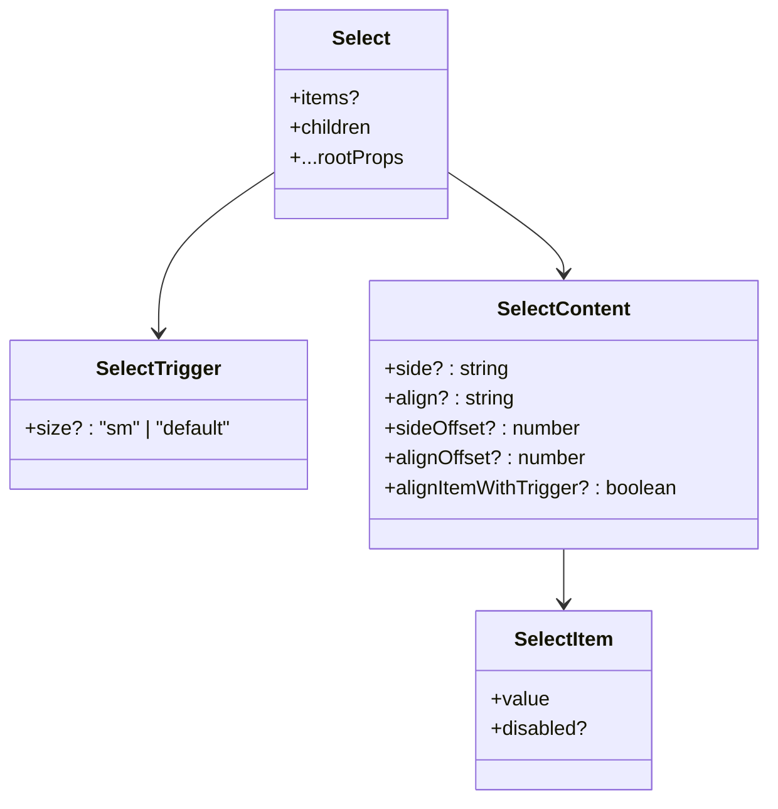

**Diagram sources**
- [select.tsx:10-26](file://apps/web/components/ui/select.tsx#L10-L26)
- [select.tsx:48-74](file://apps/web/components/ui/select.tsx#L48-L74)
- [select.tsx:76-116](file://apps/web/components/ui/select.tsx#L76-L116)
- [select.tsx:131-157](file://apps/web/components/ui/select.tsx#L131-L157)

**Section sources**
- [select.tsx:1-221](file://apps/web/components/ui/select.tsx#L1-L221)

### Checkbox
- Purpose: Binary toggle control.
- Props: Inherits all primitive props; className supported.
- Styling: Checked/unchecked states, focus ring, disabled and invalid states.
- Accessibility: Role="checkbox", aria-checked, keyboard interaction managed by primitive.

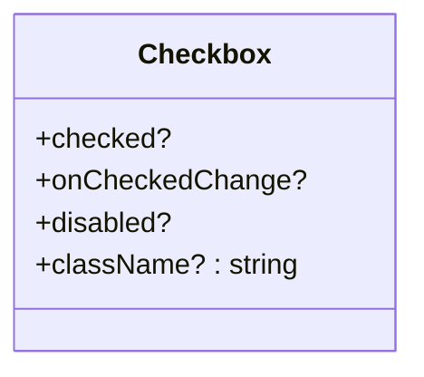

**Diagram sources**
- [checkbox.tsx:8-25](file://apps/web/components/ui/checkbox.tsx#L8-L25)

**Section sources**
- [checkbox.tsx:1-29](file://apps/web/components/ui/checkbox.tsx#L1-L29)

### Radio Group
- Purpose: Mutually exclusive selection set.
- Components:
  - RadioGroup: Container grid layout.
  - RadioGroupItem: Individual selectable option with indicator.
- Styling: Checked state, focus ring, disabled and invalid states.
- Accessibility: Role="radiogroup" and "radio", arrow key navigation.

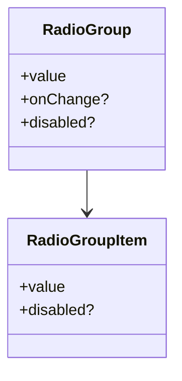

**Diagram sources**
- [radio-group.tsx:8-16](file://apps/web/components/ui/radio-group.tsx#L8-L16)
- [radio-group.tsx:18-36](file://apps/web/components/ui/radio-group.tsx#L18-L36)

**Section sources**
- [radio-group.tsx:1-39](file://apps/web/components/ui/radio-group.tsx#L1-L39)

### Switch
- Purpose: Toggle switch with size variants.
- Props: size ("sm" | "default"), plus primitive props.
- Styling: Thumb translation, checked/unchecked backgrounds, focus ring, invalid state.
- Accessibility: Role="switch", aria-checked, keyboard toggling.

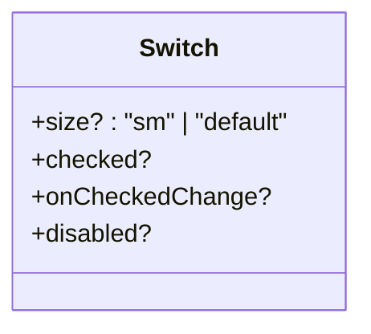

**Diagram sources**
- [switch.tsx:7-30](file://apps/web/components/ui/switch.tsx#L7-L30)

**Section sources**
- [switch.tsx:1-33](file://apps/web/components/ui/switch.tsx#L1-L33)

### Tabs
- Purpose: Tabbed interface supporting horizontal and vertical orientations.
- Components:
  - Tabs: Root with orientation prop.
  - TabsList: List container with variant ("default" | "line").
  - TabsTrigger: Activatable tab.
  - TabsContent: Panel content.
- Styling: Active states, focus ring, underline/indicator based on variant and orientation.
- Accessibility: Role="tablist", "tab", "tabpanel"; keyboard navigation.

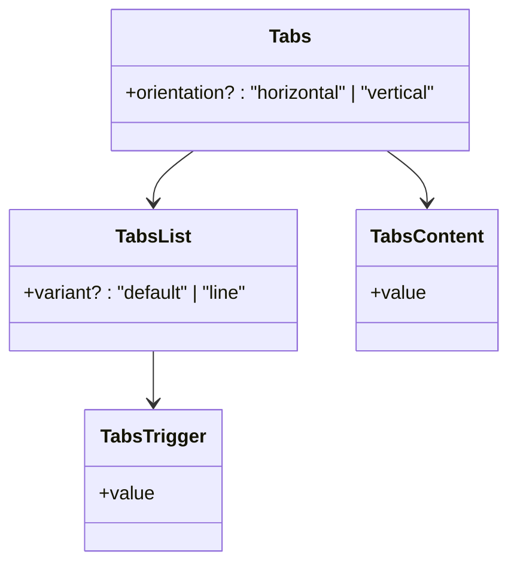

**Diagram sources**
- [tabs.tsx:8-24](file://apps/web/components/ui/tabs.tsx#L8-L24)
- [tabs.tsx:41-54](file://apps/web/components/ui/tabs.tsx#L41-L54)
- [tabs.tsx:56-69](file://apps/web/components/ui/tabs.tsx#L56-L69)
- [tabs.tsx:72-80](file://apps/web/components/ui/tabs.tsx#L72-L80)

**Section sources**
- [tabs.tsx:1-83](file://apps/web/components/ui/tabs.tsx#L1-L83)

### Dropdown Menu
- Purpose: Contextual menu with items, separators, labels, and groups.
- Components:
  - DropdownMenu: Root.
  - DropdownMenuTrigger: Opens/closes menu.
  - DropdownMenuContent: Positioned popup with animations.
  - DropdownMenuItem: Actionable item with variant ("default" | "destructive").
  - DropdownMenuSeparator: Visual divider.
  - DropdownMenuLabel: Group label.
  - DropdownMenuGroup: Logical grouping.
- Styling: Highlighted state, disabled state, destructive variant, slide-in animations.
- Accessibility: Role="menu", "menuitem", focus traversal, keyboard shortcuts.

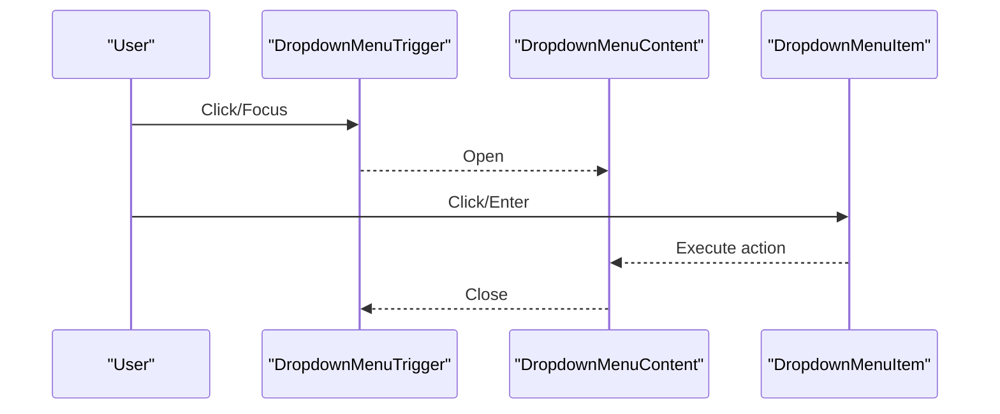

**Diagram sources**
- [dropdown-menu.tsx:7-13](file://apps/web/components/ui/dropdown-menu.tsx#L7-L13)
- [dropdown-menu.tsx:15-47](file://apps/web/components/ui/dropdown-menu.tsx#L15-L47)
- [dropdown-menu.tsx:49-67](file://apps/web/components/ui/dropdown-menu.tsx#L49-L67)

**Section sources**
- [dropdown-menu.tsx:1-117](file://apps/web/components/ui/dropdown-menu.tsx#L1-L117)

### Label
- Purpose: Accessible label for form controls.
- Props: All native label props; className supported.
- Styling: Consistent typography and disabled state.
- Accessibility: htmlFor association with controls.

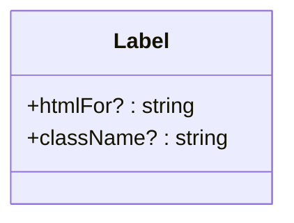

**Diagram sources**
- [label.tsx:7-17](file://apps/web/components/ui/label.tsx#L7-L17)

**Section sources**
- [label.tsx:1-21](file://apps/web/components/ui/label.tsx#L1-L21)

### Popover
- Purpose: Floating content anchored to a trigger with header/title/description.
- Components:
  - Popover: Root.
  - PopoverTrigger: Opens/closes popover.
  - PopoverContent: Positioned popup with animations.
  - PopoverHeader/PopoverTitle/PopoverDescription: Semantic structure.
- Styling: Rounded corners, shadow, slide-in animations.
- Accessibility: Role="tooltip"/"dialog"-like behaviors managed by primitive; focus management.

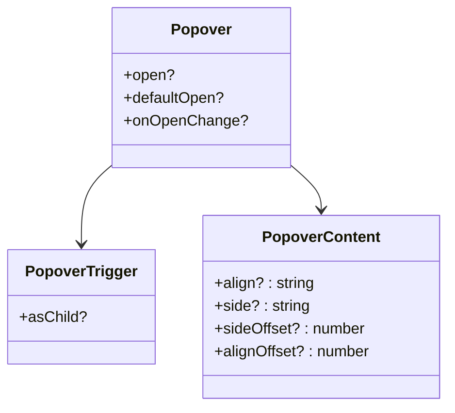

**Diagram sources**
- [popover.tsx:8-14](file://apps/web/components/ui/popover.tsx#L8-L14)
- [popover.tsx:16-48](file://apps/web/components/ui/popover.tsx#L16-L48)
- [popover.tsx:50-81](file://apps/web/components/ui/popover.tsx#L50-L81)

**Section sources**
- [popover.tsx:1-91](file://apps/web/components/ui/popover.tsx#L1-L91)

### Textarea
- Purpose: Multi-line text input.
- Props: All native textarea props; className supported.
- Styling: Consistent borders, focus ring, disabled and invalid states.
- Accessibility: Native semantics; integrates with form validation via aria-invalid.

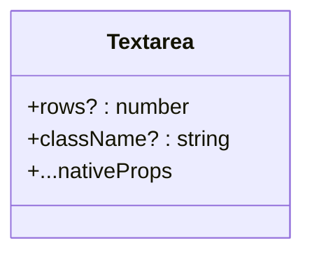

**Diagram sources**
- [textarea.tsx:5-14](file://apps/web/components/ui/textarea.tsx#L5-L14)

**Section sources**
- [textarea.tsx:1-19](file://apps/web/components/ui/textarea.tsx#L1-L19)

## Dependency Analysis
Components depend on:
- @base-ui/react primitives for accessibility and behavior.
- Tailwind CSS utilities for styling.
- lucide-react for icons where needed.
- react-hook-form for form state and validation.
- class-variance-authority for variant composition.

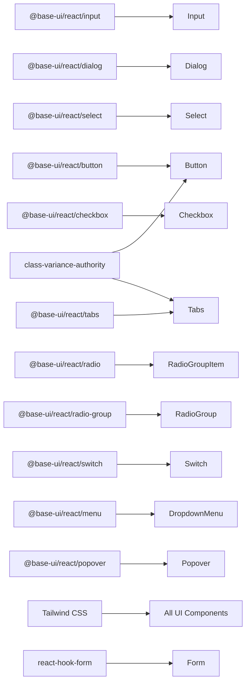

**Diagram sources**
- [button.tsx:1-59](file://apps/web/components/ui/button.tsx#L1-L59)
- [input.tsx:1-21](file://apps/web/components/ui/input.tsx#L1-L21)
- [dialog.tsx:1-157](file://apps/web/components/ui/dialog.tsx#L1-L157)
- [select.tsx:1-221](file://apps/web/components/ui/select.tsx#L1-L221)
- [checkbox.tsx:1-29](file://apps/web/components/ui/checkbox.tsx#L1-L29)
- [radio-group.tsx:1-39](file://apps/web/components/ui/radio-group.tsx#L1-L39)
- [switch.tsx:1-33](file://apps/web/components/ui/switch.tsx#L1-L33)
- [tabs.tsx:1-83](file://apps/web/components/ui/tabs.tsx#L1-L83)
- [dropdown-menu.tsx:1-117](file://apps/web/components/ui/dropdown-menu.tsx#L1-L117)
- [popover.tsx:1-91](file://apps/web/components/ui/popover.tsx#L1-L91)
- [form.tsx:1-169](file://apps/web/components/ui/form.tsx#L1-L169)

**Section sources**
- [button.tsx:1-59](file://apps/web/components/ui/button.tsx#L1-L59)
- [form.tsx:1-169](file://apps/web/components/ui/form.tsx#L1-L169)
- [tabs.tsx:1-83](file://apps/web/components/ui/tabs.tsx#L1-L83)

## Performance Considerations
- Prefer built-in variants over custom className overrides to reduce style duplication and improve maintainability.
- Use cn() for conditional classes to keep bundle size predictable.
- Avoid manual z-index on overlays; rely on primitives’ portal and stacking contexts.
- Leverage animations provided by tw-animate-css for consistent performance.
- Keep large lists in Select/Tabs lazy-rendered where possible; avoid unnecessary re-renders by memoizing expensive computations.
- Use semantic tokens instead of raw colors to minimize CSS churn during theme changes.

[No sources needed since this section provides general guidance]

## Troubleshooting Guide
- Form validation not showing messages: Ensure FormControl is wrapped with FormField and FormItem; verify ids and aria-describedby are present.
- Dialog focus not trapped: Confirm DialogContent is used and not overridden; ensure no custom focus handlers interfere.
- Select items not updating: If using children-based items, ensure extractSelectItems can parse them; otherwise pass explicit items prop.
- Dropdown menu positioning issues: Adjust align/side/sideOffset/alignOffset on DropdownMenuContent to fit viewport constraints.
- Switch/Checkbox/Radio not reflecting state: Verify controlled vs uncontrolled usage matches your form state; ensure onChange updates the bound value.
- Dark mode not applying: Ensure .dark class is applied to root element and CSS variables are defined for both light and dark themes.

**Section sources**
- [form.tsx:45-66](file://apps/web/components/ui/form.tsx#L45-L66)
- [dialog.tsx:42-79](file://apps/web/components/ui/dialog.tsx#L42-L79)
- [select.tsx:10-26](file://apps/web/components/ui/select.tsx#L10-L26)
- [dropdown-menu.tsx:15-47](file://apps/web/components/ui/dropdown-menu.tsx#L15-L47)
- [switch.tsx:7-30](file://apps/web/components/ui/switch.tsx#L7-L30)
- [checkbox.tsx:8-25](file://apps/web/components/ui/checkbox.tsx#L8-L25)
- [radio-group.tsx:18-36](file://apps/web/components/ui/radio-group.tsx#L18-L36)
- [globals.css:1-39](file://apps/web/app/globals.css#L1-L39)

## Conclusion
This base UI component library provides accessible, themeable, and composable primitives for building robust user interfaces. By leveraging @base-ui/react for behavior, Tailwind CSS for styling, and semantic tokens for theming, the components deliver consistent visuals, strong accessibility, and flexible customization. Follow the recommended composition patterns, form handling guidelines, and keyboard navigation expectations to build inclusive and performant applications.

[No sources needed since this section summarizes without analyzing specific files]