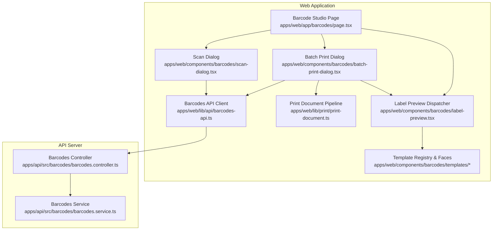
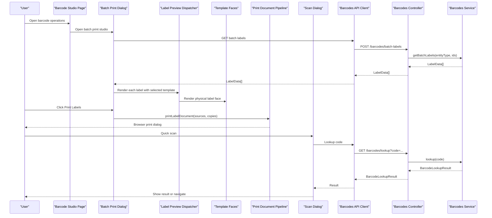
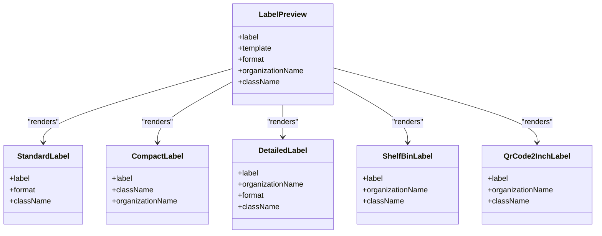
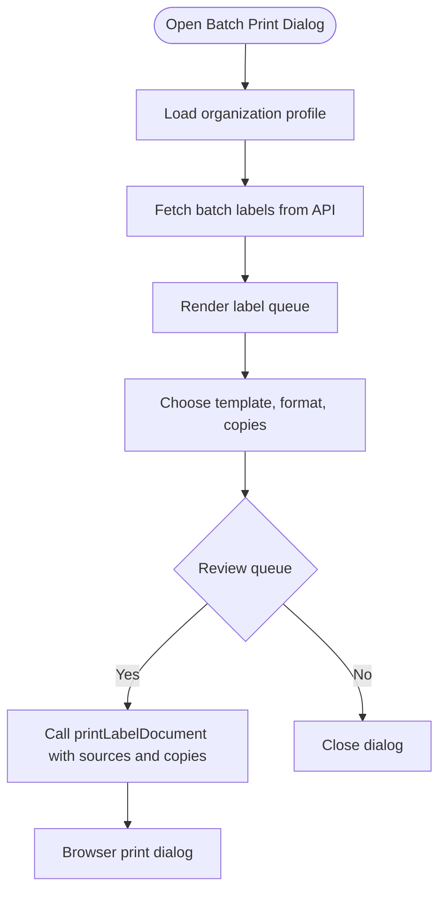
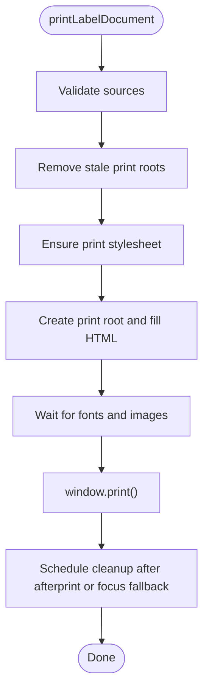
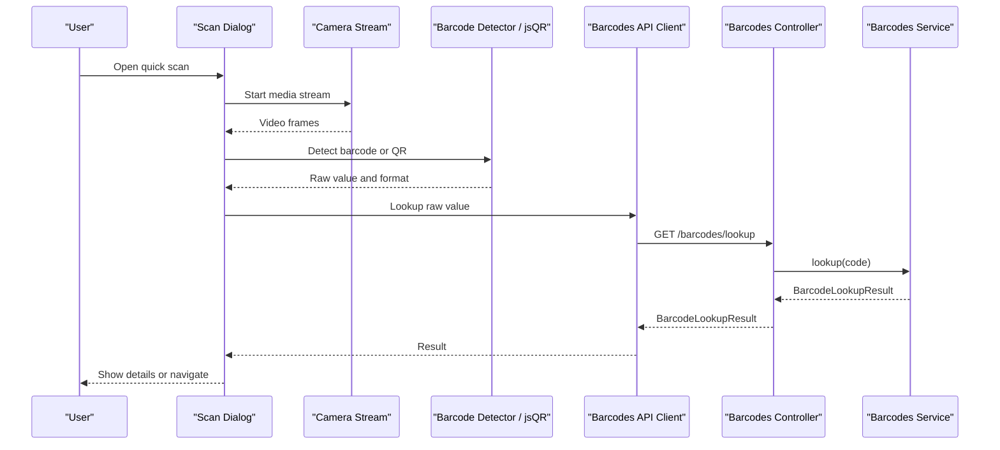
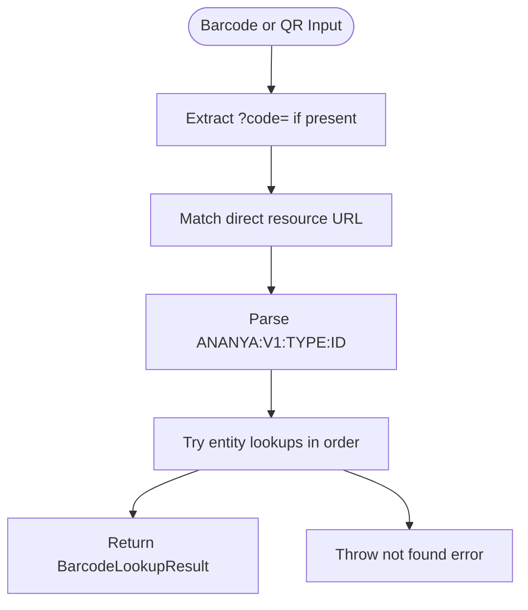
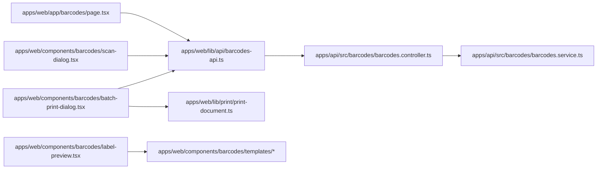

# Barcode & Label Management

<cite>
**Referenced Files in This Document**
- [apps/web/app/barcodes/page.tsx](file://apps/web/app/barcodes/page.tsx)
- [apps/web/components/barcodes/label-preview.tsx](file://apps/web/components/barcodes/label-preview.tsx)
- [apps/web/components/barcodes/templates/index.ts](file://apps/web/components/barcodes/templates/index.ts)
- [apps/web/components/barcodes/templates/registry.ts](file://apps/web/components/barcodes/templates/registry.ts)
- [apps/web/components/barcodes/templates/standard-label.tsx](file://apps/web/components/barcodes/templates/standard-label.tsx)
- [apps/web/components/barcodes/templates/compact-label.tsx](file://apps/web/components/barcodes/templates/compact-label.tsx)
- [apps/web/components/barcodes/templates/detailed-label.tsx](file://apps/web/components/barcodes/templates/detailed-label.tsx)
- [apps/web/components/barcodes/templates/shelf-bin-label.tsx](file://apps/web/components/barcodes/templates/shelf-bin-label.tsx)
- [apps/web/components/barcodes/templates/qr-code-2-inch-label.tsx](file://apps/web/components/barcodes/templates/qr-code-2-inch-label.tsx)
- [apps/web/components/barcodes/batch-print-dialog.tsx](file://apps/web/components/barcodes/batch-print-dialog.tsx)
- [apps/web/components/barcodes/scan-dialog.tsx](file://apps/web/components/barcodes/scan-dialog.tsx)
- [apps/web/lib/print/print-document.ts](file://apps/web/lib/print/print-document.ts)
- [apps/web/lib/api/barcodes-api.ts](file://apps/web/lib/api/barcodes-api.ts)
- [apps/api/src/barcodes/barcodes.controller.ts](file://apps/api/src/barcodes/barcodes.controller.ts)
- [apps/api/src/barcodes/barcodes.service.ts](file://apps/api/src/barcodes/barcodes.service.ts)
</cite>

## Table of Contents
1. [Introduction](#introduction)
2. [Project Structure](#project-structure)
3. [Core Components](#core-components)
4. [Architecture Overview](#architecture-overview)
5. [Detailed Component Analysis](#detailed-component-analysis)
6. [Dependency Analysis](#dependency-analysis)
7. [Performance Considerations](#performance-considerations)
8. [Troubleshooting Guide](#troubleshooting-guide)
9. [Conclusion](#conclusion)

## Introduction
This document explains the barcode and label management system used to generate, preview, scan, and print labels for inventory entities such as components, locations, purchase orders, work orders, and projects. It covers:

- Barcode viewers and QR code generation.
- Template-based label rendering with physical dimensions.
- Batch printing workflows and print dialog behavior.
- Scanner integration through camera, manual input, and image upload.
- Backend lookup and payload generation.
- Customization guidance for templates and formats.
- Optimization strategies for large batch prints.

The system is split between a Next.js web application that renders labels and handles scanning/printing, and a NestJS API that resolves barcodes and builds label payloads.

## Project Structure
The barcode and label feature spans three main areas:

- Web UI page and dialogs for scanning, previewing, and printing.
- A template registry and individual label face components.
- A shared print pipeline that serializes label faces into a dedicated print sheet.
- An API controller and service that resolve codes and build label data.

**Diagram sources**
- [apps/web/app/barcodes/page.tsx:1-46](file://apps/web/app/barcodes/page.tsx#L1-L46)
- [apps/web/components/barcodes/label-preview.tsx:1-24](file://apps/web/components/barcodes/label-preview.tsx#L1-L24)
- [apps/web/components/barcodes/templates/index.ts:1-41](file://apps/web/components/barcodes/templates/index.ts#L1-L41)
- [apps/web/components/barcodes/batch-print-dialog.tsx:1-32](file://apps/web/components/barcodes/batch-print-dialog.tsx#L1-L32)
- [apps/web/components/barcodes/scan-dialog.tsx:1-29](file://apps/web/components/barcodes/scan-dialog.tsx#L1-L29)
- [apps/web/lib/print/print-document.ts:1-57](file://apps/web/lib/print/print-document.ts#L1-L57)
- [apps/web/lib/api/barcodes-api.ts:1-44](file://apps/web/lib/api/barcodes-api.ts#L1-L44)
- [apps/api/src/barcodes/barcodes.controller.ts:1-14](file://apps/api/src/barcodes/barcodes.controller.ts#L1-L14)
- [apps/api/src/barcodes/barcodes.service.ts:1-44](file://apps/api/src/barcodes/barcodes.service.ts#L1-L44)

**Section sources**
- [apps/web/app/barcodes/page.tsx:1-46](file://apps/web/app/barcodes/page.tsx#L1-L46)
- [apps/web/components/barcodes/templates/index.ts:1-41](file://apps/web/components/barcodes/templates/index.ts#L1-L41)
- [apps/web/lib/print/print-document.ts:1-57](file://apps/web/lib/print/print-document.ts#L1-L57)
- [apps/api/src/barcodes/barcodes.controller.ts:1-14](file://apps/api/src/barcodes/barcodes.controller.ts#L1-L14)
- [apps/api/src/barcodes/barcodes.service.ts:1-44](file://apps/api/src/barcodes/barcodes.service.ts#L1-L44)

## Core Components
- Barcode studio page: entry point for quick scanning, batch printing, and KPIs about printable locations and components.
- Label preview dispatcher: selects a template based on the chosen template key and renders one physical label face.
- Template registry: central declaration of supported templates, picker labels, sizes, and QR-only rules.
- Individual label templates: fixed-size React components for standard, compact, detailed, shelf/bin, and QR-focused labels.
- Batch print dialog: generates a queue of labels, lets users choose template, format, and copies, then triggers printing.
- Print document pipeline: creates an off-screen print root, serializes label faces, waits for fonts and images, and calls the browser print dialog.
- Scanner dialog: supports live camera scanning, manual text entry, image upload decoding, optional auto-navigation, and backend lookup.
- Barcodes API client: defines types and HTTP methods for lookup, single payload generation, and batch label generation.
- Barcodes controller and service: validate inputs, resolve entity identifiers, construct QR payloads, and return label data.

**Section sources**
- [apps/web/app/barcodes/page.tsx:335-387](file://apps/web/app/barcodes/page.tsx#L335-L387)
- [apps/web/components/barcodes/label-preview.tsx:26-34](file://apps/web/components/barcodes/label-preview.tsx#L26-L34)
- [apps/web/components/barcodes/templates/registry.ts:1-65](file://apps/web/components/barcodes/templates/registry.ts#L1-L65)
- [apps/web/components/barcodes/batch-print-dialog.tsx:48-134](file://apps/web/components/barcodes/batch-print-dialog.tsx#L48-L134)
- [apps/web/lib/print/print-document.ts:82-95](file://apps/web/lib/print/print-document.ts#L82-L95)
- [apps/web/components/barcodes/scan-dialog.tsx:104-134](file://apps/web/components/barcodes/scan-dialog.tsx#L104-L134)
- [apps/web/lib/api/barcodes-api.ts:45-84](file://apps/web/lib/api/barcodes-api.ts#L45-L84)
- [apps/api/src/barcodes/barcodes.controller.ts:48-68](file://apps/api/src/barcodes/barcodes.controller.ts#L48-L68)
- [apps/api/src/barcodes/barcodes.service.ts:53-149](file://apps/api/src/barcodes/barcodes.service.ts#L53-L149)

## Architecture Overview
The barcode and label workflow connects user actions in the web app to backend resolution and back to rendered labels or scanned results.

**Diagram sources**
- [apps/web/app/barcodes/page.tsx:335-387](file://apps/web/app/barcodes/page.tsx#L335-L387)
- [apps/web/components/barcodes/batch-print-dialog.tsx:97-134](file://apps/web/components/barcodes/batch-print-dialog.tsx#L97-L134)
- [apps/web/components/barcodes/label-preview.tsx:35-116](file://apps/web/components/barcodes/label-preview.tsx#L35-L116)
- [apps/web/lib/print/print-document.ts:312-335](file://apps/web/lib/print/print-document.ts#L312-L335)
- [apps/web/components/barcodes/scan-dialog.tsx:171-226](file://apps/web/components/barcodes/scan-dialog.tsx#L171-L226)
- [apps/web/lib/api/barcodes-api.ts:45-84](file://apps/web/lib/api/barcodes-api.ts#L45-L84)
- [apps/api/src/barcodes/barcodes.controller.ts:48-68](file://apps/api/src/barcodes/barcodes.controller.ts#L48-L68)
- [apps/api/src/barcodes/barcodes.service.ts:53-149](file://apps/api/src/barcodes/barcodes.service.ts#L53-L149)

## Detailed Component Analysis

### Template System and Label Faces
The template system is centralized:

- The registry defines the union of template keys, picker labels, physical sizes, and QR-only rules.
- The index file re-exports template options, QR-only helpers, and all label component types.
- The label preview dispatcher maps a template key to a specific React component.
- Each template component declares a fixed physical size using millimeter units so printed output matches the sticker box.

Supported templates include:

| Template Key | Physical Size | Notes |
|---|---:|---|
| STANDARD | 101.6 mm × 50.8 mm | Default label with title, subtitle, item code, QR, and linear barcode. |
| COMPACT | 50.8 mm × 25.4 mm | Compact rack-edge label with QR. |
| COMPACT_HALF_INCH | Smaller compact variant | Used for very tight spaces. |
| DETAILED | 101.6 mm × 76.2 mm | Larger label with organization footer and linear barcode. |
| SHELF_BIN | 76.2 mm × 38.1 mm | Location-focused tag with large readable text. |
| QR_CODE_2_INCH | 32 mm × 50.8 mm | QR-focused portrait label. |
| QR_CODE_1_INCH | QR-focused small label | QR-only template. |
| QR_CODE_11MM | 11 mm × 8 mm | Small QR-only label. |

QR-only templates disable the linear barcode format selector because they do not render a 1D barcode.

**Diagram sources**
- [apps/web/components/barcodes/label-preview.tsx:35-116](file://apps/web/components/barcodes/label-preview.tsx#L35-L116)
- [apps/web/components/barcodes/templates/standard-label.tsx:8-27](file://apps/web/components/barcodes/templates/standard-label.tsx#L8-L27)
- [apps/web/components/barcodes/templates/compact-label.tsx:6-22](file://apps/web/components/barcodes/templates/compact-label.tsx#L6-L22)
- [apps/web/components/barcodes/templates/detailed-label.tsx:7-29](file://apps/web/components/barcodes/templates/detailed-label.tsx#L7-L29)
- [apps/web/components/barcodes/templates/shelf-bin-label.tsx:7-29](file://apps/web/components/barcodes/templates/shelf-bin-label.tsx#L7-L29)
- [apps/web/components/barcodes/templates/qr-code-2-inch-label.tsx:6-25](file://apps/web/components/barcodes/templates/qr-code-2-inch-label.tsx#L6-L25)

Key implementation details:

- Template registry enforces consistency between picker labels and actual face dimensions.
- Templates use absolute millimeter sizing to survive print layout.
- Linear barcode rendering is only meaningful for templates that display a 1D barcode; QR-only templates hide the format selector.
- Organization name is resolved once and passed down to avoid repeated API calls during large batches.

**Section sources**
- [apps/web/components/barcodes/templates/registry.ts:1-65](file://apps/web/components/barcodes/templates/registry.ts#L1-L65)
- [apps/web/components/barcodes/templates/index.ts:1-41](file://apps/web/components/barcodes/templates/index.ts#L1-L41)
- [apps/web/components/barcodes/label-preview.tsx:26-34](file://apps/web/components/barcodes/label-preview.tsx#L26-L34)
- [apps/web/components/barcodes/templates/standard-label.tsx:14-22](file://apps/web/components/barcodes/templates/standard-label.tsx#L14-L22)
- [apps/web/components/barcodes/templates/compact-label.tsx:12-21](file://apps/web/components/barcodes/templates/compact-label.tsx#L12-L21)
- [apps/web/components/barcodes/templates/detailed-label.tsx:14-23](file://apps/web/components/barcodes/templates/detailed-label.tsx#L14-L23)
- [apps/web/components/barcodes/templates/shelf-bin-label.tsx:13-24](file://apps/web/components/barcodes/templates/shelf-bin-label.tsx#L13-L24)
- [apps/web/components/barcodes/templates/qr-code-2-inch-label.tsx:12-20](file://apps/web/components/barcodes/templates/qr-code-2-inch-label.tsx#L12-L20)

### Barcode Viewers and QR Code Generation
- Linear barcodes are rendered by a barcode viewer component.
- QR codes are rendered by a QR code viewer component.
- The standard and detailed templates render both QR and linear barcodes.
- QR-only templates render only the QR code.
- Supported linear barcode formats are CODE128, CODE39, EAN13, and UPCA.

Practical guidance:

- Use STANDARD or DETAILED when you need a human-readable linear barcode alongside the QR payload.
- Use QR-only templates when space is limited or when scanners primarily read QR payloads.
- Keep the selected format consistent with the expected scanner configuration.

**Section sources**
- [apps/web/components/barcodes/templates/standard-label.tsx:48-61](file://apps/web/components/barcodes/templates/standard-label.tsx#L48-L61)
- [apps/web/components/barcodes/templates/detailed-label.tsx:50-56](file://apps/web/components/barcodes/templates/detailed-label.tsx#L50-L56)
- [apps/web/components/barcodes/templates/qr-code-2-inch-label.tsx:36-41](file://apps/web/components/barcodes/templates/qr-code-2-inch-label.tsx#L36-L41)
- [apps/web/lib/api/barcodes-api.ts:3-6](file://apps/web/lib/api/barcodes-api.ts#L3-L6)

### Batch Printing Workflow
The batch print dialog:

1. Loads organization profile once.
2. Requests batch label data from the backend.
3. Renders one label face per entity using the selected template.
4. Lets the user choose template, barcode format, and copies per label.
5. Prints exactly what was reviewed by serializing the rendered DOM nodes.

**Diagram sources**
- [apps/web/components/barcodes/batch-print-dialog.tsx:79-134](file://apps/web/components/barcodes/batch-print-dialog.tsx#L79-L134)
- [apps/web/lib/print/print-document.ts:312-335](file://apps/web/lib/print/print-document.ts#L312-L335)

Important behaviors:

- The on-screen queue shows one face per label. Copies are applied at print time, not in the preview.
- Copies are clamped to safe bounds before printing.
- The print pipeline uses a dedicated off-screen root so the printed sheet is independent of dialog constraints.

**Section sources**
- [apps/web/components/barcodes/batch-print-dialog.tsx:48-134](file://apps/web/components/barcodes/batch-print-dialog.tsx#L48-L134)
- [apps/web/components/barcodes/batch-print-dialog.tsx:156-223](file://apps/web/components/barcodes/batch-print-dialog.tsx#L156-L223)
- [apps/web/components/barcodes/batch-print-dialog.tsx:237-270](file://apps/web/components/barcodes/batch-print-dialog.tsx#L237-L270)

### Print Document Pipeline
The print pipeline solves a common problem: printing directly from a dialog can produce blank pages because dialog height clamps and flex layouts push label content outside the page box. Instead, it:

- Injects a stylesheet that hides everything except the print root.
- Creates a print root outside the dialog tree.
- Serializes label faces into the root.
- Waits for fonts and images.
- Calls `window.print()` on the main window.
- Cleans up the print root and stylesheet after printing.

**Diagram sources**
- [apps/web/lib/print/print-document.ts:312-335](file://apps/web/lib/print/print-document.ts#L312-L335)
- [apps/web/lib/print/print-document.ts:187-227](file://apps/web/lib/print/print-document.ts#L187-L227)
- [apps/web/lib/print/print-document.ts:240-270](file://apps/web/lib/print/print-document.ts#L240-L270)
- [apps/web/lib/print/print-document.ts:281-304](file://apps/web/lib/print/print-document.ts#L281-L304)

Key constants and contracts:

- `PRINT_SAFE_MARGIN_MM`: default page margin to avoid printer dead zones.
- `PRINT_SHEET_GAP_MM`: spacing between labels on the sheet.
- `LabelPrintSource`: a rendered node plus optional copy count.
- `PrintLabelDocumentOptions`: sources, page margin, and gap.

**Section sources**
- [apps/web/lib/print/print-document.ts:1-57](file://apps/web/lib/print/print-document.ts#L1-L57)
- [apps/web/lib/print/print-document.ts:59-95](file://apps/web/lib/print/print-document.ts#L59-L95)
- [apps/web/lib/print/print-document.ts:104-166](file://apps/web/lib/print/print-document.ts#L104-L166)
- [apps/web/lib/print/print-document.ts:172-185](file://apps/web/lib/print/print-document.ts#L172-L185)
- [apps/web/lib/print/print-document.ts:216-227](file://apps/web/lib/print/print-document.ts#L216-L227)
- [apps/web/lib/print/print-document.ts:240-304](file://apps/web/lib/print/print-document.ts#L240-L304)
- [apps/web/lib/print/print-document.ts:312-335](file://apps/web/lib/print/print-document.ts#L312-L335)

### Scanner Integration
The scanner dialog supports multiple input paths:

- Live camera scanning with native `BarcodeDetector` when available.
- Fallback QR decoding using `jsQR`.
- Manual text entry.
- Image upload decoding.
- Optional auto-navigation to the matched entity page.
- Torch control where supported.
- Camera facing mode switching.

**Diagram sources**
- [apps/web/components/barcodes/scan-dialog.tsx:228-359](file://apps/web/components/barcodes/scan-dialog.tsx#L228-L359)
- [apps/web/components/barcodes/scan-dialog.tsx:361-435](file://apps/web/components/barcodes/scan-dialog.tsx#L361-L435)
- [apps/web/components/barcodes/scan-dialog.tsx:470-500](file://apps/web/components/barcodes/scan-dialog.tsx#L470-L500)
- [apps/web/components/barcodes/scan-dialog.tsx:171-226](file://apps/web/components/barcodes/scan-dialog.tsx#L171-L226)
- [apps/web/lib/api/barcodes-api.ts:45-64](file://apps/web/lib/api/barcodes-api.ts#L45-L64)
- [apps/api/src/barcodes/barcodes.controller.ts:52-55](file://apps/api/src/barcodes/barcodes.controller.ts#L52-L55)
- [apps/api/src/barcodes/barcodes.service.ts:53-149](file://apps/api/src/barcodes/barcodes.service.ts#L53-L149)

Scanner-specific notes:

- Duplicate scans within a short cooldown are ignored to prevent repeated lookups.
- Native detector support is preferred; `jsQR` is used as a fallback.
- Center crop decoding improves accuracy for QR codes.
- Camera errors are surfaced clearly, including permission issues.
- Torch availability is detected per track and exposed conditionally.

**Section sources**
- [apps/web/components/barcodes/scan-dialog.tsx:104-134](file://apps/web/components/barcodes/scan-dialog.tsx#L104-L134)
- [apps/web/components/barcodes/scan-dialog.tsx:171-226](file://apps/web/components/barcodes/scan-dialog.tsx#L171-L226)
- [apps/web/components/barcodes/scan-dialog.tsx:228-359](file://apps/web/components/barcodes/scan-dialog.tsx#L228-L359)
- [apps/web/components/barcodes/scan-dialog.tsx:361-435](file://apps/web/components/barcodes/scan-dialog.tsx#L361-L435)
- [apps/web/components/barcodes/scan-dialog.tsx:470-500](file://apps/web/components/barcodes/scan-dialog.tsx#L470-L500)
- [apps/web/components/barcodes/scan-dialog.tsx:502-532](file://apps/web/components/barcodes/scan-dialog.tsx#L502-L532)

### Backend Barcode Resolution and Payload Generation
The backend resolves many input forms:

- URL-encoded `?code=` parameters.
- Direct resource URLs such as `/components/{id}`.
- Structured QR payloads like `ANANYA:V1:TYPE:IDENTIFIER`.
- SKU, ID, location code, PO number, production number, or project number.

Supported entity types:

| Entity Type | Identifier Sources |
|---|---|
| COMPONENT | UUID or SKU. |
| LOCATION | UUID, location code, or location name. |
| PURCHASE_ORDER | UUID or purchase order number. |
| WORK_ORDER | UUID or production number. |
| PROJECT | UUID or project number. |

Label payload fields include entity type, primary code, QR payload, title, subtitle, and optional attributes such as storage path.

**Diagram sources**
- [apps/api/src/barcodes/barcodes.service.ts:53-149](file://apps/api/src/barcodes/barcodes.service.ts#L53-L149)
- [apps/api/src/barcodes/barcodes.service.ts:405-452](file://apps/api/src/barcodes/barcodes.service.ts#L405-L452)
- [apps/api/src/barcodes/barcodes.service.ts:454-468](file://apps/api/src/barcodes/barcodes.service.ts#L454-L468)

**Section sources**
- [apps/api/src/barcodes/barcodes.service.ts:53-149](file://apps/api/src/barcodes/barcodes.service.ts#L53-L149)
- [apps/api/src/barcodes/barcodes.service.ts:151-203](file://apps/api/src/barcodes/barcodes.service.ts#L151-L203)
- [apps/api/src/barcodes/barcodes.service.ts:205-270](file://apps/api/src/barcodes/barcodes.service.ts#L205-L270)
- [apps/api/src/barcodes/barcodes.service.ts:272-378](file://apps/api/src/barcodes/barcodes.service.ts#L272-L378)
- [apps/api/src/barcodes/barcodes.service.ts:380-403](file://apps/api/src/barcodes/barcodes.service.ts#L380-L403)
- [apps/api/src/barcodes/barcodes.service.ts:405-468](file://apps/api/src/barcodes/barcodes.service.ts#L405-L468)
- [apps/api/src/barcodes/barcodes.controller.ts:48-68](file://apps/api/src/barcodes/barcodes.controller.ts#L48-L68)

## Dependency Analysis
The following diagram shows how the web components depend on the API client and how the API controller depends on the service.

**Diagram sources**
- [apps/web/app/barcodes/page.tsx:29-46](file://apps/web/app/barcodes/page.tsx#L29-L46)
- [apps/web/components/barcodes/batch-print-dialog.tsx:21-31](file://apps/web/components/barcodes/batch-print-dialog.tsx#L21-L31)
- [apps/web/components/barcodes/scan-dialog.tsx:27-29](file://apps/web/components/barcodes/scan-dialog.tsx#L27-L29)
- [apps/web/lib/api/barcodes-api.ts:1-44](file://apps/web/lib/api/barcodes-api.ts#L1-L44)
- [apps/api/src/barcodes/barcodes.controller.ts:1-14](file://apps/api/src/barcodes/barcodes.controller.ts#L1-L14)
- [apps/api/src/barcodes/barcodes.service.ts:1-44](file://apps/api/src/barcodes/barcodes.service.ts#L1-L44)
- [apps/web/components/barcodes/label-preview.tsx:6-16](file://apps/web/components/barcodes/label-preview.tsx#L6-L16)
- [apps/web/components/barcodes/batch-print-dialog.tsx:23-25](file://apps/web/components/barcodes/batch-print-dialog.tsx#L23-L25)

Coupling observations:

- The web layer depends on a stable API client contract rather than direct fetch logic.
- The template system is decoupled from the print pipeline: templates render faces, and the print pipeline serializes those faces.
- The service encapsulates entity lookup logic, keeping controllers thin.

**Section sources**
- [apps/web/lib/api/barcodes-api.ts:45-84](file://apps/web/lib/api/barcodes-api.ts#L45-L84)
- [apps/api/src/barcodes/barcodes.controller.ts:48-68](file://apps/api/src/barcodes/barcodes.controller.ts#L48-L68)
- [apps/api/src/barcodes/barcodes.service.ts:405-468](file://apps/api/src/barcodes/barcodes.service.ts#L405-L468)

## Performance Considerations
Optimizations already implemented:

- Organization profile is fetched once and reused across label instances to avoid repeated network calls.
- Batch label generation runs on the server and returns prebuilt label data.
- The print pipeline waits for fonts and images instead of blocking indefinitely.
- The print root is off-screen but laid out so the print engine does not rebuild layout from scratch.
- Copies are applied at print time, keeping the on-screen queue lightweight.

Recommendations for large quantities:

- Keep the number of unique label faces low by grouping identical items.
- Avoid heavy per-label network calls in templates; pass resolved values as props.
- Prefer QR-only templates when linear barcodes are not required.
- Use appropriate label sizes to reduce unnecessary whitespace.
- Monitor printer margins and paper size to avoid blank output.

[No sources needed since this section provides general guidance]

## Troubleshooting Guide

Common issues and resolutions:

- Blank print output:
  - Cause: Dialog height clamps pushed label content outside the page box.
  - Resolution: Use the shared print pipeline, which creates an off-screen print root and injects a stylesheet that isolates the label sheet.

- Smallest labels printing blank:
  - Cause: Printer dead border area.
  - Resolution: The print sheet applies a safe page margin by default.

- Fonts or images missing in print:
  - Cause: Print triggered before resources settled.
  - Resolution: The pipeline waits for `document.fonts.ready` and image load/error events before calling `window.print()`.

- Stale print root left behind:
  - Cause: Interrupted print flow.
  - Resolution: The pipeline removes stale print roots and cleans up the stylesheet after printing.

- Camera permission denied:
  - Cause: Browser blocked camera access.
  - Resolution: Allow camera permissions or fall back to manual entry or image upload.

- No entity matched scanned code:
  - Cause: Code does not match any supported identifier or structured QR payload.
  - Resolution: Verify the code, try the global catalog search, or confirm the QR payload follows the expected structure.

**Section sources**
- [apps/web/lib/print/print-document.ts:1-57](file://apps/web/lib/print/print-document.ts#L1-L57)
- [apps/web/lib/print/print-document.ts:65-80](file://apps/web/lib/print/print-document.ts#L65-L80)
- [apps/web/lib/print/print-document.ts:240-304](file://apps/web/lib/print/print-document.ts#L240-L304)
- [apps/web/components/barcodes/scan-dialog.tsx:361-435](file://apps/web/components/barcodes/scan-dialog.tsx#L361-L435)
- [apps/api/src/barcodes/barcodes.service.ts:53-149](file://apps/api/src/barcodes/barcodes.service.ts#L53-L149)

## Conclusion
The barcode and label management system provides a robust, template-driven approach to generating and printing labels, combined with flexible scanning capabilities and reliable backend resolution. The design separates concerns cleanly:

- Templates define physical label faces.
- The preview dispatcher selects templates.
- The batch dialog manages queues and copies.
- The print pipeline ensures consistent, accurate output.
- The scanner dialog supports camera, manual, and image-based input.
- The backend resolves many identifier formats and produces standardized label payloads.

For customization, add a new template to the registry, implement a fixed-size label component, expose it through the index, and wire it into the preview dispatcher. For performance, reuse resolved data, prefer QR-only templates when possible, and rely on the shared print pipeline for reliable output at scale.

[No sources needed since this section summarizes without analyzing specific files]