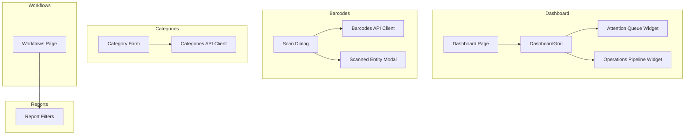
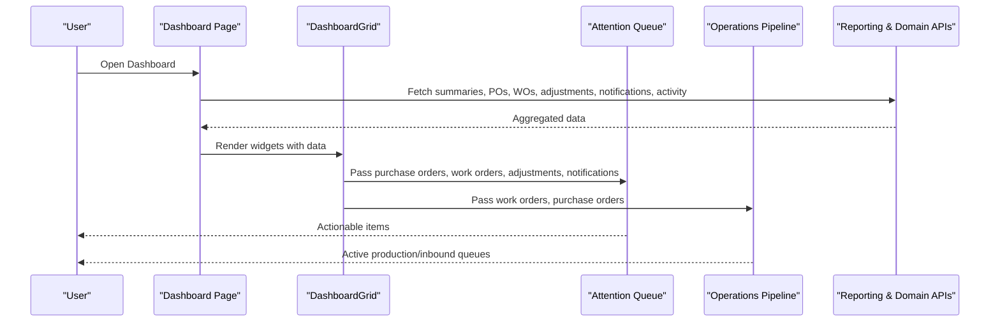
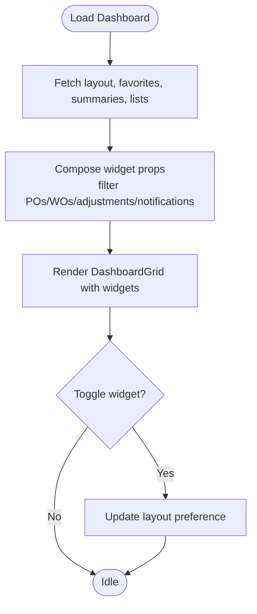
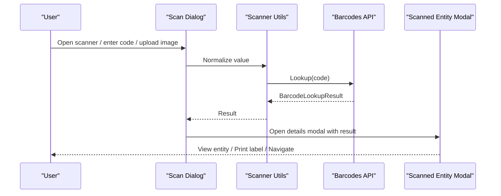
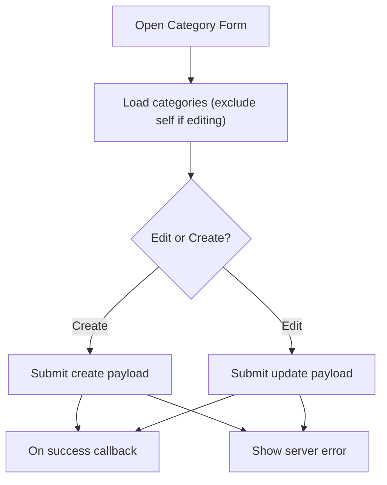
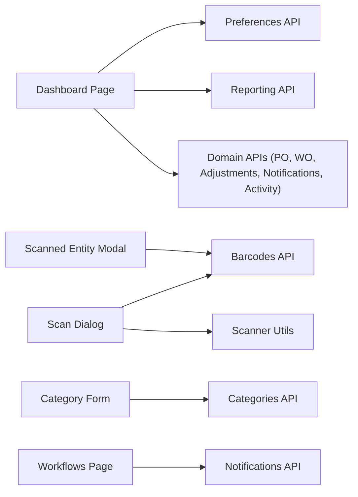

# Business Components

<cite>
**Referenced Files in This Document**
- [apps/web/app/dashboard/page.tsx](file://apps/web/app/dashboard/page.tsx)
- [apps/web/components/dashboard/dashboard-attention-queue.tsx](file://apps/web/components/dashboard/dashboard-attention-queue.tsx)
- [apps/web/components/dashboard/dashboard-operations-pipeline.tsx](file://apps/web/components/dashboard/dashboard-operations-pipeline.tsx)
- [apps/web/components/ui/dashboard-grid.tsx](file://apps/web/components/ui/dashboard-grid.tsx)
- [apps/web/components/barcodes/scan-dialog.tsx](file://apps/web/components/barcodes/scan-dialog.tsx)
- [apps/web/components/barcodes/scanned-entity-modal.tsx](file://apps/web/components/barcodes/scanned-entity-modal.tsx)
- [apps/web/lib/api/barcodes-api.ts](file://apps/web/lib/api/barcodes-api.ts)
- [apps/web/lib/scanner.ts](file://apps/web/lib/scanner.ts)
- [apps/web/components/categories/category-form.tsx](file://apps/web/components/categories/category-form.tsx)
- [apps/web/lib/api/categories-api.ts](file://apps/web/lib/api/categories-api.ts)
- [apps/web/app/categories/page.tsx](file://apps/web/app/categories/page.tsx)
- [apps/web/components/reports/report-filters.tsx](file://apps/web/components/reports/report-filters.tsx)
- [apps/web/app/workflows/page.tsx](file://apps/web/app/workflows/page.tsx)
</cite>

## Table of Contents
1. Introduction
2. Project Structure
3. Core Components
4. Architecture Overview
5. Detailed Component Analysis
6. Dependency Analysis
7. Performance Considerations
8. Troubleshooting Guide
9. Conclusion

## Introduction
This document explains the business-specific components that implement core application functionality across dashboards, barcode scanning, category management, reporting filters, and workflow automation. It focuses on state management patterns, data binding strategies, backend API integration, customization points, domain events, and performance considerations for large datasets and real-time updates.

## Project Structure
The relevant business components are organized under apps/web:
- Dashboard widgets live under components/dashboard and are composed by a shared grid layout.
- Barcode scanning is implemented as a dialog with a details modal and a unified API client.
- Category management provides a form backed by validation and an API client.
- Reporting filters provide reusable filter UI consumed by report pages.
- Workflow builder page orchestrates listing and creation of automation rules.

**Diagram sources**
- [apps/web/app/dashboard/page.tsx:95-206](file://apps/web/app/dashboard/page.tsx#L95-L206)
- [apps/web/components/ui/dashboard-grid.tsx:24-46](file://apps/web/components/ui/dashboard-grid.tsx#L24-L46)
- [apps/web/components/barcodes/scan-dialog.tsx:104-226](file://apps/web/components/barcodes/scan-dialog.tsx#L104-L226)
- [apps/web/components/barcodes/scanned-entity-modal.tsx:52-79](file://apps/web/components/barcodes/scanned-entity-modal.tsx#L52-L79)
- [apps/web/lib/api/barcodes-api.ts:45-84](file://apps/web/lib/api/barcodes-api.ts#L45-L84)
- [apps/web/components/categories/category-form.tsx:46-117](file://apps/web/components/categories/category-form.tsx#L46-L117)
- [apps/web/lib/api/categories-api.ts:29-43](file://apps/web/lib/api/categories-api.ts#L29-L43)
- [apps/web/components/reports/report-filters.tsx:34-51](file://apps/web/components/reports/report-filters.tsx#L34-L51)
- [apps/web/app/workflows/page.tsx:14-36](file://apps/web/app/workflows/page.tsx#L14-L36)

**Section sources**
- [apps/web/app/dashboard/page.tsx:95-206](file://apps/web/app/dashboard/page.tsx#L95-L206)
- [apps/web/components/ui/dashboard-grid.tsx:24-46](file://apps/web/components/ui/dashboard-grid.tsx#L24-L46)
- [apps/web/components/barcodes/scan-dialog.tsx:104-226](file://apps/web/components/barcodes/scan-dialog.tsx#L104-L226)
- [apps/web/components/barcodes/scanned-entity-modal.tsx:52-79](file://apps/web/components/barcodes/scanned-entity-modal.tsx#L52-L79)
- [apps/web/lib/api/barcodes-api.ts:45-84](file://apps/web/lib/api/barcodes-api.ts#L45-L84)
- [apps/web/components/categories/category-form.tsx:46-117](file://apps/web/components/categories/category-form.tsx#L46-L117)
- [apps/web/lib/api/categories-api.ts:29-43](file://apps/web/lib/api/categories-api.ts#L29-L43)
- [apps/web/components/reports/report-filters.tsx:34-51](file://apps/web/components/reports/report-filters.tsx#L34-L51)
- [apps/web/app/workflows/page.tsx:14-36](file://apps/web/app/workflows/page.tsx#L14-L36)

## Core Components
- Dashboard widgets: attention queue and operations pipeline render operational highlights and active orders; they consume aggregated data from multiple APIs and present actionable items.
- Barcode scanning: a high-performance scanner dialog supports camera capture, manual entry, image upload, and fallback decoding; results open a details modal and can navigate to entity pages or print labels.
- Category management: a validated form creates or updates categories and integrates with parent selection and error handling.
- Reporting filters: a reusable filter component standardizes date ranges, status, search, and entity filters across reports.
- Workflow builder: a page lists automation rules and opens a builder modal to create new workflows.

**Section sources**
- [apps/web/components/dashboard/dashboard-attention-queue.tsx:45-133](file://apps/web/components/dashboard/dashboard-attention-queue.tsx#L45-L133)
- [apps/web/components/dashboard/dashboard-operations-pipeline.tsx:26-43](file://apps/web/components/dashboard/dashboard-operations-pipeline.tsx#L26-L43)
- [apps/web/components/barcodes/scan-dialog.tsx:104-226](file://apps/web/components/barcodes/scan-dialog.tsx#L104-L226)
- [apps/web/components/barcodes/scanned-entity-modal.tsx:52-79](file://apps/web/components/barcodes/scanned-entity-modal.tsx#L52-L79)
- [apps/web/components/categories/category-form.tsx:46-117](file://apps/web/components/categories/category-form.tsx#L46-L117)
- [apps/web/components/reports/report-filters.tsx:34-51](file://apps/web/components/reports/report-filters.tsx#L34-L51)
- [apps/web/app/workflows/page.tsx:14-36](file://apps/web/app/workflows/page.tsx#L14-L36)

## Architecture Overview
The dashboard aggregates multiple data sources and renders configurable widgets. The barcode flow normalizes input, decodes via native or library, resolves through a single lookup endpoint, and presents a consistent entity view. Categories use a form-driven pattern with schema validation and API calls. Reports share a common filter contract. Workflows list and manage automation rules.

**Diagram sources**
- [apps/web/app/dashboard/page.tsx:125-206](file://apps/web/app/dashboard/page.tsx#L125-L206)
- [apps/web/components/ui/dashboard-grid.tsx:24-46](file://apps/web/components/ui/dashboard-grid.tsx#L24-L46)
- [apps/web/components/dashboard/dashboard-attention-queue.tsx:45-133](file://apps/web/components/dashboard/dashboard-attention-queue.tsx#L45-L133)
- [apps/web/components/dashboard/dashboard-operations-pipeline.tsx:26-43](file://apps/web/components/dashboard/dashboard-operations-pipeline.tsx#L26-L43)

## Detailed Component Analysis

### Dashboard Widgets
- State management: The dashboard page loads layout preferences, favorites, and multiple domain summaries concurrently using Promise.allSettled. It maintains widget enablement state and persists changes to user preferences.
- Data binding: Widgets receive pre-filtered arrays (e.g., open purchase orders, active work orders, pending adjustments, unread high-priority notifications).
- Integration points: Uses reporting APIs and domain APIs for purchase orders, work orders, stock adjustments, notifications, and activity feed.
- Customization: Users can toggle widget visibility and restore defaults; the grid respects per-widget enabled flags.

**Diagram sources**
- [apps/web/app/dashboard/page.tsx:125-206](file://apps/web/app/dashboard/page.tsx#L125-L206)
- [apps/web/components/ui/dashboard-grid.tsx:24-46](file://apps/web/components/ui/dashboard-grid.tsx#L24-L46)

**Section sources**
- [apps/web/app/dashboard/page.tsx:95-206](file://apps/web/app/dashboard/page.tsx#L95-L206)
- [apps/web/components/ui/dashboard-grid.tsx:24-46](file://apps/web/components/ui/dashboard-grid.tsx#L24-L46)

#### Attention Queue Widget
- Purpose: Surface actionable items requiring immediate attention across procurement, manufacturing, inventory adjustments, and alerts.
- Logic: Builds a unified list from purchase orders, work orders, stock adjustments, and notifications, limiting entries to keep UI concise.
- Presentation: Each item includes title, subtitle, status, optional priority badge, timestamp, and action link.

**Section sources**
- [apps/web/components/dashboard/dashboard-attention-queue.tsx:45-133](file://apps/web/components/dashboard/dashboard-attention-queue.tsx#L45-L133)
- [apps/web/components/dashboard/dashboard-attention-queue.tsx:151-253](file://apps/web/components/dashboard/dashboard-attention-queue.tsx#L151-L253)

#### Operations Pipeline Widget
- Purpose: Show active production and inbound delivery queues with progress indicators and quick actions.
- Logic: Filters out completed/closed/cancelled work orders and selects open purchase orders; computes completion percentages.
- Presentation: Tabbed interface between Production Queue and Inbound Deliveries with counts and links to full pages.

**Section sources**
- [apps/web/components/dashboard/dashboard-operations-pipeline.tsx:26-43](file://apps/web/components/dashboard/dashboard-operations-pipeline.tsx#L26-L43)
- [apps/web/components/dashboard/dashboard-operations-pipeline.tsx:138-283](file://apps/web/components/dashboard/dashboard-operations-pipeline.tsx#L138-L283)

### Barcode Scanning Components
- Scanner dialog: Supports camera-based scanning with native BarcodeDetector and jsQR fallback, manual text entry, and image upload. Implements cooldown to prevent duplicate scans, audio feedback, and auto-navigation option.
- Resolution: Normalizes input and delegates to a single lookup endpoint; handles URL-encoded code parameters and errors gracefully.
- Details modal: Presents scanned entity information, navigation controls, printing options, and context-aware views (location containing components, component stock/location, order/project details).

**Diagram sources**
- [apps/web/components/barcodes/scan-dialog.tsx:171-226](file://apps/web/components/barcodes/scan-dialog.tsx#L171-L226)
- [apps/web/lib/scanner.ts:185-205](file://apps/web/lib/scanner.ts#L185-L205)
- [apps/web/lib/api/barcodes-api.ts:45-65](file://apps/web/lib/api/barcodes-api.ts#L45-L65)
- [apps/web/components/barcodes/scanned-entity-modal.tsx:52-79](file://apps/web/components/barcodes/scanned-entity-modal.tsx#L52-L79)

**Section sources**
- [apps/web/components/barcodes/scan-dialog.tsx:104-226](file://apps/web/components/barcodes/scan-dialog.tsx#L104-L226)
- [apps/web/components/barcodes/scan-dialog.tsx:228-359](file://apps/web/components/barcodes/scan-dialog.tsx#L228-L359)
- [apps/web/components/barcodes/scan-dialog.tsx:361-435](file://apps/web/components/barcodes/scan-dialog.tsx#L361-L435)
- [apps/web/components/barcodes/scan-dialog.tsx:470-500](file://apps/web/components/barcodes/scan-dialog.tsx#L470-L500)
- [apps/web/components/barcodes/scan-dialog.tsx:502-532](file://apps/web/components/barcodes/scan-dialog.tsx#L502-L532)
- [apps/web/components/barcodes/scan-dialog.tsx:534-800](file://apps/web/components/barcodes/scan-dialog.tsx#L534-L800)
- [apps/web/lib/scanner.ts:185-205](file://apps/web/lib/scanner.ts#L185-L205)
- [apps/web/lib/api/barcodes-api.ts:45-84](file://apps/web/lib/api/barcodes-api.ts#L45-L84)
- [apps/web/components/barcodes/scanned-entity-modal.tsx:52-79](file://apps/web/components/barcodes/scanned-entity-modal.tsx#L52-L79)
- [apps/web/components/barcodes/scanned-entity-modal.tsx:89-118](file://apps/web/components/barcodes/scanned-entity-modal.tsx#L89-L118)
- [apps/web/components/barcodes/scanned-entity-modal.tsx:186-289](file://apps/web/components/barcodes/scanned-entity-modal.tsx#L186-L289)
- [apps/web/components/barcodes/scanned-entity-modal.tsx:291-356](file://apps/web/components/barcodes/scanned-entity-modal.tsx#L291-L356)
- [apps/web/components/barcodes/scanned-entity-modal.tsx:359-421](file://apps/web/components/barcodes/scanned-entity-modal.tsx#L359-L421)

### Category Management Interface
- Form-driven editing: Uses a schema resolver for validation, controlled inputs, and submit handlers that call create or update endpoints based on edit mode.
- Parent selection: Loads all categories and excludes self when editing to prevent circular references.
- Error handling: Displays server errors inline and disables submit during submission.

**Diagram sources**
- [apps/web/components/categories/category-form.tsx:55-69](file://apps/web/components/categories/category-form.tsx#L55-L69)
- [apps/web/components/categories/category-form.tsx:86-117](file://apps/web/components/categories/category-form.tsx#L86-L117)

**Section sources**
- [apps/web/components/categories/category-form.tsx:25-38](file://apps/web/components/categories/category-form.tsx#L25-L38)
- [apps/web/components/categories/category-form.tsx:46-117](file://apps/web/components/categories/category-form.tsx#L46-L117)
- [apps/web/lib/api/categories-api.ts:29-43](file://apps/web/lib/api/categories-api.ts#L29-L43)
- [apps/web/app/categories/page.tsx:35-74](file://apps/web/app/categories/page.tsx#L35-L74)

### Reporting Tools (Filters)
- Reusable filter state: Encapsulates date range, entity IDs, status, and free-text search.
- Interaction: Provides reset functionality and emits change events to parent components for query execution.
- Extensibility: Optional status filter with configurable options.

**Section sources**
- [apps/web/components/reports/report-filters.tsx:16-32](file://apps/web/components/reports/report-filters.tsx#L16-L32)
- [apps/web/components/reports/report-filters.tsx:34-51](file://apps/web/components/reports/report-filters.tsx#L34-L51)
- [apps/web/components/reports/report-filters.tsx:71-143](file://apps/web/components/reports/report-filters.tsx#L71-L143)

### Workflow Builder
- Listing: Loads automation workflows and displays metrics such as total rules and active rules.
- Creation: Opens a builder modal to create new rules and refreshes the list upon creation.
- Permissions: Wrapped with a permission guard for administration access.

**Section sources**
- [apps/web/app/workflows/page.tsx:14-36](file://apps/web/app/workflows/page.tsx#L14-L36)
- [apps/web/app/workflows/page.tsx:41-75](file://apps/web/app/workflows/page.tsx#L41-L75)
- [apps/web/app/workflows/page.tsx:77-155](file://apps/web/app/workflows/page.tsx#L77-L155)

## Dependency Analysis
- Dashboard depends on multiple domain APIs and preferences to compose widget data and persist layout.
- Barcode scanning depends on a unified API client and scanner utilities; the details modal reuses ERP entity presentation.
- Category form depends on categories API and uses react-hook-form with zod validation.
- Report filters are independent and consumed by report pages.
- Workflows page depends on notifications API for rule definitions.

**Diagram sources**
- [apps/web/app/dashboard/page.tsx:125-206](file://apps/web/app/dashboard/page.tsx#L125-L206)
- [apps/web/components/barcodes/scan-dialog.tsx:171-226](file://apps/web/components/barcodes/scan-dialog.tsx#L171-L226)
- [apps/web/lib/scanner.ts:185-205](file://apps/web/lib/scanner.ts#L185-L205)
- [apps/web/lib/api/barcodes-api.ts:45-84](file://apps/web/lib/api/barcodes-api.ts#L45-L84)
- [apps/web/components/categories/category-form.tsx:86-117](file://apps/web/components/categories/category-form.tsx#L86-L117)
- [apps/web/lib/api/categories-api.ts:29-43](file://apps/web/lib/api/categories-api.ts#L29-L43)
- [apps/web/app/workflows/page.tsx:20-32](file://apps/web/app/workflows/page.tsx#L20-L32)

**Section sources**
- [apps/web/app/dashboard/page.tsx:125-206](file://apps/web/app/dashboard/page.tsx#L125-L206)
- [apps/web/components/barcodes/scan-dialog.tsx:171-226](file://apps/web/components/barcodes/scan-dialog.tsx#L171-L226)
- [apps/web/lib/scanner.ts:185-205](file://apps/web/lib/scanner.ts#L185-L205)
- [apps/web/lib/api/barcodes-api.ts:45-84](file://apps/web/lib/api/barcodes-api.ts#L45-L84)
- [apps/web/components/categories/category-form.tsx:86-117](file://apps/web/components/categories/category-form.tsx#L86-L117)
- [apps/web/lib/api/categories-api.ts:29-43](file://apps/web/lib/api/categories-api.ts#L29-L43)
- [apps/web/app/workflows/page.tsx:20-32](file://apps/web/app/workflows/page.tsx#L20-L32)

## Performance Considerations
- Dashboard concurrency: Use concurrent fetches with Promise.allSettled to reduce load time and handle partial failures gracefully.
- Widget filtering: Pre-filter arrays in the dashboard layer to minimize re-renders and computations inside widgets.
- Barcode scanning: Prefer native BarcodeDetector when available; fall back to jsQR with center crop and full-frame scan to balance accuracy and performance. Limit frame processing rate (~20 FPS) and avoid unnecessary canvas redraws.
- Cooldown and deduplication: Prevent repeated lookups within a short window to reduce network load and UI churn.
- Large datasets: Keep lists bounded (e.g., top N items) in widgets; paginate or virtualize where applicable in other screens.
- Real-time updates: Consider polling intervals or event-driven updates for attention queue and pipeline widgets to reflect current state without full reloads.

[No sources needed since this section provides general guidance]

## Troubleshooting Guide
- Dashboard loading errors: If initial aggregation fails, show an error state with retry; ensure individual widget fetches do not block others.
- Barcode scan failures: Handle unknown codes, unreadable images, and permission denials with clear messages; offer fallbacks like manual entry or global catalog search.
- Camera issues: Detect unsupported browsers or denied permissions; surface actionable instructions and allow switching cameras or toggling torch when available.
- Category form errors: Display server-side validation errors and disable submit while submitting; ensure parent category excludes self to prevent cycles.
- Workflow loading errors: Present an error state with retry; ensure empty states guide users to create their first rule.

**Section sources**
- [apps/web/app/dashboard/page.tsx:227-239](file://apps/web/app/dashboard/page.tsx#L227-L239)
- [apps/web/components/barcodes/scan-dialog.tsx:213-224](file://apps/web/components/barcodes/scan-dialog.tsx#L213-L224)
- [apps/web/components/barcodes/scan-dialog.tsx:361-435](file://apps/web/components/barcodes/scan-dialog.tsx#L361-L435)
- [apps/web/components/barcodes/scan-dialog.tsx:774-800](file://apps/web/components/barcodes/scan-dialog.tsx#L774-L800)
- [apps/web/components/categories/category-form.tsx:108-117](file://apps/web/components/categories/category-form.tsx#L108-L117)
- [apps/web/app/workflows/page.tsx:77-85](file://apps/web/app/workflows/page.tsx#L77-L85)

## Conclusion
These business components provide a cohesive experience across dashboards, scanning, categorization, reporting, and workflow automation. They emphasize robust state management, clear data binding, resilient API integration, and extensible UI patterns. By following the outlined customization points and performance practices, teams can extend behavior, adapt to domain-specific events, and scale effectively for complex interactions and large datasets.

[No sources needed since this section summarizes without analyzing specific files]