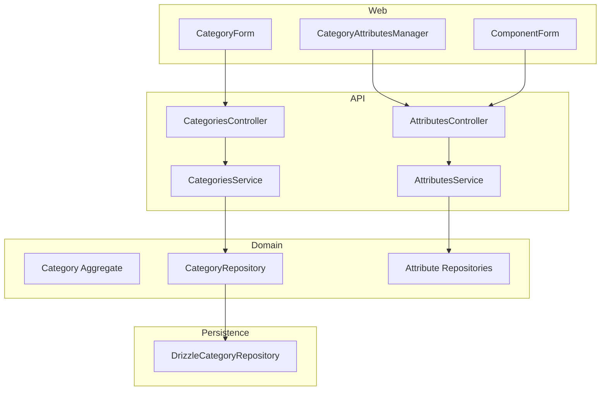
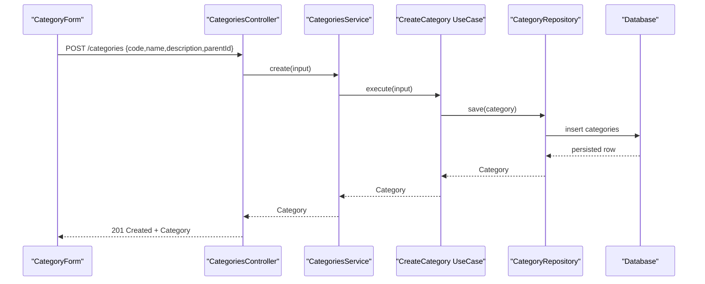
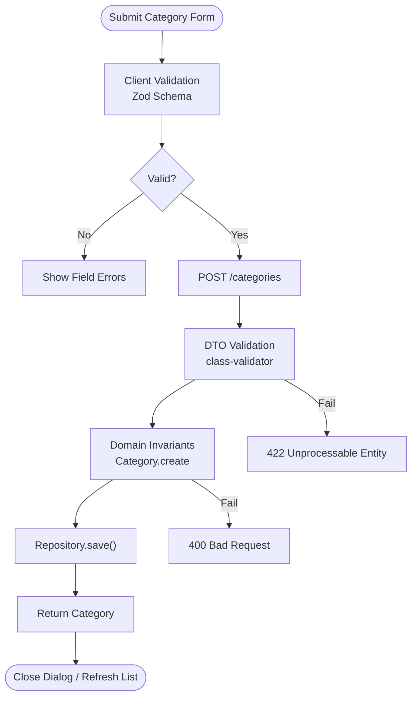
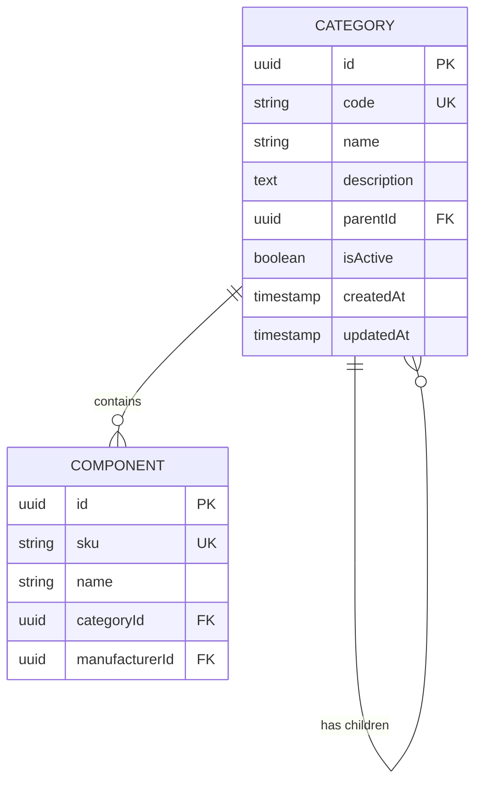
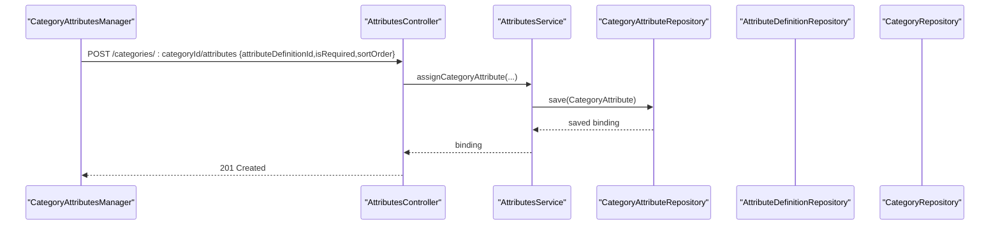
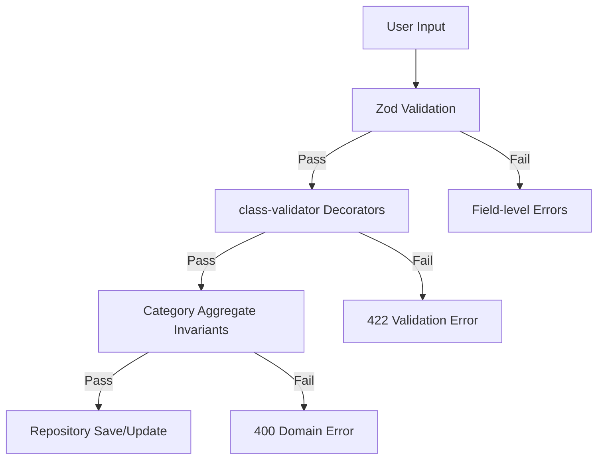
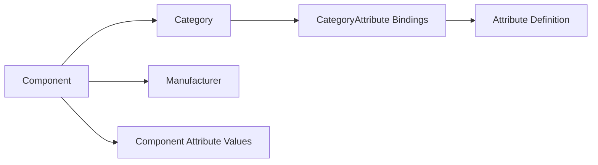
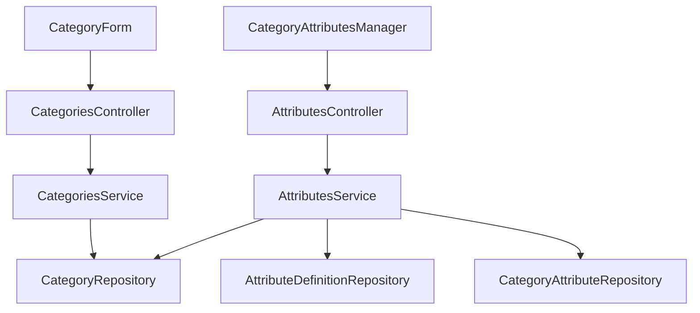

# Category Management Components

<cite>
**Referenced Files in This Document**
- [categories.controller.ts](file://apps/api/src/categories/categories.controller.ts)
- [categories.service.ts](file://apps/api/src/categories/categories.service.ts)
- [create-category.dto.ts](file://apps/api/src/categories/create-category.dto.ts)
- [update-category.dto.ts](file://apps/api/src/categories/update-category.dto.ts)
- [category.tokens.ts](file://apps/api/src/categories/category.tokens.ts)
- [drizzle-category.repository.ts](file://apps/api/src/infrastructure/repositories/drizzle-category.repository.ts)
- [category.ts](file://packages/inventory/src/categories/category.ts)
- [category.repository.ts](file://packages/inventory/src/categories/category.repository.ts)
- [attributes.controller.ts](file://apps/api/src/attributes/attributes.controller.ts)
- [attributes.service.ts](file://apps/api/src/attributes/attributes.service.ts)
- [assign-category-attribute.dto.ts](file://apps/api/src/attributes/dtos/assign-category-attribute.dto.ts)
- [bind-category.dto.ts](file://apps/api/src/attributes/dtos/bind-category.dto.ts)
- [update-category-binding.dto.ts](file://apps/api/src/attributes/dtos/update-category-binding.dto.ts)
- [category-form.tsx](file://apps/web/components/categories/category-form.tsx)
- [category-attributes-manager.tsx](file://apps/web/components/categories/category-attributes-manager.tsx)
- [component-form.tsx](file://apps/web/components/components/component-form.tsx)
</cite>

## Table of Contents
1. [Introduction](#introduction)
2. [Project Structure](#project-structure)
3. [Core Components](#core-components)
4. [Architecture Overview](#architecture-overview)
5. [Detailed Component Analysis](#detailed-component-analysis)
6. [Dependency Analysis](#dependency-analysis)
7. [Performance Considerations](#performance-considerations)
8. [Troubleshooting Guide](#troubleshooting-guide)
9. [Conclusion](#conclusion)
10. [Appendices](#appendices)

## Introduction
This document explains the category management components across API and web layers, focusing on:
- Category creation and editing workflows
- Hierarchical category structures (parent-child relationships)
- Attribute assignment patterns to categories
- Validation rules at DTOs, domain models, and repositories
- Integration with components, manufacturers, and other domain entities
- Practical examples for customizing forms, implementing complex validation, and managing hierarchies

The system exposes a REST API for categories and attributes, a domain model enforcing invariants, and a React-based UI for creating categories and configuring per-category attributes.

## Project Structure
Category management spans three main areas:
- API layer: controllers, services, DTOs, and repository integration
- Domain layer: category aggregate and repository interfaces
- Web layer: category form and attribute manager components

**Diagram sources**
- [categories.controller.ts:17-49](file://apps/api/src/categories/categories.controller.ts#L17-L49)
- [categories.service.ts:14-52](file://apps/api/src/categories/categories.service.ts#L14-L52)
- [attributes.controller.ts:70-209](file://apps/api/src/attributes/attributes.controller.ts#L70-L209)
- [attributes.service.ts:65-96](file://apps/api/src/attributes/attributes.service.ts#L65-L96)
- [drizzle-category.repository.ts:36-145](file://apps/api/src/infrastructure/repositories/drizzle-category.repository.ts#L36-L145)

**Section sources**
- [categories.controller.ts:17-49](file://apps/api/src/categories/categories.controller.ts#L17-L49)
- [categories.service.ts:14-52](file://apps/api/src/categories/categories.service.ts#L14-L52)
- [attributes.controller.ts:70-209](file://apps/api/src/attributes/attributes.controller.ts#L70-L209)
- [attributes.service.ts:65-96](file://apps/api/src/attributes/attributes.service.ts#L65-L96)
- [drizzle-category.repository.ts:36-145](file://apps/api/src/infrastructure/repositories/drizzle-category.repository.ts#L36-L145)

## Core Components
- CategoriesController: Exposes CRUD endpoints for categories under /categories.
- CategoriesService: Orchestrates create/update/delete via domain use cases and repository access; provides listing and single-item retrieval with not-found handling.
- Create/Update DTOs: Validate incoming payloads for code, name, description, parentId, and isActive.
- CategoryAggregate: Enforces domain invariants such as required fields and preventing self-parenting.
- DrizzleCategoryRepository: Persists categories, supports hierarchical queries by parent, and checks constraints like children or component references.
- AttributesController/Service: Provide APIs to bind/unbind attribute definitions to categories, manage options, and read/write component attributes.
- Web Components: CategoryForm for creating/editing categories; CategoryAttributesManager for assigning attributes and viewing AI suggestions; ComponentForm integrates category attributes into component editing.

**Section sources**
- [categories.controller.ts:17-49](file://apps/api/src/categories/categories.controller.ts#L17-L49)
- [categories.service.ts:14-52](file://apps/api/src/categories/categories.service.ts#L14-L52)
- [create-category.dto.ts:1-20](file://apps/api/src/categories/create-category.dto.ts#L1-L20)
- [update-category.dto.ts:1-24](file://apps/api/src/categories/update-category.dto.ts#L1-L24)
- [category.ts:55-106](file://packages/inventory/src/categories/category.ts#L55-L106)
- [drizzle-category.repository.ts:36-145](file://apps/api/src/infrastructure/repositories/drizzle-category.repository.ts#L36-L145)
- [attributes.controller.ts:70-209](file://apps/api/src/attributes/attributes.controller.ts#L70-L209)
- [attributes.service.ts:65-96](file://apps/api/src/attributes/attributes.service.ts#L65-L96)
- [category-form.tsx:25-117](file://apps/web/components/categories/category-form.tsx#L25-L117)
- [category-attributes-manager.tsx:94-125](file://apps/web/components/categories/category-attributes-manager.tsx#L94-L125)
- [component-form.tsx:271-293](file://apps/web/components/components/component-form.tsx#L271-L293)

## Architecture Overview
The category subsystem follows a layered architecture:
- Presentation (Web): Forms collect user input and call API clients.
- API Layer: Controllers validate requests using DTOs and delegate to services.
- Domain Layer: Aggregates enforce business rules; use cases encapsulate operations.
- Infrastructure: Repositories implement persistence and query logic.

**Diagram sources**
- [categories.controller.ts:22-25](file://apps/api/src/categories/categories.controller.ts#L22-L25)
- [categories.service.ts:29-31](file://apps/api/src/categories/categories.service.ts#L29-L31)
- [drizzle-category.repository.ts:76-87](file://apps/api/src/infrastructure/repositories/drizzle-category.repository.ts#L76-L87)

## Detailed Component Analysis

### Category Creation Workflow
- Client-side validation: Zod schema enforces required fields and normalizes inputs (e.g., uppercase code).
- Server-side validation: class-validator decorators ensure payload integrity.
- Domain validation: Category.create validates required fields and prevents invalid states.
- Persistence: Repository saves and returns the persisted category.

**Diagram sources**
- [category-form.tsx:25-117](file://apps/web/components/categories/category-form.tsx#L25-L117)
- [create-category.dto.ts:1-20](file://apps/api/src/categories/create-category.dto.ts#L1-L20)
- [category.ts:55-84](file://packages/inventory/src/categories/category.ts#L55-L84)
- [drizzle-category.repository.ts:76-87](file://apps/api/src/infrastructure/repositories/drizzle-category.repository.ts#L76-L87)

**Section sources**
- [category-form.tsx:25-117](file://apps/web/components/categories/category-form.tsx#L25-L117)
- [create-category.dto.ts:1-20](file://apps/api/src/categories/create-category.dto.ts#L1-L20)
- [category.ts:55-84](file://packages/inventory/src/categories/category.ts#L55-L84)
- [drizzle-category.repository.ts:76-87](file://apps/api/src/infrastructure/repositories/drizzle-category.repository.ts#L76-L87)

### Hierarchical Category Structures
- Parent-child relationships are modeled via parentId on categories.
- The repository supports querying by parent and checking if a category has children.
- The domain prevents a category from being its own parent.

**Diagram sources**
- [drizzle-category.repository.ts:60-68](file://apps/api/src/infrastructure/repositories/drizzle-category.repository.ts#L60-L68)
- [drizzle-category.repository.ts:118-130](file://apps/api/src/infrastructure/repositories/drizzle-category.repository.ts#L118-L130)
- [category.ts:89-106](file://packages/inventory/src/categories/category.ts#L89-L106)

**Section sources**
- [drizzle-category.repository.ts:60-68](file://apps/api/src/infrastructure/repositories/drizzle-category.repository.ts#L60-L68)
- [drizzle-category.repository.ts:118-130](file://apps/api/src/infrastructure/repositories/drizzle-category.repository.ts#L118-L130)
- [category.ts:89-106](file://packages/inventory/src/categories/category.ts#L89-L106)

### Attribute Assignment Patterns
- Assign an attribute definition to a category with isRequired, sortOrder, and optional defaultValue.
- Bind an attribute definition to multiple categories via dedicated endpoints.
- Update binding properties without reassigning.
- Unassign or unbind as needed.

**Diagram sources**
- [attributes.controller.ts:159-166](file://apps/api/src/attributes/attributes.controller.ts#L159-L166)
- [attributes.service.ts:296-309](file://apps/api/src/attributes/attributes.service.ts#L296-L309)
- [assign-category-attribute.dto.ts:1-24](file://apps/api/src/attributes/dtos/assign-category-attribute.dto.ts#L1-L24)

**Section sources**
- [attributes.controller.ts:159-166](file://apps/api/src/attributes/attributes.controller.ts#L159-L166)
- [attributes.service.ts:296-309](file://apps/api/src/attributes/attributes.service.ts#L296-L309)
- [assign-category-attribute.dto.ts:1-24](file://apps/api/src/attributes/dtos/assign-category-attribute.dto.ts#L1-L24)

### Validation Rules
- Client-side: Zod schema ensures required fields and transforms values before submission.
- Server-side: class-validator decorators validate types and presence.
- Domain: Category.create/update enforce non-empty code/name and prevent self-parenting.
- Repository: Supports lookup by UUID or code and enforces referential integrity through schema constraints.

**Diagram sources**
- [category-form.tsx:25-36](file://apps/web/components/categories/category-form.tsx#L25-L36)
- [create-category.dto.ts:1-20](file://apps/api/src/categories/create-category.dto.ts#L1-L20)
- [category.ts:55-106](file://packages/inventory/src/categories/category.ts#L55-L106)

**Section sources**
- [category-form.tsx:25-36](file://apps/web/components/categories/category-form.tsx#L25-L36)
- [create-category.dto.ts:1-20](file://apps/api/src/categories/create-category.dto.ts#L1-L20)
- [category.ts:55-106](file://packages/inventory/src/categories/category.ts#L55-L106)

### Integration with Components and Manufacturers
- Components reference a category via categoryId, enabling attribute inheritance and filtering based on category.
- Manufacturer linkage exists on components, allowing categorization alongside supplier context.
- The component form resolves category attributes to render dynamic fields when editing components.

**Diagram sources**
- [component-form.tsx:271-293](file://apps/web/components/components/component-form.tsx#L271-L293)
- [attributes.service.ts:435-532](file://apps/api/src/attributes/attributes.service.ts#L435-L532)

**Section sources**
- [component-form.tsx:271-293](file://apps/web/components/components/component-form.tsx#L271-L293)
- [attributes.service.ts:435-532](file://apps/api/src/attributes/attributes.service.ts#L435-L532)

### Customizing Category Forms
- Extend the Zod schema to add new fields or stricter rules.
- Add new form controls and wire them into the submit handler.
- Map additional fields to CreateCategoryPayload/UpdateCategoryPayload and persist via the API.

Example customization steps:
- Add a new field to the schema and form control.
- Include it in the payload sent to create/update endpoints.
- Optionally add server-side validation in DTOs if the field becomes part of the API contract.

**Section sources**
- [category-form.tsx:25-117](file://apps/web/components/categories/category-form.tsx#L25-L117)
- [create-category.dto.ts:1-20](file://apps/api/src/categories/create-category.dto.ts#L1-L20)
- [update-category.dto.ts:1-24](file://apps/api/src/categories/update-category.dto.ts#L1-L24)

### Implementing Complex Validation Logic
- Use domain methods to enforce business rules beyond simple type checks.
- For cross-field validations, implement checks in the service or domain layer.
- Leverage repository constraints to prevent invalid state transitions (e.g., self-parenting).

Recommended approach:
- Centralize complex rules in Category.update/create.
- Surface meaningful errors to the client via consistent error handling.
- Keep DTOs focused on input shape and basic validation.

**Section sources**
- [category.ts:89-106](file://packages/inventory/src/categories/category.ts#L89-L106)
- [categories.service.ts:45-51](file://apps/api/src/categories/categories.service.ts#L45-L51)

### Managing Category Hierarchies
- Use SearchableSelect in the form to pick a parent category, excluding the current category during edits.
- Query children via repository to build navigation trees or enforce deletion constraints.
- Prevent circular references at the domain level.

**Section sources**
- [category-form.tsx:55-69](file://apps/web/components/categories/category-form.tsx#L55-L69)
- [drizzle-category.repository.ts:60-68](file://apps/api/src/infrastructure/repositories/drizzle-category.repository.ts#L60-L68)
- [category.ts:89-106](file://packages/inventory/src/categories/category.ts#L89-L106)

## Dependency Analysis
Key dependencies and coupling:
- CategoriesController depends on CategoriesService and DTOs.
- CategoriesService depends on injected CategoryRepository and domain use cases.
- AttributesController/Service depend on multiple repositories and integrate with categories for binding.
- Web components depend on API clients and share data contracts with the backend.

**Diagram sources**
- [categories.controller.ts:17-49](file://apps/api/src/categories/categories.controller.ts#L17-L49)
- [categories.service.ts:14-52](file://apps/api/src/categories/categories.service.ts#L14-L52)
- [attributes.controller.ts:70-209](file://apps/api/src/attributes/attributes.controller.ts#L70-L209)
- [attributes.service.ts:65-96](file://apps/api/src/attributes/attributes.service.ts#L65-L96)

**Section sources**
- [categories.controller.ts:17-49](file://apps/api/src/categories/categories.controller.ts#L17-L49)
- [categories.service.ts:14-52](file://apps/api/src/categories/categories.service.ts#L14-L52)
- [attributes.controller.ts:70-209](file://apps/api/src/attributes/attributes.controller.ts#L70-L209)
- [attributes.service.ts:65-96](file://apps/api/src/attributes/attributes.service.ts#L65-L96)

## Performance Considerations
- Batch loads: The attributes service fetches definitions, bindings, and categories concurrently where possible.
- Minimize N+1 queries: Build maps for lookups (e.g., category map) before iterating results.
- Efficient hierarchy queries: Use findByParentId and limit clauses to avoid loading entire trees unnecessarily.
- Frontend caching: Consider caching category lists and attribute definitions to reduce repeated requests.

[No sources needed since this section provides general guidance]

## Troubleshooting Guide
Common issues and resolutions:
- Not found errors: Ensure category IDs exist before updates or reads; service throws explicit not-found exceptions.
- Validation failures: Check Zod and DTO validators for required fields and formats.
- Circular parent references: Domain prevents setting a category as its own parent.
- Binding conflicts: When assigning attributes, ensure the attribute definition exists and is not already directly assigned if you intend uniqueness.

Operational tips:
- Inspect server logs for repository errors during save/update.
- Verify that category codes are unique and normalized as expected.
- Confirm that attribute definitions exist before binding to categories.

**Section sources**
- [categories.service.ts:45-51](file://apps/api/src/categories/categories.service.ts#L45-L51)
- [category.ts:89-106](file://packages/inventory/src/categories/category.ts#L89-L106)
- [attributes.service.ts:318-350](file://apps/api/src/attributes/attributes.service.ts#L318-L350)

## Conclusion
The category management system provides a robust foundation for organizing components through hierarchical categories and rich attribute specifications. It combines strong client-side and server-side validation, domain-driven invariants, and flexible attribute binding to support complex product taxonomies. The web components enable intuitive creation and configuration, while the API offers comprehensive control over categories and their attributes.

[No sources needed since this section summarizes without analyzing specific files]

## Appendices

### API Endpoints Summary
- Categories
  - POST /categories: Create category
  - GET /categories: List all categories
  - GET /categories/:id: Get category by ID or code
  - PUT /categories/:id: Update category
  - DELETE /categories/:id: Delete category
- Attributes
  - GET /attributes: List definitions with options and bindings
  - POST /attributes: Create definition
  - GET /attributes/:id: Get definition
  - PUT /attributes/:id: Update definition
  - DELETE /attributes/:id: Delete definition
  - GET /attributes/:id/categories: List categories bound to a definition
  - POST /attributes/:id/categories: Bind a category to a definition
  - PUT /attributes/:id/categories/:categoryId: Update binding
  - DELETE /attributes/:id/categories/:categoryId: Unbind category
  - GET /categories/:categoryId/attributes: Get resolved attributes for a category
  - POST /categories/:categoryId/attributes: Assign attribute to category
  - DELETE /categories/:categoryId/attributes/:attributeDefinitionId: Unassign attribute

**Section sources**
- [categories.controller.ts:17-49](file://apps/api/src/categories/categories.controller.ts#L17-L49)
- [attributes.controller.ts:70-209](file://apps/api/src/attributes/attributes.controller.ts#L70-L209)