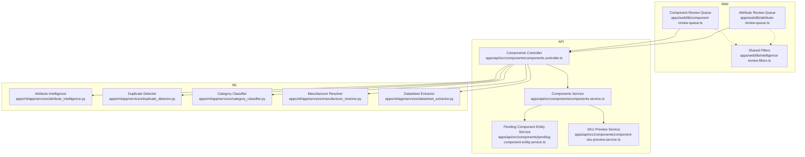
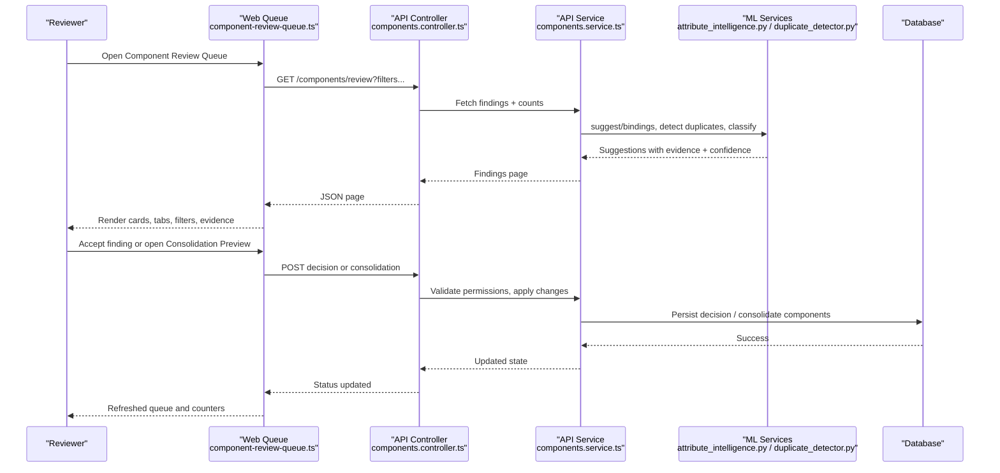
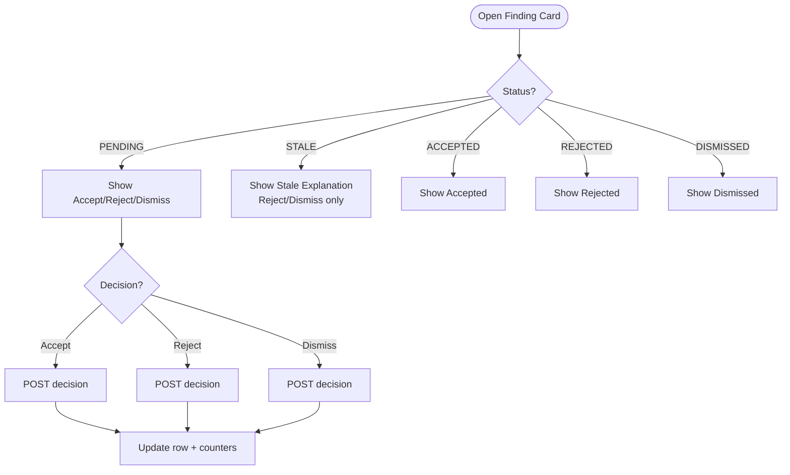
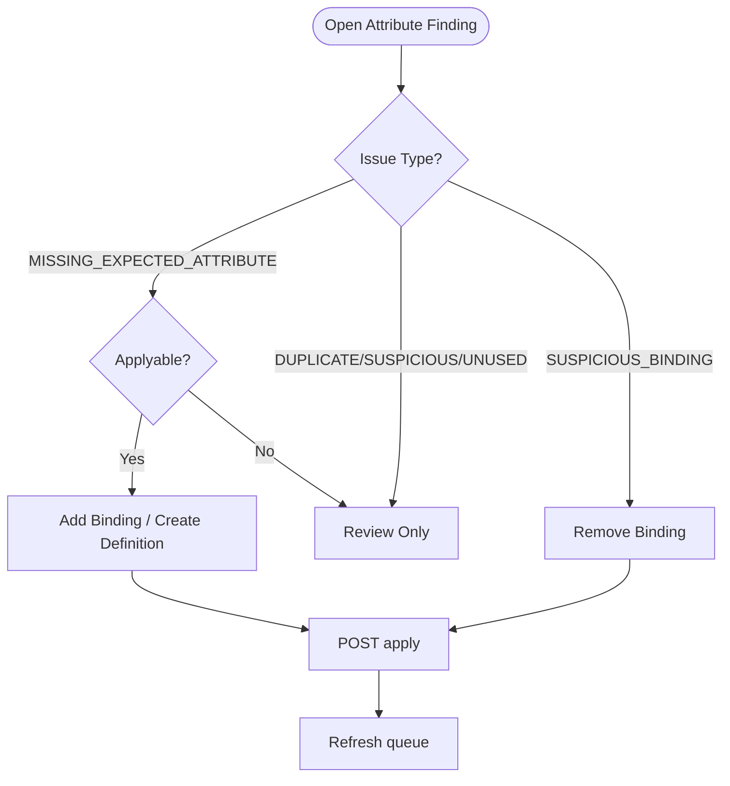
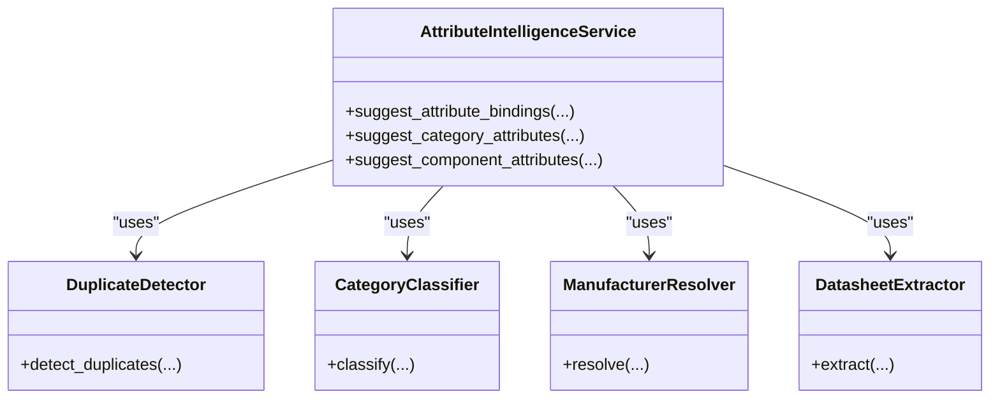
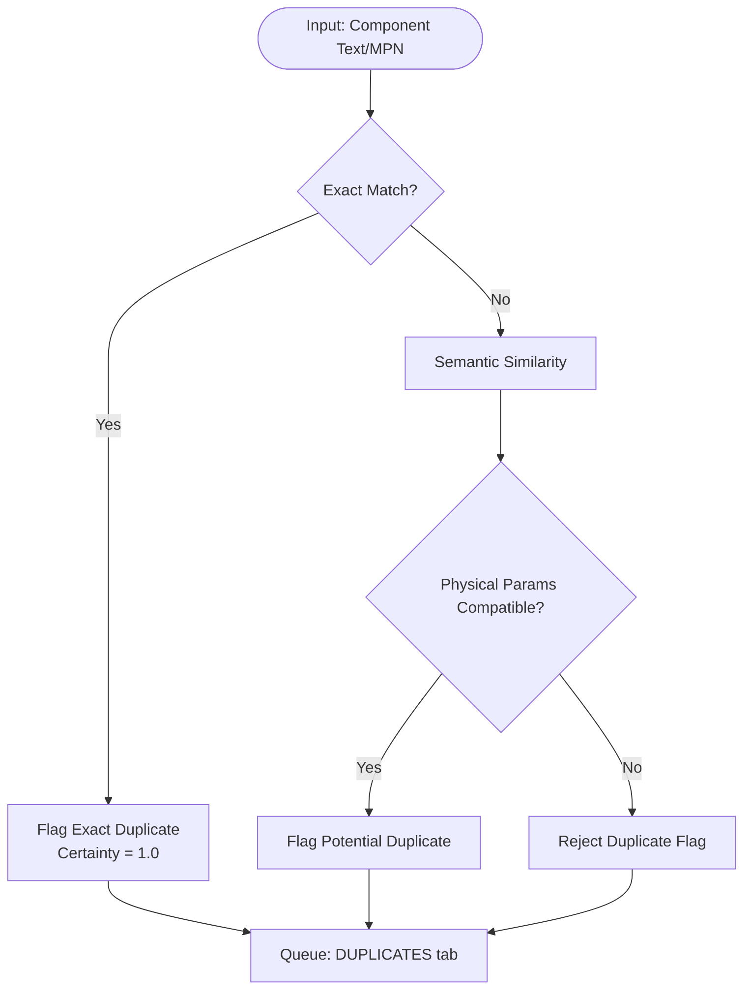
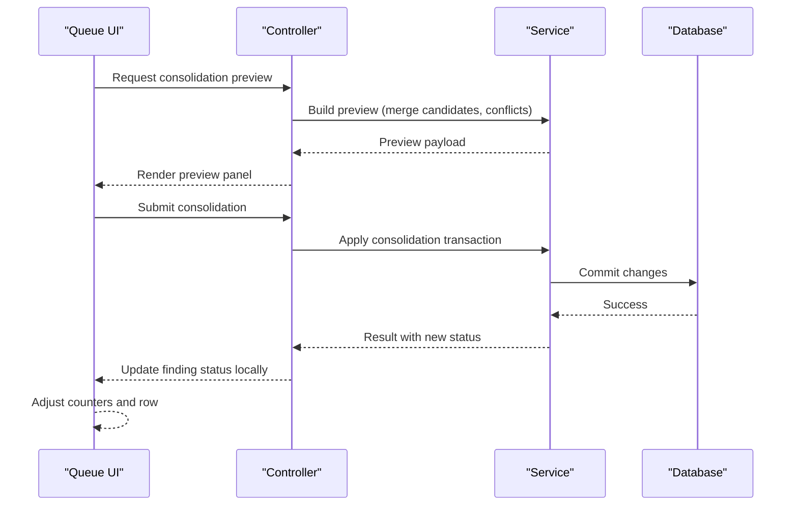
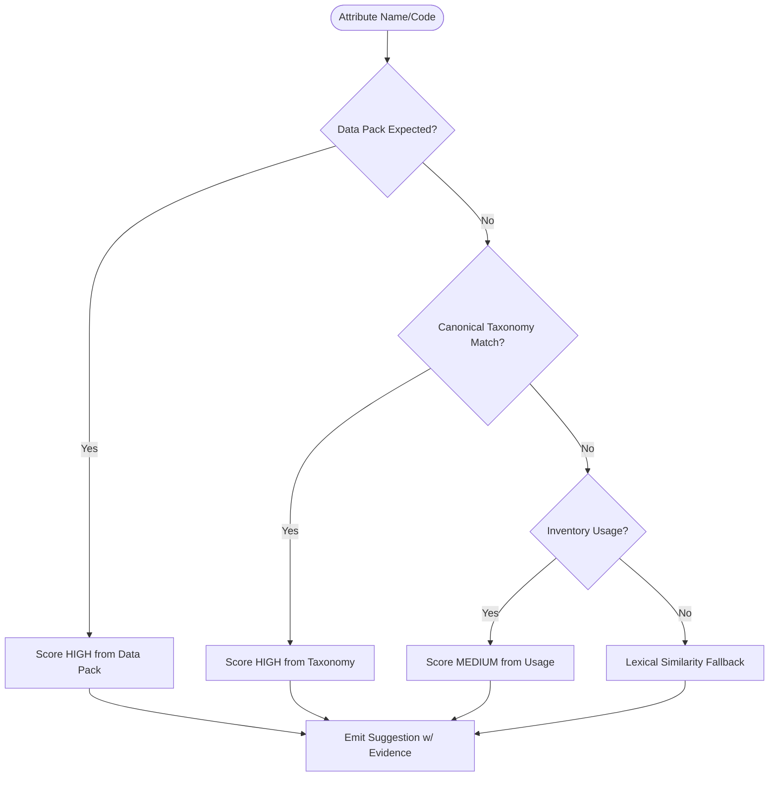
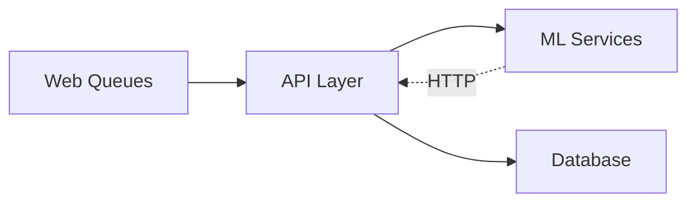

# Component Intelligence & Review

<cite>
**Referenced Files in This Document**
- [0057-component-intelligence-v2.md](file://docs/rfcs/0057-component-intelligence-v2.md)
- [0059-attribute-intelligence-v1.md](file://docs/rfcs/0059-attribute-intelligence-v1.md)
- [component-review-queue.ts](file://apps/web/lib/component-review-queue.ts)
- [attribute-review-queue.ts](file://apps/web/lib/attribute-review-queue.ts)
- [intelligence-review-filters.ts](file://apps/web/lib/intelligence-review-filters.ts)
- [attribute_intelligence.py](file://apps/ml/app/services/attribute_intelligence.py)
- [components.controller.ts](file://apps/api/src/components/components.controller.ts)
- [components.service.ts](file://apps/api/src/components/components.service.ts)
- [pending-component-entity.service.ts](file://apps/api/src/components/pending-component-entity.service.ts)
- [component-sku-preview.service.ts](file://apps/api/src/components/component-sku-preview.service.ts)
- [duplicate_detector.py](file://apps/ml/app/services/duplicate_detector.py)
- [category_classifier.py](file://apps/ml/app/services/category_classifier.py)
- [manufacturer_resolver.py](file://apps/ml/app/services/manufacturer_resolver.py)
- [datasheet_extractor.py](file://apps/ml/app/services/datasheet_extractor.py)
</cite>

## Table of Contents
1. Introduction
2. Project Structure
3. Core Components
4. Architecture Overview
5. Detailed Component Analysis
6. Dependency Analysis
7. Performance Considerations
8. Troubleshooting Guide
9. Conclusion
10. Appendices

## Introduction
This document explains the component intelligence and review workflow across the system: AI-powered suggestions, duplicate detection interfaces, consolidation previews, attribute suggestion mechanisms, ML integration patterns, review approval workflows, confidence scoring displays, and bulk operation capabilities. It also provides guidance for customizing review interfaces, extending AI suggestions, and handling complex component relationships.

The design emphasizes human authority: AI outputs are provisional until explicitly accepted by a reviewer. Suggestions remain non-authoritative proposals and never silently mutate authoritative data. Confidence is calibrated into High/Medium/Low tiers with transparent evidence so reviewers can understand “why” behind each suggestion.

## Project Structure
Intelligence spans three layers:
- Web UI logic (pure presentation and workflow rules)
- API layer (NestJS controllers/services orchestrating requests, permissions, and persistence)
- ML microservice (Python FastAPI services providing statistical classifiers, extractors, deduplication, and attribute intelligence)

**Diagram sources**
- [component-review-queue.ts:1-120](file://apps/web/lib/component-review-queue.ts#L1-L120)
- [attribute-review-queue.ts:1-120](file://apps/web/lib/attribute-review-queue.ts#L1-L120)
- [intelligence-review-filters.ts:1-160](file://apps/web/lib/intelligence-review-filters.ts#L1-L160)
- [components.controller.ts](file://apps/api/src/components/components.controller.ts)
- [components.service.ts](file://apps/api/src/components/components.service.ts)
- [pending-component-entity.service.ts](file://apps/api/src/components/pending-component-entity.service.ts)
- [component-sku-preview.service.ts](file://apps/api/src/components/component-sku-preview.service.ts)
- [attribute_intelligence.py:497-800](file://apps/ml/app/services/attribute_intelligence.py#L497-L800)
- [duplicate_detector.py](file://apps/ml/app/services/duplicate_detector.py)
- [category_classifier.py](file://apps/ml/app/services/category_classifier.py)
- [manufacturer_resolver.py](file://apps/ml/app/services/manufacturer_resolver.py)
- [datasheet_extractor.py](file://apps/ml/app/services/datasheet_extractor.py)

**Section sources**
- [0057-component-intelligence-v2.md:21-80](file://docs/rfcs/0057-component-intelligence-v2.md#L21-L80)
- [0059-attribute-intelligence-v1.md:35-96](file://docs/rfcs/0059-attribute-intelligence-v1.md#L35-L96)

## Core Components
- Component Intelligence Review Queue: Presents findings for identity, classification, duplicates, specifications, and stale items; supports decisions (Accept/Reject/Dismiss), evidence exploration, and consolidation preview flows.
- Attribute Intelligence Review Queue: Presents binding, duplicate, suspicious, unused, and enum-value findings; supports Accept/Reject/Dismiss and Apply actions where applicable.
- Shared Review Filters: Centralized vocabulary for status and confidence filters used consistently across surfaces.
- ML Services: Attribute intelligence, duplicate detection, category classification, manufacturer resolution, and datasheet extraction provide evidence-backed suggestions with calibrated confidence.
- API Orchestration: Controllers and services coordinate request validation, permission checks, ML calls, pending entity management, SKU previews, and persistence.

Key behaviors:
- Human-in-the-loop approvals before any authoritative change.
- Evidence-first explanations (“Why?”) for every suggestion.
- Calibrated confidence levels (High/Medium/Low) with consistent UI badges.
- Bulk operations via queue tabs and filter sets to triage efficiently.

**Section sources**
- [component-review-queue.ts:50-127](file://apps/web/lib/component-review-queue.ts#L50-L127)
- [attribute-review-queue.ts:40-92](file://apps/web/lib/attribute-review-queue.ts#L40-L92)
- [intelligence-review-filters.ts:38-112](file://apps/web/lib/intelligence-review-filters.ts#L38-L112)
- [attribute_intelligence.py:501-632](file://apps/ml/app/services/attribute_intelligence.py#L501-L632)

## Architecture Overview
The end-to-end flow integrates ML suggestions with review queues and controlled application paths.

**Diagram sources**
- [component-review-queue.ts:642-728](file://apps/web/lib/component-review-queue.ts#L642-L728)
- [components.controller.ts](file://apps/api/src/components/components.controller.ts)
- [components.service.ts](file://apps/api/src/components/components.service.ts)
- [attribute_intelligence.py:501-800](file://apps/ml/app/services/attribute_intelligence.py#L501-L800)
- [duplicate_detector.py](file://apps/ml/app/services/duplicate_detector.py)

## Detailed Component Analysis

### Component Intelligence Review Queue
Responsibilities:
- Present findings grouped by Identity, Classification, Specifications, Duplicates, and Stale.
- Provide per-finding evidence summaries, confidence badges, and decision controls.
- Support targeted status reconciliation after consolidation and immediate UI updates without full refetch.
- Offer inspection actions and permission-aware controls.

Key implementation highlights:
- Decision lifecycle: only certain statuses allow specific decisions; stale findings cannot be accepted.
- Tab-based triage with complete client-side counts from loaded rows.
- Consolidation preview integration: applies acceptance immediately to the card and counters.

**Diagram sources**
- [component-review-queue.ts:236-327](file://apps/web/lib/component-review-queue.ts#L236-L327)
- [component-review-queue.ts:642-728](file://apps/web/lib/component-review-queue.ts#L642-L728)

**Section sources**
- [component-review-queue.ts:50-127](file://apps/web/lib/component-review-queue.ts#L50-L127)
- [component-review-queue.ts:236-327](file://apps/web/lib/component-review-queue.ts#L236-L327)
- [component-review-queue.ts:642-728](file://apps/web/lib/component-review-queue.ts#L642-L728)

### Attribute Intelligence Review Queue
Responsibilities:
- Present findings for bindings, duplicates, suspicious bindings, unused attributes, and suggested enum values.
- Provide decision controls (Accept/Reject/Dismiss) and Apply actions where implemented.
- Derive tab counts from backend persisted counts and map issue types to tabs.

Key implementation highlights:
- Clear separation between review decisions and library mutations.
- Permission derivation from existing attribute write permission.
- Actionability rules mirror API constraints to avoid dead UI controls.

**Diagram sources**
- [attribute-review-queue.ts:590-718](file://apps/web/lib/attribute-review-queue.ts#L590-L718)

**Section sources**
- [attribute-review-queue.ts:40-92](file://apps/web/lib/attribute-review-queue.ts#L40-L92)
- [attribute-review-queue.ts:234-343](file://apps/web/lib/attribute-review-queue.ts#L234-L343)
- [attribute-review-queue.ts:590-718](file://apps/web/lib/attribute-review-queue.ts#L590-L718)

### Shared Review Filters
Provides a single source of truth for:
- Lifecycle statuses: Needs review, Accepted, Rejected, Dismissed, Stale.
- Confidence bands: High, Medium, Low.
- Filter value conversion to query parameters and matching helpers.

Ensures consistent UX across Component, Attribute, and Documentation review surfaces.

**Section sources**
- [intelligence-review-filters.ts:20-160](file://apps/web/lib/intelligence-review-filters.ts#L20-L160)

### ML Integration Patterns
Patterns implemented:
- Data Pack hints: Active packs supply MPN patterns, aliases, expected attributes, units, and package patterns that immediately influence suggestions without model retraining.
- Structured evidence: Every suggestion includes evidence items describing the source (e.g., classifier, data pack rule, keyword match).
- Calibrated confidence: Multi-source evidence combined into High/Medium/Low tiers.
- Graceful degradation: Deterministic fallbacks ensure ERP continuity if ML service is unreachable.

**Diagram sources**
- [attribute_intelligence.py:497-800](file://apps/ml/app/services/attribute_intelligence.py#L497-L800)
- [duplicate_detector.py](file://apps/ml/app/services/duplicate_detector.py)
- [category_classifier.py](file://apps/ml/app/services/category_classifier.py)
- [manufacturer_resolver.py](file://apps/ml/app/services/manufacturer_resolver.py)
- [datasheet_extractor.py](file://apps/ml/app/services/datasheet_extractor.py)

**Section sources**
- [0057-component-intelligence-v2.md:84-157](file://docs/rfcs/0057-component-intelligence-v2.md#L84-L157)
- [0059-attribute-intelligence-v1.md:24-32](file://docs/rfcs/0059-attribute-intelligence-v1.md#L24-L32)
- [attribute_intelligence.py:501-800](file://apps/ml/app/services/attribute_intelligence.py#L501-L800)

### Duplicate Detection Interfaces
Behavior:
- Tiered deduplication: exact normalized MPN/SKU matches at certainty 1.0; semantic similarity with strict physical guards to prevent false positives.
- Evidence includes similarity scores and physical parameter comparisons.
- UI presents duplicate findings in a dedicated tab with clear current vs related component details.

**Diagram sources**
- [0057-component-intelligence-v2.md:138-142](file://docs/rfcs/0057-component-intelligence-v2.md#L138-L142)
- [component-review-queue.ts:734-768](file://apps/web/lib/component-review-queue.ts#L734-L768)

**Section sources**
- [0057-component-intelligence-v2.md:138-142](file://docs/rfcs/0057-component-intelligence-v2.md#L138-L142)
- [component-review-queue.ts:734-768](file://apps/web/lib/component-review-queue.ts#L734-L768)

### Consolidation Preview Panels
Behavior:
- Previews proposed consolidations before committing changes.
- After consolidation, the queue updates the affected finding’s status immediately without full refetch.
- Supports applying consolidated changes through controlled mutation paths.

**Diagram sources**
- [component-review-queue.ts:642-728](file://apps/web/lib/component-review-queue.ts#L642-L728)
- [components.controller.ts](file://apps/api/src/components/components.controller.ts)
- [components.service.ts](file://apps/api/src/components/components.service.ts)

**Section sources**
- [component-review-queue.ts:642-728](file://apps/web/lib/component-review-queue.ts#L642-L728)

### Attribute Suggestion Mechanisms
Capabilities:
- Category binding recommendations based on Data Pack expectations, canonical taxonomy, and inventory telemetry.
- Missing expected attribute detection per category.
- Configuration inference (data type, unit category, default unit, display units, validation rules).
- Alias and duplicate detection with usage context.
- Enum option suggestions grounded in observed values and Data Packs.

**Diagram sources**
- [attribute_intelligence.py:501-632](file://apps/ml/app/services/attribute_intelligence.py#L501-L632)

**Section sources**
- [0059-attribute-intelligence-v1.md:100-155](file://docs/rfcs/0059-attribute-intelligence-v1.md#L100-L155)
- [attribute_intelligence.py:501-632](file://apps/ml/app/services/attribute_intelligence.py#L501-L632)

### Confidence Scoring Displays
- Consistent mapping from confidence level to badge tone across surfaces.
- Percent formatting for numeric confidence when available.
- Unified filter options for confidence bands.

**Section sources**
- [component-review-queue.ts:122-127](file://apps/web/lib/component-review-queue.ts#L122-L127)
- [component-review-queue.ts:218-230](file://apps/web/lib/component-review-queue.ts#L218-L230)
- [intelligence-review-filters.ts:95-112](file://apps/web/lib/intelligence-review-filters.ts#L95-L112)

### Bulk Operation Capabilities
- Queue tabs group findings for efficient triage (Identity, Classification, Specifications, Duplicates, Stale; Bindings, Duplicates, Suspicious, Unused, Enums).
- Filter combinations enable focused bulk review sessions.
- Backend provides grouped counts; UI derives actionable summaries and breakdowns.

**Section sources**
- [component-review-queue.ts:480-560](file://apps/web/lib/component-review-queue.ts#L480-L560)
- [attribute-review-queue.ts:40-92](file://apps/web/lib/attribute-review-queue.ts#L40-L92)

## Dependency Analysis
Coupling and cohesion:
- Web queues depend on shared filters for consistent UX and on API endpoints for data.
- API controllers orchestrate multiple ML services; services encapsulate domain logic and persistence.
- ML services are stateless and CPU-first, returning structured evidence and confidence.

External dependencies and integration points:
- Data Packs inject domain knowledge dynamically.
- Database interactions occur via NestJS repositories and services; ML remains read-only over HTTP payloads.

Potential circular dependencies:
- None observed; web depends on API, API depends on ML, ML has no dependency back to API.

**Diagram sources**
- [component-review-queue.ts:1-120](file://apps/web/lib/component-review-queue.ts#L1-L120)
- [attribute-review-queue.ts:1-120](file://apps/web/lib/attribute-review-queue.ts#L1-L120)
- [components.controller.ts](file://apps/api/src/components/components.controller.ts)
- [components.service.ts](file://apps/api/src/components/components.service.ts)
- [attribute_intelligence.py:497-800](file://apps/ml/app/services/attribute_intelligence.py#L497-L800)

**Section sources**
- [0057-component-intelligence-v2.md:153-157](file://docs/rfcs/0057-component-intelligence-v2.md#L153-L157)
- [0059-attribute-intelligence-v1.md:291-297](file://docs/rfcs/0059-attribute-intelligence-v1.md#L291-L297)

## Performance Considerations
- ML inference targets sub-20ms latency and low memory footprint using CPU-first models and deterministic fallbacks.
- Client-side tab counts and lightweight computations reduce server load.
- Batch operations leverage server-side grouping and pagination to minimize round trips.

[No sources needed since this section provides general guidance]

## Troubleshooting Guide
Common issues and resolutions:
- Stale findings: Occur when underlying data changed after generation; accept is disabled, use Reject/Dismiss and re-run audit.
- Permission errors: Applying findings requires attribute write permission; read-only users can still review and decide where allowed.
- Conflict during audits: Concurrent audits may conflict; wait for completion before starting another.
- ML unavailability: Deterministic fallback ensures continuity; check logs for service reachability.

**Section sources**
- [component-review-queue.ts:319-327](file://apps/web/lib/component-review-queue.ts#L319-L327)
- [attribute-review-queue.ts:336-343](file://apps/web/lib/attribute-review-queue.ts#L336-L343)
- [attribute-review-queue.ts:376-409](file://apps/web/lib/attribute-review-queue.ts#L376-L409)

## Conclusion
The component intelligence and review workflow delivers explainable, human-supervised assistance for component and attribute management. By combining Data Pack hints, statistical classifiers, and robust deduplication with a clear review interface and calibrated confidence, teams can maintain high-quality master data while preserving operational continuity. The architecture supports customization through Data Packs and extensible ML services, and it scales via batch-friendly queues and efficient client-server interactions.

[No sources needed since this section summarizes without analyzing specific files]

## Appendices

### Customization Examples
- Extend AI suggestions: Add new Data Pack hints (MPN patterns, aliases, expected attributes) to influence suggestions without retraining.
- Customize review interfaces: Adjust tab mappings, labels, and action affordances in queue modules to align with domain terminology.
- Handle complex relationships: Use consolidation previews to evaluate multi-component merges and verify physical compatibility before committing.

[No sources needed since this section provides general guidance]