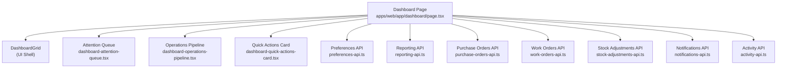
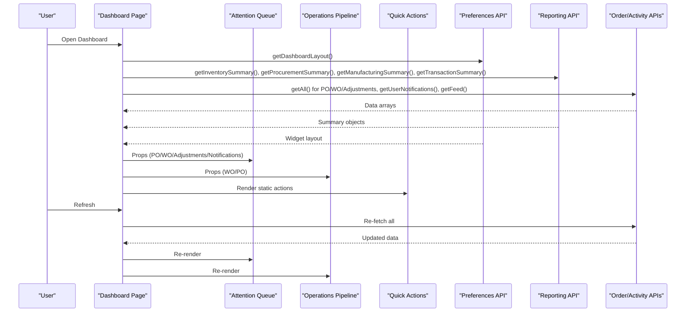
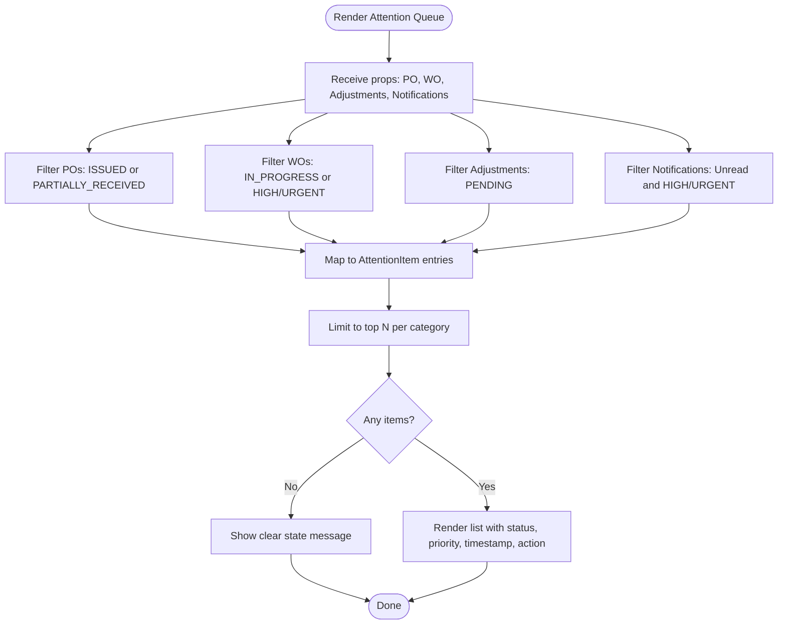
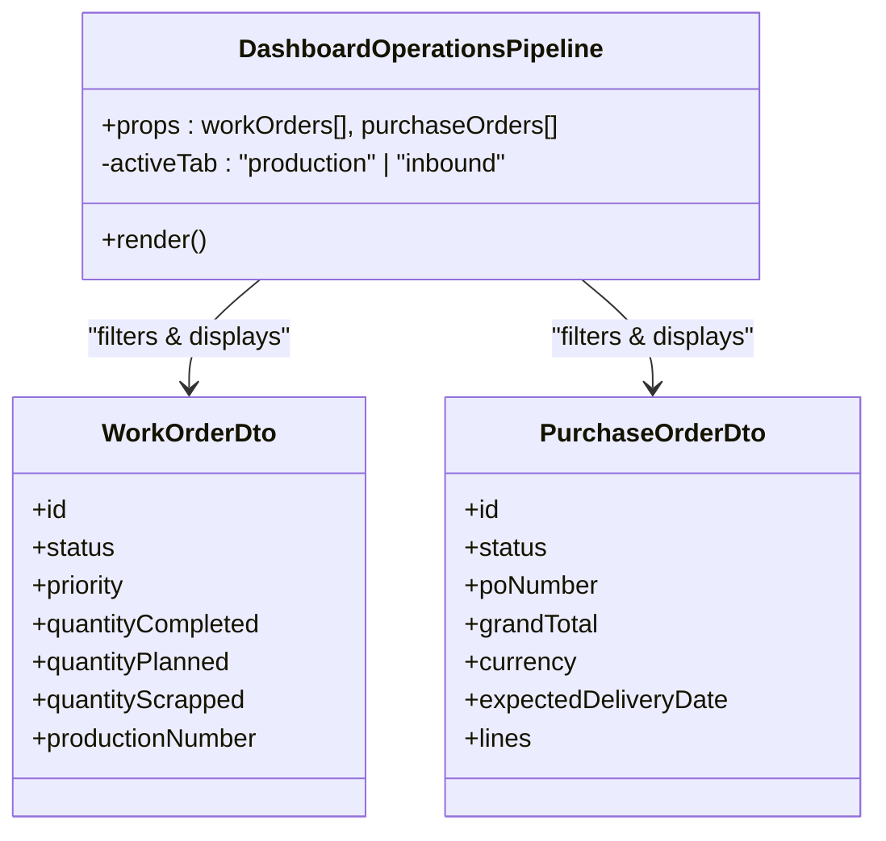
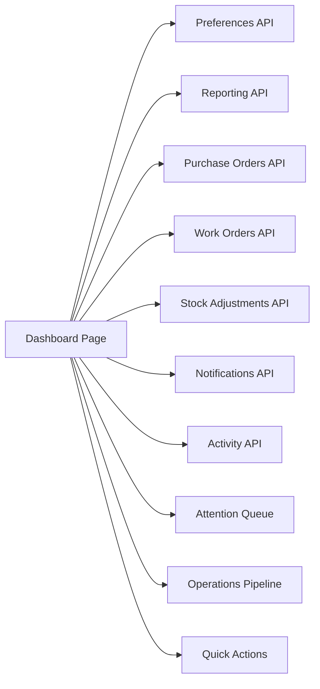

# Dashboard Components

<cite>
**Referenced Files in This Document**
- [page.tsx](file://apps/web/app/dashboard/page.tsx)
- [dashboard-attention-queue.tsx](file://apps/web/components/dashboard/dashboard-attention-queue.tsx)
- [dashboard-operations-pipeline.tsx](file://apps/web/components/dashboard/dashboard-operations-pipeline.tsx)
- [dashboard-quick-actions-card.tsx](file://apps/web/components/dashboard/dashboard-quick-actions-card.tsx)
- [preferences-api.ts](file://apps/web/lib/api/preferences-api.ts)
- [reporting-api.ts](file://apps/web/lib/api/reporting-api.ts)
- [purchase-orders-api.ts](file://apps/web/lib/api/purchase-orders-api.ts)
- [work-orders-api.ts](file://apps/web/lib/api/work-orders-api.ts)
- [stock-adjustments-api.ts](file://apps/web/lib/api/stock-adjustments-api.ts)
- [notifications-api.ts](file://apps/web/lib/api/notifications-api.ts)
- [activity-api.ts](file://apps/web/lib/api/activity-api.ts)
</cite>

## Table of Contents
1. [Introduction](#introduction)
2. [Project Structure](#project-structure)
3. [Core Components](#core-components)
4. [Architecture Overview](#architecture-overview)
5. [Detailed Component Analysis](#detailed-component-analysis)
6. [Dependency Analysis](#dependency-analysis)
7. [Performance Considerations](#performance-considerations)
8. [Troubleshooting Guide](#troubleshooting-guide)
9. [Conclusion](#conclusion)
10. [Appendices](#appendices)

## Introduction
This document explains the dashboard components that provide real-time operational insights and quick actions. It focuses on:
- Attention Queue for monitoring critical business events (open purchase orders, active work orders, pending stock adjustments, high-priority notifications).
- Operations Pipeline visualization for tracking production and inbound workflows.
- Quick Actions card for common tasks like creating records or receiving goods.

It also covers data binding patterns, state management, real-time updates via refresh, integration with backend APIs, customization of dashboard layouts, adding new widgets, and handling user interactions.

## Project Structure
The dashboard is implemented as a Next.js client page that composes multiple reusable widgets. The page orchestrates data fetching from several domain APIs, manages local state, and renders a responsive grid of widgets. Each widget is a self-contained component with its own props and rendering logic.

**Diagram sources**
- [page.tsx:1-492](file://apps/web/app/dashboard/page.tsx#L1-L492)
- [dashboard-attention-queue.tsx:1-254](file://apps/web/components/dashboard/dashboard-attention-queue.tsx#L1-L254)
- [dashboard-operations-pipeline.tsx:1-287](file://apps/web/components/dashboard/dashboard-operations-pipeline.tsx#L1-L287)
- [dashboard-quick-actions-card.tsx:1-106](file://apps/web/components/dashboard/dashboard-quick-actions-card.tsx#L1-L106)
- [preferences-api.ts](file://apps/web/lib/api/preferences-api.ts)
- [reporting-api.ts](file://apps/web/lib/api/reporting-api.ts)
- [purchase-orders-api.ts](file://apps/web/lib/api/purchase-orders-api.ts)
- [work-orders-api.ts](file://apps/web/lib/api/work-orders-api.ts)
- [stock-adjustments-api.ts](file://apps/web/lib/api/stock-adjustments-api.ts)
- [notifications-api.ts](file://apps/web/lib/api/notifications-api.ts)
- [activity-api.ts](file://apps/web/lib/api/activity-api.ts)

**Section sources**
- [page.tsx:1-492](file://apps/web/app/dashboard/page.tsx#L1-L492)

## Core Components
- Attention Queue: Aggregates actionable items from purchase orders, work orders, stock adjustments, and notifications. It filters and ranks items to highlight urgent or overdue operations and provides direct links to act on them.
- Operations Pipeline: Displays two tabs—Production Queue and Inbound Deliveries—with progress indicators and quick actions to receive goods or view details.
- Quick Actions Card: Provides shortcuts to frequent operations such as creating components, purchase orders, receiving goods, recording stock movements, creating work orders, and accessing barcode tools.

These components are composed by the dashboard page, which fetches data concurrently and binds it to each widget via props.

**Section sources**
- [dashboard-attention-queue.tsx:1-254](file://apps/web/components/dashboard/dashboard-attention-queue.tsx#L1-L254)
- [dashboard-operations-pipeline.tsx:1-287](file://apps/web/components/dashboard/dashboard-operations-pipeline.tsx#L1-L287)
- [dashboard-quick-actions-card.tsx:1-106](file://apps/web/components/dashboard/dashboard-quick-actions-card.tsx#L1-L106)
- [page.tsx:100-225](file://apps/web/app/dashboard/page.tsx#L100-L225)

## Architecture Overview
The dashboard follows a unidirectional data flow:
- The page loads initial data using concurrent API calls and stores results in React state.
- Widgets receive data through props and render accordingly.
- User interactions (e.g., toggling widgets, refreshing data) update state and persist preferences when applicable.

**Diagram sources**
- [page.tsx:117-206](file://apps/web/app/dashboard/page.tsx#L117-L206)
- [dashboard-attention-queue.tsx:52-133](file://apps/web/components/dashboard/dashboard-attention-queue.tsx#L52-L133)
- [dashboard-operations-pipeline.tsx:33-43](file://apps/web/components/dashboard/dashboard-operations-pipeline.tsx#L33-L43)

## Detailed Component Analysis

### Attention Queue
Purpose: Surface critical operational items requiring immediate attention across procurement, manufacturing, inventory, and alerts.

Key behaviors:
- Filters open or partially received purchase orders, active or high/urgent work orders, pending stock adjustments, and unread high/urgent notifications.
- Limits displayed items to keep the UI concise.
- Renders status badges, priority tags, timestamps, and action buttons linking to relevant pages.

Data binding:
- Receives arrays of DTOs via props and transforms them into a unified list of attention items.

Real-time updates:
- Responds to parent state changes triggered by refresh; no polling is implemented within this component.

State management:
- Pure presentational component; uses memoization to compute the item list efficiently.

Integration points:
- Uses shared UI primitives (buttons, status badges) and formatting utilities for currency/date.

Customization examples:
- Add a new source type by extending the filter and mapping logic.
- Adjust thresholds (e.g., number of items shown) by changing slice limits.

**Diagram sources**
- [dashboard-attention-queue.tsx:52-133](file://apps/web/components/dashboard/dashboard-attention-queue.tsx#L52-L133)
- [dashboard-attention-queue.tsx:164-251](file://apps/web/components/dashboard/dashboard-attention-queue.tsx#L164-L251)

**Section sources**
- [dashboard-attention-queue.tsx:24-133](file://apps/web/components/dashboard/dashboard-attention-queue.tsx#L24-L133)
- [dashboard-attention-queue.tsx:151-251](file://apps/web/components/dashboard/dashboard-attention-queue.tsx#L151-L251)

### Operations Pipeline
Purpose: Visualize ongoing production and inbound delivery pipelines with progress and quick actions.

Key behaviors:
- Two-tab interface: Production Queue and Inbound Deliveries.
- Filters out completed/closed/cancelled work orders and shows only active ones.
- Shows progress bars for work orders based on completed vs planned quantities.
- For inbound deliveries, lists open purchase orders with totals, due dates, and a “Receive” shortcut.

Data binding:
- Accepts work orders and purchase orders via props and computes filtered lists using memoized hooks.

Real-time updates:
- Updates automatically when parent re-renders after refresh.

State management:
- Local tab state; no server-side persistence.

Integration points:
- Links to work order and purchase order detail pages; uses status badges and formatting utilities.

Customization examples:
- Change filtering rules (e.g., include DRAFT POs).
- Adjust maximum items shown per tab.
- Add additional pipeline stages or metrics.

**Diagram sources**
- [dashboard-operations-pipeline.tsx:20-43](file://apps/web/components/dashboard/dashboard-operations-pipeline.tsx#L20-L43)
- [dashboard-operations-pipeline.tsx:139-283](file://apps/web/components/dashboard/dashboard-operations-pipeline.tsx#L139-L283)

**Section sources**
- [dashboard-operations-pipeline.tsx:20-43](file://apps/web/components/dashboard/dashboard-operations-pipeline.tsx#L20-L43)
- [dashboard-operations-pipeline.tsx:61-283](file://apps/web/components/dashboard/dashboard-operations-pipeline.tsx#L61-L283)

### Quick Actions Card
Purpose: Provide fast access to frequent operational tasks.

Key behaviors:
- Static list of actions with icons, titles, descriptions, and navigation links.
- Responsive grid layout for easy scanning and one-click navigation.

Data binding:
- No external data; fully client-side configuration.

Real-time updates:
- None required; purely navigational.

State management:
- None; pure component.

Integration points:
- Uses shared UI components and icons; links to routes for creating records or performing operations.

Customization examples:
- Add new actions by appending to the actions array.
- Change routing targets or groupings.
- Adjust visual variants or layout density.

**Section sources**
- [dashboard-quick-actions-card.tsx:15-106](file://apps/web/components/dashboard/dashboard-quick-actions-card.tsx#L15-L106)

## Dependency Analysis
The dashboard page depends on multiple APIs to gather domain data and preferences. Widgets depend on the page’s state and use shared UI primitives.

**Diagram sources**
- [page.tsx:117-206](file://apps/web/app/dashboard/page.tsx#L117-L206)
- [preferences-api.ts](file://apps/web/lib/api/preferences-api.ts)
- [reporting-api.ts](file://apps/web/lib/api/reporting-api.ts)
- [purchase-orders-api.ts](file://apps/web/lib/api/purchase-orders-api.ts)
- [work-orders-api.ts](file://apps/web/lib/api/work-orders-api.ts)
- [stock-adjustments-api.ts](file://apps/web/lib/api/stock-adjustments-api.ts)
- [notifications-api.ts](file://apps/web/lib/api/notifications-api.ts)
- [activity-api.ts](file://apps/web/lib/api/activity-api.ts)

**Section sources**
- [page.tsx:117-206](file://apps/web/app/dashboard/page.tsx#L117-L206)

## Performance Considerations
- Concurrent loading: The page uses parallel settlement of API calls to minimize total load time and improve resilience against partial failures.
- Memoization: Widgets compute derived lists with memoization to avoid unnecessary recalculations on re-renders.
- Limited item counts: Slicing results keeps the UI lightweight and predictable.
- Client-only state: Avoids extra round-trips for transient UI state (e.g., tab selection).
- Refresh UX: Clear loading and error states prevent confusion during data updates.

[No sources needed since this section provides general guidance]

## Troubleshooting Guide
Common issues and resolutions:
- Initial load errors: If any API call fails, the page sets an error state and offers retry. Check network connectivity and API availability.
- Partial data: When some endpoints fail, the page continues with available data. Verify specific modules (e.g., reporting, notifications) if certain widgets appear empty.
- Preferences not saving: Toggling widgets persists to preferences; if save fails, the UI still reflects the change locally. Check browser storage and API permissions.
- Stale data: Use the Refresh button to re-fetch all data. Ensure background processes or webhooks are updating backend data as expected.

**Section sources**
- [page.tsx:194-239](file://apps/web/app/dashboard/page.tsx#L194-L239)
- [page.tsx:208-225](file://apps/web/app/dashboard/page.tsx#L208-L225)

## Conclusion
The dashboard integrates multiple domain APIs to present a cohesive, real-time operational view. Widgets are decoupled and driven by props, enabling easy customization and extension. The page centralizes data fetching and state management while providing a flexible layout system for personalization. With clear error handling and refresh mechanisms, the dashboard remains robust under varying conditions.

[No sources needed since this section summarizes without analyzing specific files]

## Appendices

### Data Binding Patterns
- Parent-to-child props: The page passes domain DTOs to widgets (e.g., purchase orders to Attention Queue and Operations Pipeline).
- Derived state: Widgets compute filtered lists from props using memoization.
- Preference persistence: Layout changes are saved to preferences and reloaded on next visit.

**Section sources**
- [page.tsx:100-225](file://apps/web/app/dashboard/page.tsx#L100-L225)
- [dashboard-attention-queue.tsx:52-133](file://apps/web/components/dashboard/dashboard-attention-queue.tsx#L52-L133)
- [dashboard-operations-pipeline.tsx:33-43](file://apps/web/components/dashboard/dashboard-operations-pipeline.tsx#L33-L43)

### Real-Time Updates Strategy
- On-demand refresh: Users can trigger a full refresh to pull latest data from all APIs.
- Future enhancements: Consider polling or WebSocket subscriptions for live updates if required by business needs.

**Section sources**
- [page.tsx:117-206](file://apps/web/app/dashboard/page.tsx#L117-L206)
- [page.tsx:442-453](file://apps/web/app/dashboard/page.tsx#L442-L453)

### State Management Overview
- Local React state: Holds widget configurations, favorites, domain summaries, queues, and UI flags (loading, refreshing, error).
- Isolation: Each widget maintains minimal internal state (e.g., tab selection), keeping the page state focused on data and layout.

**Section sources**
- [page.tsx:95-115](file://apps/web/app/dashboard/page.tsx#L95-L115)
- [dashboard-operations-pipeline.tsx:31-31](file://apps/web/components/dashboard/dashboard-operations-pipeline.tsx#L31-L31)

### Backend Integration Points
- Preferences API: Loads and saves dashboard layout.
- Reporting API: Supplies aggregated metrics for KPI cards and charts.
- Domain APIs: Fetch operational queues (purchase orders, work orders, stock adjustments, notifications, activity feed).

**Section sources**
- [preferences-api.ts](file://apps/web/lib/api/preferences-api.ts)
- [reporting-api.ts](file://apps/web/lib/api/reporting-api.ts)
- [purchase-orders-api.ts](file://apps/web/lib/api/purchase-orders-api.ts)
- [work-orders-api.ts](file://apps/web/lib/api/work-orders-api.ts)
- [stock-adjustments-api.ts](file://apps/web/lib/api/stock-adjustments-api.ts)
- [notifications-api.ts](file://apps/web/lib/api/notifications-api.ts)
- [activity-api.ts](file://apps/web/lib/api/activity-api.ts)

### Customizing Dashboard Layouts
- Toggle widgets: Use the Customize dialog to enable/disable widgets; changes are persisted to preferences.
- Restore defaults: Reset to default widget set via the provided action.

**Section sources**
- [page.tsx:208-225](file://apps/web/app/dashboard/page.tsx#L208-L225)
- [page.tsx:455-463](file://apps/web/app/dashboard/page.tsx#L455-L463)

### Adding New Widgets
Steps:
1. Create a new component under the dashboard folder.
2. Define props and rendering logic.
3. Add a default widget config entry in the page.
4. Compose the widget in the page and pass necessary props.
5. Optionally add data fetching and state management in the page.

**Section sources**
- [page.tsx:50-93](file://apps/web/app/dashboard/page.tsx#L50-L93)
- [page.tsx:468-479](file://apps/web/app/dashboard/page.tsx#L468-L479)

### Handling User Interactions
- Navigation: Widgets link to relevant pages for detailed views or actions.
- Actions: Buttons trigger navigation to create or process records (e.g., receiving goods).
- Refresh: Button triggers re-fetch of all data and updates last sync time.

**Section sources**
- [dashboard-attention-queue.tsx:200-247](file://apps/web/components/dashboard/dashboard-attention-queue.tsx#L200-L247)
- [dashboard-operations-pipeline.tsx:163-283](file://apps/web/components/dashboard/dashboard-operations-pipeline.tsx#L163-L283)
- [dashboard-quick-actions-card.tsx:81-102](file://apps/web/components/dashboard/dashboard-quick-actions-card.tsx#L81-L102)
- [page.tsx:442-453](file://apps/web/app/dashboard/page.tsx#L442-L453)