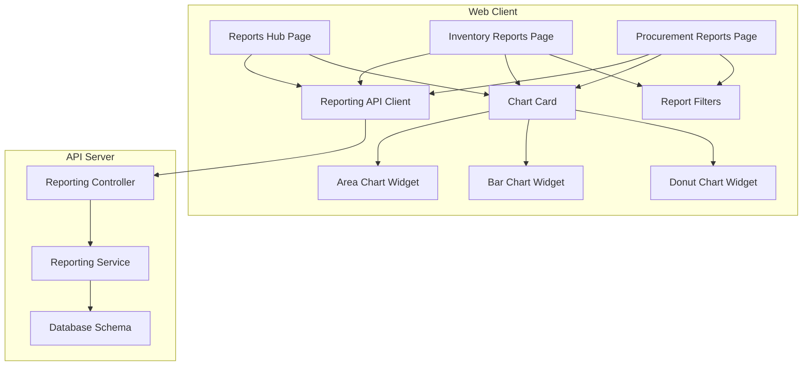
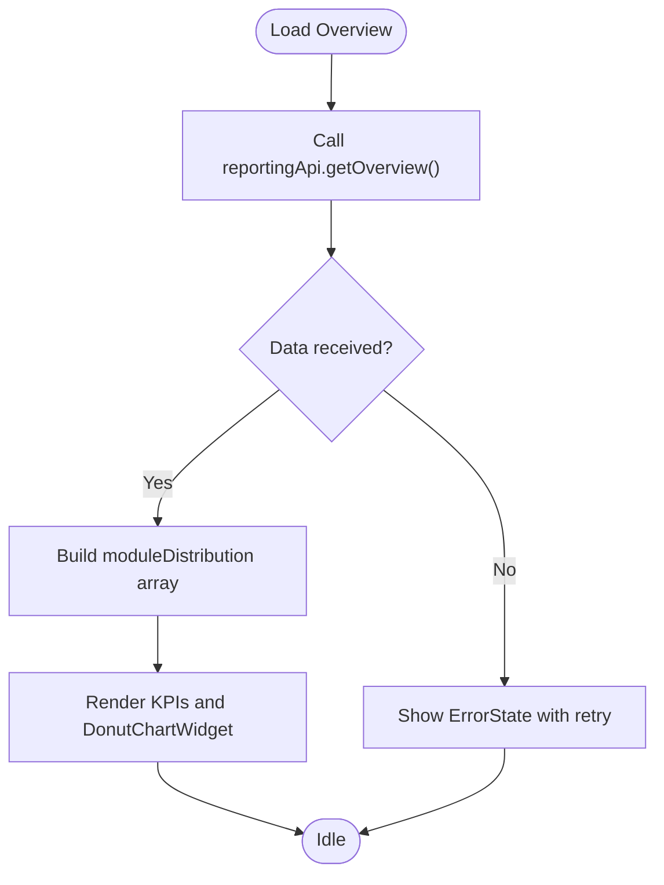
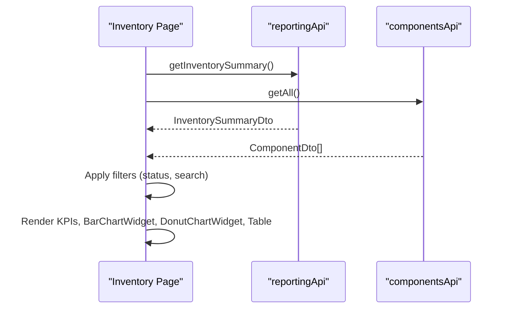
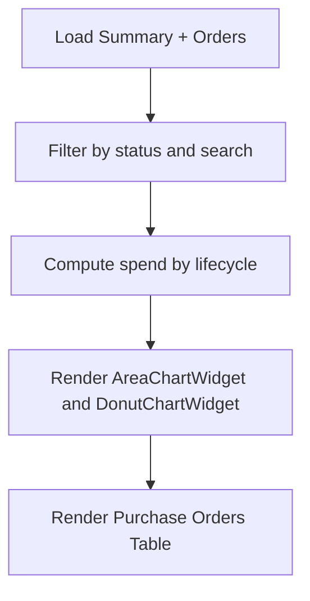
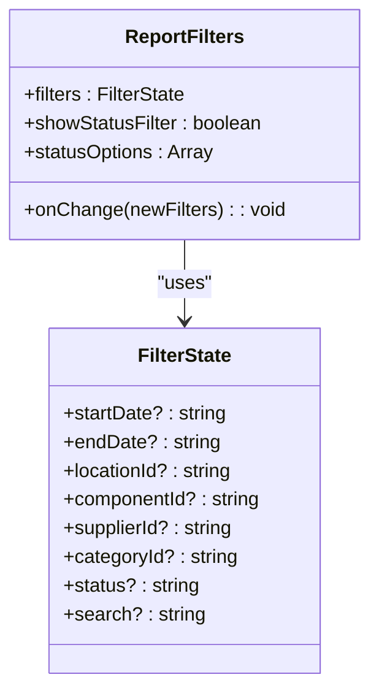
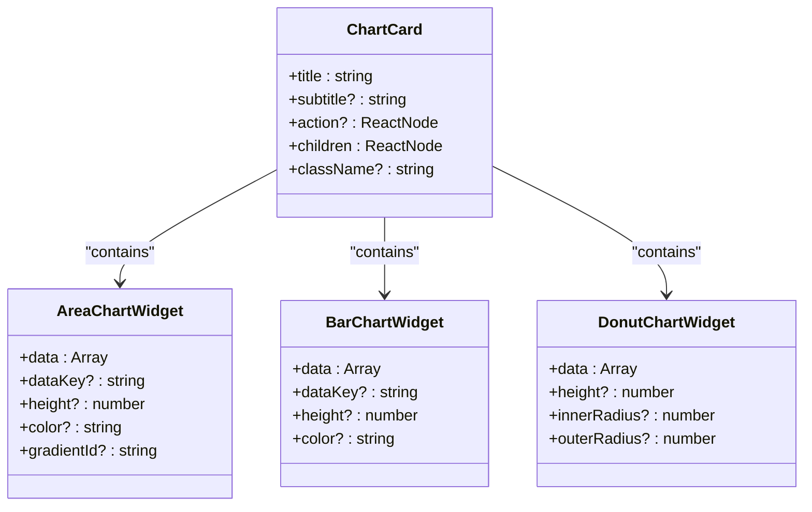
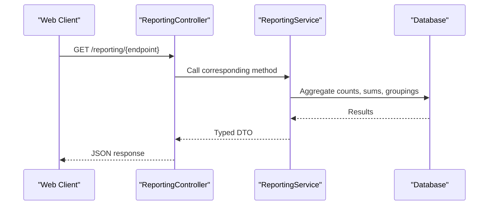
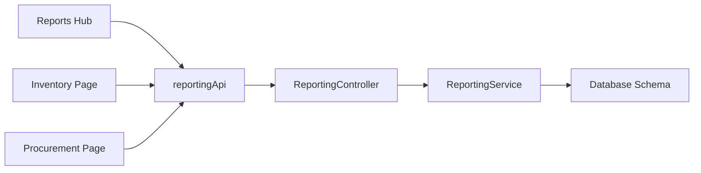

# Reporting & Analytics Components

<cite>
**Referenced Files in This Document**
- [apps/web/app/reports/page.tsx](file://apps/web/app/reports/page.tsx)
- [apps/web/components/charts/chart-card.tsx](file://apps/web/components/charts/chart-card.tsx)
- [apps/web/components/charts/area-chart-widget.tsx](file://apps/web/components/charts/area-chart-widget.tsx)
- [apps/web/components/charts/bar-chart-widget.tsx](file://apps/web/components/charts/bar-chart-widget.tsx)
- [apps/web/components/charts/donut-chart-widget.tsx](file://apps/web/components/charts/donut-chart-widget.tsx)
- [apps/web/lib/api/reporting-api.ts](file://apps/web/lib/api/reporting-api.ts)
- [apps/api/src/reporting/reporting.controller.ts](file://apps/api/src/reporting/reporting.controller.ts)
- [apps/api/src/reporting/reporting.service.ts](file://apps/api/src/reporting/reporting.service.ts)
- [apps/web/app/reports/inventory/page.tsx](file://apps/web/app/reports/inventory/page.tsx)
- [apps/web/app/reports/procurement/page.tsx](file://apps/web/app/reports/procurement/page.tsx)
- [apps/web/components/reports/report-filters.tsx](file://apps/web/components/reports/report-filters.tsx)
</cite>

## Table of Contents
1. [Introduction](#introduction)
2. [Project Structure](#project-structure)
3. [Core Components](#core-components)
4. [Architecture Overview](#architecture-overview)
5. [Detailed Component Analysis](#detailed-component-analysis)
6. [Dependency Analysis](#dependency-analysis)
7. [Performance Considerations](#performance-considerations)
8. [Troubleshooting Guide](#troubleshooting-guide)
9. [Conclusion](#conclusion)
10. [Appendices](#appendices)

## Introduction
This document explains the reporting and analytics components across the web application and API. It covers filter systems, trend visualization cards, chart widgets, data aggregation patterns, real-time update strategies, filtering approaches, export capabilities, backend integration points, performance optimization for large datasets, and customization options for different chart types. It also provides practical examples for creating custom reports, implementing advanced filters, and optimizing chart rendering performance.

## Project Structure
The reporting feature spans a Next.js client and a NestJS API:
- Web pages aggregate KPIs and render charts using reusable widgets.
- The API exposes REST endpoints that compute summaries from the database schema.
- Shared UI components provide consistent chart cards and filter controls.



**Diagram sources**
- [apps/web/app/reports/page.tsx:1-221](file://apps/web/app/reports/page.tsx#L1-L221)
- [apps/web/app/reports/inventory/page.tsx:1-302](file://apps/web/app/reports/inventory/page.tsx#L1-L302)
- [apps/web/app/reports/procurement/page.tsx:1-332](file://apps/web/app/reports/procurement/page.tsx#L1-L332)
- [apps/web/components/charts/chart-card.tsx:1-45](file://apps/web/components/charts/chart-card.tsx#L1-L45)
- [apps/web/components/charts/area-chart-widget.tsx:1-98](file://apps/web/components/charts/area-chart-widget.tsx#L1-L98)
- [apps/web/components/charts/bar-chart-widget.tsx:1-88](file://apps/web/components/charts/bar-chart-widget.tsx#L1-L88)
- [apps/web/components/charts/donut-chart-widget.tsx:1-99](file://apps/web/components/charts/donut-chart-widget.tsx#L1-L99)
- [apps/web/lib/api/reporting-api.ts:1-113](file://apps/web/lib/api/reporting-api.ts#L1-L113)
- [apps/api/src/reporting/reporting.controller.ts:1-48](file://apps/api/src/reporting/reporting.controller.ts#L1-L48)
- [apps/api/src/reporting/reporting.service.ts:1-455](file://apps/api/src/reporting/reporting.service.ts#L1-L455)

**Section sources**
- [apps/web/app/reports/page.tsx:1-221](file://apps/web/app/reports/page.tsx#L1-L221)
- [apps/web/lib/api/reporting-api.ts:1-113](file://apps/web/lib/api/reporting-api.ts#L1-L113)
- [apps/api/src/reporting/reporting.controller.ts:1-48](file://apps/api/src/reporting/reporting.controller.ts#L1-L48)
- [apps/api/src/reporting/reporting.service.ts:1-455](file://apps/api/src/reporting/reporting.service.ts#L1-L455)

## Core Components
- Reporting overview page aggregates cross-cutting metrics and renders module distribution via a donut chart. It uses a chart card to frame visualizations and an empty state when time-series data is not available.
- Inventory and procurement report pages fetch summary data and entity lists, then present KPI cards, charts, and filtered tables with drill-down links.
- Reusable chart widgets (area, bar, donut) are built on a responsive charting library and support configurable colors, heights, and legends.
- A shared report filter component standardizes date range, status, and search inputs across report pages.

Key responsibilities:
- Data fetching and error handling in pages.
- Aggregation and transformation of raw data into chart-ready structures.
- Consistent presentation via chart cards and stat cards.
- Filter state management and reset behavior.

**Section sources**
- [apps/web/app/reports/page.tsx:67-182](file://apps/web/app/reports/page.tsx#L67-L182)
- [apps/web/app/reports/inventory/page.tsx:33-83](file://apps/web/app/reports/inventory/page.tsx#L33-L83)
- [apps/web/app/reports/procurement/page.tsx:42-91](file://apps/web/app/reports/procurement/page.tsx#L42-L91)
- [apps/web/components/charts/chart-card.tsx:6-44](file://apps/web/components/charts/chart-card.tsx#L6-L44)
- [apps/web/components/charts/area-chart-widget.tsx:14-98](file://apps/web/components/charts/area-chart-widget.tsx#L14-L98)
- [apps/web/components/charts/bar-chart-widget.tsx:14-88](file://apps/web/components/charts/bar-chart-widget.tsx#L14-L88)
- [apps/web/components/charts/donut-chart-widget.tsx:13-99](file://apps/web/components/charts/donut-chart-widget.tsx#L13-L99)
- [apps/web/components/reports/report-filters.tsx:16-147](file://apps/web/components/reports/report-filters.tsx#L16-L147)

## Architecture Overview
The reporting flow starts at the web page, which calls the reporting API client to fetch summaries and entity lists. The NestJS controller routes requests to the reporting service, which queries the database schema and returns aggregated results. Charts consume these results to render trends and distributions.

```mermaid
sequenceDiagram
participant U as "User"
participant P as "Reports Page"
participant C as "Reporting API Client"
participant RCtrl as "Reporting Controller"
participant RSvc as "Reporting Service"
participant DB as "Database"
U->>P : Open Reports Hub
P->>C : GET /reporting/overview
C->>RCtrl : HTTP GET /reporting/overview
RCtrl->>RSvc : getOverviewMetrics()
RSvc->>DB : Count components, locations, POs, WOs, projects, transactions; sum spend
DB-->>RSvc : Aggregated counts and totals
RSvc-->>RCtrl : OverviewMetricsDto
RCtrl-->>C : JSON response
C-->>P : Metrics
P->>P : Render KPIs and DonutChartWidget
```

**Diagram sources**
- [apps/web/app/reports/page.tsx:72-89](file://apps/web/app/reports/page.tsx#L72-L89)
- [apps/web/lib/api/reporting-api.ts:95-112](file://apps/web/lib/api/reporting-api.ts#L95-L112)
- [apps/api/src/reporting/reporting.controller.ts:8-11](file://apps/api/src/reporting/reporting.controller.ts#L8-L11)
- [apps/api/src/reporting/reporting.service.ts:28-54](file://apps/api/src/reporting/reporting.service.ts#L28-L54)

## Detailed Component Analysis

### Reporting Overview Page
- Fetches overview metrics and displays KPI cards and a module activity ratio donut chart.
- Uses a chart card to wrap visualizations and shows an empty state when no time-series source is connected.
- Provides navigation to operational report modules.



**Diagram sources**
- [apps/web/app/reports/page.tsx:72-122](file://apps/web/app/reports/page.tsx#L72-L122)
- [apps/web/app/reports/page.tsx:160-182](file://apps/web/app/reports/page.tsx#L160-L182)

**Section sources**
- [apps/web/app/reports/page.tsx:67-182](file://apps/web/app/reports/page.tsx#L67-L182)

### Inventory Reports Page
- Loads inventory summary and component list concurrently.
- Applies client-side filters (status, search) to the component list.
- Renders KPIs, a bar chart for operational mix, and a donut chart for component status.
- Provides an entity table with drill-down links to component details.



**Diagram sources**
- [apps/web/app/reports/inventory/page.tsx:46-83](file://apps/web/app/reports/inventory/page.tsx#L46-L83)
- [apps/web/app/reports/inventory/page.tsx:180-201](file://apps/web/app/reports/inventory/page.tsx#L180-L201)
- [apps/web/app/reports/inventory/page.tsx:247-269](file://apps/web/app/reports/inventory/page.tsx#L247-L269)

**Section sources**
- [apps/web/app/reports/inventory/page.tsx:33-83](file://apps/web/app/reports/inventory/page.tsx#L33-L83)
- [apps/web/app/reports/inventory/page.tsx:180-201](file://apps/web/app/reports/inventory/page.tsx#L180-L201)
- [apps/web/app/reports/inventory/page.tsx:247-269](file://apps/web/app/reports/inventory/page.tsx#L247-L269)

### Procurement Reports Page
- Loads procurement summary and purchase order list concurrently.
- Applies client-side filters (status, search) to the purchase order list.
- Computes spend by lifecycle stages and renders area and donut charts.
- Displays a purchase orders table with drill-down links.



**Diagram sources**
- [apps/web/app/reports/procurement/page.tsx:55-91](file://apps/web/app/reports/procurement/page.tsx#L55-L91)
- [apps/web/app/reports/procurement/page.tsx:207-225](file://apps/web/app/reports/procurement/page.tsx#L207-L225)
- [apps/web/app/reports/procurement/page.tsx:273-295](file://apps/web/app/reports/procurement/page.tsx#L273-L295)

**Section sources**
- [apps/web/app/reports/procurement/page.tsx:42-91](file://apps/web/app/reports/procurement/page.tsx#L42-L91)
- [apps/web/app/reports/procurement/page.tsx:207-225](file://apps/web/app/reports/procurement/page.tsx#L207-L225)
- [apps/web/app/reports/procurement/page.tsx:273-295](file://apps/web/app/reports/procurement/page.tsx#L273-L295)

### Report Filters Component
- Provides standardized inputs for start/end dates, optional status select, and search term.
- Supports resetting all filters to defaults.
- Emits updated filter state to parent pages for filtering logic.



**Diagram sources**
- [apps/web/components/reports/report-filters.tsx:16-147](file://apps/web/components/reports/report-filters.tsx#L16-L147)

**Section sources**
- [apps/web/components/reports/report-filters.tsx:16-147](file://apps/web/components/reports/report-filters.tsx#L16-L147)

### Chart Widgets and Chart Card
- ChartCard wraps any chart content with title, subtitle, optional action, and consistent layout.
- AreaChartWidget renders time-series or categorical trends with gradient fills and tooltips.
- BarChartWidget renders categorical comparisons with rounded bars and tooltips.
- DonutChartWidget renders distribution charts with customizable inner/outer radii and legend.



**Diagram sources**
- [apps/web/components/charts/chart-card.tsx:6-44](file://apps/web/components/charts/chart-card.tsx#L6-L44)
- [apps/web/components/charts/area-chart-widget.tsx:14-98](file://apps/web/components/charts/area-chart-widget.tsx#L14-L98)
- [apps/web/components/charts/bar-chart-widget.tsx:14-88](file://apps/web/components/charts/bar-chart-widget.tsx#L14-L88)
- [apps/web/components/charts/donut-chart-widget.tsx:13-99](file://apps/web/components/charts/donut-chart-widget.tsx#L13-L99)

**Section sources**
- [apps/web/components/charts/chart-card.tsx:6-44](file://apps/web/components/charts/chart-card.tsx#L6-L44)
- [apps/web/components/charts/area-chart-widget.tsx:14-98](file://apps/web/components/charts/area-chart-widget.tsx#L14-L98)
- [apps/web/components/charts/bar-chart-widget.tsx:14-88](file://apps/web/components/charts/bar-chart-widget.tsx#L14-L88)
- [apps/web/components/charts/donut-chart-widget.tsx:13-99](file://apps/web/components/charts/donut-chart-widget.tsx#L13-L99)

### Backend Reporting API
- Controller exposes endpoints for overview and domain-specific summaries.
- Service performs SQL aggregations and returns typed DTOs consumed by the web client.
- Includes financial summary and cash flow forecast computations.



**Diagram sources**
- [apps/api/src/reporting/reporting.controller.ts:4-47](file://apps/api/src/reporting/reporting.controller.ts#L4-L47)
- [apps/api/src/reporting/reporting.service.ts:28-455](file://apps/api/src/reporting/reporting.service.ts#L28-L455)

**Section sources**
- [apps/api/src/reporting/reporting.controller.ts:4-47](file://apps/api/src/reporting/reporting.controller.ts#L4-L47)
- [apps/api/src/reporting/reporting.service.ts:28-455](file://apps/api/src/reporting/reporting.service.ts#L28-L455)

## Dependency Analysis
- Web pages depend on the reporting API client for summaries and on domain APIs for entity lists.
- Pages compose reusable chart widgets and a shared filter component.
- The API controller depends on the reporting service, which depends on the database schema and query utilities.



**Diagram sources**
- [apps/web/lib/api/reporting-api.ts:95-112](file://apps/web/lib/api/reporting-api.ts#L95-L112)
- [apps/api/src/reporting/reporting.controller.ts:4-47](file://apps/api/src/reporting/reporting.controller.ts#L4-L47)
- [apps/api/src/reporting/reporting.service.ts:1-24](file://apps/api/src/reporting/reporting.service.ts#L1-L24)

**Section sources**
- [apps/web/lib/api/reporting-api.ts:95-112](file://apps/web/lib/api/reporting-api.ts#L95-L112)
- [apps/api/src/reporting/reporting.controller.ts:4-47](file://apps/api/src/reporting/reporting.controller.ts#L4-L47)
- [apps/api/src/reporting/reporting.service.ts:1-24](file://apps/api/src/reporting/reporting.service.ts#L1-L24)

## Performance Considerations
- Prefer server-side aggregation for heavy metrics (counts, sums, groupings) to minimize payload size and client computation.
- Use concurrent requests where safe (e.g., summary and entity lists) to reduce total load time.
- Keep chart data small and pre-aggregated; avoid sending raw transactional rows to the client.
- Debounce or throttle frequent filter changes if adding live search or date range updates.
- For large datasets, consider pagination or virtualization in tables and limit chart series to top N categories.
- Avoid re-rendering entire pages on minor filter changes; isolate state per section and memoize derived values.
- Cache stable reference data (e.g., categories, statuses) to reduce repeated fetches.

[No sources needed since this section provides general guidance]

## Troubleshooting Guide
- If the overview trend chart shows an empty state, ensure a real time-series reporting source is connected; the current view does not fabricate data.
- Check network errors when loading summaries; pages display an error state with retry actions.
- Verify filter state resets correctly; use the provided reset function to clear all fields.
- Validate DTO shapes match between API responses and client expectations to prevent runtime type mismatches.
- Confirm permissions for reporting endpoints if access is denied; roles should include read/export permissions as defined in the permission registry.

**Section sources**
- [apps/web/app/reports/page.tsx:91-103](file://apps/web/app/reports/page.tsx#L91-L103)
- [apps/web/app/reports/inventory/page.tsx:166-178](file://apps/web/app/reports/inventory/page.tsx#L166-L178)
- [apps/web/app/reports/procurement/page.tsx:175-187](file://apps/web/app/reports/procurement/page.tsx#L175-L187)
- [apps/web/components/reports/report-filters.tsx:40-51](file://apps/web/components/reports/report-filters.tsx#L40-L51)

## Conclusion
The reporting and analytics system combines reusable chart widgets, consistent chart cards, and a shared filter component to deliver actionable insights. Backend services perform robust aggregations, exposing typed summaries to the client. Pages implement efficient data fetching, client-side filtering, and clear error states. With careful attention to data sizes, caching, and server-side aggregation, the system scales well for larger datasets while remaining maintainable and extensible.

[No sources needed since this section summarizes without analyzing specific files]

## Appendices

### Creating Custom Reports
- Add a new report page under apps/web/app/reports/<domain>/page.tsx.
- Fetch summary data via reportingApi methods and entity lists via domain APIs.
- Compose KPI cards, charts (area, bar, donut), and a table with filters.
- Reuse ReportFilters for date ranges, status, and search inputs.

**Section sources**
- [apps/web/app/reports/inventory/page.tsx:33-83](file://apps/web/app/reports/inventory/page.tsx#L33-L83)
- [apps/web/app/reports/procurement/page.tsx:42-91](file://apps/web/app/reports/procurement/page.tsx#L42-L91)
- [apps/web/components/reports/report-filters.tsx:16-147](file://apps/web/components/reports/report-filters.tsx#L16-L147)

### Implementing Advanced Filters
- Extend FilterState with additional fields (e.g., locationId, categoryId).
- Wire up new inputs in ReportFilters and propagate changes via onChange.
- Apply filters in the page’s useMemo to derive filtered datasets efficiently.

**Section sources**
- [apps/web/components/reports/report-filters.tsx:16-147](file://apps/web/components/reports/report-filters.tsx#L16-L147)
- [apps/web/app/reports/inventory/page.tsx:71-83](file://apps/web/app/reports/inventory/page.tsx#L71-L83)
- [apps/web/app/reports/procurement/page.tsx:80-91](file://apps/web/app/reports/procurement/page.tsx#L80-L91)

### Optimizing Chart Rendering Performance
- Pre-aggregate data on the server; pass only chart-ready arrays to widgets.
- Limit series length and use memoized chart configurations.
- Use responsive containers and avoid unnecessary re-renders by stabilizing props.
- Provide empty states for missing data to avoid wasted rendering cycles.

**Section sources**
- [apps/web/components/charts/area-chart-widget.tsx:35-41](file://apps/web/components/charts/area-chart-widget.tsx#L35-L41)
- [apps/web/components/charts/bar-chart-widget.tsx:33-39](file://apps/web/components/charts/bar-chart-widget.tsx#L33-L39)
- [apps/web/components/charts/donut-chart-widget.tsx:43-49](file://apps/web/components/charts/donut-chart-widget.tsx#L43-L49)

### Export Capabilities
- Define permissions for exporting reports in the permission registry.
- On the client, add export actions to pages and trigger downloads based on visible filtered data or server-generated exports.
- Ensure exported formats align with user needs (CSV, PDF) and respect data privacy constraints.

**Section sources**
- [apps/api/src/permissions/permissions.service.ts:138-150](file://apps/api/src/permissions/permissions.service.ts#L138-L150)