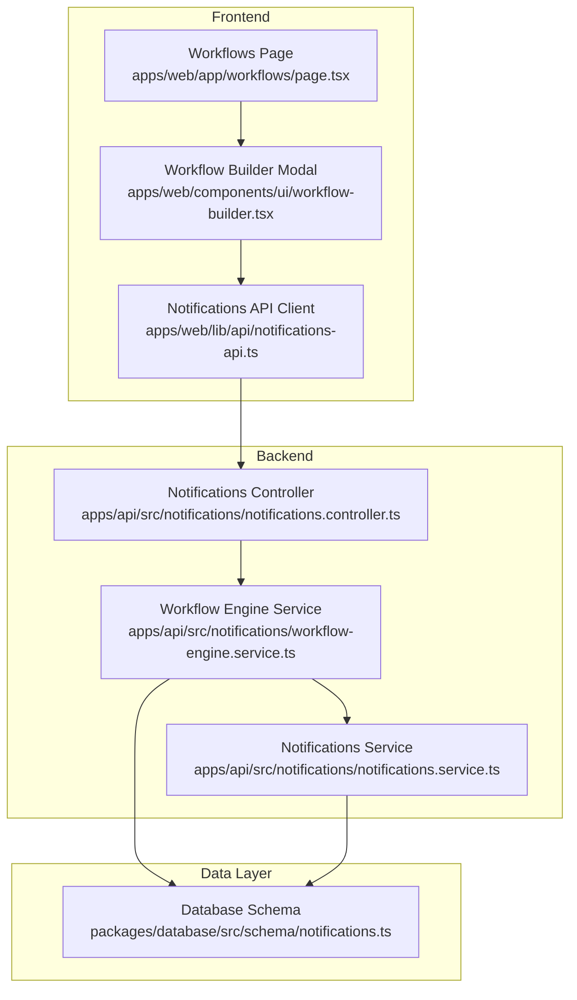
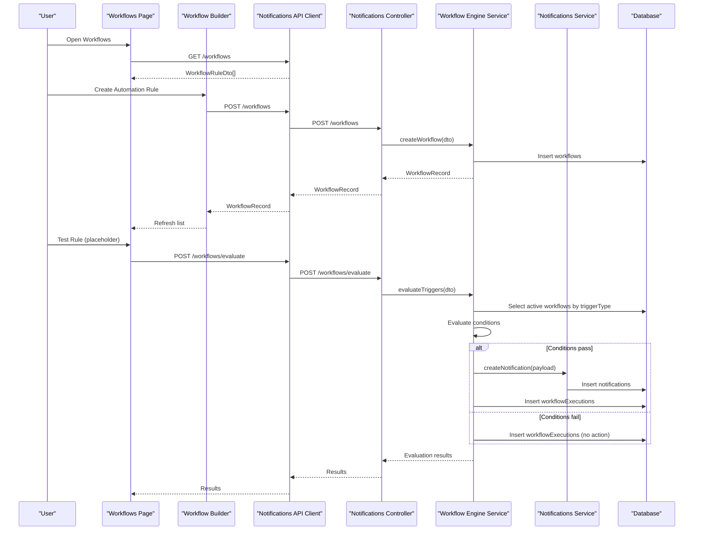
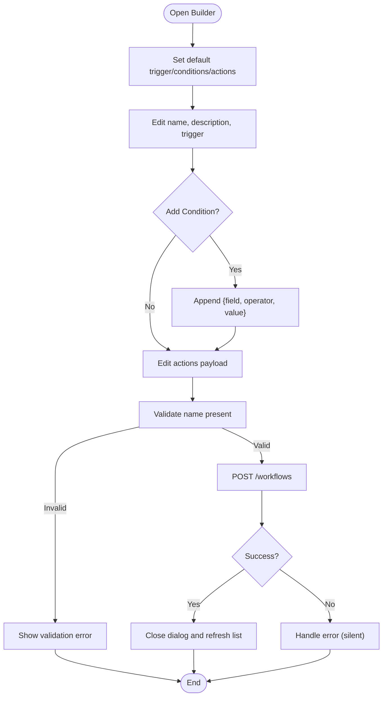
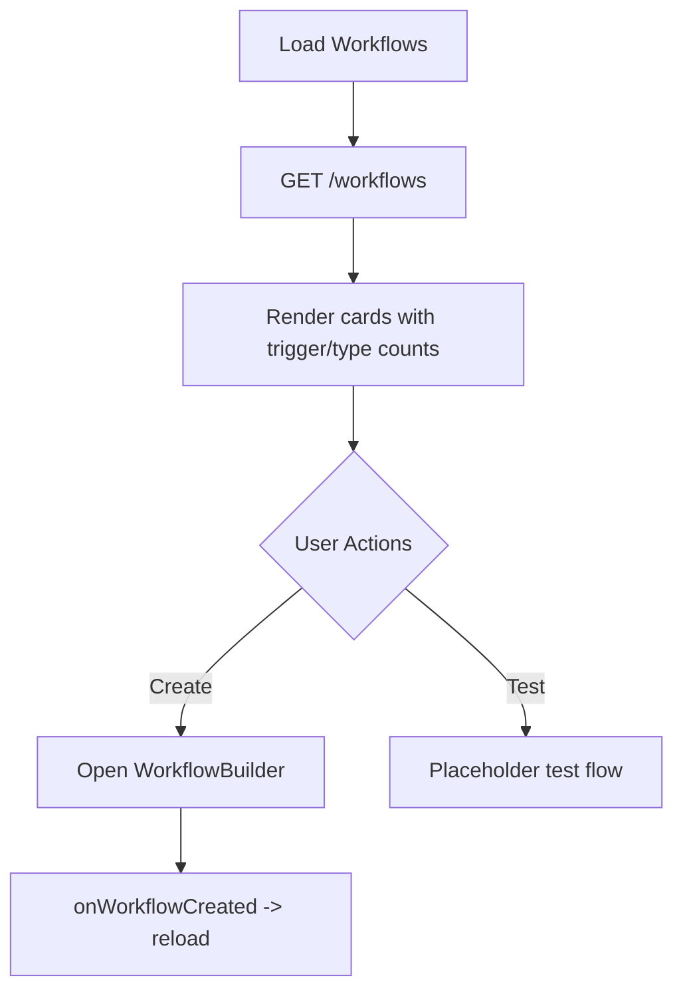
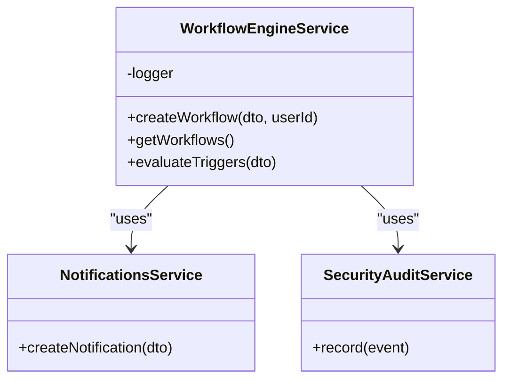
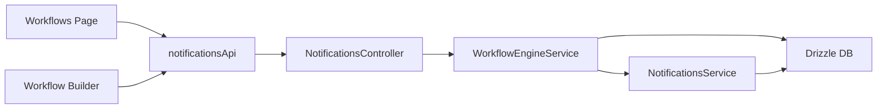

# Workflow Builder Components

<cite>
**Referenced Files in This Document**   
- [workflow-builder.tsx](file://apps/web/components/ui/workflow-builder.tsx)
- [page.tsx](file://apps/web/app/workflows/page.tsx)
- [notifications-api.ts](file://apps/web/lib/api/notifications-api.ts)
- [notifications.controller.ts](file://apps/api/src/notifications/notifications.controller.ts)
- [workflow-engine.service.ts](file://apps/api/src/notifications/workflow-engine.service.ts)
- [dtos.ts](file://apps/api/src/notifications/dtos.ts)
- [notifications.service.ts](file://apps/api/src/notifications/notifications.service.ts)
- [notifications.ts](file://packages/database/src/schema/notifications.ts)
</cite>

## Table of Contents
1. [Introduction](#introduction)
2. [Project Structure](#project-structure)
3. [Core Components](#core-components)
4. [Architecture Overview](#architecture-overview)
5. [Detailed Component Analysis](#detailed-component-analysis)
6. [Dependency Analysis](#dependency-analysis)
7. [Performance Considerations](#performance-considerations)
8. [Troubleshooting Guide](#troubleshooting-guide)
9. [Conclusion](#conclusion)

## Introduction
This document explains the workflow builder component that enables visual creation and management of event-driven automation rules. It covers the user interface for building workflows, the server-side execution engine, data models, API contracts, and integration with notifications and audit logging. You will learn how to create custom workflow nodes (actions), implement conditional logic, handle workflow states, and integrate these workflows into business processes such as inventory alerts and procurement triggers.

## Project Structure
The workflow feature spans both frontend and backend:
- Frontend: A page lists existing workflows and opens a modal dialog to create new ones. The builder composes trigger, conditions, and actions.
- Backend: Controllers expose endpoints for CRUD on workflows and evaluation. The engine evaluates conditions and executes actions, persisting execution logs.
- Data: Drizzle schema defines tables for notifications, preferences, workflows, and workflow executions.



**Diagram sources**
- [page.tsx:1-160](file://apps/web/app/workflows/page.tsx#L1-L160)
- [workflow-builder.tsx:1-280](file://apps/web/components/ui/workflow-builder.tsx#L1-L280)
- [notifications-api.ts:1-112](file://apps/web/lib/api/notifications-api.ts#L1-L112)
- [notifications.controller.ts:1-81](file://apps/api/src/notifications/notifications.controller.ts#L1-L81)
- [workflow-engine.service.ts:1-147](file://apps/api/src/notifications/workflow-engine.service.ts#L1-L147)
- [notifications.service.ts:1-238](file://apps/api/src/notifications/notifications.service.ts#L1-L238)
- [notifications.ts:1-130](file://packages/database/src/schema/notifications.ts#L1-L130)

**Section sources**
- [page.tsx:1-160](file://apps/web/app/workflows/page.tsx#L1-L160)
- [workflow-builder.tsx:1-280](file://apps/web/components/ui/workflow-builder.tsx#L1-L280)
- [notifications-api.ts:1-112](file://apps/web/lib/api/notifications-api.ts#L1-L112)
- [notifications.controller.ts:1-81](file://apps/api/src/notifications/notifications.controller.ts#L1-L81)
- [workflow-engine.service.ts:1-147](file://apps/api/src/notifications/workflow-engine.service.ts#L1-L147)
- [notifications.service.ts:1-238](file://apps/api/src/notifications/notifications.service.ts#L1-L238)
- [notifications.ts:1-130](file://packages/database/src/schema/notifications.ts#L1-L130)

## Core Components
- Workflow Builder UI: A modal dialog where users define rule name, description, trigger type, conditions, and actions. It sends a POST request to create a workflow and refreshes the list upon success.
- Workflows Page: Displays metrics and cards for each workflow, supports opening the builder, and provides a “Test Rule” action placeholder.
- Notifications API Client: Typed client methods for listing, creating, and evaluating workflows.
- Notifications Controller: Exposes REST endpoints for notifications and workflows, including an evaluate endpoint.
- Workflow Engine Service: Persists workflows, evaluates active rules against incoming triggers, executes actions (e.g., create notification), and records execution logs.
- Notifications Service: Creates notifications and integrates with activity logging.
- Database Schema: Defines tables for notifications, preferences, workflows, and workflow executions.

**Section sources**
- [workflow-builder.tsx:23-90](file://apps/web/components/ui/workflow-builder.tsx#L23-L90)
- [page.tsx:14-159](file://apps/web/app/workflows/page.tsx#L14-L159)
- [notifications-api.ts:32-111](file://apps/web/lib/api/notifications-api.ts#L32-L111)
- [notifications.controller.ts:65-79](file://apps/api/src/notifications/notifications.controller.ts#L65-L79)
- [workflow-engine.service.ts:25-55](file://apps/api/src/notifications/workflow-engine.service.ts#L25-L55)
- [notifications.service.ts:34-72](file://apps/api/src/notifications/notifications.service.ts#L34-L72)
- [notifications.ts:72-121](file://packages/database/src/schema/notifications.ts#L72-L121)

## Architecture Overview
The system follows a simple event-driven pattern:
- Users configure workflows via the UI.
- The backend persists workflow definitions.
- When a trigger occurs, the engine evaluates all active rules matching the trigger type.
- If conditions pass, configured actions execute (currently CREATE_NOTIFICATION).
- Execution results are logged for observability.



**Diagram sources**
- [page.tsx:20-36](file://apps/web/app/workflows/page.tsx#L20-L36)
- [workflow-builder.tsx:58-90](file://apps/web/components/ui/workflow-builder.tsx#L58-L90)
- [notifications-api.ts:84-110](file://apps/web/lib/api/notifications-api.ts#L84-L110)
- [notifications.controller.ts:65-79](file://apps/api/src/notifications/notifications.controller.ts#L65-L79)
- [workflow-engine.service.ts:57-145](file://apps/api/src/notifications/workflow-engine.service.ts#L57-L145)
- [notifications.service.ts:34-72](file://apps/api/src/notifications/notifications.service.ts#L34-L72)
- [notifications.ts:72-121](file://packages/database/src/schema/notifications.ts#L72-L121)

## Detailed Component Analysis

### Workflow Builder UI (Modal Dialog)
- Purpose: Collects workflow metadata (name, description), selects a trigger event, configures multiple conditions, and sets one or more actions.
- Interaction patterns:
  - Trigger selection via dropdown.
  - Dynamic addition of condition rows with field/operator/value.
  - Action configuration currently focused on creating a system notification.
  - Save button triggers API call and closes dialog on success.
- Validation:
  - Name is required before saving.
  - Default values provided for trigger, conditions, and actions.
- Error handling:
  - Loading state disables close and save during submission.
  - Errors are swallowed; consider surfacing messages to the user.



**Diagram sources**
- [workflow-builder.tsx:34-90](file://apps/web/components/ui/workflow-builder.tsx#L34-L90)
- [workflow-builder.tsx:152-235](file://apps/web/components/ui/workflow-builder.tsx#L152-L235)
- [workflow-builder.tsx:238-276](file://apps/web/components/ui/workflow-builder.tsx#L238-L276)

**Section sources**
- [workflow-builder.tsx:23-90](file://apps/web/components/ui/workflow-builder.tsx#L23-L90)
- [workflow-builder.tsx:152-235](file://apps/web/components/ui/workflow-builder.tsx#L152-L235)
- [workflow-builder.tsx:238-276](file://apps/web/components/ui/workflow-builder.tsx#L238-L276)

### Workflows Page
- Lists workflows fetched from the API.
- Shows summary metrics (total rules, active rules, health).
- Provides a “New Automation Rule” button to open the builder.
- Includes a “Test Rule” button per workflow (UI only at this time).



**Diagram sources**
- [page.tsx:20-36](file://apps/web/app/workflows/page.tsx#L20-L36)
- [page.tsx:41-75](file://apps/web/app/workflows/page.tsx#L41-L75)
- [page.tsx:98-147](file://apps/web/app/workflows/page.tsx#L98-L147)
- [page.tsx:150-155](file://apps/web/app/workflows/page.tsx#L150-L155)

**Section sources**
- [page.tsx:14-159](file://apps/web/app/workflows/page.tsx#L14-L159)

### Notifications API Client
- Provides typed functions for:
  - Listing workflows
  - Creating workflows
  - Evaluating triggers
- Uses a shared apiClient for HTTP calls.

**Section sources**
- [notifications-api.ts:32-41](file://apps/web/lib/api/notifications-api.ts#L32-L41)
- [notifications-api.ts:84-111](file://apps/web/lib/api/notifications-api.ts#L84-L111)

### Notifications Controller
- Exposes:
  - GET /workflows
  - POST /workflows
  - POST /workflows/evaluate
- Delegates to WorkflowEngineService for workflow operations.

**Section sources**
- [notifications.controller.ts:65-79](file://apps/api/src/notifications/notifications.controller.ts#L65-L79)

### Workflow Engine Service
- Responsibilities:
  - Create workflows and record audit events.
  - List workflows.
  - Evaluate triggers:
    - Query active workflows matching the trigger type.
    - Evaluate conditions using context data.
    - Execute actions (CREATE_NOTIFICATION supported).
    - Persist execution logs.
- Supported operators: EQUALS, GREATER_THAN.
- Supported action: CREATE_NOTIFICATION with payload mapping to module, type, title, message, priority.



**Diagram sources**
- [workflow-engine.service.ts:16-23](file://apps/api/src/notifications/workflow-engine.service.ts#L16-L23)
- [workflow-engine.service.ts:25-55](file://apps/api/src/notifications/workflow-engine.service.ts#L25-L55)
- [workflow-engine.service.ts:57-145](file://apps/api/src/notifications/workflow-engine.service.ts#L57-L145)

**Section sources**
- [workflow-engine.service.ts:25-55](file://apps/api/src/notifications/workflow-engine.service.ts#L25-L55)
- [workflow-engine.service.ts:57-145](file://apps/api/src/notifications/workflow-engine.service.ts#L57-L145)

### Notifications Service
- Creates notifications and publishes activity events.
- Used by the workflow engine when executing CREATE_NOTIFICATION actions.

**Section sources**
- [notifications.service.ts:34-72](file://apps/api/src/notifications/notifications.service.ts#L34-L72)

### Database Schema
- Tables:
  - notifications: stores user notifications with fields like module, type, title, message, priority, read status.
  - notification_preferences: per-user notification settings.
  - workflows: stores automation rules with triggerType, conditionsJson, actionsJson, isActive.
  - workflowExecutions: logs each evaluation run with status, triggeredBy, and logsJson.

```mermaid
erDiagram
NOTIFICATIONS {
uuid id PK
uuid user_id FK
varchar module
varchar type
varchar title
text message
varchar entity_type
varchar entity_id
varchar priority
boolean is_read
boolean is_archived
timestamp read_at
timestamp created_at
}
NOTIFICATION_PREFERENCES {
uuid id PK
uuid user_id UK FK
jsonb categories_json
varchar priority_threshold
boolean email_enabled
boolean desktop_enabled
boolean quiet_hours_enabled
varchar quiet_hours_start
varchar quiet_hours_end
timestamp updated_at
}
WORKFLOWS {
uuid id PK
varchar name
text description
varchar trigger_type
jsonb conditions_json
jsonb actions_json
boolean is_active
uuid created_by_id FK
timestamp created_at
timestamp updated_at
}
WORKFLOW_EXECUTIONS {
uuid id PK
uuid workflow_id FK
varchar status
varchar triggered_by
jsonb logs_json
timestamp executed_at
}
USERS ||--o{ NOTIFICATIONS : "has"
USERS ||--o{ NOTIFICATION_PREFERENCES : "configures"
USERS ||--o{ WORKFLOWS : "creates"
WORKFLOWS ||--o{ WORKFLOW_EXECUTIONS : "executed"
```

**Diagram sources**
- [notifications.ts:14-38](file://packages/database/src/schema/notifications.ts#L14-L38)
- [notifications.ts:40-70](file://packages/database/src/schema/notifications.ts#L40-L70)
- [notifications.ts:72-100](file://packages/database/src/schema/notifications.ts#L72-L100)
- [notifications.ts:102-121](file://packages/database/src/schema/notifications.ts#L102-L121)

**Section sources**
- [notifications.ts:14-38](file://packages/database/src/schema/notifications.ts#L14-L38)
- [notifications.ts:40-70](file://packages/database/src/schema/notifications.ts#L40-L70)
- [notifications.ts:72-100](file://packages/database/src/schema/notifications.ts#L72-L100)
- [notifications.ts:102-121](file://packages/database/src/schema/notifications.ts#L102-L121)

## Dependency Analysis
- Frontend dependencies:
  - Workflows Page depends on notificationsApi for fetching and creating workflows.
  - Workflow Builder depends on notificationsApi for creating workflows and uses UI primitives for form inputs.
- Backend dependencies:
  - NotificationsController depends on NotificationsService and WorkflowEngineService.
  - WorkflowEngineService depends on NotificationsService and SecurityAuditService.
  - Both services depend on the database layer via Drizzle ORM.



**Diagram sources**
- [page.tsx:8-10](file://apps/web/app/workflows/page.tsx#L8-L10)
- [workflow-builder.tsx:3-21](file://apps/web/components/ui/workflow-builder.tsx#L3-L21)
- [notifications-api.ts:1-112](file://apps/web/lib/api/notifications-api.ts#L1-L112)
- [notifications.controller.ts:1-18](file://apps/api/src/notifications/notifications.controller.ts#L1-L18)
- [workflow-engine.service.ts:1-7](file://apps/api/src/notifications/workflow-engine.service.ts#L1-L7)
- [notifications.service.ts:1-13](file://apps/api/src/notifications/notifications.service.ts#L1-L13)

**Section sources**
- [page.tsx:8-10](file://apps/web/app/workflows/page.tsx#L8-L10)
- [workflow-builder.tsx:3-21](file://apps/web/components/ui/workflow-builder.tsx#L3-L21)
- [notifications-api.ts:1-112](file://apps/web/lib/api/notifications-api.ts#L1-L112)
- [notifications.controller.ts:1-18](file://apps/api/src/notifications/notifications.controller.ts#L1-L18)
- [workflow-engine.service.ts:1-7](file://apps/api/src/notifications/workflow-engine.service.ts#L1-L7)
- [notifications.service.ts:1-13](file://apps/api/src/notifications/notifications.service.ts#L1-L13)

## Performance Considerations
- Database indexing:
  - workflows.trigger_type and workflows.is_active are indexed to speed up trigger evaluation queries.
  - workflow_executions.workflow_id is indexed for efficient log retrieval.
- Evaluation loop:
  - For each trigger, the engine scans active workflows and evaluates conditions sequentially. Consider batching or caching frequently evaluated contexts if scale increases.
- Notification creation:
  - Each successful action creates a notification synchronously. For high-throughput scenarios, consider asynchronous processing (queues) to avoid blocking the evaluation path.

[No sources needed since this section provides general guidance]

## Troubleshooting Guide
- Workflow not triggering:
  - Verify the triggerType matches the workflow definition.
  - Ensure isActive is true for the workflow.
  - Confirm conditions match the contextData keys and values.
- Conditions failing unexpectedly:
  - Check operator semantics: EQUALS performs strict comparison; GREATER_THAN compares numeric values.
  - Inspect logsJson in workflowExecutions for detailed condition evaluation messages.
- Actions not executing:
  - Only CREATE_NOTIFICATION is implemented. Extend the engine to support additional action types.
  - Validate payload fields (module, type, title, message, priority) are present and correctly mapped.
- Audit trail missing:
  - Workflow creation records an audit event. Ensure SecurityAuditService is properly configured.

**Section sources**
- [workflow-engine.service.ts:57-145](file://apps/api/src/notifications/workflow-engine.service.ts#L57-L145)
- [notifications.ts:102-121](file://packages/database/src/schema/notifications.ts#L102-L121)

## Conclusion
The workflow builder provides a practical foundation for event-driven automation within the application. It offers a clear separation between UI configuration and server-side execution, with robust persistence and logging. To extend capabilities, you can add new action types in the engine, expand condition operators, and integrate with other business modules through the same pattern.

[No sources needed since this section summarizes without analyzing specific files]