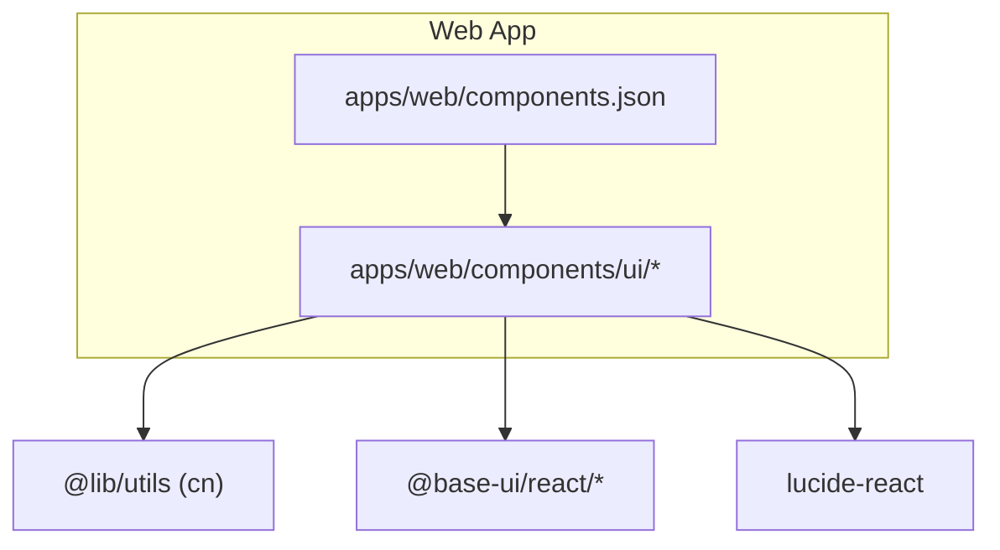
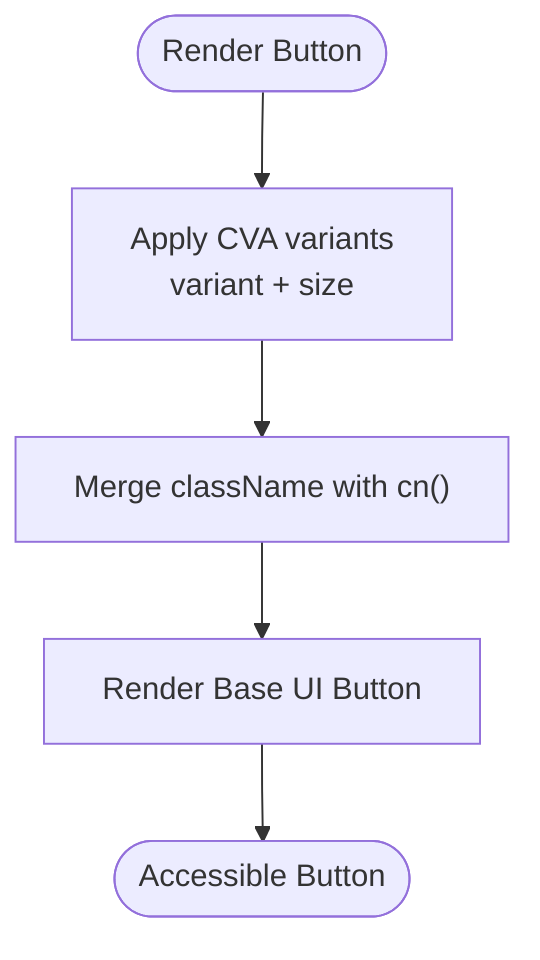
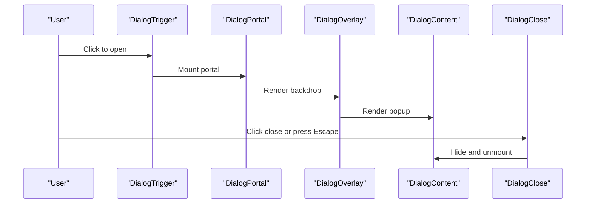
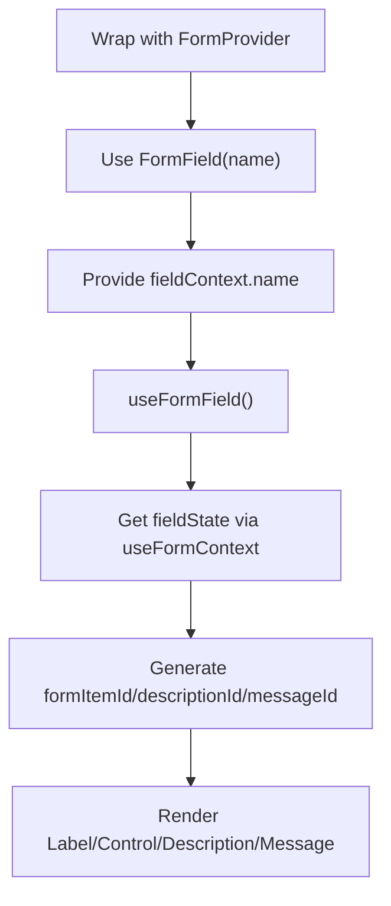
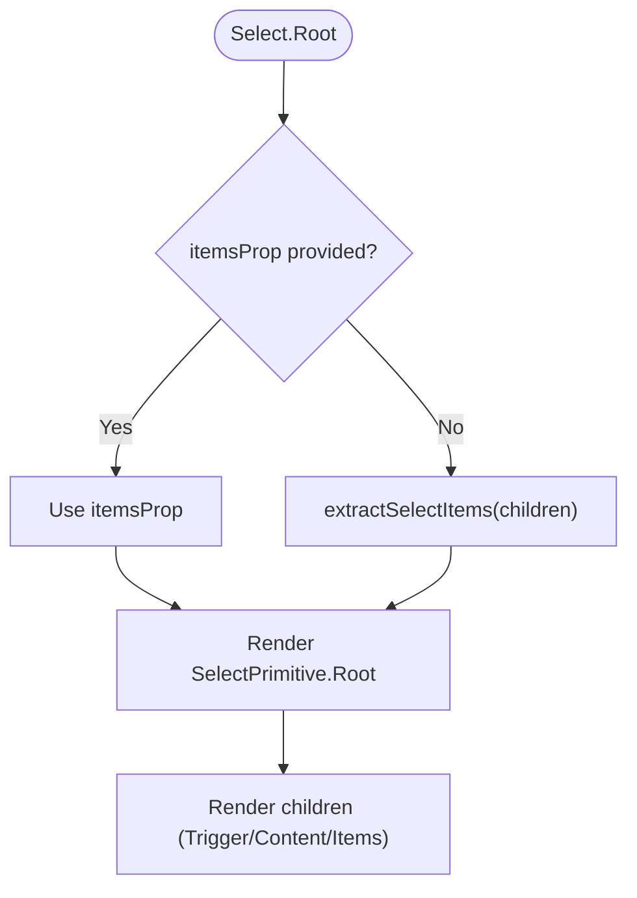
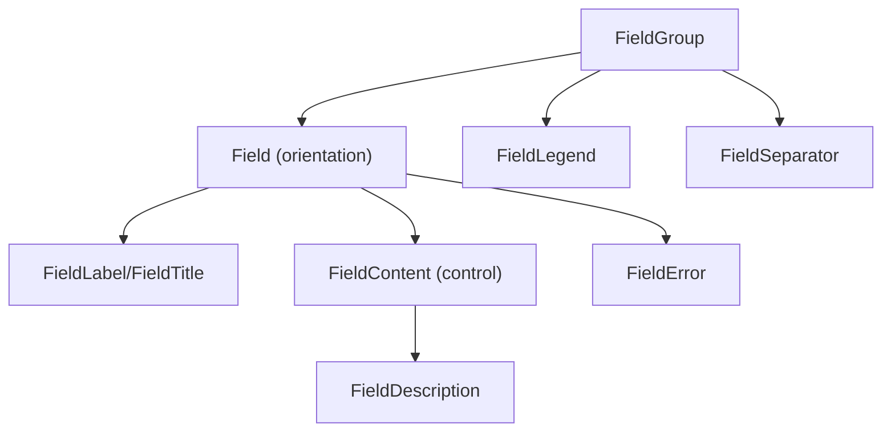
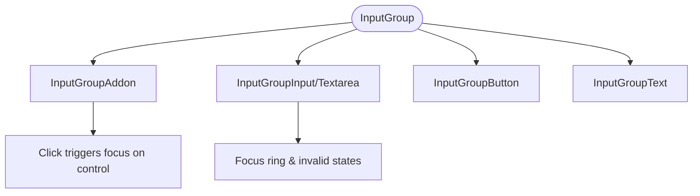
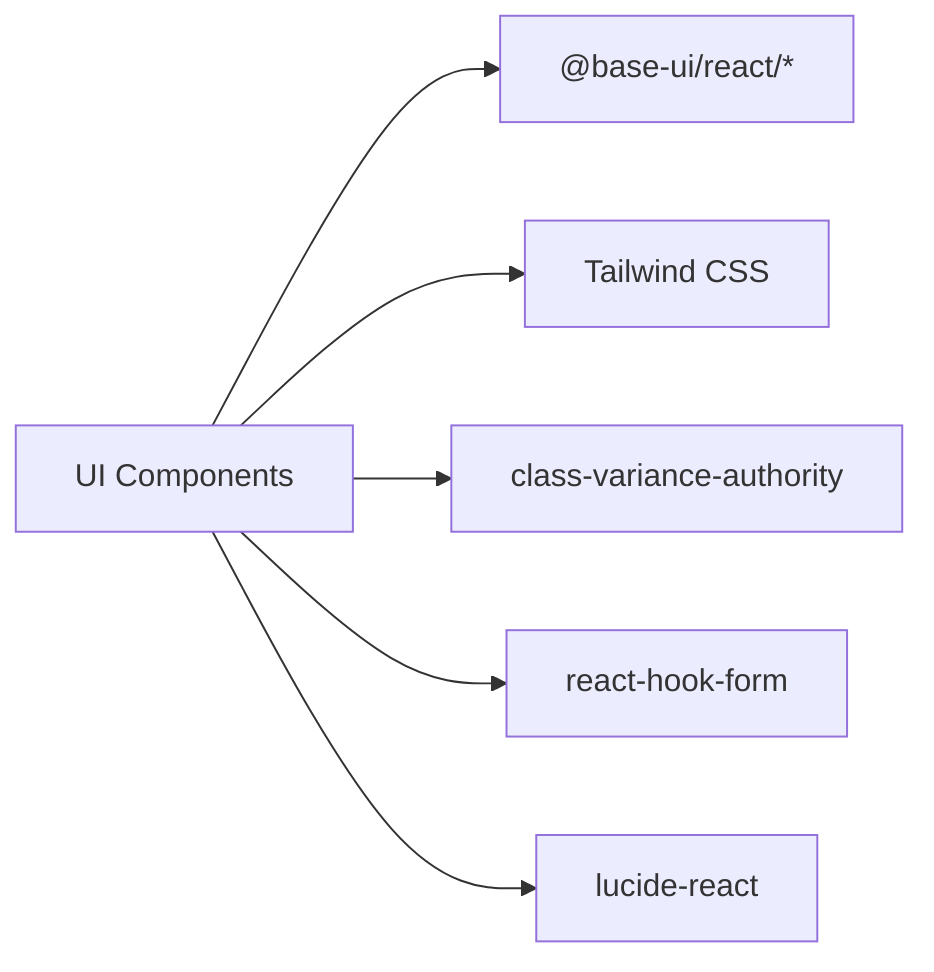

# Component Library

<cite>
**Referenced Files in This Document**
- [components.json](file://apps/web/components.json)
- [button.tsx](file://apps/web/components/ui/button.tsx)
- [input.tsx](file://apps/web/components/ui/input.tsx)
- [dialog.tsx](file://apps/web/components/ui/dialog.tsx)
- [form.tsx](file://apps/web/components/ui/form.tsx)
- [label.tsx](file://apps/web/components/ui/label.tsx)
- [select.tsx](file://apps/web/components/ui/select.tsx)
- [checkbox.tsx](file://apps/web/components/ui/checkbox.tsx)
- [field.tsx](file://apps/web/components/ui/field.tsx)
- [input-group.tsx](file://apps/web/components/ui/input-group.tsx)
- [SKILL.md](file://.agents/skills/shadcn/SKILL.md)
- [base-vs-radix.md](file://.agents/skills/shadcn/rules/base-vs-radix.md)
- [accessibility.spec.ts](file://tests/accessibility/accessibility.spec.ts)
</cite>

## Table of Contents
1. [Introduction](#introduction)
2. [Project Structure](#project-structure)
3. [Core Components](#core-components)
4. [Architecture Overview](#architecture-overview)
5. [Detailed Component Analysis](#detailed-component-analysis)
6. [Dependency Analysis](#dependency-analysis)
7. [Performance Considerations](#performance-considerations)
8. [Troubleshooting Guide](#troubleshooting-guide)
9. [Conclusion](#conclusion)

## Introduction
This document describes the custom component library built with shadcn/ui and Tailwind CSS. It covers base UI components, business-specific composition patterns, styling approaches, accessibility compliance, responsive design, testing strategies, lifecycle considerations, state management within components, and integration with form libraries. The library follows shadcn principles: compose existing primitives, use semantic tokens, and keep layout via className while avoiding raw color overrides.

## Project Structure
The component library lives under apps/web/components/ui and is configured via a shadcn configuration file that sets aliases for components, utils, and ui. The project uses Base UI primitives (from @base-ui/react) styled with Tailwind CSS and class-variance-authority for variants.



**Diagram sources**
- [components.json:1-22](file://apps/web/components.json#L1-L22)

**Section sources**
- [components.json:1-22](file://apps/web/components.json#L1-L22)

## Core Components
This section summarizes key base components and their responsibilities.

- Button: A varianted and sized button built on Base UI with CVA-driven styles. Supports multiple visual variants and sizes, including icon modes.
- Input: Accessible input wrapper around Base UI with consistent focus rings, disabled states, and dark mode support.
- Dialog: Composed dialog system using Base UI primitives, including portal, overlay, header/footer, title, description, and close behavior.
- Form: React Hook Form integration providing FormProvider, FormField, FormItem, FormLabel, FormControl, FormDescription, and FormMessage with accessible IDs and aria attributes.
- Label: Semantic label component used across fields and inputs.
- Select: Full select system with trigger, content, items, groups, separators, and scroll buttons; supports item extraction from children.
- Checkbox: Accessible checkbox with indicator and invalid/disabled states.
- Field System: Grouping and layout primitives for complex forms (FieldSet, FieldLegend, FieldGroup, Field, FieldContent, FieldLabel, FieldTitle, FieldDescription, FieldSeparator, FieldError).
- Input Group: Composite control for attaching addons, buttons, text, and inputs/textareas into a single cohesive control.

**Section sources**
- [button.tsx:1-59](file://apps/web/components/ui/button.tsx#L1-L59)
- [input.tsx:1-21](file://apps/web/components/ui/input.tsx#L1-L21)
- [dialog.tsx:1-157](file://apps/web/components/ui/dialog.tsx#L1-L157)
- [form.tsx:1-169](file://apps/web/components/ui/form.tsx#L1-L169)
- [label.tsx:1-21](file://apps/web/components/ui/label.tsx#L1-L21)
- [select.tsx:1-221](file://apps/web/components/ui/select.tsx#L1-L221)
- [checkbox.tsx:1-29](file://apps/web/components/ui/checkbox.tsx#L1-L29)
- [field.tsx:1-239](file://apps/web/components/ui/field.tsx#L1-L239)
- [input-group.tsx:1-159](file://apps/web/components/ui/input-group.tsx#L1-L159)

## Architecture Overview
The library composes Base UI primitives with Tailwind utility classes and lucide icons. Variants are defined with class-variance-authority. Forms integrate with React Hook Form through context and controller wrappers. Accessibility is achieved via proper roles, aria attributes, and focus management provided by Base UI and reinforced by component props.

```mermaid
classDiagram
class Button {
+variant
+size
+props
}
class Input {
+type
+props
}
class Dialog {
+Root
+Trigger
+Portal
+Close
+Overlay
+Popup
+Header
+Footer
+Title
+Description
}
class Form {
+FormProvider
+FormField
+FormItem
+FormLabel
+FormControl
+FormDescription
+FormMessage
}
class Select {
+Root
+Trigger
+Content
+Value
+Group
+Label
+Item
+Separator
+ScrollUpButton
+ScrollDownButton
}
class Checkbox {
+Root
+Indicator
}
class FieldSystem {
+FieldSet
+FieldLegend
+FieldGroup
+Field
+FieldContent
+FieldLabel
+FieldTitle
+FieldDescription
+FieldSeparator
+FieldError
}
class InputGroup {
+InputGroup
+InputGroupAddon
+InputGroupButton
+InputGroupText
+InputGroupInput
+InputGroupTextarea
}
Button --> "@base-ui/react/button" : "wraps"
Input --> "@base-ui/react/input" : "wraps"
Dialog --> "@base-ui/react/dialog" : "wraps"
Select --> "@base-ui/react/select" : "wraps"
Checkbox --> "@base-ui/react/checkbox" : "wraps"
Form --> "react-hook-form" : "integrates"
FieldSystem --> "Tailwind/CVA" : "styles"
InputGroup --> Button : "uses"
InputGroup --> Input : "uses"
```

**Diagram sources**
- [button.tsx:1-59](file://apps/web/components/ui/button.tsx#L1-L59)
- [input.tsx:1-21](file://apps/web/components/ui/input.tsx#L1-L21)
- [dialog.tsx:1-157](file://apps/web/components/ui/dialog.tsx#L1-L157)
- [form.tsx:1-169](file://apps/web/components/ui/form.tsx#L1-L169)
- [select.tsx:1-221](file://apps/web/components/ui/select.tsx#L1-L221)
- [checkbox.tsx:1-29](file://apps/web/components/ui/checkbox.tsx#L1-L29)
- [field.tsx:1-239](file://apps/web/components/ui/field.tsx#L1-L239)
- [input-group.tsx:1-159](file://apps/web/components/ui/input-group.tsx#L1-L159)

## Detailed Component Analysis

### Button
- Purpose: Primary interactive element with consistent variants and sizes.
- Composition: Wraps Base UI Button primitive and applies CVA-based style variants.
- Props: Inherits Base UI props plus variant and size controlled by CVA defaults.
- Styling: Uses semantic tokens, focus rings, and aria-invalid handling.
- Accessibility: Inherits keyboard and screen reader behavior from Base UI.



**Diagram sources**
- [button.tsx:6-41](file://apps/web/components/ui/button.tsx#L6-L41)
- [button.tsx:43-56](file://apps/web/components/ui/button.tsx#L43-L56)

**Section sources**
- [button.tsx:1-59](file://apps/web/components/ui/button.tsx#L1-L59)

### Input
- Purpose: Text input field with consistent appearance and focus states.
- Composition: Wraps Base UI Input primitive.
- Props: Standard HTML input props plus type.
- Styling: Focus ring, disabled state, dark mode, and aria-invalid.

**Section sources**
- [input.tsx:1-21](file://apps/web/components/ui/input.tsx#L1-L21)

### Dialog
- Purpose: Modal dialog with overlay, portal, header/footer, title, description, and close behavior.
- Composition: Multiple Base UI Dialog parts combined into a cohesive API.
- Props: Root, Trigger, Portal, Close, Overlay, Popup, Header, Footer, Title, Description; optional showCloseButton toggles.
- Accessibility: Proper focus trapping and aria attributes handled by Base UI; close button includes sr-only text.



**Diagram sources**
- [dialog.tsx:10-24](file://apps/web/components/ui/dialog.tsx#L10-L24)
- [dialog.tsx:26-80](file://apps/web/components/ui/dialog.tsx#L26-L80)
- [dialog.tsx:82-117](file://apps/web/components/ui/dialog.tsx#L82-L117)
- [dialog.tsx:119-143](file://apps/web/components/ui/dialog.tsx#L119-L143)

**Section sources**
- [dialog.tsx:1-157](file://apps/web/components/ui/dialog.tsx#L1-L157)

### Form Integration (React Hook Form)
- Purpose: Provide accessible, validated form controls integrated with React Hook Form.
- Composition: Uses FormProvider, Controller, and context to wire labels, descriptions, messages, and ids.
- Key pieces:
  - FormField wraps Controller and provides field context.
  - useFormField reads field state and generates accessible ids and aria bindings.
  - FormItem provides id context for label/control association.
  - FormLabel, FormControl, FormDescription, FormMessage render accessible markup and error messaging.



**Diagram sources**
- [form.tsx:19-43](file://apps/web/components/ui/form.tsx#L19-L43)
- [form.tsx:45-66](file://apps/web/components/ui/form.tsx#L45-L66)
- [form.tsx:68-88](file://apps/web/components/ui/form.tsx#L68-L88)
- [form.tsx:90-124](file://apps/web/components/ui/form.tsx#L90-L124)
- [form.tsx:126-157](file://apps/web/components/ui/form.tsx#L126-L157)

**Section sources**
- [form.tsx:1-169](file://apps/web/components/ui/form.tsx#L1-L169)

### Label
- Purpose: Semantic label for inputs and fields.
- Composition: Plain label with data-slot and consistent typography.

**Section sources**
- [label.tsx:1-21](file://apps/web/components/ui/label.tsx#L1-L21)

### Select
- Purpose: Full-featured select with trigger, content, items, groups, separators, and scroll buttons.
- Composition: Wraps Base UI Select primitives; extracts items from children if not provided.
- Props: Root, Trigger, Content, Value, Group, Label, Item, Separator, ScrollUpButton, ScrollDownButton; positioning options.
- Behavior: Uses extractSelectItems helper to derive items from children when needed.



**Diagram sources**
- [select.tsx:10-26](file://apps/web/components/ui/select.tsx#L10-L26)
- [select.tsx:76-116](file://apps/web/components/ui/select.tsx#L76-L116)

**Section sources**
- [select.tsx:1-221](file://apps/web/components/ui/select.tsx#L1-L221)

### Checkbox
- Purpose: Accessible checkbox with indicator and invalid/disabled states.
- Composition: Wraps Base UI Checkbox primitives.

**Section sources**
- [checkbox.tsx:1-29](file://apps/web/components/ui/checkbox.tsx#L1-L29)

### Field System
- Purpose: Organize complex forms with grouping, orientation, and validation feedback.
- Key components:
  - FieldSet/FieldLegend: Group related fields with a legend.
  - FieldGroup: Container for field rows/columns.
  - Field: Single field row with orientation variants (vertical, horizontal, responsive).
  - FieldContent: Wrapper for control and description.
  - FieldLabel/FieldTitle: Labels and titles with hover/selection states.
  - FieldDescription: Descriptive text.
  - FieldSeparator: Visual separator with optional content.
  - FieldError: Displays one or multiple errors with role="alert".



**Diagram sources**
- [field.tsx:10-21](file://apps/web/components/ui/field.tsx#L10-L21)
- [field.tsx:23-39](file://apps/web/components/ui/field.tsx#L23-L39)
- [field.tsx:41-52](file://apps/web/components/ui/field.tsx#L41-L52)
- [field.tsx:54-86](file://apps/web/components/ui/field.tsx#L54-L86)
- [field.tsx:88-99](file://apps/web/components/ui/field.tsx#L88-L99)
- [field.tsx:101-144](file://apps/web/components/ui/field.tsx#L101-L144)
- [field.tsx:146-174](file://apps/web/components/ui/field.tsx#L146-L174)
- [field.tsx:176-225](file://apps/web/components/ui/field.tsx#L176-L225)

**Section sources**
- [field.tsx:1-239](file://apps/web/components/ui/field.tsx#L1-L239)

### Input Group
- Purpose: Combine inputs/textareas with addons, buttons, and text into a unified control.
- Key components:
  - InputGroup: Container with focus and invalid states.
  - InputGroupAddon: Positioned addon with click-to-focus behavior.
  - InputGroupButton: Styled button sized for input group context.
  - InputGroupText: Inline text display.
  - InputGroupInput/InputGroupTextarea: Inputs tailored for seamless integration.



**Diagram sources**
- [input-group.tsx:11-23](file://apps/web/components/ui/input-group.tsx#L11-L23)
- [input-group.tsx:25-66](file://apps/web/components/ui/input-group.tsx#L25-L66)
- [input-group.tsx:68-105](file://apps/web/components/ui/input-group.tsx#L68-L105)
- [input-group.tsx:107-149](file://apps/web/components/ui/input-group.tsx#L107-L149)

**Section sources**
- [input-group.tsx:1-159](file://apps/web/components/ui/input-group.tsx#L1-L159)

## Dependency Analysis
- Base UI Primitives: All components wrap Base UI primitives for robust accessibility and interaction semantics.
- Tailwind CSS: Styling is applied via utility classes and semantic tokens.
- Class Variance Authority: Used to define variants (e.g., Button variants, Field orientations).
- React Hook Form: Integrated via FormProvider and Controller for state and validation.
- Icons: lucide-react provides icons used in dialogs and selects.



**Diagram sources**
- [button.tsx:1-59](file://apps/web/components/ui/button.tsx#L1-L59)
- [dialog.tsx:1-157](file://apps/web/components/ui/dialog.tsx#L1-L157)
- [form.tsx:1-169](file://apps/web/components/ui/form.tsx#L1-L169)
- [select.tsx:1-221](file://apps/web/components/ui/select.tsx#L1-L221)

**Section sources**
- [button.tsx:1-59](file://apps/web/components/ui/button.tsx#L1-L59)
- [dialog.tsx:1-157](file://apps/web/components/ui/dialog.tsx#L1-L157)
- [form.tsx:1-169](file://apps/web/components/ui/form.tsx#L1-L169)
- [select.tsx:1-221](file://apps/web/components/ui/select.tsx#L1-L221)

## Performance Considerations
- Prefer memoization where lists or heavy computations occur (e.g., extracting select items).
- Avoid unnecessary re-renders by keeping prop interfaces minimal and stable.
- Use Base UI’s optimized primitives for focus management and event handling.
- Keep Tailwind classes declarative; avoid runtime style objects.

[No sources needed since this section provides general guidance]

## Troubleshooting Guide
- Accessibility: Run automated audits against key routes to ensure WCAG compliance. The test suite validates critical pages pass accessibility checks.
- Form Validation: Ensure Field has data-invalid and control has aria-invalid when invalid; verify ids and aria-describedby are set correctly by the form integration.
- Dialog Behavior: Confirm that close actions work via both user interactions and keyboard; ensure portal and overlay are mounted/unmounted properly.
- Select Items: If items do not appear, verify either items prop is provided or children structure matches expected format for extraction.

**Section sources**
- [accessibility.spec.ts:1-22](file://tests/accessibility/accessibility.spec.ts#L1-L22)
- [form.tsx:45-66](file://apps/web/components/ui/form.tsx#L45-L66)
- [dialog.tsx:26-80](file://apps/web/components/ui/dialog.tsx#L26-L80)
- [select.tsx:10-26](file://apps/web/components/ui/select.tsx#L10-L26)

## Conclusion
This component library provides a cohesive, accessible, and customizable UI foundation built on Base UI and Tailwind CSS. By composing primitives, leveraging CVA for variants, and integrating React Hook Form, it enables consistent, maintainable, and accessible interfaces. Follow the shadcn principles and rules to extend the library with new components while preserving quality and performance.

[No sources needed since this section summarizes without analyzing specific files]