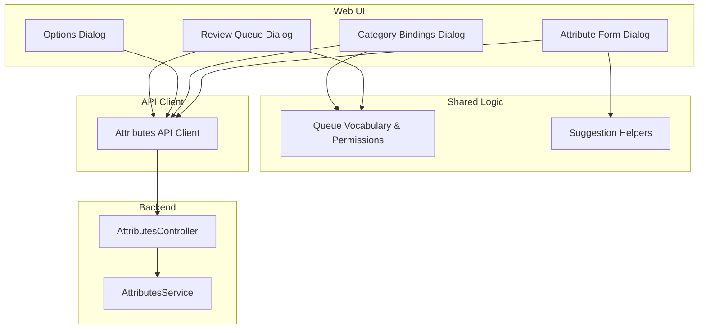
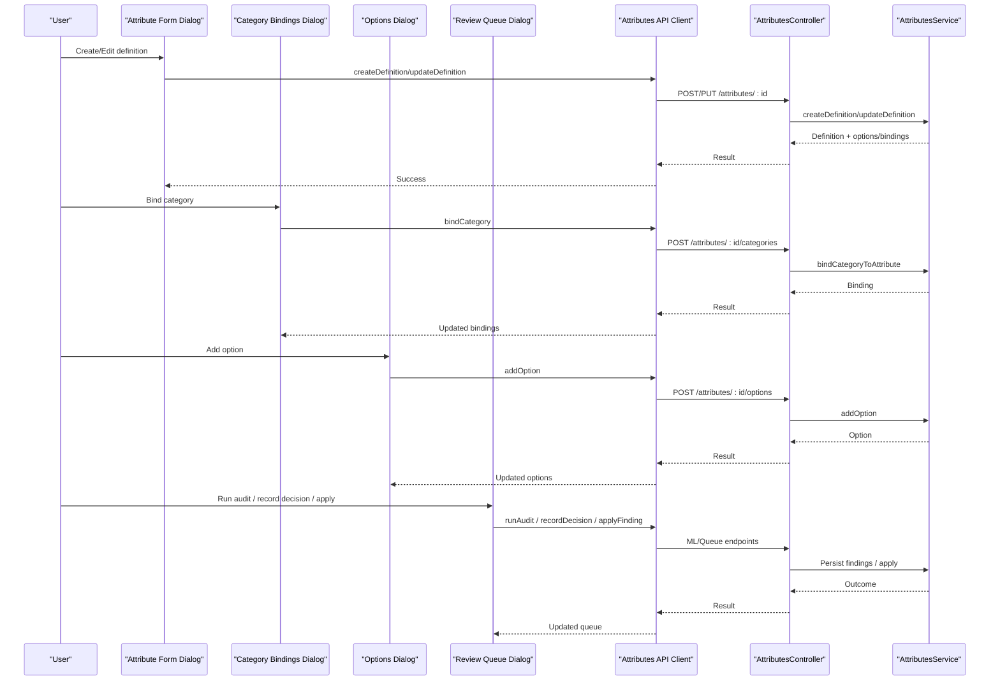
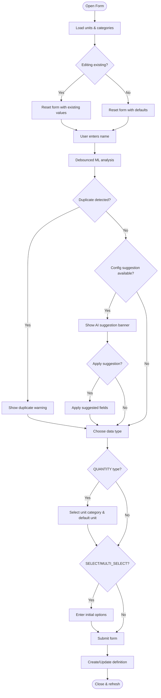
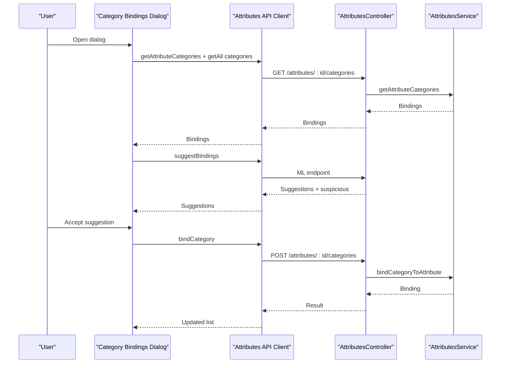
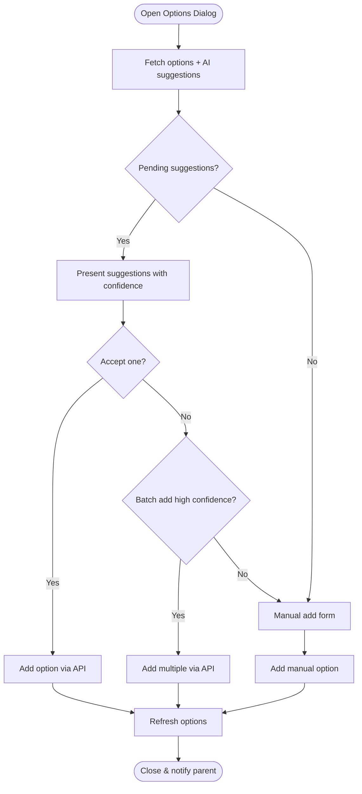
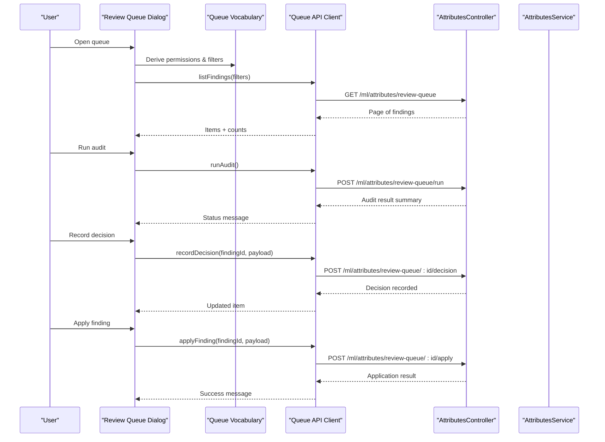
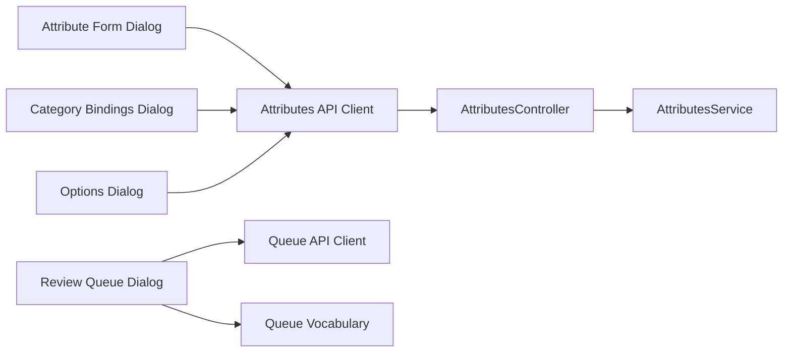

# Attribute Management Components

<cite>
**Referenced Files in This Document**
- [attribute-form-dialog.tsx](file://apps/web/components/attributes/attribute-form-dialog.tsx)
- [attribute-categories-dialog.tsx](file://apps/web/components/attributes/attribute-categories-dialog.tsx)
- [attribute-options-dialog.tsx](file://apps/web/components/attributes/attribute-options-dialog.tsx)
- [attribute-review-queue-dialog.tsx](file://apps/web/components/attributes/attribute-review-queue-dialog.tsx)
- [attribute-review-queue.ts](file://apps/web/lib/attribute-review-queue.ts)
- [attribute-suggestions.ts](file://apps/web/lib/attribute-suggestions.ts)
- [attributes-api.ts](file://apps/web/lib/api/attributes-api.ts)
- [attributes.controller.ts](file://apps/api/src/attributes/attributes.controller.ts)
- [attributes.service.ts](file://apps/api/src/attributes/attributes.service.ts)
</cite>

## Table of Contents
1. [Introduction](#introduction)
2. [Project Structure](#project-structure)
3. [Core Components](#core-components)
4. [Architecture Overview](#architecture-overview)
5. [Detailed Component Analysis](#detailed-component-analysis)
6. [Dependency Analysis](#dependency-analysis)
7. [Performance Considerations](#performance-considerations)
8. [Troubleshooting Guide](#troubleshooting-guide)
9. [Conclusion](#conclusion)
10. [Appendices](#appendices)

## Introduction
This document explains the attribute management components that power creation and editing of attributes, category assignment, option management, and the attribute review queue. It also documents how these components integrate with the ML intelligence system for suggestions, validation rules, and business logic enforcement. Finally, it provides examples for customizing attribute types, extending the review workflow, and implementing custom validation rules.

## Project Structure
The attribute management feature spans UI dialogs, shared presentation logic, API clients, and a NestJS backend controller/service:

- UI dialogs:
  - Attribute form dialog for creating/editing definitions and initial options
  - Category bindings dialog for assigning attributes to categories with AI suggestions
  - Options dialog for managing SELECT/MULTI_SELECT values with AI suggestions
  - Review queue dialog for supervised ML findings (bindings, duplicates, suspicious, unused, enums)
- Shared logic:
  - Queue vocabulary, permissions, tab mapping, and apply decision helpers
  - Suggestion grouping, eligibility, and reconciliation against form state
- API client:
  - Types and endpoints for definitions, options, category bindings, and review queue
- Backend:
  - Controller routes with read/write/delete guards
  - Service methods orchestrating repositories and domain use cases

**Diagram sources**
- [attribute-form-dialog.tsx:1-120](file://apps/web/components/attributes/attribute-form-dialog.tsx#L1-L120)
- [attribute-categories-dialog.tsx:1-120](file://apps/web/components/attributes/attribute-categories-dialog.tsx#L1-L120)
- [attribute-options-dialog.tsx:1-120](file://apps/web/components/attributes/attribute-options-dialog.tsx#L1-L120)
- [attribute-review-queue-dialog.tsx:1-120](file://apps/web/components/attributes/attribute-review-queue-dialog.tsx#L1-L120)
- [attribute-review-queue.ts:1-120](file://apps/web/lib/attribute-review-queue.ts#L1-L120)
- [attribute-suggestions.ts:1-120](file://apps/web/lib/attribute-suggestions.ts#L1-L120)
- [attributes-api.ts:65-115](file://apps/web/lib/api/attributes-api.ts#L65-L115)
- [attributes.controller.ts:70-210](file://apps/api/src/attributes/attributes.controller.ts#L70-L210)
- [attributes.service.ts:65-96](file://apps/api/src/attributes/attributes.service.ts#L65-L96)

**Section sources**
- [attribute-form-dialog.tsx:1-120](file://apps/web/components/attributes/attribute-form-dialog.tsx#L1-L120)
- [attribute-categories-dialog.tsx:1-120](file://apps/web/components/attributes/attribute-categories-dialog.tsx#L1-L120)
- [attribute-options-dialog.tsx:1-120](file://apps/web/components/attributes/attribute-options-dialog.tsx#L1-L120)
- [attribute-review-queue-dialog.tsx:1-120](file://apps/web/components/attributes/attribute-review-queue-dialog.tsx#L1-L120)
- [attribute-review-queue.ts:1-120](file://apps/web/lib/attribute-review-queue.ts#L1-L120)
- [attribute-suggestions.ts:1-120](file://apps/web/lib/attribute-suggestions.ts#L1-L120)
- [attributes-api.ts:65-115](file://apps/web/lib/api/attributes-api.ts#L65-L115)
- [attributes.controller.ts:70-210](file://apps/api/src/attributes/attributes.controller.ts#L70-L210)
- [attributes.service.ts:65-96](file://apps/api/src/attributes/attributes.service.ts#L65-L96)

## Core Components
- Attribute Form Dialog: Creates or edits attribute definitions, supports data types, units, aliases, groups, and initial options. Integrates with ML to suggest configuration and detect duplicates.
- Category Bindings Dialog: Manages attribute-to-category bindings, including requirement flags, sort order, and AI-driven binding suggestions and suspicious binding alerts.
- Options Dialog: Manages predefined choices for SELECT/MULTI_SELECT attributes, with AI suggestion scanning and batch addition.
- Review Queue Dialog: Presents persisted ML findings for attributes; supports filtering, auditing, decisions, and applying changes after approval.

Key integration points:
- ML suggestions via API calls from dialogs (config suggestion, duplicate detection, enum suggestions, binding suggestions).
- Validation rules enforced by Zod schema in the form and server-side DTOs.
- Permission checks gate write actions across dialogs and the queue.

**Section sources**
- [attribute-form-dialog.tsx:47-152](file://apps/web/components/attributes/attribute-form-dialog.tsx#L47-L152)
- [attribute-categories-dialog.tsx:56-145](file://apps/web/components/attributes/attribute-categories-dialog.tsx#L56-L145)
- [attribute-options-dialog.tsx:42-107](file://apps/web/components/attributes/attribute-options-dialog.tsx#L42-L107)
- [attribute-review-queue-dialog.tsx:96-164](file://apps/web/components/attributes/attribute-review-queue-dialog.tsx#L96-L164)
- [attribute-suggestions.ts:15-31](file://apps/web/lib/attribute-suggestions.ts#L15-L31)

## Architecture Overview
The attribute management architecture separates concerns into UI dialogs, shared logic, API client, and backend services. The review queue is a persistent, permission-gated workflow where decisions are recorded before any library mutation.

**Diagram sources**
- [attribute-form-dialog.tsx:183-263](file://apps/web/components/attributes/attribute-form-dialog.tsx#L183-L263)
- [attribute-categories-dialog.tsx:110-145](file://apps/web/components/attributes/attribute-categories-dialog.tsx#L110-L145)
- [attribute-options-dialog.tsx:84-107](file://apps/web/components/attributes/attribute-options-dialog.tsx#L84-L107)
- [attribute-review-queue-dialog.tsx:217-249](file://apps/web/components/attributes/attribute-review-queue-dialog.tsx#L217-L249)
- [attributes.controller.ts:74-210](file://apps/api/src/attributes/attributes.controller.ts#L74-L210)
- [attributes.service.ts:188-235](file://apps/api/src/attributes/attributes.service.ts#L188-L235)

## Detailed Component Analysis

### Attribute Form Dialog
- Purpose: Create or edit attribute definitions with rich metadata, unit configuration, and initial options for selection-based types.
- Key behaviors:
  - Debounced ML analysis on name input triggers duplicate detection and config suggestions.
  - Applies suggested code, data type, unit category/default unit, group name, aliases, and enum values when accepted.
  - Records feedback for accepted suggestions to improve model performance.
  - Validates inputs using a Zod schema and handles server errors gracefully.
- Integration points:
  - Calls attributes API for duplicate detection, config suggestion, and feedback recording.
  - Loads active units and categories to support unit selection and optional initial binding during creation.

**Diagram sources**
- [attribute-form-dialog.tsx:95-128](file://apps/web/components/attributes/attribute-form-dialog.tsx#L95-L128)
- [attribute-form-dialog.tsx:183-263](file://apps/web/components/attributes/attribute-form-dialog.tsx#L183-L263)
- [attribute-form-dialog.tsx:299-376](file://apps/web/components/attributes/attribute-form-dialog.tsx#L299-L376)

**Section sources**
- [attribute-form-dialog.tsx:47-152](file://apps/web/components/attributes/attribute-form-dialog.tsx#L47-L152)
- [attribute-form-dialog.tsx:183-263](file://apps/web/components/attributes/attribute-form-dialog.tsx#L183-L263)
- [attribute-form-dialog.tsx:299-376](file://apps/web/components/attributes/attribute-form-dialog.tsx#L299-L376)

### Category Bindings Dialog
- Purpose: Manage attribute-to-category bindings, including requirement flags, sort order, and AI-driven suggestions.
- Key behaviors:
  - Loads current bindings and all categories; fetches AI suggestions and suspicious bindings concurrently.
  - Supports adding new bindings, inline editing of requirements/order, and unbinding.
  - Offers accept/reject for AI suggestions and bulk acceptance of high-confidence proposals.
  - Enforces write permissions for actions that mutate bindings.
- Integration points:
  - Uses attributes API for bindings CRUD and suggestion endpoints.
  - Records feedback for accepted/rejected suggestions.

**Diagram sources**
- [attribute-categories-dialog.tsx:110-145](file://apps/web/components/attributes/attribute-categories-dialog.tsx#L110-L145)
- [attribute-categories-dialog.tsx:172-207](file://apps/web/components/attributes/attribute-categories-dialog.tsx#L172-L207)
- [attribute-categories-dialog.tsx:274-309](file://apps/web/components/attributes/attribute-categories-dialog.tsx#L274-L309)
- [attributes.controller.ts:107-139](file://apps/api/src/attributes/attributes.controller.ts#L107-L139)
- [attributes.service.ts:318-388](file://apps/api/src/attributes/attributes.service.ts#L318-L388)

**Section sources**
- [attribute-categories-dialog.tsx:56-145](file://apps/web/components/attributes/attribute-categories-dialog.tsx#L56-L145)
- [attribute-categories-dialog.tsx:172-207](file://apps/web/components/attributes/attribute-categories-dialog.tsx#L172-L207)
- [attribute-categories-dialog.tsx:274-309](file://apps/web/components/attributes/attribute-categories-dialog.tsx#L274-L309)
- [attributes.controller.ts:107-139](file://apps/api/src/attributes/attributes.controller.ts#L107-L139)
- [attributes.service.ts:318-388](file://apps/api/src/attributes/attributes.service.ts#L318-L388)

### Options Dialog
- Purpose: Manage predefined choices for SELECT/MULTI_SELECT attributes, with AI suggestion scanning and batch addition.
- Key behaviors:
  - Fetches current options and AI suggestions on open.
  - Adds manual options with auto-generated codes.
  - Accepts individual or batch high-confidence suggestions.
  - Dismisses irrelevant suggestions and records feedback.
- Integration points:
  - Uses attributes API for options CRUD and enum suggestion endpoints.

**Diagram sources**
- [attribute-options-dialog.tsx:84-107](file://apps/web/components/attributes/attribute-options-dialog.tsx#L84-L107)
- [attribute-options-dialog.tsx:191-221](file://apps/web/components/attributes/attribute-options-dialog.tsx#L191-L221)
- [attribute-options-dialog.tsx:223-316](file://apps/web/components/attributes/attribute-options-dialog.tsx#L223-L316)

**Section sources**
- [attribute-options-dialog.tsx:42-107](file://apps/web/components/attributes/attribute-options-dialog.tsx#L42-L107)
- [attribute-options-dialog.tsx:191-221](file://apps/web/components/attributes/attribute-options-dialog.tsx#L191-L221)
- [attribute-options-dialog.tsx:223-316](file://apps/web/components/attributes/attribute-options-dialog.tsx#L223-L316)

### Attribute Review Queue Dialog
- Purpose: Supervised review of ML findings for the attribute library, supporting filtering, auditing, decisions, and application after approval.
- Key behaviors:
  - Loads persisted findings with server-side filtering and sorting.
  - Runs library audit to persist new findings; shows status messages summarizing results.
  - Records decisions (accept/reject/dismiss) without mutating the library.
  - Applies approved findings to the library through a two-step process: decision first, then apply.
  - Provides clear affordances and reasons for unavailable actions based on permissions and finding state.
- Integration points:
  - Uses queue API for listing findings, running audits, recording decisions, and applying findings.
  - Leverages shared queue vocabulary for tabs, statuses, permissions, and action labels.

**Diagram sources**
- [attribute-review-queue-dialog.tsx:217-249](file://apps/web/components/attributes/attribute-review-queue-dialog.tsx#L217-L249)
- [attribute-review-queue-dialog.tsx:315-336](file://apps/web/components/attributes/attribute-review-queue-dialog.tsx#L315-L336)
- [attribute-review-queue-dialog.tsx:346-385](file://apps/web/components/attributes/attribute-review-queue-dialog.tsx#L346-L385)
- [attribute-review-queue-dialog.tsx:404-459](file://apps/web/components/attributes/attribute-review-queue-dialog.tsx#L404-L459)
- [attribute-review-queue.ts:320-343](file://apps/web/lib/attribute-review-queue.ts#L320-L343)

**Section sources**
- [attribute-review-queue-dialog.tsx:96-164](file://apps/web/components/attributes/attribute-review-queue-dialog.tsx#L96-L164)
- [attribute-review-queue-dialog.tsx:217-249](file://apps/web/components/attributes/attribute-review-queue-dialog.tsx#L217-L249)
- [attribute-review-queue-dialog.tsx:315-336](file://apps/web/components/attributes/attribute-review-queue-dialog.tsx#L315-L336)
- [attribute-review-queue-dialog.tsx:346-385](file://apps/web/components/attributes/attribute-review-queue-dialog.tsx#L346-L385)
- [attribute-review-queue-dialog.tsx:404-459](file://apps/web/components/attributes/attribute-review-queue-dialog.tsx#L404-L459)
- [attribute-review-queue.ts:320-343](file://apps/web/lib/attribute-review-queue.ts#L320-L343)

## Dependency Analysis
- UI dependencies:
  - Attribute Form Dialog depends on attributes API for definitions, units, categories, and ML endpoints.
  - Category Bindings Dialog depends on attributes API for bindings and ML suggestion endpoints.
  - Options Dialog depends on attributes API for options and enum suggestion endpoints.
  - Review Queue Dialog depends on queue API and shared queue vocabulary for permissions, tabs, and messaging.
- Backend dependencies:
  - AttributesController exposes guarded routes for definitions, options, bindings, and component attributes.
  - AttributesService orchestrates repositories and domain use cases for persistence and population of attribute data.

**Diagram sources**
- [attribute-form-dialog.tsx:1-46](file://apps/web/components/attributes/attribute-form-dialog.tsx#L1-L46)
- [attribute-categories-dialog.tsx:1-24](file://apps/web/components/attributes/attribute-categories-dialog.tsx#L1-L24)
- [attribute-options-dialog.tsx:1-20](file://apps/web/components/attributes/attribute-options-dialog.tsx#L1-L20)
- [attribute-review-queue-dialog.tsx:1-95](file://apps/web/components/attributes/attribute-review-queue-dialog.tsx#L1-L95)
- [attributes.controller.ts:70-210](file://apps/api/src/attributes/attributes.controller.ts#L70-L210)
- [attributes.service.ts:65-96](file://apps/api/src/attributes/attributes.service.ts#L65-L96)

**Section sources**
- [attribute-form-dialog.tsx:1-46](file://apps/web/components/attributes/attribute-form-dialog.tsx#L1-L46)
- [attribute-categories-dialog.tsx:1-24](file://apps/web/components/attributes/attribute-categories-dialog.tsx#L1-L24)
- [attribute-options-dialog.tsx:1-20](file://apps/web/components/attributes/attribute-options-dialog.tsx#L1-L20)
- [attribute-review-queue-dialog.tsx:1-95](file://apps/web/components/attributes/attribute-review-queue-dialog.tsx#L1-L95)
- [attributes.controller.ts:70-210](file://apps/api/src/attributes/attributes.controller.ts#L70-L210)
- [attributes.service.ts:65-96](file://apps/api/src/attributes/attributes.service.ts#L65-L96)

## Performance Considerations
- Debounced ML analysis in the attribute form reduces unnecessary requests while typing.
- Concurrent loading of bindings and categories improves responsiveness in the category bindings dialog.
- Server-side filtering and sorting in the review queue minimize client-side processing and ensure consistent counts.
- Batch operations (e.g., adding multiple options or applying high-confidence bindings) reduce round-trips and streamline workflows.

[No sources needed since this section provides general guidance]

## Troubleshooting Guide
- Duplicate detection warnings: If a possible duplicate is detected, consider reusing an existing canonical specification rather than creating a new one.
- Permission errors: Actions requiring write access will fail with authorization errors if the user lacks the required permission; ensure the user has the appropriate role.
- Suspicious bindings: Review flagged bindings and remove them if they are incorrect; keep only valid associations.
- Review queue conflicts: When a conflict occurs (e.g., finding moved), refresh the queue to see the current state and retry actions.

**Section sources**
- [attribute-form-dialog.tsx:405-438](file://apps/web/components/attributes/attribute-form-dialog.tsx#L405-L438)
- [attribute-categories-dialog.tsx:483-534](file://apps/web/components/attributes/attribute-categories-dialog.tsx#L483-L534)
- [attribute-review-queue-dialog.tsx:355-385](file://apps/web/components/attributes/attribute-review-queue-dialog.tsx#L355-L385)

## Conclusion
The attribute management components provide a comprehensive toolkit for defining attributes, assigning them to categories, managing options, and reviewing ML-driven findings. The design emphasizes human-in-the-loop control, clear permissions, and robust integration with the ML intelligence system. By leveraging suggestions, validation, and review workflows, teams can maintain high-quality attribute libraries at scale.

[No sources needed since this section summarizes without analyzing specific files]

## Appendices

### Customizing Attribute Types
- Extend supported data types by updating the form schema and selecting UI options.
- Ensure backend DTOs and service logic handle new types consistently.
- Example reference paths:
  - Form schema and data type selection: [attribute-form-dialog.tsx:47-71](file://apps/web/components/attributes/attribute-form-dialog.tsx#L47-L71), [attribute-form-dialog.tsx:621-720](file://apps/web/components/attributes/attribute-form-dialog.tsx#L621-L720)
  - Backend handling of types in population: [attributes.service.ts:452-508](file://apps/api/src/attributes/attributes.service.ts#L452-L508)

### Extending the Review Workflow
- Add new issue types and map them to queue tabs using the shared vocabulary.
- Implement apply actions for new families by mirroring API rules in the frontend.
- Example reference paths:
  - Tab mapping and apply rules: [attribute-review-queue.ts:71-80](file://apps/web/lib/attribute-review-queue.ts#L71-L80), [attribute-review-queue.ts:601-638](file://apps/web/lib/attribute-review-queue.ts#L601-L638)
  - Queue dialog rendering and actions: [attribute-review-queue-dialog.tsx:678-800](file://apps/web/components/attributes/attribute-review-queue-dialog.tsx#L678-L800)

### Implementing Custom Validation Rules
- Define validation constraints in the form schema (Zod) for client-side checks.
- Enforce server-side validation via DTOs and service logic.
- Example reference paths:
  - Form validation schema: [attribute-form-dialog.tsx:47-71](file://apps/web/components/attributes/attribute-form-dialog.tsx#L47-L71)
  - Backend DTO usage and updates: [attributes.controller.ts:80-99](file://apps/api/src/attributes/attributes.controller.ts#L80-L99), [attributes.service.ts:237-261](file://apps/api/src/attributes/attributes.service.ts#L237-L261)