# Domain-Specific Components

<cite>
**Referenced Files in This Document**
- [attributes.service.ts](file://apps/api/src/attributes/attributes.service.ts)
- [attributes.controller.ts](file://apps/api/src/attributes/attributes.controller.ts)
- [attribute.tokens.ts](file://apps/api/src/attributes/attribute.tokens.ts)
- [component-permissions.ts](file://apps/api/src/auth/component-permissions.ts)
- [ml-permissions.ts](file://apps/api/src/auth/ml-permissions.ts)
- [ml.controller.ts](file://apps/api/src/ml/ml.controller.ts)
- [finished-goods.controller.ts](file://apps/api/src/finished-goods/finished-goods.controller.ts)
- [finished-goods.service.ts](file://apps/api/src/finished-goods/finished-goods.service.ts)
- [production-orders.service.ts](file://apps/api/src/production-orders/production-orders.service.ts)
- [goods-receipts.service.ts](file://apps/api/src/goods-receipts/goods-receipts.service.ts)
- [purchase-orders.service.ts](file://apps/api/src/purchase-orders/purchase-orders.service.ts)
- [maintenance-schedules.controller.ts](file://apps/api/src/maintenance-schedules/maintenance-schedules.controller.ts)
- [maintenance-schedules.service.ts](file://apps/api/src/maintenance-schedules/maintenance-schedules.service.ts)
- [maintenance-schedule.ts](file://packages/service/src/maintenance/maintenance-schedule.ts)
- [maintenance-schedule.repository.ts](file://packages/service/src/maintenance/maintenance-schedule.repository.ts)
- [service-requests.service.ts](file://apps/api/src/service-requests/service-requests.service.ts)
- [fulfillment-request.ts](file://packages/sales/src/fulfillment/fulfillment-request.ts)
- [0011-goods-receipt.md](file://docs/rfcs/0011-goods-receipt.md)
- [0019-finished-goods-receipt.md](file://docs/rfcs/0019-finished-goods-receipt.md)
- [0028-order-fulfillment-requests.md](file://docs/rfcs/0028-order-fulfillment-requests.md)
- [project.ts](file://packages/projects/src/projects/project.ts)
- [page.tsx](file://apps/web/app/workflows/page.tsx)
</cite>

## Table of Contents
1. Introduction
2. Project Structure
3. Core Components
4. Architecture Overview
5. Detailed Component Analysis
6. Dependency Analysis
7. Performance Considerations
8. Troubleshooting Guide
9. Conclusion
10. Appendices

## Introduction
This document explains the domain-specific components that implement specialized business workflows across attribute management, finished goods processing, goods receipt workflows, maintenance scheduling, project management tools, purchase order forms, service request handlers, and warehouse operations. It focuses on how these components integrate with domain models, enforce business rules, handle complex forms and multi-step workflows, and integrate with external systems such as inventory ledgers and ML services. It also covers data validation, audit trails, and compliance considerations.

## Project Structure
The system is organized by domain modules within the API application, each exposing controllers and services that coordinate domain logic, repositories, and cross-domain services (e.g., inventory transactions). Shared domain models live in packages (e.g., @ananya/service, @ananya/procurement, @ananya/inventory, @ananya/sales, @ananya/projects), while UI flows are implemented in the Next.js web app.

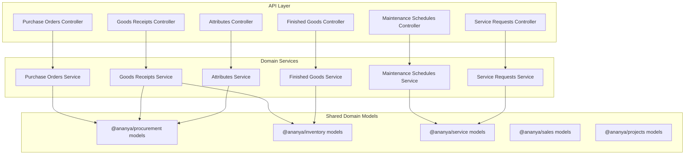

**Diagram sources**
- [attributes.controller.ts:1-120](file://apps/api/src/attributes/attributes.controller.ts#L1-L120)
- [finished-goods.controller.ts:1-33](file://apps/api/src/finished-goods/finished-goods.controller.ts#L1-L33)
- [goods-receipts.service.ts:1-207](file://apps/api/src/goods-receipts/goods-receipts.service.ts#L1-L207)
- [purchase-orders.service.ts:1-145](file://apps/api/src/purchase-orders/purchase-orders.service.ts#L1-L145)
- [service-requests.service.ts:1-127](file://apps/api/src/service-requests/service-requests.service.ts#L1-L127)
- [maintenance-schedules.controller.ts:1-47](file://apps/api/src/maintenance-schedules/maintenance-schedules.controller.ts#L1-L47)

**Section sources**
- [attributes.controller.ts:1-120](file://apps/api/src/attributes/attributes.controller.ts#L1-L120)
- [finished-goods.controller.ts:1-33](file://apps/api/src/finished-goods/finished-goods.controller.ts#L1-L33)
- [goods-receipts.service.ts:1-207](file://apps/api/src/goods-receipts/goods-receipts.service.ts#L1-L207)
- [purchase-orders.service.ts:1-145](file://apps/api/src/purchase-orders/purchase-orders.service.ts#L1-L145)
- [service-requests.service.ts:1-127](file://apps/api/src/service-requests/service-requests.service.ts#L1-L127)
- [maintenance-schedules.controller.ts:1-47](file://apps/api/src/maintenance-schedules/maintenance-schedules.controller.ts#L1-L47)

## Core Components
- Attribute Management: Defines, binds, and applies attributes to categories and components; supports typed values, options, units, and provenance tracking for AI-derived values.
- Finished Goods Processing: Records production output, posts inventory receipts, updates production orders, and records traceability events.
- Goods Receipt Workflows: Receives vendor deliveries against purchase orders, validates quantities, posts inventory receipts, and updates PO status.
- Maintenance Scheduling: Creates and manages scheduled maintenance visits with frequency, technician assignment, and lifecycle controls.
- Project Management Tools: Manages projects, milestones, tasks, time entries, and activity audit logs.
- Purchase Order Forms: Creates, updates, submits, approves, issues, and cancels purchase orders with line-level validations.
- Service Request Handlers: Lifecycle management of service requests including assignment, diagnosis, repair, completion, and closure.
- Warehouse Operations: Fulfillment request state machine supporting pick-pack-ship-complete with inventory integration.

**Section sources**
- [attributes.service.ts:1-673](file://apps/api/src/attributes/attributes.service.ts#L1-L673)
- [finished-goods.service.ts:78-125](file://apps/api/src/finished-goods/finished-goods.service.ts#L78-L125)
- [goods-receipts.service.ts:42-116](file://apps/api/src/goods-receipts/goods-receipts.service.ts#L42-L116)
- [maintenance-schedules.service.ts:22-40](file://apps/api/src/maintenance-schedules/maintenance-schedules.service.ts#L22-L40)
- [project.ts:482-542](file://packages/projects/src/projects/project.ts#L482-L542)
- [purchase-orders.service.ts:38-145](file://apps/api/src/purchase-orders/purchase-orders.service.ts#L38-L145)
- [service-requests.service.ts:26-127](file://apps/api/src/service-requests/service-requests.service.ts#L26-L127)
- [fulfillment-request.ts:79-123](file://packages/sales/src/fulfillment/fulfillment-request.ts#L79-L123)

## Architecture Overview
The API exposes REST endpoints per domain. Controllers delegate to services that orchestrate domain aggregates, enforce invariants, and call cross-domain services (e.g., inventory transactions). Shared domain models encapsulate business rules and state transitions. The web app provides UI workflows and integrates with APIs and workflow builders.

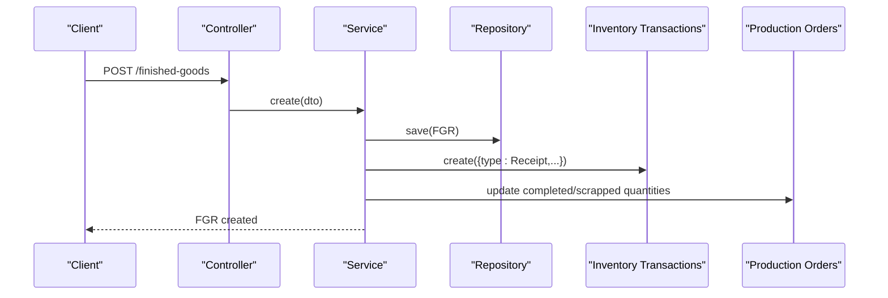

**Diagram sources**
- [finished-goods.controller.ts:9-31](file://apps/api/src/finished-goods/finished-goods.controller.ts#L9-L31)
- [finished-goods.service.ts:78-125](file://apps/api/src/finished-goods/finished-goods.service.ts#L78-L125)
- [production-orders.service.ts:193-227](file://apps/api/src/production-orders/production-orders.service.ts#L193-L227)

## Detailed Component Analysis

### Attribute Management Interface
Attribute definitions support multiple data types, unit categories, default units, filterability, sorting, aliases, grouping, and validation rules. Category bindings attach required/default attributes to categories. Component attributes store typed values with optional provenance when derived from intelligence.

Key behaviors:
- Create/update/delete attribute definitions and options.
- Bind/unbind attributes to categories with requirements and defaults.
- Resolve category attributes for a given category.
- Read component attributes with display normalization and provenance.
- Save component attributes via a use case that validates types and units.

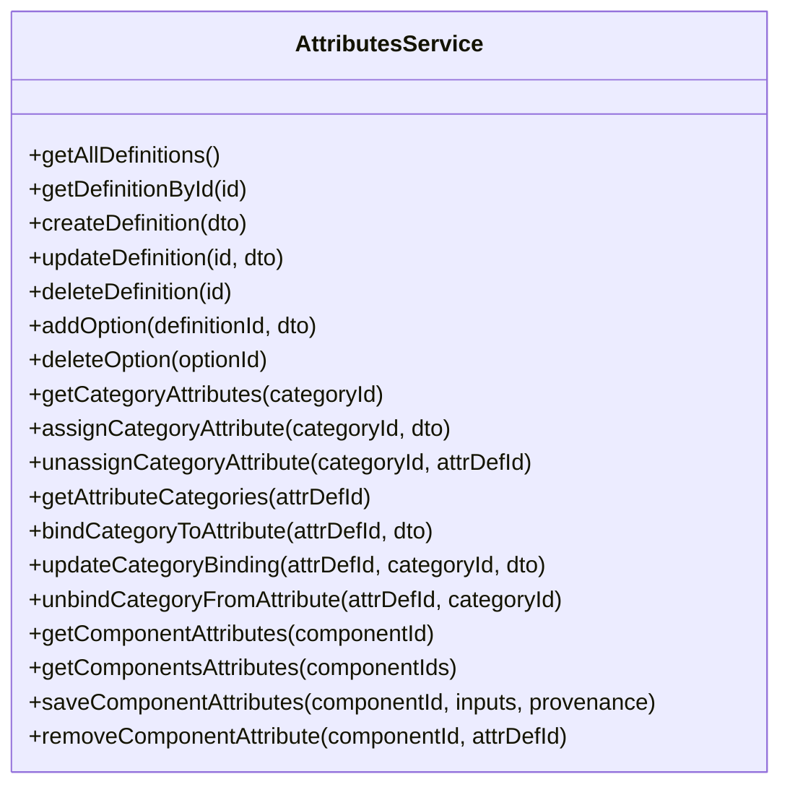

**Diagram sources**
- [attributes.service.ts:66-673](file://apps/api/src/attributes/attributes.service.ts#L66-L673)

**Section sources**
- [attributes.service.ts:98-170](file://apps/api/src/attributes/attributes.service.ts#L98-L170)
- [attributes.service.ts:188-235](file://apps/api/src/attributes/attributes.service.ts#L188-L235)
- [attributes.service.ts:292-350](file://apps/api/src/attributes/attributes.service.ts#L292-L350)
- [attributes.service.ts:435-532](file://apps/api/src/attributes/attributes.service.ts#L435-L532)
- [attributes.service.ts:651-673](file://apps/api/src/attributes/attributes.service.ts#L651-L673)

### Finished Goods Processing
Finished goods recording creates a document, adds lines, and posts to inventory. Posting triggers:
- Inventory receipt transactions for produced quantities.
- Traceability event creation linking production order, FGR, component, location, batch/serial.
- Production order quantity updates (completed/scrap).
- Projection rebuild.

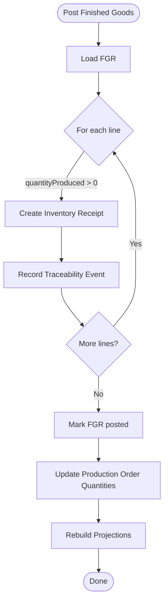

**Diagram sources**
- [finished-goods.service.ts:78-125](file://apps/api/src/finished-goods/finished-goods.service.ts#L78-L125)
- [production-orders.service.ts:193-227](file://apps/api/src/production-orders/production-orders.service.ts#L193-L227)

**Section sources**
- [finished-goods.controller.ts:9-31](file://apps/api/src/finished-goods/finished-goods.controller.ts#L9-L31)
- [finished-goods.service.ts:78-125](file://apps/api/src/finished-goods/finished-goods.service.ts#L78-L125)
- [0019-finished-goods-receipt.md:185-216](file://docs/rfcs/0019-finished-goods-receipt.md#L185-L216)

### Goods Receipt Workflow
Goods receipt validates receiving quantities against outstanding PO amounts, creates receipt lines, posts inventory receipts, updates PO lines/status, marks receipt completed, and rebuilds projections. Supports both immediate posting upon creation and explicit post action.

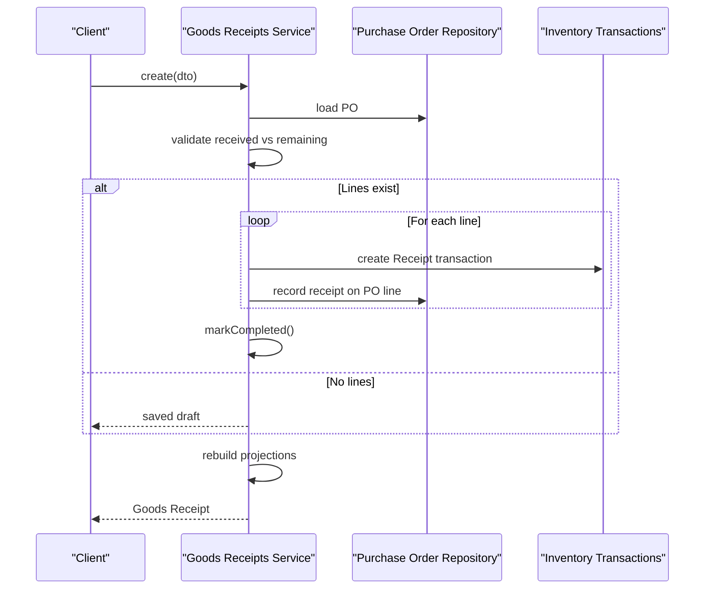

**Diagram sources**
- [goods-receipts.service.ts:42-116](file://apps/api/src/goods-receipts/goods-receipts.service.ts#L42-L116)
- [goods-receipts.service.ts:146-180](file://apps/api/src/goods-receipts/goods-receipts.service.ts#L146-L180)

**Section sources**
- [goods-receipts.service.ts:42-116](file://apps/api/src/goods-receipts/goods-receipts.service.ts#L42-L116)
- [goods-receipts.service.ts:146-180](file://apps/api/src/goods-receipts/goods-receipts.service.ts#L146-L180)
- [0011-goods-receipt.md:1-33](file://docs/rfcs/0011-goods-receipt.md#L1-L33)

### Maintenance Scheduling
Maintenance schedules associate customers, assets, frequencies, next visit dates, technicians, and notes. The service validates customer existence, generates schedule numbers, creates domain aggregates, and persists them. Controllers expose CRUD and lifecycle actions (pause/resume).

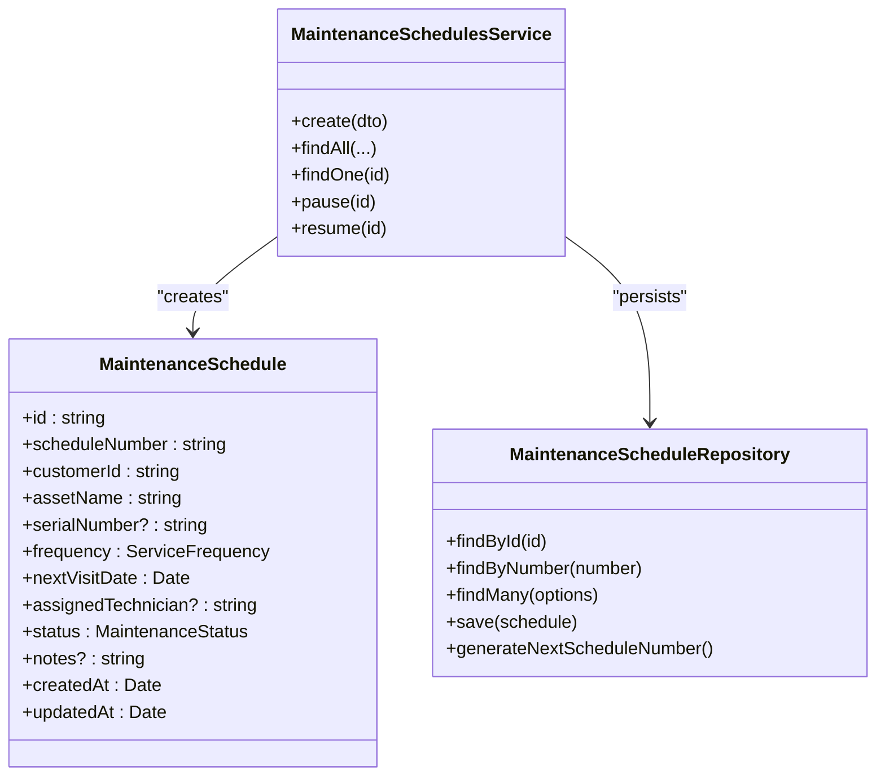

**Diagram sources**
- [maintenance-schedule.ts:1-45](file://packages/service/src/maintenance/maintenance-schedule.ts#L1-L45)
- [maintenance-schedules.service.ts:22-40](file://apps/api/src/maintenance-schedules/maintenance-schedules.service.ts#L22-L40)
- [maintenance-schedule.repository.ts:1-23](file://packages/service/src/maintenance/maintenance-schedule.repository.ts#L1-L23)

**Section sources**
- [maintenance-schedules.controller.ts:12-47](file://apps/api/src/maintenance-schedules/maintenance-schedules.controller.ts#L12-L47)
- [maintenance-schedules.service.ts:22-40](file://apps/api/src/maintenance-schedules/maintenance-schedules.service.ts#L22-L40)
- [maintenance-schedule.ts:1-45](file://packages/service/src/maintenance/maintenance-schedule.ts#L1-L45)
- [maintenance-schedule.repository.ts:1-23](file://packages/service/src/maintenance/maintenance-schedule.repository.ts#L1-L23)

### Project Management Tools
Projects manage milestones and activities. Milestones can be added and completed, which updates status and percentage and logs an activity entry for auditability.

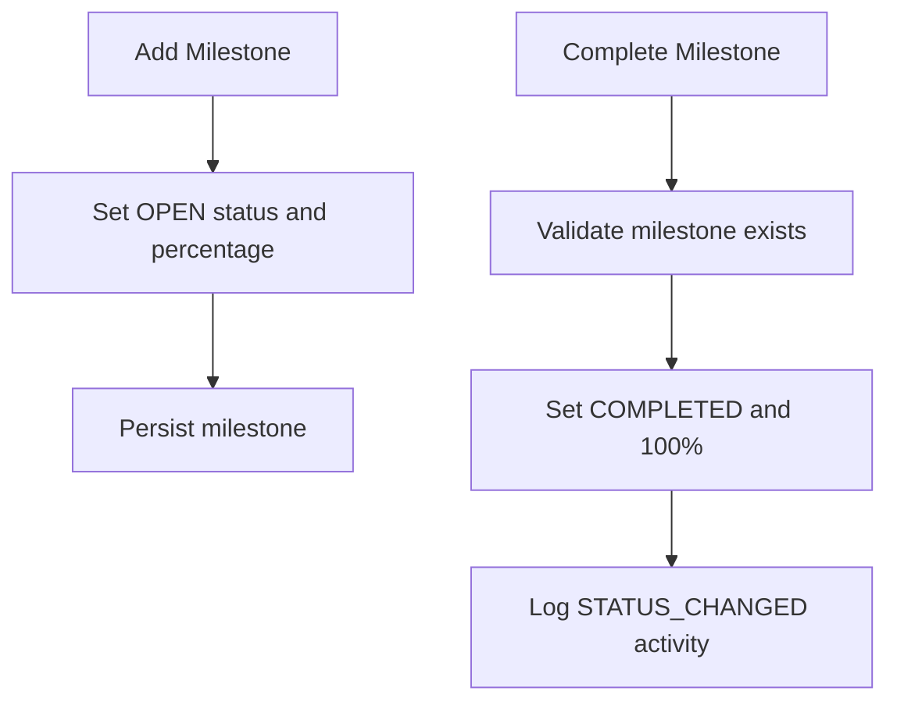

**Diagram sources**
- [project.ts:482-542](file://packages/projects/src/projects/project.ts#L482-L542)

**Section sources**
- [project.ts:482-542](file://packages/projects/src/projects/project.ts#L482-L542)

### Purchase Order Forms
Purchase orders support currency resolution, line addition with component usability checks, and full lifecycle transitions (submit, approve, issue, cancel).

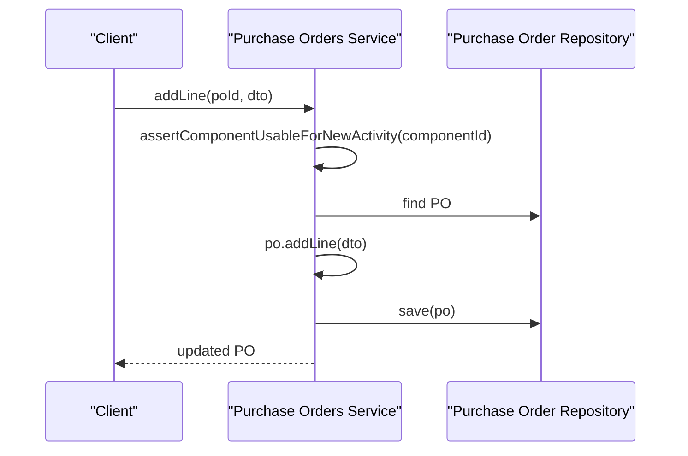

**Diagram sources**
- [purchase-orders.service.ts:102-115](file://apps/api/src/purchase-orders/purchase-orders.service.ts#L102-L115)

**Section sources**
- [purchase-orders.service.ts:38-145](file://apps/api/src/purchase-orders/purchase-orders.service.ts#L38-L145)

### Service Request Handlers
Service requests link to customers, sales orders, projects, components, and serial numbers. The service enforces customer existence, generates service numbers, and manages lifecycle states (assign, diagnose, waiting parts, start repair, complete, close, cancel).

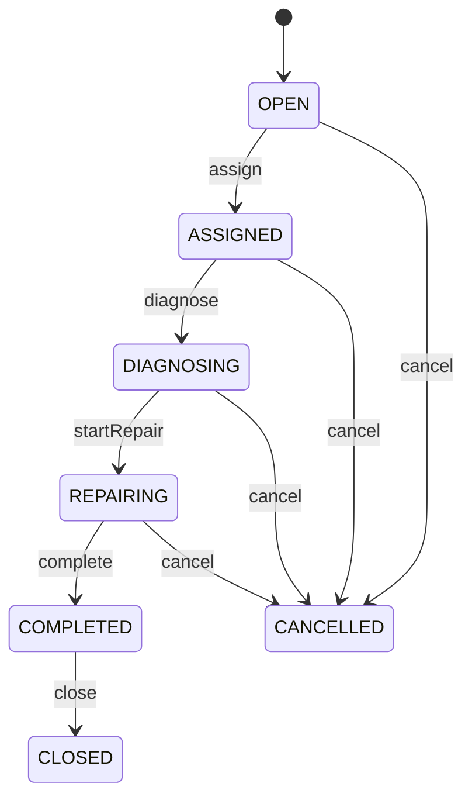

**Diagram sources**
- [service-requests.service.ts:26-127](file://apps/api/src/service-requests/service-requests.service.ts#L26-L127)

**Section sources**
- [service-requests.service.ts:26-127](file://apps/api/src/service-requests/service-requests.service.ts#L26-L127)

### Warehouse Operations Components
Fulfillment requests model picking, packing, shipping, and completion with strict state transitions. They reference sales orders and warehouses, and integrate with inventory to deduct stock upon completion.

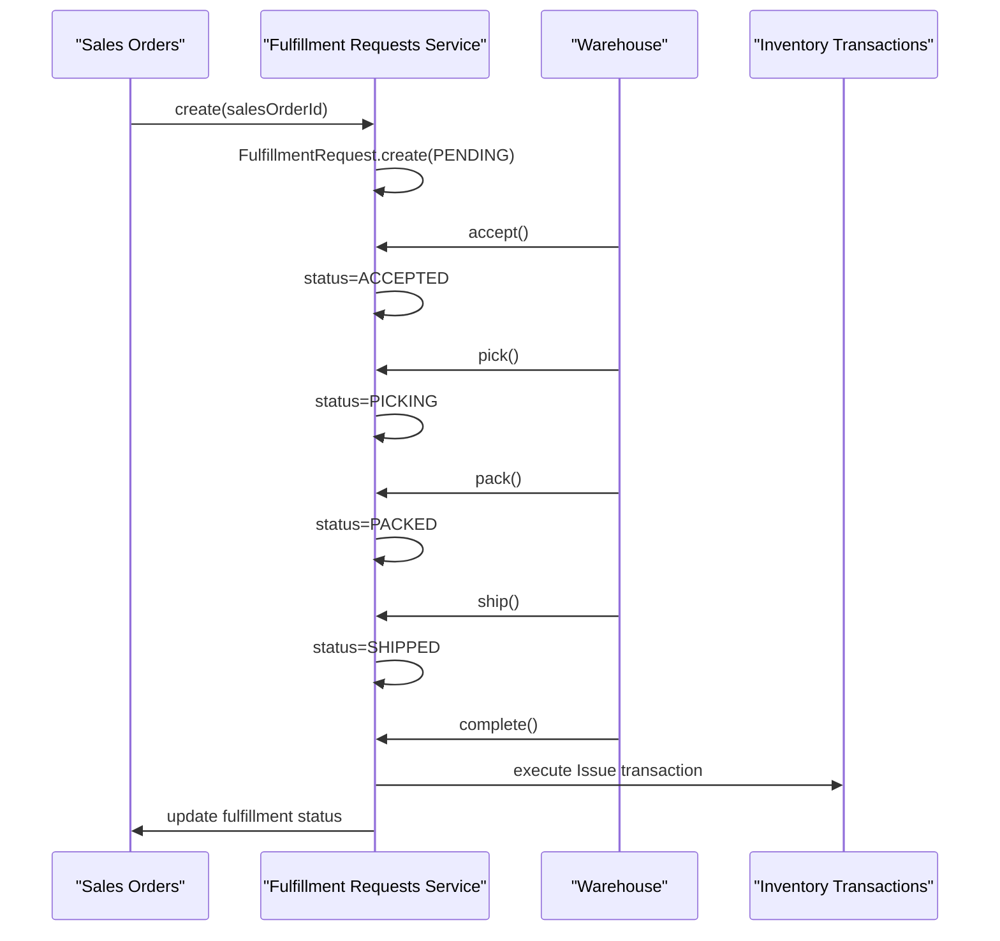

**Diagram sources**
- [fulfillment-request.ts:79-123](file://packages/sales/src/fulfillment/fulfillment-request.ts#L79-L123)
- [0028-order-fulfillment-requests.md:58-104](file://docs/rfcs/0028-order-fulfillment-requests.md#L58-L104)

**Section sources**
- [fulfillment-request.ts:79-123](file://packages/sales/src/fulfillment/fulfillment-request.ts#L79-L123)
- [0028-order-fulfillment-requests.md:58-104](file://docs/rfcs/0028-order-fulfillment-requests.md#L58-L104)

## Dependency Analysis
Cross-domain integrations:
- Finished Goods -> Inventory Transactions and Production Orders.
- Goods Receipts -> Purchase Orders and Inventory Transactions.
- Attributes -> Categories, Units, and Component Attributes; ML integration for applying suggested bindings.
- Maintenance Schedules -> Customers and Service domain models.
- Service Requests -> Customers and Service domain models.
- Projects -> Activity logging for audit trails.

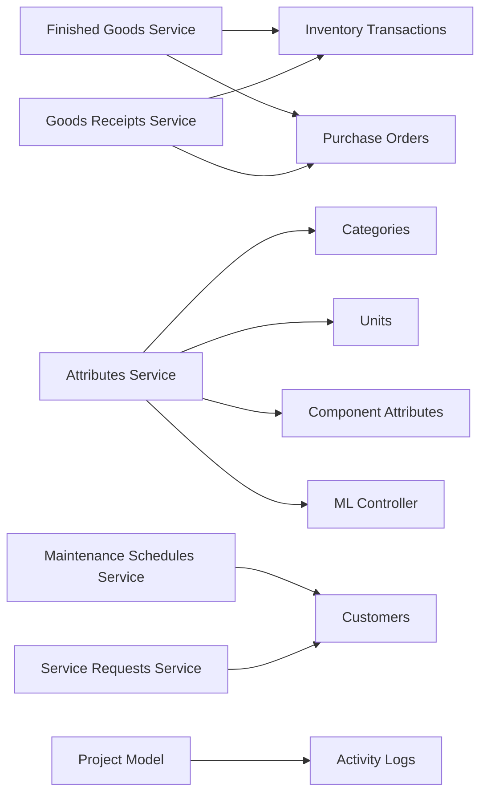

**Diagram sources**
- [finished-goods.service.ts:78-125](file://apps/api/src/finished-goods/finished-goods.service.ts#L78-L125)
- [goods-receipts.service.ts:42-116](file://apps/api/src/goods-receipts/goods-receipts.service.ts#L42-L116)
- [attributes.service.ts:66-673](file://apps/api/src/attributes/attributes.service.ts#L66-L673)
- [ml.controller.ts:250-288](file://apps/api/src/ml/ml.controller.ts#L250-L288)
- [maintenance-schedules.service.ts:22-40](file://apps/api/src/maintenance-schedules/maintenance-schedules.service.ts#L22-L40)
- [service-requests.service.ts:26-127](file://apps/api/src/service-requests/service-requests.service.ts#L26-L127)
- [project.ts:482-542](file://packages/projects/src/projects/project.ts#L482-L542)

**Section sources**
- [finished-goods.service.ts:78-125](file://apps/api/src/finished-goods/finished-goods.service.ts#L78-L125)
- [goods-receipts.service.ts:42-116](file://apps/api/src/goods-receipts/goods-receipts.service.ts#L42-L116)
- [attributes.service.ts:66-673](file://apps/api/src/attributes/attributes.service.ts#L66-L673)
- [ml.controller.ts:250-288](file://apps/api/src/ml/ml.controller.ts#L250-L288)
- [maintenance-schedules.service.ts:22-40](file://apps/api/src/maintenance-schedules/maintenance-schedules.service.ts#L22-L40)
- [service-requests.service.ts:26-127](file://apps/api/src/service-requests/service-requests.service.ts#L26-L127)
- [project.ts:482-542](file://packages/projects/src/projects/project.ts#L482-L542)

## Performance Considerations
- Batch operations: Use bulk attribute saves and component attribute reads to reduce round trips.
- Projection rebuilds: Triggered after significant inventory changes; consider batching or background jobs to avoid blocking.
- Validation early: Validate against PO outstanding quantities before creating receipts to minimize failed transactions.
- Indexing: Ensure indexes on frequently queried fields (e.g., purchaseOrderId, supplierId, status) for list endpoints.

[No sources needed since this section provides general guidance]

## Troubleshooting Guide
Common issues and resolutions:
- Attribute definition not found: Ensure IDs are valid and definitions exist before binding or reading attributes.
- Exceeded remaining quantity on goods receipt: Verify PO outstanding quantities and adjust receipt lines accordingly.
- Invalid state transitions: Ensure entities are in correct states before calling lifecycle methods (e.g., only DRAFT GR can be posted; only PENDING FR can be accepted).
- Component usability: Adding PO lines requires components to be usable; retired components cannot be ordered.
- ML binding permissions: Applying suggested attribute bindings requires appropriate write permissions.

**Section sources**
- [attributes.service.ts:172-186](file://apps/api/src/attributes/attributes.service.ts#L172-L186)
- [goods-receipts.service.ts:42-60](file://apps/api/src/goods-receipts/goods-receipts.service.ts#L42-L60)
- [goods-receipts.service.ts:146-152](file://apps/api/src/goods-receipts/goods-receipts.service.ts#L146-L152)
- [purchase-orders.service.ts:102-115](file://apps/api/src/purchase-orders/purchase-orders.service.ts#L102-L115)
- [ml.controller.ts:250-288](file://apps/api/src/ml/ml.controller.ts#L250-L288)

## Conclusion
The domain-specific components provide robust workflows for attribute management, manufacturing, procurement, service, and warehouse operations. They enforce business rules through domain models, integrate with inventory and other domains, and support extensibility via repositories and use cases. Proper validation, audit trails, and permission guards ensure compliance and reliability.

[No sources needed since this section summarizes without analyzing specific files]

## Appendices

### Extending Domain Functionality
- Add new attribute types or validation rules by extending attribute definitions and option sets.
- Introduce new fulfillment steps by extending the fulfillment request state machine and corresponding controller endpoints.
- Customize maintenance scheduling by adding new frequencies or statuses in shared models and updating services/controllers.

[No sources needed since this section provides general guidance]

### Customizing Business Processes
- Adjust goods receipt behavior by modifying validation thresholds or adding inspection steps before posting.
- Extend finished goods posting to include quality holds or additional traceability events.
- Configure project milestones and task workflows to align with organizational processes.

[No sources needed since this section provides general guidance]

### Integrating with External Systems
- Inventory ledger integration is achieved via dedicated transaction services; extend with new transaction types as needed.
- ML-driven attribute suggestions can be applied through guarded endpoints; integrate feedback loops for continuous improvement.
- Workflow builder UI allows testing and activation of rule-based workflows.

**Section sources**
- [ml.controller.ts:250-288](file://apps/api/src/ml/ml.controller.ts#L250-L288)
- [page.tsx:124-159](file://apps/web/app/workflows/page.tsx#L124-L159)