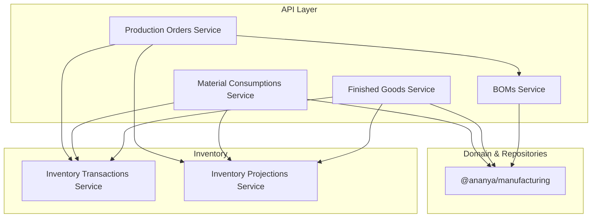
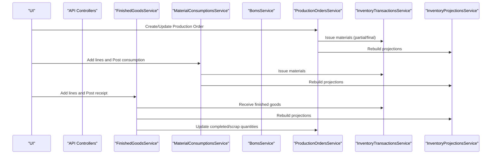
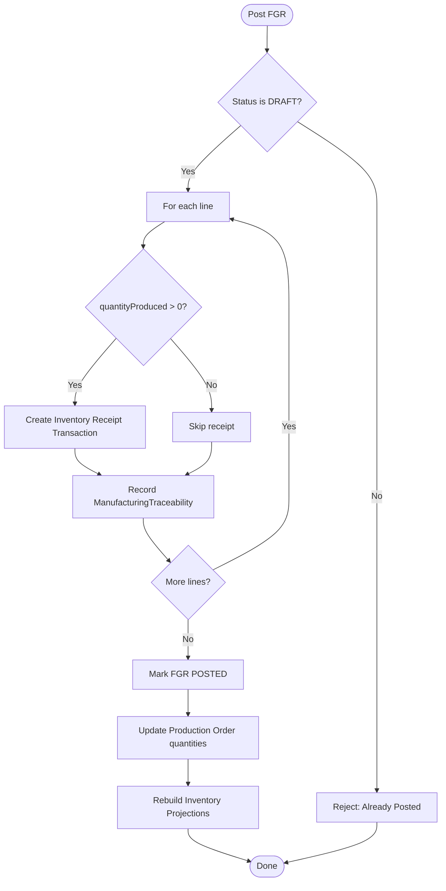
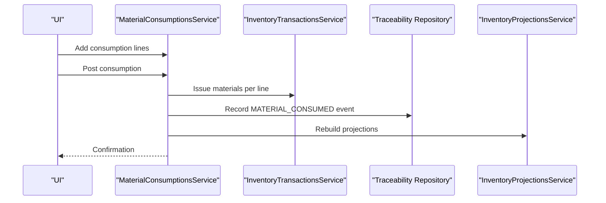
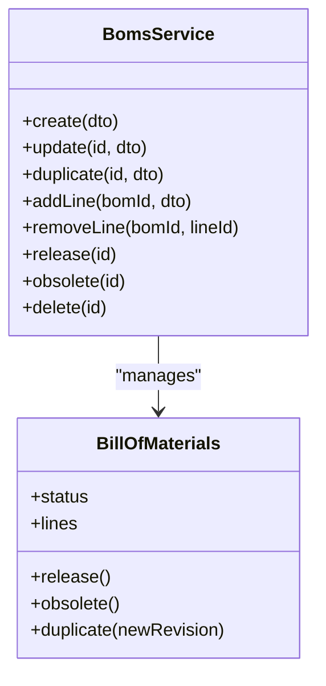
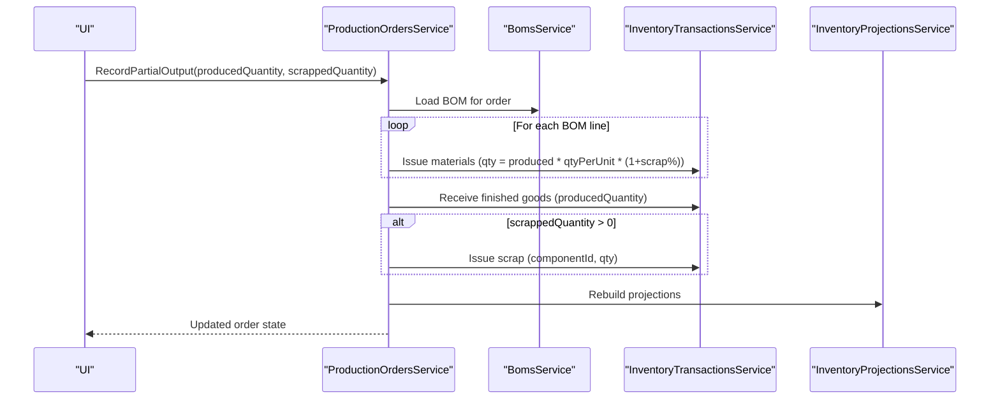
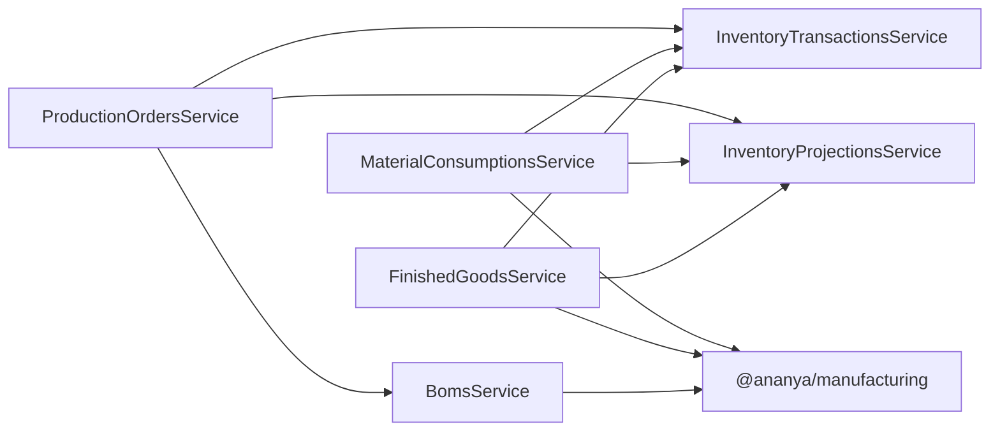

# Manufacturing Workflow Components

<cite>
**Referenced Files in This Document**
- [finished-goods.service.ts](file://apps/api/src/finished-goods/finished-goods.service.ts)
- [material-consumptions.service.ts](file://apps/api/src/material-consumptions/material-consumptions.service.ts)
- [boms.service.ts](file://apps/api/src/boms/boms.service.ts)
- [production-orders.service.ts](file://apps/api/src/production-orders/production-orders.service.ts)
- [dtos.ts (Finished Goods)](file://apps/api/src/finished-goods/dtos.ts)
- [dtos.ts (Material Consumption)](file://apps/api/src/material-consumptions/dtos.ts)
- [dtos.ts (BOMs)](file://apps/api/src/boms/dtos.ts)
- [dtos.ts (Production Orders)](file://apps/api/src/production-orders/dtos.ts)
- [RFC-0016: Bill of Materials](file://docs/rfcs/0016-bill-of-materials.md)
- [RFC-0017: Production Orders](file://docs/rfcs/0017-production-orders.md)
- [RFC-0018: Material Consumption](file://docs/rfcs/0018-material-consumption.md)
- [RFC-0019: Finished Goods Receipt](file://docs/rfcs/0019-finished-goods-receipt.md)
</cite>

## Table of Contents
1. Introduction
2. Project Structure
3. Core Components
4. Architecture Overview
5. Detailed Component Analysis
6. Dependency Analysis
7. Performance Considerations
8. Troubleshooting Guide
9. Conclusion
10. Appendices

## Introduction
This document explains the manufacturing workflow components for finished goods processing, material consumption tracking, and bill of materials management. It covers how production outputs are recorded, how resource usage is tracked, and how product structures are managed. It also documents integration with inventory systems, cost calculation inputs, quality control workflows, and production planning. Finally, it provides guidance on customizing processes, adding new material types, and extending quality checks.

## Project Structure
The manufacturing features are implemented as NestJS application services under apps/api/src, each with dedicated controllers, services, and DTOs. Domain concepts and lifecycle rules are defined in RFCs under docs/rfcs. The core domain models and repositories are exposed via the @ananya/manufacturing package.

**Diagram sources**
- [finished-goods.service.ts:1-126](file://apps/api/src/finished-goods/finished-goods.service.ts#L1-L126)
- [material-consumptions.service.ts:1-115](file://apps/api/src/material-consumptions/material-consumptions.service.ts#L1-L115)
- [boms.service.ts:1-160](file://apps/api/src/boms/boms.service.ts#L1-L160)
- [production-orders.service.ts:1-471](file://apps/api/src/production-orders/production-orders.service.ts#L1-L471)

**Section sources**
- [finished-goods.service.ts:1-126](file://apps/api/src/finished-goods/finished-goods.service.ts#L1-L126)
- [material-consumptions.service.ts:1-115](file://apps/api/src/material-consumptions/material-consumptions.service.ts#L1-L115)
- [boms.service.ts:1-160](file://apps/api/src/boms/boms.service.ts#L1-L160)
- [production-orders.service.ts:1-471](file://apps/api/src/production-orders/production-orders.service.ts#L1-L471)

## Core Components
- Finished Goods Receipt (FGR): Records produced quantities and scrap, posts inventory receipts, updates production order completion, and records traceability events.
- Material Consumption: Records actual material usage against a production order, issues inventory, and records traceability events.
- Bill of Materials (BOM): Defines component requirements per unit, supports revisions, enforces immutability when released, and drives material requirement calculations.
- Production Orders: Orchestrates work order lifecycle, material issuance, output recording, scrap handling, and completion flows.

Key responsibilities and integrations:
- Inventory integration: All stock movements go through InventoryTransactionsService; projections are rebuilt after posting or significant changes.
- Traceability: Each event creates ManufacturingTraceability records to link production orders, locations, batches, and serial numbers.
- Planning inputs: BOM lines include quantityPerUnit and scrapFactorPercent, which drive required quantities and cost estimates.

**Section sources**
- [finished-goods.service.ts:36-124](file://apps/api/src/finished-goods/finished-goods.service.ts#L36-L124)
- [material-consumptions.service.ts:33-113](file://apps/api/src/material-consumptions/material-consumptions.service.ts#L33-L113)
- [boms.service.ts:30-159](file://apps/api/src/boms/boms.service.ts#L30-L159)
- [production-orders.service.ts:68-365](file://apps/api/src/production-orders/production-orders.service.ts#L68-L365)

## Architecture Overview
The manufacturing layer composes domain aggregates from @ananya/manufacturing with application services that coordinate inventory transactions and projections. Workflows are driven by API endpoints backed by these services and validated by DTOs.

**Diagram sources**
- [production-orders.service.ts:204-365](file://apps/api/src/production-orders/production-orders.service.ts#L204-L365)
- [material-consumptions.service.ts:70-113](file://apps/api/src/material-consumptions/material-consumptions.service.ts#L70-L113)
- [finished-goods.service.ts:70-124](file://apps/api/src/finished-goods/finished-goods.service.ts#L70-L124)

## Detailed Component Analysis

### Finished Goods Processing
Purpose: Record production yield and scrap, post inventory receipts, update production order totals, and record traceability.

Key behaviors:
- Create FGR linked to a production order.
- Add line items with componentId, locationId, quantityProduced, optional quantityScrapped, batchNumber, and serialNumbers.
- On post:
  - For each line with quantityProduced > 0, create an inventory receipt transaction.
  - Record ManufacturingTraceability events for produced items.
  - Mark FGR posted and update production order completed/scrap quantities.
  - Rebuild inventory projections.

Validation and constraints:
- Only DRAFT FGR can be posted.
- At least one line must have positive produced or scrapped quantity.
- Location and component references must exist.

Integration points:
- InventoryTransactionsService for stock receipts.
- InventoryProjectionsService.rebuild() to refresh availability.
- ProductionOrderRepository to update completion metrics.

**Diagram sources**
- [finished-goods.service.ts:70-124](file://apps/api/src/finished-goods/finished-goods.service.ts#L70-L124)

**Section sources**
- [finished-goods.service.ts:36-124](file://apps/api/src/finished-goods/finished-goods.service.ts#L36-L124)
- [RFC-0019: Finished Goods Receipt:1-216](file://docs/rfcs/0019-finished-goods-receipt.md#L1-L216)
- [dtos.ts (Finished Goods):10-41](file://apps/api/src/finished-goods/dtos.ts#L10-L41)

### Material Consumption Tracking
Purpose: Record actual material usage against a production order, issue inventory, and capture traceability.

Key behaviors:
- Create consumption linked to a production order.
- Add lines with componentId, locationId, optional planned quantity, and consumed quantity.
- On post:
  - Issue inventory for each line.
  - Record ManufacturingTraceability events.
  - Mark consumption posted.
  - Rebuild inventory projections.

Validation and constraints:
- Only DRAFT consumption can be posted.
- quantityConsumed must be greater than zero.
- References to component and location must be valid.

Integration points:
- InventoryTransactionsService for stock issues.
- InventoryProjectionsService.rebuild().
- ManufacturingTraceabilityRepository for auditability.

**Diagram sources**
- [material-consumptions.service.ts:70-113](file://apps/api/src/material-consumptions/material-consumptions.service.ts#L70-L113)

**Section sources**
- [material-consumptions.service.ts:33-113](file://apps/api/src/material-consumptions/material-consumptions.service.ts#L33-L113)
- [RFC-0018: Material Consumption:185-216](file://docs/rfcs/0018-material-consumption.md#L185-L216)
- [dtos.ts (Material Consumption):10-40](file://apps/api/src/material-consumptions/dtos.ts#L10-L40)

### Bill of Materials Management
Purpose: Define and manage the recipe for producing a component, including component lines, quantities, units, and scrap factors. Enforce revisioning and immutability upon release.

Key behaviors:
- Create draft BOM with header and optional lines.
- Update draft BOM lines and notes.
- Duplicate to create new revisions.
- Release BOM to lock it; only one active RELEASED BOM per component at a time.
- Obsolete previous versions when needed.
- Validate component usability before adding lines.

Validation and constraints:
- Released BOMs cannot be edited or deleted.
- quantityPerUnit must be positive; scrapFactorPercent non-negative.
- Active RELEASED BOM uniqueness per component enforced.

Integration points:
- Component lifecycle guard to prevent retired components in new lines.
- Used by Production Orders to calculate material requirements and issue materials.

**Diagram sources**
- [boms.service.ts:30-159](file://apps/api/src/boms/boms.service.ts#L30-L159)

**Section sources**
- [boms.service.ts:30-159](file://apps/api/src/boms/boms.service.ts#L30-L159)
- [RFC-0016: Bill of Materials:1-201](file://docs/rfcs/0016-bill-of-materials.md#L1-L201)
- [dtos.ts (BOMs):12-72](file://apps/api/src/boms/dtos.ts#L12-L72)

### Production Orders Integration
Purpose: Orchestrate work order lifecycle, material issuance, output recording, scrap handling, and completion.

Key behaviors:
- Create production order referencing a released BOM and product component.
- Start, pause, resume, complete, close, cancel orders.
- Record partial outputs:
  - Issue proportional raw materials based on BOM lines and scrap factor.
  - Receive finished goods output.
  - Optionally record scrap.
  - Rebuild projections.
- Complete order:
  - Issue remaining materials if any.
  - Receive final output.
  - Rebuild projections.

Material requirements:
- Compute required quantities using BOM quantityPerUnit and scrapFactorPercent.
- Track reserved/consumed/remaining quantities for planning visibility.

**Diagram sources**
- [production-orders.service.ts:204-273](file://apps/api/src/production-orders/production-orders.service.ts#L204-L273)

**Section sources**
- [production-orders.service.ts:68-365](file://apps/api/src/production-orders/production-orders.service.ts#L68-L365)
- [RFC-0017: Production Orders:1-208](file://docs/rfcs/0017-production-orders.md#L1-L208)
- [dtos.ts (Production Orders):17-117](file://apps/api/src/production-orders/dtos.ts#L17-L117)

## Dependency Analysis
- Services depend on:
  - @ananya/manufacturing domain aggregates and repositories for persistence and domain logic.
  - InventoryTransactionsService for all stock movements.
  - InventoryProjectionsService to keep availability consistent after changes.
- BOMsService validates component lifecycle before allowing new lines.
- ProductionOrdersService uses BomsService to compute material needs and perform proportional issues.

**Diagram sources**
- [finished-goods.service.ts:1-126](file://apps/api/src/finished-goods/finished-goods.service.ts#L1-L126)
- [material-consumptions.service.ts:1-115](file://apps/api/src/material-consumptions/material-consumptions.service.ts#L1-L115)
- [boms.service.ts:1-160](file://apps/api/src/boms/boms.service.ts#L1-L160)
- [production-orders.service.ts:1-471](file://apps/api/src/production-orders/production-orders.service.ts#L1-L471)

**Section sources**
- [finished-goods.service.ts:1-126](file://apps/api/src/finished-goods/finished-goods.service.ts#L1-L126)
- [material-consumptions.service.ts:1-115](file://apps/api/src/material-consumptions/material-consumptions.service.ts#L1-L115)
- [boms.service.ts:1-160](file://apps/api/src/boms/boms.service.ts#L1-L160)
- [production-orders.service.ts:1-471](file://apps/api/src/production-orders/production-orders.service.ts#L1-L471)

## Performance Considerations
- Batch operations: When possible, group multiple inventory transactions within a single logical operation to reduce overhead.
- Projection rebuilds: Triggered after significant changes; ensure they are not called excessively in tight loops.
- Validation early exit: DTO validation prevents unnecessary service calls with invalid data.
- Read paths: Use repository filters (e.g., by productionOrderId, status) to limit result sets.

[No sources needed since this section provides general guidance]

## Troubleshooting Guide
Common issues and resolutions:
- Posting already posted documents:
  - Finished Goods: Ensure status is DRAFT before posting.
  - Material Consumption: Same rule applies.
- Invalid references:
  - Ensure componentId and locationId exist in inventory before creating lines.
- Retired components in BOM lines:
  - New BOM lines must reference usable components; use the component lifecycle guard to validate.
- Overconsumption or overproduction:
  - Validate against planned quantities and policy thresholds; consider approval workflows for exceptions.
- Inconsistent inventory:
  - After posting, confirm InventoryProjectionsService.rebuild() was executed successfully.

**Section sources**
- [finished-goods.service.ts:70-76](file://apps/api/src/finished-goods/finished-goods.service.ts#L70-L76)
- [material-consumptions.service.ts:70-76](file://apps/api/src/material-consumptions/material-consumptions.service.ts#L70-L76)
- [boms.service.ts:37-45](file://apps/api/src/boms/boms.service.ts#L37-L45)
- [RFC-0018: Material Consumption:203-209](file://docs/rfcs/0018-material-consumption.md#L203-L209)
- [RFC-0019: Finished Goods Receipt:98-106](file://docs/rfcs/0019-finished-goods-receipt.md#L98-L106)

## Conclusion
The manufacturing workflow integrates BOM-driven planning, precise material consumption tracking, and robust finished goods receipt posting. Inventory consistency is maintained through centralized transactions and projection rebuilds. Traceability captures key events for full lifecycle visibility. These components provide a solid foundation for cost calculations, quality control workflows, and production planning extensions.

[No sources needed since this section summarizes without analyzing specific files]

## Appendices

### Customization Examples

- Customize manufacturing processes:
  - Extend Production Orders to support additional statuses or routing steps.
  - Add custom validation in DTOs for production runs (e.g., minimum batch sizes).
  - Introduce custom material issuance reasons for reporting.

- Add new material types:
  - Define new component categories and units in inventory.
  - Allow new unitOfMeasure values in BOM lines and ensure conversion rules exist where needed.
  - Validate new components via the component lifecycle guard before adding to BOMs.

- Extend quality checks:
  - Introduce a hold status on Finished Goods Receipt lines pending inspection.
  - Add quality attributes to traceability events and link to inspection results.
  - Gate posting until quality checks pass, integrating with existing workflows.

[No sources needed since this section provides conceptual guidance]