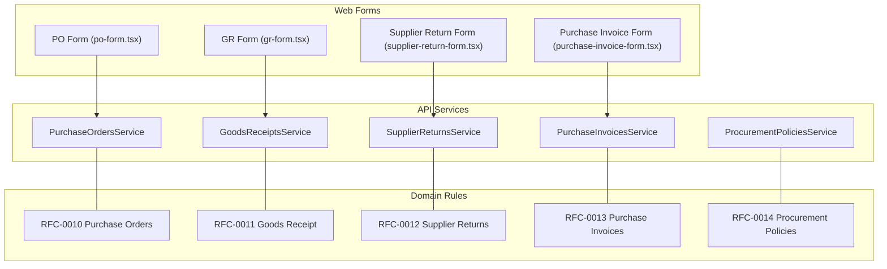
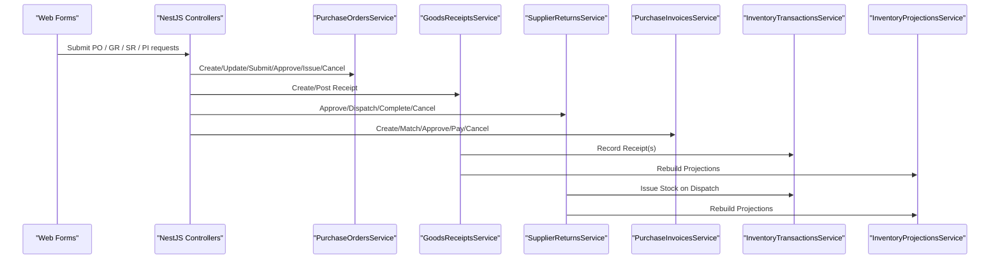
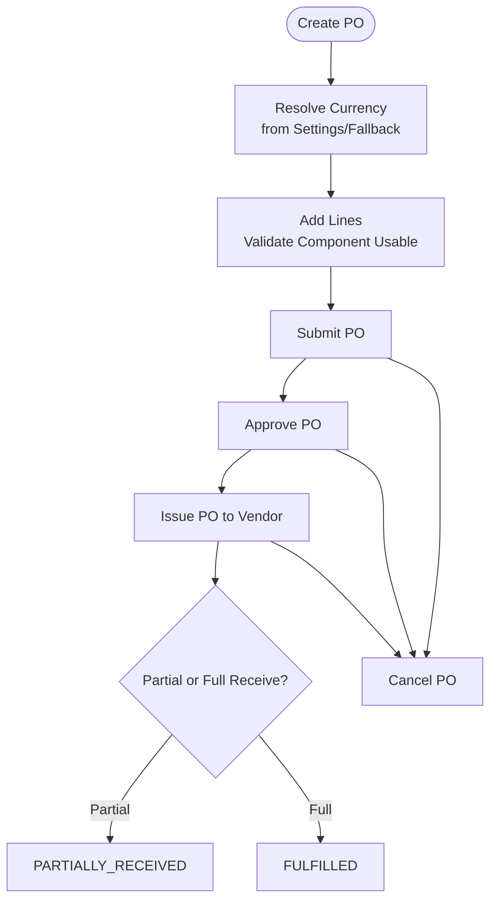
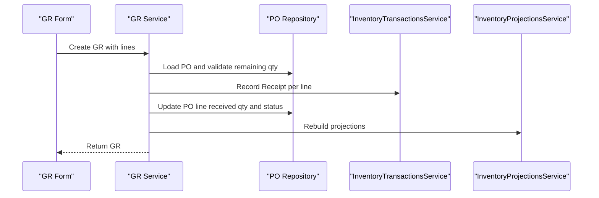
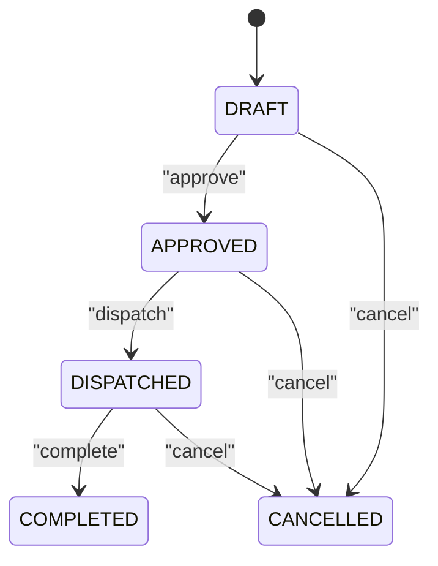
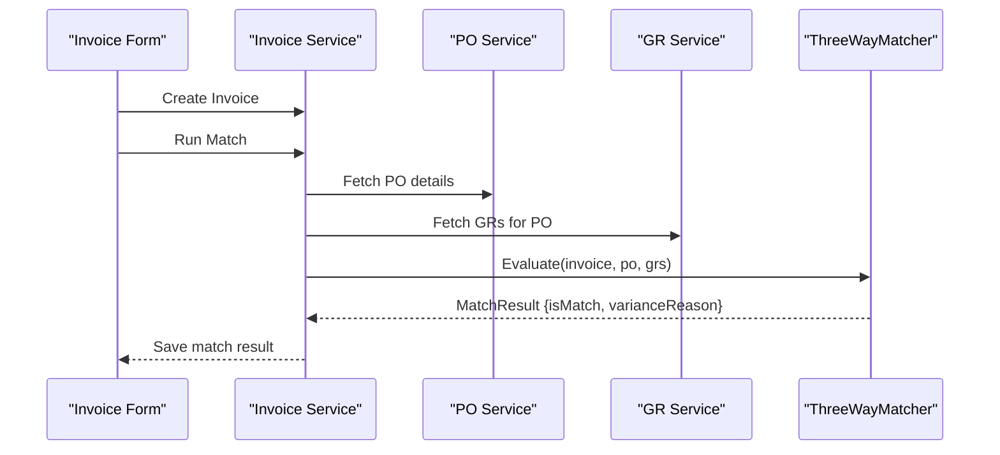
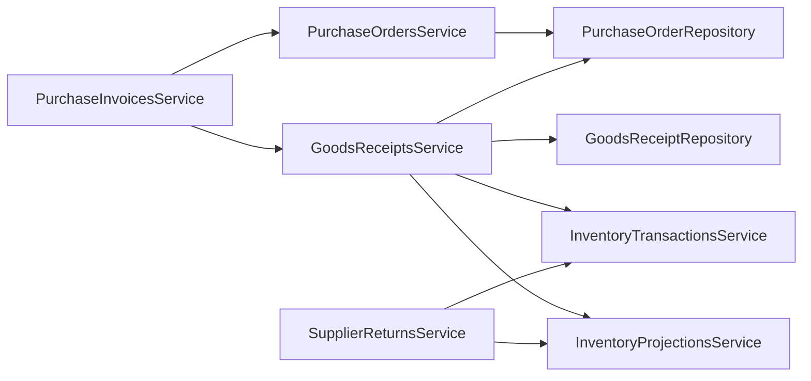

# Procurement Components

<cite>
**Referenced Files in This Document**
- [purchase-orders.service.ts](file://apps/api/src/purchase-orders/purchase-orders.service.ts)
- [goods-receipts.service.ts](file://apps/api/src/goods-receipts/goods-receipts.service.ts)
- [supplier-returns.service.ts](file://apps/api/src/supplier-returns/supplier-returns.service.ts)
- [purchase-invoices.service.ts](file://apps/api/src/purchase-invoices/purchase-invoices.service.ts)
- [procurement-policies.service.ts](file://apps/api/src/procurement-policies/procurement-policies.service.ts)
- [po-form.tsx](file://apps/web/components/purchase-orders/po-form.tsx)
- [gr-form.tsx](file://apps/web/components/goods-receipts/gr-form.tsx)
- [supplier-return-form.tsx](file://apps/web/components/supplier-returns/supplier-return-form.tsx)
- [purchase-invoice-form.tsx](file://apps/web/components/purchase-invoices/purchase-invoice-form.tsx)
- [0010-purchase-orders.md](file://docs/rfcs/0010-purchase-orders.md)
- [0011-goods-receipt.md](file://docs/rfcs/0011-goods-receipt.md)
- [0012-supplier-returns.md](file://docs/rfcs/0012-supplier-returns.md)
- [0013-purchase-invoices.md](file://docs/rfcs/0013-purchase-invoices.md)
- [0014-procurement-policies.md](file://docs/rfcs/0014-procurement-policies.md)
</cite>

## Table of Contents
1. [Introduction](#introduction)
2. [Project Structure](#project-structure)
3. [Core Components](#core-components)
4. [Architecture Overview](#architecture-overview)
5. [Detailed Component Analysis](#detailed-component-analysis)
6. [Dependency Analysis](#dependency-analysis)
7. [Performance Considerations](#performance-considerations)
8. [Troubleshooting Guide](#troubleshooting-guide)
9. [Conclusion](#conclusion)
10. [Appendices](#appendices)

## Introduction
This document provides comprehensive documentation for the procurement components covering purchase orders, goods receipts, supplier returns, and purchase invoices. It explains how to create and manage purchase orders, receive and inspect materials, handle defective item returns, and process vendor invoices with three-way matching. It also documents approval workflows, quantity validations, price calculations, integration points with inventory and accounting systems, and examples for customizing procurement policies, adding approval stages, and implementing custom business rules.

## Project Structure
The procurement domain is implemented as a set of backend services under apps/api/src and corresponding frontend forms under apps/web/components. Business rules are defined in RFCs under docs/rfcs.

**Diagram sources**
- [purchase-orders.service.ts:1-145](file://apps/api/src/purchase-orders/purchase-orders.service.ts#L1-L145)
- [goods-receipts.service.ts:1-207](file://apps/api/src/goods-receipts/goods-receipts.service.ts#L1-L207)
- [supplier-returns.service.ts:1-262](file://apps/api/src/supplier-returns/supplier-returns.service.ts#L1-L262)
- [purchase-invoices.service.ts:1-116](file://apps/api/src/purchase-invoices/purchase-invoices.service.ts#L1-L116)
- [procurement-policies.service.ts:1-37](file://apps/api/src/procurement-policies/procurement-policies.service.ts#L1-L37)
- [po-form.tsx](file://apps/web/components/purchase-orders/po-form.tsx)
- [gr-form.tsx](file://apps/web/components/goods-receipts/gr-form.tsx)
- [supplier-return-form.tsx](file://apps/web/components/supplier-returns/supplier-return-form.tsx)
- [purchase-invoice-form.tsx](file://apps/web/components/purchase-invoices/purchase-invoice-form.tsx)
- [0010-purchase-orders.md:1-232](file://docs/rfcs/0010-purchase-orders.md#L1-L232)
- [0011-goods-receipt.md:1-219](file://docs/rfcs/0011-goods-receipt.md#L1-L219)
- [0012-supplier-returns.md:1-208](file://docs/rfcs/0012-supplier-returns.md#L1-L208)
- [0013-purchase-invoices.md:1-206](file://docs/rfcs/0013-purchase-invoices.md#L1-L206)
- [0014-procurement-policies.md:1-170](file://docs/rfcs/0014-procurement-policies.md#L1-L170)

**Section sources**
- [purchase-orders.service.ts:1-145](file://apps/api/src/purchase-orders/purchase-orders.service.ts#L1-L145)
- [goods-receipts.service.ts:1-207](file://apps/api/src/goods-receipts/goods-receipts.service.ts#L1-L207)
- [supplier-returns.service.ts:1-262](file://apps/api/src/supplier-returns/supplier-returns.service.ts#L1-L262)
- [purchase-invoices.service.ts:1-116](file://apps/api/src/purchase-invoices/purchase-invoices.service.ts#L1-L116)
- [procurement-policies.service.ts:1-37](file://apps/api/src/procurement-policies/procurement-policies.service.ts#L1-L37)
- [0010-purchase-orders.md:1-232](file://docs/rfcs/0010-purchase-orders.md#L1-L232)
- [0011-goods-receipt.md:1-219](file://docs/rfcs/0011-goods-receipt.md#L1-L219)
- [0012-supplier-returns.md:1-208](file://docs/rfcs/0012-supplier-returns.md#L1-L208)
- [0013-purchase-invoices.md:1-206](file://docs/rfcs/0013-purchase-invoices.md#L1-L206)
- [0014-procurement-policies.md:1-170](file://docs/rfcs/0014-procurement-policies.md#L1-L170)

## Core Components
- Purchase Orders: Create, update, submit, approve, issue, cancel; line management; currency resolution; component lifecycle validation.
- Goods Receipts: Receive against open PO lines; validate remaining quantities; post inventory receipts; update PO status; rebuild projections.
- Supplier Returns: Create, approve, dispatch, complete, cancel; stock availability checks; issue inventory transactions on dispatch; restore stock on cancellation.
- Purchase Invoices: Register vendor invoices; add lines; perform three-way match; approve and pay; cancel.
- Procurement Policies: Manage policy records that govern approvals and tolerances.

Key responsibilities:
- Enforce state transitions per RFCs.
- Validate quantities and prices before persisting.
- Integrate with Inventory Transactions and Projections.
- Provide UI forms for each document type.

**Section sources**
- [purchase-orders.service.ts:38-143](file://apps/api/src/purchase-orders/purchase-orders.service.ts#L38-L143)
- [goods-receipts.service.ts:42-116](file://apps/api/src/goods-receipts/goods-receipts.service.ts#L42-L116)
- [supplier-returns.service.ts:32-226](file://apps/api/src/supplier-returns/supplier-returns.service.ts#L32-L226)
- [purchase-invoices.service.ts:23-114](file://apps/api/src/purchase-invoices/purchase-invoices.service.ts#L23-L114)
- [procurement-policies.service.ts:17-35](file://apps/api/src/procurement-policies/procurement-policies.service.ts#L17-L35)

## Architecture Overview
The procurement architecture follows a service-oriented design backed by domain aggregates and repositories. Frontend forms call API endpoints exposed by NestJS controllers (not shown here), which delegate to services. Services coordinate domain logic, repository persistence, and cross-domain integrations with inventory and projections.

**Diagram sources**
- [purchase-orders.service.ts:38-143](file://apps/api/src/purchase-orders/purchase-orders.service.ts#L38-L143)
- [goods-receipts.service.ts:42-116](file://apps/api/src/goods-receipts/goods-receipts.service.ts#L42-L116)
- [supplier-returns.service.ts:129-180](file://apps/api/src/supplier-returns/supplier-returns.service.ts#L129-L180)
- [purchase-invoices.service.ts:70-97](file://apps/api/src/purchase-invoices/purchase-invoices.service.ts#L70-L97)

## Detailed Component Analysis

### Purchase Orders
Purpose:
- Manage the full lifecycle of purchase orders from draft to fulfilled or cancelled.
- Maintain line items with component selection, ordered quantities, unit prices, tax rates, and totals.
- Enforce state transitions and business invariants.

Key behaviors:
- Currency resolution using system settings and fallbacks.
- Component usability validation before adding lines.
- State transitions: submit, approve, issue, cancel.

Approval workflow:
- RFC defines approval tiers and thresholds. The service exposes approve() to transition states. Policy evaluation can be integrated at submit/approve boundaries.

Quantity and price validation:
- Ordered quantity must be positive.
- Totals must equal sum of line totals including tax.

Integration points:
- Suppliers and components master data.
- Inventory projections are updated indirectly via goods receipts.

Customization examples:
- Add an approval stage by extending the service’s submit/approve methods to check policy thresholds and route to higher authority.
- Implement category-based pricing rules in line total calculation.

**Diagram sources**
- [purchase-orders.service.ts:38-143](file://apps/api/src/purchase-orders/purchase-orders.service.ts#L38-L143)
- [0010-purchase-orders.md:114-132](file://docs/rfcs/0010-purchase-orders.md#L114-L132)

**Section sources**
- [purchase-orders.service.ts:38-143](file://apps/api/src/purchase-orders/purchase-orders.service.ts#L38-L143)
- [0010-purchase-orders.md:1-232](file://docs/rfcs/0010-purchase-orders.md#L1-L232)

### Goods Receipts
Purpose:
- Record physical receipt of components against open PO lines.
- Validate receiving quantities against outstanding PO quantities.
- Post inventory receipts and update PO status accordingly.

Key behaviors:
- Automatic posting of inventory receipts when lines exist during creation.
- Explicit post endpoint to finalize pending receipts.
- Rebuild inventory projections after posting.

Quantity validation:
- Received quantity cannot exceed remaining ordered quantity on the PO line.

Integration points:
- Inventory Transactions: record receipt entries.
- Inventory Projections: rebuild balances.
- Purchase Orders: update received quantities and status.

Customization examples:
- Add receiving tolerance checks based on procurement policies.
- Introduce quality inspection steps before marking completed.

**Diagram sources**
- [goods-receipts.service.ts:42-116](file://apps/api/src/goods-receipts/goods-receipts.service.ts#L42-L116)

**Section sources**
- [goods-receipts.service.ts:42-116](file://apps/api/src/goods-receipts/goods-receipts.service.ts#L42-L116)
- [0011-goods-receipt.md:1-219](file://docs/rfcs/0011-goods-receipt.md#L1-L219)

### Supplier Returns
Purpose:
- Handle return of defective or incorrect components to suppliers.
- Track RMA numbers, reasons, and stock deductions upon dispatch.

Key behaviors:
- Draft-only modifications until approved.
- Stock availability checks before approving/dispatching.
- On dispatch, issue inventory transactions to deduct stock.
- On cancellation, restore issued stock if already dispatched.

Workflow:
- Create -> Approve -> Dispatch -> Complete
- Optional Cancel at any non-completed stage.

Customization examples:
- Add multi-level approvals based on return amount or reason codes.
- Integrate with external RMA systems.

**Diagram sources**
- [supplier-returns.service.ts:122-226](file://apps/api/src/supplier-returns/supplier-returns.service.ts#L122-L226)

**Section sources**
- [supplier-returns.service.ts:32-226](file://apps/api/src/supplier-returns/supplier-returns.service.ts#L32-L226)
- [0012-supplier-returns.md:1-208](file://docs/rfcs/0012-supplier-returns.md#L1-L208)

### Purchase Invoices
Purpose:
- Register vendor invoices and perform three-way matching across PO, Goods Receipt, and Invoice.

Key behaviors:
- Create invoice with vendor invoice number, due date, and lines.
- Perform three-way match to detect price and quantity variances.
- Approve for payment and mark as paid.

Three-way matching:
- Compares PO unit price vs invoice unit price.
- Compares received quantity vs billed quantity.
- Sets match status and variance reasons.

Customization examples:
- Configure tolerance thresholds for variances.
- Extend match result handling to require additional approvals for variances.

**Diagram sources**
- [purchase-invoices.service.ts:70-83](file://apps/api/src/purchase-invoices/purchase-invoices.service.ts#L70-L83)

**Section sources**
- [purchase-invoices.service.ts:23-114](file://apps/api/src/purchase-invoices/purchase-invoices.service.ts#L23-L114)
- [0013-purchase-invoices.md:1-206](file://docs/rfcs/0013-purchase-invoices.md#L1-L206)

### Procurement Policies
Purpose:
- Define governance rules for approval tiers and receiving tolerances.

Key behaviors:
- Create and retrieve policy records.
- Policies influence PO submission/approval and GR receiving limits.

Customization examples:
- Add category-specific over-receipt tolerances.
- Introduce executive approval requirements for high-value POs.

**Section sources**
- [procurement-policies.service.ts:17-35](file://apps/api/src/procurement-policies/procurement-policies.service.ts#L17-L35)
- [0014-procurement-policies.md:1-170](file://docs/rfcs/0014-procurement-policies.md#L1-L170)

## Dependency Analysis
Services depend on repositories and cross-domain services:
- GoodsReceiptsService depends on PurchaseOrderRepository, InventoryTransactionsService, InventoryProjectionsService, and PurchaseOrdersService.
- SupplierReturnsService depends on InventoryTransactionsService and InventoryProjectionsService.
- PurchaseInvoicesService depends on PurchaseOrdersService and GoodsReceiptsService.

**Diagram sources**
- [goods-receipts.service.ts:1-40](file://apps/api/src/goods-receipts/goods-receipts.service.ts#L1-L40)
- [supplier-returns.service.ts:1-30](file://apps/api/src/supplier-returns/supplier-returns.service.ts#L1-L30)
- [purchase-invoices.service.ts:1-21](file://apps/api/src/purchase-invoices/purchase-invoices.service.ts#L1-L21)

**Section sources**
- [goods-receipts.service.ts:1-40](file://apps/api/src/goods-receipts/goods-receipts.service.ts#L1-L40)
- [supplier-returns.service.ts:1-30](file://apps/api/src/supplier-returns/supplier-returns.service.ts#L1-L30)
- [purchase-invoices.service.ts:1-21](file://apps/api/src/purchase-invoices/purchase-invoices.service.ts#L1-L21)

## Performance Considerations
- Avoid unnecessary projection rebuilds; batch updates where possible.
- Use efficient queries for PO and GR lookups to minimize latency.
- Defer heavy computations (e.g., projections rebuild) to background tasks if needed.
- Cache frequently accessed master data (suppliers, components) to reduce database load.

[No sources needed since this section provides general guidance]

## Troubleshooting Guide
Common issues and resolutions:
- Exceeded remaining quantity on goods receipt: Ensure received quantity does not exceed PO line remaining quantity.
- Insufficient stock for supplier return: Verify available stock at the selected location before approving/dispatching.
- Cannot modify non-draft documents: Only DRAFT returns and POs allow structural changes; lock after submission/approval.
- Three-way match variance: Review price and quantity differences between PO, GR, and invoice; adjust or approve variances per policy.

Operational checks:
- Confirm inventory transactions were recorded for receipts and issues.
- Validate that projections were rebuilt after posting.
- Check policy configurations for approval thresholds and tolerances.

**Section sources**
- [goods-receipts.service.ts:42-60](file://apps/api/src/goods-receipts/goods-receipts.service.ts#L42-L60)
- [supplier-returns.service.ts:93-108](file://apps/api/src/supplier-returns/supplier-returns.service.ts#L93-L108)
- [purchase-invoices.service.ts:70-83](file://apps/api/src/purchase-invoices/purchase-invoices.service.ts#L70-L83)

## Conclusion
The procurement components provide a robust foundation for managing purchase orders, goods receipts, supplier returns, and purchase invoices. They enforce domain invariants, integrate with inventory systems, and support extensible policies and workflows. By following the documented patterns, teams can customize approval stages, implement business rules, and maintain consistency across procurement operations.

[No sources needed since this section summarizes without analyzing specific files]

## Appendices

### Web Forms Overview
- PO Form: Supports creating and editing purchase orders, adding lines, calculating totals, and triggering submit/approve/issue actions.
- GR Form: Enables receiving against PO lines, entering batch/serial info, and posting receipts.
- Supplier Return Form: Facilitates creating returns, selecting source locations, specifying reasons, and dispatching returns.
- Purchase Invoice Form: Allows registering invoices, adding lines, running three-way match, and approving payments.

**Section sources**
- [po-form.tsx](file://apps/web/components/purchase-orders/po-form.tsx)
- [gr-form.tsx](file://apps/web/components/goods-receipts/gr-form.tsx)
- [supplier-return-form.tsx](file://apps/web/components/supplier-returns/supplier-return-form.tsx)
- [purchase-invoice-form.tsx](file://apps/web/components/purchase-invoices/purchase-invoice-form.tsx)