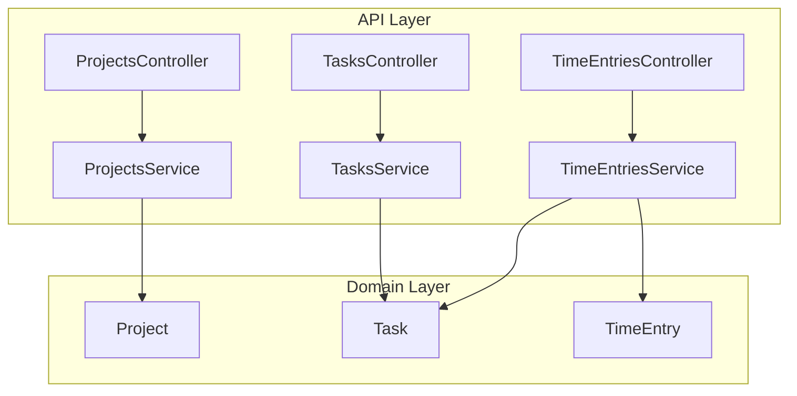
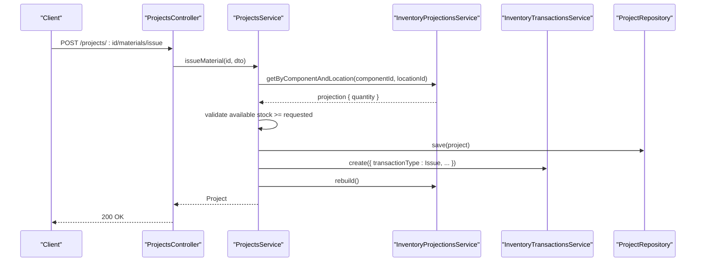
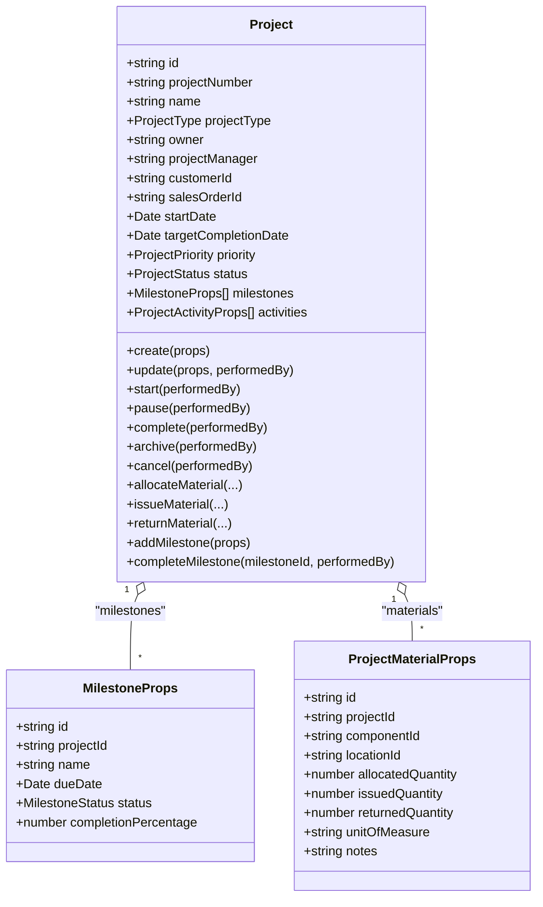
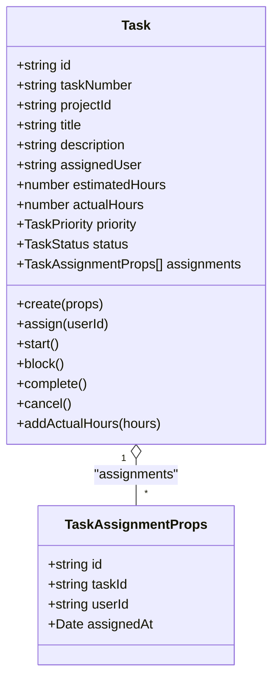
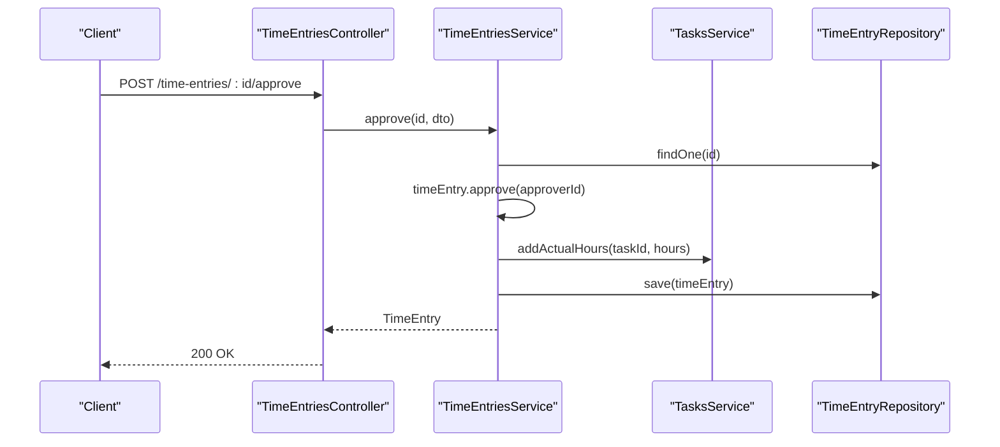
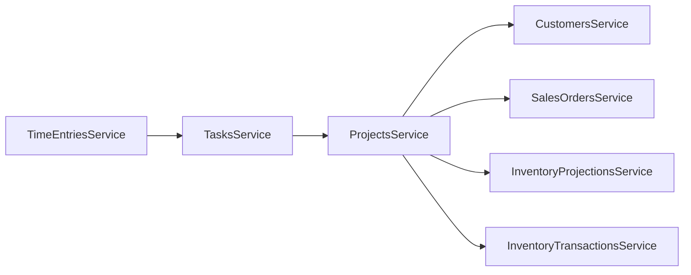

# Project & Task Components

<cite>
**Referenced Files in This Document**
- [0041-project-management.md](file://docs/rfcs/0041-project-management.md)
- [0043-task-management.md](file://docs/rfcs/0043-task-management.md)
- [0044-time-tracking.md](file://docs/rfcs/0044-time-tracking.md)
- [projects.controller.ts](file://apps/api/src/projects/projects.controller.ts)
- [projects.service.ts](file://apps/api/src/projects/projects.service.ts)
- [dtos.ts (projects)](file://apps/api/src/projects/dtos.ts)
- [project.ts](file://packages/projects/src/projects/project.ts)
- [tasks.controller.ts](file://apps/api/src/tasks/tasks.controller.ts)
- [tasks.service.ts](file://apps/api/src/tasks/tasks.service.ts)
- [dtos.ts (tasks)](file://apps/api/src/tasks/dtos.ts)
- [task.ts](file://packages/projects/src/tasks/task.ts)
- [time-entries.controller.ts](file://apps/api/src/time-entries/time-entries.controller.ts)
- [time-entries.service.ts](file://apps/api/src/time-entries/time-entries.service.ts)
- [dtos.ts (time-entries)](file://apps/api/src/time-entries/dtos.ts)
- [time-entry.ts](file://packages/projects/src/time/time-entry.ts)
</cite>

## Table of Contents
1. [Introduction](#introduction)
2. [Project Structure](#project-structure)
3. [Core Components](#core-components)
4. [Architecture Overview](#architecture-overview)
5. [Detailed Component Analysis](#detailed-component-analysis)
6. [Dependency Analysis](#dependency-analysis)
7. [Performance Considerations](#performance-considerations)
8. [Troubleshooting Guide](#troubleshooting-guide)
9. [Conclusion](#conclusion)
10. [Appendices](#appendices)

## Introduction
This document explains the project, task, and time entry management components that enable end-to-end delivery planning, execution tracking, and billing-ready labor reporting. It covers:
- Project creation and lifecycle management with milestones and material allocation
- Task assignment, status transitions, and hour estimation vs actuals
- Time entry submission, approval workflow, and integration with task hours
- Integration points with sales, inventory, and financial systems
- Practical guidance for customizing templates, adding fields, and automating reports

The domain design is defined by RFCs for project management, task management, and time tracking, while the runtime behavior is implemented via NestJS controllers/services and domain classes in the projects package.

## Project Structure
At a high level, each bounded area has:
- API layer: Controllers expose REST endpoints; Services orchestrate business logic and cross-module calls
- Domain layer: Classes define entities, value objects, state machines, and invariants
- DTOs: Request validation and typing at the API boundary

**Diagram sources**
- [projects.controller.ts:24-120](file://apps/api/src/projects/projects.controller.ts#L24-L120)
- [projects.service.ts:30-281](file://apps/api/src/projects/projects.service.ts#L30-L281)
- [tasks.controller.ts:6-61](file://apps/api/src/tasks/tasks.controller.ts#L6-L61)
- [tasks.service.ts:18-113](file://apps/api/src/tasks/tasks.service.ts#L18-L113)
- [time-entries.controller.ts:6-46](file://apps/api/src/time-entries/time-entries.controller.ts#L6-L46)
- [time-entries.service.ts:17-82](file://apps/api/src/time-entries/time-entries.service.ts#L17-L82)
- [project.ts:115-543](file://packages/projects/src/projects/project.ts#L115-L543)
- [task.ts:41-174](file://packages/projects/src/tasks/task.ts#L41-L174)
- [time-entry.ts:26-99](file://packages/projects/src/time/time-entry.ts#L26-L99)

**Section sources**
- [projects.controller.ts:24-120](file://apps/api/src/projects/projects.controller.ts#L24-L120)
- [projects.service.ts:30-281](file://apps/api/src/projects/projects.service.ts#L30-L281)
- [tasks.controller.ts:6-61](file://apps/api/src/tasks/tasks.controller.ts#L6-L61)
- [tasks.service.ts:18-113](file://apps/api/src/tasks/tasks.service.ts#L18-L113)
- [time-entries.controller.ts:6-46](file://apps/api/src/time-entries/time-entries.controller.ts#L6-L46)
- [time-entries.service.ts:17-82](file://apps/api/src/time-entries/time-entries.service.ts#L17-L82)
- [project.ts:115-543](file://packages/projects/src/projects/project.ts#L115-L543)
- [task.ts:41-174](file://packages/projects/src/tasks/task.ts#L41-L174)
- [time-entry.ts:26-99](file://packages/projects/src/time/time-entry.ts#L26-L99)

## Core Components
- Projects: Define scope, owner/manager, dates, priority, status lifecycle, milestones, and material allocation/issue/return. Integrates with customers, sales orders, and inventory projections/transactions.
- Tasks: Discrete work items linked to projects, with assignees, estimated hours, and status lifecycle. Actual hours are updated when time entries are approved.
- Time Entries: Daily logged hours against tasks with an approval workflow. Approved entries increment task actual hours.

Key behaviors:
- Project lifecycle: PLANNING → ACTIVE → COMPLETED/ARCHIVED/CANCELLED, with ON_HOLD as a pause state
- Task lifecycle: TODO → IN_PROGRESS → DONE or CANCELLED, with BLOCKED as a temporary state
- Time Entry lifecycle: SUBMITTED → APPROVED or REJECTED

Validation and invariants are enforced at both API DTOs and domain classes.

**Section sources**
- [0041-project-management.md:15-112](file://docs/rfcs/0041-project-management.md#L15-L112)
- [0043-task-management.md:15-118](file://docs/rfcs/0043-task-management.md#L15-L118)
- [0044-time-tracking.md:15-103](file://docs/rfcs/0044-time-tracking.md#L15-L103)
- [project.ts:115-543](file://packages/projects/src/projects/project.ts#L115-L543)
- [task.ts:41-174](file://packages/projects/src/tasks/task.ts#L41-L174)
- [time-entry.ts:26-99](file://packages/projects/src/time/time-entry.ts#L26-L99)

## Architecture Overview
The system follows a layered architecture:
- Controllers handle HTTP requests and map them to service methods
- Services enforce cross-cutting concerns (validation, external service calls, repository persistence)
- Domain classes encapsulate business rules, state transitions, and audit activities

**Diagram sources**
- [projects.controller.ts:111-118](file://apps/api/src/projects/projects.controller.ts#L111-L118)
- [projects.service.ts:216-253](file://apps/api/src/projects/projects.service.ts#L216-L253)

## Detailed Component Analysis

### Project Management
Responsibilities:
- Create/update projects with metadata, owners/managers, dates, and priorities
- Manage milestones and their completion
- Allocate, issue, and return materials with inventory integration
- Enforce project status transitions and audit activities

Key data model highlights:
- ProjectStatus includes PLANNING, ACTIVE, ON_HOLD, COMPLETED, ARCHIVED, CANCELLED
- Milestones track name, due date, status, and completion percentage
- Material records track allocated, issued, returned quantities per component/location

Lifecycle transitions:
- Start, Pause, Complete, Archive, Cancel with guardrails based on current status

Integration points:
- Customers and Sales Orders referenced during project creation/update
- Inventory projections validated before allocation/issue
- Inventory transactions recorded for physical stock movements

**Diagram sources**
- [project.ts:30-84](file://packages/projects/src/projects/project.ts#L30-L84)
- [project.ts:115-543](file://packages/projects/src/projects/project.ts#L115-L543)

API surface:
- CRUD operations for projects
- Lifecycle actions: start, pause, complete, archive, cancel
- Milestone operations: add, complete
- Material operations: allocate, issue, return

Validation and error handling:
- DTOs enforce required fields and numeric constraints
- Service validates external references (customer/sales order) and inventory availability
- Domain enforces status guards and material balance invariants

**Section sources**
- [projects.controller.ts:24-120](file://apps/api/src/projects/projects.controller.ts#L24-L120)
- [projects.service.ts:40-281](file://apps/api/src/projects/projects.service.ts#L40-L281)
- [dtos.ts (projects):10-182](file://apps/api/src/projects/dtos.ts#L10-L182)
- [project.ts:115-543](file://packages/projects/src/projects/project.ts#L115-L543)
- [0041-project-management.md:15-112](file://docs/rfcs/0041-project-management.md#L15-L112)

### Task Management
Responsibilities:
- Create tasks within a project, assign users, set estimated hours and priority
- Transition through status lifecycle: TODO → IN_PROGRESS → DONE or CANCELLED, with BLOCKED
- Track actual hours accumulated from approved time entries

Key data model highlights:
- TaskStatus includes TODO, IN_PROGRESS, BLOCKED, DONE, CANCELLED
- Assignments history tracks user assignments over time
- Estimated vs actual hours support progress and productivity analysis

Integration points:
- Validates project existence and disallows tasks on completed/cancelled projects
- Receives actual hours updates from time entry approval flow

**Diagram sources**
- [task.ts:8-29](file://packages/projects/src/tasks/task.ts#L8-L29)
- [task.ts:41-174](file://packages/projects/src/tasks/task.ts#L41-L174)

API surface:
- CRUD operations for tasks
- Assignment endpoint
- Lifecycle actions: start, block, complete, cancel

Validation and error handling:
- DTOs require projectId/title and non-negative estimated hours
- Service prevents tasks on closed projects
- Domain enforces status guards and positive hours for actuals

**Section sources**
- [tasks.controller.ts:6-61](file://apps/api/src/tasks/tasks.controller.ts#L6-L61)
- [tasks.service.ts:26-113](file://apps/api/src/tasks/tasks.service.ts#L26-L113)
- [dtos.ts (tasks):10-41](file://apps/api/src/tasks/dtos.ts#L10-L41)
- [task.ts:41-174](file://packages/projects/src/tasks/task.ts#L41-L174)
- [0043-task-management.md:15-118](file://docs/rfcs/0043-task-management.md#L15-L118)

### Time Entry Management
Responsibilities:
- Submit daily time entries against tasks with hours and optional descriptions
- Approve or reject entries; approved entries update task actual hours
- Provide filtering by user, task, status, and date range

Key data model highlights:
- TimeEntryStatus includes SUBMITTED, APPROVED, REJECTED
- Hours validated to be greater than zero and at most 24 per entry

Integration points:
- Validates task existence and disallows entries on completed/cancelled tasks
- On approval, increments task actual hours via TasksService

**Diagram sources**
- [time-entries.controller.ts:37-44](file://apps/api/src/time-entries/time-entries.controller.ts#L37-L44)
- [time-entries.service.ts:68-73](file://apps/api/src/time-entries/time-entries.service.ts#L68-L73)
- [tasks.service.ts:107-112](file://apps/api/src/tasks/tasks.service.ts#L107-L112)

API surface:
- CRUD operations for time entries
- Approval/rejection endpoints
- Filtering by user, task, status, and date range

Validation and error handling:
- DTOs enforce required fields and hours range
- Service prevents entries against closed tasks
- Domain enforces status guards and valid hours

**Section sources**
- [time-entries.controller.ts:6-46](file://apps/api/src/time-entries/time-entries.controller.ts#L6-L46)
- [time-entries.service.ts:25-82](file://apps/api/src/time-entries/time-entries.service.ts#L25-L82)
- [dtos.ts (time-entries):11-39](file://apps/api/src/time-entries/dtos.ts#L11-L39)
- [time-entry.ts:26-99](file://packages/projects/src/time/time-entry.ts#L26-L99)
- [0044-time-tracking.md:15-103](file://docs/rfcs/0044-time-tracking.md#L15-L103)

## Dependency Analysis
Cross-module relationships:
- ProjectsService depends on CustomersService, SalesOrdersService, InventoryProjectionsService, and InventoryTransactionsService
- TasksService depends on ProjectsService to validate project state before creating tasks
- TimeEntriesService depends on TasksService to validate task state and update actual hours

**Diagram sources**
- [projects.service.ts:30-38](file://apps/api/src/projects/projects.service.ts#L30-L38)
- [tasks.service.ts:18-24](file://apps/api/src/tasks/tasks.service.ts#L18-L24)
- [time-entries.service.ts:17-23](file://apps/api/src/time-entries/time-entries.service.ts#L17-L23)

**Section sources**
- [projects.service.ts:30-38](file://apps/api/src/projects/projects.service.ts#L30-L38)
- [tasks.service.ts:18-24](file://apps/api/src/tasks/tasks.service.ts#L18-L24)
- [time-entries.service.ts:17-23](file://apps/api/src/time-entries/time-entries.service.ts#L17-L23)

## Performance Considerations
- Batch queries: Use list endpoints with filters to reduce round-trips for dashboards and reports
- Projection caching: Rebuild inventory projections only after material issues/returns to avoid unnecessary recomputation
- Pagination: Apply pagination on large lists of projects, tasks, and time entries
- Indexing: Ensure database indexes on foreign keys (projectId, taskId, userId) and frequently filtered fields (status, priority, date ranges)
- Idempotency: For critical operations like material issuance and approvals, consider idempotency keys to prevent duplicate side effects

[No sources needed since this section provides general guidance]

## Troubleshooting Guide
Common issues and resolutions:
- Cannot add tasks to a project: The project may be COMPLETED or CANCELLED. Change project status or use a different project.
  - See [tasks.service.ts:26-32](file://apps/api/src/tasks/tasks.service.ts#L26-L32)
- Cannot log time entries against a task: The task may be DONE or CANCELLED. Update task status or use an active task.
  - See [time-entries.service.ts:25-31](file://apps/api/src/time-entries/time-entries.service.ts#L25-L31)
- Cannot issue materials: Insufficient allocated stock at the selected location. Allocate more first or choose another location.
  - See [projects.service.ts:216-230](file://apps/api/src/projects/projects.service.ts#L216-L230)
- Invalid project edits: Editing is blocked for COMPLETED, ARCHIVED, or CANCELLED projects.
  - See [project.ts:200-212](file://packages/projects/src/projects/project.ts#L200-L212)
- Time entry validation errors: Hours must be > 0 and ≤ 24; userId and taskId are required.
  - See [dtos.ts (time-entries):11-32](file://apps/api/src/time-entries/dtos.ts#L11-L32)

**Section sources**
- [tasks.service.ts:26-32](file://apps/api/src/tasks/tasks.service.ts#L26-L32)
- [time-entries.service.ts:25-31](file://apps/api/src/time-entries/time-entries.service.ts#L25-L31)
- [projects.service.ts:216-230](file://apps/api/src/projects/projects.service.ts#L216-L230)
- [project.ts:200-212](file://packages/projects/src/projects/project.ts#L200-L212)
- [dtos.ts (time-entries):11-32](file://apps/api/src/time-entries/dtos.ts#L11-L32)

## Conclusion
The project, task, and time entry components provide a robust foundation for delivery planning and execution:
- Projects capture scope, milestones, and material usage with strong lifecycle controls
- Tasks break down deliverables into assignable units with clear status flows
- Time entries capture effort and integrate with task actuals upon approval
- Integration with sales, inventory, and financial domains enables accurate billing and post-mortem analysis

Adopt the recommended patterns for customization, reporting, and automation to extend capabilities while preserving domain integrity.

[No sources needed since this section summarizes without analyzing specific files]

## Appendices

### Project Form Fields and Validation
- Required: name, projectManager, startDate, targetCompletionDate
- Optional: projectType, description, owner, customerId, salesOrderId, priority, performedBy
- Constraints: targetCompletionDate ≥ startDate; status-based editability

**Section sources**
- [dtos.ts (projects):10-54](file://apps/api/src/projects/dtos.ts#L10-L54)
- [project.ts:156-194](file://packages/projects/src/projects/project.ts#L156-L194)

### Task Form Fields and Validation
- Required: projectId, title, estimatedHours
- Optional: description, assignedUser, priority
- Constraints: estimatedHours ≥ 0; cannot create on closed projects

**Section sources**
- [dtos.ts (tasks):10-34](file://apps/api/src/tasks/dtos.ts#L10-L34)
- [tasks.service.ts:26-46](file://apps/api/src/tasks/tasks.service.ts#L26-L46)

### Time Entry Form Fields and Validation
- Required: userId, taskId, date, hours
- Optional: description
- Constraints: 0 < hours ≤ 24; cannot log against closed tasks

**Section sources**
- [dtos.ts (time-entries):11-32](file://apps/api/src/time-entries/dtos.ts#L11-L32)
- [time-entries.service.ts:25-41](file://apps/api/src/time-entries/time-entries.service.ts#L25-L41)

### Customizing Project Templates
- Use projectType to differentiate templates (e.g., CUSTOMER, INTERNAL, R_AND_D, PROTOTYPE, INSTALLATION, MANUFACTURING_INITIATIVE)
- Predefine default values for owner, projectManager, priority, and milestone structures in your UI or backend template generator
- Store template configurations in a settings module and apply defaults during project creation

**Section sources**
- [project.ts:10-16](file://packages/projects/src/projects/project.ts#L10-L16)
- [projects.service.ts:40-66](file://apps/api/src/projects/projects.service.ts#L40-L66)

### Adding Custom Fields
- Extend DTOs to accept new fields and add corresponding validators
- Extend domain props/interfaces and entity constructors to persist and enforce invariants
- Update services to pass through new fields and repositories to persist them

Examples:
- Add budget fields to CreateProjectDto/UpdateProjectDto and ProjectProps/Project
- Add custom attributes to TaskProps/Task and related DTOs
- Add cost center or category to TimeEntryProps/TimeEntry and related DTOs

**Section sources**
- [dtos.ts (projects):10-182](file://apps/api/src/projects/dtos.ts#L10-L182)
- [project.ts:65-113](file://packages/projects/src/projects/project.ts#L65-L113)
- [task.ts:15-39](file://packages/projects/src/tasks/task.ts#L15-L39)
- [time-entry.ts:5-24](file://packages/projects/src/time/time-entry.ts#L5-L24)

### Implementing Automated Reporting
- Aggregate project metrics: count by status/priority, overdue milestones, material utilization
- Task analytics: estimated vs actual hours, completion rates, assignee workload
- Time tracking reports: weekly timesheets, approval queues, billable hours by project/task/user
- Integrate with existing reporting modules and export to CSV/PDF

Suggested endpoints:
- GET /projects?status=&priority=&customerId=
- GET /tasks?projectId=&assignedUser=&status=&priority=
- GET /time-entries?userId=&taskId=&status=&startDate=&endDate=

**Section sources**
- [projects.controller.ts:34-51](file://apps/api/src/projects/projects.controller.ts#L34-L51)
- [tasks.controller.ts:15-30](file://apps/api/src/tasks/tasks.controller.ts#L15-L30)
- [time-entries.controller.ts:15-30](file://apps/api/src/time-entries/time-entries.controller.ts#L15-L30)

### Billing Integration Notes
- Approved time entries provide exact labor hours for billing verification
- Link time entries to commercial contracts via project sales order reference
- Export approved hours and project material usage for invoicing and reconciliation

**Section sources**
- [0044-time-tracking.md:75-78](file://docs/rfcs/0044-time-tracking.md#L75-L78)
- [0041-project-management.md:81-83](file://docs/rfcs/0041-project-management.md#L81-L83)