# Service & Maintenance Components

<cite>
**Referenced Files in This Document**
- [service-requests.controller.ts](file://apps/api/src/service-requests/service-requests.controller.ts)
- [service-requests.service.ts](file://apps/api/src/service-requests/service-requests.service.ts)
- [service-requests dtos.ts](file://apps/api/src/service-requests/dtos.ts)
- [maintenance-schedules.controller.ts](file://apps/api/src/maintenance-schedules/maintenance-schedules.controller.ts)
- [maintenance-schedules.service.ts](file://apps/api/src/maintenance-schedules/maintenance-schedules.service.ts)
- [maintenance-schedules dtos.ts](file://apps/api/src/maintenance-schedules/dtos.ts)
- [warranty-claims.controller.ts](file://apps/api/src/warranty-claims/warranty-claims.controller.ts)
- [warranty-claims.service.ts](file://apps/api/src/warranty-claims/warranty-claims.service.ts)
- [warranty-claims dtos.ts](file://apps/api/src/warranty-claims/dtos.ts)
- [rma-requests.controller.ts](file://apps/api/src/rma-requests/rma-requests.controller.ts)
- [rma-requests.service.ts](file://apps/api/src/rma-requests/rma-requests.service.ts)
- [rma-requests dtos.ts](file://apps/api/src/rma-requests/dtos.ts)
</cite>

## Table of Contents
1. Introduction
2. Project Structure
3. Core Components
4. Architecture Overview
5. Detailed Component Analysis
6. Dependency Analysis
7. Performance Considerations
8. Troubleshooting Guide
9. Conclusion
10. Appendices

## Introduction
This document explains the service and maintenance capabilities implemented in the API layer, focusing on:
- Service request handling for customer support tickets
- Maintenance scheduling for equipment upkeep
- Warranty claims processing for coverage validation
- RMA (Return Merchandise Authorization) workflows for returns

It also covers status tracking, technician assignment, SLA management concepts, and integration points with inventory-related entities such as components and serial numbers. Examples are provided to show how to customize workflows, add new claim types, and extend maintenance schedules.

## Project Structure
The service and maintenance features are organized by domain within the API application:
- Service Requests: controller, service, DTOs
- Maintenance Schedules: controller, service, DTOs
- Warranty Claims: controller, service, DTOs
- RMA Requests: controller, service, DTOs

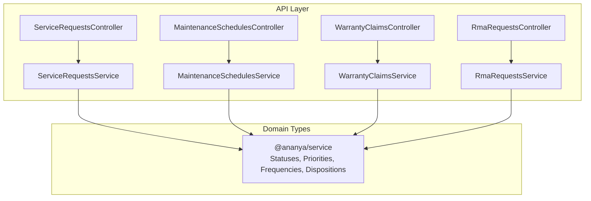

**Diagram sources**
- [service-requests.controller.ts:14-83](file://apps/api/src/service-requests/service-requests.controller.ts#L14-L83)
- [maintenance-schedules.controller.ts:6-63](file://apps/api/src/maintenance-schedules/maintenance-schedules.controller.ts#L6-L63)
- [warranty-claims.controller.ts:6-49](file://apps/api/src/warranty-claims/warranty-claims.controller.ts#L6-L49)
- [rma-requests.controller.ts:6-66](file://apps/api/src/rma-requests/rma-requests.controller.ts#L6-L66)

**Section sources**
- [service-requests.controller.ts:14-83](file://apps/api/src/service-requests/service-requests.controller.ts#L14-L83)
- [maintenance-schedules.controller.ts:6-63](file://apps/api/src/maintenance-schedules/maintenance-schedules.controller.ts#L6-L63)
- [warranty-claims.controller.ts:6-49](file://apps/api/src/warranty-claims/warranty-claims.controller.ts#L6-L49)
- [rma-requests.controller.ts:6-66](file://apps/api/src/rma-requests/rma-requests.controller.ts#L6-L66)

## Core Components
- Service Requests: Create, list, assign, diagnose, and progress through repair states; supports filtering by status, priority, category, customer, and assigned technician.
- Maintenance Schedules: Create periodic maintenance plans, pause/resume, complete visits or plans, and cancel.
- Warranty Claims: Create claims with purchase/expiry dates, review, approve, or reject with optional notes.
- RMA Requests: Create return requests, approve/receive/inspect/process/close/reject with disposition tracking.

Key responsibilities:
- Controllers expose REST endpoints and route to services.
- Services orchestrate business logic, validate inputs via DTOs, interact with repositories, and coordinate with other services (e.g., customers, components).
- Domain models and enumerations (statuses, priorities, frequencies, dispositions) are imported from @ananya/service.

**Section sources**
- [service-requests.service.ts:1-127](file://apps/api/src/service-requests/service-requests.service.ts#L1-L127)
- [maintenance-schedules.service.ts:1-103](file://apps/api/src/maintenance-schedules/maintenance-schedules.service.ts#L1-L103)
- [warranty-claims.service.ts:1-84](file://apps/api/src/warranty-claims/warranty-claims.service.ts#L1-L84)
- [rma-requests.service.ts:1-102](file://apps/api/src/rma-requests/rma-requests.service.ts#L1-L102)

## Architecture Overview
High-level flow across the four domains:

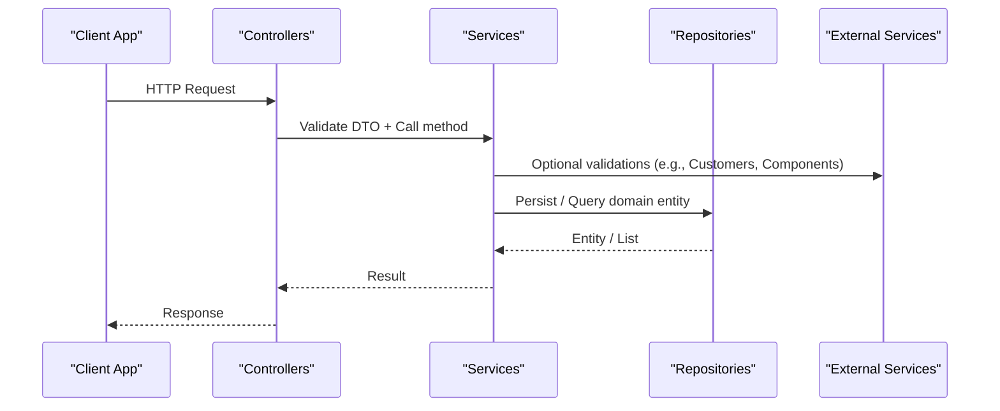

**Diagram sources**
- [service-requests.controller.ts:20-82](file://apps/api/src/service-requests/service-requests.controller.ts#L20-L82)
- [service-requests.service.ts:26-125](file://apps/api/src/service-requests/service-requests.service.ts#L26-L125)
- [maintenance-schedules.controller.ts:12-62](file://apps/api/src/maintenance-schedules/maintenance-schedules.controller.ts#L12-L62)
- [maintenance-schedules.service.ts:22-101](file://apps/api/src/maintenance-schedules/maintenance-schedules.service.ts#L22-L101)
- [warranty-claims.controller.ts:10-48](file://apps/api/src/warranty-claims/warranty-claims.controller.ts#L10-L48)
- [warranty-claims.service.ts:22-82](file://apps/api/src/warranty-claims/warranty-claims.service.ts#L22-L82)
- [rma-requests.controller.ts:10-65](file://apps/api/src/rma-requests/rma-requests.controller.ts#L10-L65)
- [rma-requests.service.ts:21-100](file://apps/api/src/rma-requests/rma-requests.service.ts#L21-L100)

## Detailed Component Analysis

### Service Requests
Responsibilities:
- Create service requests linked to a customer and optionally to sales orders, projects, components, or serial numbers.
- Assign technicians and record diagnosis notes.
- Progress through states: waiting parts, start repair, complete, close, cancel.
- Filter and search across statuses, priorities, categories, customers, and assignments.

Endpoints overview:
- POST /service-requests
- GET /service-requests (filters: status, priority, category, customerId, assignedTechnician, search)
- GET /service-requests/:id
- POST /service-requests/:id/assign
- POST /service-requests/:id/diagnose
- POST /service-requests/:id/waiting-parts
- POST /service-requests/:id/start-repair
- POST /service-requests/:id/complete
- POST /service-requests/:id/close
- POST /service-requests/:id/cancel

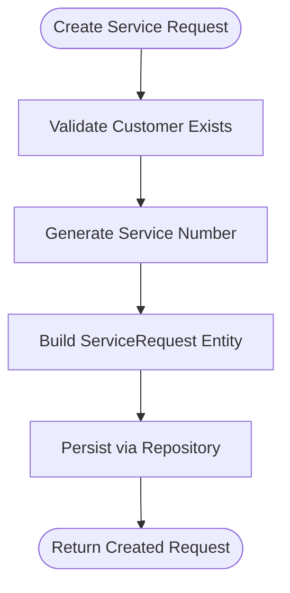

**Diagram sources**
- [service-requests.service.ts:26-44](file://apps/api/src/service-requests/service-requests.service.ts#L26-L44)

Status transitions example:
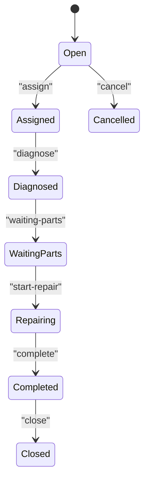

**Diagram sources**
- [service-requests.controller.ts:49-82](file://apps/api/src/service-requests/service-requests.controller.ts#L49-L82)
- [service-requests.service.ts:72-125](file://apps/api/src/service-requests/service-requests.service.ts#L72-L125)

Customization examples:
- Add a new state transition: introduce a new endpoint in the controller and a corresponding method in the service that calls the domain model’s transition method.
- Enforce SLA timers: compute due dates based on priority and category at creation time and store them alongside status updates; expose metrics via a reporting endpoint.
- Technician assignment rules: implement routing logic in the service to auto-assign based on skill tags or workload before persisting.

**Section sources**
- [service-requests.controller.ts:14-83](file://apps/api/src/service-requests/service-requests.controller.ts#L14-L83)
- [service-requests.service.ts:1-127](file://apps/api/src/service-requests/service-requests.service.ts#L1-L127)
- [service-requests dtos.ts:1-53](file://apps/api/src/service-requests/dtos.ts#L1-L53)

### Maintenance Schedules
Responsibilities:
- Create recurring maintenance plans per customer asset with frequency and next visit date.
- Pause/resume schedules, mark visits or entire plans complete, and cancel.
- Filter by customer, technician, status, frequency, and free-text search.

Endpoints overview:
- POST /maintenance-schedules
- GET /maintenance-schedules (filters: customerId, assignedTechnician, status, frequency, search)
- GET /maintenance-schedules/:id
- POST /maintenance-schedules/:id/pause
- POST /maintenance-schedules/:id/resume
- POST /maintenance-schedules/:id/complete-visit
- POST /maintenance-schedules/:id/complete-plan
- POST /maintenance-schedules/:id/cancel

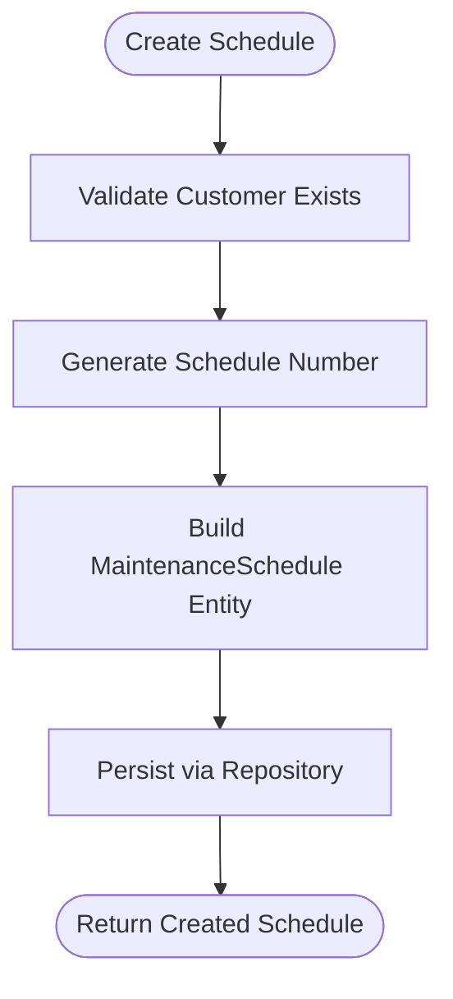

**Diagram sources**
- [maintenance-schedules.service.ts:22-40](file://apps/api/src/maintenance-schedules/maintenance-schedules.service.ts#L22-L40)

Lifecycle example:
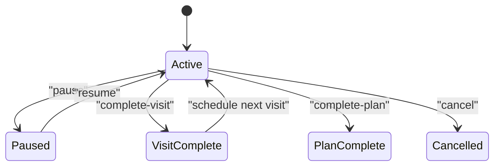

**Diagram sources**
- [maintenance-schedules.controller.ts:39-62](file://apps/api/src/maintenance-schedules/maintenance-schedules.controller.ts#L39-L62)
- [maintenance-schedules.service.ts:68-101](file://apps/api/src/maintenance-schedules/maintenance-schedules.service.ts#L68-L101)

Extension examples:
- New frequencies: add a new value to the frequency enumeration in the shared service package and use it in DTOs and UI forms.
- Conditional scheduling: after completing a visit, calculate the next visit date using business rules (e.g., age-based intervals) before saving.
- Integration with work orders: upon completing a visit, create a work order if defects are found.

**Section sources**
- [maintenance-schedules.controller.ts:6-63](file://apps/api/src/maintenance-schedules/maintenance-schedules.controller.ts#L6-L63)
- [maintenance-schedules.service.ts:1-103](file://apps/api/src/maintenance-schedules/maintenance-schedules.service.ts#L1-L103)
- [maintenance-schedules dtos.ts:1-38](file://apps/api/src/maintenance-schedules/dtos.ts#L1-L38)

### Warranty Claims
Responsibilities:
- Create warranty claims tied to a customer and product, with purchase and expiry dates.
- Review, approve, or reject claims with optional decision notes.
- Filter by customer, product, decision, and search.

Endpoints overview:
- POST /warranty-claims
- GET /warranty-claims (filters: customerId, productId, decision, search)
- GET /warranty-claims/:id
- POST /warranty-claims/:id/review
- POST /warranty-claims/:id/approve
- POST /warranty-claims/:id/reject

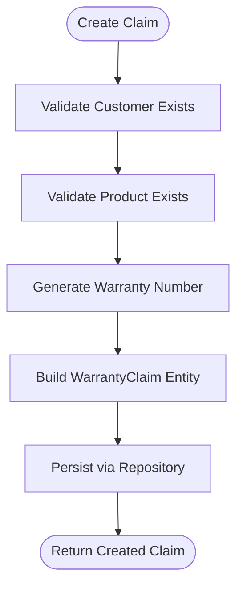

**Diagram sources**
- [warranty-claims.service.ts:22-39](file://apps/api/src/warranty-claims/warranty-claims.service.ts#L22-L39)

Decision workflow:
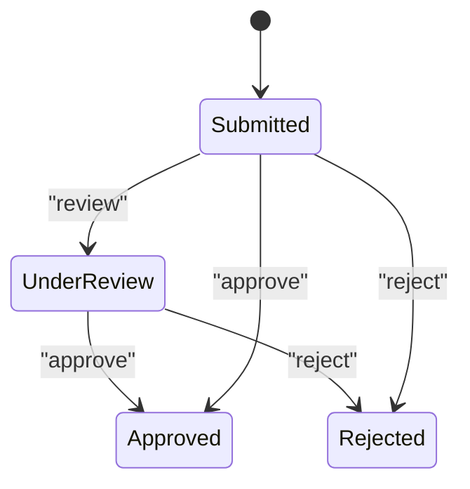

**Diagram sources**
- [warranty-claims.controller.ts:35-48](file://apps/api/src/warranty-claims/warranty-claims.controller.ts#L35-L48)
- [warranty-claims.service.ts:63-82](file://apps/api/src/warranty-claims/warranty-claims.service.ts#L63-L82)

Adding new claim types:
- Extend the claim reason taxonomy in the shared service package or database schema.
- Introduce conditional approval rules in the service (e.g., auto-approve within policy thresholds).
- Surface new reasons in the web form and filter options.

**Section sources**
- [warranty-claims.controller.ts:6-49](file://apps/api/src/warranty-claims/warranty-claims.controller.ts#L6-L49)
- [warranty-claims.service.ts:1-84](file://apps/api/src/warranty-claims/warranty-claims.service.ts#L1-L84)
- [warranty-claims dtos.ts:1-39](file://apps/api/src/warranty-claims/dtos.ts#L1-L39)

### RMA Requests
Responsibilities:
- Create return requests with item description, optional serial number, and reason.
- Approve, receive, inspect (with disposition), process, close, or reject.
- Filter by customer, sales order, status, disposition, and search.

Endpoints overview:
- POST /rma-requests
- GET /rma-requests (filters: customerId, salesOrderId, status, disposition, search)
- GET /rma-requests/:id
- POST /rma-requests/:id/approve
- POST /rma-requests/:id/receive
- POST /rma-requests/:id/inspect
- POST /rma-requests/:id/process
- POST /rma-requests/:id/close
- POST /rma-requests/:id/reject

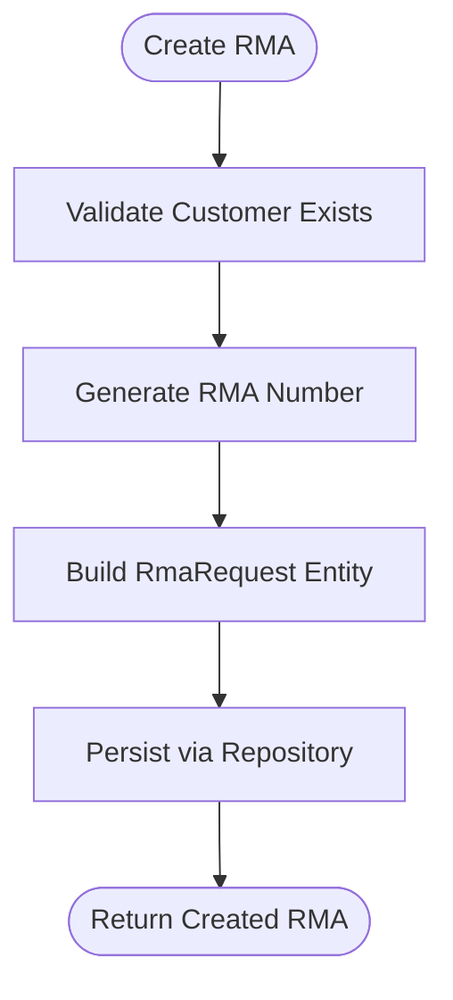

**Diagram sources**
- [rma-requests.service.ts:21-34](file://apps/api/src/rma-requests/rma-requests.service.ts#L21-L34)

Inspection and disposition:
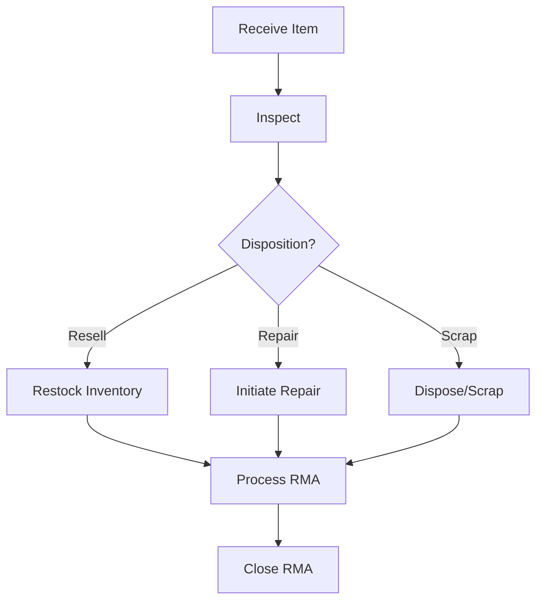

**Diagram sources**
- [rma-requests.controller.ts:42-60](file://apps/api/src/rma-requests/rma-requests.controller.ts#L42-L60)
- [rma-requests.service.ts:67-93](file://apps/api/src/rma-requests/rma-requests.service.ts#L67-L93)

Inventory integration:
- On inspection disposition “Resell,” integrate with inventory to restock items.
- On “Repair,” link to service requests/work orders to track repairs and parts usage.
- On “Scrap,” record disposal transactions and update stock accordingly.

**Section sources**
- [rma-requests.controller.ts:6-66](file://apps/api/src/rma-requests/rma-requests.controller.ts#L6-L66)
- [rma-requests.service.ts:1-102](file://apps/api/src/rma-requests/rma-requests.service.ts#L1-L102)
- [rma-requests dtos.ts:1-35](file://apps/api/src/rma-requests/dtos.ts#L1-L35)

## Dependency Analysis
Coupling and cohesion:
- Each feature is cohesive within its own module (controller + service + DTOs).
- Controllers depend only on their respective services.
- Services depend on repositories (via DI tokens) and external services like Customers and Components.
- Shared enumerations and domain models come from @ananya/service.

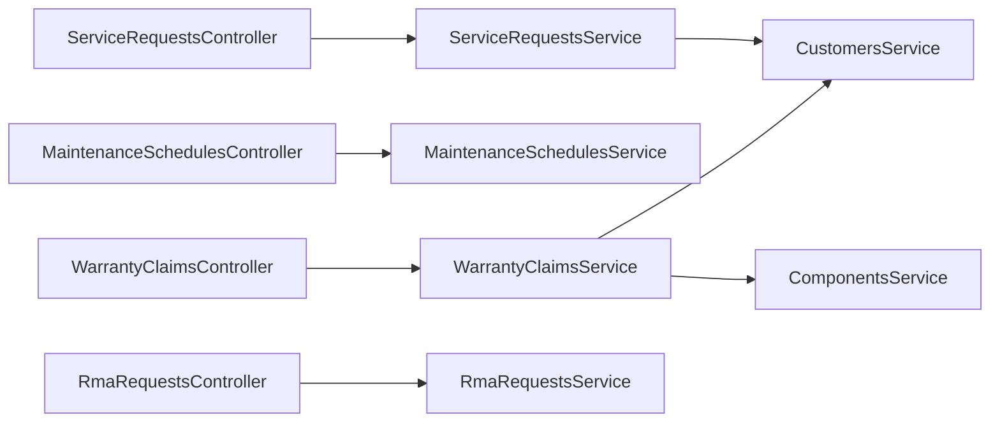

**Diagram sources**
- [service-requests.controller.ts:14-83](file://apps/api/src/service-requests/service-requests.controller.ts#L14-L83)
- [service-requests.service.ts:1-127](file://apps/api/src/service-requests/service-requests.service.ts#L1-L127)
- [maintenance-schedules.controller.ts:6-63](file://apps/api/src/maintenance-schedules/maintenance-schedules.controller.ts#L6-L63)
- [maintenance-schedules.service.ts:1-103](file://apps/api/src/maintenance-schedules/maintenance-schedules.service.ts#L1-L103)
- [warranty-claims.controller.ts:6-49](file://apps/api/src/warranty-claims/warranty-claims.controller.ts#L6-L49)
- [warranty-claims.service.ts:1-84](file://apps/api/src/warranty-claims/warranty-claims.service.ts#L1-L84)
- [rma-requests.controller.ts:6-66](file://apps/api/src/rma-requests/rma-requests.controller.ts#L6-L66)
- [rma-requests.service.ts:1-102](file://apps/api/src/rma-requests/rma-requests.service.ts#L1-L102)

Potential circular dependencies:
- None observed between these modules; they rely on shared packages and well-defined services.

Integration points:
- CustomersService used for existence checks during creation.
- ComponentsService used when validating product references in warranty claims.
- Repositories abstracted behind DI tokens for testability and persistence abstraction.

**Section sources**
- [service-requests.service.ts:1-127](file://apps/api/src/service-requests/service-requests.service.ts#L1-L127)
- [warranty-claims.service.ts:1-84](file://apps/api/src/warranty-claims/warranty-claims.service.ts#L1-L84)

## Performance Considerations
- Use repository-level filtering to minimize data transfer (status, priority, category, customer, technician, search).
- Paginate large result sets where applicable in controllers or downstream consumers.
- Avoid N+1 queries by ensuring repositories batch loads related entities.
- Cache frequent lookups (e.g., customer existence checks) if validated frequently.
- For high-throughput scenarios, consider background jobs for long-running processes (e.g., generating reports, notifications).

[No sources needed since this section provides general guidance]

## Troubleshooting Guide
Common issues and resolutions:
- Not Found errors: Occur when querying by ID without a matching record. Ensure IDs exist before calling update/transition endpoints.
- Validation failures: DTOs enforce required fields; ensure client payloads include all mandatory properties.
- Invalid state transitions: Only valid transitions are allowed by domain methods; verify current status before invoking transitions.
- Missing references: Creating records requires referenced entities (e.g., customer, component); ensure referential integrity.

Operational tips:
- Log repository operations and exceptions for auditability.
- Expose health and readiness endpoints to monitor service availability.
- Use consistent error codes and messages across controllers/services.

**Section sources**
- [service-requests.service.ts:64-70](file://apps/api/src/service-requests/service-requests.service.ts#L64-L70)
- [maintenance-schedules.service.ts:58-66](file://apps/api/src/maintenance-schedules/maintenance-schedules.service.ts#L58-L66)
- [warranty-claims.service.ts:55-61](file://apps/api/src/warranty-claims/warranty-claims.service.ts#L55-L61)
- [rma-requests.service.ts:52-58](file://apps/api/src/rma-requests/rma-requests.service.ts#L52-L58)

## Conclusion
The service and maintenance components provide a robust foundation for managing customer support tickets, scheduled maintenance, warranty claims, and returns. The design emphasizes clear separation of concerns, extensible domain models, and straightforward integration points with other services. By following the customization patterns outlined here, teams can adapt workflows, add new claim types, and scale maintenance planning while maintaining consistency and reliability.

[No sources needed since this section summarizes without analyzing specific files]

## Appendices

### API Reference Summary

- Service Requests
  - POST /service-requests
  - GET /service-requests?status&priority&category&customerId&assignedTechnician&search
  - GET /service-requests/:id
  - POST /service-requests/:id/assign
  - POST /service-requests/:id/diagnose
  - POST /service-requests/:id/waiting-parts
  - POST /service-requests/:id/start-repair
  - POST /service-requests/:id/complete
  - POST /service-requests/:id/close
  - POST /service-requests/:id/cancel

- Maintenance Schedules
  - POST /maintenance-schedules
  - GET /maintenance-schedules?customerId&assignedTechnician&status&frequency&search
  - GET /maintenance-schedules/:id
  - POST /maintenance-schedules/:id/pause
  - POST /maintenance-schedules/:id/resume
  - POST /maintenance-schedules/:id/complete-visit
  - POST /maintenance-schedules/:id/complete-plan
  - POST /maintenance-schedules/:id/cancel

- Warranty Claims
  - POST /warranty-claims
  - GET /warranty-claims?customerId&productId&decision&search
  - GET /warranty-claims/:id
  - POST /warranty-claims/:id/review
  - POST /warranty-claims/:id/approve
  - POST /warranty-claims/:id/reject

- RMA Requests
  - POST /rma-requests
  - GET /rma-requests?customerId&salesOrderId&status&disposition&search
  - GET /rma-requests/:id
  - POST /rma-requests/:id/approve
  - POST /rma-requests/:id/receive
  - POST /rma-requests/:id/inspect
  - POST /rma-requests/:id/process
  - POST /rma-requests/:id/close
  - POST /rma-requests/:id/reject

**Section sources**
- [service-requests.controller.ts:20-82](file://apps/api/src/service-requests/service-requests.controller.ts#L20-L82)
- [maintenance-schedules.controller.ts:12-62](file://apps/api/src/maintenance-schedules/maintenance-schedules.controller.ts#L12-L62)
- [warranty-claims.controller.ts:10-48](file://apps/api/src/warranty-claims/warranty-claims.controller.ts#L10-L48)
- [rma-requests.controller.ts:10-65](file://apps/api/src/rma-requests/rma-requests.controller.ts#L10-L65)