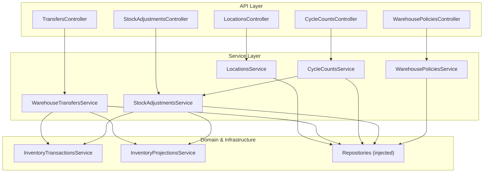
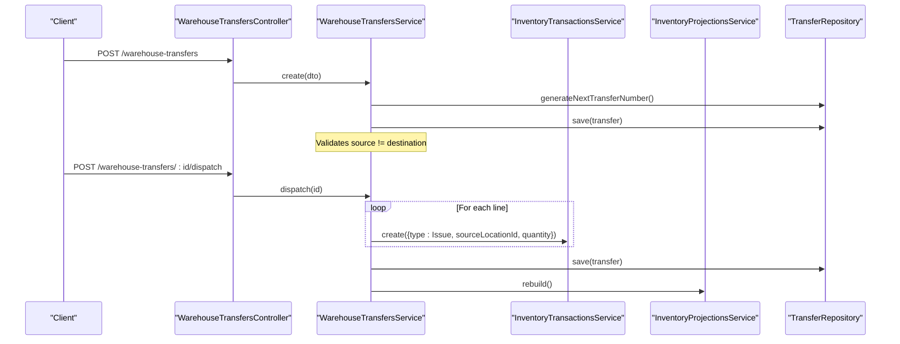
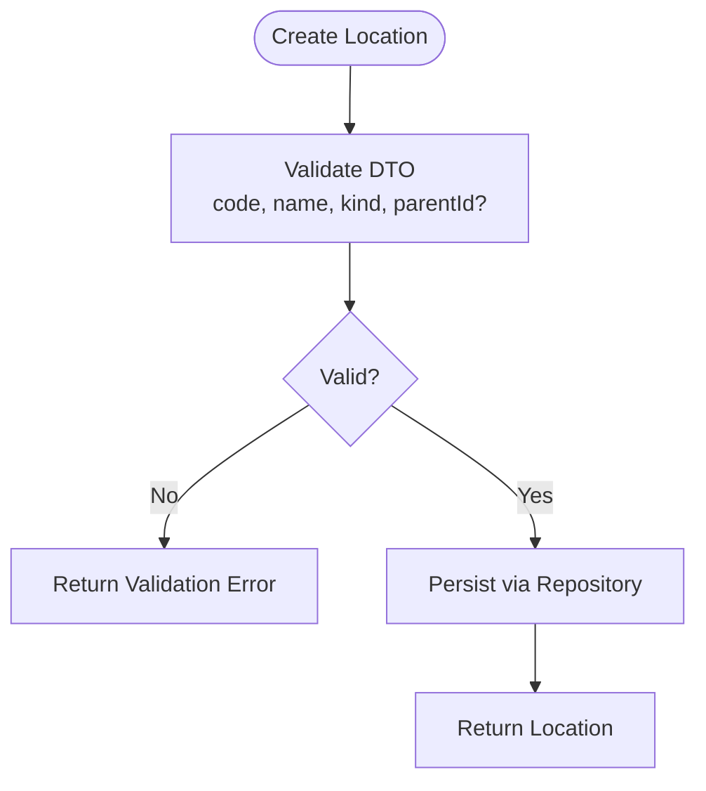
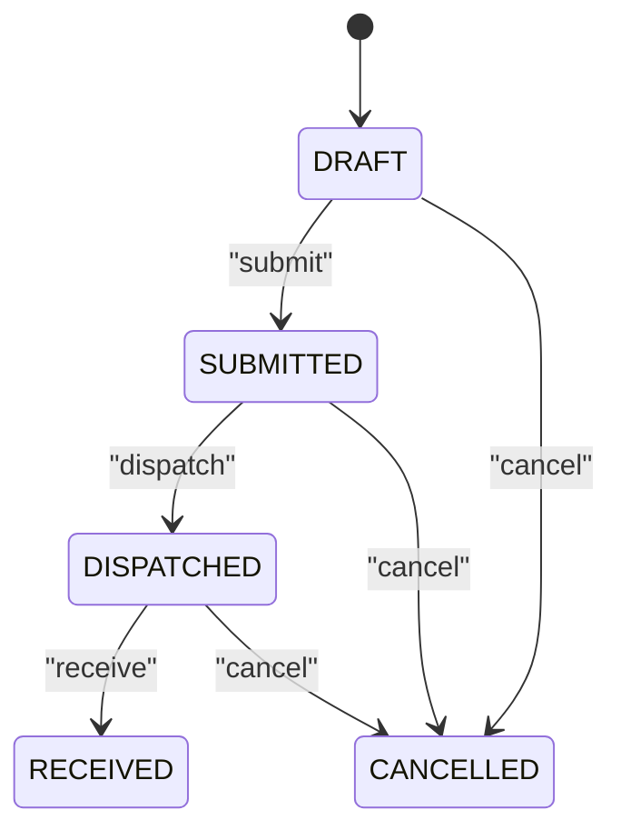
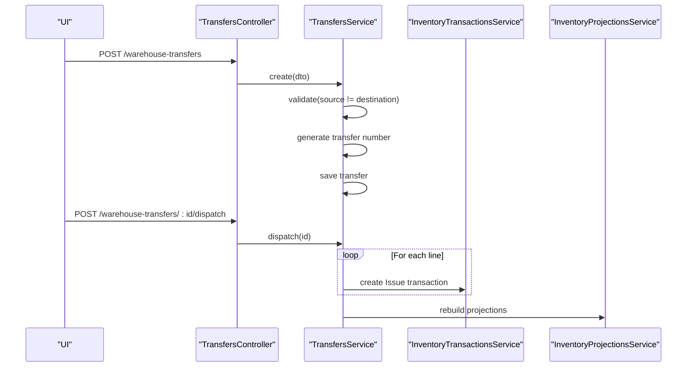
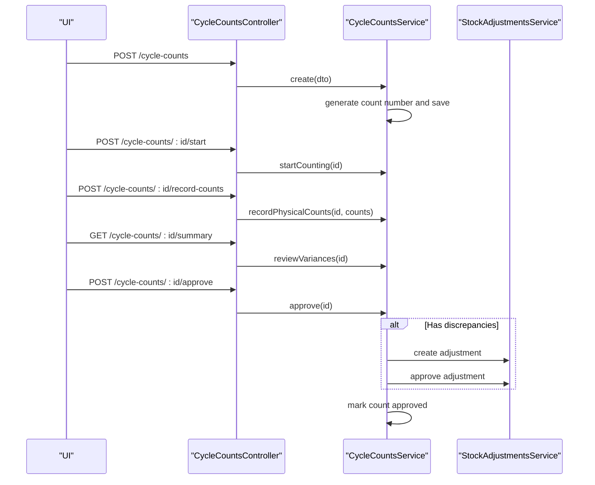
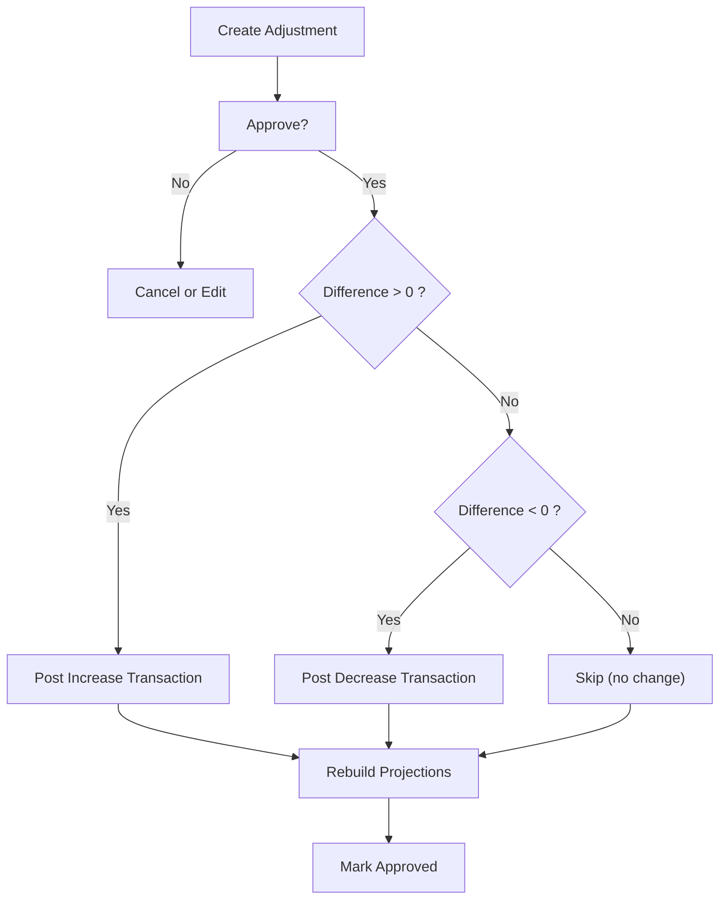
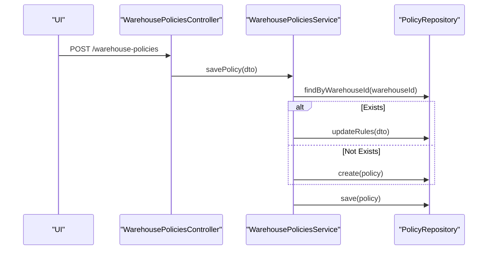
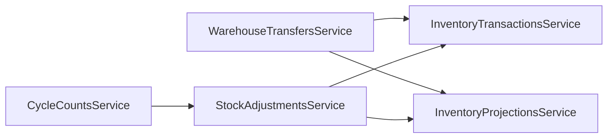

# Warehouse Operations Components

<cite>
**Referenced Files in This Document**
- [locations.controller.ts](file://apps/api/src/locations/locations.controller.ts)
- [locations.service.ts](file://apps/api/src/locations/locations.service.ts)
- [create-location.dto.ts](file://apps/api/src/locations/create-location.dto.ts)
- [warehouse-transfers.controller.ts](file://apps/api/src/warehouse-transfers/warehouse-transfers.controller.ts)
- [warehouse-transfers.service.ts](file://apps/api/src/warehouse-transfers/warehouse-transfers.service.ts)
- [warehouse-transfers dtos.ts](file://apps/api/src/warehouse-transfers/dtos.ts)
- [cycle-counts.controller.ts](file://apps/api/src/cycle-counts/cycle-counts.controller.ts)
- [cycle-counts.service.ts](file://apps/api/src/cycle-counts/cycle-counts.service.ts)
- [cycle-counts dtos.ts](file://apps/api/src/cycle-counts/dtos.ts)
- [stock-adjustments.controller.ts](file://apps/api/src/stock-adjustments/stock-adjustments.controller.ts)
- [stock-adjustments.service.ts](file://apps/api/src/stock-adjustments/stock-adjustments.service.ts)
- [stock-adjustments dtos.ts](file://apps/api/src/stock-adjustments/dtos.ts)
- [warehouse-policies.controller.ts](file://apps/api/src/warehouse-policies/warehouse-policies.controller.ts)
- [warehouse-policies.service.ts](file://apps/api/src/warehouse-policies/warehouse-policies.service.ts)
- [warehouse-policies dtos.ts](file://apps/api/src/warehouse-policies/dtos.ts)
</cite>

## Table of Contents
1. Introduction
2. Project Structure
3. Core Components
4. Architecture Overview
5. Detailed Component Analysis
6. Dependency Analysis
7. Performance Considerations
8. Troubleshooting Guide
9. Conclusion
10. Appendices

## Introduction
This document explains the warehouse operations components that enable location management, inventory transfers, cycle counting, stock adjustments, and warehouse policies. It covers how to define storage areas and bins, move inventory between locations, ensure inventory accuracy through cycle counts, correct stock levels via adjustments, and configure automation rules with policies. It also describes inventory tracking, barcode integration touchpoints, audit trails, and compliance considerations, along with examples for customizing layouts, adding operation types, and implementing automated replenishment rules.

## Project Structure
The warehouse operations are implemented as NestJS controllers and services under apps/api/src, each exposing REST endpoints and orchestrating domain logic. Key modules include:
- Locations: CRUD for hierarchical storage areas and bins
- Warehouse Transfers: Create, submit, dispatch, receive, cancel, and query transfers
- Cycle Counts: Plan, assign counters, record physical counts, review variances, approve, and reconcile
- Stock Adjustments: Create and approve adjustments to post immutable inventory transactions
- Warehouse Policies: Save and retrieve per-warehouse automation rules

**Diagram sources**
- [locations.controller.ts:19-51](file://apps/api/src/locations/locations.controller.ts#L19-L51)
- [warehouse-transfers.controller.ts:21-84](file://apps/api/src/warehouse-transfers/warehouse-transfers.controller.ts#L21-L84)
- [cycle-counts.controller.ts:23-94](file://apps/api/src/cycle-counts/cycle-counts.controller.ts#L23-L94)
- [stock-adjustments.controller.ts:15-49](file://apps/api/src/stock-adjustments/stock-adjustments.controller.ts#L15-L49)
- [warehouse-policies.controller.ts:5-22](file://apps/api/src/warehouse-policies/warehouse-policies.controller.ts#L5-L22)
- [locations.service.ts:14-52](file://apps/api/src/locations/locations.service.ts#L14-L52)
- [warehouse-transfers.service.ts:22-29](file://apps/api/src/warehouse-transfers/warehouse-transfers.service.ts#L22-L29)
- [cycle-counts.service.ts:31-37](file://apps/api/src/cycle-counts/cycle-counts.service.ts#L31-L37)
- [stock-adjustments.service.ts:18-25](file://apps/api/src/stock-adjustments/stock-adjustments.service.ts#L18-L25)
- [warehouse-policies.service.ts:7-12](file://apps/api/src/warehouse-policies/warehouse-policies.service.ts#L7-L12)

**Section sources**
- [locations.controller.ts:19-51](file://apps/api/src/locations/locations.controller.ts#L19-L51)
- [warehouse-transfers.controller.ts:21-84](file://apps/api/src/warehouse-transfers/warehouse-transfers.controller.ts#L21-L84)
- [cycle-counts.controller.ts:23-94](file://apps/api/src/cycle-counts/cycle-counts.controller.ts#L23-L94)
- [stock-adjustments.controller.ts:15-49](file://apps/api/src/stock-adjustments/stock-adjustments.controller.ts#L15-L49)
- [warehouse-policies.controller.ts:5-22](file://apps/api/src/warehouse-policies/warehouse-policies.controller.ts#L5-L22)

## Core Components
- Location Management: Define hierarchical storage areas and bins with code, name, kind, optional parent, and metadata.
- Transfer Processing: Create draft transfers, add lines, submit, dispatch (issue), receive (receipt), cancel, and delete drafts.
- Cycle Counting: Create count plans, assign counters, start counting, record physical quantities, review variances, approve, and auto-reconcile via stock adjustments.
- Stock Adjustments: Create adjustment proposals with reasons and lines; approve to post immutable inventory transactions and rebuild projections.
- Warehouse Policies: Configure per-warehouse rules such as negative inventory allowance, bin capacity enforcement, directed putaway/picking, and default bins for receiving, production, and shipping.

**Section sources**
- [create-location.dto.ts:9-32](file://apps/api/src/locations/create-location.dto.ts#L9-L32)
- [warehouse-transfers.dtos.ts:12-83](file://apps/api/src/warehouse-transfers/dtos.ts#L12-L83)
- [cycle-counts.dtos.ts:12-119](file://apps/api/src/cycle-counts/dtos.ts#L12-L119)
- [stock-adjustments.dtos.ts:12-58](file://apps/api/src/stock-adjustments/dtos.ts#L12-L58)
- [warehouse-policies.dtos.ts:3-35](file://apps/api/src/warehouse-policies/dtos.ts#L3-L35)

## Architecture Overview
Controllers validate inputs using DTOs and delegate to services. Services enforce business rules, coordinate domain entities, and call shared infrastructure services for inventory ledger updates and projection rebuilding. Repositories are injected for persistence.

**Diagram sources**
- [warehouse-transfers.controller.ts:26-69](file://apps/api/src/warehouse-transfers/warehouse-transfers.controller.ts#L26-L69)
- [warehouse-transfers.service.ts:31-168](file://apps/api/src/warehouse-transfers/warehouse-transfers.service.ts#L31-L168)

**Section sources**
- [warehouse-transfers.service.ts:31-168](file://apps/api/src/warehouse-transfers/warehouse-transfers.service.ts#L31-L168)

## Detailed Component Analysis

### Location Management
Purpose:
- Define and manage hierarchical storage areas and bins used across all warehouse operations.

Key behaviors:
- Create, read, update, delete locations
- Enforce required fields and constraints via DTO validation
- Service uses repository to persist and retrieve locations

**Diagram sources**
- [locations.controller.ts:24-31](file://apps/api/src/locations/locations.controller.ts#L24-L31)
- [locations.service.ts:29-43](file://apps/api/src/locations/locations.service.ts#L29-L43)
- [create-location.dto.ts:9-32](file://apps/api/src/locations/create-location.dto.ts#L9-L32)

**Section sources**
- [locations.controller.ts:19-51](file://apps/api/src/locations/locations.controller.ts#L19-L51)
- [locations.service.ts:14-52](file://apps/api/src/locations/locations.service.ts#L14-L52)
- [create-location.dto.ts:9-32](file://apps/api/src/locations/create-location.dto.ts#L9-L32)

### Transfer Processing
Purpose:
- Move inventory between locations with a controlled lifecycle and immutable ledger entries.

Lifecycle:
- Draft -> Submitted -> Dispatched -> Received or Cancelled
- Only DRAFT can be edited or deleted
- Dispatch posts Issue transactions from source; Receive posts Receipt to destination
- Cancel after dispatch posts compensating receipts back to source

**Diagram sources**
- [warehouse-transfers.service.ts:128-229](file://apps/api/src/warehouse-transfers/warehouse-transfers.service.ts#L128-L229)

**Diagram sources**
- [warehouse-transfers.controller.ts:26-69](file://apps/api/src/warehouse-transfers/warehouse-transfers.controller.ts#L26-L69)
- [warehouse-transfers.service.ts:31-168](file://apps/api/src/warehouse-transfers/warehouse-transfers.service.ts#L31-L168)

**Section sources**
- [warehouse-transfers.controller.ts:21-84](file://apps/api/src/warehouse-transfers/warehouse-transfers.controller.ts#L21-L84)
- [warehouse-transfers.service.ts:31-242](file://apps/api/src/warehouse-transfers/warehouse-transfers.service.ts#L31-L242)
- [warehouse-transfers.dtos.ts:12-83](file://apps/api/src/warehouse-transfers/dtos.ts#L12-L83)

### Cycle Counting
Purpose:
- Ensure inventory accuracy by planning counts, recording physical quantities, reviewing variances, and approving to reconcile.

Workflow:
- Create count plan with lines (component, system quantity)
- Assign counter and start counting
- Record counted quantities per line
- Review variances summary
- Approve to generate and automatically approve a stock adjustment for discrepancies

**Diagram sources**
- [cycle-counts.controller.ts:28-84](file://apps/api/src/cycle-counts/cycle-counts.controller.ts#L28-L84)
- [cycle-counts.service.ts:39-193](file://apps/api/src/cycle-counts/cycle-counts.service.ts#L39-L193)

**Section sources**
- [cycle-counts.controller.ts:23-94](file://apps/api/src/cycle-counts/cycle-counts.controller.ts#L23-L94)
- [cycle-counts.service.ts:31-210](file://apps/api/src/cycle-counts/cycle-counts.service.ts#L31-L210)
- [cycle-counts.dtos.ts:12-119](file://apps/api/src/cycle-counts/dtos.ts#L12-L119)

### Stock Adjustments
Purpose:
- Correct stock levels with auditable, approval-gated adjustments that post immutable inventory transactions.

Process:
- Create adjustment with reason and lines (current vs counted quantities)
- Approve to post Adjustment transactions (increase/decrease) and rebuild projections
- Cancel pending adjustments before approval

**Diagram sources**
- [stock-adjustments.service.ts:27-121](file://apps/api/src/stock-adjustments/stock-adjustments.service.ts#L27-L121)

**Section sources**
- [stock-adjustments.controller.ts:15-49](file://apps/api/src/stock-adjustments/stock-adjustments.controller.ts#L15-L49)
- [stock-adjustments.service.ts:18-136](file://apps/api/src/stock-adjustments/stock-adjustments.service.ts#L18-L136)
- [stock-adjustments.dtos.ts:12-58](file://apps/api/src/stock-adjustments/dtos.ts#L12-L58)

### Warehouse Policies
Purpose:
- Configure per-warehouse automation rules that influence putaway, picking, capacity enforcement, and default bin assignments.

Capabilities:
- Save policy (create or update)
- Retrieve all policies or by warehouse
- Policy fields control behavior like directed putaway/picking, negative inventory allowance, and default bins for receiving, production, and shipping

**Diagram sources**
- [warehouse-policies.controller.ts:9-22](file://apps/api/src/warehouse-policies/warehouse-policies.controller.ts#L9-L22)
- [warehouse-policies.service.ts:14-22](file://apps/api/src/warehouse-policies/warehouse-policies.service.ts#L14-L22)

**Section sources**
- [warehouse-policies.controller.ts:5-22](file://apps/api/src/warehouse-policies/warehouse-policies.controller.ts#L5-L22)
- [warehouse-policies.service.ts:7-39](file://apps/api/src/warehouse-policies/warehouse-policies.service.ts#L7-L39)
- [warehouse-policies.dtos.ts:3-35](file://apps/api/src/warehouse-policies/dtos.ts#L3-L35)

## Dependency Analysis
- Controllers depend on services for business logic and use DTOs for input validation.
- Services depend on repositories (injected) for persistence and on shared services for inventory ledger and projections.
- Cross-component dependencies:
  - CycleCountsService calls StockAdjustmentsService to reconcile discrepancies.
  - WarehouseTransfersService and StockAdjustmentsService both call InventoryTransactionsService and InventoryProjectionsService.

**Diagram sources**
- [cycle-counts.service.ts:31-37](file://apps/api/src/cycle-counts/cycle-counts.service.ts#L31-L37)
- [stock-adjustments.service.ts:18-25](file://apps/api/src/stock-adjustments/stock-adjustments.service.ts#L18-L25)
- [warehouse-transfers.service.ts:22-29](file://apps/api/src/warehouse-transfers/warehouse-transfers.service.ts#L22-L29)

**Section sources**
- [cycle-counts.service.ts:31-37](file://apps/api/src/cycle-counts/cycle-counts.service.ts#L31-L37)
- [stock-adjustments.service.ts:18-25](file://apps/api/src/stock-adjustments/stock-adjustments.service.ts#L18-L25)
- [warehouse-transfers.service.ts:22-29](file://apps/api/src/warehouse-transfers/warehouse-transfers.service.ts#L22-L29)

## Performance Considerations
- Batch operations: When creating transfers or adjustments with many lines, consider batching repository saves where supported to reduce round-trips.
- Projection rebuilds: Rebuilding inventory projections is triggered after significant changes (e.g., dispatch/receive, approvals). Schedule or throttle rebuilds if high volume is expected.
- Query filters: Use controller query parameters (location, status, search) to limit result sets and improve list performance.
- Validation overhead: DTO validations run per request; keep payloads minimal and reuse validated structures on the client side when possible.

[No sources needed since this section provides general guidance]

## Troubleshooting Guide
Common errors and resolutions:
- Source equals destination in transfers: The service rejects identical source and destination locations during create/update.
- Editing non-draft documents: Transfers and cycle counts cannot be edited once they leave DRAFT status.
- Invalid state transitions: Dispatch requires SUBMITTED/DRAFT and at least one line; receive requires DISPATCHED/SUBMITTED; cancellation not allowed from RECEIVED/CANCELLED states.
- Approval gating: Stock adjustments must be PENDING to approve; cycle counts must be completed and reviewed before approval.
- Not found errors: Requests for non-existent IDs return not found exceptions in services.

Operational tips:
- Always verify statuses before calling state-changing endpoints.
- Use summary and find endpoints to inspect current state and filter results.
- Check audit trails via inventory transactions created by approvals and transfers for traceability.

**Section sources**
- [warehouse-transfers.service.ts:55-92](file://apps/api/src/warehouse-transfers/warehouse-transfers.service.ts#L55-L92)
- [warehouse-transfers.service.ts:128-229](file://apps/api/src/warehouse-transfers/warehouse-transfers.service.ts#L128-L229)
- [cycle-counts.service.ts:57-81](file://apps/api/src/cycle-counts/cycle-counts.service.ts#L57-L81)
- [cycle-counts.service.ts:156-193](file://apps/api/src/cycle-counts/cycle-counts.service.ts#L156-L193)
- [stock-adjustments.service.ts:70-121](file://apps/api/src/stock-adjustments/stock-adjustments.service.ts#L70-L121)

## Conclusion
The warehouse operations module provides a robust, auditable foundation for managing locations, moving inventory, ensuring accuracy through cycle counts, correcting stock levels with approvals, and configuring automation policies. By leveraging DTO-driven validation, strict state machines, and immutable inventory transactions, the system supports compliance and traceability while enabling flexible customization of warehouse layouts and workflows.

[No sources needed since this section summarizes without analyzing specific files]

## Appendices

### Examples and Customization

- Customize warehouse layouts:
  - Define hierarchical locations with codes, names, kinds, and parent references to model aisles, racks, shelves, and bins.
  - Use metadata fields to store zone-specific attributes (temperature, hazard class, etc.).
  - Reference: [create-location.dto.ts:9-32](file://apps/api/src/locations/create-location.dto.ts#L9-L32)

- Add new operation types:
  - Introduce new transfer or adjustment types by extending DTOs and updating services to handle additional transaction types or reasons.
  - Ensure state machines allow transitions for new statuses if needed.
  - Reference: [warehouse-transfers.dtos.ts:12-83](file://apps/api/src/warehouse-transfers/dtos.ts#L12-L83), [stock-adjustments.dtos.ts:12-58](file://apps/api/src/stock-adjustments/dtos.ts#L12-L58)

- Implement automated replenishment rules:
  - Configure warehouse policies to enable directed putaway/picking and set default bins for receiving, production, and shipping.
  - Combine with cycle counts and stock adjustments to maintain target levels and trigger downstream procurement or production.
  - Reference: [warehouse-policies.dtos.ts:3-35](file://apps/api/src/warehouse-policies/dtos.ts#L3-L35)

- Barcode integration:
  - Use component identifiers and location codes in forms and scans to drive transfers, counts, and adjustments.
  - Ensure scanned values map to valid componentId and locationId fields in DTOs.
  - Reference: [warehouse-transfers.dtos.ts:12-28](file://apps/api/src/warehouse-transfers/dtos.ts#L12-L28), [cycle-counts.dtos.ts:12-33](file://apps/api/src/cycle-counts/dtos.ts#L12-L33), [stock-adjustments.dtos.ts:12-28](file://apps/api/src/stock-adjustments/dtos.ts#L12-L28)

- Audit trails and compliance:
  - All approvals and operational changes produce immutable inventory transactions with reference numbers and reasons.
  - Use these records for reconciliation, audits, and compliance reporting.
  - Reference: [warehouse-transfers.service.ts:150-168](file://apps/api/src/warehouse-transfers/warehouse-transfers.service.ts#L150-L168), [stock-adjustments.service.ts:83-118](file://apps/api/src/stock-adjustments/stock-adjustments.service.ts#L83-L118)

**Section sources**
- [create-location.dto.ts:9-32](file://apps/api/src/locations/create-location.dto.ts#L9-L32)
- [warehouse-transfers.dtos.ts:12-83](file://apps/api/src/warehouse-transfers/dtos.ts#L12-L83)
- [stock-adjustments.dtos.ts:12-58](file://apps/api/src/stock-adjustments/dtos.ts#L12-L58)
- [warehouse-policies.dtos.ts:3-35](file://apps/api/src/warehouse-policies/dtos.ts#L3-L35)
- [warehouse-transfers.service.ts:150-168](file://apps/api/src/warehouse-transfers/warehouse-transfers.service.ts#L150-L168)
- [stock-adjustments.service.ts:83-118](file://apps/api/src/stock-adjustments/stock-adjustments.service.ts#L83-L118)