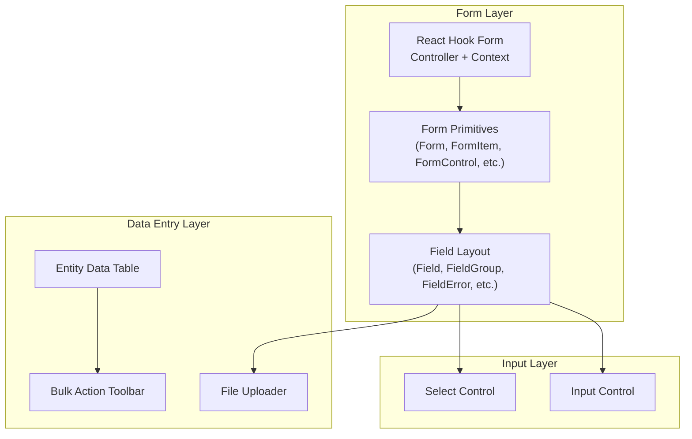
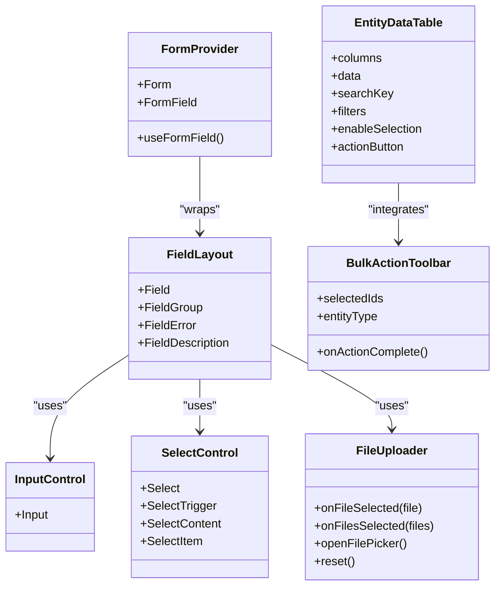
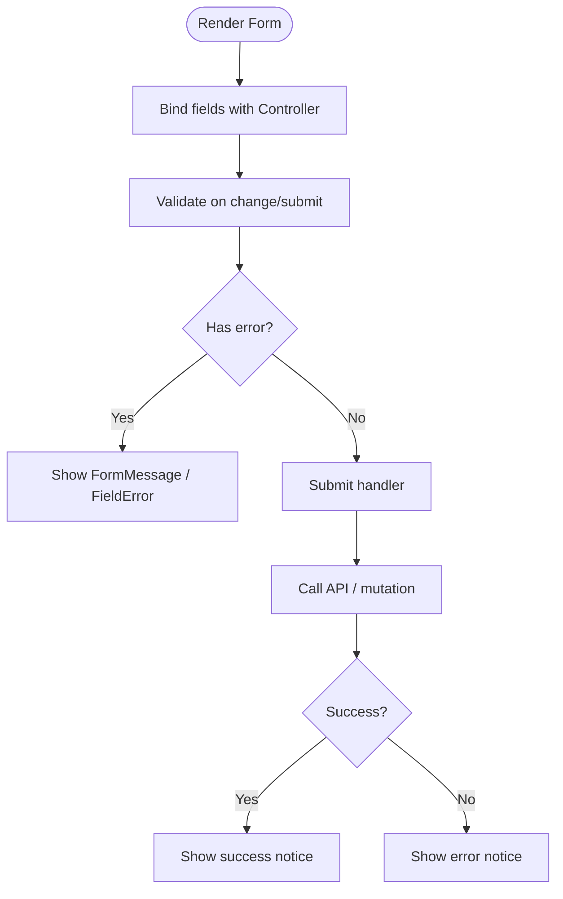
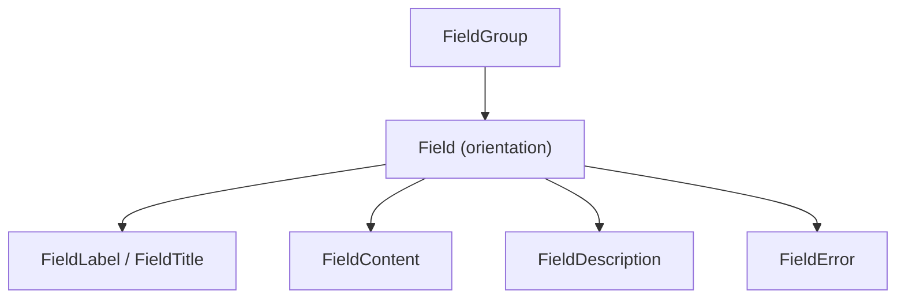
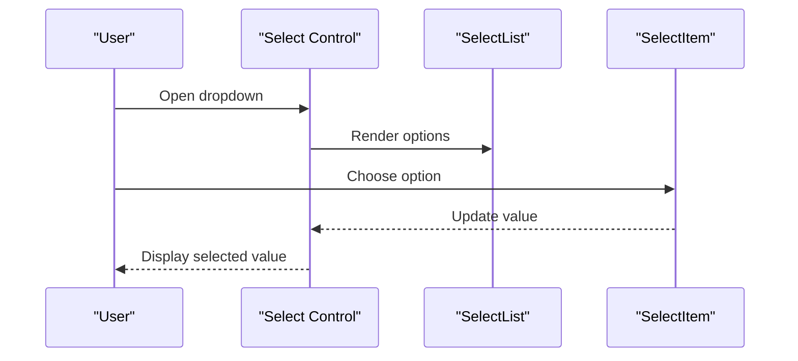
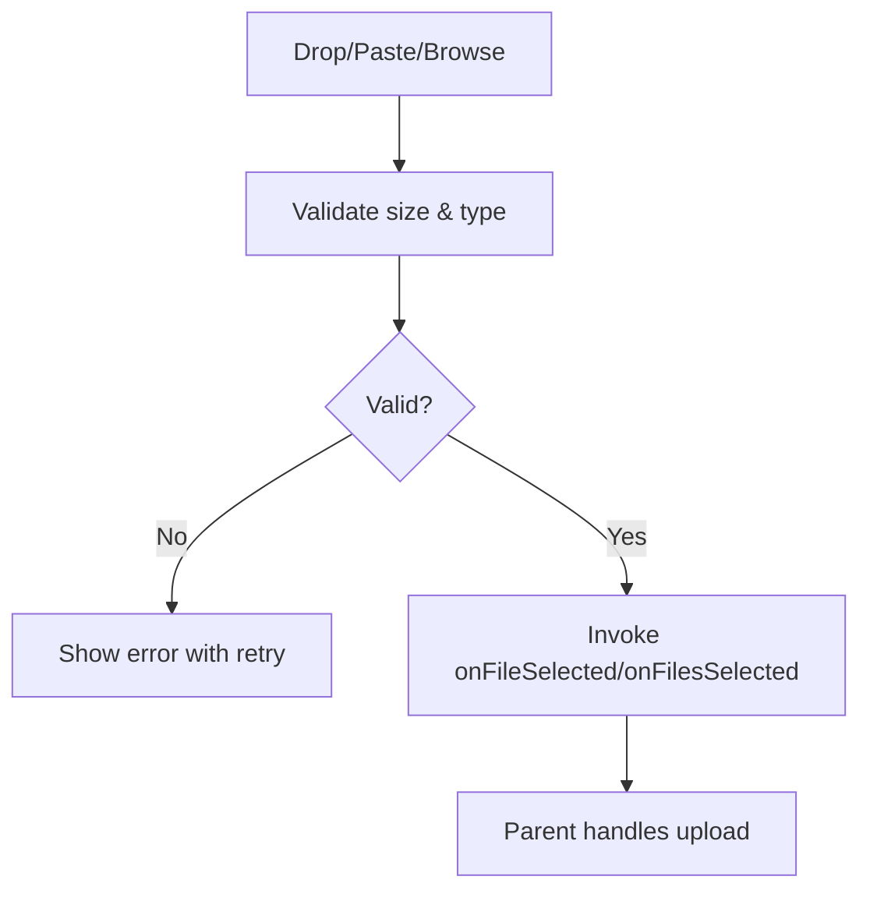
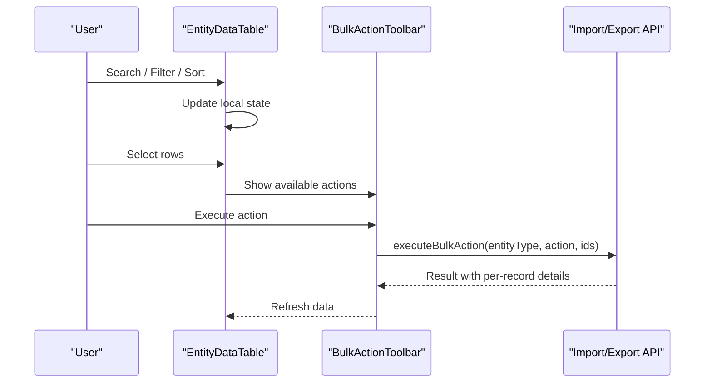
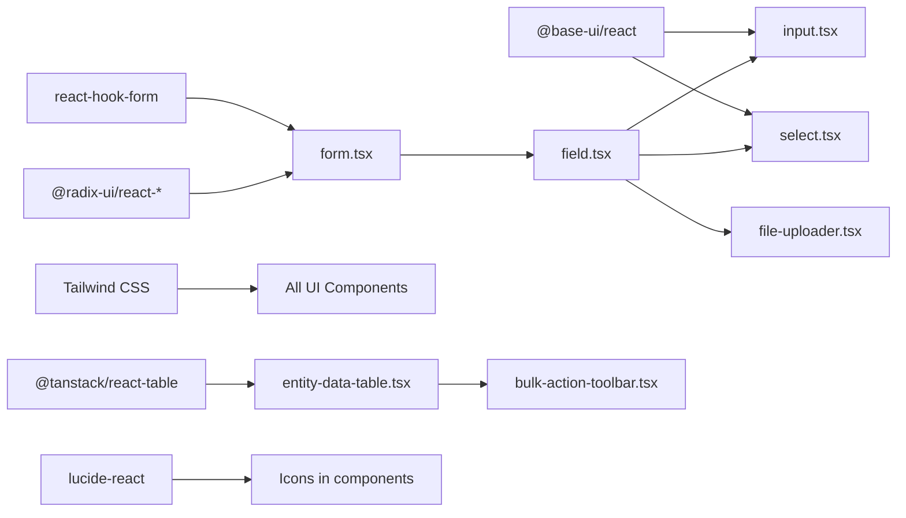

# Forms & Data Entry

<cite>
**Referenced Files in This Document**
- [form.tsx](file://apps/web/components/ui/form.tsx)
- [field.tsx](file://apps/web/components/ui/field.tsx)
- [input.tsx](file://apps/web/components/ui/input.tsx)
- [select.tsx](file://apps/web/components/ui/select.tsx)
- [file-uploader.tsx](file://apps/web/components/ui/file-uploader.tsx)
- [entity-data-table.tsx](file://apps/web/components/ui/entity-data-table.tsx)
- [bulk-action-toolbar.tsx](file://apps/web/components/ui/bulk-action-toolbar.tsx)
</cite>

## Table of Contents
1. [Introduction](#introduction)
2. [Project Structure](#project-structure)
3. [Core Components](#core-components)
4. [Architecture Overview](#architecture-overview)
5. [Detailed Component Analysis](#detailed-component-analysis)
6. [Dependency Analysis](#dependency-analysis)
7. [Performance Considerations](#performance-considerations)
8. [Troubleshooting Guide](#troubleshooting-guide)
9. [Conclusion](#conclusion)

## Introduction
This document explains how Ananya ERP handles forms and data entry on the web client. It focuses on the form architecture built with React Hook Form, validation strategies, error handling, and reusable UI primitives. It also covers complex scenarios such as conditional fields, dynamic sections, multi-step workflows, file uploads, data tables with inline editing, and bulk operations. Accessibility, mobile-friendly input patterns, and performance optimization are addressed throughout.

## Project Structure
The form system is centered around a small set of shared UI components under apps/web/components/ui:
- A React Hook Form wrapper that provides accessible form primitives.
- Field layout primitives for grouping, labeling, descriptions, and errors.
- Base input and select controls.
- A file uploader component for drag-and-drop and paste-based uploads.
- A feature-rich data table with search, filters, pagination, selection, import/export, and batch actions.
- A floating toolbar for bulk operations with per-record outcomes.

**Diagram sources**
- [form.tsx:1-169](file://apps/web/components/ui/form.tsx#L1-L169)
- [field.tsx:1-239](file://apps/web/components/ui/field.tsx#L1-L239)
- [input.tsx:1-21](file://apps/web/components/ui/input.tsx#L1-L21)
- [select.tsx:1-221](file://apps/web/components/ui/select.tsx#L1-L221)
- [file-uploader.tsx:1-333](file://apps/web/components/ui/file-uploader.tsx#L1-L333)
- [entity-data-table.tsx:1-800](file://apps/web/components/ui/entity-data-table.tsx#L1-L800)
- [bulk-action-toolbar.tsx:1-405](file://apps/web/components/ui/bulk-action-toolbar.tsx#L1-L405)

**Section sources**
- [form.tsx:1-169](file://apps/web/components/ui/form.tsx#L1-L169)
- [field.tsx:1-239](file://apps/web/components/ui/field.tsx#L1-L239)
- [input.tsx:1-21](file://apps/web/components/ui/input.tsx#L1-L21)
- [select.tsx:1-221](file://apps/web/components/ui/select.tsx#L1-L221)
- [file-uploader.tsx:1-333](file://apps/web/components/ui/file-uploader.tsx#L1-L333)
- [entity-data-table.tsx:1-800](file://apps/web/components/ui/entity-data-table.tsx#L1-L800)
- [bulk-action-toolbar.tsx:1-405](file://apps/web/components/ui/bulk-action-toolbar.tsx#L1-L405)

## Core Components
- React Hook Form integration: The form layer wraps React Hook Form’s Controller and context to provide accessible, styled form building blocks. It exposes Form, FormItem, FormLabel, FormControl, FormDescription, FormMessage, and useFormField.
- Field layout primitives: Field, FieldGroup, FieldLegend, FieldSet, FieldContent, FieldLabel, FieldTitle, FieldDescription, FieldSeparator, and FieldError provide consistent structure, responsive orientation, and accessible error presentation.
- Input and Select: Lightweight wrappers around base-ui primitives with consistent styling, focus states, and accessibility attributes.
- File Uploader: Drag-and-drop, paste, and browse upload with size/type validation and user feedback.
- Entity Data Table: Search, column filters, sorting, pagination, row selection, import/export dialogs, and a floating bulk action toolbar.
- Bulk Action Toolbar: Per-entity supported actions, execution flow, and detailed per-record results.

**Section sources**
- [form.tsx:1-169](file://apps/web/components/ui/form.tsx#L1-L169)
- [field.tsx:1-239](file://apps/web/components/ui/field.tsx#L1-L239)
- [input.tsx:1-21](file://apps/web/components/ui/input.tsx#L1-L21)
- [select.tsx:1-221](file://apps/web/components/ui/select.tsx#L1-L221)
- [file-uploader.tsx:1-333](file://apps/web/components/ui/file-uploader.tsx#L1-L333)
- [entity-data-table.tsx:1-800](file://apps/web/components/ui/entity-data-table.tsx#L1-L800)
- [bulk-action-toolbar.tsx:1-405](file://apps/web/components/ui/bulk-action-toolbar.tsx#L1-L405)

## Architecture Overview
The form architecture separates concerns into three layers:
- Form orchestration (React Hook Form + context)
- Field composition (layout, labels, descriptions, errors)
- Data entry widgets (inputs, selects, file uploader, data table, bulk toolbar)

**Diagram sources**
- [form.tsx:1-169](file://apps/web/components/ui/form.tsx#L1-L169)
- [field.tsx:1-239](file://apps/web/components/ui/field.tsx#L1-L239)
- [input.tsx:1-21](file://apps/web/components/ui/input.tsx#L1-L21)
- [select.tsx:1-221](file://apps/web/components/ui/select.tsx#L1-L221)
- [file-uploader.tsx:1-333](file://apps/web/components/ui/file-uploader.tsx#L1-L333)
- [entity-data-table.tsx:1-800](file://apps/web/components/ui/entity-data-table.tsx#L1-L800)
- [bulk-action-toolbar.tsx:1-405](file://apps/web/components/ui/bulk-action-toolbar.tsx#L1-L405)

## Detailed Component Analysis

### React Hook Form Integration and Validation Strategy
- The form layer uses React Hook Form’s Controller and context to bind inputs to form state.
- Accessible associations between label, control, description, and message are established via generated IDs and aria-describedby.
- Error display is centralized through FormMessage and FieldError, supporting single or multiple messages.

**Diagram sources**
- [form.tsx:1-169](file://apps/web/components/ui/form.tsx#L1-L169)
- [field.tsx:1-239](file://apps/web/components/ui/field.tsx#L1-L239)

**Section sources**
- [form.tsx:1-169](file://apps/web/components/ui/form.tsx#L1-L169)
- [field.tsx:1-239](file://apps/web/components/ui/field.tsx#L1-L239)

### Field Layout and Accessibility
- FieldGroup and Field provide responsive orientation variants (vertical, horizontal, responsive).
- FieldError renders either a single message or a list of unique messages with role="alert".
- Labels and descriptions are consistently structured; FieldSeparator aids visual grouping.

**Diagram sources**
- [field.tsx:1-239](file://apps/web/components/ui/field.tsx#L1-L239)

**Section sources**
- [field.tsx:1-239](file://apps/web/components/ui/field.tsx#L1-L239)

### Input and Select Controls
- Input is a thin wrapper over base-ui with consistent focus, disabled, and invalid states.
- Select supports grouped items, custom value rendering, scroll buttons, and keyboard navigation.

**Diagram sources**
- [input.tsx:1-21](file://apps/web/components/ui/input.tsx#L1-L21)
- [select.tsx:1-221](file://apps/web/components/ui/select.tsx#L1-L221)

**Section sources**
- [input.tsx:1-21](file://apps/web/components/ui/input.tsx#L1-L21)
- [select.tsx:1-221](file://apps/web/components/ui/select.tsx#L1-L221)

### File Uploads
- Supports drag-and-drop, paste, and file picker interactions.
- Validates file size and MIME/type against accept patterns.
- Exposes imperative methods openFilePicker and reset.
- Provides clear error messaging and retry UX.

**Diagram sources**
- [file-uploader.tsx:1-333](file://apps/web/components/ui/file-uploader.tsx#L1-L333)

**Section sources**
- [file-uploader.tsx:1-333](file://apps/web/components/ui/file-uploader.tsx#L1-L333)

### Data Tables with Inline Editing and Bulk Operations
- Built on TanStack Table with search, column filters, sorting, pagination, and row selection.
- Integrates ImportWizard and ExportDialog for bulk data operations.
- Renders a sticky toolbar with notices, search, filters, and action buttons.
- Provides a floating BulkActionToolbar for batch operations with per-record outcomes.

**Diagram sources**
- [entity-data-table.tsx:1-800](file://apps/web/components/ui/entity-data-table.tsx#L1-L800)
- [bulk-action-toolbar.tsx:1-405](file://apps/web/components/ui/bulk-action-toolbar.tsx#L1-L405)

**Section sources**
- [entity-data-table.tsx:1-800](file://apps/web/components/ui/entity-data-table.tsx#L1-L800)
- [bulk-action-toolbar.tsx:1-405](file://apps/web/components/ui/bulk-action-toolbar.tsx#L1-L405)

### Complex Form Scenarios

#### Conditional Fields
- Use React Hook Form’s watch or useFormState to conditionally render fields based on other values.
- Combine with FieldGroup and FieldError to maintain consistent layout and validation feedback.

#### Dynamic Sections
- Maintain an array of records using React Hook Form’s array path helpers.
- Provide add/remove controls within FieldGroup; validate each item individually.

#### Multi-Step Workflows
- Split forms across steps by mounting/unmounting field groups or using tabs/drawers.
- Persist partial state with React Hook Form’s defaultValues and controlled updates.

[No sources needed since this section describes general patterns without analyzing specific files]

### Mobile-Friendly Input Patterns
- Prefer vertical orientation by default; switch to responsive or horizontal where appropriate.
- Use native input types (email, tel, number) to trigger correct keyboards.
- Keep touch targets large enough; avoid overly dense layouts.
- For selects, prefer searchable options when lists are long.

[No sources needed since this section provides general guidance]

## Dependency Analysis
The following diagram shows how the core form and data entry components depend on each other and external libraries.

**Diagram sources**
- [form.tsx:1-169](file://apps/web/components/ui/form.tsx#L1-L169)
- [field.tsx:1-239](file://apps/web/components/ui/field.tsx#L1-L239)
- [input.tsx:1-21](file://apps/web/components/ui/input.tsx#L1-L21)
- [select.tsx:1-221](file://apps/web/components/ui/select.tsx#L1-L221)
- [file-uploader.tsx:1-333](file://apps/web/components/ui/file-uploader.tsx#L1-L333)
- [entity-data-table.tsx:1-800](file://apps/web/components/ui/entity-data-table.tsx#L1-L800)
- [bulk-action-toolbar.tsx:1-405](file://apps/web/components/ui/bulk-action-toolbar.tsx#L1-L405)

**Section sources**
- [form.tsx:1-169](file://apps/web/components/ui/form.tsx#L1-L169)
- [field.tsx:1-239](file://apps/web/components/ui/field.tsx#L1-L239)
- [input.tsx:1-21](file://apps/web/components/ui/input.tsx#L1-L21)
- [select.tsx:1-221](file://apps/web/components/ui/select.tsx#L1-L221)
- [file-uploader.tsx:1-333](file://apps/web/components/ui/file-uploader.tsx#L1-L333)
- [entity-data-table.tsx:1-800](file://apps/web/components/ui/entity-data-table.tsx#L1-L800)
- [bulk-action-toolbar.tsx:1-405](file://apps/web/components/ui/bulk-action-toolbar.tsx#L1-L405)

## Performance Considerations
- Minimize re-renders:
  - Wrap heavy computations in useMemo/useCallback.
  - Avoid unnecessary prop changes in form fields; memoize derived values.
- Defer expensive validations:
  - Use onChange debouncing for text inputs.
  - Run async validations only after required synchronous checks pass.
- Optimize data tables:
  - Use server-side pagination/sorting/filtering when datasets are large.
  - Limit visible columns and avoid heavy cell renderers.
  - Reuse column definitions and memoize computed columns.
- File uploads:
  - Validate size/type before processing.
  - Stream or chunk large files if supported by the backend.
- Accessibility:
  - Ensure aria attributes are present for interactive elements.
  - Announce errors and successes via live regions or status updates.

[No sources needed since this section provides general guidance]

## Troubleshooting Guide
- Form validation not showing:
  - Verify fields are wrapped with Controller and connected to the form context.
  - Check that FormMessage or FieldError is rendered for the field.
- Errors not clearing:
  - Ensure reset or setValue clears both value and error state.
- Select not updating:
  - Confirm value binding and onChange handlers are wired correctly.
- File upload errors:
  - Check accept patterns and maxSizeBytes configuration.
  - Review error messages from the uploader and parent upload logic.
- Bulk actions failing:
  - Verify entityType is provided and supported by the backend.
  - Inspect per-record result details in the bulk toolbar outcome panel.

**Section sources**
- [form.tsx:1-169](file://apps/web/components/ui/form.tsx#L1-L169)
- [field.tsx:1-239](file://apps/web/components/ui/field.tsx#L1-L239)
- [file-uploader.tsx:1-333](file://apps/web/components/ui/file-uploader.tsx#L1-L333)
- [bulk-action-toolbar.tsx:1-405](file://apps/web/components/ui/bulk-action-toolbar.tsx#L1-L405)

## Conclusion
Ananya ERP’s form and data entry system combines React Hook Form with a cohesive set of accessible UI primitives. The architecture cleanly separates form orchestration, field layout, and data entry widgets, enabling consistent validation, error handling, and accessibility. The data table and bulk action toolbar provide powerful tools for managing large datasets and performing batch operations. By following the patterns outlined here—conditional fields, dynamic sections, multi-step flows, robust file uploads, and optimized table usage—you can build reliable, performant, and accessible data entry experiences across the application.