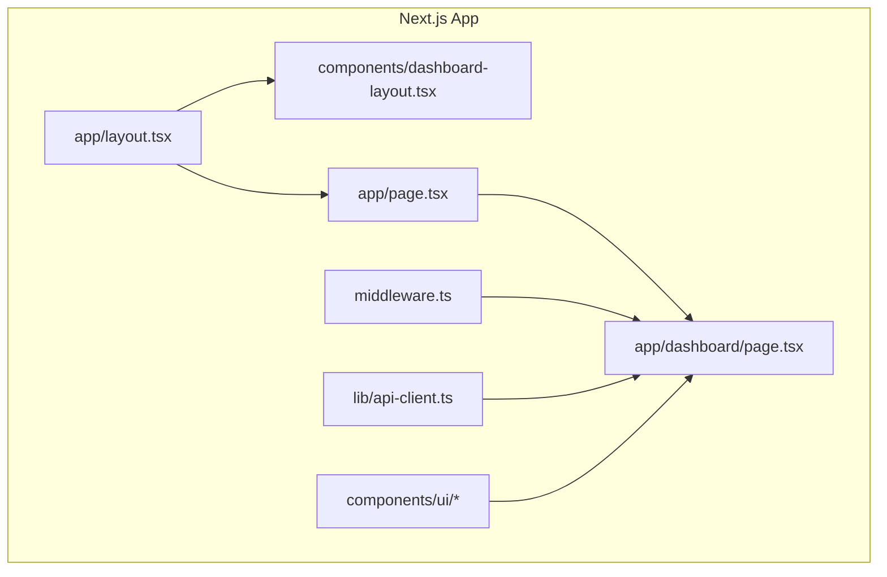
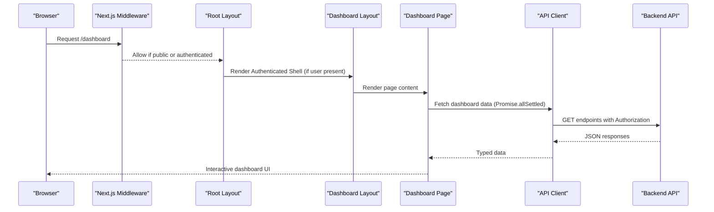
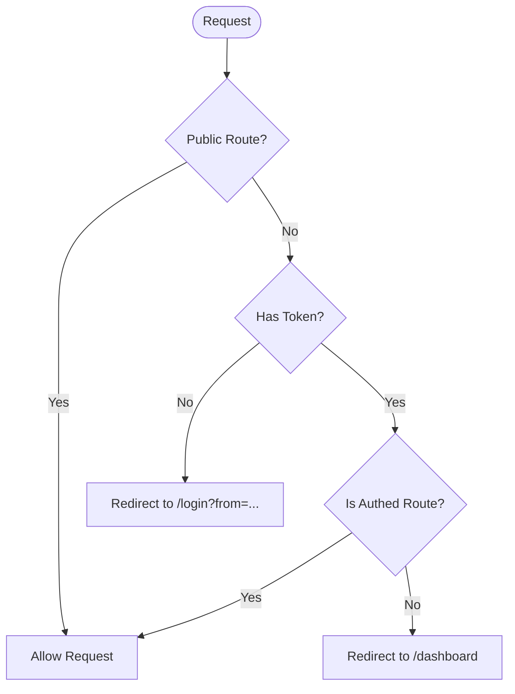
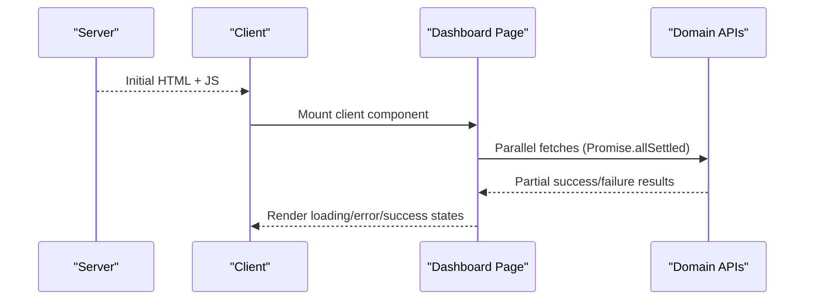
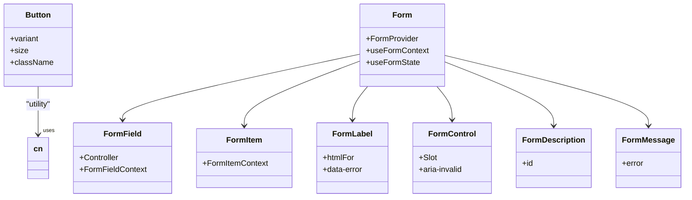
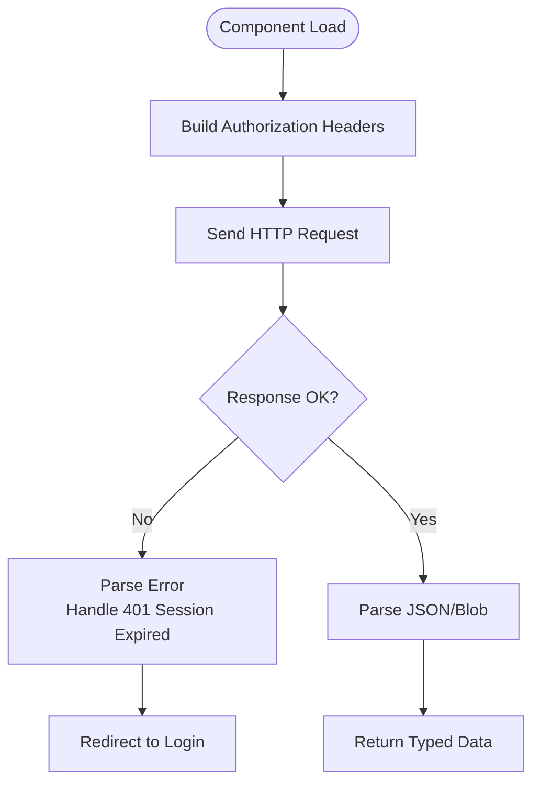
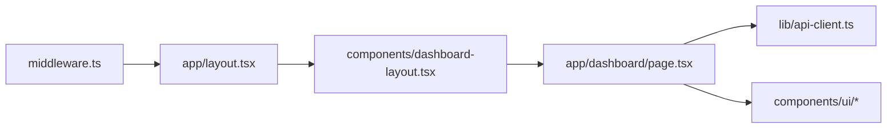

# Frontend Development

<cite>
**Referenced Files in This Document**
- [next.config.mjs](file://apps/web/next.config.mjs)
- [layout.tsx](file://apps/web/app/layout.tsx)
- [page.tsx](file://apps/web/app/page.tsx)
- [dashboard/page.tsx](file://apps/web/app/dashboard/page.tsx)
- [components.json](file://apps/web/components.json)
- [button.tsx](file://apps/web/components/ui/button.tsx)
- [form.tsx](file://apps/web/components/ui/form.tsx)
- [api-client.ts](file://apps/web/lib/api-client.ts)
- [middleware.ts](file://apps/web/middleware.ts)
- [dashboard-layout.tsx](file://apps/web/components/dashboard-layout.tsx)
</cite>

## Table of Contents
1. [Introduction](#introduction)
2. [Project Structure](#project-structure)
3. [Core Components](#core-components)
4. [Architecture Overview](#architecture-overview)
5. [Detailed Component Analysis](#detailed-component-analysis)
6. [Dependency Analysis](#dependency-analysis)
7. [Performance Considerations](#performance-considerations)
8. [Troubleshooting Guide](#troubleshooting-guide)
9. [Conclusion](#conclusion)
10. [Appendices](#appendices)

## Introduction
This document provides comprehensive frontend development guidance for Ananya ERP’s Next.js application. It covers the App Router structure, server-side rendering approach, client-side interactions, component library built with shadcn/ui, form handling patterns, data fetching strategies, responsive design, accessibility, performance optimization, testing, debugging, and code quality standards. The goal is to help developers create new pages, implement business logic, and integrate with the API confidently while maintaining a consistent UI and high-quality codebase.

## Project Structure
The frontend lives under apps/web and follows the Next.js App Router conventions:
- app directory defines routes and layouts.
- components/ui contains the shadcn/ui-based component library.
- lib holds shared utilities, API clients, and domain-specific modules.
- middleware handles route protection and redirects.
- next.config.mjs configures build output, image behavior, and service worker headers.

**Diagram sources**
- [layout.tsx:1-63](file://apps/web/app/layout.tsx#L1-L63)
- [page.tsx:1-6](file://apps/web/app/page.tsx#L1-L6)
- [dashboard/page.tsx:1-492](file://apps/web/app/dashboard/page.tsx#L1-L492)
- [middleware.ts:1-55](file://apps/web/middleware.ts#L1-L55)
- [api-client.ts:1-295](file://apps/web/lib/api-client.ts#L1-L295)
- [dashboard-layout.tsx:1-131](file://apps/web/components/dashboard-layout.tsx#L1-L131)

**Section sources**
- [next.config.mjs:1-30](file://apps/web/next.config.mjs#L1-L30)
- [layout.tsx:1-63](file://apps/web/app/layout.tsx#L1-L63)
- [page.tsx:1-6](file://apps/web/app/page.tsx#L1-L6)
- [dashboard/page.tsx:1-492](file://apps/web/app/dashboard/page.tsx#L1-L492)
- [middleware.ts:1-55](file://apps/web/middleware.ts#L1-L55)

## Core Components
- Root layout sets metadata, viewport, theme provider, auth provider, dashboard shell, and PWA registration.
- Dashboard layout renders authenticated shell or public surface based on route and authentication state.
- Button and Form are core UI primitives from the shadcn/ui-based library.
- API client centralizes HTTP requests, token management, error handling, and session expiration flows.

Key responsibilities:
- Layouts orchestrate providers and navigation chrome.
- UI components provide accessible, themed building blocks.
- API client abstracts network calls and security concerns.

**Section sources**
- [layout.tsx:1-63](file://apps/web/app/layout.tsx#L1-L63)
- [dashboard-layout.tsx:1-131](file://apps/web/components/dashboard-layout.tsx#L1-L131)
- [button.tsx:1-59](file://apps/web/components/ui/button.tsx#L1-L59)
- [form.tsx:1-169](file://apps/web/components/ui/form.tsx#L1-L169)
- [api-client.ts:1-295](file://apps/web/lib/api-client.ts#L1-L295)

## Architecture Overview
The application uses Next.js App Router with a hybrid SSR/CSR approach:
- Server-side: root layout and page-level components render initial HTML; middleware protects routes.
- Client-side: interactive dashboards and forms run in the browser using React hooks and state.
- Data layer: typed API clients call the backend via a centralized fetch wrapper that manages tokens and errors.

**Diagram sources**
- [middleware.ts:1-55](file://apps/web/middleware.ts#L1-L55)
- [layout.tsx:1-63](file://apps/web/app/layout.tsx#L1-L63)
- [dashboard-layout.tsx:1-131](file://apps/web/components/dashboard-layout.tsx#L1-L131)
- [dashboard/page.tsx:1-492](file://apps/web/app/dashboard/page.tsx#L1-L492)
- [api-client.ts:1-295](file://apps/web/lib/api-client.ts#L1-L295)

## Detailed Component Analysis

### App Router and Routing
- Root layout defines global metadata, viewport, theme, auth context, and PWA registration.
- Root page redirects to /dashboard.
- Middleware enforces authentication for protected routes and allows public routes like login and health checks.
- Dashboard layout switches between public surfaces and authenticated shell based on pathname and auth state.

**Diagram sources**
- [middleware.ts:1-55](file://apps/web/middleware.ts#L1-L55)
- [page.tsx:1-6](file://apps/web/app/page.tsx#L1-L6)
- [layout.tsx:1-63](file://apps/web/app/layout.tsx#L1-L63)
- [dashboard-layout.tsx:1-131](file://apps/web/components/dashboard-layout.tsx#L1-L131)

**Section sources**
- [middleware.ts:1-55](file://apps/web/middleware.ts#L1-L55)
- [page.tsx:1-6](file://apps/web/app/page.tsx#L1-L6)
- [layout.tsx:1-63](file://apps/web/app/layout.tsx#L1-L63)
- [dashboard-layout.tsx:1-131](file://apps/web/components/dashboard-layout.tsx#L1-L131)

### Server-Side Rendering and Client Interactions
- Root layout is server-rendered and wraps the app with ThemeProvider, AuthProvider, DashboardLayout, and PWA registration.
- Dashboard page is a client component that loads multiple datasets concurrently and renders widgets.
- The dashboard composes reusable chart and status components, and exposes refresh and customization controls.

**Diagram sources**
- [layout.tsx:1-63](file://apps/web/app/layout.tsx#L1-L63)
- [dashboard/page.tsx:1-492](file://apps/web/app/dashboard/page.tsx#L1-L492)

**Section sources**
- [layout.tsx:1-63](file://apps/web/app/layout.tsx#L1-L63)
- [dashboard/page.tsx:1-492](file://apps/web/app/dashboard/page.tsx#L1-L492)

### Component Library (shadcn/ui)
- The project uses shadcn/ui with Tailwind CSS and Radix primitives.
- Button component demonstrates variant and size theming with class-variance-authority and base-ui primitives.
- Form components wrap react-hook-form with accessible labels, descriptions, and messages.

**Diagram sources**
- [button.tsx:1-59](file://apps/web/components/ui/button.tsx#L1-L59)
- [form.tsx:1-169](file://apps/web/components/ui/form.tsx#L1-L169)
- [components.json:1-22](file://apps/web/components.json#L1-L22)

**Section sources**
- [components.json:1-22](file://apps/web/components.json#L1-L22)
- [button.tsx:1-59](file://apps/web/components/ui/button.tsx#L1-L59)
- [form.tsx:1-169](file://apps/web/components/ui/form.tsx#L1-L169)

### Form Handling Patterns
- Use react-hook-form through the provided Form components for validation, accessibility, and controlled inputs.
- Wrap fields with FormField and use FormItem/FormLabel/FormControl/FormDescription/FormMessage for consistent UX and a11y.
- Integrate with domain APIs after successful validation and submission.

Practical steps:
- Create a form using FormProvider and useForm.
- Bind inputs with Controller inside FormField.
- Display errors via FormMessage and ensure aria attributes are set by FormControl.
- Submit to API via api-client methods.

**Section sources**
- [form.tsx:1-169](file://apps/web/components/ui/form.tsx#L1-L169)

### Data Fetching Strategies
- Centralized API client handles authorization, credentials, error parsing, and session expiration.
- Domain API modules encapsulate endpoint-specific logic and types.
- Dashboard page uses Promise.allSettled to aggregate multiple independent requests and handle partial failures gracefully.

**Diagram sources**
- [api-client.ts:1-295](file://apps/web/lib/api-client.ts#L1-L295)
- [dashboard/page.tsx:1-492](file://apps/web/app/dashboard/page.tsx#L1-L492)

**Section sources**
- [api-client.ts:1-295](file://apps/web/lib/api-client.ts#L1-L295)
- [dashboard/page.tsx:1-492](file://apps/web/app/dashboard/page.tsx#L1-L492)

### Responsive Design and Accessibility
- Root layout sets viewport and color scheme preferences for light/dark modes.
- Dashboard layout adapts navigation regions for desktop and mobile, and hides non-printable elements during print.
- UI components leverage Tailwind utility classes and Radix primitives for focus states, keyboard navigation, and ARIA attributes.

Guidelines:
- Use responsive breakpoints consistently across components.
- Ensure all interactive elements have proper labels and roles.
- Test with screen readers and keyboard-only navigation.

**Section sources**
- [layout.tsx:1-63](file://apps/web/app/layout.tsx#L1-L63)
- [dashboard-layout.tsx:1-131](file://apps/web/components/dashboard-layout.tsx#L1-L131)
- [button.tsx:1-59](file://apps/web/components/ui/button.tsx#L1-L59)
- [form.tsx:1-169](file://apps/web/components/ui/form.tsx#L1-L169)

### Practical Examples

#### Creating a New Page
Steps:
- Add a new folder under app with a page.tsx file.
- Decide if it should be server-rendered or client-rendered ("use client").
- Compose UI from components/ui and domain components.
- Fetch data using domain API modules and the centralized api-client.
- Protect the route via middleware if needed.

References:
- See how dashboard/page.tsx composes widgets and aggregates data.

**Section sources**
- [dashboard/page.tsx:1-492](file://apps/web/app/dashboard/page.tsx#L1-L492)

#### Implementing Business Logic
Recommendations:
- Keep business logic in lib modules rather than components.
- Use typed DTOs returned by domain API modules.
- Present state changes via optimistic updates where appropriate, with rollback on failure.

References:
- Dashboard page demonstrates aggregating multiple domain metrics and presenting them in widgets.

**Section sources**
- [dashboard/page.tsx:1-492](file://apps/web/app/dashboard/page.tsx#L1-L492)

#### Integrating with the API
Patterns:
- Use api-client.get/post/put/patch/delete for JSON payloads.
- Use api-client.getBlob for binary resources.
- Register an unauthorized handler to manage session expiration globally.

References:
- api-client.ts implements token resolution, error handling, and session expiration redirection.

**Section sources**
- [api-client.ts:1-295](file://apps/web/lib/api-client.ts#L1-L295)

## Dependency Analysis
High-level dependencies among key frontend modules:

**Diagram sources**
- [middleware.ts:1-55](file://apps/web/middleware.ts#L1-L55)
- [layout.tsx:1-63](file://apps/web/app/layout.tsx#L1-L63)
- [dashboard-layout.tsx:1-131](file://apps/web/components/dashboard-layout.tsx#L1-L131)
- [dashboard/page.tsx:1-492](file://apps/web/app/dashboard/page.tsx#L1-L492)
- [api-client.ts:1-295](file://apps/web/lib/api-client.ts#L1-L295)

**Section sources**
- [middleware.ts:1-55](file://apps/web/middleware.ts#L1-L55)
- [layout.tsx:1-63](file://apps/web/app/layout.tsx#L1-L63)
- [dashboard-layout.tsx:1-131](file://apps/web/components/dashboard-layout.tsx#L1-L131)
- [dashboard/page.tsx:1-492](file://apps/web/app/dashboard/page.tsx#L1-L492)
- [api-client.ts:1-295](file://apps/web/lib/api-client.ts#L1-L295)

## Performance Considerations
- Build configuration:
  - Output is standalone for efficient deployment.
  - Images are unoptimized in this configuration; consider enabling Next.js image optimization when appropriate.
  - Service worker headers are configured for cache control and scope.
- Runtime considerations:
  - Use client components only where interactivity is required.
  - Aggregate independent data fetches with Promise.allSettled to reduce waterfall latency.
  - Prefer server-side rendering for static or cached content to improve initial load.

Recommendations:
- Enable image optimization selectively for critical assets.
- Leverage Next.js caching strategies (e.g., revalidate) for frequently accessed data.
- Minimize client-side state by deriving UI state from props and server data where possible.

**Section sources**
- [next.config.mjs:1-30](file://apps/web/next.config.mjs#L1-L30)
- [dashboard/page.tsx:1-492](file://apps/web/app/dashboard/page.tsx#L1-L492)

## Troubleshooting Guide
Common issues and resolutions:
- Session expiration:
  - The API client clears stored tokens, broadcasts a session expired event, and redirects to login when encountering 401 responses.
  - Ensure your app registers an unauthorized handler to keep UI in sync.
- Authentication routing:
  - Middleware redirects unauthenticated users to /login with a return URL parameter.
  - Authenticated users accessing public routes are redirected to /dashboard.
- Network errors:
  - API client parses error bodies and throws typed ApiError instances with status codes and messages.
  - Dashboard page displays error states and offers retry actions.

Debugging tips:
- Inspect cookies and localStorage for token presence.
- Check console for ApiError details and stack traces.
- Validate environment variables for NEXT_PUBLIC_API_URL.

**Section sources**
- [api-client.ts:1-295](file://apps/web/lib/api-client.ts#L1-L295)
- [middleware.ts:1-55](file://apps/web/middleware.ts#L1-L55)
- [dashboard/page.tsx:1-492](file://apps/web/app/dashboard/page.tsx#L1-L492)

## Conclusion
Ananya ERP’s frontend combines Next.js App Router, a robust shadcn/ui component library, and a centralized API client to deliver a secure, responsive, and maintainable enterprise application. By following the patterns outlined here—structured routing, clear separation of server and client concerns, consistent form handling, and resilient data fetching—you can extend the system with new features while preserving quality and performance.

## Appendices

### Best Practices Checklist
- Use App Router conventions and protect routes with middleware.
- Keep components small and focused; compose complex UIs from primitives.
- Centralize API calls and error handling in lib/api-client.ts.
- Maintain accessibility with proper labels, roles, and keyboard support.
- Optimize performance by leveraging SSR where possible and minimizing unnecessary client-side state.

[No sources needed since this section provides general guidance]