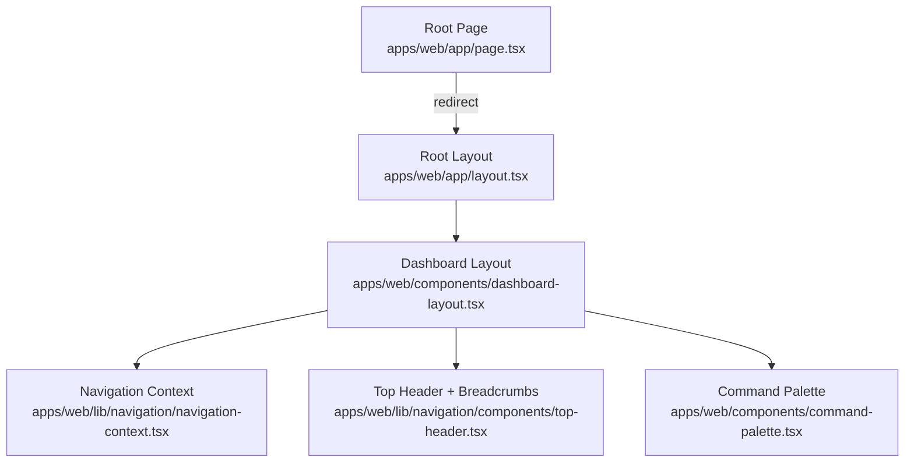
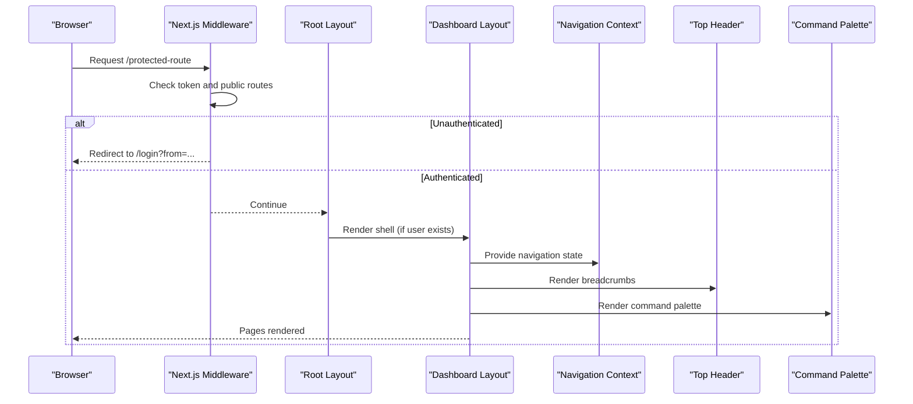
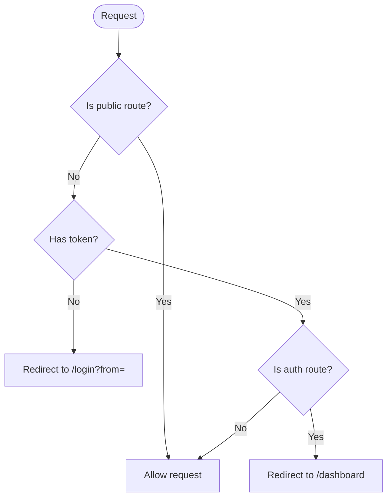
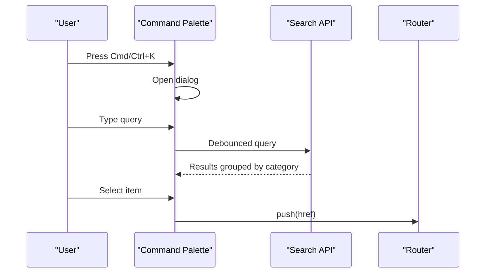
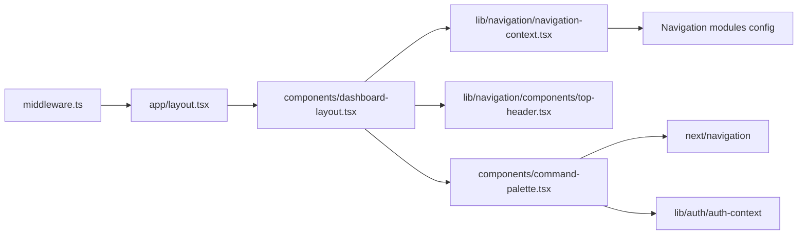

# Routing & Navigation

<cite>
**Referenced Files in This Document**
- [layout.tsx](file://apps/web/app/layout.tsx)
- [page.tsx](file://apps/web/app/page.tsx)
- [middleware.ts](file://apps/web/middleware.ts)
- [dashboard-layout.tsx](file://apps/web/components/dashboard-layout.tsx)
- [navigation-context.tsx](file://apps/web/lib/navigation/navigation-context.tsx)
- [command-palette.tsx](file://apps/web/components/command-palette.tsx)
- [top-header.tsx](file://apps/web/lib/navigation/components/top-header.tsx)
- [next.config.mjs](file://apps/web/next.config.mjs)
- [dashboard/page.tsx](file://apps/web/app/dashboard/page.tsx)
- [components/[id]/page.tsx](file://apps/web/app/components/[id]/page.tsx)
</cite>

## Table of Contents
1. [Introduction](#introduction)
2. [Project Structure](#project-structure)
3. [Core Components](#core-components)
4. [Architecture Overview](#architecture-overview)
5. [Detailed Component Analysis](#detailed-component-analysis)
6. [Dependency Analysis](#dependency-analysis)
7. [Performance Considerations](#performance-considerations)
8. [Troubleshooting Guide](#troubleshooting-guide)
9. [Conclusion](#conclusion)

## Introduction
This document explains the routing and navigation patterns used by the Next.js App Router in this application. It covers:
- App Router layout and root page behavior
- Dynamic routes and nested layouts
- Programmatic navigation and deep linking
- Command palette, breadcrumb navigation, and recent items
- Route guards and authentication-based routing
- SEO considerations, route prefetching, and performance optimization for navigation-heavy applications

## Project Structure
The application uses the Next.js App Router with a single root layout that wraps all pages with global providers and the authenticated shell. Public and standalone surfaces bypass the main shell.

**Diagram sources**
- [layout.tsx:45-63](file://apps/web/app/layout.tsx#L45-L63)
- [page.tsx:1-6](file://apps/web/app/page.tsx#L1-L6)
- [dashboard-layout.tsx:39-65](file://apps/web/components/dashboard-layout.tsx#L39-L65)
- [navigation-context.tsx:50-65](file://apps/web/lib/navigation/navigation-context.tsx#L50-L65)
- [top-header.tsx:29-106](file://apps/web/lib/navigation/components/top-header.tsx#L29-L106)
- [command-palette.tsx:231-333](file://apps/web/components/command-palette.tsx#L231-L333)

**Section sources**
- [layout.tsx:1-63](file://apps/web/app/layout.tsx#L1-L63)
- [page.tsx:1-6](file://apps/web/app/page.tsx#L1-L6)
- [dashboard-layout.tsx:15-65](file://apps/web/components/dashboard-layout.tsx#L15-L65)

## Core Components
- Root layout provides metadata, theme provider, auth provider, and the dashboard shell.
- Root page redirects to the dashboard.
- Middleware enforces authentication and protects routes.
- Dashboard layout renders the authenticated shell or public/standalone surfaces.
- Navigation context manages modules, sidebar state, recent items, and search dialog state.
- Command palette provides global search and quick actions.
- Top header builds breadcrumbs from current module and active path.

**Section sources**
- [layout.tsx:8-63](file://apps/web/app/layout.tsx#L8-L63)
- [page.tsx:1-6](file://apps/web/app/page.tsx#L1-L6)
- [middleware.ts:14-50](file://apps/web/middleware.ts#L14-L50)
- [dashboard-layout.tsx:39-131](file://apps/web/components/dashboard-layout.tsx#L39-L131)
- [navigation-context.tsx:50-165](file://apps/web/lib/navigation/navigation-context.tsx#L50-L165)
- [command-palette.tsx:231-333](file://apps/web/components/command-palette.tsx#L231-L333)
- [top-header.tsx:47-106](file://apps/web/lib/navigation/components/top-header.tsx#L47-L106)

## Architecture Overview
The routing architecture combines server-side middleware for access control with client-side navigation state and UI chrome.

**Diagram sources**
- [middleware.ts:14-50](file://apps/web/middleware.ts#L14-L50)
- [layout.tsx:45-63](file://apps/web/app/layout.tsx#L45-L63)
- [dashboard-layout.tsx:39-65](file://apps/web/components/dashboard-layout.tsx#L39-L65)
- [navigation-context.tsx:50-165](file://apps/web/lib/navigation/navigation-context.tsx#L50-L165)
- [top-header.tsx:47-106](file://apps/web/lib/navigation/components/top-header.tsx#L47-L106)
- [command-palette.tsx:231-333](file://apps/web/components/command-palette.tsx#L231-L333)

## Detailed Component Analysis

### App Router Implementation and Root Behavior
- The root layout sets global metadata, viewport, theme, and auth providers, then renders the dashboard layout.
- The root page redirects to the dashboard, ensuring a consistent entry point.

**Section sources**
- [layout.tsx:8-63](file://apps/web/app/layout.tsx#L8-L63)
- [page.tsx:1-6](file://apps/web/app/page.tsx#L1-L6)

### Authentication-Based Routing and Route Guards
- Server-side guard via middleware:
  - Allows public routes and static assets.
  - Redirects unauthenticated users to login with a return URL.
  - Redirects authenticated users away from login/forgot-password to the dashboard.
- Client-side guard in dashboard layout:
  - Skips the authenticated shell for public routes, standalone routes (e.g., scanner), or while loading/unauthenticated.

**Diagram sources**
- [middleware.ts:14-50](file://apps/web/middleware.ts#L14-L50)

**Section sources**
- [middleware.ts:4-50](file://apps/web/middleware.ts#L4-L50)
- [dashboard-layout.tsx:15-65](file://apps/web/components/dashboard-layout.tsx#L15-L65)

### Dynamic Routes and Nested Layouts
- Dynamic segments are implemented using Next.js file conventions under app folders (e.g., components/[id], customers/[id]).
- Each dynamic route page composes data fetching, permissions, and UI sections within the shared dashboard layout.

Examples:
- Component detail page reads params and navigates programmatically after mutations.
- Dashboard page demonstrates cross-domain data aggregation and navigation to domain pages.

**Section sources**
- [components/[id]/page.tsx:90-193](file://apps/web/app/components/[id]/page.tsx#L90-L193)
- [dashboard/page.tsx:95-206](file://apps/web/app/dashboard/page.tsx#L95-L206)

### Programmatic Navigation and Deep Linking
- Programmatic navigation uses next/navigation router.push for transitions after actions (e.g., delete, back).
- Deep linking is supported by standard Next.js routes; the middleware preserves the original destination via query parameters during login redirects.

**Section sources**
- [components/[id]/page.tsx:396-413](file://apps/web/app/components/[id]/page.tsx#L396-L413)
- [middleware.ts:37-47](file://apps/web/middleware.ts#L37-L47)

### Command Palette Functionality
- Global keyboard shortcut opens the command palette.
- Debounced search queries results grouped by category.
- Quick actions filtered by user permissions.
- Recent searches and recent pages persisted in localStorage.
- Selection triggers programmatic navigation.

**Diagram sources**
- [command-palette.tsx:231-333](file://apps/web/components/command-palette.tsx#L231-L333)
- [command-palette.tsx:268-311](file://apps/web/components/command-palette.tsx#L268-L311)
- [command-palette.tsx:313-333](file://apps/web/components/command-palette.tsx#L313-L333)

**Section sources**
- [command-palette.tsx:231-450](file://apps/web/components/command-palette.tsx#L231-L450)

### Breadcrumb Navigation
- Breadcrumbs are built from the current module and active path.
- They reflect hierarchical navigation based on the configured sidebar structure, falling back to URL segment formatting when needed.

**Section sources**
- [top-header.tsx:47-106](file://apps/web/lib/navigation/components/top-header.tsx#L47-L106)

### Navigation Context and Module Mapping
- Tracks current module based on pathname, auto-expands accordions for active children, and persists sidebar preferences and recent items.
- Provides global search dialog state and mobile drawer state.

**Section sources**
- [navigation-context.tsx:50-165](file://apps/web/lib/navigation/navigation-context.tsx#L50-L165)

### Standalone Surfaces and Shell Isolation
- Certain routes (e.g., scanner) render without the main shell to act as standalone apps.
- Authentication remains enforced by middleware and providers.

**Section sources**
- [dashboard-layout.tsx:24-65](file://apps/web/components/dashboard-layout.tsx#L24-L65)

## Dependency Analysis
The navigation system depends on Next.js routing primitives, middleware, and shared UI/context modules.

**Diagram sources**
- [middleware.ts:14-50](file://apps/web/middleware.ts#L14-L50)
- [layout.tsx:45-63](file://apps/web/app/layout.tsx#L45-L63)
- [dashboard-layout.tsx:39-131](file://apps/web/components/dashboard-layout.tsx#L39-L131)
- [navigation-context.tsx:50-165](file://apps/web/lib/navigation/navigation-context.tsx#L50-L165)
- [top-header.tsx:29-106](file://apps/web/lib/navigation/components/top-header.tsx#L29-L106)
- [command-palette.tsx:231-333](file://apps/web/components/command-palette.tsx#L231-L333)

**Section sources**
- [middleware.ts:14-50](file://apps/web/middleware.ts#L14-L50)
- [layout.tsx:45-63](file://apps/web/app/layout.tsx#L45-L63)
- [dashboard-layout.tsx:39-131](file://apps/web/components/dashboard-layout.tsx#L39-L131)
- [navigation-context.tsx:50-165](file://apps/web/lib/navigation/navigation-context.tsx#L50-L165)
- [command-palette.tsx:231-333](file://apps/web/components/command-palette.tsx#L231-L333)

## Performance Considerations
- Route prefetching: Use <Link> where possible to leverage Next.js prefetching for faster navigation.
- Data coalescing: Aggregate multiple domain metrics in parallel to reduce round-trips (see dashboard page pattern).
- Debounced search: Command palette debounces queries to minimize network load.
- Local persistence: Persist sidebar state, accordions, pinned items, and recent items to avoid re-computation and improve UX.
- Service worker headers: Configure cache-control for sw.js to ensure reliable updates.

[No sources needed since this section provides general guidance]

## Troubleshooting Guide
- Redirect loops: Ensure middleware public routes list includes all non-protected paths and that the root page redirects correctly.
- Missing breadcrumbs: Verify current module mapping and sidebar configuration so breadcrumbs can resolve titles and links.
- Command palette not opening: Confirm keyboard event listeners are attached and searchOpen state is managed by navigation context.
- Standalone routes rendering shell: Validate standalone route checks in dashboard layout.

**Section sources**
- [middleware.ts:4-50](file://apps/web/middleware.ts#L4-L50)
- [page.tsx:1-6](file://apps/web/app/page.tsx#L1-L6)
- [top-header.tsx:47-106](file://apps/web/lib/navigation/components/top-header.tsx#L47-L106)
- [navigation-context.tsx:150-165](file://apps/web/lib/navigation/navigation-context.tsx#L150-L165)
- [dashboard-layout.tsx:24-65](file://apps/web/components/dashboard-layout.tsx#L24-L65)

## Conclusion
This application’s routing and navigation combine robust server-side guards with a flexible client-side navigation system. The App Router layout establishes a consistent shell, middleware secures routes, and the navigation context powers breadcrumbs, recent items, and command palette interactions. Dynamic routes and programmatic navigation enable seamless movement across business domains, while performance techniques like prefetching, debouncing, and local persistence keep the experience responsive.