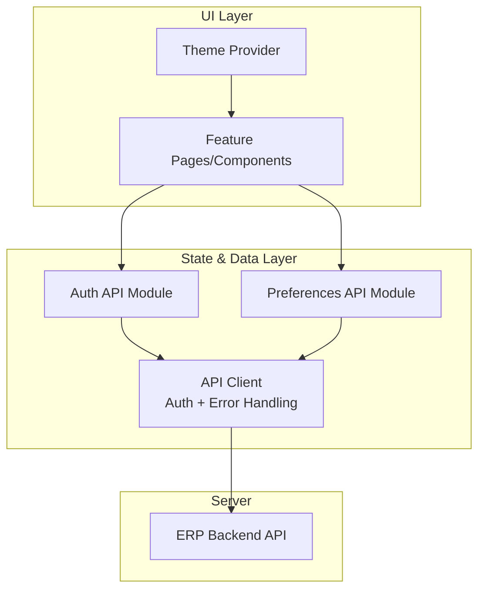
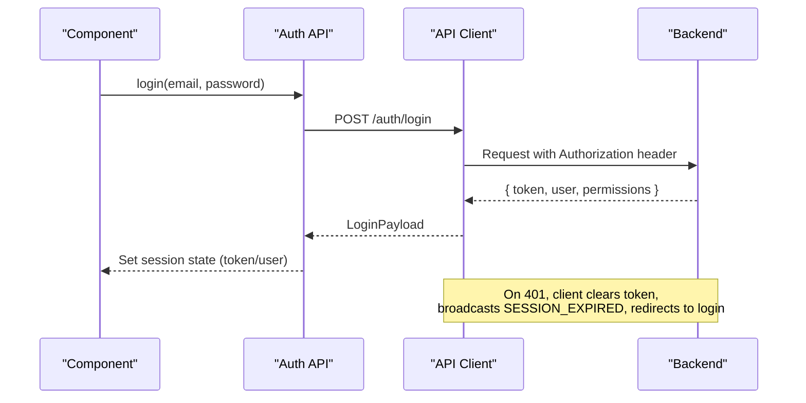
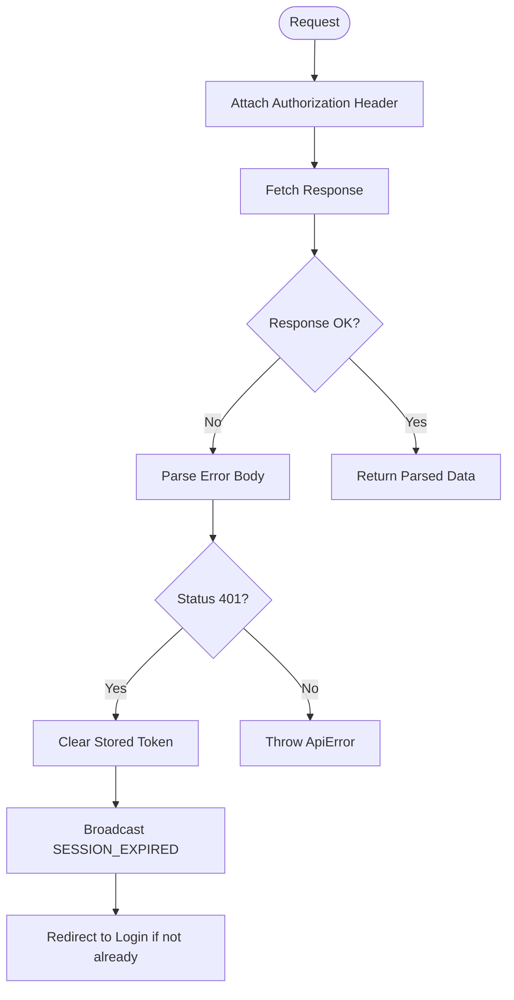
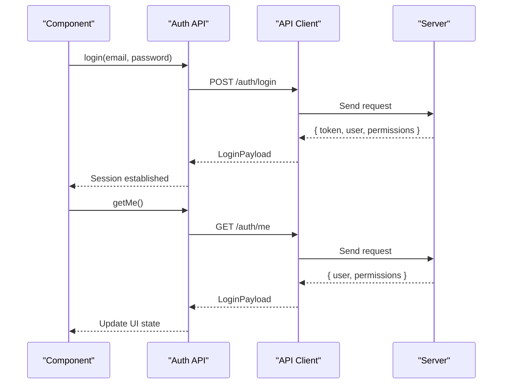
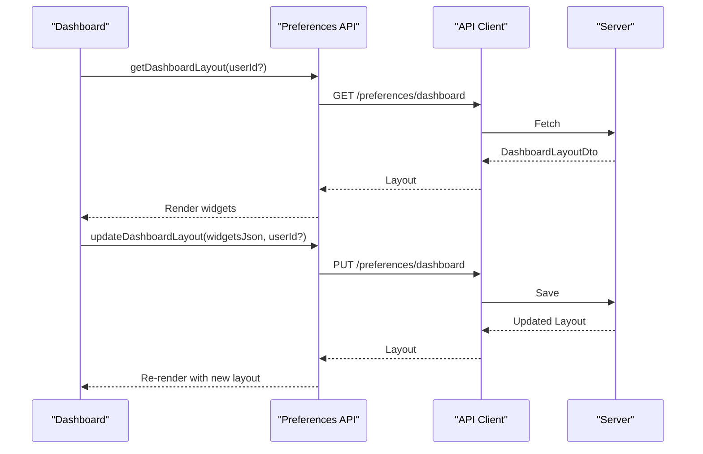
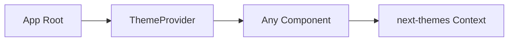
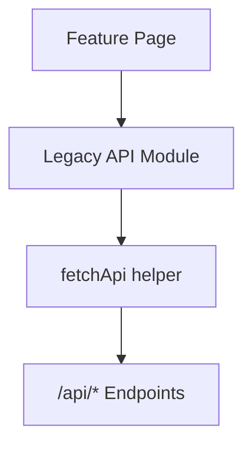
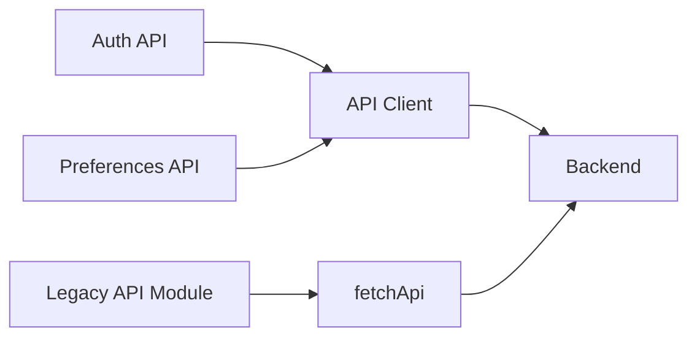

# State Management

<cite>
**Referenced Files in This Document**
- [api-client.ts](file://apps/web/lib/api-client.ts)
- [auth-api.ts](file://apps/web/lib/api/auth-api.ts)
- [preferences-api.ts](file://apps/web/lib/api/preferences-api.ts)
- [theme-provider.tsx](file://apps/web/components/theme-provider.tsx)
- [api.ts](file://apps/web/src/lib/api.ts)
</cite>

## Table of Contents
1. [Introduction](#introduction)
2. [Project Structure](#project-structure)
3. [Core Components](#core-components)
4. [Architecture Overview](#architecture-overview)
5. [Detailed Component Analysis](#detailed-component-analysis)
6. [Dependency Analysis](#dependency-analysis)
7. [Performance Considerations](#performance-considerations)
8. [Troubleshooting Guide](#troubleshooting-guide)
9. [Conclusion](#conclusion)

## Introduction
This document explains the state management patterns used in Ananya ERP’s frontend, focusing on:
- Local component state (managed within components using React primitives)
- Global application state (session, user profile, permissions, and preferences)
- Server state synchronization (API client, error handling, and session lifecycle)
It also covers real-time considerations, caching strategies, performance, persistence, and debugging techniques grounded in the codebase.

## Project Structure
The frontend organizes state-related concerns across a few key layers:
- API client layer: centralized HTTP client with authentication, error handling, and session broadcast
- Domain API modules: typed wrappers for features like authentication and preferences
- UI providers: global context providers (e.g., theme) that manage small slices of global UI state
- Feature pages and components: use local state via hooks and consume server state through the API modules

**Diagram sources**
- [api-client.ts:1-295](file://apps/web/lib/api-client.ts#L1-L295)
- [auth-api.ts:1-151](file://apps/web/lib/api/auth-api.ts#L1-L151)
- [preferences-api.ts:1-136](file://apps/web/lib/api/preferences-api.ts#L1-L136)
- [theme-provider.tsx:1-12](file://apps/web/components/theme-provider.tsx#L1-L12)

**Section sources**
- [api-client.ts:1-295](file://apps/web/lib/api-client.ts#L1-L295)
- [auth-api.ts:1-151](file://apps/web/lib/api/auth-api.ts#L1-L151)
- [preferences-api.ts:1-136](file://apps/web/lib/api/preferences-api.ts#L1-L136)
- [theme-provider.tsx:1-12](file://apps/web/components/theme-provider.tsx#L1-L12)

## Core Components
- API client: Centralized fetch wrapper that attaches authorization headers, handles errors, manages token storage, and broadcasts auth events across tabs.
- Auth API module: Typed endpoints for login, logout, current user, sessions, setup, and invitations.
- Preferences API module: Endpoints to persist dashboard layout, saved views, favorites, and workspace preferences per user.
- Theme provider: A lightweight global context provider for theme state using next-themes.

These pieces together form the foundation for managing local, global, and server state consistently across the app.

**Section sources**
- [api-client.ts:1-295](file://apps/web/lib/api-client.ts#L1-L295)
- [auth-api.ts:1-151](file://apps/web/lib/api/auth-api.ts#L1-L151)
- [preferences-api.ts:1-136](file://apps/web/lib/api/preferences-api.ts#L1-L136)
- [theme-provider.tsx:1-12](file://apps/web/components/theme-provider.tsx#L1-L12)

## Architecture Overview
The state architecture separates concerns into clear layers:
- UI state: Local component state via React hooks; global UI state via providers (e.g., theme).
- Application state: Session and user profile managed by consuming auth APIs; persisted tokens stored securely in storage and cookies.
- Server state: All domain data fetched through typed API modules that delegate to the shared API client.

**Diagram sources**
- [auth-api.ts:55-66](file://apps/web/lib/api/auth-api.ts#L55-L66)
- [api-client.ts:145-175](file://apps/web/lib/api-client.ts#L145-L175)
- [api-client.ts:78-118](file://apps/web/lib/api-client.ts#L78-L118)

## Detailed Component Analysis

### API Client: Authentication, Errors, and Cross-Tab Sync
Responsibilities:
- Attaches Bearer token from storage or cookie to requests
- Handles non-OK responses uniformly and extracts messages
- On 401 Unauthorized: clears stored token, broadcasts SESSION_EXPIRED, triggers optional handler, and redirects to login when appropriate
- Provides helpers for JSON and binary payloads and FormData uploads

Key behaviors:
- Token retrieval order: localStorage first, then cookie fallback
- BroadcastChannel usage to synchronize auth state across tabs/windows
- Centralized error class for consistent error propagation

**Diagram sources**
- [api-client.ts:62-72](file://apps/web/lib/api-client.ts#L62-L72)
- [api-client.ts:78-118](file://apps/web/lib/api-client.ts#L78-L118)
- [api-client.ts:145-175](file://apps/web/lib/api-client.ts#L145-L175)

**Section sources**
- [api-client.ts:1-295](file://apps/web/lib/api-client.ts#L1-L295)

### Auth API: Session Lifecycle and User Profile
Responsibilities:
- Encapsulates authentication endpoints: login, logout, get current user, sessions management, setup, invitations
- Returns strongly-typed payloads for user, permissions, and session metadata

Usage pattern:
- Call login to obtain token and user profile
- Store token via API client internals; subsequent calls automatically include Authorization
- Use getMe to refresh or validate current session state

**Diagram sources**
- [auth-api.ts:55-66](file://apps/web/lib/api/auth-api.ts#L55-L66)
- [api-client.ts:145-175](file://apps/web/lib/api-client.ts#L145-L175)

**Section sources**
- [auth-api.ts:1-151](file://apps/web/lib/api/auth-api.ts#L1-L151)
- [api-client.ts:1-295](file://apps/web/lib/api-client.ts#L1-L295)

### Preferences API: Persisted User Settings
Responsibilities:
- Manage dashboard layout, saved views, favorites, and workspace preferences
- Each endpoint supports optional userId scoping for admin-like scenarios

Patterns:
- Load preferences on mount or route entry
- Debounced updates for frequent changes (e.g., widget drag-and-drop)
- Optimistic UI updates followed by server confirmation

**Diagram sources**
- [preferences-api.ts:48-62](file://apps/web/lib/api/preferences-api.ts#L48-L62)
- [api-client.ts:145-175](file://apps/web/lib/api-client.ts#L145-L175)

**Section sources**
- [preferences-api.ts:1-136](file://apps/web/lib/api/preferences-api.ts#L1-L136)
- [api-client.ts:1-295](file://apps/web/lib/api-client.ts#L1-L295)

### Theme Provider: Lightweight Global UI State
Responsibilities:
- Wraps next-themes to provide theme state globally
- Enables consistent dark/light mode across the application

Usage:
- Wrap the app root with the provider
- Consume theme via next-themes hooks in components

**Diagram sources**
- [theme-provider.tsx:1-12](file://apps/web/components/theme-provider.tsx#L1-L12)

**Section sources**
- [theme-provider.tsx:1-12](file://apps/web/components/theme-provider.tsx#L1-L12)

### Legacy API Module: Domain-Specific Endpoints
The legacy module exposes feature-specific endpoints (components, locations, manufacturing, warehouse, etc.) using a simple fetch wrapper. It demonstrates how domain logic can be encapsulated while keeping the UI decoupled from network details.

**Diagram sources**
- [api.ts:15-60](file://apps/web/src/lib/api.ts#L15-L60)
- [api.ts:62-800](file://apps/web/src/lib/api.ts#L62-L800)

**Section sources**
- [api.ts:1-800](file://apps/web/src/lib/api.ts#L1-L800)

## Dependency Analysis
- The API client is the single source of truth for HTTP behavior, including auth header injection and 401 handling.
- Auth and Preferences modules depend on the API client but remain thin, focused on types and endpoint composition.
- UI components depend on these modules rather than directly on fetch, improving testability and consistency.

**Diagram sources**
- [auth-api.ts:1-151](file://apps/web/lib/api/auth-api.ts#L1-L151)
- [preferences-api.ts:1-136](file://apps/web/lib/api/preferences-api.ts#L1-L136)
- [api.ts:15-60](file://apps/web/src/lib/api.ts#L15-L60)
- [api-client.ts:145-175](file://apps/web/lib/api-client.ts#L145-L175)

**Section sources**
- [auth-api.ts:1-151](file://apps/web/lib/api/auth-api.ts#L1-L151)
- [preferences-api.ts:1-136](file://apps/web/lib/api/preferences-api.ts#L1-L136)
- [api.ts:1-800](file://apps/web/src/lib/api.ts#L1-L800)
- [api-client.ts:1-295](file://apps/web/lib/api-client.ts#L1-L295)

## Performance Considerations
- Avoid redundant requests: cache results at the component level using React state or memoization where appropriate. For example, store fetched lists in component state and reuse until explicit invalidation.
- Debounce writes: for preference updates (e.g., dashboard layout), debounce mutations to reduce network churn.
- Minimize re-renders: lift minimal state up only when necessary; keep most UI state local to components.
- Handle 401 efficiently: centralized 401 handling prevents repeated failed requests and quickly restores a valid session.
- Binary assets: use dedicated blob endpoints to avoid unnecessary parsing overhead.

[No sources needed since this section provides general guidance]

## Troubleshooting Guide
Common issues and remedies:
- Session expired mid-operation:
  - Symptom: sudden redirect to login or stale UI after network call
  - Cause: backend returned 401; client cleared token and broadcast SESSION_EXPIRED
  - Resolution: ensure your app listens for auth events or relies on the built-in redirect; verify token storage and cookie configuration
- Network errors:
  - Symptom: generic error messages or unhandled exceptions
  - Cause: non-OK response without proper message parsing
  - Resolution: check error body parsing and ensure ApiError is caught upstream
- Cross-tab sync:
  - Symptom: one tab logs out but others remain authenticated
  - Cause: missing BroadcastChannel listener
  - Resolution: register an auth event listener in your app to handle LOGOUT/SESSION_EXPIRED and reset local state accordingly

**Section sources**
- [api-client.ts:78-118](file://apps/web/lib/api-client.ts#L78-L118)
- [api-client.ts:20-44](file://apps/web/lib/api-client.ts#L20-L44)

## Conclusion
Ananya ERP’s frontend employs a layered approach to state management:
- Local state via React hooks for transient UI interactions
- Global state via providers for cross-cutting UI concerns (e.g., theme)
- Server state via typed API modules backed by a robust API client that centralizes authentication, error handling, and session lifecycle
This design promotes consistency, testability, and maintainability while enabling efficient caching, optimistic updates, and resilient error handling.

[No sources needed since this section summarizes without analyzing specific files]