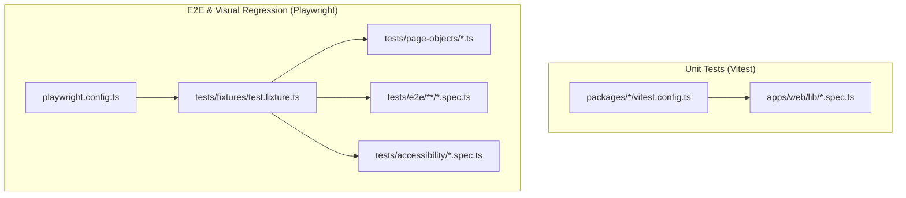
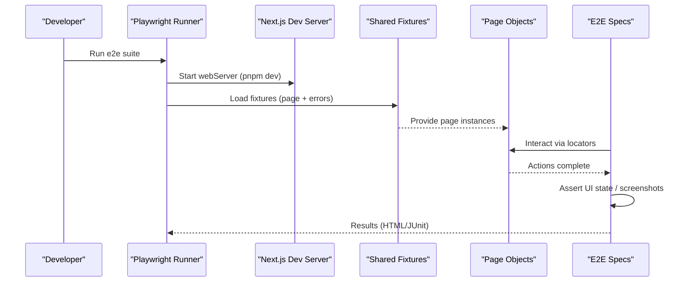
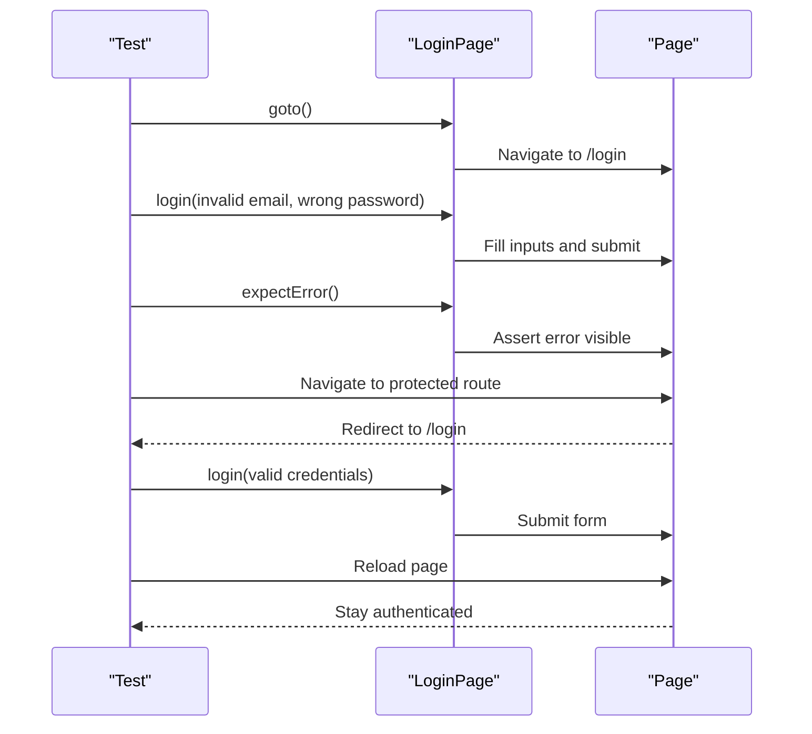
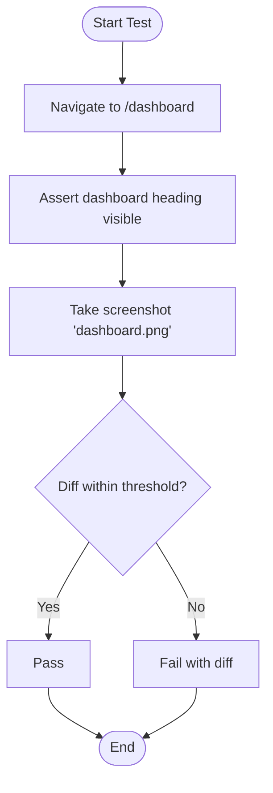
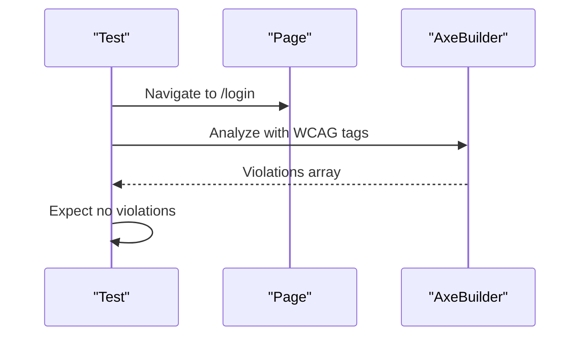
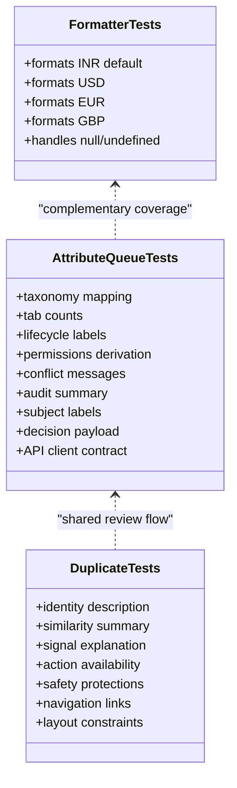
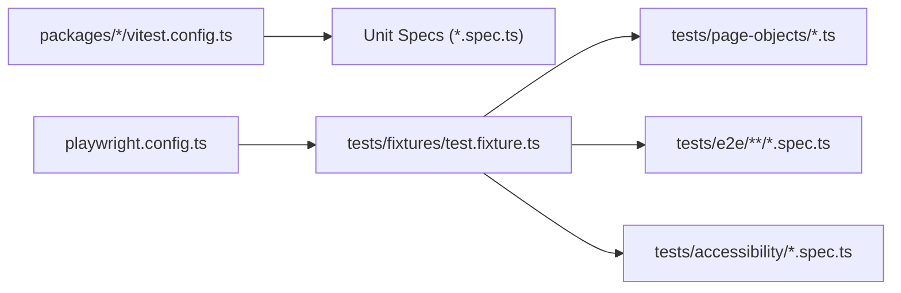

# Testing Strategies

<cite>
**Referenced Files in This Document**
- [playwright.config.ts](file://playwright.config.ts)
- [package.json](file://apps/web/package.json)
- [test.fixture.ts](file://tests/fixtures/test.fixture.ts)
- [LoginPage.ts](file://tests/page-objects/LoginPage.ts)
- [login.spec.ts](file://tests/e2e/authentication/login.spec.ts)
- [visual-regression.spec.ts](file://tests/e2e/visual-regression.spec.ts)
- [accessibility.spec.ts](file://tests/accessibility/accessibility.spec.ts)
- [attribute-review-queue.spec.ts](file://apps/web/lib/attribute-review-queue.spec.ts)
- [component-review-duplicate.spec.ts](file://apps/web/lib/component-review-duplicate.spec.ts)
- [formatters.spec.ts](file://apps/web/lib/formatters.spec.ts)
- [vitest.config.ts](file://packages/core/vitest.config.ts)
- [testing.md](file://docs/testing.md)
</cite>

## Table of Contents
1. [Introduction](#introduction)
2. [Project Structure](#project-structure)
3. [Core Components](#core-components)
4. [Architecture Overview](#architecture-overview)
5. [Detailed Component Analysis](#detailed-component-analysis)
6. [Dependency Analysis](#dependency-analysis)
7. [Performance Considerations](#performance-considerations)
8. [Troubleshooting Guide](#troubleshooting-guide)
9. [Conclusion](#conclusion)
10. [Appendices](#appendices)

## Introduction
This document explains the testing strategies for the frontend application, covering unit tests for React components and utilities, integration patterns, end-to-end (E2E) testing with Playwright, visual regression testing, accessibility audits, test utilities, data management, and continuous integration setup. It synthesizes how the project organizes tests, what tools are used, and how to run and extend them effectively.

## Project Structure
The frontend testing strategy spans two layers:
- Unit and utility tests using Vitest within packages and the web app.
- E2E and visual regression tests using Playwright under a shared tests directory.

**Diagram sources**
- [vitest.config.ts:1-7](file://packages/core/vitest.config.ts#L1-L7)
- [playwright.config.ts:1-51](file://playwright.config.ts#L1-L51)
- [test.fixture.ts:1-44](file://tests/fixtures/test.fixture.ts#L1-L44)

**Section sources**
- [testing.md:1-74](file://docs/testing.md#L1-L74)
- [playwright.config.ts:1-51](file://playwright.config.ts#L1-L51)
- [package.json:1-55](file://apps/web/package.json#L1-L55)

## Core Components
- Playwright configuration defines test directories, reporters, browser projects, and web server startup for E2E runs.
- Shared fixtures provide page objects and global error capture to fail fast on runtime issues.
- Page Object Model encapsulates UI interactions behind stable APIs.
- Unit tests validate business logic, presentation helpers, and API client contracts without DOM dependencies.

Key responsibilities:
- E2E orchestration and cross-browser execution via Playwright.
- Centralized fixtures and page abstractions for maintainable tests.
- Fast, isolated unit tests for pure functions and domain logic.

**Section sources**
- [playwright.config.ts:1-51](file://playwright.config.ts#L1-L51)
- [test.fixture.ts:1-44](file://tests/fixtures/test.fixture.ts#L1-L44)
- [LoginPage.ts:1-37](file://tests/page-objects/LoginPage.ts#L1-L37)
- [formatters.spec.ts:1-33](file://apps/web/lib/formatters.spec.ts#L1-L33)

## Architecture Overview
The testing architecture separates concerns by layer:
- Unit tests validate deterministic logic and presentation helpers.
- E2E tests exercise full user flows through the running Next.js dev server.
- Visual regression ensures UI stability across changes.
- Accessibility audits enforce WCAG compliance on key routes.

**Diagram sources**
- [playwright.config.ts:1-51](file://playwright.config.ts#L1-L51)
- [test.fixture.ts:1-44](file://tests/fixtures/test.fixture.ts#L1-L44)
- [LoginPage.ts:1-37](file://tests/page-objects/LoginPage.ts#L1-L37)

## Detailed Component Analysis

### E2E Authentication Flow
Demonstrates login page rendering, invalid credentials handling, redirect behavior, and session persistence across refreshes.

**Diagram sources**
- [login.spec.ts:1-64](file://tests/e2e/authentication/login.spec.ts#L1-L64)
- [LoginPage.ts:1-37](file://tests/page-objects/LoginPage.ts#L1-L37)

**Section sources**
- [login.spec.ts:1-64](file://tests/e2e/authentication/login.spec.ts#L1-L64)
- [LoginPage.ts:1-37](file://tests/page-objects/LoginPage.ts#L1-L37)

### Visual Regression Testing
Captures screenshots of critical pages and compares against baselines to detect unintended UI changes.

**Diagram sources**
- [visual-regression.spec.ts:1-22](file://tests/e2e/visual-regression.spec.ts#L1-L22)

**Section sources**
- [visual-regression.spec.ts:1-22](file://tests/e2e/visual-regression.spec.ts#L1-L22)

### Accessibility Audits
Runs WCAG 2.1 AA checks on core routes to ensure inclusive UI.

**Diagram sources**
- [accessibility.spec.ts:1-23](file://tests/accessibility/accessibility.spec.ts#L1-L23)

**Section sources**
- [accessibility.spec.ts:1-23](file://tests/accessibility/accessibility.spec.ts#L1-L23)

### Unit Testing Utilities and Business Logic
Focuses on pure functions, formatting, and complex presentation logic without DOM.

- Currency formatting validates locale-specific symbols and safe handling of null/undefined values.
- Attribute review queue tests assert taxonomy mapping, counts, lifecycle labels, permissions, conflict messaging, audit summaries, subject labels, decision payloads, and API client contract constraints.
- Duplicate investigation tests validate identity descriptions, similarity summaries, signal explanations, action availability, safety protections, navigation links, and layout constraints.

**Diagram sources**
- [formatters.spec.ts:1-33](file://apps/web/lib/formatters.spec.ts#L1-L33)
- [attribute-review-queue.spec.ts:1-800](file://apps/web/lib/attribute-review-queue.spec.ts#L1-L800)
- [component-review-duplicate.spec.ts:1-728](file://apps/web/lib/component-review-duplicate.spec.ts#L1-L728)

**Section sources**
- [formatters.spec.ts:1-33](file://apps/web/lib/formatters.spec.ts#L1-L33)
- [attribute-review-queue.spec.ts:1-800](file://apps/web/lib/attribute-review-queue.spec.ts#L1-L800)
- [component-review-duplicate.spec.ts:1-728](file://apps/web/lib/component-review-duplicate.spec.ts#L1-L728)

### Mocking API Calls and Validating Form Behavior
- The repository’s unit tests focus on pure logic and presentation helpers; they do not rely on DOM testing libraries. For mocking HTTP calls in unit tests, prefer an interceptor or mock library aligned with your HTTP client (for example, MSW is present in the workspace lockfile). 
- For form validation and submission, use React Hook Form patterns and assert outcomes through helper functions that transform inputs into normalized values or API payloads. Validate edge cases such as empty fields, invalid formats, and network failures by asserting the resulting state or error messages produced by your form handlers.

[No sources needed since this section provides general guidance]

### Test Data Management
- Use small, deterministic fixtures defined inline or in dedicated files to represent entities like findings, attributes, and components.
- Keep fixture factories minimal and composable to reduce duplication and improve readability.
- For E2E, rely on page objects to abstract selectors and actions, keeping test data out of spec files where possible.

[No sources needed since this section provides general guidance]

### Continuous Integration Setup
- Playwright is configured to run in parallel with retries and workers tuned for CI, producing HTML and JUnit reports, plus screenshots and videos on failure.
- The web server is started automatically before tests run, ensuring a consistent environment.
- The documentation outlines commands for local runs, headed mode, debug mode, accessibility-only runs, visual regression runs, and a full QA pipeline.

**Section sources**
- [playwright.config.ts:1-51](file://playwright.config.ts#L1-L51)
- [testing.md:1-74](file://docs/testing.md#L1-L74)

## Dependency Analysis
The testing stack has clear boundaries:
- Vitest configurations per package define where unit specs live.
- Playwright orchestrates E2E and visual regression, depending on the running Next.js dev server.
- Shared fixtures centralize page object instantiation and global error listeners.

**Diagram sources**
- [vitest.config.ts:1-7](file://packages/core/vitest.config.ts#L1-L7)
- [playwright.config.ts:1-51](file://playwright.config.ts#L1-L51)
- [test.fixture.ts:1-44](file://tests/fixtures/test.fixture.ts#L1-L44)

**Section sources**
- [vitest.config.ts:1-7](file://packages/core/vitest.config.ts#L1-L7)
- [playwright.config.ts:1-51](file://playwright.config.ts#L1-L51)
- [test.fixture.ts:1-44](file://tests/fixtures/test.fixture.ts#L1-L44)

## Performance Considerations
- Keep unit tests fast and isolated; avoid starting servers or loading heavy assets.
- In E2E, leverage Playwright’s parallelism and targeted selectors to minimize flakiness.
- Use screenshots and videos only on failure to reduce overhead.
- Prefer deterministic fixtures and stable locators to speed up debugging and reduce re-runs.

[No sources needed since this section provides general guidance]

## Troubleshooting Guide
- Global error capture: The shared fixture listens for console errors and unhandled exceptions, failing tests immediately when these occur during E2E runs.
- Report artifacts: Playwright emits HTML reports and JUnit XML for CI consumption; enable retries and retain media on failure to aid diagnosis.
- Common issues:
  - Flaky selectors: Stabilize with semantic locators and explicit waits.
  - Network timing: Add appropriate waits for async operations before assertions.
  - Environment drift: Ensure the dev server starts successfully and is reachable at the configured base URL.

**Section sources**
- [test.fixture.ts:1-44](file://tests/fixtures/test.fixture.ts#L1-L44)
- [playwright.config.ts:1-51](file://playwright.config.ts#L1-L51)

## Conclusion
The frontend testing strategy combines fast, focused unit tests with robust E2E and visual regression suites. Shared fixtures and page objects promote maintainability, while Playwright’s multi-browser support and reporting integrate well with CI. By following the patterns shown here—pure function tests, presentation logic validation, structured E2E flows, and accessibility checks—you can confidently evolve the application while preserving quality and user experience.

## Appendices

### Running Tests Locally
- Use the documented commands to run E2E suites, accessibility audits, visual regression, and the full QA pipeline.
- Launch headed or debug modes for interactive troubleshooting.

**Section sources**
- [testing.md:1-74](file://docs/testing.md#L1-L74)

### Unit Test Configuration
- Each package includes a Vitest configuration that discovers spec files under src.

**Section sources**
- [vitest.config.ts:1-7](file://packages/core/vitest.config.ts#L1-L7)

### Web App Scripts
- The web app exposes scripts for development, building, linting, type checking, and running Vitest tests.

**Section sources**
- [package.json:1-55](file://apps/web/package.json#L1-L55)