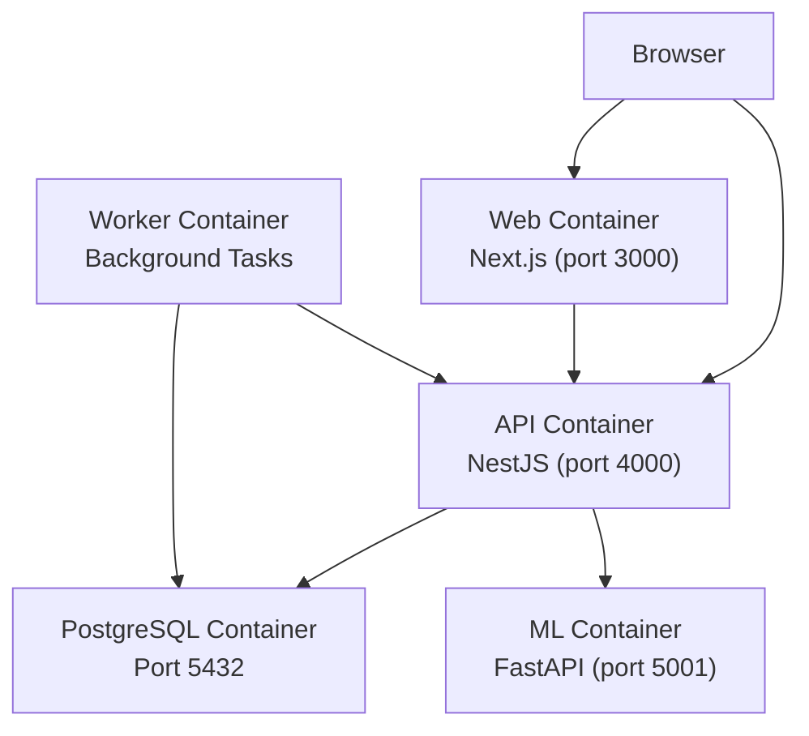
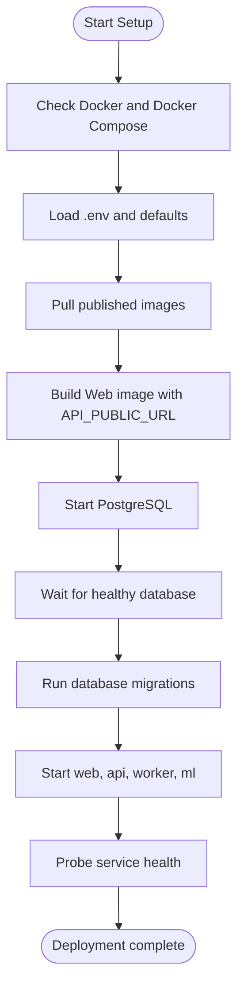
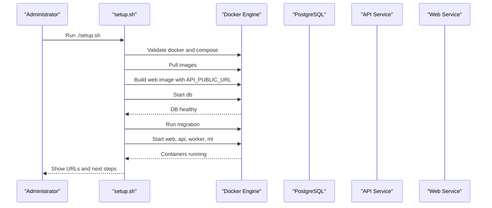
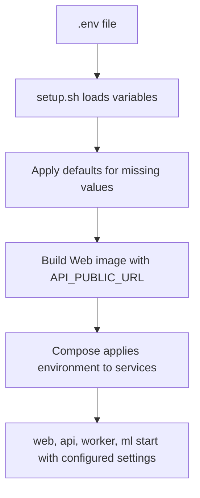
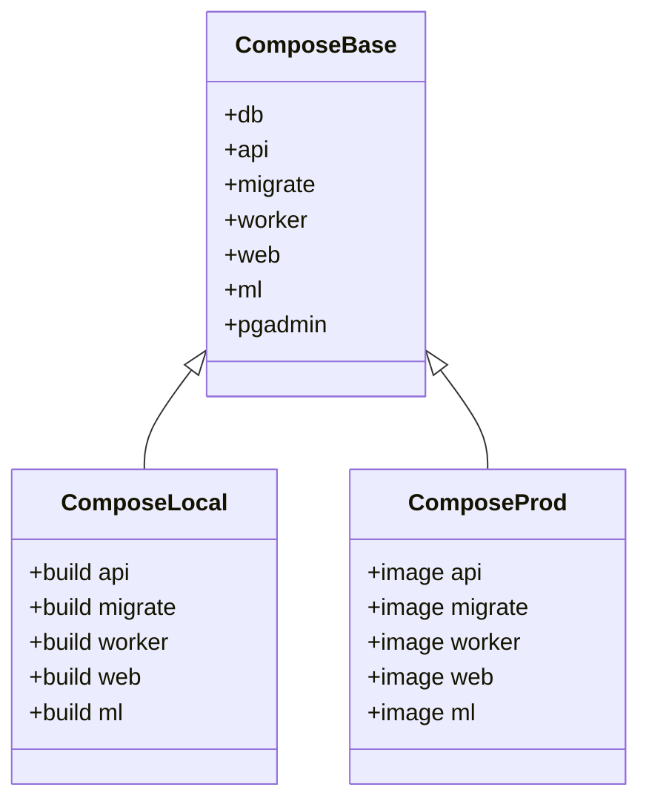
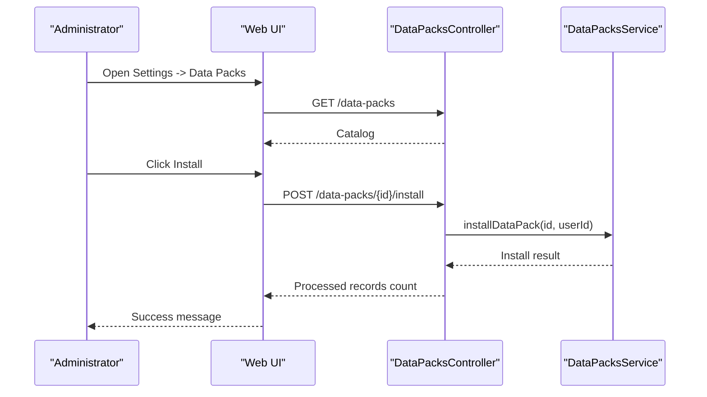
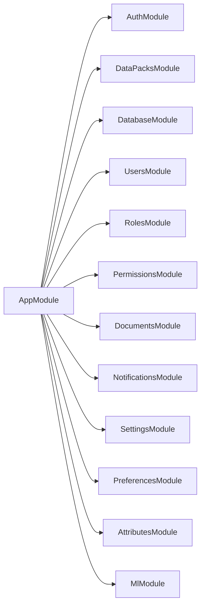
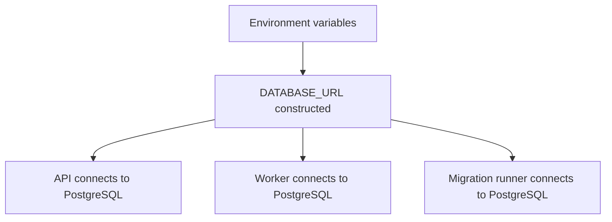

# Getting Started

<cite>
**Referenced Files in This Document**   
- [README.md](file://README.md)
- [setup.sh](file://setup.sh)
- [compose.yml](file://compose.yml)
- [compose.local.yml](file://compose.local.yml)
- [compose.prod.yml](file://compose.prod.yml)
- [apps/api/src/main.ts](file://apps/api/src/main.ts)
- [apps/api/src/app.module.ts](file://apps/api/src/app.module.ts)
- [apps/web/next.config.mjs](file://apps/web/next.config.mjs)
- [packages/database/drizzle.config.ts](file://packages/database/drizzle.config.ts)
- [apps/api/src/data-packs/data-packs.controller.ts](file://apps/api/src/data-packs/data-packs.controller.ts)
- [apps/web/lib/api/data-packs-api.ts](file://apps/web/lib/api/data-packs-api.ts)
</cite>

## Table of Contents
1. [Introduction](#introduction)
2. [Project Structure](#project-structure)
3. [Core Components](#core-components)
4. [Architecture Overview](#architecture-overview)
5. [Detailed Component Analysis](#detailed-component-analysis)
6. [Dependency Analysis](#dependency-analysis)
7. [Performance Considerations](#performance-considerations)
8. [Troubleshooting Guide](#troubleshooting-guide)
9. [Conclusion](#conclusion)

## Introduction
Ananya ERP is a modern operations platform for inventory, procurement, manufacturing, warehouse operations, projects, sales, finance, CRM, service, MRP, reporting, authentication/RBAC, documents, imports, and administrator-managed Data Packs. This guide focuses on installation, setup, environment configuration, automated deployment, first-time usage, and troubleshooting for both development and production scenarios.

The recommended production path uses Docker Compose, PostgreSQL, a reverse proxy for HTTPS, and the provided `setup.sh` script to build, migrate, and start services.

**Section sources**
- [README.md:1-33](file://README.md#L1-L33)

## Project Structure
At runtime, Ananya consists of:
- A Next.js web application serving the browser interface.
- A NestJS API exposing REST endpoints and background worker functionality.
- A Python ML microservice for component intelligence.
- A PostgreSQL database for durable state.
- Docker Compose files defining shared infrastructure and override profiles for local builds or published images.

**Diagram sources**
- [compose.yml:18-173](file://compose.yml#L18-L173)
- [compose.prod.yml:22-45](file://compose.prod.yml#L22-L45)

**Section sources**
- [README.md:275-298](file://README.md#L275-L298)
- [compose.yml:1-14](file://compose.yml#L1-L14)

## Core Components
- **Docker and Docker Compose**: Required to run containers and orchestrate services.
- **PostgreSQL**: Stores all application data; health-checked by Compose.
- **Web Application**: Compiled with the public API URL so the browser can call the API directly.
- **API Service**: NestJS application handling business logic, authentication, data packs, and background tasks.
- **Worker Service**: Runs background jobs using the same application context as the API.
- **ML Service**: Optional FastAPI service for component intelligence features.
- **Reverse Proxy**: Routes HTTPS traffic from public domains to internal container ports.

Key environment variables used during setup:
- `ANANYA_VERSION`: Image tag for published images.
- `POSTGRES_DB`, `POSTGRES_USER`, `POSTGRES_PASSWORD`: Database credentials.
- `JWT_SECRET`: Secret for API authentication tokens.
- `CORS_ORIGIN`: Allowed browser origins for CORS.
- `API_PUBLIC_URL`: Publicly reachable API endpoint used by the browser.
- `WEB_PORT`, `API_PORT`, `WORKER_PORT`, `ML_PORT`: Host port mappings.

**Section sources**
- [README.md:26-67](file://README.md#L26-L67)
- [compose.yml:23-52](file://compose.yml#L23-L52)
- [compose.yml:89-118](file://compose.yml#L89-L118)
- [compose.yml:120-148](file://compose.yml#L120-L148)
- [compose.yml:150-173](file://compose.yml#L150-L173)

## Architecture Overview
The production stack is composed through a base Compose file plus an override file:
- `compose.yml`: Shared services, networks, volumes, health checks, and default environment values.
- `compose.local.yml`: Builds application images locally for development testing.
- `compose.prod.yml`: Uses published images from GitHub Container Registry and requires `API_PUBLIC_URL`.

**Diagram sources**
- [setup.sh:51-218](file://setup.sh#L51-L218)
- [compose.yml:18-173](file://compose.yml#L18-L173)
- [compose.prod.yml:22-45](file://compose.prod.yml#L22-L45)

**Section sources**
- [compose.yml:1-14](file://compose.yml#L1-L14)
- [compose.local.yml:1-10](file://compose.local.yml#L1-L10)
- [compose.prod.yml:1-20](file://compose.prod.yml#L1-L20)

## Detailed Component Analysis

### System Requirements
Ananya requires:
- A Linux server or workstation capable of running Docker containers.
- Docker and Docker Compose v2.
- Sufficient disk space for PostgreSQL data and uploaded files.
- Domain names for HTTPS access, or `localhost` for evaluation.
- A reverse proxy such as Caddy, Nginx, or Traefik for production HTTPS routing.

These requirements are explicitly documented in the repository’s getting started section.

**Section sources**
- [README.md:26-33](file://README.md#L26-L33)

### Automated Setup Process
The `setup.sh` script automates production installation and upgrades:
1. Validates Docker and Docker Compose availability.
2. Creates `.env` from `.env.example` if missing.
3. Loads environment variables and prints deployment configuration.
4. Optionally fetches latest repository updates during upgrade mode.
5. Pulls published images from GHCR.
6. Builds the Web image with `API_PUBLIC_URL`.
7. Starts PostgreSQL and waits for its health check to pass.
8. Executes database schema migrations.
9. Starts the full application stack.
10. Probes container health and displays access URLs.

**Diagram sources**
- [setup.sh:51-218](file://setup.sh#L51-L218)
- [compose.yml:18-173](file://compose.yml#L18-L173)

**Section sources**
- [setup.sh:1-10](file://setup.sh#L1-L10)
- [setup.sh:51-73](file://setup.sh#L51-L73)
- [setup.sh:75-104](file://setup.sh#L75-L104)
- [setup.sh:106-137](file://setup.sh#L106-L137)
- [setup.sh:139-177](file://setup.sh#L139-L177)
- [setup.sh:179-218](file://setup.sh#L179-L218)

### Environment Variable Configuration
Environment configuration is central to deployment:
- The script creates `.env` from `.env.example` when missing.
- Default values include `ANANYA_VERSION=latest` and `API_PUBLIC_URL=http://localhost:4000`.
- Production deployments must set `API_PUBLIC_URL` to a browser-reachable HTTPS API endpoint.
- The Web image is built with this URL so the frontend can call the API directly.

Important variables:
- `ANANYA_VERSION`: Controls published image tags.
- `API_PUBLIC_URL`: Public API URL used by the browser.
- `CORS_ORIGIN`: Allows the configured web origin to call the API.
- `JWT_SECRET`: Secures API authentication tokens.
- `POSTGRES_*`: Database connection parameters.
- `WEB_PORT`, `API_PORT`, `WORKER_PORT`, `ML_PORT`: Host port mappings.

**Diagram sources**
- [setup.sh:75-104](file://setup.sh#L75-L104)
- [compose.yml:41-52](file://compose.yml#L41-L52)
- [compose.yml:120-131](file://compose.yml#L120-L131)
- [compose.prod.yml:36-42](file://compose.prod.yml#L36-L42)

**Section sources**
- [setup.sh:75-104](file://setup.sh#L75-L104)
- [README.md:43-67](file://README.md#L43-L67)
- [compose.prod.yml:12-13](file://compose.prod.yml#L12-L13)
- [compose.prod.yml:36-42](file://compose.prod.yml#L36-L42)

### Service Deployment
The base Compose file defines the core services:
- `db`: PostgreSQL with health checks and persistent volume.
- `api`: NestJS API with health endpoint, CORS, JWT secret, and ML service URL.
- `migrate`: Migration runner using the API image.
- `worker`: Background task processor with concurrency configuration.
- `web`: Next.js frontend exposed on `WEB_PORT`.
- `ml`: Optional ML service exposed on `ML_PORT`.

Production overrides select published images and require `API_PUBLIC_URL`. Local overrides build images from the repository.

**Diagram sources**
- [compose.yml:18-199](file://compose.yml#L18-L199)
- [compose.local.yml:12-42](file://compose.local.yml#L12-L42)
- [compose.prod.yml:22-45](file://compose.prod.yml#L22-L45)

**Section sources**
- [compose.yml:18-199](file://compose.yml#L18-L199)
- [compose.local.yml:1-44](file://compose.local.yml#L1-L44)
- [compose.prod.yml:1-47](file://compose.prod.yml#L1-L47)

### Reverse Proxy and HTTPS
For production, route public HTTPS requests to host ports:
- `https://erp.example.com` → Web container host port 3000.
- `https://api.erp.example.com` → API container host port 4000.

The Web application communicates directly with the public API URL. Docker service names must not be used as browser-facing API URLs because browsers cannot resolve them.

**Section sources**
- [README.md:89-101](file://README.md#L89-L101)
- [compose.yml:120-131](file://compose.yml#L120-L131)

### First-Time Installation Steps
Follow these steps for a clean installation:
1. Clone or download the repository.
2. Copy `.env.example` to `.env` and configure deployment parameters.
3. Run `./setup.sh`.
4. Configure your reverse proxy for HTTPS.
5. Open the web interface in your browser.
6. Sign in as administrator and install Data Packs from Settings.

The README provides the high-level flow, while `setup.sh` performs the detailed automation.

**Section sources**
- [README.md:34-107](file://README.md#L34-L107)
- [setup.sh:179-218](file://setup.sh#L179-L218)

### Data Packs Installation
Database migrations prepare the schema structure only. Data Packs provision business master data such as initial system roles, default categories, and numbering series.

After opening the web interface:
1. Sign in as administrator.
2. Navigate to **Settings -> Data Packs**.
3. Install required packs.

Internally, the web UI calls the Data Packs API to list available packs and install selected ones. The backend controller exposes catalog retrieval and pack installation endpoints.

**Diagram sources**
- [apps/web/lib/api/data-packs-api.ts:61-78](file://apps/web/lib/api/data-packs-api.ts#L61-L78)
- [apps/api/src/data-packs/data-packs.controller.ts:1-26](file://apps/api/src/data-packs/data-packs.controller.ts#L1-L26)
- [apps/api/src/app.module.ts:77-77](file://apps/api/src/app.module.ts#L77-L77)

**Section sources**
- [README.md:103-107](file://README.md#L103-L107)
- [apps/api/src/data-packs/data-packs.controller.ts:1-26](file://apps/api/src/data-packs/data-packs.controller.ts#L1-L26)
- [apps/web/lib/api/data-packs-api.ts:61-78](file://apps/web/lib/api/data-packs-api.ts#L61-L78)

### Development Deployment
For local development:
1. Install Node.js and pnpm as specified in the repository.
2. Clone the repository and install dependencies.
3. Copy `.env.example` to `.env`.
4. Keep `API_PUBLIC_URL=http://localhost:4000` and `CORS_ORIGIN=http://localhost:3000`.
5. Start the development database with Docker Compose.
6. Run migrations.
7. Start development applications.

The local Compose override exposes PostgreSQL on the default port and builds all application images from the repository.

**Section sources**
- [README.md:191-247](file://README.md#L191-L247)
- [compose.local.yml:1-44](file://compose.local.yml#L1-L44)

### Production Deployment
For production:
1. Set `ANANYA_VERSION` to a pinned release tag.
2. Set `API_PUBLIC_URL` to the public API domain.
3. Set strong secrets for `POSTGRES_PASSWORD` and `JWT_SECRET`.
4. Configure a reverse proxy for HTTPS.
5. Run `./setup.sh`.
6. Verify service health and logs.

The production override pulls published images and enforces `API_PUBLIC_URL` during Web image build.

**Section sources**
- [compose.prod.yml:1-20](file://compose.prod.yml#L1-L20)
- [compose.prod.yml:22-45](file://compose.prod.yml#L22-L45)
- [README.md:89-107](file://README.md#L89-L107)

## Dependency Analysis
The API module imports many domain modules, including Data Packs, Authentication, Users, Roles, Permissions, Documents, Notifications, Settings, Preferences, Attributes, and ML integration. The database connection is provided globally through a dedicated database module.

**Diagram sources**
- [apps/api/src/app.module.ts:1-166](file://apps/api/src/app.module.ts#L1-L166)

**Section sources**
- [apps/api/src/app.module.ts:1-166](file://apps/api/src/app.module.ts#L1-L166)

## Performance Considerations
- Use published images for production to avoid unnecessary rebuilds.
- Pin `ANANYA_VERSION` to a known release for reproducible deployments.
- Ensure sufficient disk space for PostgreSQL data and uploaded files.
- Configure the reverse proxy close to the application host to minimize latency.
- Tune worker concurrency based on workload using `WORKER_CONCURRENCY`.
- Avoid using Docker service names as browser-facing API URLs; use public domains to reduce cross-origin complexity.

[No sources needed since this section provides general guidance]

## Troubleshooting Guide

### Common Setup Issues
| Problem | What to check |
| --- | --- |
| PostgreSQL is not healthy | Check `POSTGRES_PASSWORD`, disk space, and database logs. |
| Migration fails | Read migration output and confirm PostgreSQL is healthy. |
| API is unavailable | Check API logs, `JWT_SECRET`, database connectivity, and `CORS_ORIGIN`. |
| Web is unavailable | Check web logs and confirm the reverse proxy routes to `WEB_PORT`. |
| Browser cannot call the API | Confirm `API_PUBLIC_URL` is a public browser-reachable URL, not a Docker service name. |
| Data Packs fail to install | Check API logs and verify migrations completed successfully first. |

**Section sources**
- [README.md:162-189](file://README.md#L162-L189)

### Database Connectivity
The API and worker connect to PostgreSQL via `DATABASE_URL`. The Compose file constructs this URL using `POSTGRES_USER`, `POSTGRES_PASSWORD`, and `POSTGRES_DB`. If migrations fail, ensure the database container is healthy and credentials match.

**Diagram sources**
- [compose.yml:41-52](file://compose.yml#L41-L52)
- [compose.yml:74-87](file://compose.yml#L74-L87)
- [compose.yml:89-118](file://compose.yml#L89-L118)

**Section sources**
- [compose.yml:41-52](file://compose.yml#L41-L52)
- [compose.yml:74-87](file://compose.yml#L74-L87)
- [compose.yml:89-118](file://compose.yml#L89-L118)

### Migration Failures
The setup script runs migrations after confirming PostgreSQL health. If migrations fail, inspect the migration command output and database logs. The Drizzle configuration requires `DATABASE_URL`; without it, configuration initialization fails.

**Section sources**
- [setup.sh:139-177](file://setup.sh#L139-L177)
- [packages/database/drizzle.config.ts:12-14](file://packages/database/drizzle.config.ts#L12-L14)

### HTTPS and Reverse Proxy Issues
If the browser cannot reach the API:
- Verify `API_PUBLIC_URL` points to a publicly reachable HTTPS endpoint.
- Ensure the reverse proxy forwards `/` to the API container port.
- Confirm `CORS_ORIGIN` allows the web domain.
- Check that the Web image was built with the correct `API_PUBLIC_URL`.

**Section sources**
- [README.md:89-101](file://README.md#L89-L101)
- [compose.yml:120-131](file://compose.yml#L120-L131)
- [apps/api/src/main.ts:14-22](file://apps/api/src/main.ts#L14-L22)

### API Health and CORS
The API reads `CORS_ORIGIN` and supports comma-separated origins. It listens on `PORT` with a default fallback. Misconfigured CORS often manifests as browser network errors when calling the API from the web interface.

**Section sources**
- [apps/api/src/main.ts:14-22](file://apps/api/src/main.ts#L14-L22)
- [apps/api/src/main.ts:34-38](file://apps/api/src/main.ts#L34-L38)

### Web Build and Public API URL
The Web application is compiled with the public API address. In production, the setup script builds the Web image with `API_PUBLIC_URL`, and the Compose production override enforces this variable.

**Section sources**
- [README.md:69-69](file://README.md#L69-L69)
- [setup.sh:131-137](file://setup.sh#L131-L137)
- [compose.prod.yml:36-42](file://compose.prod.yml#L36-L42)

## Conclusion
Ananya ERP provides a clear production deployment path through Docker Compose and `setup.sh`. Administrators should configure environment variables, set up a reverse proxy for HTTPS, run migrations, and install Data Packs after first login. For development, use the local Compose override and development scripts. When issues arise, consult the troubleshooting table, verify database health, confirm CORS and public API URL configuration, and inspect service logs.

[No sources needed since this section summarizes without analyzing specific files]