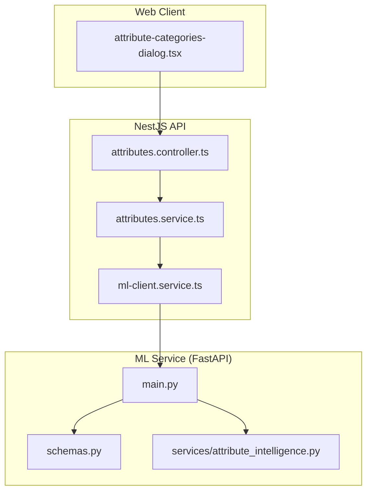
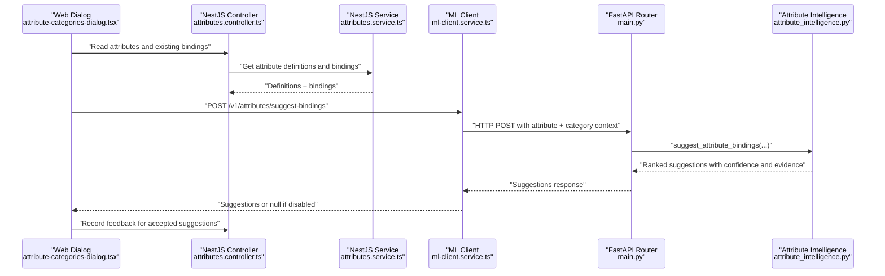
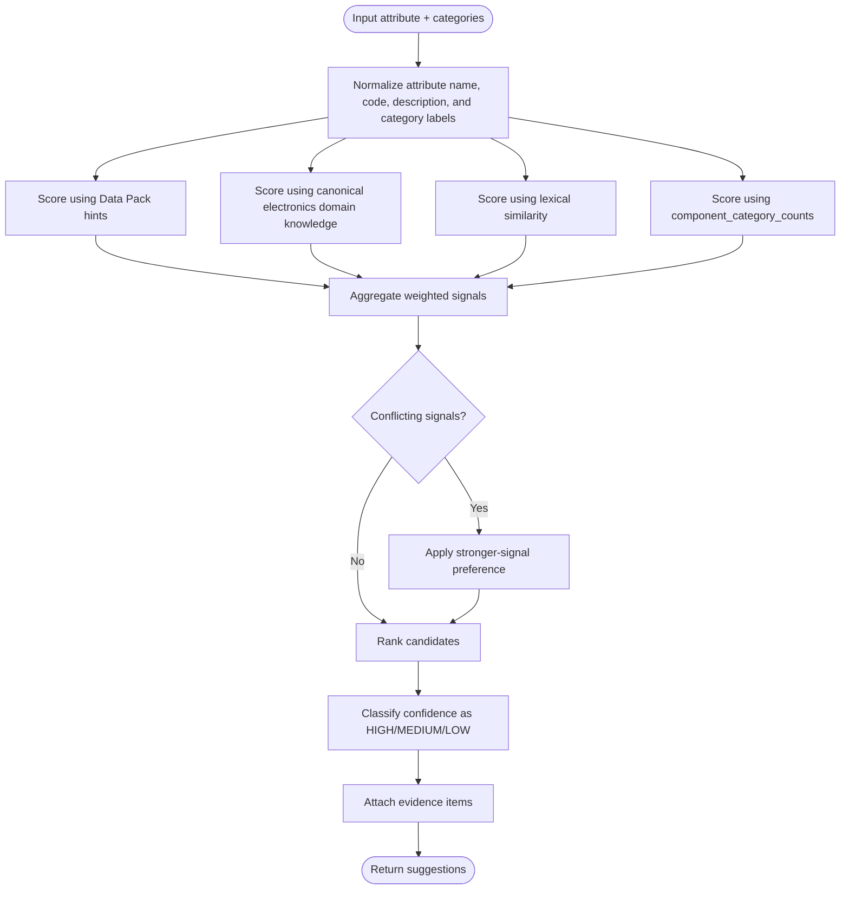
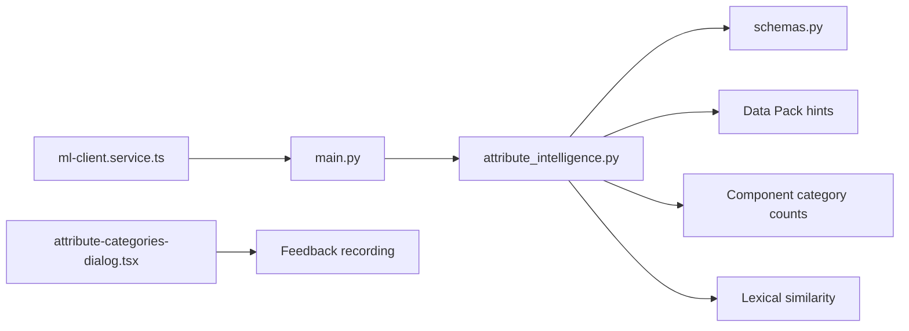

# Attribute Binding Suggestions

<cite>
**Referenced Files in This Document**
- [main.py](file://apps/ml/app/main.py)
- [schemas.py](file://apps/ml/app/schemas.py)
- [attribute_intelligence.py](file://apps/ml/app/services/attribute_intelligence.py)
- [ml-client.service.ts](file://apps/api/src/ml/ml-client.service.ts)
- [attributes.controller.ts](file://apps/api/src/attributes/attributes.controller.ts)
- [attributes.service.ts](file://apps/api/src/attributes/attributes.service.ts)
- [attribute-categories-dialog.tsx](file://apps/web/components/attributes/attribute-categories-dialog.tsx)
</cite>

## Table of Contents
1. [Introduction](#introduction)
2. [Project Structure](#project-structure)
3. [Core Components](#core-components)
4. [Architecture Overview](#architecture-overview)
5. [Detailed Component Analysis](#detailed-component-analysis)
6. [Dependency Analysis](#dependency-analysis)
7. [Performance Considerations](#performance-considerations)
8. [Troubleshooting Guide](#troubleshooting-guide)
9. [Conclusion](#conclusion)

## Introduction
This document explains the attribute binding suggestion system that recommends which ERP categories should be bound to a given attribute definition. It focuses on the `/v1/attributes/suggest-bindings` endpoint, how it analyzes attribute names, codes, descriptions, data types, unit categories, and category taxonomies, and how it produces ranked suggestions with confidence levels and evidence items.

The system is split across:
- A NestJS API client that prepares requests and forwards them to the ML service.
- A FastAPI ML service that exposes `/v1/attributes/suggest-bindings`.
- An attribute intelligence service that implements the scoring algorithm.
- Web UI components that consume suggestions and record feedback.

## Project Structure
The relevant parts for attribute binding suggestions are:



**Diagram sources**
- [attribute-categories-dialog.tsx:361-402](file://apps/web/components/attributes/attribute-categories-dialog.tsx#L361-L402)
- [attributes.controller.ts:74-139](file://apps/api/src/attributes/attributes.controller.ts#L74-L139)
- [attributes.service.ts:66-96](file://apps/api/src/attributes/attributes.service.ts#L66-L96)
- [ml-client.service.ts:457-506](file://apps/api/src/ml/ml-client.service.ts#L457-L506)
- [main.py:262-274](file://apps/ml/app/main.py#L262-L274)
- [schemas.py:359-380](file://apps/ml/app/schemas.py#L359-L380)

**Section sources**
- [main.py:262-274](file://apps/ml/app/main.py#L262-L274)
- [schemas.py:359-380](file://apps/ml/app/schemas.py#L359-L380)
- [ml-client.service.ts:457-506](file://apps/api/src/ml/ml-client.service.ts#L457-L506)

## Core Components
- **SuggestAttributeBindingsRequest**: Defines the input payload for `/v1/attributes/suggest-bindings`, including attribute metadata, available categories, Data Pack hints, and inventory component counts.
- **AttributeBindingSuggestion**: Defines each suggested category binding, including numeric confidence, categorical confidence level, reason text, evidence items, and model version.
- **EvidenceItem**: Describes why a signal was produced, including type, description, weight, optional source, page/text for datasheet-derived signals, and section context.
- **MlClientService.suggestAttributeBindings**: The NestJS-side HTTP client that calls the ML service endpoint and returns suggestions or `null` when the ML feature is disabled or the call fails.
- **AttributesController / AttributesService**: Provide the broader attribute library surface; they do not directly implement suggest-bindings but expose related binding operations used by the UI and review flows.

**Section sources**
- [schemas.py:359-380](file://apps/ml/app/schemas.py#L359-L380)
- [schemas.py:4-20](file://apps/ml/app/schemas.py#L4-L20)
- [ml-client.service.ts:457-506](file://apps/api/src/ml/ml-client.service.ts#L457-L506)
- [attributes.controller.ts:74-139](file://apps/api/src/attributes/attributes.controller.ts#L74-L139)
- [attributes.service.ts:66-96](file://apps/api/src/attributes/attributes.service.ts#L66-L96)

## Architecture Overview
The request/response flow for attribute binding suggestions is:



**Diagram sources**
- [attribute-categories-dialog.tsx:361-402](file://apps/web/components/attributes/attribute-categories-dialog.tsx#L361-L402)
- [attributes.controller.ts:74-139](file://apps/api/src/attributes/attributes.controller.ts#L74-L139)
- [attributes.service.ts:66-96](file://apps/api/src/attributes/attributes.service.ts#L66-L96)
- [ml-client.service.ts:457-506](file://apps/api/src/ml/ml-client.service.ts#L457-L506)
- [main.py:262-274](file://apps/ml/app/main.py#L262-L274)

## Detailed Component Analysis

### Request Schema for `/v1/attributes/suggest-bindings`
The ML service expects:
- `attributeName`: Human-readable attribute name.
- `attributeCode`: Stable machine-friendly code.
- `description`: Optional human-readable explanation of the attribute.
- `dataType`: Optional data type hint such as TEXT, NUMBER, SELECT, etc.
- `unitCategory`: Optional unit category hint for quantity-like attributes.
- `categories`: List of candidate ERP categories with `id`, `code`, and `name`.
- `datapack_hints`: Optional Data Pack intelligence hints that can bias matching toward known terminology, aliases, expected attributes, manufacturer patterns, and electrical unit hints.
- `component_category_counts`: Optional map from category identifiers to inventory component counts, used to prefer categories where many components already exist.

These fields are defined by the Pydantic schema and passed through the FastAPI route into the attribute intelligence service.

**Section sources**
- [schemas.py:369-377](file://apps/ml/app/schemas.py#L369-L377)
- [main.py:262-274](file://apps/ml/app/main.py#L262-L274)

### Response Schema for `/v1/attributes/suggest-bindings`
The ML service returns:
- `suggestions`: Array of `AttributeBindingSuggestion`.
- Each suggestion includes:
  - `categoryId`, `categoryCode`, `categoryName`.
  - `confidence`: Numeric score.
  - `confidenceLevel`: One of `HIGH`, `MEDIUM`, or `LOW`.
  - `reason`: Human-readable explanation.
  - `evidence`: Array of `EvidenceItem`.
  - `modelVersion`: Version of the intelligence artifact that produced the result.

The NestJS ML client accepts this shape and returns either the suggestions array or `null` when the ML service is disabled or unavailable.

**Section sources**
- [schemas.py:359-367](file://apps/ml/app/schemas.py#L359-L367)
- [schemas.py:379-380](file://apps/ml/app/schemas.py#L379-L380)
- [ml-client.service.ts:457-506](file://apps/api/src/ml/ml-client.service.ts#L457-L506)

### Evidence Model
Each `EvidenceItem` describes one contributing signal:
- `type`: Signal origin, such as keyword match, Data Pack rule, classifier, datasheet parameter, or existing data.
- `description`: Human-readable explanation.
- `weight`: Relative importance of the signal.
- `source`: Optional source identifier.
- `page` and `text`: Optional datasheet provenance when the extractor located the signal in a document.
- `section`: Optional datasheet section label, such as an electrical characteristics section.

This structure lets clients explain why a particular category was suggested and whether the signal came from lexical matching, Data Pack knowledge, inventory usage, or datasheet extraction.

**Section sources**
- [schemas.py:4-20](file://apps/ml/app/schemas.py#L4-L20)

### Confidence Levels
Confidence levels are categorical summaries of underlying scores:
- `HIGH`: Strong agreement among multiple signals, such as Data Pack hints, canonical electronics domain knowledge, inventory distribution, and lexical similarity.
- `MEDIUM`: Moderate agreement or partial signals.
- `LOW`: Weak or ambiguous signals.

The exact threshold values are part of the scoring implementation inside the attribute intelligence service.

**Section sources**
- [schemas.py:359-367](file://apps/ml/app/schemas.py#L359-L367)

### Scoring Algorithm Overview
The `suggest_attribute_bindings` method evaluates candidate categories using several complementary signals:

1. **Data Pack hints**
   - Keywords, aliases, expected attributes, manufacturer patterns, package patterns, and electrical unit hints can increase confidence for categories that align with known domain knowledge.
   - Hints may also include category-level guidance such as expected attributes and common terminology.

2. **Canonical electronics domain knowledge**
   - Known mappings between attribute semantics and electronics categories influence the score. For example, resistance-related attributes are more likely to bind to resistor-related categories.

3. **Inventory component counts**
   - If `component_category_counts` is provided, categories with higher component counts receive a boost because they represent established usage in the organization’s inventory.

4. **Lexical similarity**
   - Similarity between the attribute name, code, description, and category name/code/path contributes to the score.
   - Normalization, tokenization, and alias handling affect how well mismatched naming conventions still match.

5. **Conflict resolution**
   - When signals disagree, the algorithm aggregates weighted evidence and selects the highest-scoring candidates.
   - Stronger signals such as explicit Data Pack rules or canonical mappings can override weaker lexical matches.

6. **Evidence generation**
   - For each suggestion, the algorithm records which signals contributed, their weights, and any supporting context such as datasheet pages or sections.



**Diagram sources**
- [attribute_intelligence.py:1-200](file://apps/ml/app/services/attribute_intelligence.py#L1-L200)
- [schemas.py:4-20](file://apps/ml/app/schemas.py#L4-L20)
- [schemas.py:359-380](file://apps/ml/app/schemas.py#L359-L380)

**Section sources**
- [attribute_intelligence.py:1-200](file://apps/ml/app/services/attribute_intelligence.py#L1-L200)
- [schemas.py:4-20](file://apps/ml/app/schemas.py#L4-L20)
- [schemas.py:359-380](file://apps/ml/app/schemas.py#L359-L380)

### Example Request and Response Schemas
Below are conceptual examples based on the documented schemas. They illustrate the structure rather than literal payloads.

**Example request body**
```json
{
  "attributeName": "Resistance",
  "attributeCode": "resistance",
  "description": "Nominal resistance value",
  "dataType": "NUMBER",
  "unitCategory": "ELECTRICAL",
  "categories": [
    { "id": "cat-1", "code": "RESISTORS", "name": "Resistors" },
    { "id": "cat-2", "code": "CAPACITORS", "name": "Capacitors" }
  ],
  "datapack_hints": [
    {
      "categoryCode": "RESISTORS",
      "keywords": ["ohm", "resistance"],
      "expectedAttributes": ["resistance", "tolerance"],
      "electricalUnitHints": { "resistance": ["ohm", "kilo-ohm", "mega-ohm"] }
    }
  ],
  "component_category_counts": {
    "cat-1": 1200,
    "cat-2": 300
  }
}
```

**Example response body**
```json
{
  "suggestions": [
    {
      "categoryId": "cat-1",
      "categoryCode": "RESISTORS",
      "categoryName": "Resistors",
      "confidence": 0.92,
      "confidenceLevel": "HIGH",
      "reason": "Strong Data Pack and lexical alignment with resistance-related terminology.",
      "evidence": [
        {
          "type": "data_pack_rule",
          "description": "Expected attribute 'resistance' matched for category RESISTORS.",
          "weight": 0.6,
          "source": "data-pack-resistors"
        },
        {
          "type": "keyword",
          "description": "Attribute name and description contain resistance-related keywords.",
          "weight": 0.3,
          "source": "lexical-match"
        }
      ],
      "modelVersion": "1.0.0"
    }
  ]
}
```

**Section sources**
- [schemas.py:369-380](file://apps/ml/app/schemas.py#L369-L380)
- [schemas.py:4-20](file://apps/ml/app/schemas.py#L4-L20)

### Edge Cases

#### Missing Data
- If `attributeCode`, `description`, `dataType`, or `unitCategory` are missing, the scorer falls back to what is available.
- If `categories` is empty, no meaningful suggestions can be produced.
- If `datapack_hints` is absent, Data Pack signals are omitted and lexical/inventory signals dominate.
- If `component_category_counts` is absent, inventory-based boosting is skipped.

The ML client handles network failures or disabled ML features by returning `null`, allowing callers to degrade gracefully.

**Section sources**
- [schemas.py:369-377](file://apps/ml/app/schemas.py#L369-L377)
- [ml-client.service.ts:457-506](file://apps/api/src/ml/ml-client.service.ts#L457-L506)

#### Conflicting Signals
- A strong Data Pack rule may override weak lexical similarity.
- High inventory counts may reinforce a category even when lexical signals are moderate.
- The algorithm aggregates evidence and applies stronger-signal preferences before ranking.

**Section sources**
- [attribute_intelligence.py:1-200](file://apps/ml/app/services/attribute_intelligence.py#L1-L200)

#### Performance Optimization for Large Category Sets
- The ML client uses a timeout when calling the ML service, preventing unbounded waits.
- The FastAPI router delegates to the attribute intelligence service, which should avoid unnecessary full scans by leveraging normalized keys, indexes, and precomputed hints.
- The web dialog records feedback asynchronously after accepting suggestions, avoiding blocking the user interface.

**Section sources**
- [ml-client.service.ts:457-506](file://apps/api/src/ml/ml-client.service.ts#L457-L506)
- [attribute-categories-dialog.tsx:361-402](file://apps/web/components/attributes/attribute-categories-dialog.tsx#L361-L402)

### Integration Points

#### NestJS ML Client
The NestJS ML client:
- Sends a POST request to `/v1/attributes/suggest-bindings`.
- Includes attribute metadata, categories, Data Pack hints, and component category counts.
- Returns suggestions or `null` when the ML service is disabled or the request fails.

**Section sources**
- [ml-client.service.ts:457-506](file://apps/api/src/ml/ml-client.service.ts#L457-L506)

#### FastAPI Route
The FastAPI route:
- Validates the request against `SuggestAttributeBindingsRequest`.
- Calls `attribute_intelligence_service.suggest_attribute_bindings`.
- Wraps results in `SuggestAttributeBindingsResponse`.

**Section sources**
- [main.py:262-274](file://apps/ml/app/main.py#L262-L274)
- [schemas.py:369-380](file://apps/ml/app/schemas.py#L369-L380)

#### Web Feedback Flow
The web dialog:
- Displays suggestions and allows users to accept high-confidence bindings.
- Records feedback for accepted suggestions so future training and calibration can improve accuracy.

**Section sources**
- [attribute-categories-dialog.tsx:361-402](file://apps/web/components/attributes/attribute-categories-dialog.tsx#L361-L402)

## Dependency Analysis
The attribute binding suggestion system depends on:
- Schema validation in the ML service.
- Data Pack hints for domain-specific guidance.
- Inventory usage data for popularity-based boosting.
- Lexical normalization and similarity logic.
- The NestJS ML client for cross-service communication.
- The web UI for user acceptance and feedback collection.



**Diagram sources**
- [attribute_intelligence.py:1-200](file://apps/ml/app/services/attribute_intelligence.py#L1-L200)
- [schemas.py:369-380](file://apps/ml/app/schemas.py#L369-L380)
- [ml-client.service.ts:457-506](file://apps/api/src/ml/ml-client.service.ts#L457-L506)
- [attribute-categories-dialog.tsx:361-402](file://apps/web/components/attributes/attribute-categories-dialog.tsx#L361-L402)

**Section sources**
- [attribute_intelligence.py:1-200](file://apps/ml/app/services/attribute_intelligence.py#L1-L200)
- [schemas.py:369-380](file://apps/ml/app/schemas.py#L369-L380)
- [ml-client.service.ts:457-506](file://apps/api/src/ml/ml-client.service.ts#L457-L506)
- [attribute-categories-dialog.tsx:361-402](file://apps/web/components/attributes/attribute-categories-dialog.tsx#L361-L402)

## Performance Considerations
- **Timeouts**: The ML client enforces a timeout for suggest-bindings calls to avoid hanging the caller.
- **Early exits**: When the ML service is disabled, the client returns `null` without making a network call.
- **Bounded inputs**: Callers should limit the number of candidate categories and avoid sending excessively large Data Pack payloads.
- **Caching**: Categories, Data Pack hints, and component counts should be cached at the API layer where appropriate to reduce repeated computation.
- **Asynchronous feedback**: The web UI records feedback without blocking the main interaction path.

[No sources needed since this section provides general guidance]

## Troubleshooting Guide
Common issues and resolutions:

- **No suggestions returned**
  - Check whether the ML service is enabled.
  - Verify that `categories` is populated.
  - Ensure `attributeName` or `attributeCode` is present.
  - Inspect logs from the ML client for fetch errors.

- **Low confidence across all categories**
  - Add Data Pack hints for better domain alignment.
  - Improve attribute naming and description clarity.
  - Review whether inventory counts reflect real usage.

- **Incorrect binding despite strong lexical match**
  - Check for conflicting Data Pack rules or canonical mappings.
  - Review evidence items to understand which signals dominated.
  - Adjust Data Pack hints or canonical knowledge if necessary.

- **Slow responses**
  - Reduce the number of candidate categories.
  - Cache category lists and Data Pack hints.
  - Monitor ML service timeouts and capacity.

**Section sources**
- [ml-client.service.ts:457-506](file://apps/api/src/ml/ml-client.service.ts#L457-L506)
- [schemas.py:4-20](file://apps/ml/app/schemas.py#L4-L20)
- [schemas.py:369-380](file://apps/ml/app/schemas.py#L369-L380)

## Conclusion
The attribute binding suggestion system combines Data Pack hints, canonical electronics domain knowledge, inventory usage, and lexical similarity to recommend category bindings for attributes. It exposes a clear request/response contract through `/v1/attributes/suggest-bindings`, provides interpretable evidence for each suggestion, and integrates with the NestJS API and web UI for practical use. Proper handling of missing data, conflicting signals, and performance constraints ensures reliable operation across small and large category sets.

[No sources needed since this section summarizes without analyzing specific files]