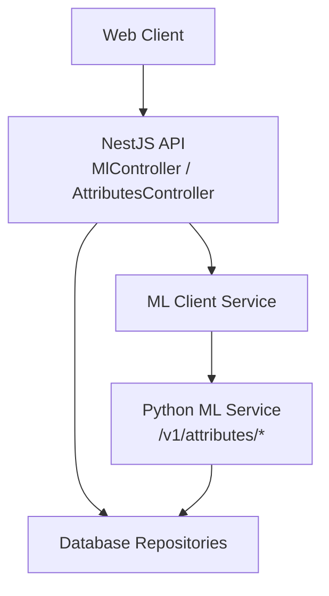
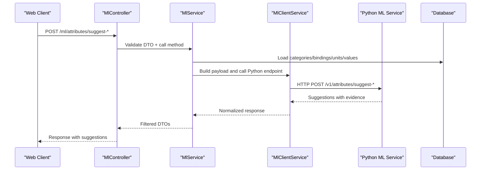
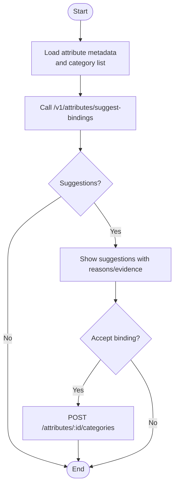
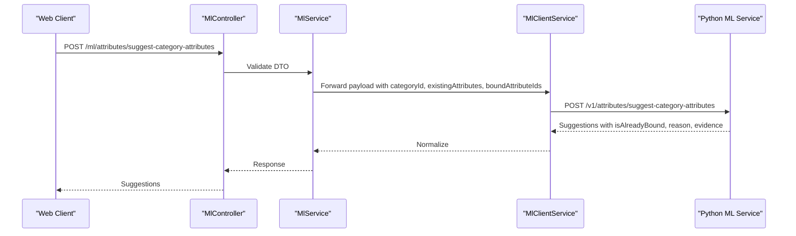
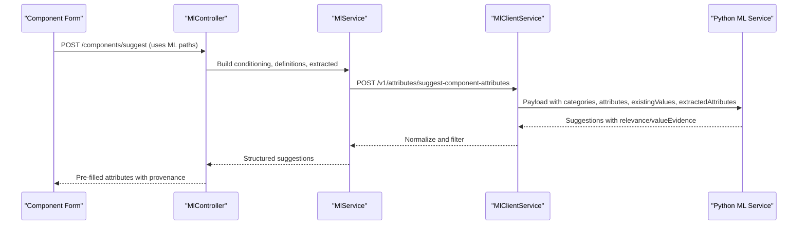
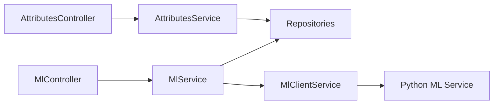

# Attribute Intelligence

<cite>
**Referenced Files in This Document**
- [ml.controller.ts](file://apps/api/src/ml/ml.controller.ts)
- [ml.service.ts](file://apps/api/src/ml/ml.service.ts)
- [ml-client.service.ts](file://apps/api/src/ml/ml-client.service.ts)
- [dtos.ts](file://apps/api/src/ml/dtos.ts)
- [main.py](file://apps/ml/app/main.py)
- [attribute-intelligence-audit.service.ts](file://apps/api/src/ml/attribute-findings/attribute-intelligence-audit.service.ts)
- [attributes.controller.ts](file://apps/api/src/attributes/attributes.controller.ts)
- [attributes.service.ts](file://apps/api/src/attributes/attributes.service.ts)
- [attribute-categories-dialog.tsx](file://apps/web/components/attributes/attribute-categories-dialog.tsx)
- [attributes-api.ts](file://apps/web/lib/api/attributes-api.ts)
</cite>

## Table of Contents
1. Introduction
2. Project Structure
3. Core Components
4. Architecture Overview
5. Detailed Component Analysis
6. Dependency Analysis
7. Performance Considerations
8. Troubleshooting Guide
9. Conclusion

## Introduction
This document explains the attribute intelligence capabilities exposed by the API and implemented across the NestJS service layer and the Python ML service. It covers:
- Attribute binding suggestions for an attribute definition across categories
- Category attribute recommendations to propose which attributes should be bound to a category
- Component attribute extraction and relevance suggestions when creating or editing components
- Enum value suggestion system for select/multi-select attributes
- Duplicate detection for attribute definitions
- Attribute library audit functionality that analyzes usage patterns and identifies issues
- Practical integration guidance for component creation workflows, datasheet text extraction, and attribute configuration management
- Performance considerations and troubleshooting advice for suggestion quality

## Project Structure
The attribute intelligence feature spans three layers:
- API surface (NestJS): Controllers expose endpoints guarded by permissions; services orchestrate calls to repositories and the ML client.
- ML client (NestJS): Forwards requests to the Python ML service and normalizes responses.
- ML service (Python): Implements models and rules for suggestions, duplicates, enum values, and audits.

**Diagram sources**
- [ml.controller.ts:190-248](file://apps/api/src/ml/ml.controller.ts#L190-L248)
- [ml-client.service.ts:457-568](file://apps/api/src/ml/ml-client.service.ts#L457-L568)
- [main.py:262-361](file://apps/ml/app/main.py#L262-L361)
- [attributes.controller.ts:70-209](file://apps/api/src/attributes/attributes.controller.ts#L70-L209)

**Section sources**
- [ml.controller.ts:190-248](file://apps/api/src/ml/ml.controller.ts#L190-L248)
- [ml-client.service.ts:457-568](file://apps/api/src/ml/ml-client.service.ts#L457-L568)
- [main.py:262-361](file://apps/ml/app/main.py#L262-L361)
- [attributes.controller.ts:70-209](file://apps/api/src/attributes/attributes.controller.ts#L70-L209)

## Core Components
- MlController: Exposes attribute intelligence endpoints with appropriate guards.
- MlService: Orchestrates data loading, builds payloads, filters results, and returns structured DTOs.
- MlClientService: Calls the Python ML service endpoints with timeouts and error handling.
- Python main.py: Defines routes for suggest-bindings, suggest-category-attributes, suggest-component-attributes, detect-duplicates, suggest-enum-values, and audit.
- AttributesController/AttributesService: Provide authoritative read/write surfaces for attribute definitions, category bindings, options, and component attribute values.

Key responsibilities:
- Suggest attribute bindings for an attribute definition based on category context and metadata.
- Recommend category attributes using existing bindings, datapack hints, and category counts.
- Suggest component attributes by combining catalog, bindings, extracted datasheet values, and existing values.
- Detect duplicate attribute definitions by name/code similarity and usage signals.
- Suggest enum options for select-type attributes.
- Audit the attribute library to find duplicates, suspicious bindings, missing expected attributes, unused attributes, and inconsistent configurations.

**Section sources**
- [ml.controller.ts:190-248](file://apps/api/src/ml/ml.controller.ts#L190-L248)
- [ml.service.ts:1200-1456](file://apps/api/src/ml/ml.service.ts#L1200-L1456)
- [ml-client.service.ts:457-568](file://apps/api/src/ml/ml-client.service.ts#L457-L568)
- [main.py:262-361](file://apps/ml/app/main.py#L262-L361)
- [attributes.controller.ts:70-209](file://apps/api/src/attributes/attributes.controller.ts#L70-L209)
- [attributes.service.ts:65-96](file://apps/api/src/attributes/attributes.service.ts#L65-L96)

## Architecture Overview
The request flow for attribute intelligence is layered:
- The web client calls NestJS endpoints under /ml/attributes/* or uses attribute management endpoints.
- The controller validates input via DTOs and applies guards.
- The service composes context (categories, bindings, units, existing values) and calls the ML client.
- The ML client forwards to the Python service, which runs model logic and returns suggestions.
- Results are filtered and normalized before being returned to the client.

**Diagram sources**
- [ml.controller.ts:190-248](file://apps/api/src/ml/ml.controller.ts#L190-L248)
- [ml.service.ts:1260-1361](file://apps/api/src/ml/ml.service.ts#L1260-L1361)
- [ml-client.service.ts:457-568](file://apps/api/src/ml/ml-client.service.ts#L457-L568)
- [main.py:262-361](file://apps/ml/app/main.py#L262-L361)

## Detailed Component Analysis

### Attribute Binding Suggestions
Purpose:
- Given an attribute definition (name, code, description, dataType, unitCategory), suggest which categories it should be bound to.

API:
- Endpoint: POST /ml/attributes/suggest-bindings
- Guard: MlReadGuard
- Request schema: See SuggestAttributeBindingsDto
- Response schema: See SuggestAttributeBindingsResponseDto

Business logic:
- The NestJS controller delegates to MlService, which forwards to the Python service via MlClientService.
- The Python route accepts attribute metadata and category list, then returns ranked suggestions with confidence levels and evidence.
- The client can accept a suggested binding and persist it through attribute management endpoints.

Integration example:
- In the Manage Attributes dialog, after selecting an attribute, call suggest-bindings concurrently with loading current bindings and available categories. Accept a suggestion to bind a category, then call the binding endpoint to persist.

**Diagram sources**
- [ml.controller.ts:194-200](file://apps/api/src/ml/ml.controller.ts#L194-L200)
- [ml-client.service.ts:457-506](file://apps/api/src/ml/ml-client.service.ts#L457-L506)
- [main.py:262-274](file://apps/ml/app/main.py#L262-L274)
- [attributes.controller.ts:113-120](file://apps/api/src/attributes/attributes.controller.ts#L113-L120)
- [attribute-categories-dialog.tsx:110-145](file://apps/web/components/attributes/attribute-categories-dialog.tsx#L110-L145)

**Section sources**
- [ml.controller.ts:194-200](file://apps/api/src/ml/ml.controller.ts#L194-L200)
- [ml-client.service.ts:457-506](file://apps/api/src/ml/ml-client.service.ts#L457-L506)
- [main.py:262-274](file://apps/ml/app/main.py#L262-L274)
- [attributes.controller.ts:113-120](file://apps/api/src/attributes/attributes.controller.ts#L113-L120)
- [attribute-categories-dialog.tsx:110-145](file://apps/web/components/attributes/attribute-categories-dialog.tsx#L110-L145)

### Category Attribute Recommendations
Purpose:
- Propose which attribute definitions should be bound to a given category, considering existing bindings, datapack hints, and category component counts.

API:
- Endpoint: POST /ml/attributes/suggest-category-attributes
- Guard: MlReadGuard
- Request schema: See SuggestCategoryAttributesDto
- Response schema: See SuggestCategoryAttributesResponseDto

Business logic:
- The service loads resolved category bindings and sends them along with category context to the Python service.
- The Python service returns candidate attributes with confidence, whether already bound, and evidence.

Integration example:
- When editing a category’s specifications, call this endpoint to propose new attributes. Accept suggestions and persist via assign-category-attribute.

**Diagram sources**
- [ml.controller.ts:202-208](file://apps/api/src/ml/ml.controller.ts#L202-L208)
- [ml-client.service.ts:570-626](file://apps/api/src/ml/ml-client.service.ts#L570-L626)
- [main.py:276-287](file://apps/ml/app/main.py#L276-L287)

**Section sources**
- [ml.controller.ts:202-208](file://apps/api/src/ml/ml.controller.ts#L202-L208)
- [ml-client.service.ts:570-626](file://apps/api/src/ml/ml-client.service.ts#L570-L626)
- [main.py:276-287](file://apps/ml/app/main.py#L276-L287)

### Component Attribute Extraction and Relevance
Purpose:
- Determine which attributes are relevant for a specific component and suggest values based on datasheet extraction, category bindings, and existing values.

API:
- Endpoint: POST /ml/attributes/suggest-component-attributes (via MlClientService)
- Guard: MlReadGuard (through the component suggestion path)
- Request schema: Built from SuggestComponentDto and related structures
- Response schema: Array of component attribute suggestions with relevance and value evidence

Business logic:
- The service loads category bindings, attribute definitions, units, and existing values, then calls the Python service with the full context.
- The Python service returns suggestions only for active, known attributes, attaching relevance and value evidence.

Integration example:
- During component creation/editing, send query, part number, description, datasheetText, categories, attributes, boundAttributeIds, existingValues, and extractedAttributes. Use the returned suggestions to prefill fields and show “why” explanations.

**Diagram sources**
- [ml.service.ts:1260-1361](file://apps/api/src/ml/ml.service.ts#L1260-L1361)
- [ml-client.service.ts:514-568](file://apps/api/src/ml/ml-client.service.ts#L514-L568)
- [main.py:289-313](file://apps/ml/app/main.py#L289-L313)

**Section sources**
- [ml.service.ts:1260-1361](file://apps/api/src/ml/ml.service.ts#L1260-L1361)
- [ml-client.service.ts:514-568](file://apps/api/src/ml/ml-client.service.ts#L514-L568)
- [main.py:289-313](file://apps/ml/app/main.py#L289-L313)

### Enum Value Suggestion System
Purpose:
- Suggest new option codes and labels for select/multi-select attributes based on observed usage and patterns.

API:
- Endpoint: POST /ml/attributes/suggest-enum-values
- Guard: MlReadGuard
- Request schema: See SuggestEnumValuesDto
- Response schema: See SuggestEnumValuesResponseDto

Business logic:
- The Python route receives attributeCode, attributeName, and existingOptions, then returns suggested options with source and confidence.
- The web client can present these as candidates to add to the attribute’s options.

Practical usage:
- When editing an attribute with many free-form values, call this endpoint to propose canonical options. After acceptance, persist via create/update attribute option endpoints.

**Section sources**
- [ml.controller.ts:226-232](file://apps/api/src/ml/ml.controller.ts#L226-L232)
- [dtos.ts:547-578](file://apps/api/src/ml/dtos.ts#L547-L578)
- [main.py:341-349](file://apps/ml/app/main.py#L341-L349)

### Duplicate Detection for Attributes
Purpose:
- Identify potential duplicate attribute definitions by name/code similarity and usage signals, and suggest aliases to consolidate.

API:
- Endpoint: POST /ml/attributes/detect-duplicates
- Guard: MlReadGuard
- Request schema: See DetectAttributeDuplicatesDto
- Response schema: See DetectAttributeDuplicatesResponseDto

Business logic:
- The Python service compares the provided name/code against existing attributes and returns matches with similarity, usage count, bound categories, and suggested aliases.

Integration example:
- Before creating a new attribute, call detect-duplicates to warn about possible duplicates and propose aliasing strategies.

**Section sources**
- [ml.controller.ts:218-224](file://apps/api/src/ml/ml.controller.ts#L218-L224)
- [dtos.ts:509-545](file://apps/api/src/ml/dtos.ts#L509-L545)
- [main.py:325-339](file://apps/ml/app/main.py#L325-L339)

### Attribute Library Audit
Purpose:
- Analyze the entire attribute library to identify issues such as duplicates, suspicious bindings, missing expected attributes, unused attributes, and inconsistent configurations.

API:
- Endpoint: POST /ml/attributes/audit (legacy compute-only route)
- Guard: MlReadGuard
- Response schema: See AuditAttributeLibraryResponseDto

Business logic:
- The service runs either the Python model-based audit or a deterministic in-process implementation, depending on availability.
- A separate orchestration service persists findings into the review queue, normalizes issues, and reconciles stale findings.

Operational notes:
- The audit is expensive; use it periodically rather than per-request.
- Findings include severity, confidence, and evidence to guide reviewer actions.

**Section sources**
- [ml.controller.ts:234-248](file://apps/api/src/ml/ml.controller.ts#L234-L248)
- [attribute-intelligence-audit.service.ts:76-142](file://apps/api/src/ml/attribute-findings/attribute-intelligence-audit.service.ts#L76-L142)
- [attribute-intelligence-audit.service.ts:153-234](file://apps/api/src/ml/attribute-findings/attribute-intelligence-audit.service.ts#L153-L234)
- [dtos.ts:580-618](file://apps/api/src/ml/dtos.ts#L580-L618)

### Managing Attribute Configurations
Purpose:
- Create, update, and manage attribute definitions, options, category bindings, and component attribute values.

Key endpoints:
- Definition CRUD: GET/POST/PUT/DELETE /attributes
- Options: POST/DELETE /attributes/:id/options
- Category bindings: GET/POST/PUT/DELETE /attributes/:id/categories
- Category attributes: GET/POST/DELETE /categories/:categoryId/attributes
- Component attributes: GET/POST/DELETE /components/:componentId/attributes

Business logic:
- The service enforces validation, populates display values, and supports provenance tracking for non-human values.
- Resolved category attributes consider inheritance and nearest-binding precedence.

**Section sources**
- [attributes.controller.ts:74-209](file://apps/api/src/attributes/attributes.controller.ts#L74-L209)
- [attributes.service.ts:98-671](file://apps/api/src/attributes/attributes.service.ts#L98-L671)
- [attributes-api.ts:65-115](file://apps/web/lib/api/attributes-api.ts#L65-L115)

## Dependency Analysis
- Controllers depend on services for business logic and on DTOs for validation.
- Services depend on repositories for data access and on MlClientService for ML calls.
- MlClientService depends on the Python ML service endpoints.
- Python routes delegate to attribute intelligence services for modeling and rule execution.

**Diagram sources**
- [ml.controller.ts:190-248](file://apps/api/src/ml/ml.controller.ts#L190-L248)
- [ml.service.ts:1260-1361](file://apps/api/src/ml/ml.service.ts#L1260-L1361)
- [ml-client.service.ts:457-568](file://apps/api/src/ml/ml-client.service.ts#L457-L568)
- [attributes.controller.ts:70-209](file://apps/api/src/attributes/attributes.controller.ts#L70-L209)
- [attributes.service.ts:65-96](file://apps/api/src/attributes/attributes.service.ts#L65-L96)

**Section sources**
- [ml.controller.ts:190-248](file://apps/api/src/ml/ml.controller.ts#L190-L248)
- [ml.service.ts:1260-1361](file://apps/api/src/ml/ml.service.ts#L1260-L1361)
- [ml-client.service.ts:457-568](file://apps/api/src/ml/ml-client.service.ts#L457-L568)
- [attributes.controller.ts:70-209](file://apps/api/src/attributes/attributes.controller.ts#L70-L209)
- [attributes.service.ts:65-96](file://apps/api/src/attributes/attributes.service.ts#L65-L96)

## Performance Considerations
- Batched ML calls: The service consolidates category bindings, definitions, and extracted attributes into a single ML call to avoid N+1 queries.
- Timeouts and resilience: The ML client uses timeouts and treats failures as best-effort; suggestions degrade gracefully if the ML service is unavailable.
- Expensive operations: The audit endpoint recomputes across the library; schedule it off-peak and cache results where possible.
- Data minimization: Only existing values with content are sent to the ML service to reduce payload size.
- Indexing: Binding lookups and resolved category bindings are optimized with in-memory maps and batched queries.

[No sources needed since this section provides general guidance]

## Troubleshooting Guide
Common issues and resolutions:
- No suggestions returned:
  - Check that categories and bindings are loaded and passed correctly.
  - Verify the ML service is enabled and reachable; health endpoint confirms status.
  - Ensure attribute definitions are active and known to the catalog.
- Low confidence or irrelevant suggestions:
  - Review evidence fields to understand why a suggestion was made.
  - Improve category bindings and datapack hints to provide stronger signals.
  - Add or refine attribute aliases and options to improve matching.
- Datasheet extraction problems:
  - If extraction fails, the analysis records a failure and returns no findings; retry with corrected documents or updated extractor version.
- Duplicate detection false positives:
  - Adjust threshold and review suggested aliases; merge duplicates where appropriate.
- Audit performance:
  - Run during low-traffic windows; monitor executionTimeMs in responses.

**Section sources**
- [ml.controller.ts:97-110](file://apps/api/src/ml/ml.controller.ts#L97-L110)
- [ml-client.service.ts:457-506](file://apps/api/src/ml/ml-client.service.ts#L457-L506)
- [documentation-analysis.service.ts:283-313](file://apps/api/src/ml/documentation-analysis.service.ts#L283-L313)
- [ml.service.ts:1260-1361](file://apps/api/src/ml/ml.service.ts#L1260-L1361)

## Conclusion
Attribute intelligence integrates category bindings, component attributes, and datasheet extraction to streamline master data creation and maintenance. The API exposes clear endpoints for binding suggestions, category attribute recommendations, component attribute relevance, enum value suggestions, duplicate detection, and library audits. By leveraging evidence-rich responses and provenance tracking, teams can confidently automate attribute configuration while maintaining control over changes. Follow the integration examples and performance guidelines to achieve reliable, scalable results.