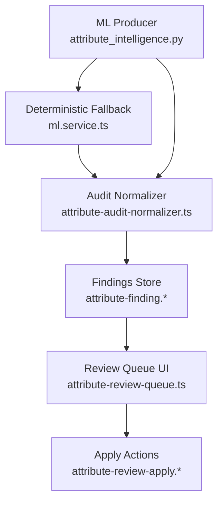
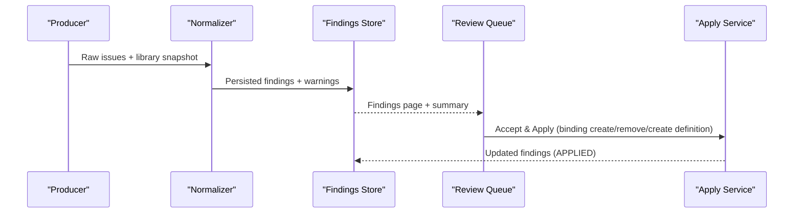

# Attribute Library Audit

<cite>
**Referenced Files in This Document**
- [attribute-audit-normalizer.ts](file://apps/api/src/ml/attribute-findings/attribute-audit-normalizer.ts)
- [attribute-finding.dtos.ts](file://apps/api/src/ml/attribute-findings/attribute-finding.dtos.ts)
- [attribute-finding-expected-state.ts](file://apps/api/src/ml/attribute-findings/attribute-finding-expected-state.ts)
- [ml.service.ts](file://apps/api/src/ml/ml.service.ts)
- [attribute-intelligence-audit.service.ts](file://apps/api/src/ml/attribute-findings/attribute-intelligence-audit.service.ts)
- [attribute-review-queue.ts](file://apps/web/lib/attribute-review-queue.ts)
- [attribute_intelligence.py](file://apps/ml/app/services/attribute_intelligence.py)
</cite>

## Table of Contents
1. [Introduction](#introduction)
2. [Project Structure](#project-structure)
3. [Core Components](#core-components)
4. [Architecture Overview](#architecture-overview)
5. [Detailed Component Analysis](#detailed-component-analysis)
6. [Dependency Analysis](#dependency-analysis)
7. [Performance Considerations](#performance-considerations)
8. [Troubleshooting Guide](#troubleshooting-guide)
9. [Conclusion](#conclusion)

## Introduction
This document explains the attribute library audit functionality that analyzes attribute usage patterns and identifies quality issues across the attribute library. It covers how the system detects missing expected attributes, unused attributes, and inconsistencies such as suspicious or inconsistent bindings. It also documents the audit report generation process, issue classification, severity handling, remediation recommendations, normalization of attribute names and codes, and how audit results integrate with the attribute review workflow for continuous improvement.

## Project Structure
The audit pipeline spans multiple layers:
- ML producer (Python) and deterministic fallback (TypeScript) generate raw audit issues.
- A normalizer converts producer issues into standardized findings with canonical types, categories, and suggested actions.
- Findings are persisted and exposed through a review queue UI where reviewers can accept, reject, dismiss, or apply changes to the attribute library.

**Diagram sources**
- [attribute_intelligence.py:1378-1411](file://apps/ml/app/services/attribute_intelligence.py#L1378-L1411)
- [ml.service.ts:3078-3296](file://apps/api/src/ml/ml.service.ts#L3078-L3296)
- [attribute-audit-normalizer.ts:117-168](file://apps/api/src/ml/attribute-findings/attribute-audit-normalizer.ts#L117-L168)
- [attribute-finding.dtos.ts:109-133](file://apps/api/src/ml/attribute-findings/attribute-finding.dtos.ts#L109-L133)
- [attribute-review-queue.ts:71-80](file://apps/web/lib/attribute-review-queue.ts#L71-L80)

**Section sources**
- [attribute_intelligence.py:1378-1411](file://apps/ml/app/services/attribute_intelligence.py#L1378-L1411)
- [ml.service.ts:3078-3296](file://apps/api/src/ml/ml.service.ts#L3078-L3296)
- [attribute-audit-normalizer.ts:117-168](file://apps/api/src/ml/attribute-findings/attribute-audit-normalizer.ts#L117-L168)
- [attribute-finding.dtos.ts:109-133](file://apps/api/src/ml/attribute-findings/attribute-finding.dtos.ts#L109-L133)
- [attribute-review-queue.ts:71-80](file://apps/web/lib/attribute-review-queue.ts#L71-L80)

## Core Components
- Issue taxonomy and categories define the canonical set of finding types and groupings used by both backend and frontend.
- The normalizer maps producer issues to persisted findings, standardizes titles, evidence, and suggested values, and resolves subjects against the authoritative library index.
- Expected state snapshots capture the exact context at analysis time and enable staleness detection when live data changes.
- The review queue presents findings grouped by tabs, supports filtering, and exposes apply actions for binding changes and definition creation.

Key responsibilities:
- Detecting missing expected attributes per category.
- Identifying unused attributes not referenced by components or categories.
- Flagging suspicious or inconsistent bindings between attributes and categories.
- Normalizing attribute codes and names for consistent matching and reporting.
- Integrating findings into the review workflow for human-in-the-loop remediation.

**Section sources**
- [attribute-finding.dtos.ts:109-133](file://apps/api/src/ml/attribute-findings/attribute-finding.dtos.ts#L109-L133)
- [attribute-audit-normalizer.ts:117-168](file://apps/api/src/ml/attribute-findings/attribute-audit-normalizer.ts#L117-L168)
- [attribute-finding-expected-state.ts:57-72](file://apps/api/src/ml/attribute-findings/attribute-finding-expected-state.ts#L57-L72)
- [attribute-review-queue.ts:71-80](file://apps/web/lib/attribute-review-queue.ts#L71-L80)

## Architecture Overview
The audit architecture is a producer-normalizer-persist-consumer pipeline:
- Producers: Python model-based auditor and a TypeScript deterministic fallback produce raw issues with confidence and evidence.
- Normalization: Converts raw issues into standardized findings with canonical types, categories, subject references, and suggested actions.
- Persistence: Findings are stored with current and suggested states, confidence levels, and metadata for later review and application.
- Review: The web queue surfaces findings by type and category, enabling decisions and applied changes to the attribute library.

**Diagram sources**
- [attribute_intelligence.py:1378-1411](file://apps/ml/app/services/attribute_intelligence.py#L1378-L1411)
- [ml.service.ts:3078-3296](file://apps/api/src/ml/ml.service.ts#L3078-L3296)
- [attribute-audit-normalizer.ts:117-168](file://apps/api/src/ml/attribute-findings/attribute-audit-normalizer.ts#L117-L168)
- [attribute-finding.dtos.ts:367-404](file://apps/api/src/ml/attribute-findings/attribute-finding.dtos.ts#L367-L404)
- [attribute-review-queue.ts:601-650](file://apps/web/lib/attribute-review-queue.ts#L601-L650)

## Detailed Component Analysis

### Issue Taxonomy and Classification
The canonical taxonomy defines:
- Identity issues: duplicates and possible duplicates.
- Binding issues: suggested bindings, missing expected attributes, suspicious bindings.
- Config issues: inconsistent configuration.
- Enum issues: suggested enum values.
- Usage issues: unused attributes.

These types map to categories and drive UI tabs and filters.

Example classifications:
- MISSING_EXPECTED_ATTRIBUTE: Category-first expectation indicating a category should carry a standard attribute; may be category-only if the attribute does not exist yet.
- UNUSED_ATTRIBUTE: Definition has zero component values and zero category bindings.
- SUSPICIOUS_BINDING: Existing binding looks wrong for its category; suggested action is to remove the binding.

**Section sources**
- [attribute-finding.dtos.ts:109-133](file://apps/api/src/ml/attribute-findings/attribute-finding.dtos.ts#L109-L133)
- [attribute-review-queue.ts:71-80](file://apps/web/lib/attribute-review-queue.ts#L71-L80)

### Missing Expected Attributes Detection
Detection occurs via producers that compare category expectations against existing bindings and definitions:
- The Python producer scans categories and attributes to identify gaps where a category lacks a standard attribute.
- The deterministic fallback performs similar checks using normalized codes and names.

Normalization ensures canonical codes are compared consistently, and the normalizer persists findings with expected state snapshots so they can be re-evaluated later.

Remediation options:
- Bind an existing attribute to the category.
- Create a new attribute definition and bind it to the category.

**Section sources**
- [attribute_intelligence.py:1378-1411](file://apps/ml/app/services/attribute_intelligence.py#L1378-L1411)
- [ml.service.ts:3078-3296](file://apps/api/src/ml/ml.service.ts#L3078-L3296)
- [attribute-audit-normalizer.ts:348-484](file://apps/api/src/ml/attribute-findings/attribute-audit-normalizer.ts#L348-L484)
- [attribute-finding-expected-state.ts:221-236](file://apps/api/src/ml/attribute-findings/attribute-finding-expected-state.ts#L221-L236)

### Unused Attributes Detection
Unused attributes are identified when:
- An attribute definition has no component values in the inventory ledger.
- The attribute has no direct category bindings.

The fallback implementation counts usage and bindings and emits UNUSED_ATTRIBUTE findings with medium confidence and supporting evidence.

Remediation:
- Review whether the attribute is still needed.
- Remove or archive the definition if truly unused.

**Section sources**
- [ml.service.ts:3262-3296](file://apps/api/src/ml/ml.service.ts#L3262-L3296)
- [attribute-audit-normalizer.ts:486-561](file://apps/api/src/ml/attribute-findings/attribute-audit-normalizer.ts#L486-L561)
- [attribute-finding-expected-state.ts:238-260](file://apps/api/src/ml/attribute-findings/attribute-finding-expected-state.ts#L238-L260)

### Inconsistent or Suspicious Bindings
Inconsistent or suspicious bindings occur when:
- An attribute is bound to a category but usage patterns or domain knowledge suggest the binding is incorrect.
- The attribute’s usage count is low or absent relative to category expectations.

The fallback flags these as SUSPICIOUS_BINDING with a suggested REMOVE_BINDING action.

Remediation:
- Remove the binding if it is indeed inconsistent.
- Reassess category standards and attribute definitions.

**Section sources**
- [ml.service.ts:3078-3296](file://apps/api/src/ml/ml.service.ts#L3078-L3296)
- [attribute-audit-normalizer.ts:268-346](file://apps/api/src/ml/attribute-findings/attribute-audit-normalizer.ts#L268-L346)
- [attribute-finding-expected-state.ts:178-202](file://apps/api/src/ml/attribute-findings/attribute-finding-expected-state.ts#L178-L202)

### Normalization Process
Normalization standardizes attribute identifiers and keys:
- Codes are lowercased and hyphens/spaces replaced with underscores for canonical comparison.
- Loose keys strip non-alphanumeric characters to match producer comparisons.
- Subject resolution uses both IDs and normalized codes to avoid inventing master data and to handle ambiguous matches safely.

This ensures consistent matching across producers and robust persistence of findings even when attributes do not yet exist.

**Section sources**
- [attribute-finding-expected-state.ts:57-72](file://apps/api/src/ml/attribute-findings/attribute-finding-expected-state.ts#L57-L72)
- [attribute-audit-normalizer.ts:708-764](file://apps/api/src/ml/attribute-findings/attribute-audit-normalizer.ts#L708-L764)

### Audit Report Generation
Report generation includes:
- Producing raw issues from the ML producer or deterministic fallback.
- Normalizing issues into findings with canonical types, categories, titles, descriptions, suggested values, and evidence.
- Persisting findings and returning summaries including created, refreshed, revived, stale, and skipped counts.
- Exposing warnings for issues that could not be represented due to malformed inputs or missing subjects.

Severity and confidence:
- Confidence levels are captured from producers and mapped to MEDIUM/HIGH based on similarity thresholds.
- Severity is recorded in metadata and surfaced in the queue for reviewer attention.

**Section sources**
- [attribute-audit-normalizer.ts:117-168](file://apps/api/src/ml/attribute-findings/attribute-audit-normalizer.ts#L117-L168)
- [attribute-intelligence-audit.service.ts:21-53](file://apps/api/src/ml/attribute-findings/attribute-intelligence-audit.service.ts#L21-L53)
- [attribute-finding.dtos.ts:367-404](file://apps/api/src/ml/attribute-findings/attribute-finding.dtos.ts#L367-L404)

### Integration with Attribute Review Workflow
Findings integrate into the review workflow through:
- Tabbed views grouping findings by type (Bindings, Duplicates, Suspicious, Unused, Enums).
- Filtering by status, confidence, and issue category.
- Decision recording (Accept, Reject, Dismiss) without changing the library until applied.
- Apply actions for supported families: Add Binding, Remove Binding, Create Definition.

Permissions:
- Read access allows inspection; write access enables decisions, applications, and audits.

**Section sources**
- [attribute-review-queue.ts:71-80](file://apps/web/lib/attribute-review-queue.ts#L71-L80)
- [attribute-review-queue.ts:234-290](file://apps/web/lib/attribute-review-queue.ts#L234-L290)
- [attribute-review-queue.ts:601-650](file://apps/web/lib/attribute-review-queue.ts#L601-L650)
- [attribute-review-queue.ts:320-343](file://apps/web/lib/attribute-review-queue.ts#L320-L343)

## Dependency Analysis
Dependencies flow from producers to normalizer to store to UI:
- Producers depend on attribute definitions, categories, and bindings to detect issues.
- Normalizer depends on a subject index mapping IDs and normalized keys to authoritative snapshots.
- Findings depend on canonical types and categories defined in shared DTOs.
- UI depends on queue presentation logic and permission derivation.

Potential circular dependencies:
- None observed; modules are layered with clear interfaces.

External integration points:
- Database reads for attribute definitions, categories, bindings, and value counts.
- ML client invocation for model-backed auditing.

**Section sources**
- [attribute-audit-normalizer.ts:43-67](file://apps/api/src/ml/attribute-findings/attribute-audit-normalizer.ts#L43-L67)
- [attribute-finding.dtos.ts:109-133](file://apps/api/src/ml/attribute-findings/attribute-finding.dtos.ts#L109-L133)
- [attribute-review-queue.ts:320-343](file://apps/web/lib/attribute-review-queue.ts#L320-L343)

## Performance Considerations
- Whole-library audits scan all attributes and categories; ensure efficient indexing on attribute and category tables.
- Use normalized keys for fast lookups and deduplication.
- Limit page sizes in queue queries to reduce payload size.
- Staleness checks compare only defining fields to minimize overhead.

[No sources needed since this section provides general guidance]

## Troubleshooting Guide
Common issues and resolutions:
- Unsupported producer issue type: Normalizer skips unknown types and records warnings; update normalizer mapping if necessary.
- Missing subject: Finding cannot persist without required IDs; ensure producer supplies valid attribute/category IDs or canonical codes.
- Ambiguous subject: Multiple definitions match a normalized key; normalizer persists category-first findings without guessing identity.
- Malformed producer issue: Required fields missing; correct producer payloads before normalization.
- Duplicate finding collapsed: Multiple producer issues describe the same condition; one survives and others are noted as collapsed.

**Section sources**
- [attribute-audit-normalizer.ts:124-168](file://apps/api/src/ml/attribute-findings/attribute-audit-normalizer.ts#L124-L168)
- [attribute-audit-normalizer.ts:191-266](file://apps/api/src/ml/attribute-findings/attribute-audit-normalizer.ts#L191-L266)
- [attribute-audit-normalizer.ts:268-346](file://apps/api/src/ml/attribute-findings/attribute-audit-normalizer.ts#L268-L346)
- [attribute-audit-normalizer.ts:348-484](file://apps/api/src/ml/attribute-findings/attribute-audit-normalizer.ts#L348-L484)
- [attribute-audit-normalizer.ts:486-561](file://apps/api/src/ml/attribute-findings/attribute-audit-normalizer.ts#L486-L561)

## Conclusion
The attribute library audit provides a robust mechanism to maintain quality by detecting missing expected attributes, unused attributes, and inconsistent bindings. Through normalization and expected state snapshots, findings remain accurate over time and integrate seamlessly into the review workflow. Reviewers can accept, reject, dismiss, or apply changes to improve the attribute library continuously. The combination of model-backed and deterministic auditing ensures comprehensive coverage while maintaining reliability and traceability.

[No sources needed since this section summarizes without analyzing specific files]