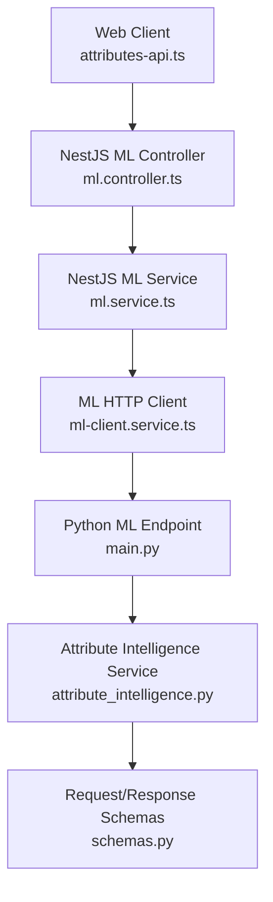
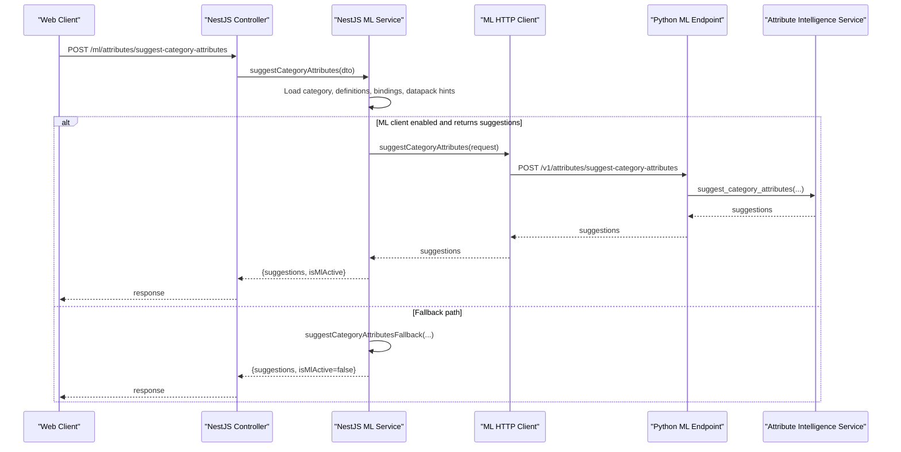
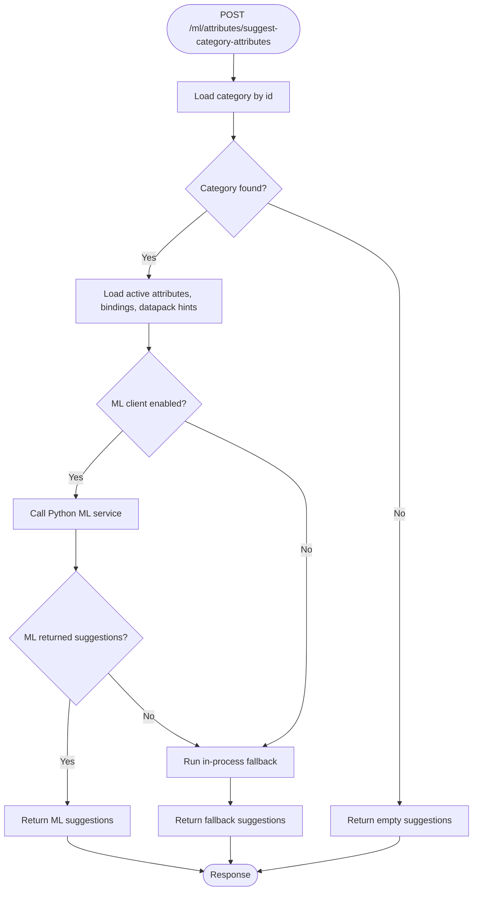
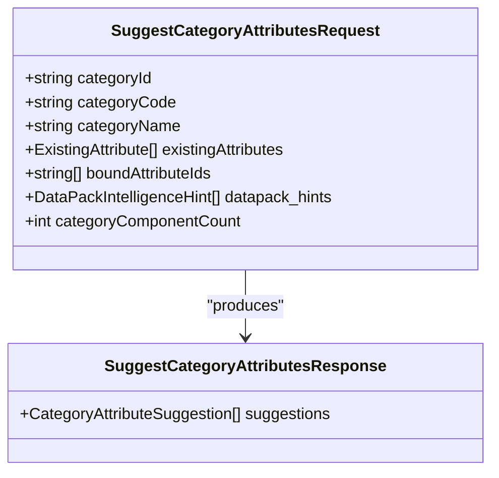
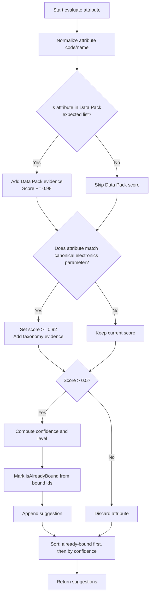
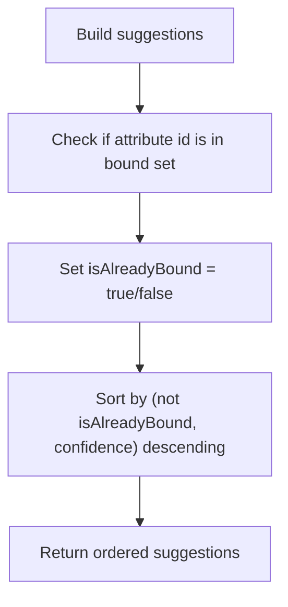
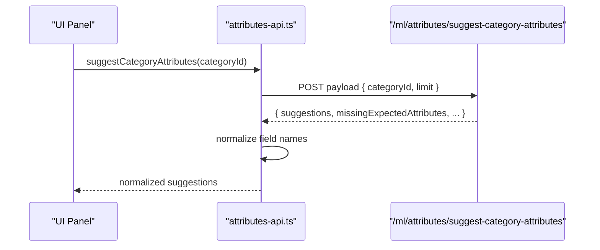
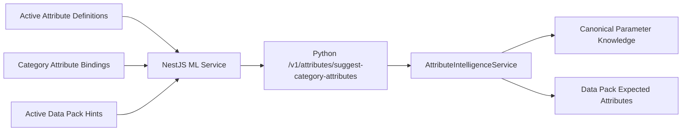

# Category Attribute Recommendations

<cite>
**Referenced Files in This Document**
- [ml.controller.ts](file://apps/api/src/ml/ml.controller.ts)
- [ml.service.ts](file://apps/api/src/ml/ml.service.ts)
- [ml-client.service.ts](file://apps/api/src/ml/ml-client.service.ts)
- [main.py](file://apps/ml/app/main.py)
- [attribute_intelligence.py](file://apps/ml/app/services/attribute_intelligence.py)
- [schemas.py](file://apps/ml/app/schemas.py)
- [attributes-api.ts](file://apps/web/lib/api/attributes-api.ts)
</cite>

## Table of Contents
1. [Introduction](#introduction)
2. [Project Structure](#project-structure)
3. [Core Components](#core-components)
4. [Architecture Overview](#architecture-overview)
5. [Detailed Component Analysis](#detailed-component-analysis)
6. [Dependency Analysis](#dependency-analysis)
7. [Performance Considerations](#performance-considerations)
8. [Troubleshooting Guide](#troubleshooting-guide)
9. [Conclusion](#conclusion)

## Introduction
This document explains the category attribute recommendation system that suggests which attributes should be bound to product categories. It focuses on the `suggest_category_attributes` workflow, how it evaluates existing attributes against Data Pack expectations and canonical electronics parameters, how it ranks already-bound attributes versus new recommendations, and how the `/v1/attributes/suggest-category-attributes` endpoint is used by the web client. It also documents the `isAlreadyBound` flag and the duplicate-suggestion prevention behavior.

## Project Structure
The feature spans three layers:

- API layer (NestJS): exposes `/ml/attributes/suggest-category-attributes`, loads active attribute definitions, current category bindings, and Data Pack hints, then calls the ML service or falls back to an in-process algorithm.
- ML service layer (Python FastAPI): implements the core scoring logic for category-level attribute suggestions using Data Packs and canonical electronics knowledge.
- Web client layer (Next.js): calls the NestJS endpoint and normalizes response fields for UI rendering.

**Diagram sources**
- [ml.controller.ts:202-208](file://apps/api/src/ml/ml.controller.ts#L202-L208)
- [ml.service.ts:1976-2062](file://apps/api/src/ml/ml.service.ts#L1976-L2062)
- [ml-client.service.ts:595-626](file://apps/api/src/ml/ml-client.service.ts#L595-L626)
- [main.py:276-287](file://apps/ml/app/main.py#L276-L287)
- [attribute_intelligence.py:634-725](file://apps/ml/app/services/attribute_intelligence.py#L634-L725)
- [schemas.py:396-407](file://apps/ml/app/schemas.py#L396-L407)
- [attributes-api.ts:485-508](file://apps/web/lib/api/attributes-api.ts#L485-L508)

**Section sources**
- [ml.controller.ts:202-208](file://apps/api/src/ml/ml.controller.ts#L202-L208)
- [ml.service.ts:1976-2062](file://apps/api/src/ml/ml.service.ts#L1976-L2062)
- [main.py:276-287](file://apps/ml/app/main.py#L276-L287)
- [attribute_intelligence.py:634-725](file://apps/ml/app/services/attribute_intelligence.py#L634-L725)
- [attributes-api.ts:485-508](file://apps/web/lib/api/attributes-api.ts#L485-L508)

## Core Components
- NestJS controller route: `POST /ml/attributes/suggest-category-attributes`.
- NestJS service method: `suggestCategoryAttributes`, which gathers category data, active attribute definitions, current bindings, and Data Pack hints; optionally calls the Python ML service; otherwise uses a fallback.
- Python FastAPI endpoint: `/v1/attributes/suggest-category-attributes`.
- Python intelligence service: `AttributeIntelligenceService.suggest_category_attributes`, which scores attributes based on Data Pack rules, canonical electronics parameters, and binding state.
- Web client helper: `suggestCategoryAttributes`, which calls the NestJS endpoint and normalizes field names for the UI.

Key responsibilities:
- The API layer prepares context and handles ML availability.
- The ML layer performs domain-aware scoring.
- The web layer adapts response shapes for presentation.

**Section sources**
- [ml.controller.ts:202-208](file://apps/api/src/ml/ml.controller.ts#L202-L208)
- [ml.service.ts:1976-2062](file://apps/api/src/ml/ml.service.ts#L1976-L2062)
- [main.py:276-287](file://apps/ml/app/main.py#L276-L287)
- [attribute_intelligence.py:634-725](file://apps/ml/app/services/attribute_intelligence.py#L634-L725)
- [attributes-api.ts:485-508](file://apps/web/lib/api/attributes-api.ts#L485-L508)

## Architecture Overview
The request flow for category attribute suggestions is:

1. The web client calls `/ml/attributes/suggest-category-attributes` with a category identifier.
2. The NestJS controller delegates to `MlService.suggestCategoryAttributes`.
3. The service loads:
   - The target category.
   - All active attribute definitions.
   - Current attribute bindings for the category.
   - Active Data Pack intelligence hints.
4. If the ML client is enabled and returns results, those are returned immediately.
5. Otherwise, the service runs an in-process fallback.
6. When the ML client is enabled, it forwards the request to the Python service at `/v1/attributes/suggest-category-attributes`.
7. The Python service computes suggestions through `AttributeIntelligenceService.suggest_category_attributes`.

**Diagram sources**
- [ml.controller.ts:202-208](file://apps/api/src/ml/ml.controller.ts#L202-L208)
- [ml.service.ts:1976-2062](file://apps/api/src/ml/ml.service.ts#L1976-L2062)
- [ml-client.service.ts:595-626](file://apps/api/src/ml/ml-client.service.ts#L595-L626)
- [main.py:276-287](file://apps/ml/app/main.py#L276-L287)
- [attribute_intelligence.py:634-725](file://apps/ml/app/services/attribute_intelligence.py#L634-L725)

## Detailed Component Analysis

### NestJS Route and Service Flow
The NestJS route accepts a category identifier and returns suggestions. The service:
- Validates the category exists.
- Loads all active attribute definitions.
- Loads current category bindings.
- Loads Data Pack hints when available.
- Calls the Python ML service if enabled; otherwise uses a fallback.
- Returns execution timing and whether ML was active.

**Diagram sources**
- [ml.controller.ts:202-208](file://apps/api/src/ml/ml.controller.ts#L202-L208)
- [ml.service.ts:1976-2062](file://apps/api/src/ml/ml.service.ts#L1976-L2062)

**Section sources**
- [ml.controller.ts:202-208](file://apps/api/src/ml/ml.controller.ts#L202-L208)
- [ml.service.ts:1976-2062](file://apps/api/src/ml/ml.service.ts#L1976-L2062)

### Python Endpoint and Request Schema
The Python endpoint receives a structured request containing:
- `categoryId`, `categoryCode`, `categoryName`.
- `existingAttributes`: the full set of active attribute definitions.
- `boundAttributeIds`: IDs already bound to the category.
- `datapack_hints`: expected attributes from active Data Packs.
- Optional telemetry such as `categoryComponentCount`.

It returns a list of `CategoryAttributeSuggestion` objects.

**Diagram sources**
- [main.py:276-287](file://apps/ml/app/main.py#L276-L287)
- [schemas.py:396-407](file://apps/ml/app/schemas.py#L396-L407)

**Section sources**
- [main.py:276-287](file://apps/ml/app/main.py#L276-L287)
- [schemas.py:396-407](file://apps/ml/app/schemas.py#L396-L407)

### Scoring Algorithm in `suggest_category_attributes`
The core algorithm evaluates each existing attribute against two primary signals:

1. **Data Pack expectation**: If an active Data Pack lists an attribute code or name as expected for the category, the attribute receives a strong score.
2. **Canonical electronics parameter knowledge**: If the attribute matches a known engineering parameter associated with the category, it receives a high score.

Additional considerations:
- The algorithm tracks evidence items describing why an attribute is recommended.
- Confidence levels are derived from the computed score.
- The final list is sorted so that already-bound attributes appear before unbound ones, followed by confidence.

**Diagram sources**
- [attribute_intelligence.py:634-725](file://apps/ml/app/services/attribute_intelligence.py#L634-L725)

**Section sources**
- [attribute_intelligence.py:634-725](file://apps/ml/app/services/attribute_intelligence.py#L634-L725)

### Canonical Electronics Parameters
The canonical parameter knowledge defines standard engineering attributes and their target categories. Examples include:
- Capacitance for capacitors.
- Resistance and tolerance for resistors.
- Current rating and termination for connectors.
- Package and mounting type across multiple component families.

These mappings ensure that recommendations align with electronics engineering standards rather than relying only on lexical similarity.

Practical implications:
- For a capacitor category, capacitance and dielectric-related attributes are strongly favored.
- For a resistor category, resistance, tolerance, power rating, package, and mounting type are prioritized.
- For a connector category, current rating, termination, contact plating, gender, and orientation are prioritized.

**Section sources**
- [attribute_intelligence.py:23-222](file://apps/ml/app/services/attribute_intelligence.py#L23-L222)

### `isAlreadyBound` Flag and Duplicate Prevention
The `isAlreadyBound` flag indicates whether an attribute is already bound to the requested category. Its role:
- Marks existing bindings clearly in the suggestion list.
- Influences sorting: already-bound attributes are placed ahead of new recommendations.
- Prevents duplicate suggestions by excluding attributes not present in the active attribute definition set and by relying on the bound ID set during evaluation.

The sorting rule ensures that:
- Existing bindings remain visible and actionable.
- New recommendations are still surfaced but ranked after confirmed bindings.
- High-confidence domain matches are promoted regardless of binding state, while still respecting the “already bound first” ordering.

**Diagram sources**
- [attribute_intelligence.py:701-725](file://apps/ml/app/services/attribute_intelligence.py#L701-L725)

**Section sources**
- [attribute_intelligence.py:701-725](file://apps/ml/app/services/attribute_intelligence.py#L701-L725)

### Web Client Usage and Field Normalization
The web client calls `/ml/attributes/suggest-category-attributes` with a category identifier. The response includes:
- `categoryId`
- `categoryName`
- `suggestions`
- `missingExpectedAttributes`
- `isMlActive`
- `executionTimeMs`

The client normalizes field names because the ML service may return identity fields under different names. This normalization ensures the UI can display attribute codes, names, and binding flags correctly.

**Diagram sources**
- [attributes-api.ts:485-508](file://apps/web/lib/api/attributes-api.ts#L485-L508)

**Section sources**
- [attributes-api.ts:485-508](file://apps/web/lib/api/attributes-api.ts#L485-L508)

### Practical Examples by Category

#### Capacitors
For a capacitor category, the system favors:
- Capacitance.
- Dielectric material.
- Voltage rating.
- Tolerance.
- Package and mounting type where applicable.

If these attributes exist in the active attribute library and match Data Pack expectations or canonical mappings, they receive high confidence and are suggested early. Already-bound attributes appear first.

#### Resistors
For a resistor category, the system favors:
- Resistance.
- Tolerance.
- Power rating.
- Package and mounting type.
- Operating temperature range.

Again, Data Pack expectations and canonical electronics parameters drive the strongest signals.

#### Connectors
For a connector category, the system favors:
- Current rating.
- Termination style.
- Contact plating.
- Gender.
- Orientation.

These attributes reflect common connector specifications and are reinforced by canonical parameter mappings.

[No sources needed since this section provides conceptual examples grounded in previously cited canonical mappings]

## Dependency Analysis
The following diagram shows how components depend on each other during category attribute suggestion:

**Diagram sources**
- [ml.service.ts:1997-2031](file://apps/api/src/ml/ml.service.ts#L1997-L2031)
- [main.py:276-287](file://apps/ml/app/main.py#L276-L287)
- [attribute_intelligence.py:634-725](file://apps/ml/app/services/attribute_intelligence.py#L634-L725)
- [attribute_intelligence.py:23-222](file://apps/ml/app/services/attribute_intelligence.py#L23-L222)

**Section sources**
- [ml.service.ts:1997-2031](file://apps/api/src/ml/ml.service.ts#L1997-L2031)
- [attribute_intelligence.py:23-222](file://apps/ml/app/services/attribute_intelligence.py#L23-L222)
- [attribute_intelligence.py:634-725](file://apps/ml/app/services/attribute_intelligence.py#L634-L725)

## Performance Considerations
- The NestJS service measures execution time around the entire suggestion process.
- The ML client call is best-effort: failures or disabled ML fall back to local computation.
- Data loading is parallelized for attribute definitions, bindings, and Data Pack hints.
- Sorting is deterministic: already-bound attributes first, then by confidence.

Recommendations:
- Keep Data Pack hints concise and targeted to reduce matching overhead.
- Ensure canonical parameter mappings stay aligned with category naming conventions.
- Monitor ML client latency; the fallback guarantees responsiveness even when the Python service is slow.

[No sources needed since this section provides general guidance]

## Troubleshooting Guide
Common issues and resolutions:

- No suggestions returned:
  - Verify the category exists.
  - Confirm active attribute definitions are loaded.
  - Check whether Data Pack hints are active for the category.
  - Inspect whether the ML client is enabled and reachable.

- Suggestions do not include expected engineering attributes:
  - Review canonical parameter mappings for the category.
  - Ensure attribute codes and names match canonical aliases.
  - Validate Data Pack expected attributes for the category.

- `isAlreadyBound` appears incorrect:
  - Confirm the bound attribute IDs passed to the ML service match persisted bindings.
  - Check that the category bindings query returns the correct rows.

- Web UI does not show attribute names:
  - Verify the client-side normalization maps service fields to UI fields.
  - Confirm the response contains both `code`/`name` or equivalent normalized fields.

**Section sources**
- [ml.service.ts:1976-2062](file://apps/api/src/ml/ml.service.ts#L1976-L2062)
- [ml-client.service.ts:595-626](file://apps/api/src/ml/ml-client.service.ts#L595-L626)
- [attributes-api.ts:485-508](file://apps/web/lib/api/attributes-api.ts#L485-L508)

## Conclusion
The category attribute recommendation system combines authoritative master data, Data Pack expectations, and canonical electronics engineering knowledge to produce reliable attribute binding suggestions. The NestJS layer prepares context and manages ML availability, while the Python layer applies domain-specific scoring. The `isAlreadyBound` flag and sorting strategy ensure that existing bindings remain prominent while new, high-confidence recommendations are surfaced. For categories like capacitors, resistors, and connectors, the system consistently identifies missing standard attributes aligned with industry practice.