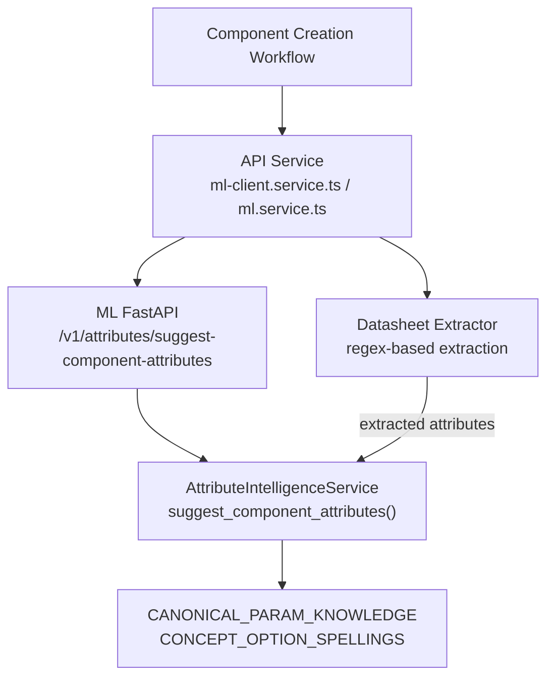
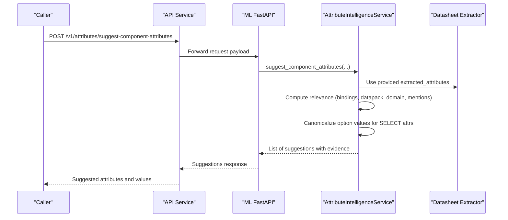
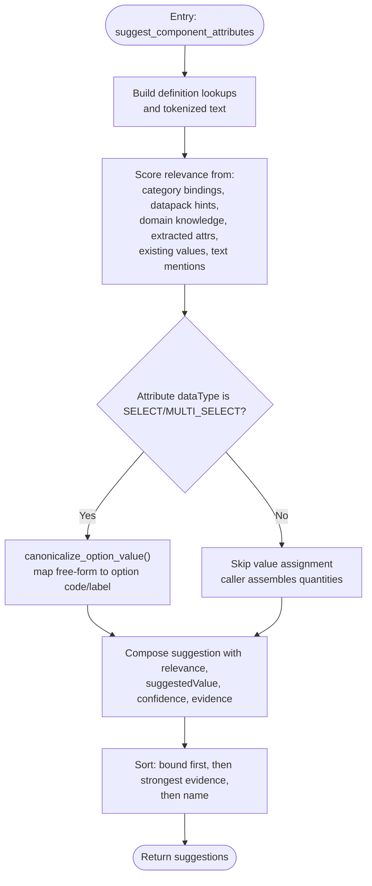
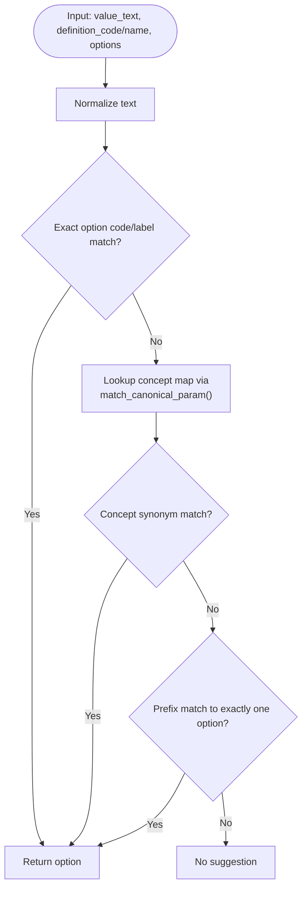
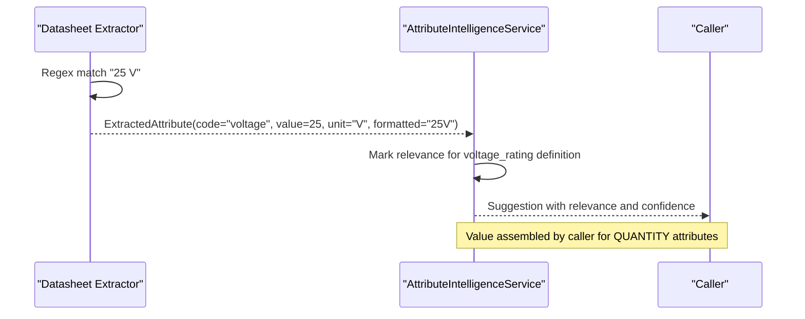
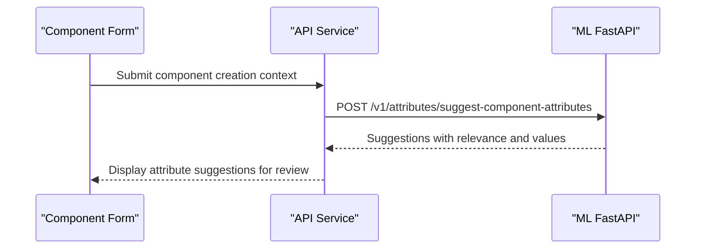
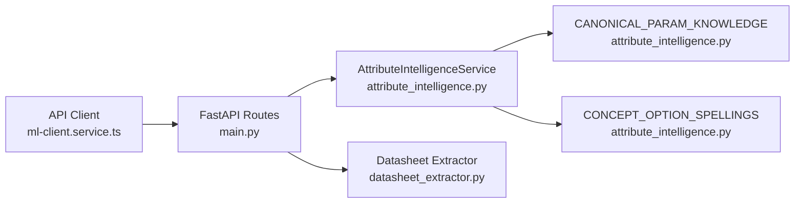

# Component Attribute Extraction

<cite>
**Referenced Files in This Document**
- [attribute_intelligence.py](file://apps/ml/app/services/attribute_intelligence.py)
- [main.py](file://apps/ml/app/main.py)
- [datasheet_extractor.py](file://apps/ml/app/services/datasheet_extractor.py)
- [ml-client.service.ts](file://apps/api/src/ml/ml-client.service.ts)
- [ml.service.ts](file://apps/api/src/ml/ml.service.ts)
- [schemas.py](file://apps/ml/app/schemas.py)
- [component-specification-intelligence.integration-spec.ts](file://apps/api/test/integration/component-specification-intelligence.integration-spec.ts)
- [component-attribute-quantity.integration-spec.ts](file://apps/api/test/integration/component-attribute-quantity.integration-spec.ts)
</cite>

## Table of Contents
1. [Introduction](#introduction)
2. [Project Structure](#project-structure)
3. [Core Components](#core-components)
4. [Architecture Overview](#architecture-overview)
5. [Detailed Component Analysis](#detailed-component-analysis)
6. [Dependency Analysis](#dependency-analysis)
7. [Performance Considerations](#performance-considerations)
8. [Troubleshooting Guide](#troubleshooting-guide)
9. [Conclusion](#conclusion)

## Introduction
This document explains the component attribute extraction system that turns datasheet text and component information into intelligent, library-safe attribute suggestions. It focuses on:
- The suggest_component_attributes method: how it decides which attributes matter for a part and when to propose a value.
- Value canonicalization: how free-form text is converted into predefined option values using CONCEPT_OPTION_SPELLINGS and CANONICAL_PARAM_KNOWLEDGE.
- Examples such as extracting “Voltage Rating: 25V” from datasheet text and mapping it to library options.
- How extracted attributes relate to library definitions, how quantity vs select data types are handled differently, and how this integrates with the component creation workflow.

## Project Structure
The feature spans two services:
- ML service (Python): implements extraction, canonicalization, and suggestion logic.
- API service (NestJS/TypeScript): calls the ML service and composes results for the UI and downstream workflows.

**Diagram sources**
- [main.py:289-313](file://apps/ml/app/main.py#L289-L313)
- [attribute_intelligence.py:727-1024](file://apps/ml/app/services/attribute_intelligence.py#L727-L1024)
- [ml-client.service.ts:514-568](file://apps/api/src/ml/ml-client.service.ts#L514-L568)
- [datasheet_extractor.py:482-507](file://apps/ml/app/services/datasheet_extractor.py#L482-L507)

**Section sources**
- [main.py:289-313](file://apps/ml/app/main.py#L289-L313)
- [ml-client.service.ts:514-568](file://apps/api/src/ml/ml-client.service.ts#L514-L568)

## Core Components
- AttributeIntelligenceService.suggest_component_attributes: central decision engine that evaluates relevance and proposes values only for SELECT/MULTI_SELECT attributes where a library option can be named.
- CANONICAL_PARAM_KNOWLEDGE: domain knowledge describing standard electronics parameters, their codes, names, units, categories, and options.
- CONCEPT_OPTION_SPELLINGS: synonym maps that bridge natural-language mentions (e.g., “gold flash”) to standardized option codes or labels.
- Datasheet extractor: regex-based rules that produce normalized extracted attributes (code, value, unit, formatted string, confidence, evidence).
- API client integration: TypeScript client that calls the ML endpoints and returns structured suggestions to the caller.

**Section sources**
- [attribute_intelligence.py:23-242](file://apps/ml/app/services/attribute_intelligence.py#L23-L242)
- [attribute_intelligence.py:321-433](file://apps/ml/app/services/attribute_intelligence.py#L321-L433)
- [datasheet_extractor.py:482-507](file://apps/ml/app/services/datasheet_extractor.py#L482-L507)
- [ml-client.service.ts:45-86](file://apps/api/src/ml/ml-client.service.ts#L45-L86)

## Architecture Overview
The end-to-end flow for suggesting component attributes:
1. The caller (UI or API) sends query, part number, description, datasheet text, category list, attribute definitions, bound attributes, existing values, and previously extracted attributes to the ML endpoint.
2. The ML route delegates to AttributeIntelligenceService.suggest_component_attributes.
3. The service determines which attributes are relevant by combining:
   - Category bindings
   - Data Pack expectations
   - Domain knowledge
   - Extracted attributes
   - Existing values
   - Text mentions
4. For SELECT/MULTI_SELECT attributes, it attempts to map extracted values to library options via canonicalization.
5. Results include relevance evidence, suggested option codes, and confidence levels.

**Diagram sources**
- [main.py:289-313](file://apps/ml/app/main.py#L289-L313)
- [attribute_intelligence.py:727-1024](file://apps/ml/app/services/attribute_intelligence.py#L727-L1024)
- [ml-client.service.ts:514-568](file://apps/api/src/ml/ml-client.service.ts#L514-L568)

## Detailed Component Analysis

### suggest_component_attributes Method
Responsibilities:
- Decide which attributes matter for the component based on multiple signals.
- Propose a value only when an option of the definition can be named; quantities and numbers are not assigned here to avoid duplication with the caller’s own assembly logic.

Key processing steps:
- Build lookup tables for attribute definitions by id and code.
- Gather text tokens from query, part number, description, and datasheet text.
- Score relevance through:
  - Category binding evidence
  - Data Pack expected attributes for considered categories
  - Canonical domain knowledge matching categories
  - Extracted attributes mapped to definitions
  - Existing values already recorded on the component
  - Text mentions of attribute terms, aliases, and canonical vocabulary
- For SELECT/MULTI_SELECT attributes, attempt to canonicalize extracted values to options using canonicalize_option_value.
- Return sorted suggestions: bound attributes first, then by strongest relevance evidence, then by name.

**Diagram sources**
- [attribute_intelligence.py:727-1024](file://apps/ml/app/services/attribute_intelligence.py#L727-L1024)

**Section sources**
- [attribute_intelligence.py:727-1024](file://apps/ml/app/services/attribute_intelligence.py#L727-L1024)

### Value Canonicalization Process
Goal: Convert free-form text into standardized option values that match the library’s definitions.

Process:
- Normalize input text and compare against:
  - Exact option code or label matches
  - Concept synonyms defined in CONCEPT_OPTION_SPELLINGS, keyed by canonical parameter code
  - Prefix matching against option labels (when unambiguous)
- Only return an option if one of these passes succeeds; otherwise no suggestion is produced to prevent free-form strings from entering specifications.

**Diagram sources**
- [attribute_intelligence.py:356-433](file://apps/ml/app/services/attribute_intelligence.py#L356-L433)

**Section sources**
- [attribute_intelligence.py:321-433](file://apps/ml/app/services/attribute_intelligence.py#L321-L433)

### Example: Extracting “Voltage Rating: 25V” and Mapping to Options
Extraction:
- The datasheet extractor uses regex patterns to detect voltage values like “25 V”, “25kV”, or “25mV”.
- It records an extracted attribute with code “voltage”, numeric value, unit, formatted string, confidence, and evidence including page and excerpt.

Mapping to options:
- Voltage rating is typically a QUANTITY attribute, so suggest_component_attributes does not assign a value here; instead, it marks relevance and lets the caller assemble the quantity from the same extraction.
- If a related SELECT attribute existed (for example, a package or mounting type), canonicalization would apply to map free-form mentions to predefined options.

**Diagram sources**
- [datasheet_extractor.py:482-507](file://apps/ml/app/services/datasheet_extractor.py#L482-L507)
- [attribute_intelligence.py:891-934](file://apps/ml/app/services/attribute_intelligence.py#L891-L934)

**Section sources**
- [datasheet_extractor.py:482-507](file://apps/ml/app/services/datasheet_extractor.py#L482-L507)
- [attribute_intelligence.py:891-934](file://apps/ml/app/services/attribute_intelligence.py#L891-L934)

### Relationship Between Extracted Attributes and Library Definitions
- The service bridges extractor codes (e.g., “voltage”) to library definitions using:
  - Direct code/name matches
  - Canonical parameter mapping via match_canonical_param
  - Aliases declared on definitions
- Only attributes that resolve to a known definition are returned; domain expectations without a matching definition are surfaced elsewhere (e.g., audit reports) rather than creating ad-hoc attributes.

**Section sources**
- [attribute_intelligence.py:799-822](file://apps/ml/app/services/attribute_intelligence.py#L799-L822)
- [attribute_intelligence.py:356-383](file://apps/ml/app/services/attribute_intelligence.py#L356-L383)

### Handling Quantity vs Select Data Types
- SELECT/MULTI_SELECT: The service attempts to map extracted values to options using canonicalization and returns suggestedValue and formatted fields.
- QUANTITY/TEXT/BOOLEAN: The service intentionally skips value assignment to avoid duplication; callers assemble these values from the same extraction.

Evidence in tests:
- Integration tests demonstrate that extracted attributes include source_value/source_unit pairs and formatted strings, while suggest_component_attributes may return null when relying on local rules for values.

**Section sources**
- [attribute_intelligence.py:905-934](file://apps/ml/app/services/attribute_intelligence.py#L905-L934)
- [component-attribute-quantity.integration-spec.ts:71-122](file://apps/api/test/integration/component-attribute-quantity.integration-spec.ts#L71-L122)

### Integration With Component Creation Workflow
- The API client exposes suggestComponentAttributes, which forwards the payload to the ML endpoint and returns suggestions with relevance and value evidence.
- The ML route composes the request and delegates to the service, ensuring the same document text serves classification, manufacturer resolution, and attribute extraction.
- Tests show how the API constructs payloads with categories, attributes (including options), bound attributes, and extracted attributes, and how the result includes attributeSuggestions alongside identity and classification suggestions.

**Diagram sources**
- [ml-client.service.ts:514-568](file://apps/api/src/ml/ml-client.service.ts#L514-L568)
- [main.py:289-313](file://apps/ml/app/main.py#L289-L313)
- [component-specification-intelligence.integration-spec.ts:1146-1178](file://apps/api/test/integration/component-specification-intelligence.integration-spec.ts#L1146-L1178)

**Section sources**
- [ml-client.service.ts:514-568](file://apps/api/src/ml/ml-client.service.ts#L514-L568)
- [main.py:289-313](file://apps/ml/app/main.py#L289-L313)
- [component-specification-intelligence.integration-spec.ts:1146-1178](file://apps/api/test/integration/component-specification-intelligence.integration-spec.ts#L1146-L1178)

## Dependency Analysis
Key dependencies and relationships:
- ML FastAPI routes depend on AttributeIntelligenceService and DatasheetExtractor.
- AttributeIntelligenceService depends on CANONICAL_PARAM_KNOWLEDGE and CONCEPT_OPTION_SPELLINGS for domain knowledge and option mapping.
- API client depends on ML service endpoints and returns typed responses to the UI.

**Diagram sources**
- [main.py:289-313](file://apps/ml/app/main.py#L289-L313)
- [attribute_intelligence.py:23-242](file://apps/ml/app/services/attribute_intelligence.py#L23-L242)
- [attribute_intelligence.py:321-433](file://apps/ml/app/services/attribute_intelligence.py#L321-L433)
- [ml-client.service.ts:514-568](file://apps/api/src/ml/ml-client.service.ts#L514-L568)

**Section sources**
- [main.py:289-313](file://apps/ml/app/main.py#L289-L313)
- [attribute_intelligence.py:23-242](file://apps/ml/app/services/attribute_intelligence.py#L23-L242)
- [attribute_intelligence.py:321-433](file://apps/ml/app/services/attribute_intelligence.py#L321-L433)
- [ml-client.service.ts:514-568](file://apps/api/src/ml/ml-client.service.ts#L514-L568)

## Performance Considerations
- The suggest_component_attributes method operates on in-memory structures (definition lookups, token sets) and performs lightweight string normalization and similarity checks.
- Evidence aggregation is bounded by the number of attributes and categories supplied in the request.
- Datasheet extraction uses regex patterns and page scanning; large documents are truncated to manageable sizes in the extractor output.
- The API client applies timeouts to ML calls to keep the component creation workflow responsive.

[No sources needed since this section provides general guidance]

## Troubleshooting Guide
Common issues and diagnostics:
- No suggestions returned:
  - Ensure categories and attributes are provided; empty inputs short-circuit to no results.
  - Verify that extracted attributes have codes/names that resolve to definitions via canonical mapping.
- Unexpected free-form values:
  - Confirm the attribute is SELECT/MULTI_SELECT; for QUANTITY/TEXT/BOOLEAN, values are assembled by the caller, not the service.
- Low confidence or missing evidence:
  - Check that the datasheet text contains usable terms; single short words are filtered out to reduce noise.
  - Review evidence items attached to suggestions to understand which signal contributed.

Relevant implementation references:
- Short-word filtering and term usability checks.
- Evidence item construction for each relevance source.
- API client error handling and timeout behavior.

**Section sources**
- [attribute_intelligence.py:455-467](file://apps/ml/app/services/attribute_intelligence.py#L455-L467)
- [attribute_intelligence.py:796-987](file://apps/ml/app/services/attribute_intelligence.py#L796-L987)
- [ml-client.service.ts:310-400](file://apps/api/src/ml/ml-client.service.ts#L310-L400)

## Conclusion
The component attribute extraction system combines domain knowledge, datasheet extraction, and library-aware canonicalization to deliver precise, reviewable attribute suggestions. The suggest_component_attributes method ensures that only meaningful attributes are proposed and that values are mapped to predefined options whenever possible. Quantities remain under caller control to maintain consistency, while SELECT attributes benefit from robust synonym mapping and prefix matching. The integration between the API and ML services enables a smooth component creation workflow with transparent evidence and confidence levels.

[No sources needed since this section summarizes without analyzing specific files]