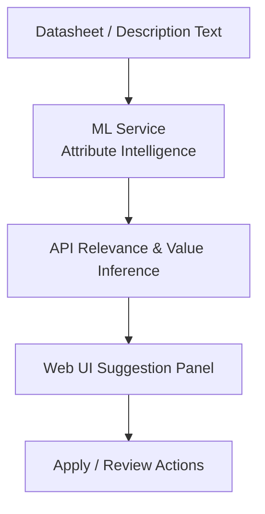
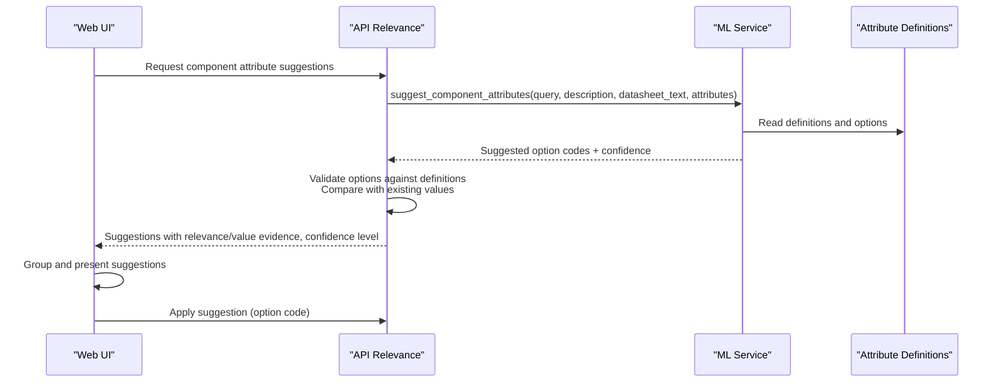
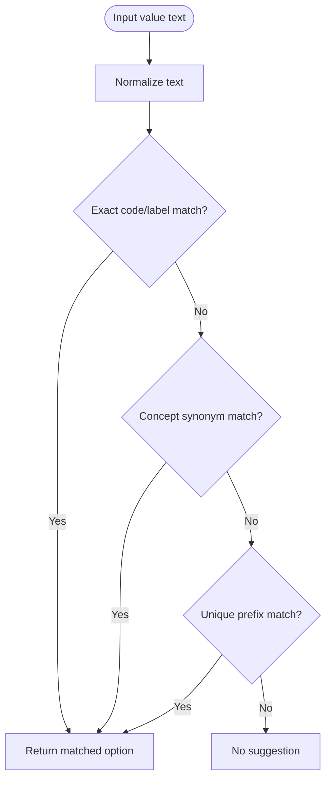
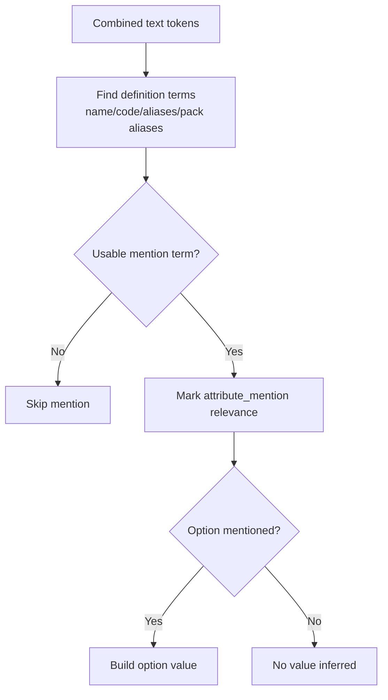
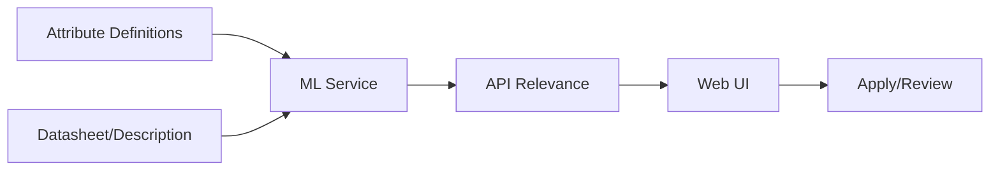

# Enum Value Suggestions

<cite>
**Referenced Files in This Document**
- [attribute_intelligence.py](file://apps/ml/app/services/attribute_intelligence.py)
- [component-attribute-relevance.ts](file://apps/api/src/ml/component-attribute-relevance.ts)
- [attribute-suggestions.ts](file://apps/web/lib/attribute-suggestions.ts)
- [ml-client.service.ts](file://apps/api/src/ml/ml-client.service.ts)
</cite>

## Table of Contents
1. [Introduction](#introduction)
2. [Project Structure](#project-structure)
3. [Core Components](#core-components)
4. [Architecture Overview](#architecture-overview)
5. [Detailed Component Analysis](#detailed-component-analysis)
6. [Dependency Analysis](#dependency-analysis)
7. [Performance Considerations](#performance-considerations)
8. [Troubleshooting Guide](#troubleshooting-guide)
9. [Conclusion](#conclusion)

## Introduction
This document explains the enum value suggestion system that proposes standardized option values for select-type attributes. It analyzes datasheet text and component descriptions to map natural-language terms into canonical options defined by attribute definitions. The system uses a three-pass matching algorithm: exact option code or label matching, concept synonym matching via CONCEPT_OPTION_SPELLINGS, and prefix matching for partial values. It also covers confidence scoring, handling ambiguous cases, and how suggestions integrate with the attribute definition management workflow to keep option values consistent across the platform.

## Project Structure
The enum value suggestion pipeline spans three layers:
- ML service (Python): extracts and normalizes values from datasheet text and maps them to canonical options using domain knowledge and synonym mappings.
- API layer (TypeScript): computes relevance and value inference, compares against existing values, and produces explainable suggestions with confidence levels.
- Web UI (TypeScript): presents suggestions, groups them by state, and exposes apply/review actions while deferring all decision logic to backend verdicts.

**Diagram sources**
- [attribute_intelligence.py:727-1024](file://apps/ml/app/services/attribute_intelligence.py#L727-L1024)
- [component-attribute-relevance.ts:796-1178](file://apps/api/src/ml/component-attribute-relevance.ts#L796-L1178)
- [attribute-suggestions.ts:67-129](file://apps/web/lib/attribute-suggestions.ts#L67-L129)

**Section sources**
- [attribute_intelligence.py:727-1024](file://apps/ml/app/services/attribute_intelligence.py#L727-L1024)
- [component-attribute-relevance.ts:796-1178](file://apps/api/src/ml/component-attribute-relevance.ts#L796-L1178)
- [attribute-suggestions.ts:67-129](file://apps/web/lib/attribute-suggestions.ts#L67-L129)

## Core Components
- Concept-to-option normalization: CONCEPT_OPTION_SPELLINGS bridges datasheet vocabulary to canonical option codes and labels.
- Three-pass matching: exact match, concept synonym match, and prefix match ensure robust mapping of varied textual inputs to standardized options.
- Confidence scoring: derived from evidence strength and corroborating signals; mapped to HIGH/MEDIUM/LOW bands.
- Integration points: ML service returns suggested option codes; API layer validates against definitions and existing values; UI displays actionable suggestions.

**Section sources**
- [attribute_intelligence.py:321-433](file://apps/ml/app/services/attribute_intelligence.py#L321-L433)
- [component-attribute-relevance.ts:280-311](file://apps/api/src/ml/component-attribute-relevance.ts#L280-L311)
- [attribute-suggestions.ts:163-200](file://apps/web/lib/attribute-suggestions.ts#L163-L200)

## Architecture Overview
The end-to-end flow for enum value suggestions:

**Diagram sources**
- [ml-client.service.ts:514-549](file://apps/api/src/ml/ml-client.service.ts#L514-L549)
- [attribute_intelligence.py:727-1024](file://apps/ml/app/services/attribute_intelligence.py#L727-L1024)
- [component-attribute-relevance.ts:796-1178](file://apps/api/src/ml/component-attribute-relevance.ts#L796-L1178)
- [attribute-suggestions.ts:67-129](file://apps/web/lib/attribute-suggestions.ts#L67-L129)

## Detailed Component Analysis

### Concept Option Spellings and Three-Pass Matching
The core normalization function performs three passes to map raw value text to a canonical option:
1. Exact option code or label match: normalized input compared directly to option.code and option.label.
2. Concept synonym match: if an exact match fails, the system identifies the canonical parameter for the attribute and consults CONCEPT_OPTION_SPELLINGS to find synonyms that map to an option.
3. Prefix match: if still unresolved, a minimum-length prefix is matched against option labels; only a unique prefix resolves to an option.

**Diagram sources**
- [attribute_intelligence.py:386-433](file://apps/ml/app/services/attribute_intelligence.py#L386-L433)

Practical examples:
- "SMD", "Surface Mount", "SMT" → mapped to option "SMD" via concept synonyms for mounting_type.
- "0402 package" → mapped to option "0402" via exact label match on package options.
- "Gold flash" → mapped to option "Gold" via contact_plating concept synonyms.

These mappings are enforced so that suggestions always resolve to real options available in the attribute definition, preventing free-form strings from being recorded.

**Section sources**
- [attribute_intelligence.py:321-433](file://apps/ml/app/services/attribute_intelligence.py#L321-L433)

### Attribute Mention Detection and Option Mentions
The API layer scans combined text (query, part number, description, datasheet text) for mentions of attribute names, codes, aliases, and Data Pack aliases. For SELECT/MULTI_SELECT attributes, it detects when the text explicitly names an option by whole token sequences, ensuring substring matches do not produce false positives.

**Diagram sources**
- [component-attribute-relevance.ts:472-551](file://apps/api/src/ml/component-attribute-relevance.ts#L472-L551)

**Section sources**
- [component-attribute-relevance.ts:472-551](file://apps/api/src/ml/component-attribute-relevance.ts#L472-L551)

### Confidence Scoring and Evidence
Confidence is derived from multiple evidence sources:
- Category bindings and Data Pack expectations establish relevance.
- Extracted attributes and option mentions provide value evidence.
- Existing values contribute corroborating signals.
- Corroboration increases confidence but is capped to avoid overconfidence.

Confidence bands:
- HIGH: ≥ 0.85
- MEDIUM: ≥ 0.60
- LOW: < 0.60

Evidence items include source type, description, and weight, enabling transparent explanations in the UI.

**Section sources**
- [component-attribute-relevance.ts:280-311](file://apps/api/src/ml/component-attribute-relevance.ts#L280-L311)
- [attribute_intelligence.py:989-1024](file://apps/ml/app/services/attribute_intelligence.py#L989-L1024)
- [attribute-suggestions.ts:163-200](file://apps/web/lib/attribute-suggestions.ts#L163-L200)

### Handling Ambiguous Cases
Ambiguity is handled by:
- Requiring whole-token sequence matches for option mentions to avoid substring false positives.
- Limiting prefix matches to unique prefixes to prevent multiple candidates.
- Using concept synonym mappings to disambiguate common datasheet phrasing.
- Reporting inconclusive comparisons when existing values cannot be confidently equated, prompting human review.

**Section sources**
- [component-attribute-relevance.ts:456-551](file://apps/api/src/ml/component-attribute-relevance.ts#L456-L551)
- [attribute_intelligence.py:455-467](file://apps/ml/app/services/attribute_intelligence.py#L455-L467)

### Integration with Attribute Definition Management
Suggestions are constrained to existing attribute definitions and their options:
- The ML service receives the full set of definitions and options; it never invents new options.
- The API layer validates suggested option codes against the definition’s options before producing a suggestion.
- The UI applies suggestions by writing option codes, preserving consistency with the manual editor’s data shape.

This ensures that enum values remain standardized and auditable, supporting maintenance workflows for attribute definitions and category bindings.

**Section sources**
- [attribute_intelligence.py:727-765](file://apps/ml/app/services/attribute_intelligence.py#L727-L765)
- [component-attribute-relevance.ts:671-686](file://apps/api/src/ml/component-attribute-relevance.ts#L671-L686)
- [attribute-suggestions.ts:609-628](file://apps/web/lib/attribute-suggestions.ts#L609-L628)

## Dependency Analysis
Key dependencies and relationships:
- ML service depends on attribute definitions and options to normalize values.
- API layer depends on ML output and local rules to compute relevance and compare values.
- UI depends on backend verdicts for conflict, existingMatches, and confidenceLevel, avoiding local re-derivation.

**Diagram sources**
- [attribute_intelligence.py:727-1024](file://apps/ml/app/services/attribute_intelligence.py#L727-L1024)
- [component-attribute-relevance.ts:796-1178](file://apps/api/src/ml/component-attribute-relevance.ts#L796-L1178)
- [attribute-suggestions.ts:67-129](file://apps/web/lib/attribute-suggestions.ts#L67-L129)

**Section sources**
- [ml-client.service.ts:514-549](file://apps/api/src/ml/ml-client.service.ts#L514-L549)
- [attribute_intelligence.py:727-1024](file://apps/ml/app/services/attribute_intelligence.py#L727-L1024)
- [component-attribute-relevance.ts:796-1178](file://apps/api/src/ml/component-attribute-relevance.ts#L796-L1178)
- [attribute-suggestions.ts:67-129](file://apps/web/lib/attribute-suggestions.ts#L67-L129)

## Performance Considerations
- Tokenization and sequence matching operate on normalized text; keeping token lists minimal reduces overhead.
- Prefix matching requires uniqueness checks; limiting candidate sets improves performance.
- Evidence accumulation is bounded per attribute; sorting and grouping occur once per request.
- Avoid redundant normalization; reuse normalized forms where possible.

[No sources needed since this section provides general guidance]

## Troubleshooting Guide
Common issues and resolutions:
- No suggestion produced: verify that the attribute has options and that the input text contains usable terms; check that concept synonyms exist for the attribute code/name.
- Ambiguous prefix match: ensure the prefix uniquely identifies one option; otherwise, refine input or add explicit alias.
- Conflict with existing value: review evidence and comparison results; if units differ or types mismatch, adjust units or clarify terminology.
- UI shows “relevant only”: no value could be determined; enrich datasheet text or add aliases to improve mention detection.

**Section sources**
- [attribute_intelligence.py:455-467](file://apps/ml/app/services/attribute_intelligence.py#L455-L467)
- [component-attribute-relevance.ts:751-777](file://apps/api/src/ml/component-attribute-relevance.ts#L751-L777)
- [attribute-suggestions.ts:262-340](file://apps/web/lib/attribute-suggestions.ts#L262-L340)

## Conclusion
The enum value suggestion system standardizes select-type attribute values by analyzing datasheet text and component descriptions through a robust three-pass matching algorithm. It leverages CONCEPT_OPTION_SPELLINGS to bridge natural-language terms to canonical options, computes confidence based on multi-source evidence, and integrates tightly with attribute definition management to maintain consistency. The result is a reliable, explainable suggestion workflow that supports efficient data entry and long-term data quality across the platform.