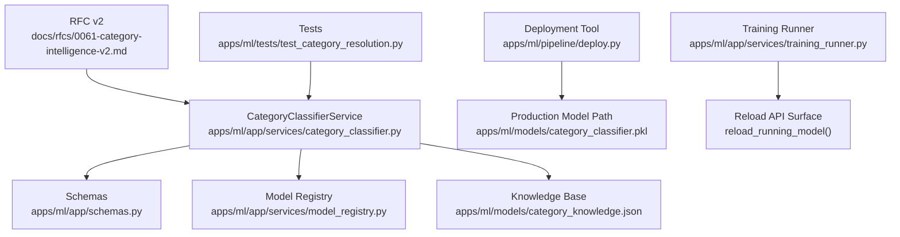
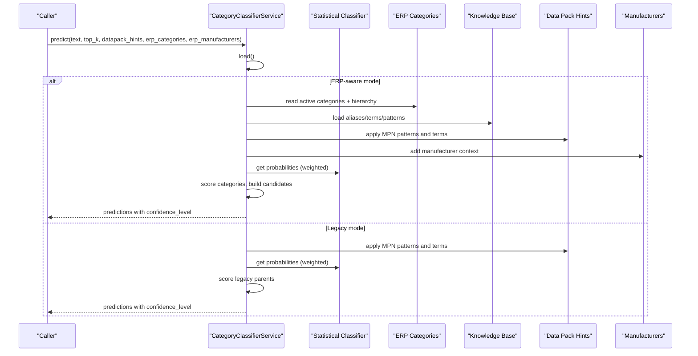
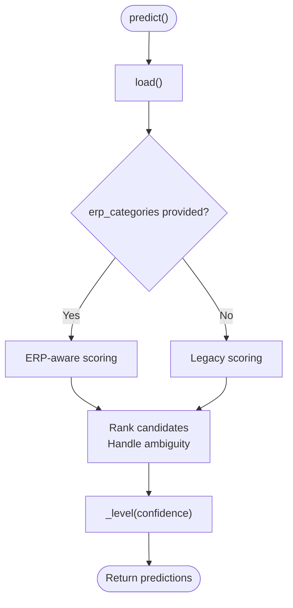
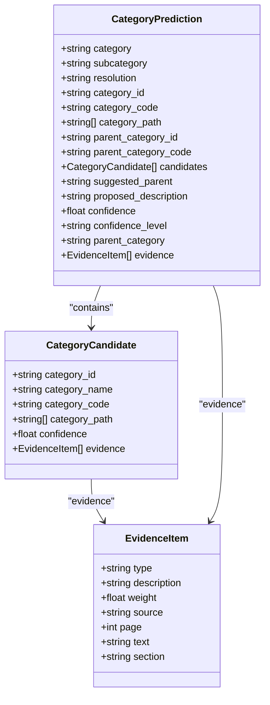
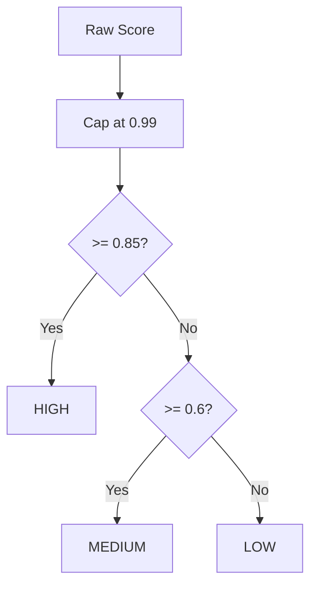
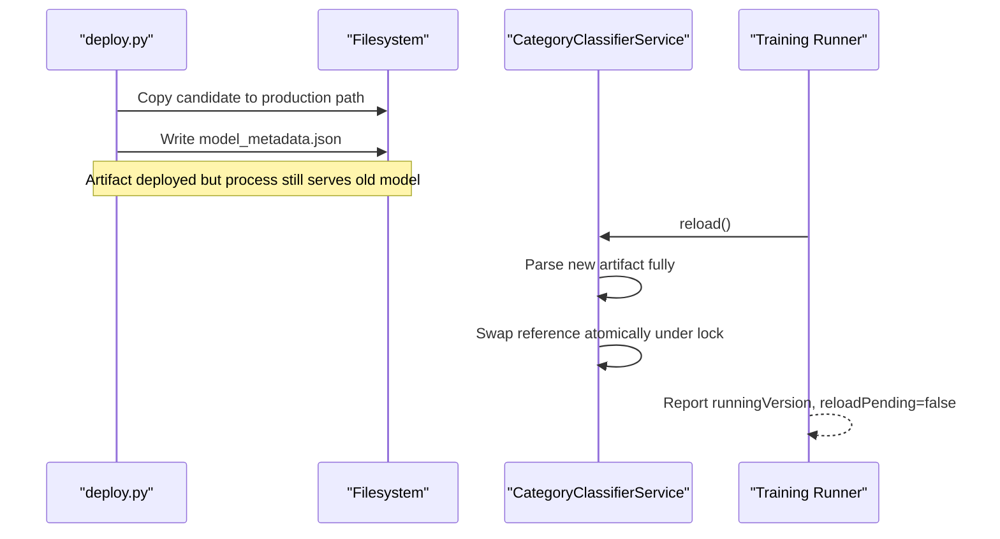
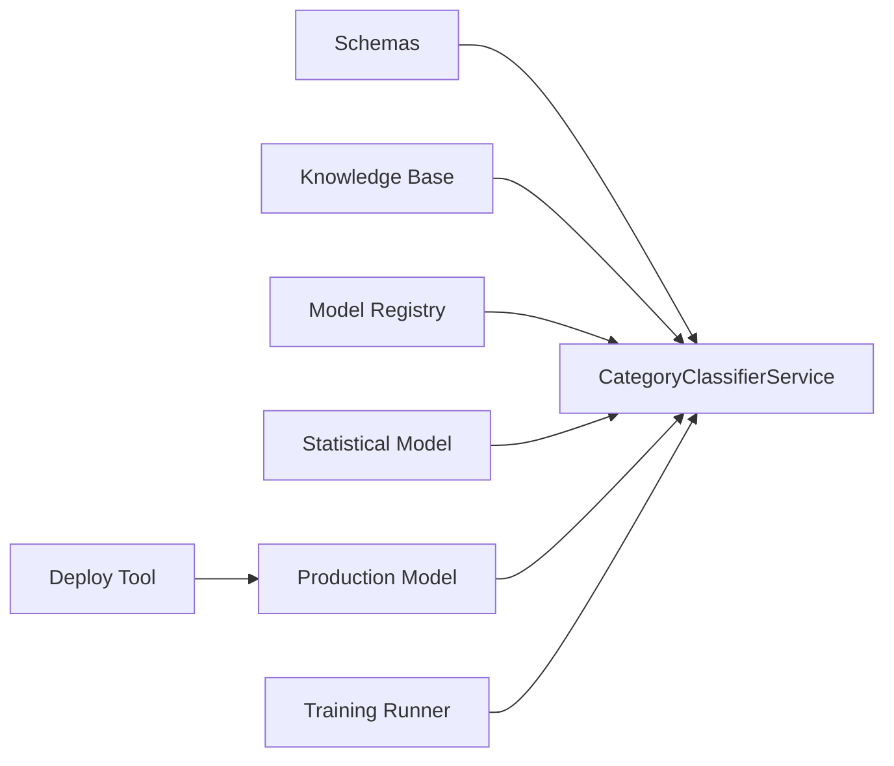

# Category Classification

<cite>
**Referenced Files in This Document**
- [category_classifier.py](file://apps/ml/app/services/category_classifier.py)
- [schemas.py](file://apps/ml/app/schemas.py)
- [0061-category-intelligence-v2.md](file://docs/rfcs/0061-category-intelligence-v2.md)
- [model_registry.py](file://apps/ml/app/services/model_registry.py)
- [deploy.py](file://apps/ml/pipeline/deploy.py)
- [training_runner.py](file://apps/ml/app/services/training_runner.py)
- [ML_OPERATIONS.md](file://docs/ML_OPERATIONS.md)
- [test_category_resolution.py](file://apps/ml/tests/test_category_resolution.py)
- [category_knowledge.json](file://apps/ml/models/category_knowledge.json)
</cite>

## Table of Contents
1. [Introduction](#introduction)
2. [Project Structure](#project-structure)
3. [Core Components](#core-components)
4. [Architecture Overview](#architecture-overview)
5. [Detailed Component Analysis](#detailed-component-analysis)
6. [Dependency Analysis](#dependency-analysis)
7. [Performance Considerations](#performance-considerations)
8. [Troubleshooting Guide](#troubleshooting-guide)
9. [Conclusion](#conclusion)
10. [Appendices](#appendices)

## Introduction
This document explains the category classification system used to map component descriptions and datasheet text into ERP categories or new candidates. It covers:
- The CategoryClassifierService implementation, including legacy mode and ERP-aware mode.
- The multi-source evidence scoring system that combines statistical model probabilities, ERP category metadata, manufacturer context, data pack hints, and knowledge base matching.
- Confidence calibration that maps scores to HIGH/MEDIUM/LOW levels using thresholds 0.85+, 0.6+, below 0.6.
- Practical examples for datapack hints, ERP category filtering, and hierarchical path resolution.
- The artifact management system for model versioning and the atomic reload mechanism enabling zero-downtime model updates.

## Project Structure
The category classification logic lives primarily in the ML service under apps/ml, with supporting schemas, registry, deployment tooling, and documentation.

**Diagram sources**
- [category_classifier.py:44-176](file://apps/ml/app/services/category_classifier.py#L44-L176)
- [schemas.py:40-95](file://apps/ml/app/schemas.py#L40-L95)
- [model_registry.py:199-245](file://apps/ml/app/services/model_registry.py#L199-L245)
- [deploy.py:16-116](file://apps/ml/pipeline/deploy.py#L16-L116)
- [training_runner.py:455-480](file://apps/ml/app/services/training_runner.py#L455-L480)
- [0061-category-intelligence-v2.md:7-27](file://docs/rfcs/0061-category-intelligence-v2.md#L7-L27)
- [test_category_resolution.py:31-36](file://apps/ml/tests/test_category_resolution.py#L31-L36)

**Section sources**
- [category_classifier.py:44-176](file://apps/ml/app/services/category_classifier.py#L44-L176)
- [schemas.py:40-95](file://apps/ml/app/schemas.py#L40-L95)
- [0061-category-intelligence-v2.md:7-27](file://docs/rfcs/0061-category-intelligence-v2.md#L7-L27)

## Core Components
- CategoryClassifierService: Orchestrates prediction in two modes:
  - Legacy mode: Uses a statistical classifier over predefined parent categories and data pack hints.
  - ERP-aware mode: Scores active ERP categories using multiple signals (ERP metadata, knowledge base, data packs, manufacturer context, statistical model), resolves hierarchy paths, and returns EXISTING/NEW_CANDIDATE/UNKNOWN.
- Schemas: Define request/response contracts, including ErpCategory, DataPackIntelligenceHint, EvidenceItem, and CategoryPrediction.
- Model Registry: Reads production artifacts, checksums, versions, and supports rollback availability.
- Deployment Tool: Promotes candidate models to production and records deployment metadata.
- Training Runner: Exposes reload_running_model to swap in the latest artifact without restarting the process.

**Section sources**
- [category_classifier.py:44-176](file://apps/ml/app/services/category_classifier.py#L44-L176)
- [schemas.py:40-95](file://apps/ml/app/schemas.py#L40-L95)
- [model_registry.py:199-245](file://apps/ml/app/services/model_registry.py#L199-L245)
- [deploy.py:16-116](file://apps/ml/pipeline/deploy.py#L16-L116)
- [training_runner.py:455-480](file://apps/ml/app/services/training_runner.py#L455-L480)

## Architecture Overview
The classification pipeline integrates multiple evidence sources and outputs ranked candidates with confidence levels and detailed evidence.

**Diagram sources**
- [category_classifier.py:192-259](file://apps/ml/app/services/category_classifier.py#L192-L259)
- [category_classifier.py:278-455](file://apps/ml/app/services/category_classifier.py#L278-L455)
- [schemas.py:40-95](file://apps/ml/app/schemas.py#L40-L95)

## Detailed Component Analysis

### CategoryClassifierService: Prediction Modes
- Legacy mode (_legacy_predict):
  - Initializes scores for legacy parent categories.
  - Applies data pack hints (MPN patterns and term matches).
  - Adds statistical classifier probabilities when available.
  - Computes confidence and maps to HIGH/MEDIUM/LOW via _level.
- ERP-aware mode (_erp_predict):
  - Builds hierarchy paths from ERP categories.
  - Scores active ERP categories by:
    - ERP metadata (name, code, description, aliases).
    - Knowledge base (aliases, terms, MPN patterns).
    - Data pack hints (MPN patterns, keywords, terminology).
    - Manufacturer context (supporting signal only).
    - Statistical classifier probabilities (weighted).
  - Ranks candidates, handles ambiguity, and returns EXISTING/NEW_CANDIDATE/UNKNOWN with full category path and parent metadata.

**Diagram sources**
- [category_classifier.py:457-470](file://apps/ml/app/services/category_classifier.py#L457-L470)
- [category_classifier.py:192-259](file://apps/ml/app/services/category_classifier.py#L192-L259)
- [category_classifier.py:278-455](file://apps/ml/app/services/category_classifier.py#L278-L455)

**Section sources**
- [category_classifier.py:192-259](file://apps/ml/app/services/category_classifier.py#L192-L259)
- [category_classifier.py:278-455](file://apps/ml/app/services/category_classifier.py#L278-L455)
- [category_classifier.py:457-470](file://apps/ml/app/services/category_classifier.py#L457-L470)

### Multi-Source Evidence Scoring System
Evidence types include:
- mpn_pattern: Matches part number patterns from data packs or knowledge base.
- data_pack_rule: Matches keywords, aliases, or common terminology from data packs.
- erp_metadata: Matches ERP category names, codes, descriptions, and aliases.
- category_knowledge: Matches knowledge base terms and patterns.
- manufacturer_context: Manufacturer name/code/aliases as supporting context.
- classifier: Statistical model probability contribution.

Scoring behavior:
- ERP-aware mode accumulates weighted evidence per category, caps at 0.99, and ranks top_k candidates.
- Ambiguity detection reduces weak or ambiguous results to UNKNOWN with LOW confidence.
- New candidates can be proposed from strong knowledge matches even if not present in ERP.

**Diagram sources**
- [schemas.py:4-84](file://apps/ml/app/schemas.py#L4-L84)

**Section sources**
- [category_classifier.py:278-455](file://apps/ml/app/services/category_classifier.py#L278-L455)
- [schemas.py:4-84](file://apps/ml/app/schemas.py#L4-L84)

### Confidence Calibration
Confidence levels are determined by thresholds:
- HIGH: confidence >= 0.85
- MEDIUM: confidence >= 0.6
- LOW: below 0.6

In ERP-aware mode, final confidence is capped at 0.99 and rounded; ambiguous cases return UNKNOWN with 0.0 confidence and LOW level. In legacy mode, confidence is adjusted based on evidence strength and model probabilities before mapping to levels.

**Diagram sources**
- [category_classifier.py:184-190](file://apps/ml/app/services/category_classifier.py#L184-L190)
- [category_classifier.py:420-455](file://apps/ml/app/services/category_classifier.py#L420-L455)
- [category_classifier.py:239-258](file://apps/ml/app/services/category_classifier.py#L239-L258)

**Section sources**
- [category_classifier.py:184-190](file://apps/ml/app/services/category_classifier.py#L184-L190)
- [category_classifier.py:239-258](file://apps/ml/app/services/category_classifier.py#L239-L258)
- [category_classifier.py:420-455](file://apps/ml/app/services/category_classifier.py#L420-L455)

### Practical Examples

#### Datapack Hints
- Provide DataPackIntelligenceHint with categoryName/categoryCode, aliases, keywords, mpnPatterns, and commonTerminology.
- In legacy mode, matched MPN patterns and terms boost the target category score.
- In ERP-aware mode, matched patterns and terms augment existing ERP categories or create NEW_CANDIDATE entries when no ERP match exists.

Example usage pattern:
- Call predict with datapack_hints and optional erp_categories/erp_manufacturers.
- Review returned candidates and evidence to understand which rules contributed.

**Section sources**
- [category_classifier.py:192-259](file://apps/ml/app/services/category_classifier.py#L192-L259)
- [category_classifier.py:278-455](file://apps/ml/app/services/category_classifier.py#L278-L455)
- [schemas.py:27-39](file://apps/ml/app/schemas.py#L27-L39)

#### ERP Category Filtering
- Only active ERP categories can resolve as EXISTING; inactive categories serve as context only.
- Hierarchy specificity favors strongly supported child categories over parents.
- Parent metadata and full category path are included in predictions.

Example usage pattern:
- Pass erp_categories with is_active flags and computed paths.
- Use returned category_path and parent_category fields to navigate hierarchy.

**Section sources**
- [0061-category-intelligence-v2.md:7-27](file://docs/rfcs/0061-category-intelligence-v2.md#L7-L27)
- [category_classifier.py:261-276](file://apps/ml/app/services/category_classifier.py#L261-L276)
- [category_classifier.py:439-455](file://apps/ml/app/services/category_classifier.py#L439-L455)

#### Hierarchical Path Resolution
- Paths are built from ERP categories’ parent relationships or precomputed path fields.
- Predictions include root category and subcategory when applicable.
- For NEW_CANDIDATE, suggested_parent may be derived from knowledge base.

**Section sources**
- [category_classifier.py:261-276](file://apps/ml/app/services/category_classifier.py#L261-L276)
- [category_classifier.py:426-437](file://apps/ml/app/services/category_classifier.py#L426-L437)

### Artifact Management and Atomic Reload
- Model Registry:
  - Lists versions, computes checksums, and resolves artifact versions from checksums.
  - Reports deployed vs running versions and rollback availability.
- Deployment Tool:
  - Promotes candidate models to production path and writes deployment metadata.
  - Supports rollback to backup artifact.
- Atomic Reload:
  - CategoryClassifierService.reload() fully parses the new artifact before swapping references under a lock.
  - training_runner.reload_running_model() reports runningVersion, reloadPending, and reloadError honestly.
  - Zero-downtime update: requests see either old or new model, never half-loaded.

**Diagram sources**
- [deploy.py:51-116](file://apps/ml/pipeline/deploy.py#L51-L116)
- [category_classifier.py:130-165](file://apps/ml/app/services/category_classifier.py#L130-L165)
- [training_runner.py:455-480](file://apps/ml/app/services/training_runner.py#L455-L480)

**Section sources**
- [model_registry.py:199-245](file://apps/ml/app/services/model_registry.py#L199-L245)
- [deploy.py:16-116](file://apps/ml/pipeline/deploy.py#L16-L116)
- [category_classifier.py:130-165](file://apps/ml/app/services/category_classifier.py#L130-L165)
- [training_runner.py:455-480](file://apps/ml/app/services/training_runner.py#L455-L480)
- [ML_OPERATIONS.md:132-160](file://docs/ML_OPERATIONS.md#L132-L160)

## Dependency Analysis
Key dependencies and relationships:
- CategoryClassifierService depends on:
  - Schemas for structured inputs/outputs.
  - Model registry for artifact identity and version resolution.
  - Knowledge base JSON for domain-specific terms and patterns.
  - Statistical classifier (loaded artifact) for probabilistic signals.
- Deployment and reload flow ensures safe transitions between model versions.

**Diagram sources**
- [category_classifier.py:44-176](file://apps/ml/app/services/category_classifier.py#L44-L176)
- [model_registry.py:199-245](file://apps/ml/app/services/model_registry.py#L199-L245)
- [deploy.py:16-116](file://apps/ml/pipeline/deploy.py#L16-L116)
- [training_runner.py:455-480](file://apps/ml/app/services/training_runner.py#L455-L480)

**Section sources**
- [category_classifier.py:44-176](file://apps/ml/app/services/category_classifier.py#L44-L176)
- [model_registry.py:199-245](file://apps/ml/app/services/model_registry.py#L199-L245)
- [deploy.py:16-116](file://apps/ml/pipeline/deploy.py#L16-L116)
- [training_runner.py:455-480](file://apps/ml/app/services/training_runner.py#L455-L480)

## Performance Considerations
- Evidence accumulation is bounded per category and capped at 0.99 to prevent score inflation.
- Top-k ranking limits output size and focuses on strongest candidates.
- Ambiguity checks avoid forcing uncertain classifications, reducing false positives.
- Atomic reload avoids restart overhead and maintains consistent serving during updates.

[No sources needed since this section provides general guidance]

## Troubleshooting Guide
Common issues and diagnostics:
- Missing model artifact:
  - reload() raises RuntimeError when production model is missing; training_runner reports reloadPending=true and reloadError.
- Stale deployment metadata:
  - After rollback, artifactVersion is resolved by checksum; dashboard shows actual running version.
- Ambiguous predictions:
  - If top confidence is low or close to runner-up, result is UNKNOWN with LOW confidence; review evidence to improve input or data pack rules.
- Invalid regex patterns:
  - MPN pattern errors are caught and skipped; ensure patterns are valid.

**Section sources**
- [category_classifier.py:130-165](file://apps/ml/app/services/category_classifier.py#L130-L165)
- [training_runner.py:455-480](file://apps/ml/app/services/training_runner.py#L455-L480)
- [model_registry.py:199-245](file://apps/ml/app/services/model_registry.py#L199-L245)
- [category_classifier.py:329-334](file://apps/ml/app/services/category_classifier.py#L329-L334)

## Conclusion
The category classification system integrates multiple evidence sources to produce robust, auditable predictions with clear confidence levels. ERP-aware mode prioritizes authoritative ERP categories while allowing new candidates through strong knowledge signals. The artifact management and atomic reload mechanisms ensure safe, zero-downtime model updates with transparent operational visibility.

[No sources needed since this section summarizes without analyzing specific files]

## Appendices

### RFC Summary: Category Intelligence v2
- ERP categories are authoritative; inactive categories provide context only.
- Scoring combines ERP metadata, knowledge base, data packs, manufacturer context, datasheet text, statistical classifier, and hierarchy specificity.
- Results include EXISTING/NEW_CANDIDATE/UNKNOWN, ranked candidates, evidence, and full category paths.

**Section sources**
- [0061-category-intelligence-v2.md:7-27](file://docs/rfcs/0061-category-intelligence-v2.md#L7-L27)

### Knowledge Base Structure
- Contains categories with names, aliases, terms, patterns, and parent relationships.
- Used to augment ERP categories and propose new candidates when strong matches exist.

**Section sources**
- [category_knowledge.json:1-35](file://apps/ml/models/category_knowledge.json#L1-L35)

### Test Coverage
- Tests validate category resolution across a corpus covering passive components, semiconductors, connectors, modules, boards, electromechanical parts, aliases, hierarchy specificity, missing categories, and unknown items.

**Section sources**
- [test_category_resolution.py:31-36](file://apps/ml/tests/test_category_resolution.py#L31-L36)
- [0061-category-intelligence-v2.md:29-35](file://docs/rfcs/0061-category-intelligence-v2.md#L29-L35)