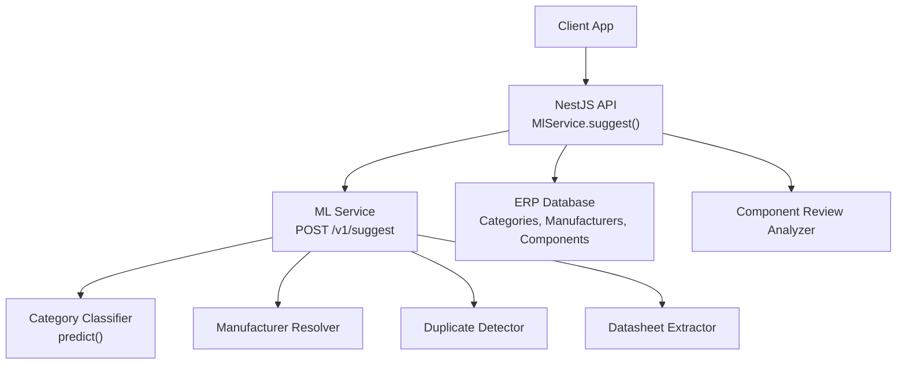
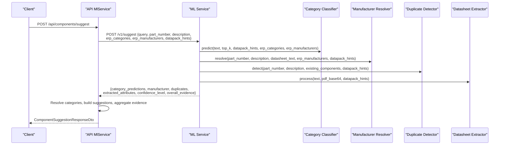
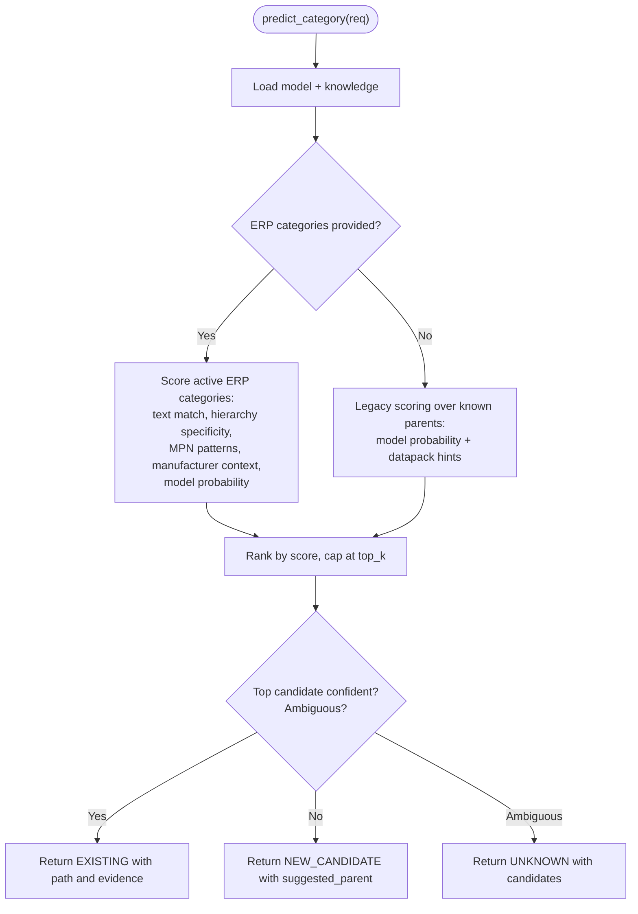
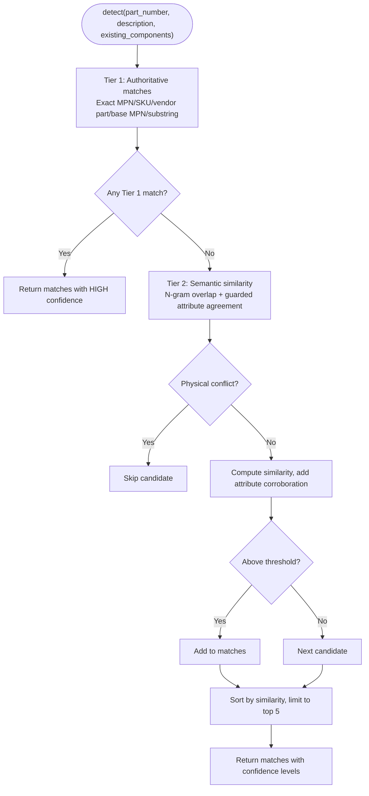
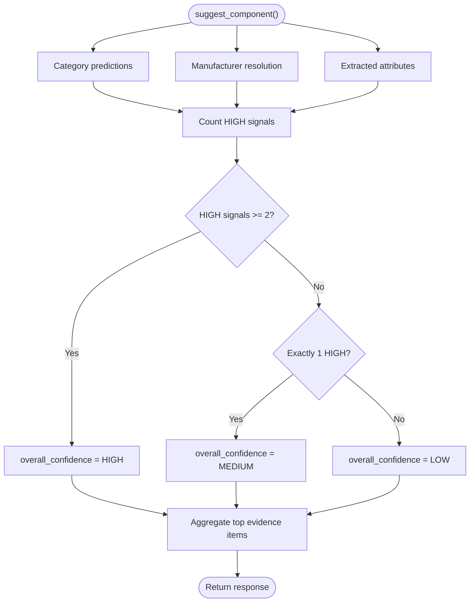
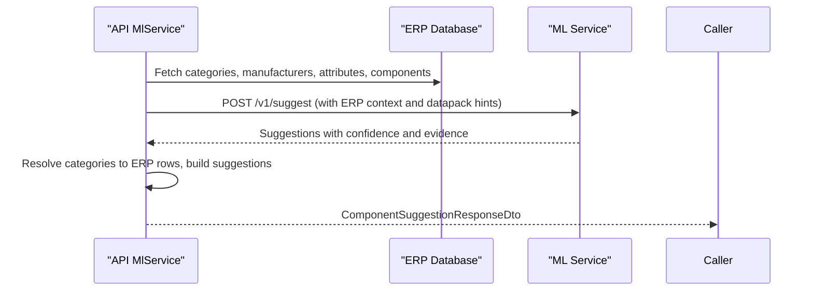
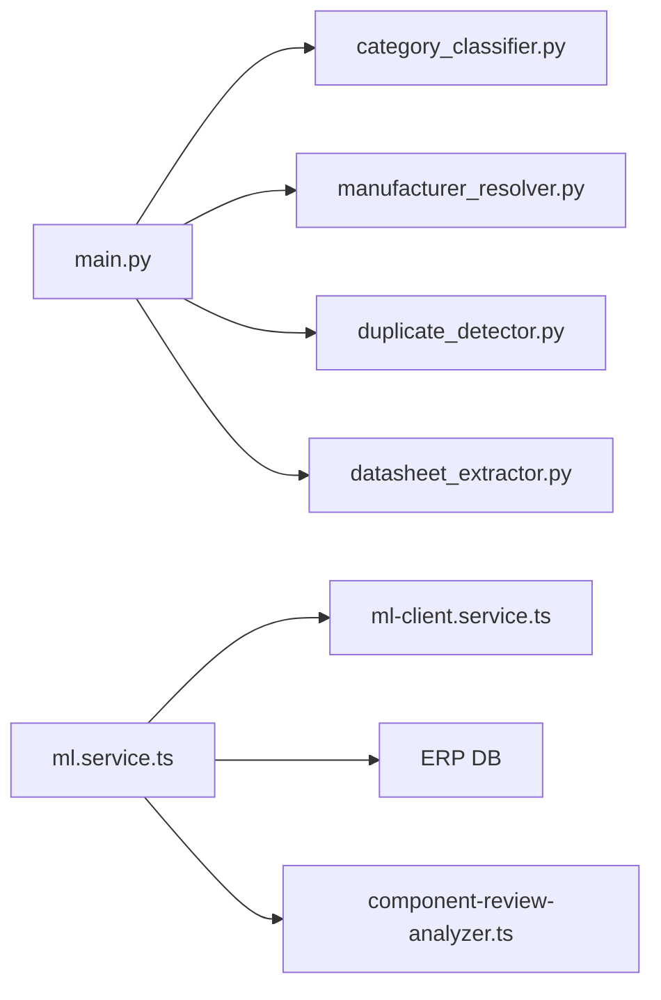

# Component Intelligence

<cite>
**Referenced Files in This Document**
- [main.py](file://apps/ml/app/main.py)
- [category_classifier.py](file://apps/ml/app/services/category_classifier.py)
- [duplicate_detector.py](file://apps/ml/app/services/duplicate_detector.py)
- [schemas.py](file://apps/ml/app/schemas.py)
- [ml.service.ts](file://apps/api/src/ml/ml.service.ts)
- [ml-client.service.ts](file://apps/api/src/ml/ml-client.service.ts)
- [component-review-analyzer.ts](file://apps/api/src/ml/component-review-analyzer.ts)
- [specification-aggregation.ts](file://apps/api/src/ml/specification-aggregation.ts)
</cite>

## Table of Contents
1. [Introduction](#introduction)
2. [Project Structure](#project-structure)
3. [Core Components](#core-components)
4. [Architecture Overview](#architecture-overview)
5. [Detailed Component Analysis](#detailed-component-analysis)
6. [Dependency Analysis](#dependency-analysis)
7. [Performance Considerations](#performance-considerations)
8. [Troubleshooting Guide](#troubleshooting-guide)
9. [Conclusion](#conclusion)

## Introduction
This document explains the component intelligence features that power category classification, duplicate detection, and suggestion workflows across the API and ML service layers. It focuses on:
- The category classifier endpoint `/v1/predict/category`, including top-k predictions, datapack hints, and ERP category filtering.
- The duplicate detection system that identifies existing components by part numbers, SKUs, vendor part numbers, and semantic similarity with strict physical attribute guards.
- The composite confidence calibration system that combines signals from category classification, manufacturer resolution, and attribute extraction to produce an overall confidence level and aggregated evidence.
- Practical guidance for batch processing, evidence aggregation, performance optimization, and troubleshooting low-confidence or false-positive scenarios.

## Project Structure
The intelligence pipeline spans two services:
- Ananya ML Service (Python/FastAPI): implements category classification, manufacturer resolution, duplicate detection, datasheet extraction, and a unified suggest endpoint that composes these signals.
- Ananya API (NestJS/TypeScript): orchestrates calls to the ML service, enriches results with ERP context, applies deterministic fallbacks, and builds review findings and suggestions.

**Diagram sources**
- [main.py:103-152](file://apps/ml/app/main.py#L103-L152)
- [ml.service.ts:313-452](file://apps/api/src/ml/ml.service.ts#L313-L452)

**Section sources**
- [main.py:60-152](file://apps/ml/app/main.py#L60-L152)
- [ml.service.ts:313-452](file://apps/api/src/ml/ml.service.ts#L313-L452)

## Core Components
- Category Classification: Predicts ERP categories or new candidates using model probabilities, ERP metadata, knowledge terms, MPN patterns, and datapack hints. Supports top-k and ERP category filtering.
- Duplicate Detection: Two-tier matching — authoritative exact matches (MPN/SKU/vendor part/base MPN) followed by semantic similarity with guarded physical attributes.
- Composite Confidence Calibration: Aggregates high-confidence signals from category, manufacturer, and extracted attributes to compute an overall confidence level and collect representative evidence.
- Suggestion Workflow: The API composes ML outputs with ERP data, applies deterministic fallbacks when needed, and produces actionable suggestions and review findings.

**Section sources**
- [category_classifier.py:44-477](file://apps/ml/app/services/category_classifier.py#L44-L477)
- [duplicate_detector.py:35-312](file://apps/ml/app/services/duplicate_detector.py#L35-L312)
- [main.py:154-256](file://apps/ml/app/main.py#L154-L256)
- [ml.service.ts:313-953](file://apps/api/src/ml/ml.service.ts#L313-L953)

## Architecture Overview
The end-to-end flow for a component suggestion request:

**Diagram sources**
- [main.py:154-256](file://apps/ml/app/main.py#L154-L256)
- [ml.service.ts:313-953](file://apps/api/src/ml/ml.service.ts#L313-L953)

## Detailed Component Analysis

### Category Classification Endpoint (/v1/predict/category)
- Purpose: Predict one or more ERP categories for a text query, optionally constrained to active ERP categories and enriched by datapack hints and datasheet text.
- Inputs:
  - text: query string combining part number and description.
  - top_k: number of candidate predictions (default 3).
  - datapack_hints: category-specific rules such as aliases, keywords, MPN patterns, and common terminology.
  - erp_categories: active ERP categories with hierarchy paths used to filter and score only relevant categories.
  - erp_manufacturers: optional manufacturer context to boost category scores when names or codes appear in the input.
  - datasheet_text: optional specification text appended to improve classification accuracy.
- Outputs:
  - predictions: list of CategoryPrediction objects with category, subcategory, resolution (EXISTING/NEW_CANDIDATE/UNKNOWN), confidence, confidence_level, candidates, and evidence.
- Behavior highlights:
  - When ERP categories are provided, scoring uses ERP metadata, hierarchy specificity, MPN patterns, and knowledge terms; unknown or ambiguous cases return UNKNOWN with candidates for reviewer action.
  - Without ERP categories, legacy mode falls back to known parent categories and model probabilities.
  - Evidence items explain why each prediction was scored (classifier probability, MPN pattern match, data pack rule, ERP metadata).

**Diagram sources**
- [category_classifier.py:192-477](file://apps/ml/app/services/category_classifier.py#L192-L477)

**Section sources**
- [main.py:103-124](file://apps/ml/app/main.py#L103-L124)
- [category_classifier.py:192-477](file://apps/ml/app/services/category_classifier.py#L192-L477)
- [schemas.py:86-105](file://apps/ml/app/schemas.py#L86-L105)

### Duplicate Detection System
- Purpose: Identify existing components that may be duplicates of the queried part, prioritizing authoritative identifiers before semantic similarity.
- Inputs:
  - part_number: primary identifier to compare.
  - description: supplementary text for semantic comparison.
  - existing_components: catalog entries with id, sku, name, description, manufacturer_part_number.
  - similarity_threshold: threshold for semantic tier (default 0.75).
  - datapack_hints: optional hints used during attribute extraction for guard checks.
- Matching tiers:
  - Tier 1 (Authoritative): Exact MPN, exact SKU, exact vendor part number (extracted from description), base MPN ignoring packaging suffixes, and significant substring overlap if the normalized part is substantial.
  - Tier 2 (Advisory Semantic): N-gram textual similarity between query and component descriptions, corroborated by agreement on guarded physical attributes (resistance, capacitance, voltage, package, tolerance, dielectric, power, current). Physical conflicts reject candidates outright.
- Output:
  - DetectDuplicatesResponse with is_duplicate flag and up to five ranked matches, each with similarity, confidence_level, match_type, reason, and evidence.

**Diagram sources**
- [duplicate_detector.py:35-312](file://apps/ml/app/services/duplicate_detector.py#L35-L312)

**Section sources**
- [duplicate_detector.py:35-312](file://apps/ml/app/services/duplicate_detector.py#L35-L312)
- [schemas.py:132-162](file://apps/ml/app/schemas.py#L132-L162)

### Composite Confidence Calibration and Evidence Aggregation
- Purpose: Combine signals from category classification, manufacturer resolution, and attribute extraction to determine an overall confidence level and assemble representative evidence for user-facing decisions.
- ML Service Path:
  - Counts high-confidence signals: category confidence level HIGH, manufacturer confidence level HIGH, and presence of extracted attributes.
  - Assigns overall confidence level: HIGH if two or more signals are HIGH; MEDIUM if exactly one; LOW otherwise.
  - Collects overall_evidence by taking top items from category, manufacturer, and attribute evidence arrays.
- API Path:
  - Mirrors the same logic after resolving categories and manufacturers, then aggregates evidence slices into overall_evidence and sets overallConfLevel based on primary category and manufacturer confidence levels.
- Specification Aggregation (for attribute values):
  - Builds per-attribute aggregate confidence considering source conflict count, document count, primary vs contextual evidence, expected-by-category, ERP agreement, validation validity, and weakest-source bounding. Produces confidenceReasons for transparency.

**Diagram sources**
- [main.py:220-256](file://apps/ml/app/main.py#L220-L256)
- [ml.service.ts:928-953](file://apps/api/src/ml/ml.service.ts#L928-L953)
- [specification-aggregation.ts:710-810](file://apps/api/src/ml/specification-aggregation.ts#L710-L810)

**Section sources**
- [main.py:220-256](file://apps/ml/app/main.py#L220-L256)
- [ml.service.ts:928-953](file://apps/api/src/ml/ml.service.ts#L928-L953)
- [specification-aggregation.ts:710-810](file://apps/api/src/ml/specification-aggregation.ts#L710-L810)

### Suggestion Workflow and ERP Integration
- The API fetches ERP categories, manufacturers, attributes, and candidate components, then calls the ML service’s unified suggest endpoint.
- If the ML service responds, its outputs are resolved against ERP records (e.g., mapping ML-picked category names to canonical rows), and alternative categories are preserved.
- Deterministic fallbacks apply when the ML service is unavailable or returns no predictions, using Data Pack hints and keyword heuristics to assign categories and manufacturers.
- Duplicate detection excludes the component being edited to avoid self-matches and limits candidate scans to a bounded set ordered oldest-first to preserve canonical records.

**Diagram sources**
- [ml.service.ts:313-452](file://apps/api/src/ml/ml.service.ts#L313-L452)
- [ml.service.ts:544-670](file://apps/api/src/ml/ml.service.ts#L544-L670)

**Section sources**
- [ml.service.ts:313-452](file://apps/api/src/ml/ml.service.ts#L313-L452)
- [ml.service.ts:544-670](file://apps/api/src/ml/ml.service.ts#L544-L670)

## Dependency Analysis
- ML Service depends on:
  - Category classifier model artifact and knowledge JSON for classification.
  - Manufacturer resolver for brand/part identity.
  - Duplicate detector for catalog matching.
  - Datasheet extractor for attribute extraction and PDF handling.
- API depends on:
  - ML client service for HTTP calls to the ML service.
  - ERP database for categories, manufacturers, attributes, and components.
  - Data packs service for active intelligence hints.
  - Component review analyzer for generating review findings from suggestions.

**Diagram sources**
- [main.py:47-52](file://apps/ml/app/main.py#L47-L52)
- [ml.service.ts:19-20](file://apps/api/src/ml/ml.service.ts#L19-L20)
- [ml.service.ts:313-452](file://apps/api/src/ml/ml.service.ts#L313-L452)

**Section sources**
- [main.py:47-52](file://apps/ml/app/main.py#L47-L52)
- [ml.service.ts:19-20](file://apps/api/src/ml/ml.service.ts#L19-L20)

## Performance Considerations
- Model loading: Category classifier loads models eagerly at startup to minimize cold-start latency.
- Bounded candidate scanning: Duplicate detection limits scanned components to a fixed bound and orders oldest-first to ensure canonical records remain in scope.
- Evidence capping: Top evidence items are limited per signal to keep payloads manageable.
- Timeout handling: API client enforces timeouts for ML calls to prevent blocking long-running requests.
- Batch endpoints: Use `/v1/predict/category/batch` for multiple queries to reduce round-trips.

[No sources needed since this section provides general guidance]

## Troubleshooting Guide
- Low confidence scores:
  - Check whether ERP categories were supplied; without them, classification falls back to legacy mode which may yield lower confidence.
  - Verify datapack hints include accurate MPN patterns and aliases for your part families.
  - Ensure datasheet text is included so the classifier can leverage specification content.
  - Inspect overall_evidence to see which signals contributed and their weights.
- Duplicate detection false positives:
  - Confirm that manufacturer_part_number is present in existing components; without it, detection relies on less precise fields like SKU or description.
  - Review guarded physical attributes: mismatches in resistance, capacitance, voltage, package, tolerance, dielectric, power, or current will reject candidates even if text overlaps.
  - Adjust similarity_threshold if necessary, but note that attribute corroboration is capped to avoid inflating scores.
- Self-match avoidance:
  - When editing a component, the API removes the current component from the candidate set before duplicate detection to prevent reporting itself as a duplicate.
- Evidence-driven debugging:
  - Use evidence items from category predictions, manufacturer resolution, and extracted attributes to understand why a decision was made.
  - For attribute-level issues, consult specification aggregation confidence reasons to identify weak mappings, conflicts, or missing primary evidence.

**Section sources**
- [ml.service.ts:356-365](file://apps/api/src/ml/ml.service.ts#L356-L365)
- [duplicate_detector.py:68-75](file://apps/ml/app/services/duplicate_detector.py#L68-L75)
- [duplicate_detector.py:226-305](file://apps/ml/app/services/duplicate_detector.py#L226-L305)
- [specification-aggregation.ts:710-810](file://apps/api/src/ml/specification-aggregation.ts#L710-L810)

## Conclusion
The component intelligence system integrates category classification, manufacturer resolution, duplicate detection, and attribute extraction into a cohesive workflow. It leverages ERP context, datapack hints, and datasheet content to produce actionable suggestions with transparent evidence and calibrated confidence levels. By following the recommended practices for batching, evidence aggregation, and performance tuning, teams can achieve reliable classification and duplication prevention while maintaining clear auditability through evidence and confidence reasoning.