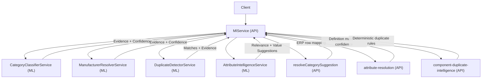
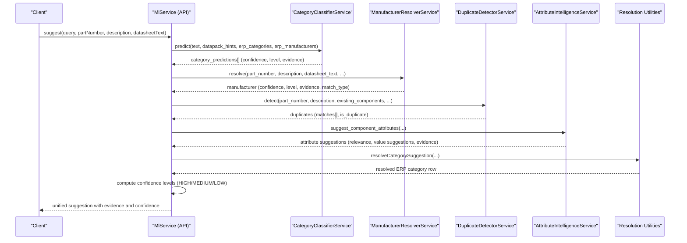
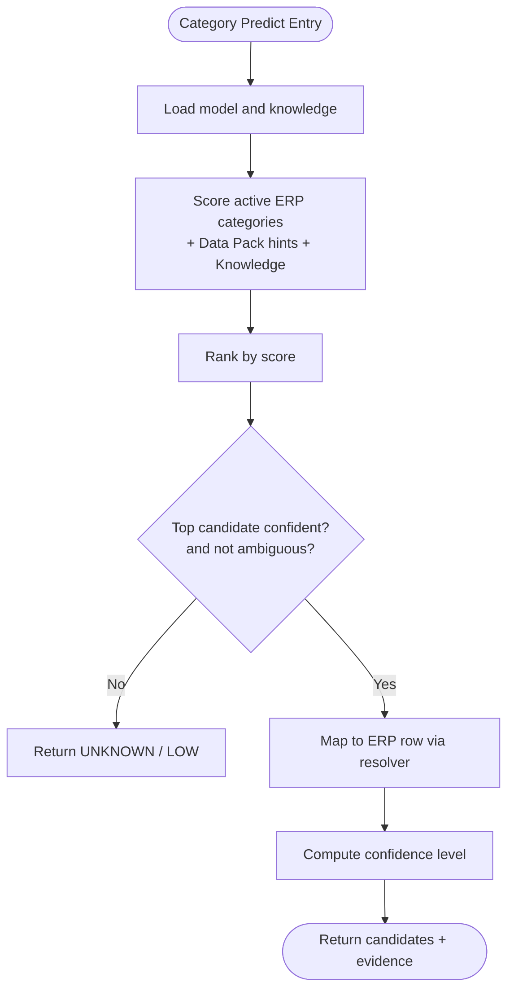
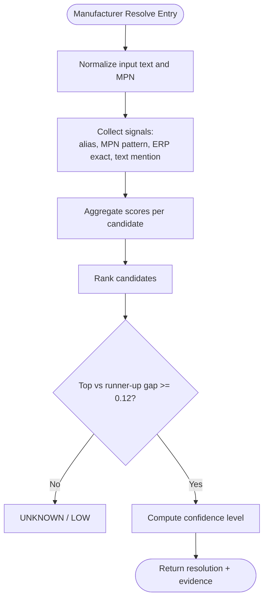
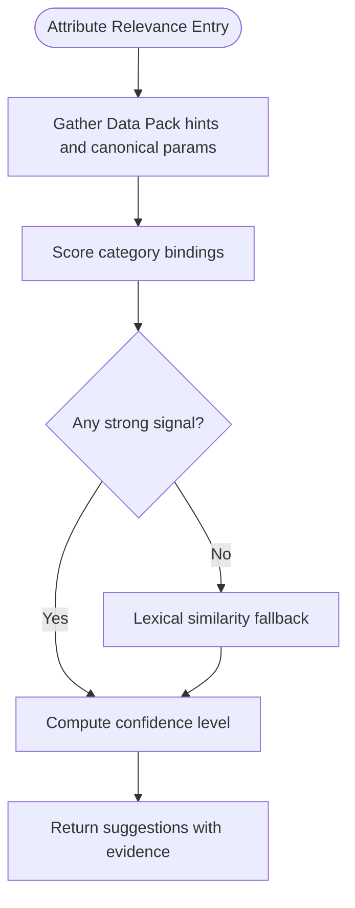
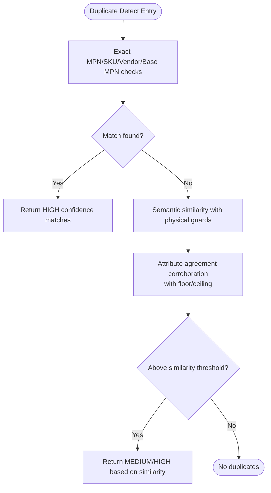
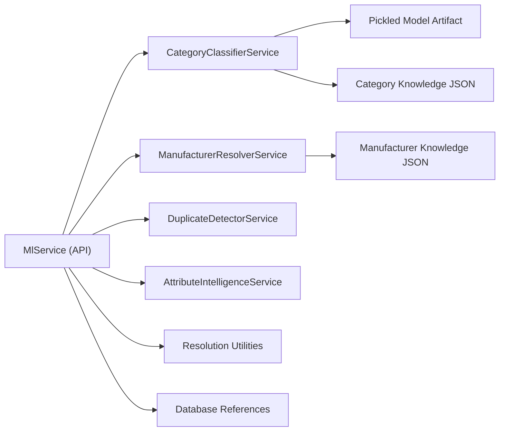

# Confidence Calibration & Scoring

<cite>
**Referenced Files in This Document**
- [ml.service.ts](file://apps/api/src/ml/ml.service.ts)
- [category_classifier.py](file://apps/ml/app/services/category_classifier.py)
- [manufacturer_resolver.py](file://apps/ml/app/services/manufacturer_resolver.py)
- [duplicate_detector.py](file://apps/ml/app/services/duplicate_detector.py)
- [attribute_intelligence.py](file://apps/ml/app/services/attribute_intelligence.py)
- [component-duplicate-intelligence.ts](file://apps/api/src/ml/component-duplicate-intelligence.ts)
- [attribute-resolution.ts](file://apps/api/src/ml/attribute-resolution.ts)
- [category-suggestion-resolution.ts](file://apps/api/src/ml/category-suggestion-resolution.ts)
- [dtos.ts](file://apps/api/src/ml/dtos.ts)
- [schemas.py](file://apps/ml/app/schemas.py)
</cite>

## Table of Contents
1. Introduction
2. Project Structure
3. Core Components
4. Architecture Overview
5. Detailed Component Analysis
6. Dependency Analysis
7. Performance Considerations
8. Troubleshooting Guide
9. Conclusion

## Introduction
This document explains the composite confidence calibration system that combines multiple intelligence signals to produce unified confidence scores for component classification, manufacturer resolution, attribute extraction, and duplicate detection. It details how evidence from category classification, manufacturer resolution, attribute extraction, and duplicate detection is aggregated, weighted, and thresholded to determine HIGH/MEDIUM/LOW confidence levels. It also provides practical examples of score calculation, patterns for evidence aggregation, and guidance for troubleshooting low-confidence predictions.

## Project Structure
The confidence system spans two layers:
- ML microservice (Python): produces per-signal predictions with structured evidence and per-signal confidence.
- API layer (TypeScript/NestJS): orchestrates calls, normalizes results, applies deterministic tie-breaks, and composes a final suggestion payload with unified confidence levels.

**Diagram sources**
- [ml.service.ts:313-800](file://apps/api/src/ml/ml.service.ts#L313-L800)
- [category_classifier.py:44-477](file://apps/ml/app/services/category_classifier.py#L44-L477)
- [manufacturer_resolver.py:20-308](file://apps/ml/app/services/manufacturer_resolver.py#L20-L308)
- [duplicate_detector.py:35-312](file://apps/ml/app/services/duplicate_detector.py#L35-L312)
- [attribute_intelligence.py:497-800](file://apps/ml/app/services/attribute_intelligence.py#L497-L800)
- [category-suggestion-resolution.ts:128-189](file://apps/api/src/ml/category-suggestion-resolution.ts#L128-L189)
- [attribute-resolution.ts:690-778](file://apps/api/src/ml/attribute-resolution.ts#L690-L778)
- [component-duplicate-intelligence.ts:18-129](file://apps/api/src/ml/component-duplicate-intelligence.ts#L18-L129)

**Section sources**
- [ml.service.ts:313-800](file://apps/api/src/ml/ml.service.ts#L313-L800)
- [category_classifier.py:44-477](file://apps/ml/app/services/category_classifier.py#L44-L477)
- [manufacturer_resolver.py:20-308](file://apps/ml/app/services/manufacturer_resolver.py#L20-L308)
- [duplicate_detector.py:35-312](file://apps/ml/app/services/duplicate_detector.py#L35-L312)
- [attribute_intelligence.py:497-800](file://apps/ml/app/services/attribute_intelligence.py#L497-L800)
- [category-suggestion-resolution.ts:128-189](file://apps/api/src/ml/category-suggestion-resolution.ts#L128-L189)
- [attribute-resolution.ts:690-778](file://apps/api/src/ml/attribute-resolution.ts#L690-L778)
- [component-duplicate-intelligence.ts:18-129](file://apps/api/src/ml/component-duplicate-intelligence.ts#L18-L129)

## Core Components
- Category Classification: Produces top-k category candidates with confidence and evidence from model probabilities, Data Pack hints, ERP metadata, and knowledge terms.
- Manufacturer Resolution: Aggregates alias matches, MPN prefix patterns, ERP exact matches, and text mentions to resolve a manufacturer with confidence and match type.
- Attribute Extraction and Relevance: Suggests which attributes matter and what values are plausible, using canonical parameter knowledge, Data Pack expectations, and lexical similarity.
- Duplicate Detection: Two-tier approach—authoritative identity checks (exact MPN/SKU/vendor part/base MPN) and guarded semantic similarity with physical attribute conflict checks.
- API Orchestration and Calibration: Normalizes ML outputs, resolves categories to ERP rows deterministically, computes confidence levels, and composes a unified response with evidence.

**Section sources**
- [category_classifier.py:181-259](file://apps/ml/app/services/category_classifier.py#L181-L259)
- [manufacturer_resolver.py:53-304](file://apps/ml/app/services/manufacturer_resolver.py#L53-L304)
- [attribute_intelligence.py:501-632](file://apps/ml/app/services/attribute_intelligence.py#L501-L632)
- [duplicate_detector.py:35-312](file://apps/ml/app/services/duplicate_detector.py#L35-L312)
- [ml.service.ts:454-670](file://apps/api/src/ml/ml.service.ts#L454-L670)

## Architecture Overview
The composite scoring pipeline integrates four intelligence signals into one coherent recommendation set. Each signal contributes structured evidence and a numeric confidence; the API layer maps these to standardized confidence levels and ensures deterministic behavior across same-named entities.

**Diagram sources**
- [ml.service.ts:313-800](file://apps/api/src/ml/ml.service.ts#L313-L800)
- [category_classifier.py:457-477](file://apps/ml/app/services/category_classifier.py#L457-L477)
- [manufacturer_resolver.py:73-304](file://apps/ml/app/services/manufacturer_resolver.py#L73-L304)
- [duplicate_detector.py:35-312](file://apps/ml/app/services/duplicate_detector.py#L35-L312)
- [attribute_intelligence.py:727-800](file://apps/ml/app/services/attribute_intelligence.py#L727-L800)
- [category-suggestion-resolution.ts:128-189](file://apps/api/src/ml/category-suggestion-resolution.ts#L128-L189)

## Detailed Component Analysis

### Category Classification Confidence
- Signal sources: statistical model probability, Data Pack MPN patterns and keywords/terms, ERP category metadata (name/code/description), manufacturer context, and category knowledge base terms.
- Weighting: model probability is scaled and added to rule-based boosts; strong Data Pack rules can push confidence into HIGH even when model probability is moderate.
- Thresholds: confidence levels use consistent thresholds (HIGH ≥ 0.85, MEDIUM ≥ 0.60, LOW < 0.60). Ambiguity between top candidates can downgrade to UNKNOWN with LOW confidence.
- Evidence: each candidate includes evidence items describing matched rules and model contributions.

**Diagram sources**
- [category_classifier.py:278-455](file://apps/ml/app/services/category_classifier.py#L278-L455)
- [category-suggestion-resolution.ts:128-189](file://apps/api/src/ml/category-suggestion-resolution.ts#L128-L189)

**Section sources**
- [category_classifier.py:181-259](file://apps/ml/app/services/category_classifier.py#L181-L259)
- [category_classifier.py:278-455](file://apps/ml/app/services/category_classifier.py#L278-L455)
- [category-suggestion-resolution.ts:128-189](file://apps/api/src/ml/category-suggestion-resolution.ts#L128-L189)

### Manufacturer Resolution Confidence
- Signal sources: known aliases, MPN prefix patterns, ERP exact matches, and direct text mentions.
- Weighting: exact ERP match yields very high confidence; alias or pattern matches add substantial confidence; text-only mentions provide lower confidence.
- Thresholds: uses the same HIGH/MEDIUM/LOW thresholds; ambiguous cases (close runner-up) return UNKNOWN with LOW confidence.
- Evidence: includes match_type (datapack, erp, pattern, alias, knowledge) and ranked candidates.

**Diagram sources**
- [manufacturer_resolver.py:73-304](file://apps/ml/app/services/manufacturer_resolver.py#L73-L304)

**Section sources**
- [manufacturer_resolver.py:53-304](file://apps/ml/app/services/manufacturer_resolver.py#L53-L304)

### Attribute Extraction and Relevance Confidence
- Signal sources: canonical electronics parameters, Data Pack expected attributes, lexical similarity, and inventory telemetry.
- Weighting: Data Pack expectation and canonical taxonomy dominate; lexical similarity is a fallback; existing data usage adds small boost.
- Thresholds: confidence levels follow HIGH ≥ 0.85, MEDIUM ≥ 0.60, LOW < 0.60; only suggestions above a relevance threshold are returned.
- Evidence: includes source types like data_pack_rule, taxonomy, existing_data, classifier.

**Diagram sources**
- [attribute_intelligence.py:501-632](file://apps/ml/app/services/attribute_intelligence.py#L501-L632)

**Section sources**
- [attribute_intelligence.py:23-242](file://apps/ml/app/services/attribute_intelligence.py#L23-L242)
- [attribute_intelligence.py:501-632](file://apps/ml/app/services/attribute_intelligence.py#L501-L632)

### Duplicate Detection Confidence
- Tier 1 (Authoritative): Exact MPN, SKU, vendor part, and base MPN (packaging suffix stripped) yield HIGH confidence with similarity near 1.0. Physical attribute conflicts are checked to avoid false positives.
- Tier 2 (Advisory): N-gram textual similarity with strict guards against physical conflicts; attribute agreement corroborates but never creates a match from scratch. Corroboration has a floor and ceiling to prevent inflation.
- Output: matches include similarity, confidence_level, match_type, reason, and evidence.

**Diagram sources**
- [duplicate_detector.py:35-312](file://apps/ml/app/services/duplicate_detector.py#L35-L312)

**Section sources**
- [duplicate_detector.py:35-312](file://apps/ml/app/services/duplicate_detector.py#L35-L312)

### Composite Scoring and Unified Confidence Levels
- The API composes category, manufacturer, attribute, and duplicate signals into a single suggestion payload.
- Confidence levels are computed consistently:
  - HIGH: typically ≥ 0.85
  - MEDIUM: typically ≥ 0.60
  - LOW: below 0.60
- Category resolution maps ML-predicted names/codes to ERP rows deterministically, prioritizing Data Pack declarations, then ML’s own code/name, then group name.
- Attribute resolution uses named signals and support/negative evidence to compute per-definition confidence and rank alternatives.

```mermaid
classDiagram
class MlService {
+suggest(dto) ComponentSuggestionResponseDto
-buildCategoryPath(id, map) string[]
-extractManufacturerPartNumber(input, manufacturers) string?
}
class CategoryClassifierService {
+predict(text, top_k, hints, categories, manufacturers, datasheet_text) List[CategoryPrediction]
-_erp_predict(...)
-_legacy_predict(...)
}
class ManufacturerResolverService {
+resolve(part_number, description, datasheet_text, erp_manufacturers, hints) ResolveManufacturerResponse
}
class DuplicateDetectorService {
+detect(part_number, description, existing_components, threshold, hints) DetectDuplicatesResponse
}
class AttributeIntelligenceService {
+suggest_component_attributes(...)
+suggest_category_attributes(...)
+suggest_attribute_bindings(...)
}
class CategorySuggestionResolution {
+resolveCategorySuggestion(input, categories, packDeclarations) ResolvedCategorySuggestion?
}
class AttributeResolution {
+resolveAttributeTerm(input) AttributeResolution
}
MlService --> CategoryClassifierService : "calls"
MlService --> ManufacturerResolverService : "calls"
MlService --> DuplicateDetectorService : "calls"
MlService --> AttributeIntelligenceService : "calls"
MlService --> CategorySuggestionResolution : "uses"
MlService --> AttributeResolution : "uses"
```

**Diagram sources**
- [ml.service.ts:313-800](file://apps/api/src/ml/ml.service.ts#L313-L800)
- [category_classifier.py:44-477](file://apps/ml/app/services/category_classifier.py#L44-L477)
- [manufacturer_resolver.py:20-308](file://apps/ml/app/services/manufacturer_resolver.py#L20-L308)
- [duplicate_detector.py:35-312](file://apps/ml/app/services/duplicate_detector.py#L35-L312)
- [attribute_intelligence.py:497-800](file://apps/ml/app/services/attribute_intelligence.py#L497-L800)
- [category-suggestion-resolution.ts:128-189](file://apps/api/src/ml/category-suggestion-resolution.ts#L128-L189)
- [attribute-resolution.ts:690-778](file://apps/api/src/ml/attribute-resolution.ts#L690-L778)

**Section sources**
- [ml.service.ts:454-800](file://apps/api/src/ml/ml.service.ts#L454-L800)
- [category-suggestion-resolution.ts:128-189](file://apps/api/src/ml/category-suggestion-resolution.ts#L128-L189)
- [attribute-resolution.ts:690-778](file://apps/api/src/ml/attribute-resolution.ts#L690-L778)

## Dependency Analysis
- Coupling:
  - API depends on ML services for per-signal predictions and on resolution utilities for deterministic mapping and scoring.
  - ML services depend on configuration, knowledge bases, and optional model artifacts.
- External dependencies:
  - Pickled model artifact for category classification.
  - JSON knowledge files for categories and manufacturers.
  - Database references for ERP categories/manufacturers/components.
- Potential circular dependencies:
  - None observed; API orchestrates ML services and resolution utilities without mutual imports.
- Interface contracts:
  - EvidenceItem structures unify evidence across signals.
  - DTOs define request/response shapes for API consumers.

**Diagram sources**
- [ml.service.ts:313-800](file://apps/api/src/ml/ml.service.ts#L313-L800)
- [category_classifier.py:114-128](file://apps/ml/app/services/category_classifier.py#L114-L128)
- [manufacturer_resolver.py:25-33](file://apps/ml/app/services/manufacturer_resolver.py#L25-L33)
- [schemas.py:4-19](file://apps/ml/app/schemas.py#L4-L19)
- [dtos.ts:14-19](file://apps/api/src/ml/dtos.ts#L14-L19)

**Section sources**
- [ml.service.ts:313-800](file://apps/api/src/ml/ml.service.ts#L313-L800)
- [category_classifier.py:114-128](file://apps/ml/app/services/category_classifier.py#L114-L128)
- [manufacturer_resolver.py:25-33](file://apps/ml/app/services/manufacturer_resolver.py#L25-L33)
- [schemas.py:4-19](file://apps/ml/app/schemas.py#L4-L19)
- [dtos.ts:14-19](file://apps/api/src/ml/dtos.ts#L14-L19)

## Performance Considerations
- Bounded queries: duplicate detection limits candidate components to avoid unbounded payloads.
- Deterministic ordering: oldest-first ordering ensures stable behavior and predictable truncation.
- Model reload safety: atomic swap prevents serving half-loaded models during deployment.
- Evidence deduplication: signals are merged and deduplicated to avoid redundant evidence entries.
- Corroboration caps: attribute agreement in duplicate detection is capped to prevent over-inflation.

[No sources needed since this section provides general guidance]

## Troubleshooting Guide
Common issues and remedies:
- Low category confidence:
  - Inspect evidence for weak signals (e.g., only lexical similarity). Strengthen with Data Pack hints or clearer descriptions.
  - Check for ambiguity between top candidates; if close runner-up exists, consider refining input text.
- Unresolved manufacturer:
  - Verify presence of MPN prefix patterns or exact ERP matches. Add manufacturer hints to Data Packs if missing.
  - Ensure part number normalization removes packaging suffixes appropriately.
- Attribute relevance low:
  - Confirm Data Pack expected attributes align with the component category.
  - Validate unit compatibility and type compatibility; mismatches reduce confidence.
- Duplicate detection false negatives:
  - Ensure manufacturer_part_number is populated; reliance on SKU alone reduces accuracy.
  - Check physical attribute conflicts; conflicting specs will suppress semantic matches.

**Section sources**
- [ml.service.ts:206-228](file://apps/api/src/ml/ml.service.ts#L206-L228)
- [category_classifier.py:417-455](file://apps/ml/app/services/category_classifier.py#L417-L455)
- [manufacturer_resolver.py:253-304](file://apps/ml/app/services/manufacturer_resolver.py#L253-L304)
- [attribute_intelligence.py:501-632](file://apps/ml/app/services/attribute_intelligence.py#L501-L632)
- [duplicate_detector.py:77-312](file://apps/ml/app/services/duplicate_detector.py#L77-L312)

## Conclusion
The composite confidence calibration system integrates multiple intelligence signals with transparent evidence and consistent thresholds to produce reliable HIGH/MEDIUM/LOW confidence levels. By combining authoritative identity checks, rule-based boosts, model probabilities, and guarded semantic similarity, the system balances precision and recall while remaining explainable and auditable. For best results, ensure rich Data Pack hints, accurate ERP references, and complete manufacturer part numbers to maximize signal strength and minimize ambiguity.

[No sources needed since this section summarizes without analyzing specific files]