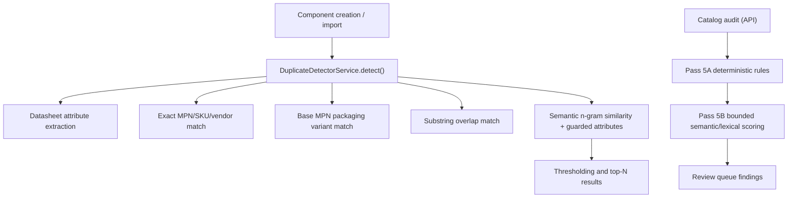
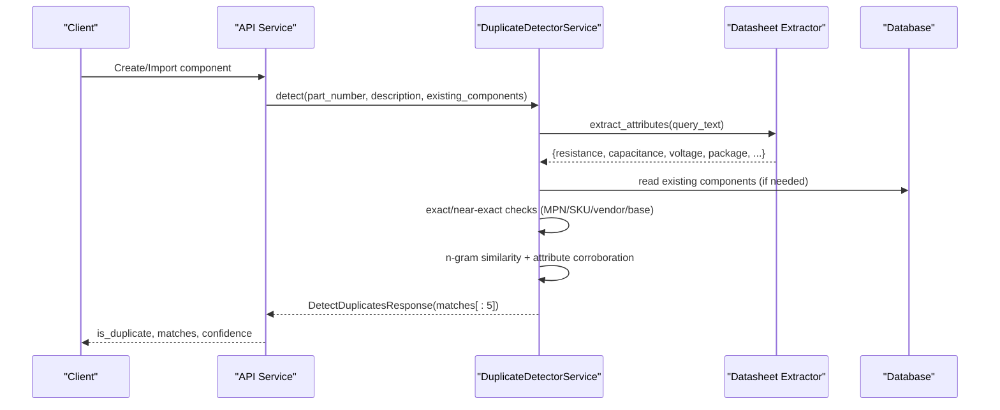
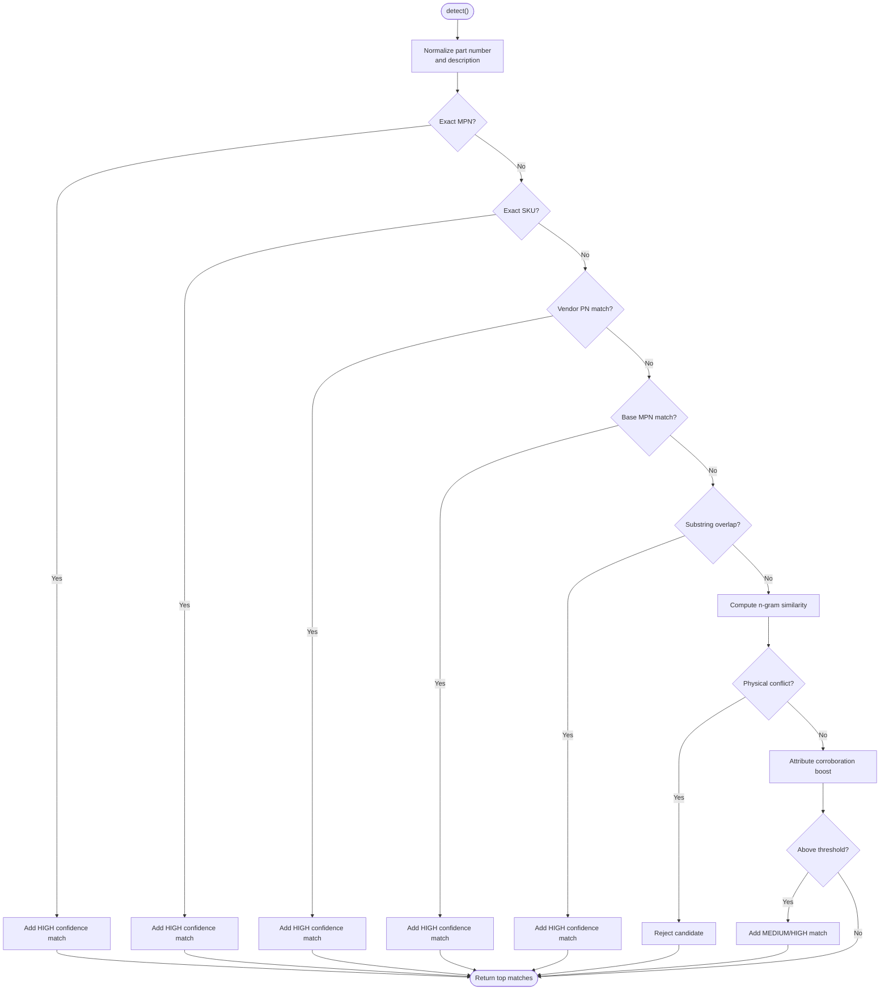
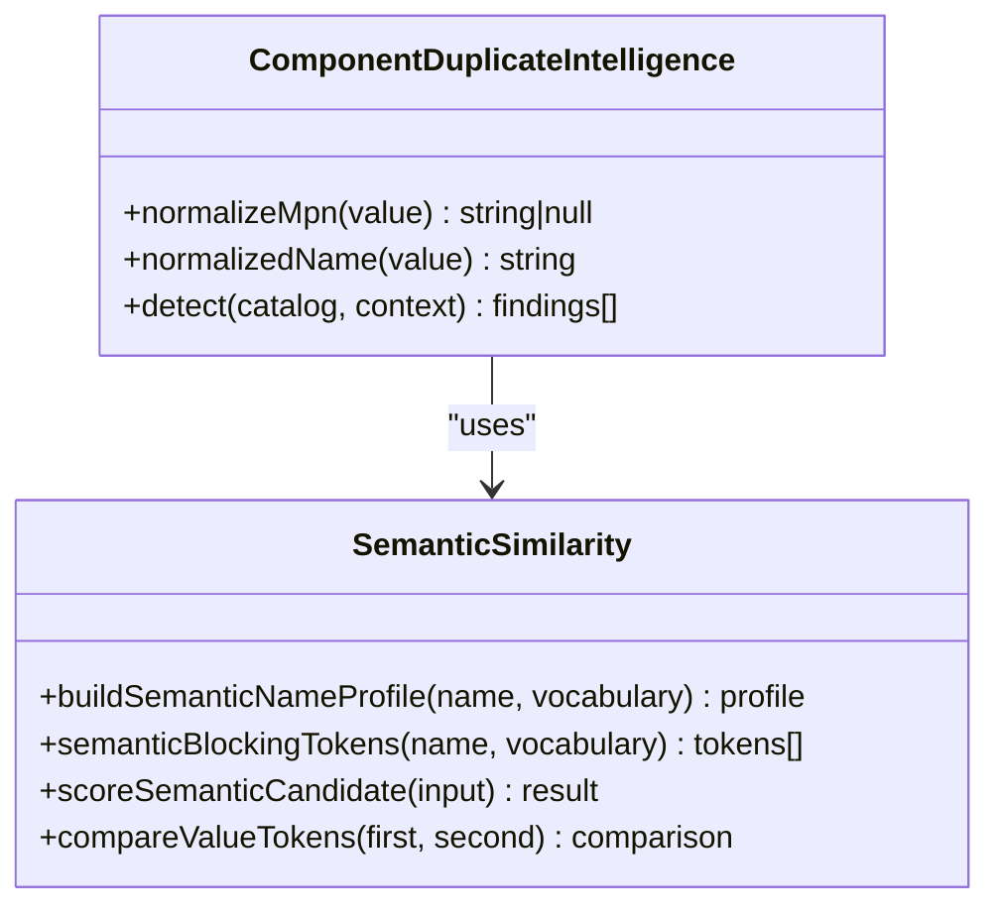
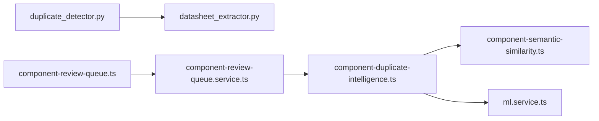

# Duplicate Detection

<cite>
**Referenced Files in This Document**
- [duplicate_detector.py](file://apps/ml/app/services/duplicate_detector.py)
- [datasheet_extractor.py](file://apps/ml/app/services/datasheet_extractor.py)
- [component-duplicate-intelligence.ts](file://apps/api/src/ml/component-duplicate-intelligence.ts)
- [component-semantic-similarity.ts](file://apps/api/src/ml/component-semantic-similarity.ts)
- [ml.service.ts](file://apps/api/src/ml/ml.service.ts)
- [component-review-queue.service.ts](file://apps/api/src/ml/component-review-queue.service.ts)
- [component-review-queue.ts](file://apps/web/lib/component-review-queue.ts)
- [duplicate_benchmark.py](file://apps/ml/benchmarks/duplicate_benchmark.py)
</cite>

## Table of Contents
1. Introduction
2. Project Structure
3. Core Components
4. Architecture Overview
5. Detailed Component Analysis
6. Dependency Analysis
7. Performance Considerations
8. Troubleshooting Guide
9. Conclusion

## Introduction
This document explains the component duplicate detection system that identifies existing components based on part numbers, descriptions, and semantic similarity analysis. It covers how new components are compared against existing inventory using multiple signals: exact matches, fuzzy matching, and domain-aware semantic scoring with strict physical/electrical guards. It also includes practical guidance for batch duplicate detection, confidence scoring, handling edge cases (similar but distinct components), performance optimization techniques for large catalogs, and troubleshooting common issues such as false positives.

## Project Structure
The duplicate detection system spans two layers:
- Creation-time duplicate detection (Python microservice) used when creating or importing components.
- Catalog-wide duplicate intelligence (TypeScript) used by audits to find potential duplicates across persisted components.

**Diagram sources**
- [duplicate_detector.py:35-309](file://apps/ml/app/services/duplicate_detector.py#L35-L309)
- [component-duplicate-intelligence.ts:18-45](file://apps/api/src/ml/component-duplicate-intelligence.ts#L18-L45)
- [component-semantic-similarity.ts:6-23](file://apps/api/src/ml/component-semantic-similarity.ts#L6-L23)

**Section sources**
- [duplicate_detector.py:35-309](file://apps/ml/app/services/duplicate_detector.py#L35-L309)
- [component-duplicate-intelligence.ts:18-45](file://apps/api/src/ml/component-duplicate-intelligence.ts#L18-L45)
- [component-semantic-similarity.ts:6-23](file://apps/api/src/ml/component-semantic-similarity.ts#L6-L23)

## Core Components
- Creation-time duplicate detector (Python): Normalizes part numbers, extracts structured attributes from text, applies hard electrical/physical guards, and computes a similarity score with textual n-gram overlap plus attribute corroboration. Returns top candidates with evidence and confidence levels.
- Catalog duplicate intelligence (TypeScript): Deterministic Pass 5A rules (exact MPN, packaging variants, name/attribute identity) followed by bounded Pass 5B semantic/lexical scoring with manufacturer/category/package/value guards and explainable signals/penalties. Produces review findings with confidence levels and shared tokens.
- Attribute extraction: Regex-based extraction of key electrical parameters (resistance, capacitance, voltage, etc.) used both at creation time and during catalog audits to enforce physical compatibility.
- Review queue integration: Persists findings idempotently, supports pagination/filtering, and surfaces similarity summaries for UI display.

**Section sources**
- [duplicate_detector.py:35-309](file://apps/ml/app/services/duplicate_detector.py#L35-L309)
- [component-duplicate-intelligence.ts:18-45](file://apps/api/src/ml/component-duplicate-intelligence.ts#L18-L45)
- [component-semantic-similarity.ts:105-152](file://apps/api/src/ml/component-semantic-similarity.ts#L105-L152)
- [datasheet_extractor.py:424-564](file://apps/ml/app/services/datasheet_extractor.py#L424-L564)
- [component-review-queue.service.ts:285-322](file://apps/api/src/ml/component-review-queue.service.ts#L285-L322)

## Architecture Overview
The system uses a multi-tier approach to minimize false positives while preserving recall:
- Tier 1: Exact and near-exact identity (MPN/SKU/vendor).
- Tier 2: Advisory semantic similarity with strict guards (electrical/physical conflicts reject candidates outright).
- Catalog audits: Deterministic rules first, then bounded semantic candidate retrieval and scoring.

**Diagram sources**
- [duplicate_detector.py:35-309](file://apps/ml/app/services/duplicate_detector.py#L35-L309)
- [datasheet_extractor.py:424-564](file://apps/ml/app/services/datasheet_extractor.py#L424-L564)

## Detailed Component Analysis

### Creation-Time Duplicate Detector (Python)
- Normalization: Part numbers are normalized by stripping non-alphanumerics and uppercasing; packaging suffixes (e.g., TR, REEL, TAPE) are stripped for base MPN comparison.
- Exact/Near-Exact Matching:
  - Exact MPN match (highest priority).
  - Exact SKU match.
  - Vendor part number match extracted from description.
  - Base MPN match ignoring packaging suffixes.
  - Substring overlap for substantial identifiers.
- Semantic Similarity:
  - Character n-gram Jaccard similarity over combined part number and description.
  - Guarded attributes (resistance, capacitance, inductance, voltage, package, tolerance, dielectric, power, current) are extracted and checked for conflicts; conflicts reject candidates.
  - Attribute agreement corroborates similarity only above a text floor and adds bounded boosts up to a ceiling.
- Output: Top matches with similarity scores, confidence levels (HIGH/MEDIUM), reasons, and evidence items.

**Diagram sources**
- [duplicate_detector.py:35-309](file://apps/ml/app/services/duplicate_detector.py#L35-L309)

**Section sources**
- [duplicate_detector.py:5-34](file://apps/ml/app/services/duplicate_detector.py#L5-L34)
- [duplicate_detector.py:77-224](file://apps/ml/app/services/duplicate_detector.py#L77-L224)
- [duplicate_detector.py:226-309](file://apps/ml/app/services/duplicate_detector.py#L226-L309)

### Catalog Duplicate Intelligence (TypeScript)
- Pass 5A Deterministic Rules:
  - EXACT_MPN: Same manufacturer identity + same normalized MPN.
  - PACKAGING_VARIANT: Same manufacturer identity + same MPN modulo packaging/reel suffix.
  - MPN_MANUFACTURER_CONFLICT: Identical normalized MPN but conflicting manufacturers.
  - NAME_ATTRIBUTE_IDENTITY: Same manufacturer identity + same normalized name + compatible categories + no conflicting structured attributes.
- Pass 5B Bounded Semantic/Lexical Scoring:
  - Candidate retrieval is bounded via blocking keys (name prefixes, MPN family prefixes, technical value tokens, package codes) to avoid N x N comparisons.
  - Name tokenization merges amounts with units (e.g., “10k” + “ohm” -> “10kohm”), recognizes package codes, and extracts technical values.
  - Scoring weights include manufacturer identity, category relation, name similarity, technical value agreement, package agreement, structured attribute agreement, and MPN family prefix. Penalties apply for manufacturer conflict and package token conflict.
  - Hard guards reject candidates with incompatible categories, structured attribute conflicts, technical value conflicts, generic-only names, or package-only overlap.
  - Confidence level is HIGH when score and name similarity thresholds are met with no penalties and sufficient strong signals.

**Diagram sources**
- [component-duplicate-intelligence.ts:18-45](file://apps/api/src/ml/component-duplicate-intelligence.ts#L18-L45)
- [component-semantic-similarity.ts:105-152](file://apps/api/src/ml/component-semantic-similarity.ts#L105-L152)
- [component-semantic-similarity.ts:706-795](file://apps/api/src/ml/component-semantic-similarity.ts#L706-L795)

**Section sources**
- [component-duplicate-intelligence.ts:18-45](file://apps/api/src/ml/component-duplicate-intelligence.ts#L18-L45)
- [component-duplicate-intelligence.ts:1135-1175](file://apps/api/src/ml/component-duplicate-intelligence.ts#L1135-L1175)
- [component-semantic-similarity.ts:105-152](file://apps/api/src/ml/component-semantic-similarity.ts#L105-L152)
- [component-semantic-similarity.ts:706-795](file://apps/api/src/ml/component-semantic-similarity.ts#L706-L795)
- [component-semantic-similarity.ts:967-995](file://apps/api/src/ml/component-semantic-similarity.ts#L967-L995)

### Attribute Extraction and Electrical Guards
- The datasheet extractor parses text to identify key electrical parameters (capacitance, inductance, voltage, current, power) with high confidence and evidence.
- These attributes are used to enforce physical compatibility: if two records claim different values for guarded attributes, they are rejected as duplicates.
- Fallback regex extraction exists in the API layer for quick attribute hints when full extraction is not available.

**Section sources**
- [datasheet_extractor.py:424-564](file://apps/ml/app/services/datasheet_extractor.py#L424-L564)
- [ml.service.ts:1649-1695](file://apps/api/src/ml/ml.service.ts#L1649-L1695)

### Review Queue Integration and Similarity Summaries
- Findings are persisted idempotently; re-running analysis refreshes existing rows without duplicating them.
- The web layer summarizes duplicate similarity data (overall score, name similarity, shared tokens) for UI display.

**Section sources**
- [component-review-queue.service.ts:285-322](file://apps/api/src/ml/component-review-queue.service.ts#L285-L322)
- [component-review-queue.ts:1750-1790](file://apps/web/lib/component-review-queue.ts#L1750-L1790)

## Dependency Analysis
- Python duplicate detector depends on datasheet extraction for attribute parsing and returns structured matches with evidence.
- TypeScript duplicate intelligence composes deterministic rules and bounded semantic scoring, relying on shared constants and utilities for normalization, tokenization, and value comparison.
- Review queue service persists findings and provides list/query capabilities; web utilities render similarity summaries.

**Diagram sources**
- [duplicate_detector.py:35-309](file://apps/ml/app/services/duplicate_detector.py#L35-L309)
- [datasheet_extractor.py:424-564](file://apps/ml/app/services/datasheet_extractor.py#L424-L564)
- [component-duplicate-intelligence.ts:18-45](file://apps/api/src/ml/component-duplicate-intelligence.ts#L18-L45)
- [component-semantic-similarity.ts:6-23](file://apps/api/src/ml/component-semantic-similarity.ts#L6-L23)
- [ml.service.ts:1649-1695](file://apps/api/src/ml/ml.service.ts#L1649-L1695)
- [component-review-queue.service.ts:285-322](file://apps/api/src/ml/component-review-queue.service.ts#L285-L322)
- [component-review-queue.ts:1750-1790](file://apps/web/lib/component-review-queue.ts#L1750-L1790)

**Section sources**
- [duplicate_detector.py:35-309](file://apps/ml/app/services/duplicate_detector.py#L35-L309)
- [component-duplicate-intelligence.ts:18-45](file://apps/api/src/ml/component-duplicate-intelligence.ts#L18-L45)
- [component-semantic-similarity.ts:6-23](file://apps/api/src/ml/component-semantic-similarity.ts#L6-L23)
- [component-review-queue.service.ts:285-322](file://apps/api/src/ml/component-review-queue.service.ts#L285-L322)
- [component-review-queue.ts:1750-1790](file://apps/web/lib/component-review-queue.ts#L1750-L1790)

## Performance Considerations
- Bounded candidate retrieval:
  - Use blocking keys (name prefixes, MPN family prefixes, technical value tokens, package codes) to limit database queries and avoid N x N comparisons.
  - Enforce caps on semantic candidates per component and per audit to prevent unbounded processing.
- Deterministic ordering:
  - Consistent ranking ensures repeated audits produce stable results and predictable truncation points.
- CPU-only, framework-free scoring:
  - No embeddings or external calls; lexical similarity and guard checks run locally for low latency.
- Threshold tuning:
  - Adjust similarity thresholds and corroborative boosts to balance precision and recall for your catalog characteristics.
- Batch processing:
  - For large-scale audits, process components in batches and cap findings per audit to maintain throughput and memory usage.

[No sources needed since this section provides general guidance]

## Troubleshooting Guide
Common issues and resolutions:
- False positives due to generic names:
  - Ensure names contain identity-bearing tokens (part numbers, technical values, package codes). Generic-only names are rejected by design.
- Overly broad substring matches:
  - Require minimum identifier length before substring overlap is considered.
- Conflicting electrical/physical attributes:
  - If guarded attributes differ (e.g., resistance, capacitance, voltage, package), candidates are rejected. Verify attribute extraction accuracy and data quality.
- Packaging suffix confusion:
  - Use base MPN comparison that strips known packaging suffixes (TR, REEL, TAPE, etc.). Confirm suffix lists align with your catalog conventions.
- Manufacturer conflicts:
  - When manufacturers differ, higher thresholds and stronger evidence are required. Validate manufacturer identity resolution and alias mappings.
- Excessive findings:
  - Apply caps on semantic candidates and findings per audit; tune thresholds to reduce noise.

**Section sources**
- [component-semantic-similarity.ts:736-795](file://apps/api/src/ml/component-semantic-similarity.ts#L736-L795)
- [duplicate_detector.py:77-224](file://apps/ml/app/services/duplicate_detector.py#L77-L224)
- [component-duplicate-intelligence.ts:101-129](file://apps/api/src/ml/component-duplicate-intelligence.ts#L101-L129)

## Practical Examples

### Batch Duplicate Detection Workflow
- Input: List of existing components and a query component (part number + description).
- Process:
  - Normalize identifiers and extract attributes.
  - Run exact/near-exact checks first.
  - If no exact match, compute semantic similarity with guarded attributes.
  - Return top matches with confidence and evidence.
- Output: Structured response indicating duplicates and candidate matches.

**Section sources**
- [duplicate_detector.py:35-309](file://apps/ml/app/services/duplicate_detector.py#L35-L309)

### Confidence Scoring for Potential Duplicates
- Python detector:
  - HIGH confidence for exact/near-exact matches; MEDIUM for semantic matches above threshold.
  - Evidence items include keyword overlap and matched specifications.
- TypeScript auditor:
  - HIGH confidence requires score and name similarity thresholds, no penalties, and sufficient strong signals (technical values agree, attributes agree, package agrees, category same, MPN family).
  - Shared tokens and name similarity are surfaced for transparency.

**Section sources**
- [duplicate_detector.py:287-309](file://apps/ml/app/services/duplicate_detector.py#L287-L309)
- [component-semantic-similarity.ts:967-995](file://apps/api/src/ml/component-semantic-similarity.ts#L967-L995)
- [component-review-queue.ts:1750-1790](file://apps/web/lib/component-review-queue.ts#L1750-L1790)

### Handling Edge Cases: Similar but Distinct Components
- Different electrical values (e.g., 10 kΩ vs 100 kΩ) are rejected by technical value conflict guards.
- Different packages (e.g., 0805 vs 0603) are rejected by package token conflict or attribute conflict.
- Different tolerances or dielectrics are captured by guarded attributes and technical value comparison.
- Packaging variants (e.g., tape/reel suffixes) are recognized as equivalent via base MPN normalization.

**Section sources**
- [duplicate_benchmark.py:28-179](file://apps/ml/benchmarks/duplicate_benchmark.py#L28-L179)
- [component-semantic-similarity.ts:758-795](file://apps/api/src/ml/component-semantic-similarity.ts#L758-L795)
- [duplicate_detector.py:68-75](file://apps/ml/app/services/duplicate_detector.py#L68-L75)

## Benchmarking and Validation
- The benchmark suite compares a general embedding simulation against the domain-aware guarded detector across critical electronics test cases.
- Metrics include accuracy, precision, recall, F1 score, false positives, and average latency.
- Results demonstrate improved precision and reduced false positives with domain-aware guards.

**Section sources**
- [duplicate_benchmark.py:181-304](file://apps/ml/benchmarks/duplicate_benchmark.py#L181-L304)

## Conclusion
The duplicate detection system combines robust exact/near-exact matching with domain-aware semantic similarity and strict electrical/physical guards to minimize false positives while maintaining high recall. Deterministic rules and bounded semantic scoring ensure scalability and explainability. Integration with the review queue enables actionable findings with transparent confidence and evidence. Tuning thresholds and validating against benchmarks helps optimize performance for large catalogs and diverse component data.