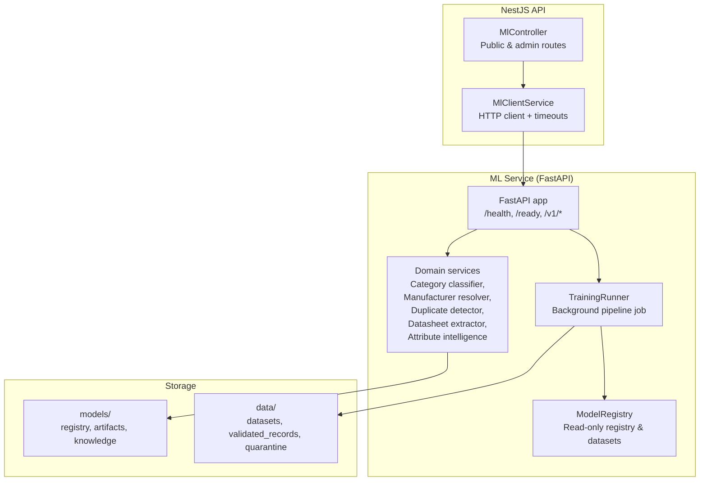
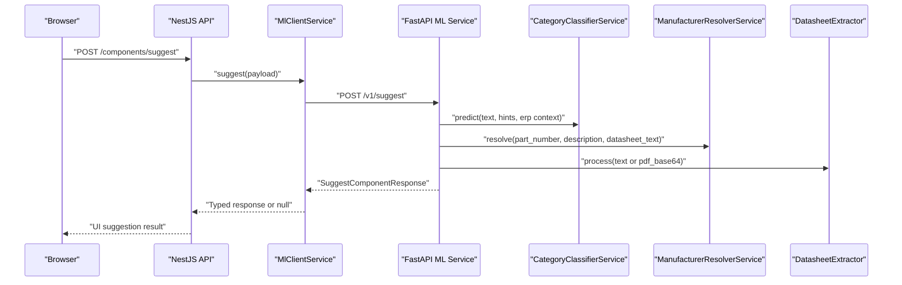
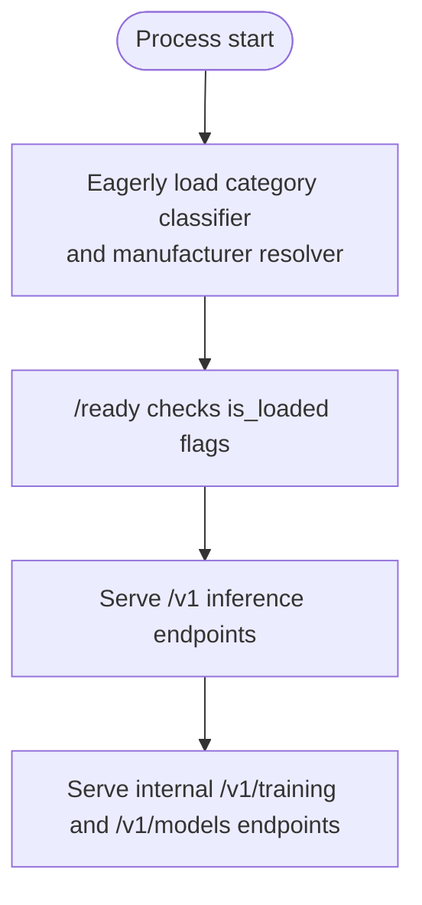
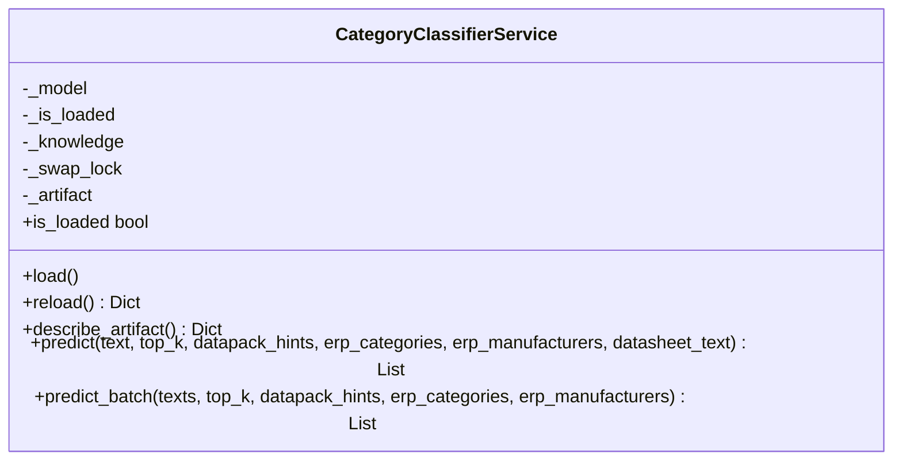
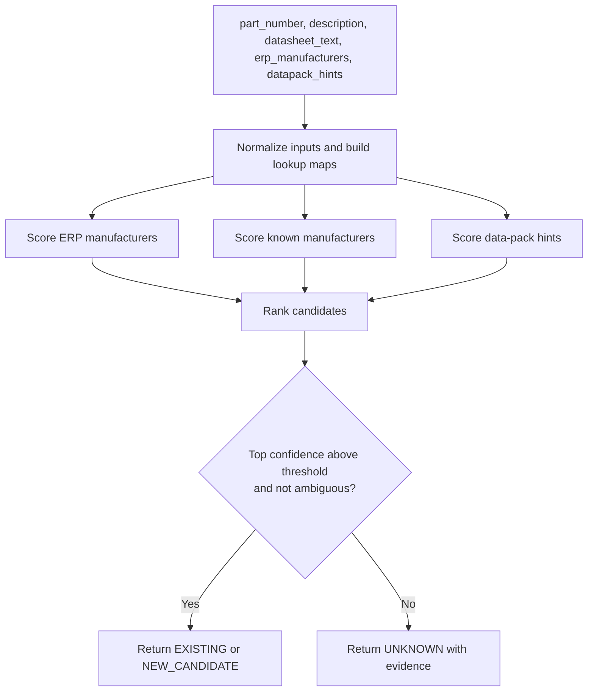
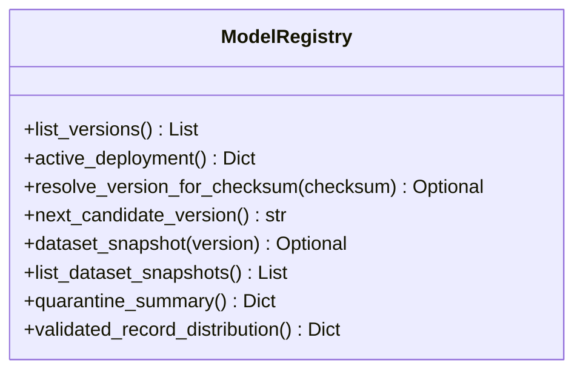
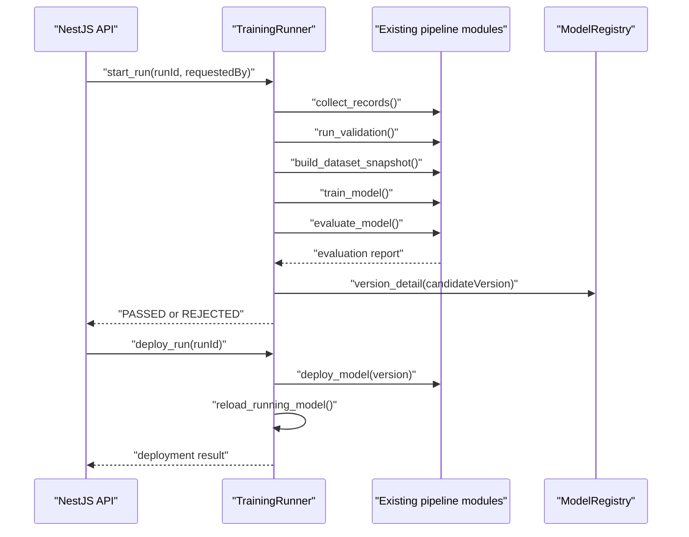
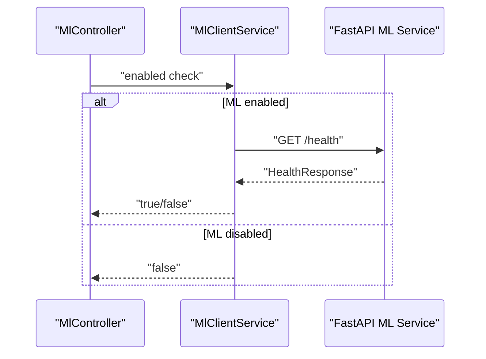
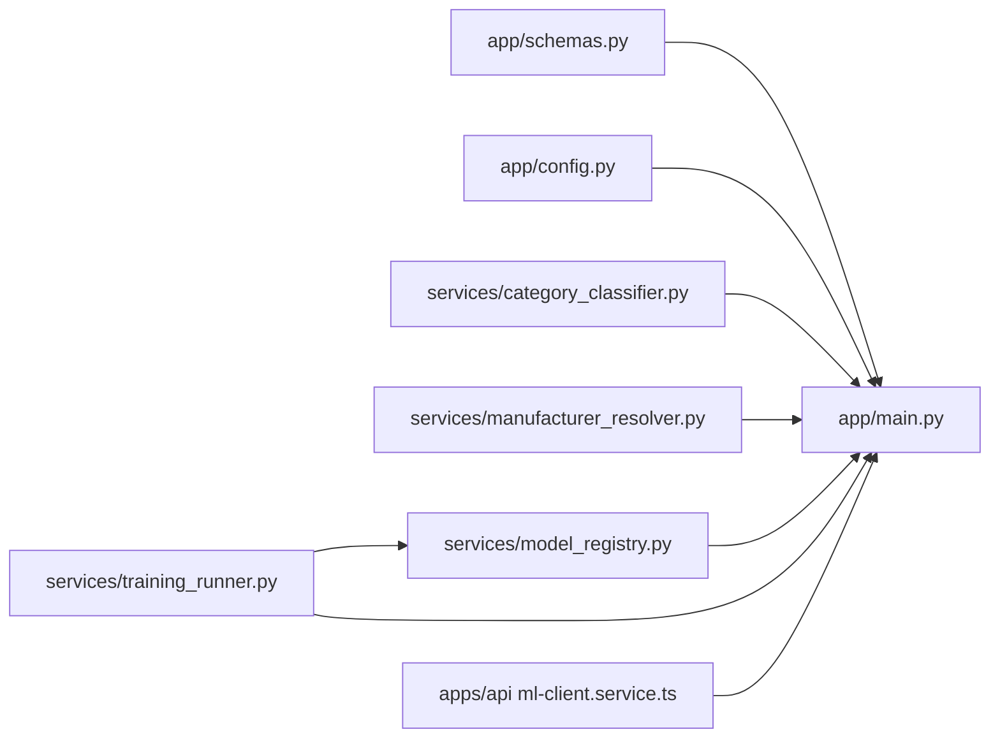

# ML Architecture Overview

<cite>
**Referenced Files in This Document**
- [main.py](file://apps/ml/app/main.py)
- [config.py](file://apps/ml/app/config.py)
- [schemas.py](file://apps/ml/app/schemas.py)
- [category_classifier.py](file://apps/ml/app/services/category_classifier.py)
- [manufacturer_resolver.py](file://apps/ml/app/services/manufacturer_resolver.py)
- [model_registry.py](file://apps/ml/app/services/model_registry.py)
- [training_runner.py](file://apps/ml/app/services/training_runner.py)
- [ml-client.service.ts](file://apps/api/src/ml/ml-client.service.ts)
- [ml.controller.ts](file://apps/api/src/ml/ml.controller.ts)
- [Dockerfile.ml](file://docker/Dockerfile.ml)
- [compose.yml](file://compose.yml)
- [ML_OPERATIONS.md](file://docs/ML_OPERATIONS.md)
</cite>

## Table of Contents
1. [Introduction](#introduction)
2. [Project Structure](#project-structure)
3. [Core Components](#core-components)
4. [Architecture Overview](#architecture-overview)
5. [Detailed Component Analysis](#detailed-component-analysis)
6. [Dependency Analysis](#dependency-analysis)
7. [Performance Considerations](#performance-considerations)
8. [Troubleshooting Guide](#troubleshooting-guide)
9. [Conclusion](#conclusion)

## Introduction
Ananya ERP’s machine learning system is implemented as a lightweight, CPU-first FastAPI microservice that provides component intelligence inference and an operator-facing training control plane. The service loads small scikit-learn models eagerly at startup so inference requests do not pay cold-start latency. Inference endpoints are separated from training operations: the former serve real-time classification, manufacturer resolution, duplicate detection, datasheet extraction, and attribute intelligence; the latter orchestrate dataset collection, validation, training, evaluation, and deployment through background threads while keeping authorization, durable records, and audit trails in the NestJS API.

The service is deployed as a separate container on an internal Docker network. The NestJS API calls it through `MlClientService`, which reads the target URL from environment configuration and applies timeouts and graceful degradation when the ML service is disabled or unreachable.

## Project Structure
The ML service lives under `apps/ml`. Its runtime surface is defined by a FastAPI application with Pydantic schemas, domain services for each intelligence capability, a model registry reader, and a training runner. The NestJS API exposes higher-level routes and uses `MlClientService` to call the ML service over HTTP.

**Diagram sources**
- [main.py:60-80](file://apps/ml/app/main.py#L60-L80)
- [main.py:103-161](file://apps/ml/app/main.py#L103-L161)
- [main.py:258-361](file://apps/ml/app/main.py#L258-L361)
- [main.py:383-486](file://apps/ml/app/main.py#L383-L486)
- [ml-client.service.ts:311-322](file://apps/api/src/ml/ml-client.service.ts#L311-L322)
- [ml.controller.ts:40-95](file://apps/api/src/ml/ml.controller.ts#L40-L95)

**Section sources**
- [main.py:60-80](file://apps/ml/app/main.py#L60-L80)
- [ml-client.service.ts:311-322](file://apps/api/src/ml/ml-client.service.ts#L311-L322)
- [ml.controller.ts:40-95](file://apps/api/src/ml/ml.controller.ts#L40-L95)

## Core Components
- FastAPI application lifecycle and middleware: eager model loading, CORS configuration, health and readiness endpoints, versioned inference routes, and internal ML operations routes.
- Domain services: category classifier, manufacturer resolver, duplicate detector, datasheet extractor, and attribute intelligence service.
- Model registry: read-only view over trained candidates, active deployment metadata, dataset snapshots, quarantine summaries, and validated record distributions.
- Training runner: single-job background executor that runs the existing authoritative pipeline, tracks run state, enforces promotion rules, and coordinates reloads and rollbacks.
- NestJS integration: `MlClientService` is the typed HTTP boundary used by the API to call inference and ML operations endpoints.

Key responsibilities:
- Inference endpoints return structured predictions with evidence and confidence levels.
- Training endpoints expose only a control plane; they do not perform inference.
- The registry never writes artifacts; deployment is delegated to the existing pipeline tool.
- The API owns authentication, durable run records, and audit logs.

**Section sources**
- [main.py:60-101](file://apps/ml/app/main.py#L60-L101)
- [main.py:103-161](file://apps/ml/app/main.py#L103-L161)
- [main.py:258-361](file://apps/ml/app/main.py#L258-L361)
- [main.py:383-486](file://apps/ml/app/main.py#L383-L486)
- [model_registry.py:1-22](file://apps/ml/app/services/model_registry.py#L1-L22)
- [training_runner.py:1-40](file://apps/ml/app/services/training_runner.py#L1-L40)

## Architecture Overview
The ML service is a stateless inference process with optional in-process background jobs. It does not own database connections for its core logic; instead, it reads local model and dataset files and reports status to the NestJS API.

**Diagram sources**
- [ml.controller.ts:119-125](file://apps/api/src/ml/ml.controller.ts#L119-L125)
- [ml-client.service.ts:340-401](file://apps/api/src/ml/ml-client.service.ts#L340-L401)
- [main.py:154-256](file://apps/ml/app/main.py#L154-L256)
- [category_classifier.py:457-473](file://apps/ml/app/services/category_classifier.py#L457-L473)
- [manufacturer_resolver.py:73-304](file://apps/ml/app/services/manufacturer_resolver.py#L73-L304)

### Service Boundaries
- Public inference boundaries: `/health`, `/ready`, `/v1/predict/category`, `/v1/predict/category/batch`, `/v1/resolve/manufacturer`, `/v1/detect/duplicates`, `/v1/extract/datasheet`, `/v1/suggest`, and attribute intelligence endpoints under `/v1/attributes/*`.
- Internal ML operations boundaries: `/v1/training/runs*`, `/v1/models*`, `/v1/datasets/current`. These are documented as an internal surface called only by the authenticated NestJS API.
- NestJS public boundaries: `/ml/health`, `/ml/attributes/*`, `/ml/feedback/*`, `/ml/training/quarantine*`, and legacy suggest routes. Admin-only operations live under `/ml/ops/*` and are described in the ML operations documentation.

**Section sources**
- [main.py:82-101](file://apps/ml/app/main.py#L82-L101)
- [main.py:103-161](file://apps/ml/app/main.py#L103-L161)
- [main.py:258-361](file://apps/ml/app/main.py#L258-L361)
- [main.py:383-486](file://apps/ml/app/main.py#L383-L486)
- [ml.controller.ts:40-95](file://apps/api/src/ml/ml.controller.ts#L40-L95)
- [ML_OPERATIONS.md:16-39](file://docs/ML_OPERATIONS.md#L16-L39)

## Detailed Component Analysis

### FastAPI Application Lifecycle and Endpoints
The application defines a lifespan handler that eagerly loads the category classifier and manufacturer resolver. Health returns a static status and service version; readiness reports whether both models are loaded and includes the identity of the artifact currently being served. CORS is configured broadly for development convenience, but production exposure should be controlled by the reverse proxy or network policy because the ML service is intended for internal use.

**Diagram sources**
- [main.py:60-72](file://apps/ml/app/main.py#L60-L72)
- [main.py:82-101](file://apps/ml/app/main.py#L82-L101)
- [main.py:103-161](file://apps/ml/app/main.py#L103-L161)
- [main.py:383-486](file://apps/ml/app/main.py#L383-L486)

**Section sources**
- [main.py:60-80](file://apps/ml/app/main.py#L60-L80)
- [main.py:82-101](file://apps/ml/app/main.py#L82-L101)
- [config.py:4-19](file://apps/ml/app/config.py#L4-L19)

### Category Classifier Service
The category classifier supports two modes:
- Legacy mode without ERP categories, returning top-level category suggestions with fallback behavior for empty input.
- ERP-aware mode that combines ERP category metadata, category knowledge, data-pack hints, manufacturer context, and statistical model probabilities into ranked candidates.

It also provides atomic reloading of the production artifact so a new model can be swapped into the running process without restarting the container.

**Diagram sources**
- [category_classifier.py:44-52](file://apps/ml/app/services/category_classifier.py#L44-L52)
- [category_classifier.py:114-179](file://apps/ml/app/services/category_classifier.py#L114-L179)
- [category_classifier.py:457-473](file://apps/ml/app/services/category_classifier.py#L457-L473)

**Section sources**
- [category_classifier.py:44-52](file://apps/ml/app/services/category_classifier.py#L44-L52)
- [category_classifier.py:114-179](file://apps/ml/app/services/category_classifier.py#L114-L179)
- [category_classifier.py:192-259](file://apps/ml/app/services/category_classifier.py#L192-L259)
- [category_classifier.py:278-473](file://apps/ml/app/services/category_classifier.py#L278-L473)

### Manufacturer Resolver Service
The manufacturer resolver scores candidate manufacturers using ERP manufacturer records, known aliases, MPN prefix patterns, text matches, and data-pack hints. It returns a resolution decision, confidence level, match type, evidence, and ranked candidates.

**Diagram sources**
- [manufacturer_resolver.py:73-304](file://apps/ml/app/services/manufacturer_resolver.py#L73-L304)

**Section sources**
- [manufacturer_resolver.py:20-37](file://apps/ml/app/services/manufacturer_resolver.py#L20-L37)
- [manufacturer_resolver.py:73-304](file://apps/ml/app/services/manufacturer_resolver.py#L73-L304)

### Model Registry
The model registry is intentionally read-only from the perspective of the ML service’s runtime. It enumerates candidate versions, computes checksums, resolves the active deployment, lists dataset snapshots, summarizes quarantine data, and reports validated-record distributions. It never serializes filesystem paths into responses.

**Diagram sources**
- [model_registry.py:96-145](file://apps/ml/app/services/model_registry.py#L96-L145)
- [model_registry.py:199-245](file://apps/ml/app/services/model_registry.py#L199-L245)
- [model_registry.py:276-345](file://apps/ml/app/services/model_registry.py#L276-L345)
- [model_registry.py:348-449](file://apps/ml/app/services/model_registry.py#L348-L449)

**Section sources**
- [model_registry.py:1-22](file://apps/ml/app/services/model_registry.py#L1-L22)
- [model_registry.py:96-145](file://apps/ml/app/services/model_registry.py#L96-L145)
- [model_registry.py:199-245](file://apps/ml/app/services/model_registry.py#L199-L245)
- [model_registry.py:276-345](file://apps/ml/app/services/model_registry.py#L276-L345)
- [model_registry.py:348-449](file://apps/ml/app/services/model_registry.py#L348-L449)

### Training Runner and Control Plane
The training runner starts exactly one background job at a time, executes the existing pipeline stages, records bounded logs, and refuses unsafe promotions. Deployment and rollback delegate to the existing deployment tool, then attempt to reload the running classifier.

**Diagram sources**
- [training_runner.py:154-216](file://apps/ml/app/services/training_runner.py#L154-L216)
- [training_runner.py:253-365](file://apps/ml/app/services/training_runner.py#L253-L365)
- [training_runner.py:392-480](file://apps/ml/app/services/training_runner.py#L392-L480)

**Section sources**
- [training_runner.py:1-40](file://apps/ml/app/services/training_runner.py#L1-L40)
- [training_runner.py:116-151](file://apps/ml/app/services/training_runner.py#L116-L151)
- [training_runner.py:154-216](file://apps/ml/app/services/training_runner.py#L154-L216)
- [training_runner.py:253-365](file://apps/ml/app/services/training_runner.py#L253-L365)
- [training_runner.py:392-480](file://apps/ml/app/services/training_runner.py#L392-L480)

### NestJS Integration via MlClientService
`MlClientService` is the typed HTTP client used by the NestJS API. It reads the ML service URL from `ML_SERVICE_URL`, disables itself when `ML_SERVICE_ENABLED=false`, applies short timeouts, and degrades gracefully by returning `null` when the ML service is unavailable. It wraps both inference endpoints and ML operations endpoints.

**Diagram sources**
- [ml-client.service.ts:311-338](file://apps/api/src/ml/ml-client.service.ts#L311-L338)
- [ml.controller.ts:102-110](file://apps/api/src/ml/ml.controller.ts#L102-L110)

**Section sources**
- [ml-client.service.ts:311-338](file://apps/api/src/ml/ml-client.service.ts#L311-L338)
- [ml-client.service.ts:340-401](file://apps/api/src/ml/ml-client.service.ts#L340-L401)
- [ml.controller.ts:102-110](file://apps/api/src/ml/ml.controller.ts#L102-L110)

### Authentication and Security Considerations
- Public inference endpoints are protected by the broader API gateway and reverse-proxy configuration. The ML service itself enables broad CORS for development, but the compose configuration places the ML container on an internal network.
- The ML operations routes are documented as an internal surface called only by the authenticated NestJS API. Authorization, durable run records, and audit logs live in the API.
- The API-to-ML hop currently has no service-to-service authentication. Mitigations include administrator-only NestJS guards, internal network isolation, and strict invariants enforced by the ML service such as one active run, gate-checked promotion, and rollback refusal without a backup.

**Section sources**
- [main.py:74-80](file://apps/ml/app/main.py#L74-L80)
- [compose.yml:150-173](file://compose.yml#L150-L173)
- [ML_OPERATIONS.md:242-259](file://docs/ML_OPERATIONS.md#L242-L259)
- [ml.controller.ts:40-95](file://apps/api/src/ml/ml.controller.ts#L40-L95)

## Dependency Analysis
The ML service depends on:
- Pydantic schemas for request/response validation.
- Local model artifacts and knowledge files.
- The existing pipeline modules for dataset building, training, evaluation, and deployment.
- The NestJS API for authorization and operational workflows.

**Diagram sources**
- [main.py:1-58](file://apps/ml/app/main.py#L1-L58)
- [ml-client.service.ts:311-322](file://apps/api/src/ml/ml-client.service.ts#L311-L322)

**Section sources**
- [main.py:1-58](file://apps/ml/app/main.py#L1-L58)
- [ml-client.service.ts:311-322](file://apps/api/src/ml/ml-client.service.ts#L311-L322)

## Performance Considerations
- CPU-first design: The service uses lightweight scikit-learn classifiers and deterministic rule-based reasoning rather than large language models for inference. This keeps per-request latency low and avoids GPU requirements.
- Eager model loading: Both the category classifier and manufacturer resolver are loaded during application startup, reducing first-request latency.
- Single worker: The Docker entrypoint runs one Uvicorn worker, matching the single-threaded Python inference path and avoiding shared mutable state across workers.
- Bounded I/O: Datasheet extraction and registry scanning use explicit bounds to avoid unbounded memory or disk scans.
- Evaluation gates include latency and memory targets, reinforcing the CPU-first performance contract.

Recommendations:
- Keep the ML service horizontally scalable by running multiple replicas behind a load balancer if throughput becomes constrained, since inference is stateless except for the in-memory model.
- Monitor P95 latency and memory usage against the evaluation gates.
- Avoid sending oversized PDFs or excessively long datasheets; the service already caps document processing, but callers should still limit payloads.

**Section sources**
- [Dockerfile.ml:56-59](file://docker/Dockerfile.ml#L56-L59)
- [main.py:60-72](file://apps/ml/app/main.py#L60-L72)
- [training_runner.py:560-588](file://apps/ml/app/services/training_runner.py#L560-L588)

## Troubleshooting Guide
Common issues and their signals:

- ML service unhealthy:
  - Check `/health` and `/ready`. If `/ready` reports models not loaded, verify that the production model artifact exists and is readable.
  - Confirm the container is healthy and listening on port 5001.

- NestJS cannot reach ML service:
  - Verify `ML_SERVICE_URL` and `ML_SERVICE_ENABLED`.
  - Ensure the API and ML containers share the internal network.
  - Inspect `MlClientService.health()` and timeout behavior.

- Training run conflict:
  - A second training request while one is active returns a conflict error. Only one run may be active at a time.

- Candidate not deployable:
  - The run must be `PASSED` and the candidate must pass quality gates. Deployment is refused otherwise.

- Reload pending after deployment:
  - The artifact may have been copied but the running model was not reloaded. Use the reload endpoint or restart the container.

- Rollback refused:
  - Rollback requires a previous backup artifact. If none exists, the operation is refused.

**Section sources**
- [main.py:82-101](file://apps/ml/app/main.py#L82-L101)
- [main.py:383-486](file://apps/ml/app/main.py#L383-L486)
- [training_runner.py:154-216](file://apps/ml/app/services/training_runner.py#L154-L216)
- [training_runner.py:392-480](file://apps/ml/app/services/training_runner.py#L392-L480)
- [compose.yml:150-173](file://compose.yml#L150-L173)

## Conclusion
Ananya ERP’s ML architecture separates fast, CPU-first inference from heavy training operations. The FastAPI service loads small models eagerly, exposes versioned inference endpoints, and provides a guarded training control plane backed by the existing pipeline. The NestJS API remains the security and durability boundary, calling the ML service through `MlClientService`. Deployment topology uses a dedicated container on an internal network, with clear service boundaries, explicit versioning, and safety checks around training, promotion, reload, and rollback. Scaling is straightforward for inference workloads, while training remains a controlled, operator-driven process.