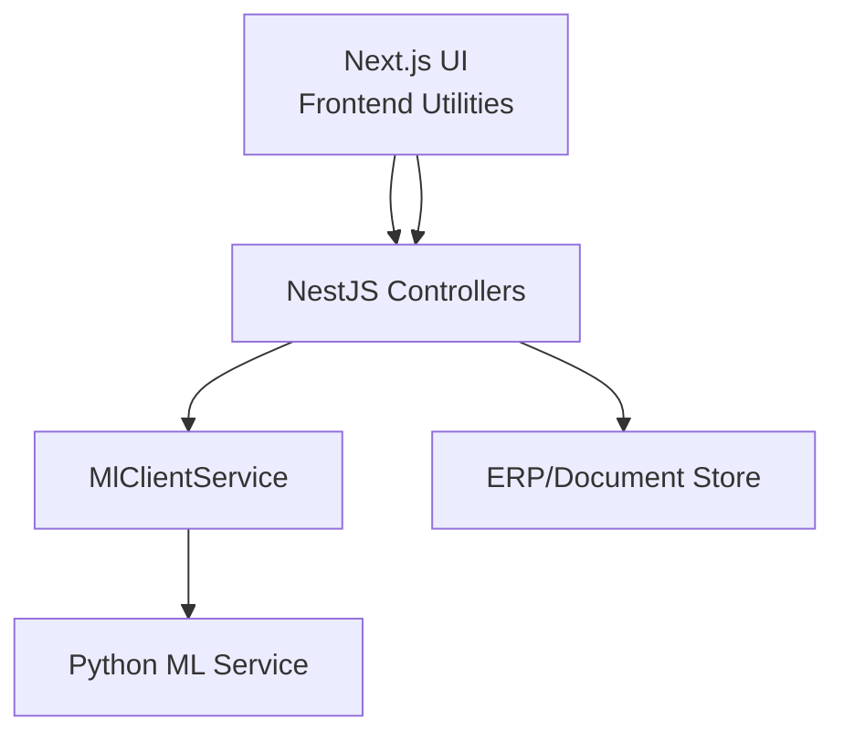
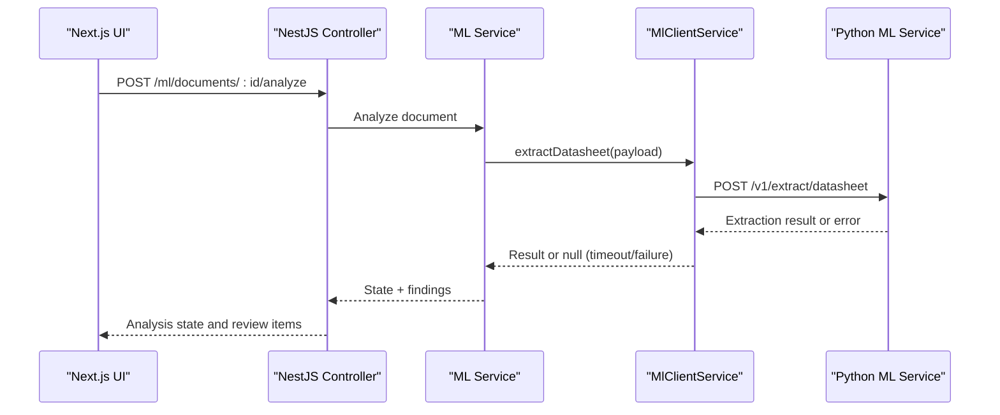
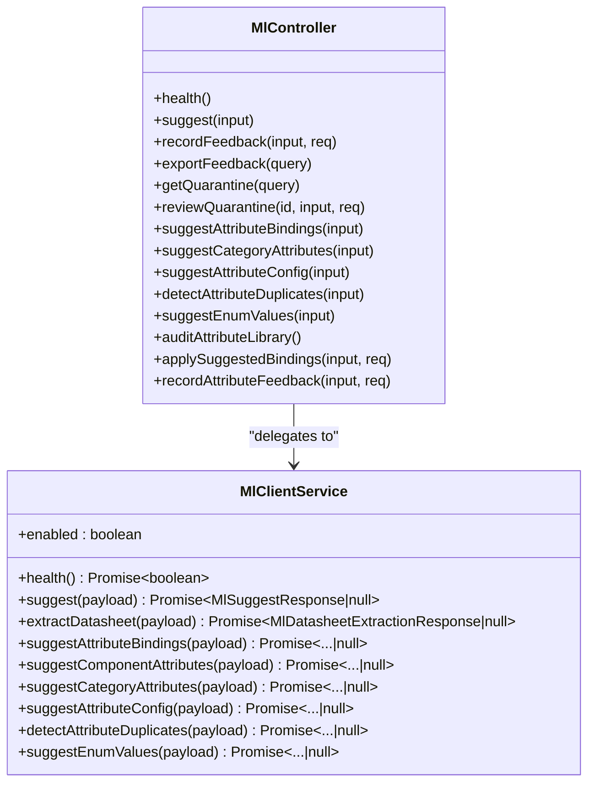
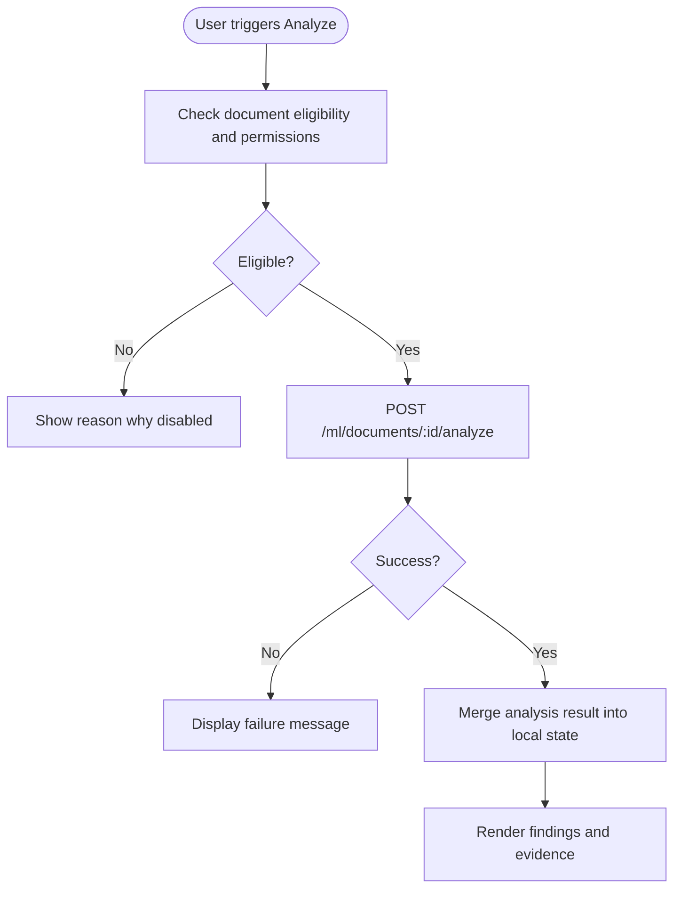
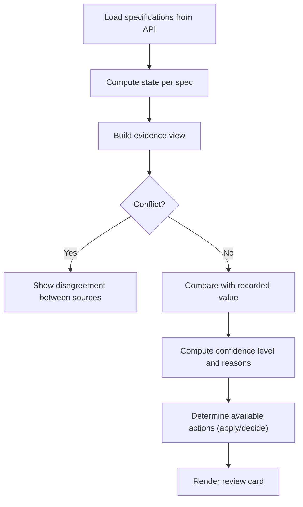
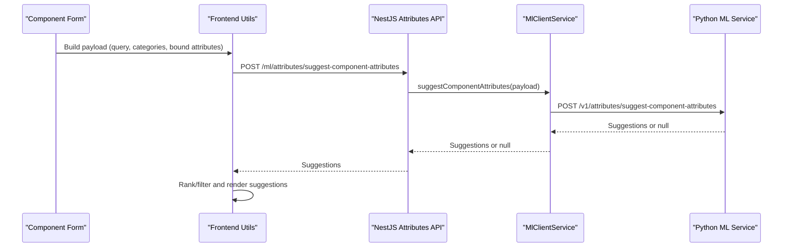
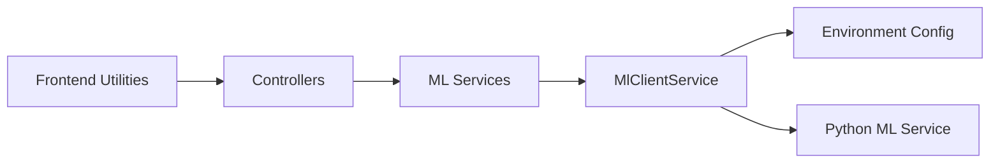

# ML Integration Patterns

<cite>
**Referenced Files in This Document**
- [ml-client.service.ts](file://apps/api/src/ml/ml-client.service.ts)
- [ml.controller.ts](file://apps/api/src/ml/ml.controller.ts)
- [documentation-intelligence.controller.ts](file://apps/api/src/ml/documentation-intelligence.controller.ts)
- [specification-intelligence.ts](file://apps/web/lib/specification-intelligence.ts)
- [document-intelligence.ts](file://apps/web/lib/document-intelligence.ts)
</cite>

## Table of Contents
1. Introduction
2. Project Structure
3. Core Components
4. Architecture Overview
5. Detailed Component Analysis
6. Dependency Analysis
7. Performance Considerations
8. Troubleshooting Guide
9. Conclusion

## Introduction
This document explains how machine learning capabilities are integrated into business workflows across the backend API and Next.js frontend. It covers:
- How NestJS exposes ML endpoints and delegates to MlClientService for outbound calls to the Python ML service
- Request/response transformation patterns used by the API layer
- Frontend integration patterns for component intelligence, attribute suggestions, and document analysis
- The specification intelligence system that combines multiple ML signals to present comprehensive suggestions
- Error handling strategies, timeout management, and fallback mechanisms when ML services are unavailable
- Practical examples and performance optimization guidance for both backend services and frontend components

## Project Structure
The ML integration spans three primary areas:
- Backend API (NestJS): Controllers expose authenticated endpoints; a client service encapsulates HTTP calls to the external ML service with timeouts and graceful failures
- Frontend (Next.js): Pure presentation utilities transform API responses into user-facing states, evidence summaries, and review actions
- Documentation Intelligence: A focused workflow to analyze datasheets and produce reviewable findings via the existing Component Review Queue

**Diagram sources**
- [ml.controller.ts:40-125](file://apps/api/src/ml/ml.controller.ts#L40-L125)
- [ml-client.service.ts:310-400](file://apps/api/src/ml/ml-client.service.ts#L310-L400)
- [documentation-intelligence.controller.ts:30-53](file://apps/api/src/ml/documentation-intelligence.controller.ts#L30-L53)

**Section sources**
- [ml.controller.ts:40-125](file://apps/api/src/ml/ml.controller.ts#L40-L125)
- [ml-client.service.ts:310-400](file://apps/api/src/ml/ml-client.service.ts#L310-L400)
- [documentation-intelligence.controller.ts:30-53](file://apps/api/src/ml/documentation-intelligence.controller.ts#L30-L53)

## Core Components
- MlClientService: Encapsulates all outbound calls to the ML service, including health checks, suggestion extraction, attribute binding, and datasheet extraction. Implements timeouts and returns null on failure so callers can degrade gracefully.
- NestJS ML Controllers: Provide authenticated REST endpoints for legacy and current ML features, including documentation intelligence and attribute intelligence. They enforce permissions and delegate to services.
- Frontend Specification Intelligence: Pure logic modules that render state, confidence, evidence, conflicts, and actionable decisions based on API payloads.
- Frontend Document Intelligence: Presentation utilities for analyzing datasheets, building evidence views, and integrating with the review queue.

Key responsibilities:
- Transform requests to ML-friendly payloads and map responses to domain models
- Apply timeouts and handle network or service errors without crashing the UI
- Present ML outputs as actionable, auditable suggestions with evidence and confidence

**Section sources**
- [ml-client.service.ts:310-800](file://apps/api/src/ml/ml-client.service.ts#L310-L800)
- [ml.controller.ts:40-289](file://apps/api/src/ml/ml.controller.ts#L40-L289)
- [specification-intelligence.ts:21-126](file://apps/web/lib/specification-intelligence.ts#L21-L126)
- [document-intelligence.ts:10-91](file://apps/web/lib/document-intelligence.ts#L10-L91)

## Architecture Overview
The system follows a layered approach:
- Frontend components call NestJS endpoints for ML-driven features
- Controllers validate and authorize requests, then delegate to services
- Services orchestrate data access and call MlClientService for ML inference
- MlClientService performs HTTP calls to the Python ML service with timeouts and error handling
- Results are transformed back into domain models and returned to the frontend

**Diagram sources**
- [documentation-intelligence.controller.ts:30-53](file://apps/api/src/ml/documentation-intelligence.controller.ts#L30-L53)
- [ml-client.service.ts:413-455](file://apps/api/src/ml/ml-client.service.ts#L413-L455)

**Section sources**
- [documentation-intelligence.controller.ts:30-53](file://apps/api/src/ml/documentation-intelligence.controller.ts#L30-L53)
- [ml-client.service.ts:413-455](file://apps/api/src/ml/ml-client.service.ts#L413-L455)

## Detailed Component Analysis

### Backend ML Endpoints and MlClientService
- Health endpoint: Public liveness probe that forwards to the ML service’s health route
- Suggest endpoints: Legacy and attribute-focused endpoints protected by read/write guards
- Documentation Intelligence endpoints: Read and write operations scoped to documents with appropriate guards
- MlClientService methods:
  - suggest: Component-level suggestions with optional PDF/text inputs
  - extractDatasheet: Datasheet extraction returning attributes, evidence, and metadata
  - Attribute suggestion endpoints: Bindings, category attributes, config, duplicates, enum values
  - Timeout and error handling: Uses AbortSignal.timeout and returns null on non-OK responses or exceptions

**Diagram sources**
- [ml.controller.ts:40-289](file://apps/api/src/ml/ml.controller.ts#L40-L289)
- [ml-client.service.ts:310-800](file://apps/api/src/ml/ml-client.service.ts#L310-L800)

**Section sources**
- [ml.controller.ts:40-289](file://apps/api/src/ml/ml.controller.ts#L40-L289)
- [ml-client.service.ts:310-800](file://apps/api/src/ml/ml-client.service.ts#L310-L800)

### Documentation Intelligence Workflow
- GET /ml/documents/:documentId/analysis: Returns current analysis state for a document
- POST /ml/documents/:documentId/analyze: Runs analysis, persists findings, and integrates with the Component Review Queue
- Frontend utilities:
  - deriveAnalyzeAction: Determines if “Analyze” is visible/enabled based on eligibility and permissions
  - buildEvidenceViewModel: Transforms evidence into view-friendly structures
  - mergeAnalysisResult/applyAnalysisResult: Update local state after analysis completes
  - analysisFailureMessage: Provides user-friendly messages on failure

**Diagram sources**
- [documentation-intelligence.controller.ts:30-53](file://apps/api/src/ml/documentation-intelligence.controller.ts#L30-L53)
- [document-intelligence.ts:65-91](file://apps/web/lib/document-intelligence.ts#L65-L91)
- [document-intelligence.ts:390-430](file://apps/web/lib/document-intelligence.ts#L390-L430)
- [document-intelligence.ts:453-461](file://apps/web/lib/document-intelligence.ts#L453-L461)

**Section sources**
- [documentation-intelligence.controller.ts:30-53](file://apps/api/src/ml/documentation-intelligence.controller.ts#L30-L53)
- [document-intelligence.ts:65-91](file://apps/web/lib/document-intelligence.ts#L65-L91)
- [document-intelligence.ts:390-430](file://apps/web/lib/document-intelligence.ts#L390-L430)
- [document-intelligence.ts:453-461](file://apps/web/lib/document-intelligence.ts#L453-L461)

### Specification Intelligence System
- Aggregates multiple ML signals (evidence, conflicts, ERP comparison, confidence reasons) into a unified view
- Presents actionable states: AGREED, CONFLICT, ALREADY_CURRENT, NOT_ACTIONABLE
- Provides reviewer controls: apply, decide, filter by status/confidence
- Evidence descriptions and conflict explanations help reviewers understand discrepancies

**Diagram sources**
- [specification-intelligence.ts:21-126](file://apps/web/lib/specification-intelligence.ts#L21-L126)
- [specification-intelligence.ts:224-265](file://apps/web/lib/specification-intelligence.ts#L224-L265)
- [specification-intelligence.ts:313-358](file://apps/web/lib/specification-intelligence.ts#L313-L358)
- [specification-intelligence.ts:446-561](file://apps/web/lib/specification-intelligence.ts#L446-L561)

**Section sources**
- [specification-intelligence.ts:21-126](file://apps/web/lib/specification-intelligence.ts#L21-L126)
- [specification-intelligence.ts:224-265](file://apps/web/lib/specification-intelligence.ts#L224-L265)
- [specification-intelligence.ts:313-358](file://apps/web/lib/specification-intelligence.ts#L313-L358)
- [specification-intelligence.ts:446-561](file://apps/web/lib/specification-intelligence.ts#L446-L561)

### Frontend Integration Patterns
- Component intelligence: Use attribute suggestion endpoints to propose relevant attributes and values based on query, categories, and existing bindings
- Attribute suggestions: Combine category context, bound attributes, and extracted attributes to rank recommendations
- Document analysis: Trigger analysis per document, merge results into local state, and present evidence and findings
- Caching strategy: Local state maps keyed by document ID; optimistic flags during analysis; merge results to keep UI consistent

**Diagram sources**
- [ml-client.service.ts:514-568](file://apps/api/src/ml/ml-client.service.ts#L514-L568)
- [ml.controller.ts:202-232](file://apps/api/src/ml/ml.controller.ts#L202-L232)

**Section sources**
- [ml-client.service.ts:514-568](file://apps/api/src/ml/ml-client.service.ts#L514-L568)
- [ml.controller.ts:202-232](file://apps/api/src/ml/ml.controller.ts#L202-L232)

## Dependency Analysis
- Controllers depend on services for business logic and on MlClientService for ML calls
- MlClientService depends on environment configuration (base URL, enabled flag) and uses timeouts for resilience
- Frontend utilities depend on API response shapes and provide pure transformations for UI rendering
- Permissions are enforced at controller boundaries using guards

**Diagram sources**
- [ml-client.service.ts:310-326](file://apps/api/src/ml/ml-client.service.ts#L310-L326)
- [ml.controller.ts:40-125](file://apps/api/src/ml/ml.controller.ts#L40-L125)

**Section sources**
- [ml-client.service.ts:310-326](file://apps/api/src/ml/ml-client.service.ts#L310-L326)
- [ml.controller.ts:40-125](file://apps/api/src/ml/ml.controller.ts#L40-L125)

## Performance Considerations
- Timeouts: All ML calls use AbortSignal.timeout to prevent long-running requests from blocking the UI or server threads
- Graceful degradation: MlClientService returns null on failures; callers should treat this as an explicit failure and fall back to manual entry or cached suggestions
- Minimize payload size: Send only necessary fields (e.g., categories, bound attributes) to reduce processing time
- Avoid redundant calls: Cache recent suggestions locally and debounce repeated queries
- Batch operations: When possible, combine related attribute suggestions into single calls
- Evidence trimming: Frontend trims excerpts to reasonable lengths to improve rendering performance

[No sources needed since this section provides general guidance]

## Troubleshooting Guide
Common issues and resolutions:
- ML service unreachable: Health endpoint indicates reachability; check environment variables and network connectivity
- Timeouts: Increase timeout thresholds if ML service is slow; consider background jobs for heavy extractions
- Permission errors: Ensure correct guards are applied; verify user roles for read/write operations
- Empty suggestions: Validate payload completeness (categories, bound attributes); check ML service logs for model readiness
- Failed analysis: Use analysisFailureMessage to display clear feedback; re-run analysis after document updates

**Section sources**
- [ml-client.service.ts:138-163](file://apps/api/src/ml/ml-client.service.ts#L138-L163)
- [ml-client.service.ts:328-338](file://apps/api/src/ml/ml-client.service.ts#L328-L338)
- [document-intelligence.ts:453-461](file://apps/web/lib/document-intelligence.ts#L453-L461)

## Conclusion
This integration pattern ensures robust, user-friendly ML capabilities:
- Backend controllers expose secure, well-scoped endpoints
- MlClientService centralizes ML communication with timeouts and resilient error handling
- Frontend utilities transform ML outputs into actionable, evidence-backed suggestions
- Specification intelligence combines multiple signals to guide reviewers effectively
- Performance and reliability are prioritized through caching, timeouts, and graceful degradation

[No sources needed since this section summarizes without analyzing specific files]