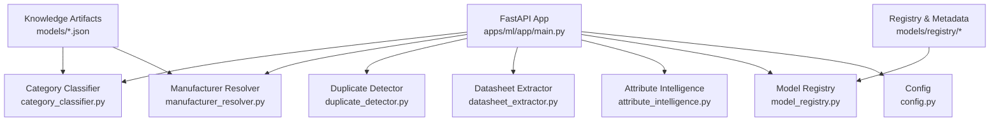
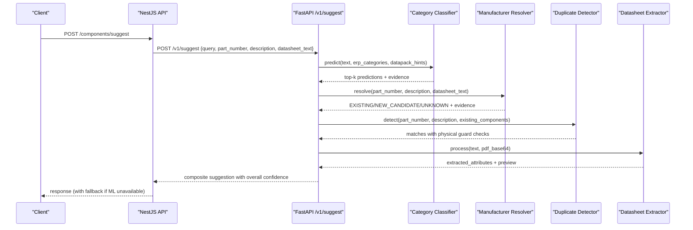
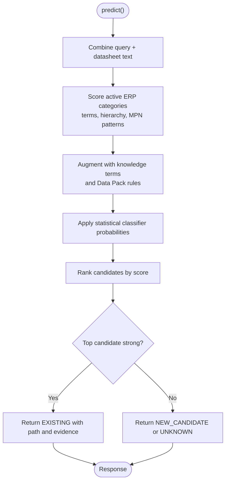
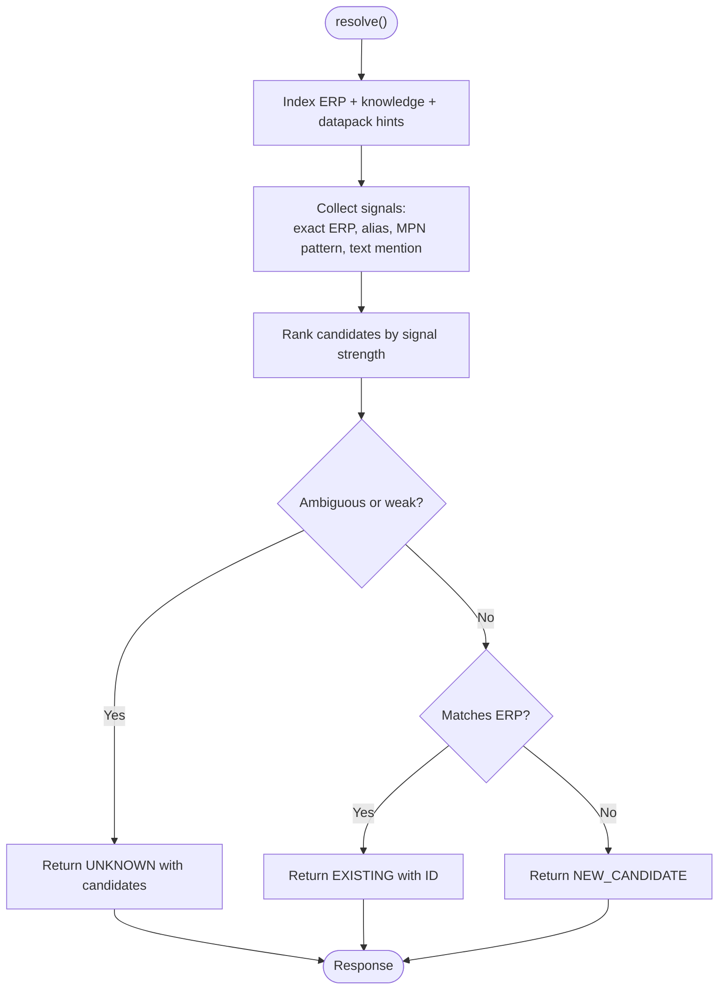
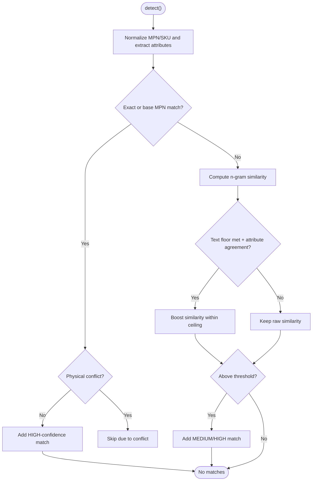
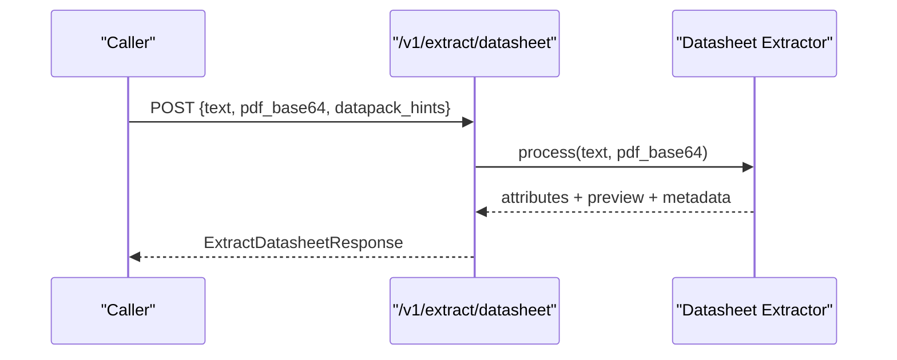
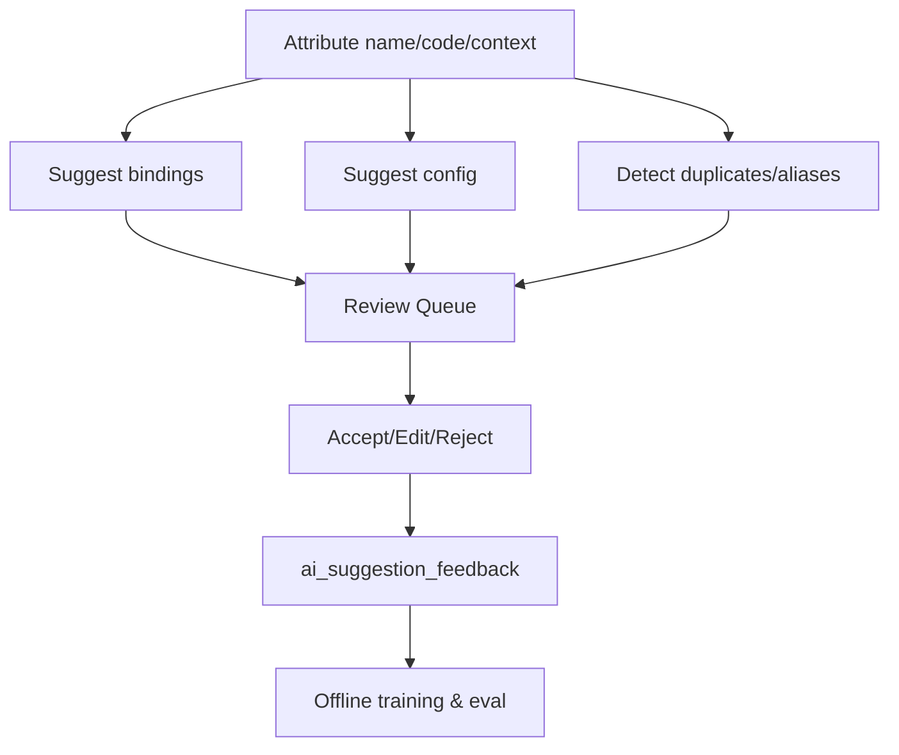
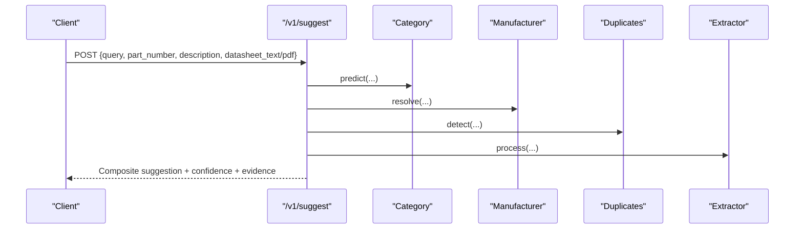
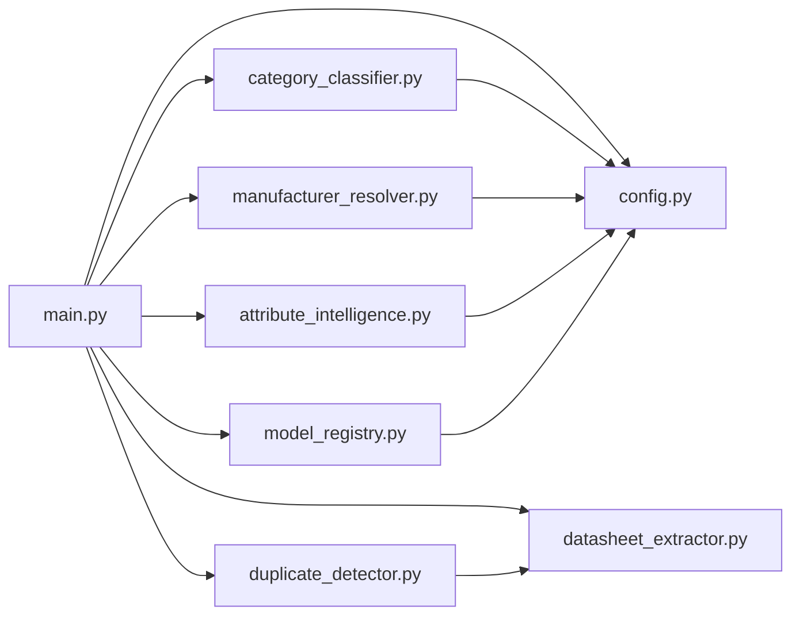

# Machine Learning & Intelligence

<cite>
**Referenced Files in This Document**
- [apps/ml/README.md](file://apps/ml/README.md)
- [apps/ml/app/main.py](file://apps/ml/app/main.py)
- [apps/ml/app/schemas.py](file://apps/ml/app/schemas.py)
- [apps/ml/app/config.py](file://apps/ml/app/config.py)
- [apps/ml/app/services/model_registry.py](file://apps/ml/app/services/model_registry.py)
- [apps/ml/app/services/category_classifier.py](file://apps/ml/app/services/category_classifier.py)
- [apps/ml/app/services/manufacturer_resolver.py](file://apps/ml/app/services/manufacturer_resolver.py)
- [apps/ml/app/services/duplicate_detector.py](file://apps/ml/app/services/duplicate_detector.py)
- [apps/ml/app/services/attribute_intelligence.py](file://apps/ml/app/services/attribute_intelligence.py)
- [docs/rfcs/0056-lightweight-ml-architecture.md](file://docs/rfcs/0056-lightweight-ml-architecture.md)
- [docs/rfcs/0057-component-intelligence-v2.md](file://docs/rfcs/0057-component-intelligence-v2.md)
- [docs/rfcs/0059-attribute-intelligence-v1.md](file://docs/rfcs/0059-attribute-intelligence-v1.md)
- [docs/rfcs/0060-manufacturer-intelligence-v2.md](file://docs/rfcs/0060-manufacturer-intelligence-v2.md)
- [docs/rfcs/0061-category-intelligence-v2.md](file://docs/rfcs/0061-category-intelligence-v2.md)
</cite>

## Table of Contents
1. [Introduction](#introduction)
2. [Project Structure](#project-structure)
3. [Core Components](#core-components)
4. [Architecture Overview](#architecture-overview)
5. [Detailed Component Analysis](#detailed-component-analysis)
6. [Dependency Analysis](#dependency-analysis)
7. [Performance Considerations](#performance-considerations)
8. [Troubleshooting Guide](#troubleshooting-guide)
9. [Conclusion](#conclusion)
10. [Appendices](#appendices)

## Introduction
This document explains Ananya ERP’s machine learning and intelligence capabilities with a focus on component classification, manufacturer resolution, attribute extraction, duplicate detection, and the attribute suggestion system. It covers the FastAPI-based ML microservice architecture, training pipeline, model registry, inference endpoints, review queue integration, performance characteristics, evaluation metrics, troubleshooting, and guidance for extending the system with new intelligence features and custom models.

The service is intentionally lightweight and CPU-first: it uses statistical classifiers, deterministic rules, and strict electrical value guards to deliver sub-20 ms inference latency without GPU dependencies. Human feedback from the UI is captured as labeled telemetry to continuously improve suggestions while keeping authoritative inventory data safe from AI-driven mutations.

**Section sources**
- [apps/ml/README.md:1-232](file://apps/ml/README.md#L1-L232)
- [docs/rfcs/0056-lightweight-ml-architecture.md:1-156](file://docs/rfcs/0056-lightweight-ml-architecture.md#L1-L156)

## Project Structure
At a high level, the ML capability is implemented as a standalone Python/FastAPI microservice under apps/ml, with:
- app/: FastAPI application, request/response schemas, configuration, and services
- models/: Versioned knowledge artifacts (category and manufacturer knowledge), plus model registry metadata
- pipeline/: Offline training orchestration scripts (collect, validate, build dataset, train, evaluate, deploy)
- training/: Collectors, datasets, processors, trainers, evaluation, and TUI tooling
- tests/: Unit and integration tests for services and pipelines
- docs/rfcs/: Design documents defining architecture, intelligence layers, and evaluation criteria

**Diagram sources**
- [apps/ml/app/main.py:60-101](file://apps/ml/app/main.py#L60-L101)
- [apps/ml/app/services/category_classifier.py:44-129](file://apps/ml/app/services/category_classifier.py#L44-L129)
- [apps/ml/app/services/manufacturer_resolver.py:20-33](file://apps/ml/app/services/manufacturer_resolver.py#L20-L33)
- [apps/ml/app/services/duplicate_detector.py:35-46](file://apps/ml/app/services/duplicate_detector.py#L35-L46)
- [apps/ml/app/services/model_registry.py:1-22](file://apps/ml/app/services/model_registry.py#L1-L22)
- [apps/ml/app/config.py:4-19](file://apps/ml/app/config.py#L4-L19)

**Section sources**
- [apps/ml/README.md:19-40](file://apps/ml/README.md#L19-L40)
- [apps/ml/app/main.py:60-101](file://apps/ml/app/main.py#L60-L101)
- [apps/ml/app/config.py:4-19](file://apps/ml/app/config.py#L4-L19)

## Core Components
- Category classifier: Statistical n-gram classifier combined with ERP category context, hierarchy specificity, Data Pack hints, and knowledge terms. Returns top-k candidates with evidence and confidence levels.
- Manufacturer resolver: Deterministic MPN prefix matching, alias recognition, ERP snapshot matching, and knowledge library signals. Returns EXISTING/NEW_CANDIDATE/UNKNOWN with ranked candidates and evidence.
- Duplicate detector: Two-tier deduplication with exact normalized MPN/SKU matching first, then semantic similarity with strict physical parameter guards to prevent false positives across differing electrical ratings.
- Datasheet extractor: Rule-based extraction of electrical parameters and package footprints from text or PDFs; normalizes units and validates against attribute definitions.
- Attribute intelligence: Suggests category bindings, missing attributes per category, config defaults, enum options, duplicates/aliases, and audits the attribute library. All suggestions are non-authoritative until accepted by a human.
- Model registry: Read-only view over versioned artifacts, active deployment, dataset snapshots, quarantine summaries, and validated record distributions.

**Section sources**
- [apps/ml/app/services/category_classifier.py:278-470](file://apps/ml/app/services/category_classifier.py#L278-L470)
- [apps/ml/app/services/manufacturer_resolver.py:73-304](file://apps/ml/app/services/manufacturer_resolver.py#L73-L304)
- [apps/ml/app/services/duplicate_detector.py:35-312](file://apps/ml/app/services/duplicate_detector.py#L35-L312)
- [apps/ml/app/services/attribute_intelligence.py:501-725](file://apps/ml/app/services/attribute_intelligence.py#L501-L725)
- [apps/ml/app/services/model_registry.py:96-145](file://apps/ml/app/services/model_registry.py#L96-L145)

## Architecture Overview
The ML microservice exposes REST endpoints for prediction, resolution, duplication checks, datasheet extraction, and unified suggestions. The NestJS API orchestrates calls with timeouts and falls back to deterministic logic when the service is unavailable.

**Diagram sources**
- [apps/ml/app/main.py:154-256](file://apps/ml/app/main.py#L154-L256)
- [docs/rfcs/0056-lightweight-ml-architecture.md:110-124](file://docs/rfcs/0056-lightweight-ml-architecture.md#L110-L124)

**Section sources**
- [apps/ml/app/main.py:82-101](file://apps/ml/app/main.py#L82-L101)
- [apps/ml/app/main.py:103-152](file://apps/ml/app/main.py#L103-L152)
- [apps/ml/app/main.py:154-256](file://apps/ml/app/main.py#L154-L256)
- [docs/rfcs/0056-lightweight-ml-architecture.md:90-124](file://docs/rfcs/0056-lightweight-ml-architecture.md#L90-L124)

## Detailed Component Analysis

### Category Classification Workflow
- Inputs: query text, optional datasheet text, ERP categories, ERP manufacturers, Data Pack hints.
- Processing:
  - Combines input and datasheet text.
  - Scores active ERP categories using terminology, hierarchy specificity, MPN patterns, descriptions, and manufacturer context.
  - Augments scores with knowledge base terms and Data Pack rules.
  - Applies statistical classifier probabilities where available.
  - Produces EXISTING/NEW_CANDIDATE/UNKNOWN with top-k candidates, category paths, and evidence.
- Outputs: Predictions with confidence levels and evidence items.

**Diagram sources**
- [apps/ml/app/services/category_classifier.py:457-470](file://apps/ml/app/services/category_classifier.py#L457-L470)
- [apps/ml/app/services/category_classifier.py:278-455](file://apps/ml/app/services/category_classifier.py#L278-L455)

**Section sources**
- [apps/ml/app/services/category_classifier.py:44-129](file://apps/ml/app/services/category_classifier.py#L44-L129)
- [apps/ml/app/services/category_classifier.py:278-470](file://apps/ml/app/services/category_classifier.py#L278-L470)
- [docs/rfcs/0061-category-intelligence-v2.md:1-40](file://docs/rfcs/0061-category-intelligence-v2.md#L1-L40)

### Manufacturer Resolution
- Inputs: part number, description, datasheet text, ERP manufacturers, Data Pack hints.
- Processing:
  - Builds searchable index of ERP manufacturers and knowledge aliases.
  - Matches exact ERP names/codes/aliases, known aliases, MPN prefix patterns, and textual mentions.
  - Ranks candidates and resolves to EXISTING/NEW_CANDIDATE/UNKNOWN with match type and evidence.
- Outputs: Resolution state, top candidate(s), confidence level, and evidence.

**Diagram sources**
- [apps/ml/app/services/manufacturer_resolver.py:73-304](file://apps/ml/app/services/manufacturer_resolver.py#L73-L304)

**Section sources**
- [apps/ml/app/services/manufacturer_resolver.py:20-33](file://apps/ml/app/services/manufacturer_resolver.py#L20-L33)
- [apps/ml/app/services/manufacturer_resolver.py:73-304](file://apps/ml/app/services/manufacturer_resolver.py#L73-L304)
- [docs/rfcs/0060-manufacturer-intelligence-v2.md:1-46](file://docs/rfcs/0060-manufacturer-intelligence-v2.md#L1-L46)

### Duplicate Detection with Value Guards
- Inputs: part number, description, existing components, similarity threshold, Data Pack hints.
- Processing:
  - Tier 1: Exact normalized MPN/SKU/vendor part match; packaging suffix normalization; substring overlap for substantial identifiers.
  - Physical guard: Extracts key attributes (resistance, capacitance, voltage, package, tolerance, dielectric, power, current) and rejects matches with conflicts.
  - Tier 2: Advisory semantic similarity using character n-grams with corroborative boosts only when text similarity already meets a floor.
- Outputs: Boolean duplicate flag and ranked matches with reasons and evidence.

**Diagram sources**
- [apps/ml/app/services/duplicate_detector.py:35-312](file://apps/ml/app/services/duplicate_detector.py#L35-L312)

**Section sources**
- [apps/ml/app/services/duplicate_detector.py:35-312](file://apps/ml/app/services/duplicate_detector.py#L35-L312)

### Attribute Extraction from Datasheets
- Inputs: plaintext or base64-encoded PDF, Data Pack hints.
- Processing:
  - Reads bounded pages and characters from PDFs.
  - Applies rule-based regex patterns to extract electrical parameters and package footprints.
  - Normalizes units and maps values to canonical forms.
  - Attaches evidence including page numbers and sections when possible.
- Outputs: Structured attributes with values, units, formatted strings, confidence, and evidence.

**Diagram sources**
- [apps/ml/app/main.py:146-152](file://apps/ml/app/main.py#L146-L152)
- [apps/ml/app/schemas.py:181-196](file://apps/ml/app/schemas.py#L181-L196)

**Section sources**
- [apps/ml/app/main.py:146-152](file://apps/ml/app/main.py#L146-L152)
- [apps/ml/app/schemas.py:181-196](file://apps/ml/app/schemas.py#L181-L196)

### Attribute Intelligence and Review Queue
- Capabilities:
  - Suggest category bindings for attributes based on Data Packs, taxonomy, and inventory telemetry.
  - Suggest missing attributes per category using expected attributes and domain knowledge.
  - Suggest attribute configuration (data type, unit, validation rules, groups).
  - Detect duplicates/aliases among attribute definitions.
  - Suggest enum values grounded in observed options.
  - Audit the attribute library for duplicates, suspicious bindings, missing expected attributes, unused attributes, and inconsistent units.
- Review Queue Integration:
  - Suggestions are non-authoritative and recorded in ai_suggestion_feedback with provenance.
  - Users can accept, edit, or reject suggestions; actions feed retraining.
  - The web UI provides inline assistance and an “Why?” evidence explorer.

**Diagram sources**
- [apps/ml/app/services/attribute_intelligence.py:501-725](file://apps/ml/app/services/attribute_intelligence.py#L501-L725)
- [docs/rfcs/0059-attribute-intelligence-v1.md:86-101](file://docs/rfcs/0059-attribute-intelligence-v1.md#L86-L101)

**Section sources**
- [apps/ml/app/services/attribute_intelligence.py:501-725](file://apps/ml/app/services/attribute_intelligence.py#L501-L725)
- [docs/rfcs/0059-attribute-intelligence-v1.md:100-155](file://docs/rfcs/0059-attribute-intelligence-v1.md#L100-L155)

### Unified Suggestion Endpoint
- Purpose: Execute categorization, manufacturer resolution, duplicate detection, and attribute extraction in one request.
- Behavior:
  - Parses datasheet text or PDF into bounded content.
  - Runs all four intelligence steps concurrently in sequence.
  - Aggregates evidence and computes overall confidence level (HIGH/MEDIUM/LOW).
  - Returns composite response with execution time.

**Diagram sources**
- [apps/ml/app/main.py:154-256](file://apps/ml/app/main.py#L154-L256)

**Section sources**
- [apps/ml/app/main.py:154-256](file://apps/ml/app/main.py#L154-L256)

## Dependency Analysis
- FastAPI routes depend on services for each intelligence area.
- Services depend on configuration for artifact paths and feature flags.
- Model registry reads versioned artifacts and dataset metadata without writing.
- Category classifier and manufacturer resolver load knowledge artifacts at startup or on first use.
- Duplicate detector relies on datasheet extractor to parse attributes for guard checks.

**Diagram sources**
- [apps/ml/app/main.py:60-101](file://apps/ml/app/main.py#L60-L101)
- [apps/ml/app/config.py:4-19](file://apps/ml/app/config.py#L4-L19)

**Section sources**
- [apps/ml/app/main.py:60-101](file://apps/ml/app/main.py#L60-L101)
- [apps/ml/app/config.py:4-19](file://apps/ml/app/config.py#L4-L19)

## Performance Considerations
- Inference latency targets:
  - Sub-20 ms per component for typical requests.
  - Cold start under 500 ms.
- Resource footprint:
  - Operates comfortably on <0.5 CPU cores and <256 MB RAM.
  - No GPU required; ONNX embeddings optional and quantized.
- Request size limits:
  - Max request size configured to 10 MB to protect against large uploads.
- Throughput:
  - Stateless service design enables horizontal scaling behind the API gateway.
- Evaluation metrics:
  - Top-1 and top-k accuracy for category classification.
  - Manufacturer resolution accuracy on corpus.
  - Duplicate precision/recall with physical guard effectiveness.
  - Latency and memory usage measured during training evaluation.

[No sources needed since this section provides general guidance]

## Troubleshooting Guide
Common issues and resolutions:
- Service not ready:
  - Check /health and /ready endpoints to verify model loading status.
  - Ensure MODEL_DIR and artifact paths are correct via environment variables.
- Missing model artifact:
  - Verify category_classifier.pkl exists at configured path.
  - Use /v1/models/reload to refresh the running model without restart.
- Deployment mismatch:
  - Compare deployedVersion vs artifactVersion from /v1/models to detect rollback scenarios.
- Training run conflicts:
  - Only one training run may be active; start a new run after completion or failure.
- Duplicate false positives/negatives:
  - Adjust similarity_threshold and ensure datasheet extraction captures relevant attributes.
  - Review physical guard conflicts that may suppress matches.
- Attribute suggestions not appearing:
  - Confirm Data Pack hints include expectedAttributes and attributeAliases.
  - Validate attribute codes and names align with canonical knowledge.

**Section sources**
- [apps/ml/app/main.py:82-101](file://apps/ml/app/main.py#L82-L101)
- [apps/ml/app/main.py:429-475](file://apps/ml/app/main.py#L429-L475)
- [apps/ml/app/services/model_registry.py:199-229](file://apps/ml/app/services/model_registry.py#L199-L229)
- [apps/ml/app/services/duplicate_detector.py:35-312](file://apps/ml/app/services/duplicate_detector.py#L35-L312)
- [apps/ml/app/services/attribute_intelligence.py:501-725](file://apps/ml/app/services/attribute_intelligence.py#L501-L725)

## Conclusion
Ananya’s ML microservice delivers fast, deterministic, and explainable intelligence for component management. It combines statistical classification, deterministic rules, and strict electrical value guards to provide reliable suggestions while preserving human authority over authoritative data. The training pipeline and model registry enable continuous improvement with versioned artifacts and quality gates. Integration points with the NestJS API and web UI ensure seamless workflows, review queues, and feedback loops for ongoing enhancement.

[No sources needed since this section summarizes without analyzing specific files]

## Appendices

### API Reference Summary
- Health and readiness:
  - GET /health
  - GET /ready
- Prediction and resolution:
  - POST /v1/predict/category
  - POST /v1/predict/category/batch
  - POST /v1/resolve/manufacturer
- Deduplication and extraction:
  - POST /v1/detect/duplicates
  - POST /v1/extract/datasheet
- Unified suggestion:
  - POST /v1/suggest
- Attribute intelligence:
  - POST /v1/attributes/suggest-bindings
  - POST /v1/attributes/suggest-category-attributes
  - POST /v1/attributes/suggest-component-attributes
  - POST /v1/attributes/suggest-config
  - POST /v1/attributes/detect-duplicates
  - POST /v1/attributes/suggest-enum-values
  - POST /v1/attributes/audit
- ML operations:
  - POST /v1/training/runs
  - GET /v1/training/runs/active
  - GET /v1/training/runs
  - GET /v1/training/runs/{run_id}
  - GET /v1/models
  - GET /v1/models/active
  - POST /v1/models/deploy
  - POST /v1/models/rollback
  - POST /v1/models/reload
  - GET /v1/datasets/current

**Section sources**
- [apps/ml/app/main.py:82-101](file://apps/ml/app/main.py#L82-L101)
- [apps/ml/app/main.py:103-152](file://apps/ml/app/main.py#L103-L152)
- [apps/ml/app/main.py:154-256](file://apps/ml/app/main.py#L154-L256)
- [apps/ml/app/main.py:262-361](file://apps/ml/app/main.py#L262-L361)
- [apps/ml/app/main.py:383-486](file://apps/ml/app/main.py#L383-L486)

### Configuration Options
- PORT: HTTP listening port
- MODEL_DIR: Path containing serialized models and catalogs
- CATEGORY_MODEL_PATH: Path to scikit-learn classification artifact
- CATEGORY_KNOWLEDGE_PATH: Versioned category terminology and MPN knowledge
- MANUFACTURER_KNOWLEDGE_PATH: Versioned manufacturer knowledge
- ENABLE_ONNX_EMBEDDINGS: Optional quantized ONNX embedding model
- ONNX_MODEL_PATH / ONNX_TOKENIZER_PATH: Paths for ONNX assets

**Section sources**
- [apps/ml/README.md:219-232](file://apps/ml/README.md#L219-L232)
- [apps/ml/app/config.py:4-19](file://apps/ml/app/config.py#L4-L19)

### Training Pipeline Overview
- Stages: collect, validate, build dataset, train, evaluate, deploy
- CLI entry point: python -m apps.ml.pipeline.run_training
- Feedback export: GET /ml/feedback/export or pipeline export script
- Artifact output: models/registry/v{version}/ with evaluation reports and metadata

**Section sources**
- [apps/ml/README.md:92-188](file://apps/ml/README.md#L92-L188)
- [apps/ml/app/services/model_registry.py:96-145](file://apps/ml/app/services/model_registry.py#L96-L145)

### Extending the ML System
- Add new intelligence features:
  - Implement a new service under apps/ml/app/services/ with clear inputs/outputs and evidence tracking.
  - Expose endpoints in main.py with Pydantic schemas in schemas.py.
  - Integrate with Data Pack hints for runtime customization without retraining.
- Custom models:
  - Train and register artifacts under models/registry/v{version}/.
  - Use model registry to list versions and deploy candidates after passing quality gates.
  - Reload running model via /v1/models/reload to avoid container restarts.
- Evaluation and monitoring:
  - Measure top-k accuracy, precision/recall, latency, and memory usage.
  - Track feedback in ai_suggestion_feedback and export for retraining.
  - Monitor /ready and /models endpoints for operational health.

**Section sources**
- [apps/ml/app/services/model_registry.py:248-274](file://apps/ml/app/services/model_registry.py#L248-L274)
- [apps/ml/app/main.py:429-475](file://apps/ml/app/main.py#L429-L475)
- [docs/rfcs/0057-component-intelligence-v2.md:86-101](file://docs/rfcs/0057-component-intelligence-v2.md#L86-L101)