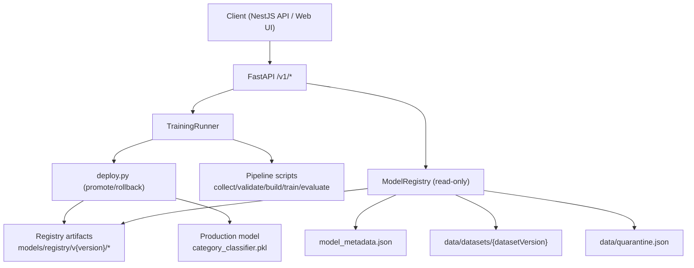
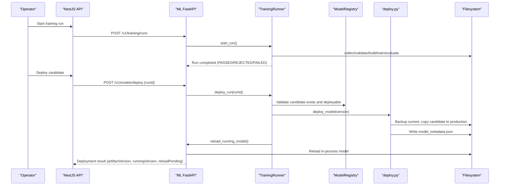
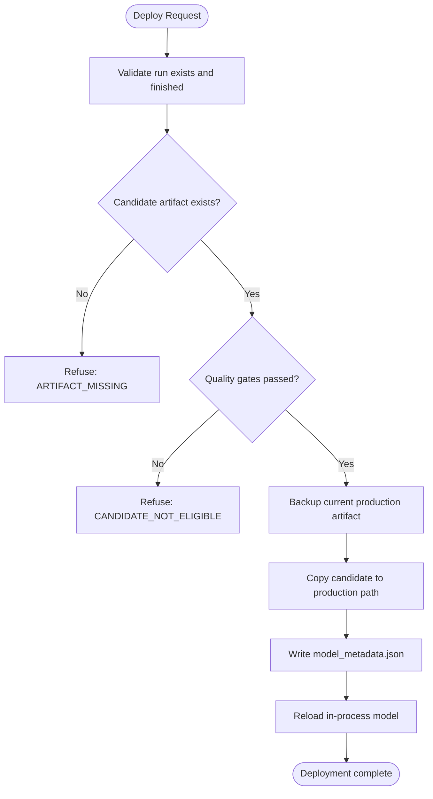
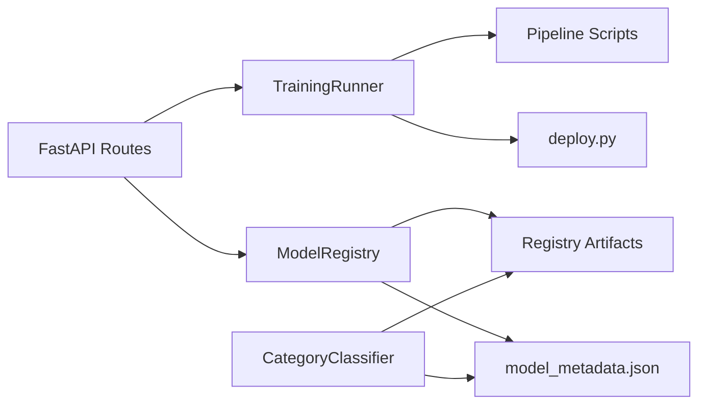

# Model Management

<cite>
**Referenced Files in This Document**
- [main.py](file://apps/ml/app/main.py)
- [model_registry.py](file://apps/ml/app/services/model_registry.py)
- [training_runner.py](file://apps/ml/app/services/training_runner.py)
- [deploy.py](file://apps/ml/pipeline/deploy.py)
- [category_classifier.py](file://apps/ml/app/services/category_classifier.py)
- [schemas.py](file://apps/ml/app/schemas.py)
- [ml-client.service.ts](file://apps/api/src/ml/ml-client.service.ts)
- [ml-ops.controller.ts](file://apps/api/src/ml/ops/ml-ops.controller.ts)
- [ml-ops-api.ts](file://apps/web/lib/api/ml-ops-api.ts)
- [test_training_runner.py](file://apps/ml/tests/test_training_runner.py)
- [model_metadata.json](file://apps/ml/models/model_metadata.json)
</cite>

## Table of Contents
1. Introduction
2. Project Structure
3. Core Components
4. Architecture Overview
5. Detailed Component Analysis
6. Dependency Analysis
7. Performance Considerations
8. Troubleshooting Guide
9. Conclusion
10. Appendices

## Introduction
This document explains the model registry and deployment management system for Ananya’s ML service. It covers version control, active model switching, rollback capabilities, and the operational endpoints used to deploy, reload, and roll back models. It also documents the model versioning scheme, artifact storage, metadata management, dataset snapshots, quarantine procedures, validation record distribution tracking, and guidance for performance monitoring and A/B testing strategies.

## Project Structure
The ML service exposes a FastAPI application that provides:
- Inference endpoints for category classification, manufacturer resolution, duplicate detection, datasheet extraction, and attribute intelligence.
- Internal ML operations endpoints for training runs, model registry queries, deployment, rollback, and reload.
- A read-only model registry reader that reports candidates, active deployments, dataset snapshots, quarantine summaries, and validated record distributions without writing anything.
- A training runner that orchestrates the existing pipeline to produce candidates and gate them before promotion.
- A deployment tool that promotes candidates to production with backup and rollback support.

**Diagram sources**
- [main.py:414-486](file://apps/ml/app/main.py#L414-L486)
- [training_runner.py:154-365](file://apps/ml/app/services/training_runner.py#L154-L365)
- [deploy.py:16-116](file://apps/ml/pipeline/deploy.py#L16-L116)
- [model_registry.py:96-449](file://apps/ml/app/services/model_registry.py#L96-L449)

**Section sources**
- [main.py:60-101](file://apps/ml/app/main.py#L60-L101)
- [main.py:383-486](file://apps/ml/app/main.py#L383-L486)
- [model_registry.py:1-49](file://apps/ml/app/services/model_registry.py#L1-L49)

## Core Components
- FastAPI endpoints: Provide health/readiness, inference APIs, and ML operations for training runs, model registry, deploy, rollback, reload, and dataset overview.
- Training runner: Manages one concurrent training run, executes the pipeline phases, records status/logs, and gates promotion eligibility.
- Model registry reader: Read-only view over registry versions, active deployment, dataset snapshots, quarantine summary, and validated record distribution.
- Deployment tool: Promotes a candidate to production, creates backups, writes deployment metadata, and supports rollback.
- Category classifier loader: Loads the production model into memory and supports reload; resolves running artifact identity by checksum.

Key responsibilities and boundaries are enforced at each layer to ensure safety and auditability.

**Section sources**
- [main.py:383-486](file://apps/ml/app/main.py#L383-L486)
- [training_runner.py:116-365](file://apps/ml/app/services/training_runner.py#L116-L365)
- [model_registry.py:96-449](file://apps/ml/app/services/model_registry.py#L96-L449)
- [deploy.py:16-116](file://apps/ml/pipeline/deploy.py#L16-L116)
- [category_classifier.py:53-112](file://apps/ml/app/services/category_classifier.py#L53-L112)

## Architecture Overview
The ML operations flow is operator-driven via the NestJS API, which calls the ML service’s internal endpoints. The ML service enforces safety rules and delegates execution to the pipeline and deployment tool.

**Diagram sources**
- [main.py:383-458](file://apps/ml/app/main.py#L383-L458)
- [training_runner.py:392-480](file://apps/ml/app/services/training_runner.py#L392-L480)
- [deploy.py:16-116](file://apps/ml/pipeline/deploy.py#L16-L116)

## Detailed Component Analysis

### Model Registry Endpoints and Workflows
- GET /v1/models: Returns active deployment, currently running model identity, and all registry versions with deployability flags.
- POST /v1/models/deploy: Deploys a candidate from a finished training run after validation checks.
- POST /v1/models/rollback: Restores previous production artifact if available.
- POST /v1/models/reload: Re-reads the production artifact into the running process without changing disk state.
- GET /v1/models/active: Alias identical to /v1/models for dashboard polling.
- GET /v1/datasets/current: Provides current dataset snapshot, snapshots list, quarantine summary, and validated record distribution.

These endpoints delegate to the training runner and model registry reader. They do not write data directly except through the deployment tool when promoting or rolling back.

**Section sources**
- [main.py:414-486](file://apps/ml/app/main.py#L414-L486)
- [training_runner.py:392-534](file://apps/ml/app/services/training_runner.py#L392-L534)
- [model_registry.py:96-449](file://apps/ml/app/services/model_registry.py#L96-L449)

### Version Control and Artifact Storage
- Versions follow semantic versioning under apps/ml/models/registry/v{major.minor.patch}.
- Each version directory contains:
  - category_classifier.pkl (artifact)
  - metadata.json (training metadata)
  - evaluation_report.json (quality gates and metrics)
  - pipeline_summary.json (optional summary)
- Active deployment metadata is stored in:
  - apps/ml/models/model_metadata.json (sidecar with activeVersion, timestamps, metrics, checksums)
  - apps/ml/models/registry/active_deployment.json (deployment log)
- Production model path: apps/ml/models/category_classifier.pkl
- Backup path: apps/ml/models/category_classifier.pkl.backup

The registry reader computes artifact checksums and maps them to versions, ensuring the “running” model identity is derived from actual bytes rather than trusting sidecars alone.

**Section sources**
- [model_registry.py:33-48](file://apps/ml/app/services/model_registry.py#L33-L48)
- [model_registry.py:96-145](file://apps/ml/app/services/model_registry.py#L96-L145)
- [model_registry.py:199-245](file://apps/ml/app/services/model_registry.py#L199-L245)
- [deploy.py:16-116](file://apps/ml/pipeline/deploy.py#L16-L116)
- [model_metadata.json:1-155](file://apps/ml/models/model_metadata.json#L1-L155)

### Active Model Switching and Rollback
- Promotion copies the candidate artifact to the production path and writes deployment metadata.
- Before promotion, the current production artifact is backed up.
- Rollback restores the backup artifact over the production file.
- After promotion or rollback, the running process can be reloaded to serve the new artifact immediately.

Safety checks include:
- Candidate must exist and be deployable (evaluation report indicates promotion eligibility).
- Rollback requires an available backup artifact.
- Running model identity is resolved by checksum to avoid stale metadata claims.

**Diagram sources**
- [training_runner.py:392-480](file://apps/ml/app/services/training_runner.py#L392-L480)
- [deploy.py:16-116](file://apps/ml/pipeline/deploy.py#L16-L116)

**Section sources**
- [training_runner.py:392-534](file://apps/ml/app/services/training_runner.py#L392-L534)
- [deploy.py:16-116](file://apps/ml/pipeline/deploy.py#L16-L116)
- [model_registry.py:199-245](file://apps/ml/app/services/model_registry.py#L199-L245)

### Dataset Snapshots and Validation Record Distribution
- Dataset snapshots live under apps/ml/data/datasets/{datasetVersion}/ and include metadata, train, and val files.
- Snapshot metadata includes counts, categories, and fingerprint computed over key files for content identity.
- Validated record distribution is computed from apps/ml/data/validated_records.json, reporting top categories and manufacturers with truncation indicators.

These provide traceability between datasets and models and help assess data coverage and leakage risks.

**Section sources**
- [model_registry.py:276-345](file://apps/ml/app/services/model_registry.py#L276-L345)
- [model_registry.py:401-449](file://apps/ml/app/services/model_registry.py#L401-L449)

### Model Quarantine Procedures
- Quarantine file: apps/ml/data/quarantine.json
- The registry reader summarizes quarantine records by status and rejection reasons, bounded to a maximum scanned count.
- Only counts and reason codes are returned; payloads are never exposed.

This enables operators to monitor data quality issues without leaking sensitive records.

**Section sources**
- [model_registry.py:348-399](file://apps/ml/app/services/model_registry.py#L348-L399)

### Monitoring and Safety Checks
- Quality gates include accuracy thresholds, duplicate precision/recall, latency, memory, and provenance checks.
- Evaluation reports and gate summaries are recorded per candidate.
- The runner logs phase transitions and bounded logs per run.
- Health and readiness endpoints expose loaded models and running artifact identity.

**Section sources**
- [training_runner.py:560-588](file://apps/ml/app/services/training_runner.py#L560-L588)
- [main.py:82-101](file://apps/ml/app/main.py#L82-L101)

### Integration Points and Security
- The ML service endpoints are internal and called only by the authenticated NestJS API.
- The API enforces authorization and audit trails; the ML service focuses on execution safety and reporting.
- The web UI interacts with the API via typed client methods for training runs, deployment, rollback, and reload.

**Section sources**
- [main.py:363-380](file://apps/ml/app/main.py#L363-L380)
- [ml-client.service.ts:1018-1035](file://apps/api/src/ml/ml-client.service.ts#L1018-L1035)
- [ml-ops.controller.ts:164-188](file://apps/api/src/ml/ops/ml-ops.controller.ts#L164-L188)
- [ml-ops-api.ts:333-365](file://apps/web/lib/api/ml-ops-api.ts#L333-L365)

## Dependency Analysis
- FastAPI routes depend on TrainingRunner and ModelRegistry for ML operations.
- TrainingRunner depends on pipeline modules (collect, validate, build_dataset, train, evaluate) and the deployment tool.
- ModelRegistry reads filesystem artifacts and metadata without writing.
- CategoryClassifier loads and reloads the production model and resolves its identity by checksum.

**Diagram sources**
- [main.py:414-486](file://apps/ml/app/main.py#L414-L486)
- [training_runner.py:253-365](file://apps/ml/app/services/training_runner.py#L253-L365)
- [model_registry.py:96-449](file://apps/ml/app/services/model_registry.py#L96-L449)
- [category_classifier.py:53-112](file://apps/ml/app/services/category_classifier.py#L53-L112)

**Section sources**
- [main.py:414-486](file://apps/ml/app/main.py#L414-L486)
- [training_runner.py:253-365](file://apps/ml/app/services/training_runner.py#L253-L365)
- [model_registry.py:96-449](file://apps/ml/app/services/model_registry.py#L96-L449)
- [category_classifier.py:53-112](file://apps/ml/app/services/category_classifier.py#L53-L112)

## Performance Considerations
- Latency and memory gates are enforced during evaluation to keep production models within acceptable bounds.
- The runner caps log size and retains a bounded number of runs in memory; durable history lives in PostgreSQL via the API.
- Model reload avoids restarting containers; it re-parses the artifact already on disk.
- Dataset scanning and quarantine summarization are bounded to prevent excessive I/O.

[No sources needed since this section provides general guidance]

## Troubleshooting Guide
Common issues and diagnostics:
- Deployment refused due to missing artifact or failed quality gates: check candidate registry entry and evaluation report.
- Rollback refused due to no backup: verify backup artifact exists before attempting rollback.
- Reload pending: after deployment, call reload to update the running model; inspect reloadError if present.
- Unknown training run: if the ML process restarted, the run may be lost; use the API’s job status mapping.

Use these endpoints to diagnose:
- GET /v1/models: Inspect active, running, and versions.
- GET /v1/datasets/current: Review dataset snapshots, quarantine, and distribution.
- GET /ready: Confirm models loaded and running artifact identity.

**Section sources**
- [training_runner.py:392-534](file://apps/ml/app/services/training_runner.py#L392-L534)
- [main.py:82-101](file://apps/ml/app/main.py#L82-L101)
- [main.py:414-486](file://apps/ml/app/main.py#L414-L486)

## Conclusion
The ML service provides a robust, auditable model lifecycle:
- Candidates are produced by the pipeline and gated by quality checks.
- Promotion is explicit and safe, with backups and rollback support.
- Active deployment state is verifiable via checksums and metadata.
- Dataset snapshots, quarantine summaries, and validated record distributions enable transparency and governance.
- Operators can monitor and manage deployments through well-defined endpoints integrated with the NestJS API and web UI.

[No sources needed since this section summarizes without analyzing specific files]

## Appendices

### Practical Examples

- Deploy a new model version:
  - Start a training run via the API and wait for PASSED status.
  - Call POST /v1/models/deploy with the runId.
  - Verify response includes artifactVersion, runningVersion, and reloadPending=false.
  - If reloadPending=true, call POST /v1/models/reload to refresh the running model.

- Monitor deployment status:
  - Use GET /v1/models to see active, running, and versions.
  - Use GET /v1/datasets/current to review dataset snapshots and quarantine.

- Perform a safe rollback:
  - Ensure a backup artifact exists (rollbackAvailable=true).
  - Call POST /v1/models/rollback.
  - Verify artifactVersion reflects the restored model and reloadPending=false.

**Section sources**
- [main.py:383-486](file://apps/ml/app/main.py#L383-L486)
- [training_runner.py:392-534](file://apps/ml/app/services/training_runner.py#L392-L534)
- [model_registry.py:199-245](file://apps/ml/app/services/model_registry.py#L199-L245)

### A/B Testing Strategies
- Canary releases:
  - Deploy a new version alongside the current one using feature flags or routing rules in the API layer.
  - Route a small percentage of traffic to the new model and monitor metrics.
- Shadow mode:
  - Run both models in parallel; compare predictions without affecting user-facing decisions.
- Metrics to track:
  - Accuracy, latency percentiles, error rates, and business KPIs.
  - Compare against baseline using evaluation reports and runtime telemetry.
- Rollback triggers:
  - Define thresholds for degradation; trigger automatic or manual rollback if exceeded.

[No sources needed since this section provides general guidance]