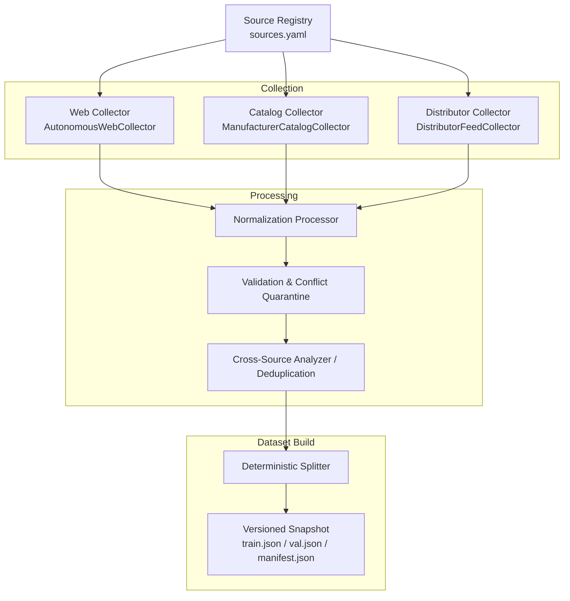
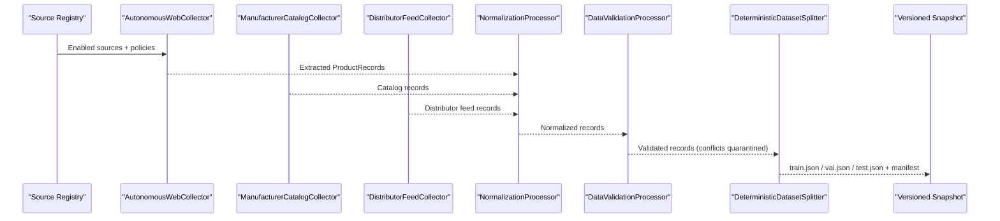
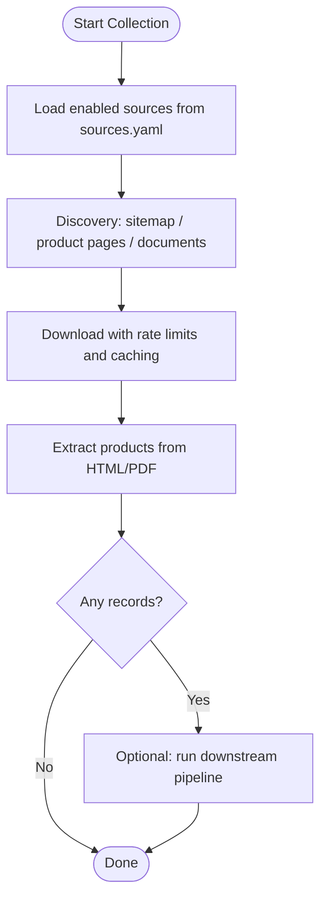
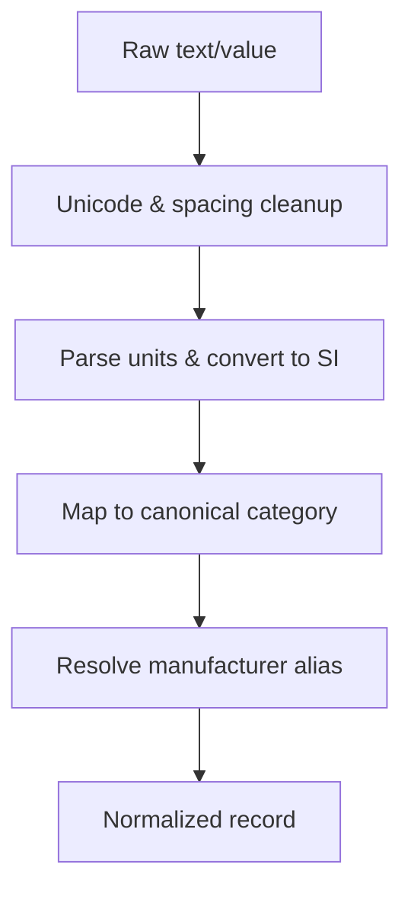
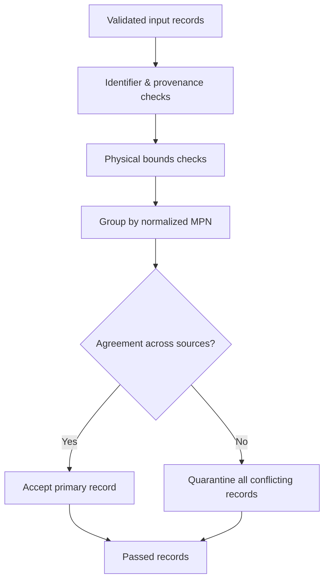
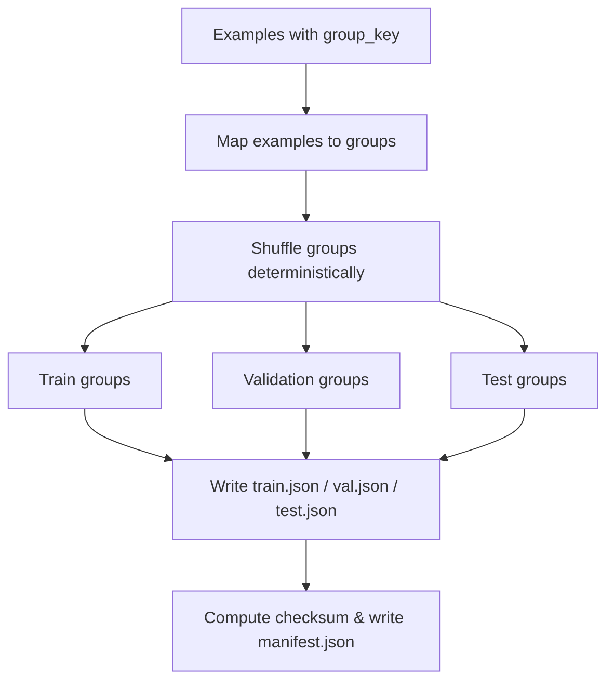
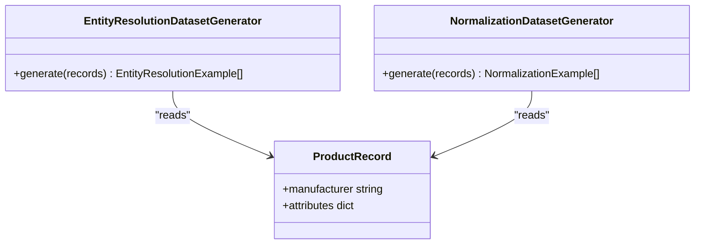
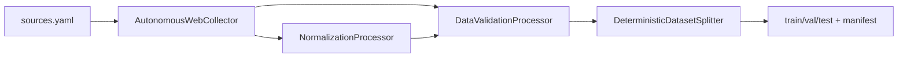

# Dataset Construction

<cite>
**Referenced Files in This Document**
- [build_dataset.py](file://apps/ml/pipeline/build_dataset.py)
- [collect.py](file://apps/ml/pipeline/collect.py)
- [validate.py](file://apps/ml/pipeline/validate.py)
- [splitter.py](file://apps/ml/training/datasets/splitter.py)
- [normalization.py](file://apps/ml/training/processors/normalization.py)
- [validation.py](file://apps/ml/training/processors/validation.py)
- [sources.yaml](file://apps/ml/training/config/sources.yaml)
- [web_collector.py](file://apps/ml/training/collectors/web_collector.py)
- [catalog.py](file://apps/ml/training/collectors/catalog.py)
- [distributor.py](file://apps/ml/training/collectors/distributor.py)
- [entity_resolution.py](file://apps/ml/training/generators/entity_resolution.py)
</cite>

## Table of Contents
1. Introduction
2. Project Structure
3. Core Components
4. Architecture Overview
5. Detailed Component Analysis
6. Dependency Analysis
7. Performance Considerations
8. Troubleshooting Guide
9. Conclusion
10. Appendices

## Introduction
This document explains the dataset construction pipeline that builds training data from raw sources for component intelligence. It covers:
- Data collection from web collectors, catalogs, and distributors
- Normalization and cleaning (text preprocessing, entity resolution, validation rules)
- Dataset splitting with zero data leakage and balanced train/validation splits
- Practical guidance to add new sources, customize normalization, and validate quality
- Provenance tracking, versioning strategies, and handling edge cases

The pipeline is designed to be deterministic, auditable, and safe against data leakage by grouping splits on product families or base MPNs.

## Project Structure
The dataset construction spans several modules:
- Pipeline orchestration scripts under apps/ml/pipeline
- Collectors for web, catalogs, and distributors under apps/ml/training/collectors
- Normalization and validation processors under apps/ml/training/processors
- Deterministic splitter under apps/ml/training/datasets
- Source registry configuration under apps/ml/training/config
- Task generators for entity resolution and normalization examples under apps/ml/training/generators

**Diagram sources**
- [web_collector.py:42-105](file://apps/ml/training/collectors/web_collector.py#L42-L105)
- [catalog.py:25-47](file://apps/ml/training/collectors/catalog.py#L25-L47)
- [distributor.py:24-40](file://apps/ml/training/collectors/distributor.py#L24-L40)
- [normalization.py:487-689](file://apps/ml/training/processors/normalization.py#L487-L689)
- [validation.py:97-190](file://apps/ml/training/processors/validation.py#L97-L190)
- [splitter.py:22-80](file://apps/ml/training/datasets/splitter.py#L22-L80)
- [sources.yaml:26-80](file://apps/ml/training/config/sources.yaml#L26-L80)

**Section sources**
- [web_collector.py:42-105](file://apps/ml/training/collectors/web_collector.py#L42-L105)
- [sources.yaml:26-80](file://apps/ml/training/config/sources.yaml#L26-L80)

## Core Components
- Autonomous Web Collector: Discovers and downloads pages/documents per configured sources, extracts product records, and optionally runs downstream processing.
- Catalog and Distributor Collectors: Ingest structured JSON/CSV feeds into ProductRecord objects with provenance.
- Normalization Processor: Cleans text, normalizes units and physical quantities, maps categories to canonical taxonomy, and resolves manufacturer aliases.
- Validation Processor: Enforces schema completeness, rejects malformed identifiers, checks physical sanity bounds, and quarantines cross-source conflicts.
- Deterministic Splitter: Splits examples into train/val/test by groups to prevent leakage and emits a manifest with checksums.
- Dataset Builder: Builds versioned snapshots with non-semantic variations, duplicate pairs, and metadata.

**Section sources**
- [web_collector.py:86-282](file://apps/ml/training/collectors/web_collector.py#L86-L282)
- [catalog.py:31-117](file://apps/ml/training/collectors/catalog.py#L31-L117)
- [distributor.py:30-90](file://apps/ml/training/collectors/distributor.py#L30-L90)
- [normalization.py:487-689](file://apps/ml/training/processors/normalization.py#L487-L689)
- [validation.py:97-190](file://apps/ml/training/processors/validation.py#L97-L190)
- [splitter.py:22-80](file://apps/ml/training/datasets/splitter.py#L22-L80)
- [build_dataset.py:140-243](file://apps/ml/pipeline/build_dataset.py#L140-L243)

## Architecture Overview
End-to-end flow from sources to versioned datasets:

**Diagram sources**
- [web_collector.py:86-282](file://apps/ml/training/collectors/web_collector.py#L86-L282)
- [catalog.py:31-117](file://apps/ml/training/collectors/catalog.py#L31-L117)
- [distributor.py:30-90](file://apps/ml/training/collectors/distributor.py#L30-L90)
- [normalization.py:487-689](file://apps/ml/training/processors/normalization.py#L487-L689)
- [validation.py:97-190](file://apps/ml/training/processors/validation.py#L97-L190)
- [splitter.py:22-80](file://apps/ml/training/datasets/splitter.py#L22-L80)

## Detailed Component Analysis

### Data Collection
- Web collector orchestrates discovery, download, extraction, and optional downstream processing. It respects rate limits, content types, and can rebuild from local raw files without network calls.
- Catalog collector ingests JSON/CSV manufacturer catalogs into ProductRecord with provenance and domain inference.
- Distributor collector ingests structured distributor feeds into ProductRecord with provenance.

**Diagram sources**
- [sources.yaml:26-80](file://apps/ml/training/config/sources.yaml#L26-L80)
- [web_collector.py:86-282](file://apps/ml/training/collectors/web_collector.py#L86-L282)
- [catalog.py:31-117](file://apps/ml/training/collectors/catalog.py#L31-L117)
- [distributor.py:30-90](file://apps/ml/training/collectors/distributor.py#L30-L90)

**Section sources**
- [web_collector.py:86-282](file://apps/ml/training/collectors/web_collector.py#L86-L282)
- [catalog.py:31-117](file://apps/ml/training/collectors/catalog.py#L31-L117)
- [distributor.py:30-90](file://apps/ml/training/collectors/distributor.py#L30-L90)
- [sources.yaml:26-80](file://apps/ml/training/config/sources.yaml#L26-L80)

### Normalization and Cleaning
- Text normalization: Unicode cleanup, symbol standardization, whitespace collapsing.
- Unit and value normalization: Parses strings like “10k”, “0.1 uF”, “50V” into canonical values and SI-normalized numbers.
- Category mapping: Maps vendor categories/breadcrumbs to canonical Ananya taxonomy; excludes non-product content.
- Manufacturer alias resolution: Resolves aliases to canonical names.

**Diagram sources**
- [normalization.py:487-689](file://apps/ml/training/processors/normalization.py#L487-L689)

**Section sources**
- [normalization.py:487-689](file://apps/ml/training/processors/normalization.py#L487-L689)

### Validation and Conflict Detection
- Schema checks: Ensures identifiers, name, and category presence; rejects placeholder or synthetic MPNs without grounding.
- Physical sanity bounds: Validates normalized SI values against realistic ranges for electrical/mechanical parameters.
- Cross-source conflict detection: Groups by normalized MPN; if multiple sources disagree on category, manufacturer, or key attributes, all are quarantined for human review.

**Diagram sources**
- [validation.py:97-190](file://apps/ml/training/processors/validation.py#L97-L190)
- [validate.py:111-191](file://apps/ml/pipeline/validate.py#L111-L191)

**Section sources**
- [validation.py:97-190](file://apps/ml/training/processors/validation.py#L97-L190)
- [validate.py:111-191](file://apps/ml/pipeline/validate.py#L111-L191)

### Dataset Splitting and Versioning
- Deterministic grouped split: Uses series family or base MPN as group keys to ensure no overlap between train/val/test partitions.
- Manifest generation: Emits train/val/test splits plus a manifest with SHA-256 checksums, counts, and metadata.
- Versioned snapshot: The build script creates immutable snapshots with date-versioned directories, duplicate pairs, and metadata.

**Diagram sources**
- [splitter.py:22-80](file://apps/ml/training/datasets/splitter.py#L22-L80)
- [splitter.py:82-140](file://apps/ml/training/datasets/splitter.py#L82-L140)
- [build_dataset.py:140-243](file://apps/ml/pipeline/build_dataset.py#L140-L243)

**Section sources**
- [splitter.py:22-80](file://apps/ml/training/datasets/splitter.py#L22-L80)
- [splitter.py:82-140](file://apps/ml/training/datasets/splitter.py#L82-L140)
- [build_dataset.py:140-243](file://apps/ml/pipeline/build_dataset.py#L140-L243)

### Entity Resolution and Task Generation
- Entity resolution generator produces training examples to map dirty/aliased manufacturer names to canonical entities using known alias mappings.
- Normalization task generator produces examples for unit/value parsing tasks from validated records.

**Diagram sources**
- [entity_resolution.py:14-55](file://apps/ml/training/generators/entity_resolution.py#L14-L55)
- [normalization.py:499-631](file://apps/ml/training/processors/normalization.py#L499-L631)

**Section sources**
- [entity_resolution.py:14-55](file://apps/ml/training/generators/entity_resolution.py#L14-L55)
- [normalization.py:499-631](file://apps/ml/training/processors/normalization.py#L499-L631)

## Dependency Analysis
Key dependencies and relationships:
- Web collector depends on source registry, policy manager, downloader, acquisition store, discovery engine, and extractor.
- Normalization processor depends on text utilities, taxonomy maps, and breadcrumb cleaning helpers.
- Validation processor depends on schema models and physical bounds definitions.
- Splitter depends on numpy random generator and outputs manifests.

**Diagram sources**
- [sources.yaml:26-80](file://apps/ml/training/config/sources.yaml#L26-L80)
- [web_collector.py:42-105](file://apps/ml/training/collectors/web_collector.py#L42-L105)
- [normalization.py:487-689](file://apps/ml/training/processors/normalization.py#L487-L689)
- [validation.py:97-190](file://apps/ml/training/processors/validation.py#L97-L190)
- [splitter.py:22-80](file://apps/ml/training/datasets/splitter.py#L22-L80)

**Section sources**
- [web_collector.py:42-105](file://apps/ml/training/collectors/web_collector.py#L42-L105)
- [normalization.py:487-689](file://apps/ml/training/processors/normalization.py#L487-L689)
- [validation.py:97-190](file://apps/ml/training/processors/validation.py#L97-L190)
- [splitter.py:22-80](file://apps/ml/training/datasets/splitter.py#L22-L80)

## Performance Considerations
- Concurrency: Document processing uses separate worker pools for downloads and parsing to avoid CPU blocking network I/O.
- Rate limiting: Per-source request rates and delays are enforced via policy manager and downloader.
- Caching: Content hashes, ETags, and last-modified headers reduce redundant downloads; PDF text is cached by hash.
- Determinism: Fixed seeds and group-based splitting ensure reproducible datasets.
- Memory footprint: Processing streams records and writes intermediate artifacts incrementally.

[No sources needed since this section provides general guidance]

## Troubleshooting Guide
Common issues and resolutions:
- Missing identifiers or provenance: Records are rejected or quarantined; ensure MPN/SKU, name, and provenance fields are present and verified.
- Malformed MPNs: Placeholder patterns (e.g., “test”, “unknown”) cause rejection; replace with real part numbers.
- Impossible physical values: Values outside defined SI bounds are quarantined; verify units and conversions.
- Cross-source conflicts: Disagreements on category, manufacturer, or attributes quarantine all involved records; resolve by harmonizing sources.
- Data leakage: If split overlaps occur, verify group_key usage and ensure consistent base_family or MPN grouping.

**Section sources**
- [validation.py:97-190](file://apps/ml/training/processors/validation.py#L97-L190)
- [validate.py:111-191](file://apps/ml/pipeline/validate.py#L111-L191)
- [splitter.py:22-80](file://apps/ml/training/datasets/splitter.py#L22-L80)

## Conclusion
The dataset construction pipeline integrates authoritative and distributed sources through robust collection, normalization, validation, and splitting stages. It enforces strict provenance, prevents data leakage via grouped splits, and produces versioned, auditable datasets suitable for training component intelligence models.

[No sources needed since this section summarizes without analyzing specific files]

## Appendices

### Practical Examples

#### Adding a New Data Source
- Define a new entry in sources.yaml with domains, start URLs, discovery methods, rate limits, and allowed content types.
- Ensure the web collector can discover and extract product pages or documents from the new source.
- Validate output records pass schema and physical bounds checks; adjust normalization or exclusion lists if needed.

**Section sources**
- [sources.yaml:26-80](file://apps/ml/training/config/sources.yaml#L26-L80)
- [web_collector.py:86-282](file://apps/ml/training/collectors/web_collector.py#L86-L282)

#### Customizing Normalization Rules
- Extend category mapping in the normalization processor to include new vendor categories or breadcrumbs.
- Add unit parsing patterns for new measurement systems or symbols.
- Update manufacturer alias mappings to consolidate brand variants.

**Section sources**
- [normalization.py:487-689](file://apps/ml/training/processors/normalization.py#L487-L689)

#### Validating Dataset Quality
- Run validation to check identifier completeness, provenance verification, and physical bounds.
- Review quarantined records for conflicts and fix upstream sources or mappings.
- Inspect split manifest to confirm zero leakage and balanced group distribution.

**Section sources**
- [validation.py:97-190](file://apps/ml/training/processors/validation.py#L97-L190)
- [splitter.py:82-140](file://apps/ml/training/datasets/splitter.py#L82-L140)

### Data Provenance Tracking and Versioning
- Every record carries provenance metadata including source type, identifier, URL, retrieval timestamp, verification status, and method.
- Versioned snapshots are created with date-versioned directories containing train/val/test splits, duplicate pairs, and metadata.
- Manifests include checksums and counts to ensure reproducibility and integrity.

**Section sources**
- [collect.py:21-609](file://apps/ml/pipeline/collect.py#L21-L609)
- [build_dataset.py:140-243](file://apps/ml/pipeline/build_dataset.py#L140-L243)
- [splitter.py:82-140](file://apps/ml/training/datasets/splitter.py#L82-L140)

### Handling Edge Cases
- Non-product content: Excluded categories and non-product category filters prevent noise from entering the dataset.
- Synthetic MPNs: Auto-generated or PDF-derived placeholders without attributes or grounded categories are rejected.
- Conflicting multi-source entries: All conflicting records are quarantined rather than silently merged.

**Section sources**
- [normalization.py:642-689](file://apps/ml/training/processors/normalization.py#L642-L689)
- [validation.py:136-158](file://apps/ml/training/processors/validation.py#L136-L158)
- [validation.py:192-269](file://apps/ml/training/processors/validation.py#L192-L269)