# Evaluation & Metrics

<cite>
**Referenced Files in This Document**
- [metrics.py](file://apps/ml/training/evaluation/metrics.py)
- [evaluator.py](file://apps/ml/training/evaluation/evaluator.py)
- [evaluate.py](file://apps/ml/pipeline/evaluate.py)
- [duplicate_benchmark.py](file://apps/ml/benchmarks/duplicate_benchmark.py)
- [document_acquisition_benchmark.py](file://apps/ml/benchmarks/document_acquisition_benchmark.py)
- [benchmark_results.json](file://apps/ml/benchmarks/benchmark_results.json)
- [test_training_workspace.py](file://apps/ml/tests/test_training_workspace.py)
</cite>

## Table of Contents
1. Introduction
2. Project Structure
3. Core Components
4. Architecture Overview
5. Detailed Component Analysis
6. Dependency Analysis
7. Performance Considerations
8. Troubleshooting Guide
9. Conclusion
10. Appendices

## Introduction
This document explains the model evaluation and performance metrics framework used to assess ML models across classification, duplicate detection, attribute extraction, and system-level benchmarks. It covers accuracy and top-k calculations, precision/recall/F1 computation, confusion matrix usage, quality gates, benchmarking workflows, statistical significance considerations, regression detection, and reporting for stakeholders.

## Project Structure
The evaluation system is implemented primarily under apps/ml with two complementary layers:
- Training-time evaluation and metrics: apps/ml/training/evaluation
- Pipeline orchestration and automated quality gates: apps/ml/pipeline/evaluate.py
- Domain-specific benchmarks: apps/ml/benchmarks

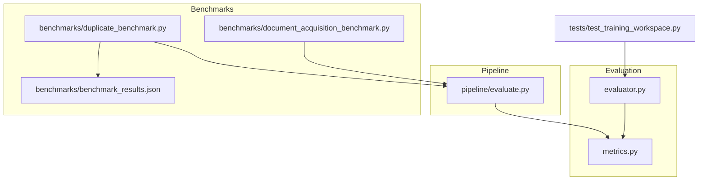

**Diagram sources**
- [metrics.py:1-152](file://apps/ml/training/evaluation/metrics.py#L1-L152)
- [evaluator.py:1-275](file://apps/ml/training/evaluation/evaluator.py#L1-L275)
- [evaluate.py:1-254](file://apps/ml/pipeline/evaluate.py#L1-L254)
- [duplicate_benchmark.py:1-305](file://apps/ml/benchmarks/duplicate_benchmark.py#L1-L305)
- [document_acquisition_benchmark.py:1-497](file://apps/ml/benchmarks/document_acquisition_benchmark.py#L1-L497)
- [benchmark_results.json:1-17](file://apps/ml/benchmarks/benchmark_results.json#L1-L17)
- [test_training_workspace.py:371-520](file://apps/ml/tests/test_training_workspace.py#L371-L520)

**Section sources**
- [metrics.py:1-152](file://apps/ml/training/evaluation/metrics.py#L1-L152)
- [evaluator.py:1-275](file://apps/ml/training/evaluation/evaluator.py#L1-L275)
- [evaluate.py:1-254](file://apps/ml/pipeline/evaluate.py#L1-L254)
- [duplicate_benchmark.py:1-305](file://apps/ml/benchmarks/duplicate_benchmark.py#L1-L305)
- [document_acquisition_benchmark.py:1-497](file://apps/ml/benchmarks/document_acquisition_benchmark.py#L1-L497)
- [benchmark_results.json:1-17](file://apps/ml/benchmarks/benchmark_results.json#L1-L17)
- [test_training_workspace.py:371-520](file://apps/ml/tests/test_training_workspace.py#L371-L520)

## Core Components
- Classification metrics engine: computes Top-1 and Top-k accuracy, weighted precision/recall/F1, per-class reports, and sample counts.
- Duplicate detection metrics: binary precision/recall/F1 with critical false-positive merge counting.
- Attribute relevance metrics: multi-label set precision/recall/F1.
- System benchmarks: latency percentiles (P50/P95/P99) and peak memory usage.
- ModelEvaluator: orchestrates candidate vs active baseline comparison, quality gates, JSON and Markdown report generation, and optional TUI events.
- Pipeline evaluate: end-to-end evaluation script that loads a candidate model, runs validation, compares against active baseline, evaluates manufacturer resolution and duplicates, measures latency/memory, and writes an evaluation report.
- Benchmarks: domain-aware duplicate detection suite and document acquisition profiler.

**Section sources**
- [metrics.py:20-152](file://apps/ml/training/evaluation/metrics.py#L20-L152)
- [evaluator.py:82-275](file://apps/ml/training/evaluation/evaluator.py#L82-L275)
- [evaluate.py:27-254](file://apps/ml/pipeline/evaluate.py#L27-L254)
- [duplicate_benchmark.py:17-305](file://apps/ml/benchmarks/duplicate_benchmark.py#L17-L305)
- [document_acquisition_benchmark.py:283-497](file://apps/ml/benchmarks/document_acquisition_benchmark.py#L283-L497)

## Architecture Overview
The evaluation architecture separates metric computation from orchestration and reporting:
- The metrics module provides pure functions for computing classification, duplicate, attribute relevance, and system metrics.
- The evaluator composes these metrics into a full evaluation run, compares against an active baseline, applies quality gates, and produces both machine-readable JSON and human-readable Markdown.
- The pipeline script integrates with model registry paths, validation datasets, and duplicate benchmark cases to produce versioned evaluation reports.
- Benchmarks provide controlled scenarios for duplicate detection and document acquisition performance profiling.

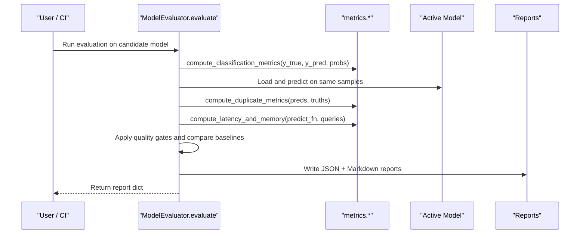

**Diagram sources**
- [evaluator.py:91-223](file://apps/ml/training/evaluation/evaluator.py#L91-L223)
- [metrics.py:20-152](file://apps/ml/training/evaluation/metrics.py#L20-L152)

## Detailed Component Analysis

### Classification Metrics Engine
- Top-1 accuracy: computed via exact match between true labels and predicted classes.
- Top-k accuracy: uses class probabilities to check if the true label appears among the top-k predictions; default k=3.
- Weighted Precision/Recall/F1: computed using sklearn’s precision_recall_fscore_support with average="weighted".
- Per-class report: generated via sklearn’s classification_report(output_dict=True), capturing per-class precision, recall, f1-score, and support.

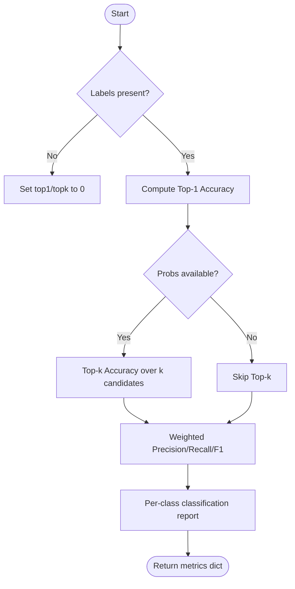

**Diagram sources**
- [metrics.py:20-56](file://apps/ml/training/evaluation/metrics.py#L20-L56)

**Section sources**
- [metrics.py:20-56](file://apps/ml/training/evaluation/metrics.py#L20-L56)

### Duplicate Detection Metrics
- Binary classification metrics: TP/FP/TN/FN derived from prediction and ground truth lists.
- Critical false positives: optional flag list increments a counter when a false positive corresponds to a critical mismatch.
- F1 calculation: harmonic mean of precision and recall with safe division handling.

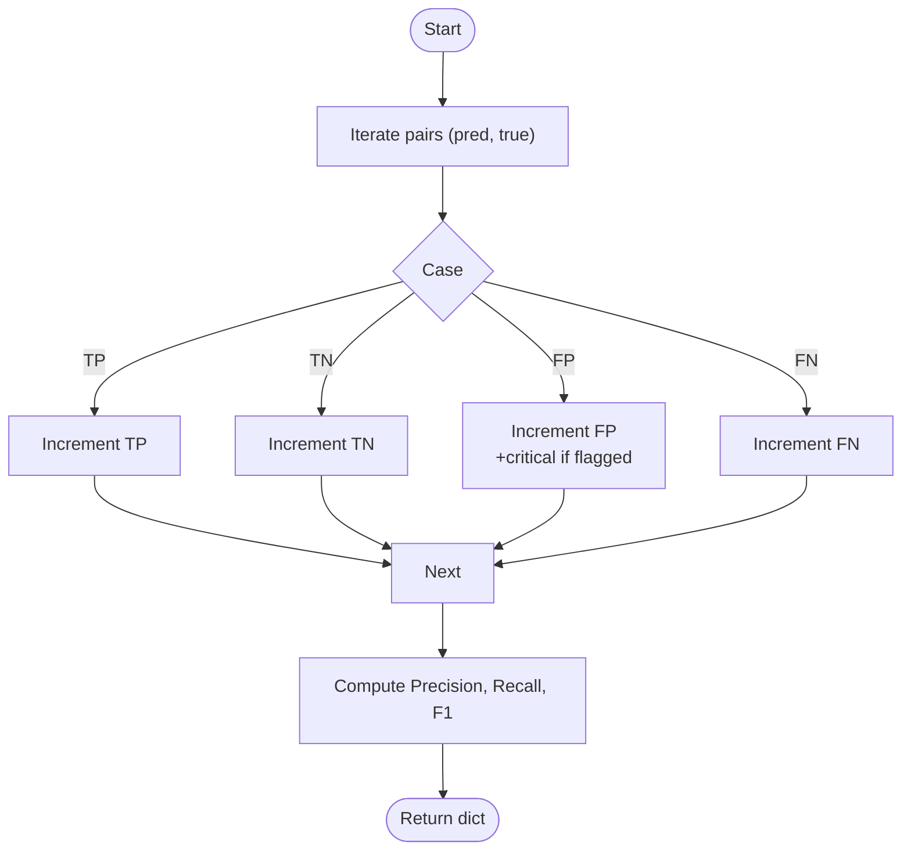

**Diagram sources**
- [metrics.py:59-93](file://apps/ml/training/evaluation/metrics.py#L59-L93)

**Section sources**
- [metrics.py:59-93](file://apps/ml/training/evaluation/metrics.py#L59-L93)

### Attribute Relevance Metrics
- Multi-label set precision/recall: for each item, compute intersection over predicted or true sets; empty sets handled gracefully.
- Aggregation: mean precision and recall across items; F1 computed from means.

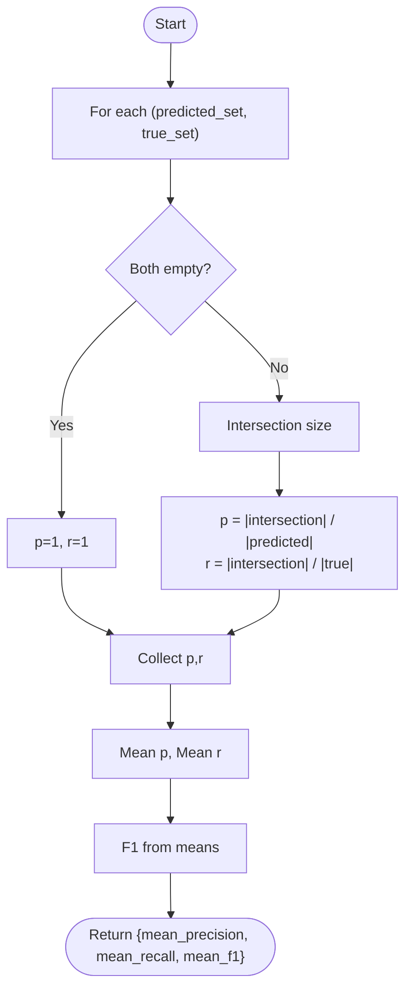

**Diagram sources**
- [metrics.py:96-124](file://apps/ml/training/evaluation/metrics.py#L96-L124)

**Section sources**
- [metrics.py:96-124](file://apps/ml/training/evaluation/metrics.py#L96-L124)

### System Benchmarks (Latency and Memory)
- Latency: measure per-query time and compute P50/P95/P99 percentiles.
- Memory: capture peak resident set size and convert to MB.

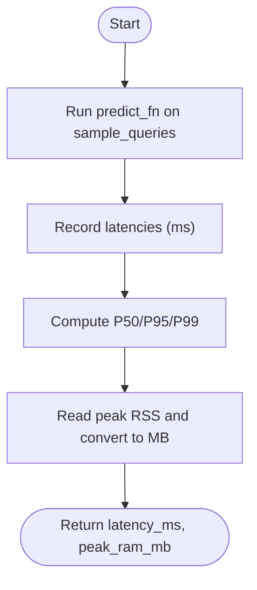

**Diagram sources**
- [metrics.py:127-152](file://apps/ml/training/evaluation/metrics.py#L127-L152)

**Section sources**
- [metrics.py:127-152](file://apps/ml/training/evaluation/metrics.py#L127-L152)

### ModelEvaluator Orchestration
- Loads candidate model, predicts on validation data, computes classification metrics (including Top-3).
- Optionally loads active production model to compute baseline accuracy and detect regression.
- Runs duplicate detection metrics if test pairs are provided.
- Measures latency and memory on a subset of queries.
- Validates provenance by counting unverified records.
- Applies quality gates and determines promotion eligibility.
- Emits TUI events (if available) and writes JSON and Markdown reports.

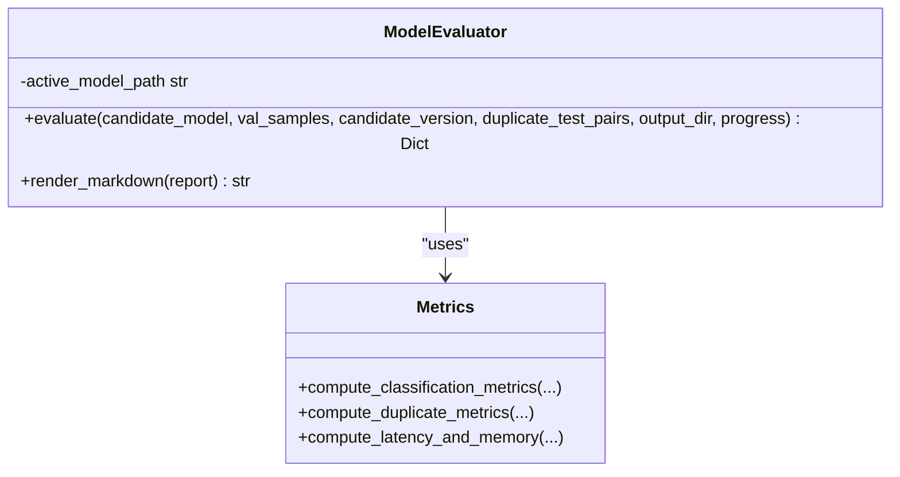

**Diagram sources**
- [evaluator.py:82-275](file://apps/ml/training/evaluation/evaluator.py#L82-L275)
- [metrics.py:20-152](file://apps/ml/training/evaluation/metrics.py#L20-L152)

**Section sources**
- [evaluator.py:91-223](file://apps/ml/training/evaluation/evaluator.py#L91-L223)
- [evaluator.py:225-275](file://apps/ml/training/evaluation/evaluator.py#L225-L275)

### Pipeline Evaluate Script
- Loads candidate model artifact from registry directory and validation dataset.
- Computes Top-1 and Top-3 category accuracy and compares against active baseline.
- Evaluates manufacturer resolution accuracy on a fixed test set.
- Runs duplicate detection benchmark cases and tracks critical false positives.
- Measures latency percentiles and peak memory.
- Enforces quality gates and writes a versioned evaluation report.

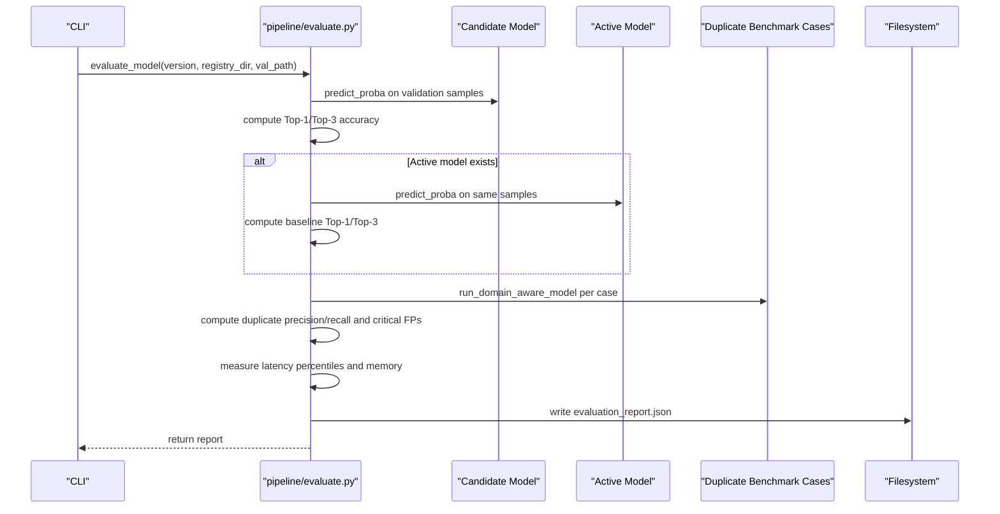

**Diagram sources**
- [evaluate.py:27-254](file://apps/ml/pipeline/evaluate.py#L27-L254)
- [duplicate_benchmark.py:200-212](file://apps/ml/benchmarks/duplicate_benchmark.py#L200-L212)

**Section sources**
- [evaluate.py:64-254](file://apps/ml/pipeline/evaluate.py#L64-L254)

### Duplicate Detection Benchmark Suite
- Defines rigorous test cases covering electrical parameters, physical footprint, tolerance, dielectric, textual variation, aliases, formatting, and packaging suffixes.
- Compares a general embedding simulation against the domain-aware duplicate detector.
- Produces a JSON summary with accuracy, precision, recall, F1, false positives, and average latency.

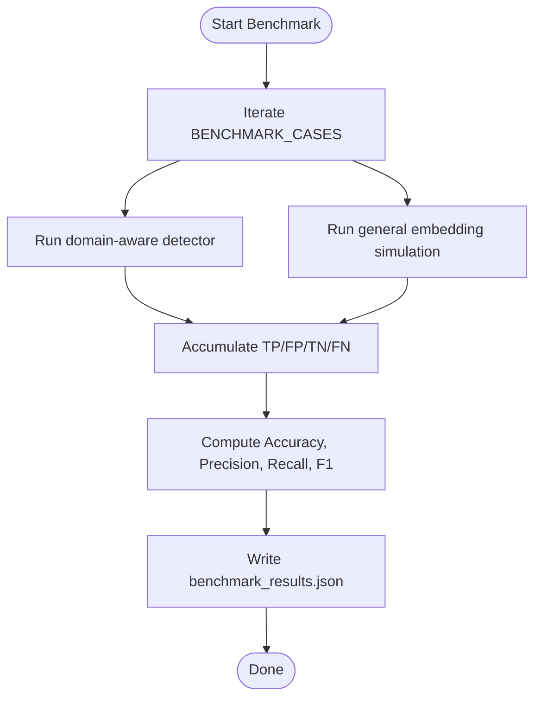

**Diagram sources**
- [duplicate_benchmark.py:27-179](file://apps/ml/benchmarks/duplicate_benchmark.py#L27-L179)
- [duplicate_benchmark.py:213-305](file://apps/ml/benchmarks/duplicate_benchmark.py#L213-L305)
- [benchmark_results.json:1-17](file://apps/ml/benchmarks/benchmark_results.json#L1-L17)

**Section sources**
- [duplicate_benchmark.py:27-305](file://apps/ml/benchmarks/duplicate_benchmark.py#L27-L305)
- [benchmark_results.json:1-17](file://apps/ml/benchmarks/benchmark_results.json#L1-L17)

### Document Acquisition Benchmark
- Spins up a local HTTP origin serving deterministic PDFs.
- Instruments download, rate limiting, PDF parsing, record building, and persistence stages.
- Runs one or two passes (with resume behavior) and prints stage-level timing and counters.
- Supports configurable concurrency, network latency, bandwidth limits, and real or generated PDFs.

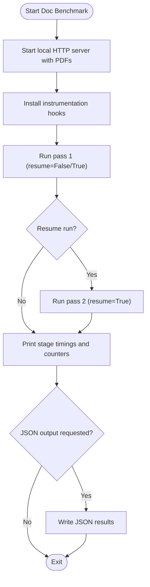

**Diagram sources**
- [document_acquisition_benchmark.py:283-497](file://apps/ml/benchmarks/document_acquisition_benchmark.py#L283-L497)

**Section sources**
- [document_acquisition_benchmark.py:283-497](file://apps/ml/benchmarks/document_acquisition_benchmark.py#L283-L497)

### Reporting and Interpretation
- Machine-readable JSON includes candidate and baseline accuracies, duplicate metrics, latency percentiles, memory, provenance counts, and gate statuses.
- Human-readable Markdown summarizes primary metrics, quality gates, and per-class breakdown (precision, recall, F1-Score, Support) sorted deterministically.
- Tests validate per-class row construction, Markdown rendering, and JSON serialization integrity.

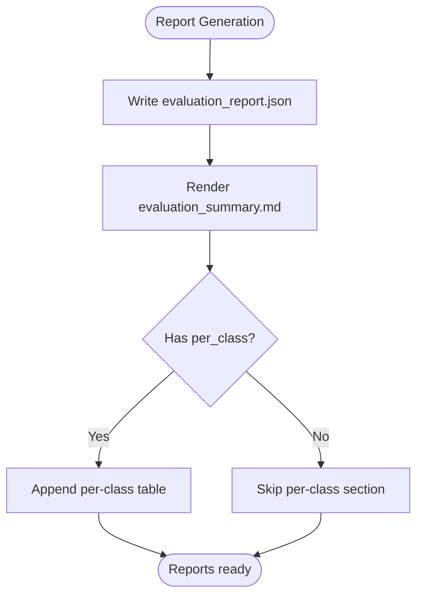

**Diagram sources**
- [evaluator.py:205-275](file://apps/ml/training/evaluation/evaluator.py#L205-L275)
- [test_training_workspace.py:414-520](file://apps/ml/tests/test_training_workspace.py#L414-L520)

**Section sources**
- [evaluator.py:205-275](file://apps/ml/training/evaluation/evaluator.py#L205-L275)
- [test_training_workspace.py:414-520](file://apps/ml/tests/test_training_workspace.py#L414-L520)

## Dependency Analysis
- The evaluator depends on the metrics module for all core computations.
- The pipeline script imports duplicate benchmark cases and the domain-aware duplicate detector to integrate duplicate evaluation into the overall evaluation flow.
- Tests depend on the evaluator’s public API and helper functions to assert report structure and rendering.

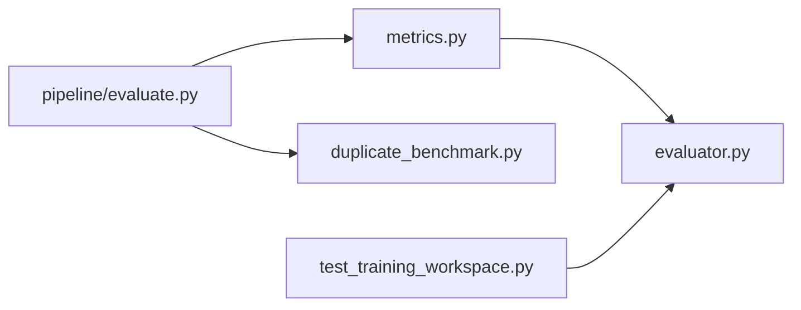

**Diagram sources**
- [metrics.py:1-152](file://apps/ml/training/evaluation/metrics.py#L1-L152)
- [evaluator.py:1-275](file://apps/ml/training/evaluation/evaluator.py#L1-L275)
- [evaluate.py:1-254](file://apps/ml/pipeline/evaluate.py#L1-L254)
- [duplicate_benchmark.py:1-305](file://apps/ml/benchmarks/duplicate_benchmark.py#L1-L305)
- [test_training_workspace.py:1-200](file://apps/ml/tests/test_training_workspace.py#L1-L200)

**Section sources**
- [metrics.py:1-152](file://apps/ml/training/evaluation/metrics.py#L1-L152)
- [evaluator.py:1-275](file://apps/ml/training/evaluation/evaluator.py#L1-L275)
- [evaluate.py:1-254](file://apps/ml/pipeline/evaluate.py#L1-L254)
- [duplicate_benchmark.py:1-305](file://apps/ml/benchmarks/duplicate_benchmark.py#L1-L305)
- [test_training_workspace.py:1-200](file://apps/ml/tests/test_training_workspace.py#L1-L200)

## Performance Considerations
- Latency measurement uses high-resolution timers and percentile aggregation to characterize tail latency (P95/P99).
- Memory measurement captures peak resident set size to ensure resource constraints are respected.
- Duplicate detection benchmark includes average latency per case to compare domain-aware vs general approaches.
- Document acquisition benchmark instruments each stage to identify bottlenecks in download, parsing, and persistence.

[No sources needed since this section provides general guidance]

## Troubleshooting Guide
- Missing artifacts: Ensure candidate model path and validation dataset exist before running evaluation; errors will be raised if not found.
- Active baseline missing: If no active model exists, baseline comparisons are skipped and regression checks default to non-regression.
- Unverified provenance: Count of unverified records must be zero to pass provenance gate; inspect validation samples’ provenance fields.
- Duplicate critical false positives: Any critical false positive merge fails duplicate precision gate; review duplicate detection logic and thresholds.
- Latency/Memory gates: P95 latency must be within threshold and peak RAM must be within limit; investigate slow paths or memory spikes.

**Section sources**
- [evaluate.py:33-57](file://apps/ml/pipeline/evaluate.py#L33-L57)
- [evaluate.py:178-218](file://apps/ml/pipeline/evaluate.py#L178-L218)
- [evaluator.py:147-190](file://apps/ml/training/evaluation/evaluator.py#L147-L190)

## Conclusion
The evaluation framework provides a robust, reproducible process for assessing model performance across multiple dimensions: classification accuracy (Top-1/Top-3), duplicate detection with critical false-positive tracking, attribute relevance, and system-level latency and memory. Quality gates enforce minimum standards and prevent regressions relative to the active baseline. Reports in JSON and Markdown enable both automated gating and stakeholder communication. Benchmarks offer controlled scenarios to validate improvements and diagnose performance issues.

[No sources needed since this section summarizes without analyzing specific files]

## Appendices

### Practical Examples
- Running evaluation: Use the pipeline script to evaluate a candidate model version against validation data and active baseline, producing an evaluation report.
- Interpreting results: Review primary metrics, per-class tables, and quality gate outcomes to understand strengths and weaknesses.
- Comparing versions: Compare Top-1/Top-3 accuracy, duplicate metrics, latency, and memory across versions to decide on promotions.

[No sources needed since this section provides general guidance]

### Statistical Significance Testing
- Current implementation does not include formal statistical tests (e.g., bootstrap confidence intervals or hypothesis testing).
- Recommended approach: use repeated evaluations on stratified splits to estimate variance and compute confidence intervals for key metrics (accuracy, precision, recall, F1).
- For small datasets, consider permutation tests or McNemar’s test for paired predictions to assess significance of changes.

[No sources needed since this section provides general guidance]

### Performance Regression Detection
- Accuracy regression is detected by comparing candidate Top-1 accuracy against the active baseline with a defined margin.
- Additional safeguards: duplicate precision/recall thresholds and zero critical false positives; latency and memory gates; provenance verification.

**Section sources**
- [evaluator.py:154-190](file://apps/ml/training/evaluation/evaluator.py#L154-L190)
- [evaluate.py:178-218](file://apps/ml/pipeline/evaluate.py#L178-L218)

### Confusion Matrix Usage
- While per-class metrics are computed via sklearn’s classification report, explicit confusion matrices can be derived from true and predicted labels for deeper analysis of misclassification patterns.
- Use per-class rows (precision, recall, F1, support) to identify underperforming categories and guide targeted improvements.

**Section sources**
- [metrics.py:40-56](file://apps/ml/training/evaluation/metrics.py#L40-L56)
- [evaluator.py:30-58](file://apps/ml/training/evaluation/evaluator.py#L30-L58)