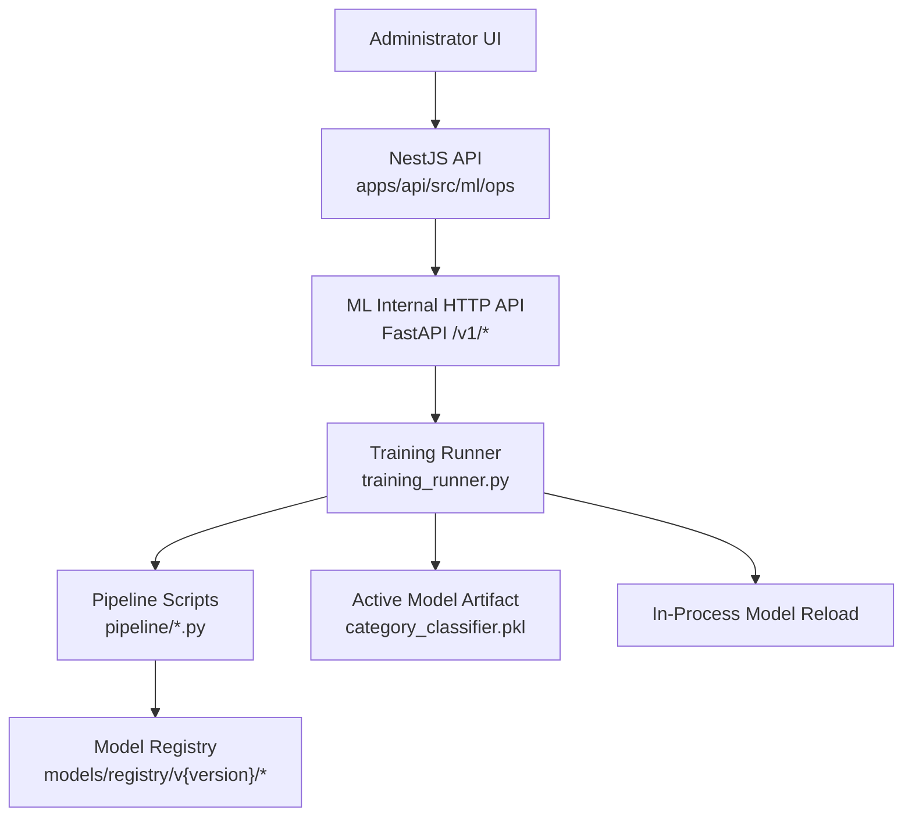
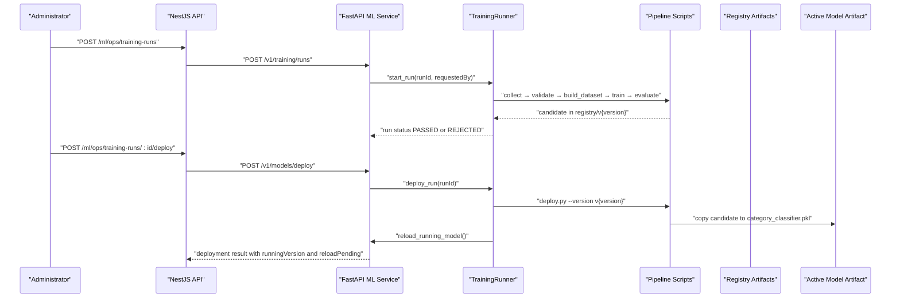
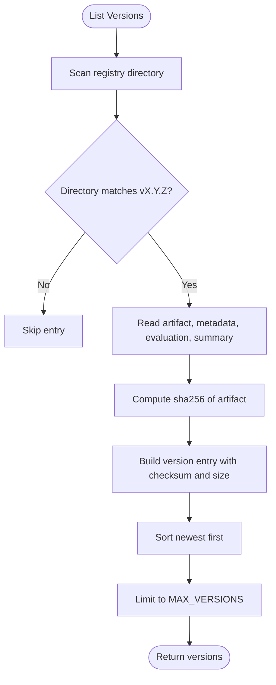
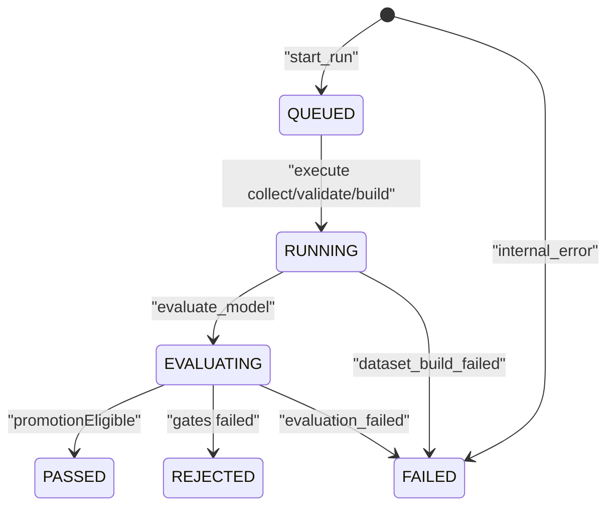
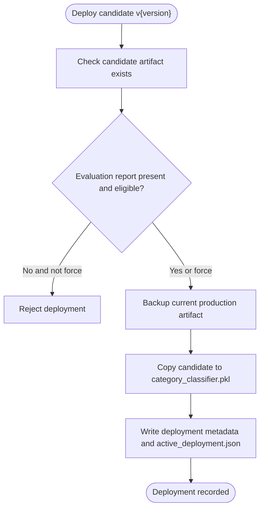
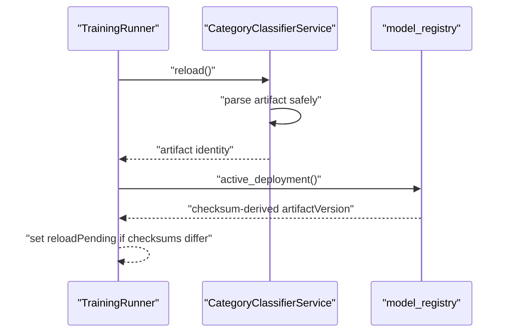
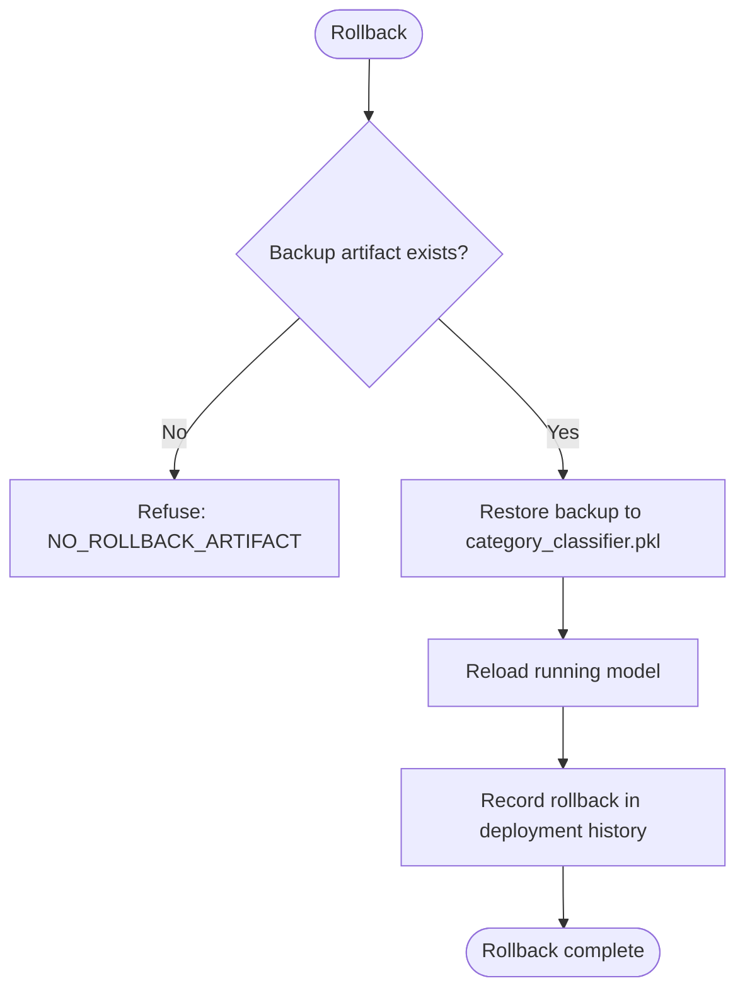
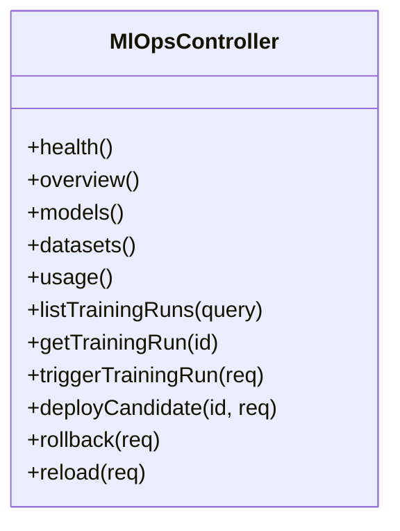
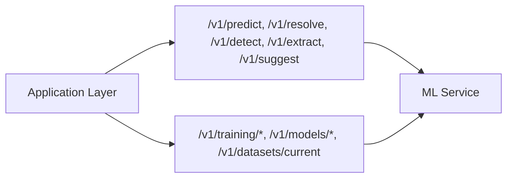
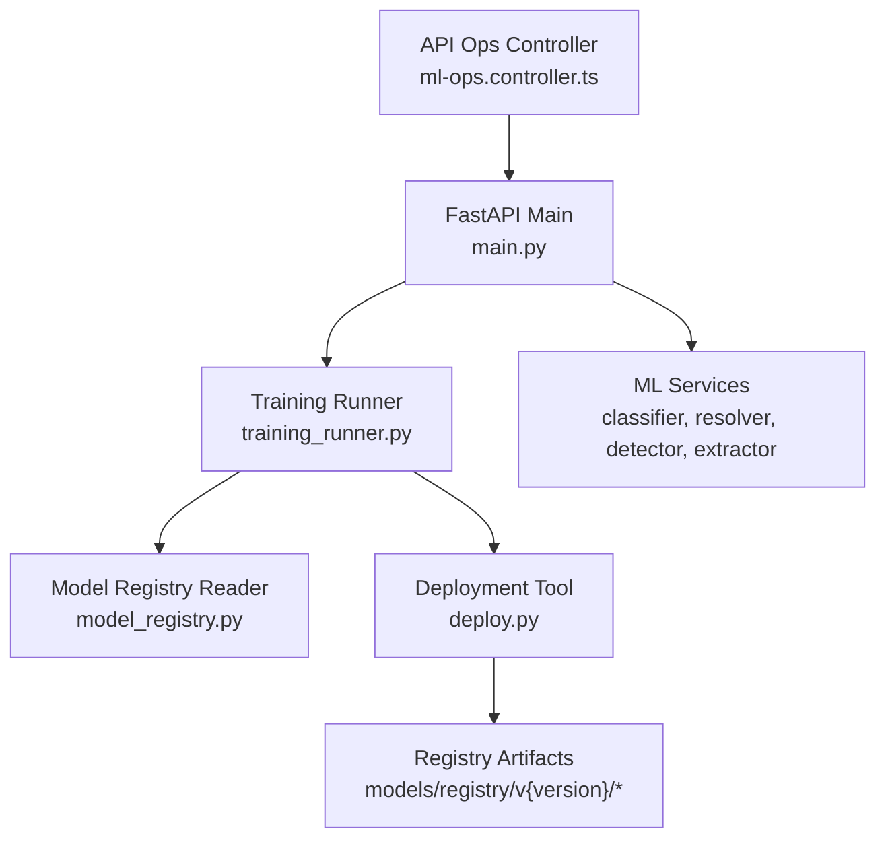

# Model Deployment

<cite>
**Referenced Files in This Document**
- [apps/ml/README.md](file://apps/ml/README.md)
- [docs/ML_OPERATIONS.md](file://docs/ML_OPERATIONS.md)
- [apps/ml/app/main.py](file://apps/ml/app/main.py)
- [apps/ml/app/services/model_registry.py](file://apps/ml/app/services/model_registry.py)
- [apps/ml/pipeline/deploy.py](file://apps/ml/pipeline/deploy.py)
- [apps/ml/app/services/training_runner.py](file://apps/ml/app/services/training_runner.py)
- [apps/api/src/ml/ops/ml-ops.controller.ts](file://apps/api/src/ml/ops/ml-ops.controller.ts)
</cite>

## Table of Contents
1. [Introduction](#introduction)
2. [Project Structure](#project-structure)
3. [Core Components](#core-components)
4. [Architecture Overview](#architecture-overview)
5. [Detailed Component Analysis](#detailed-component-analysis)
6. [Dependency Analysis](#dependency-analysis)
7. [Performance Considerations](#performance-considerations)
8. [Troubleshooting Guide](#troubleshooting-guide)
9. [Conclusion](#conclusion)
10. [Appendices](#appendices)

## Introduction
This document explains the model deployment and registry management system used by the ML microservice. It covers:
- The versioned model registry that stores trained artifacts with metadata and provenance information.
- The end-to-end deployment process, including candidate promotion, rollback, and active model switching.
- The model packaging format, serialization approach, and compatibility requirements.
- Practical examples for deploying new versions, managing lifecycle state, and integrating deployed models with the application layer.
- Monitoring, performance tracking, and automated pipeline behavior suitable for production environments.

The ML service is a lightweight, CPU-first microservice that exposes inference endpoints and an internal control plane for training runs and model operations. The API layer owns authorization, durable run records, and audit logging, while the ML service executes the training pipeline and manages in-process model loading.

## Project Structure
The relevant parts of the repository are organized around:
- `apps/ml`: FastAPI-based ML service, training pipeline, model registry reader, and deployment tooling.
- `apps/api`: NestJS API that exposes operator controls, persists run state, and enforces permissions.
- `docs/ML_OPERATIONS.md`: Operational documentation describing the control plane, states, gates, and failure behavior.

**Diagram sources**
- [apps/api/src/ml/ops/ml-ops.controller.ts:73-187](file://apps/api/src/ml/ops/ml-ops.controller.ts#L73-L187)
- [apps/ml/app/main.py:363-486](file://apps/ml/app/main.py#L363-L486)
- [apps/ml/app/services/training_runner.py:116-592](file://apps/ml/app/services/training_runner.py#L116-L592)
- [apps/ml/pipeline/deploy.py:16-116](file://apps/ml/pipeline/deploy.py#L16-L116)

**Section sources**
- [apps/ml/README.md:19-40](file://apps/ml/README.md#L19-L40)
- [docs/ML_OPERATIONS.md:14-39](file://docs/ML_OPERATIONS.md#L14-L39)

## Core Components
- Model registry reader: read-only view over registry artifacts, dataset snapshots, quarantine summaries, and distribution statistics.
- Training runner: orchestrates the existing pipeline on demand, tracks run state, and coordinates evaluation and promotion.
- Deployment tool: promotes a verified candidate to the active production artifact and supports rollback via backup.
- FastAPI control plane: exposes internal endpoints for training runs, model listing, deployment, rollback, reload, and dataset inspection.
- API operator controller: administrator-only surface that dispatches actions to the ML service and persists durable records and audit events.

Key responsibilities:
- Registry reader never writes or trains; it reports what exists and computes checksums and public fields.
- Runner ensures exactly one active run, separates training from promotion, and refuses unsafe deployments.
- Deploy tool copies artifacts, maintains backups, and writes deployment metadata.
- API enforces permissions, actor identity, and durable state; ML service enforces local invariants.

**Section sources**
- [apps/ml/app/services/model_registry.py:1-22](file://apps/ml/app/services/model_registry.py#L1-L22)
- [apps/ml/app/services/training_runner.py:1-40](file://apps/ml/app/services/training_runner.py#L1-L40)
- [apps/ml/pipeline/deploy.py:1-8](file://apps/ml/pipeline/deploy.py#L1-L8)
- [apps/ml/app/main.py:363-486](file://apps/ml/app/main.py#L363-L486)
- [apps/api/src/ml/ops/ml-ops.controller.ts:23-72](file://apps/api/src/ml/ops/ml-ops.controller.ts#L23-L72)

## Architecture Overview
The deployment architecture separates concerns between the API (authorization, durability, audit) and the ML service (execution, model loading).

**Diagram sources**
- [apps/api/src/ml/ops/ml-ops.controller.ts:135-162](file://apps/api/src/ml/ops/ml-ops.controller.ts#L135-L162)
- [apps/ml/app/main.py:383-443](file://apps/ml/app/main.py#L383-L443)
- [apps/ml/app/services/training_runner.py:154-216](file://apps/ml/app/services/training_runner.py#L154-L216)
- [apps/ml/app/services/training_runner.py:392-453](file://apps/ml/app/services/training_runner.py#L392-L453)
- [apps/ml/pipeline/deploy.py:16-116](file://apps/ml/pipeline/deploy.py#L16-L116)

## Detailed Component Analysis

### Versioned Model Registry
The registry stores each candidate under `models/registry/v{version}/`. Each version may include:
- `category_classifier.pkl` — serialized scikit-learn classifier artifact.
- `metadata.json` — training metadata produced by the trainer.
- `evaluation_report.json` — evaluation metrics and gate verdicts.
- `pipeline_summary.json` — execution summary written by the orchestrator.

The registry reader provides:
- Listing of all versions with checksums, sizes, champion model, evaluation summary, dataset version, and deployability.
- Resolution of the active deployment by comparing the checksum of the production artifact against registry entries.
- Dataset snapshot inspection with content fingerprinting.
- Quarantine and validated record distributions bounded by scan limits.

**Diagram sources**
- [apps/ml/app/services/model_registry.py:96-145](file://apps/ml/app/services/model_registry.py#L96-L145)
- [apps/ml/app/services/model_registry.py:62-71](file://apps/ml/app/services/model_registry.py#L62-L71)

**Section sources**
- [apps/ml/app/services/model_registry.py:33-48](file://apps/ml/app/services/model_registry.py#L33-L48)
- [apps/ml/app/services/model_registry.py:96-145](file://apps/ml/app/services/model_registry.py#L96-L145)
- [apps/ml/app/services/model_registry.py:199-245](file://apps/ml/app/services/model_registry.py#L199-L245)
- [apps/ml/app/services/model_registry.py:276-316](file://apps/ml/app/services/model_registry.py#L276-L316)
- [apps/ml/app/services/model_registry.py:348-398](file://apps/ml/app/services/model_registry.py#L348-L398)
- [apps/ml/app/services/model_registry.py:401-449](file://apps/ml/app/services/model_registry.py#L401-L449)

### Training Runner and Lifecycle
The training runner executes the existing pipeline on a background thread and tracks run state. States include QUEUED, RUNNING, EVALUATING, PASSED, REJECTED, FAILED, and CANCELLED. Phases reported by the pipeline are PREPARING_DATASET, TRAINING, EVALUATING, PACKAGING, COMPLETED.

Important behaviors:
- Exactly one active run at a time.
- No automatic promotion (`auto_deploy=False`).
- Stable error codes per phase.
- Bounded logs and retained runs.
- Candidate version allocation is centralized in the registry reader.

**Diagram sources**
- [apps/ml/app/services/training_runner.py:50-82](file://apps/ml/app/services/training_runner.py#L50-L82)
- [apps/ml/app/services/training_runner.py:154-216](file://apps/ml/app/services/training_runner.py#L154-L216)
- [apps/ml/app/services/training_runner.py:253-365](file://apps/ml/app/services/training_runner.py#L253-L365)

**Section sources**
- [apps/ml/app/services/training_runner.py:116-151](file://apps/ml/app/services/training_runner.py#L116-L151)
- [apps/ml/app/services/training_runner.py:154-216](file://apps/ml/app/services/training_runner.py#L154-L216)
- [apps/ml/app/services/training_runner.py:253-365](file://apps/ml/app/services/training_runner.py#L253-L365)
- [docs/ML_OPERATIONS.md:59-86](file://docs/ML_OPERATIONS.md#L59-L86)

### Deployment Tool and Promotion
Promotion uses the existing `deploy.py` tool:
- Validates candidate artifact and evaluation report unless forced.
- Creates a backup of the current production artifact.
- Copies the candidate to the active model path.
- Writes deployment metadata and active deployment log.
- Supports rollback using the backup file.

**Diagram sources**
- [apps/ml/pipeline/deploy.py:16-116](file://apps/ml/pipeline/deploy.py#L16-L116)

**Section sources**
- [apps/ml/pipeline/deploy.py:16-116](file://apps/ml/pipeline/deploy.py#L16-L116)

### Active Model Switching and Reload
After promotion, the ML service reloads the classifier in place:
- The new artifact is fully parsed before swapping the in-memory reference.
- A corrupt or missing file leaves the previous model serving traffic.
- If reload fails, the deployment is marked pending reload and can be retried without restarting the container.

**Diagram sources**
- [apps/ml/app/services/training_runner.py:455-480](file://apps/ml/app/services/training_runner.py#L455-L480)
- [apps/ml/app/services/model_registry.py:199-245](file://apps/ml/app/services/model_registry.py#L199-L245)

**Section sources**
- [docs/ML_OPERATIONS.md:132-152](file://docs/ML_OPERATIONS.md#L132-L152)
- [apps/ml/app/services/training_runner.py:455-480](file://apps/ml/app/services/training_runner.py#L455-L480)

### Rollback Procedure
Rollback restores the previous production artifact:
- Refused when no backup exists.
- Uses the same mechanism as promotion but with `--rollback`.
- Records a ROLLBACK entry in deployment history.
- Dashboard surfaces divergence between metadata and checksum-derived version.

**Diagram sources**
- [apps/ml/app/services/training_runner.py:482-534](file://apps/ml/app/services/training_runner.py#L482-L534)
- [apps/ml/pipeline/deploy.py:28-33](file://apps/ml/pipeline/deploy.py#L28-L33)

**Section sources**
- [docs/ML_OPERATIONS.md:154-166](file://docs/ML_OPERATIONS.md#L154-L166)
- [apps/ml/app/services/training_runner.py:482-534](file://apps/ml/app/services/training_runner.py#L482-L534)

### API Operator Control Plane
The API exposes administrator-only routes for health, overview, models, datasets, usage, training runs, deployment, rollback, and reload. Every mutation derives the actor from the authenticated session and rejects spoofed actors.

**Diagram sources**
- [apps/api/src/ml/ops/ml-ops.controller.ts:73-187](file://apps/api/src/ml/ops/ml-ops.controller.ts#L73-L187)

**Section sources**
- [apps/api/src/ml/ops/ml-ops.controller.ts:23-72](file://apps/api/src/ml/ops/ml-ops.controller.ts#L23-L72)
- [apps/api/src/ml/ops/ml-ops.controller.ts:73-187](file://apps/api/src/ml/ops/ml-ops.controller.ts#L73-L187)
- [docs/ML_OPERATIONS.md:195-240](file://docs/ML_OPERATIONS.md#L195-L240)

### Model Packaging Format and Compatibility
Packaging format:
- Serialized scikit-learn classifier artifact (`category_classifier.pkl`) stored per version.
- Sidecar JSON files: `metadata.json`, `evaluation_report.json`, `pipeline_summary.json`.
- Active deployment metadata written alongside the production artifact.

Compatibility requirements:
- Python runtime compatible with the ML service dependencies.
- Scikit-learn model loaded by the service must match the expected interface.
- Evaluation gates and thresholds must remain consistent across pipeline revisions.
- Container-local filesystem paths for registry and data; artifacts do not survive container replacement unless volumes are added.

**Section sources**
- [apps/ml/README.md:190-198](file://apps/ml/README.md#L190-L198)
- [apps/ml/app/services/model_registry.py:33-48](file://apps/ml/app/services/model_registry.py#L33-L48)
- [docs/ML_OPERATIONS.md:334-349](file://docs/ML_OPERATIONS.md#L334-L349)

### Integration with the Application Layer
The application layer integrates with the ML service through:
- Inference endpoints for category prediction, manufacturer resolution, duplicate detection, datasheet extraction, and composite suggestions.
- Internal control plane endpoints for training runs and model operations.
- Health and readiness probes indicating service status and loaded model artifacts.

**Diagram sources**
- [apps/ml/app/main.py:82-101](file://apps/ml/app/main.py#L82-L101)
- [apps/ml/app/main.py:103-256](file://apps/ml/app/main.py#L103-L256)
- [apps/ml/app/main.py:383-486](file://apps/ml/app/main.py#L383-L486)

**Section sources**
- [apps/ml/README.md:202-216](file://apps/ml/README.md#L202-L216)
- [apps/ml/app/main.py:82-101](file://apps/ml/app/main.py#L82-L101)
- [apps/ml/app/main.py:103-256](file://apps/ml/app/main.py#L103-L256)
- [apps/ml/app/main.py:383-486](file://apps/ml/app/main.py#L383-L486)

## Dependency Analysis
The following diagram shows key dependencies among components involved in deployment and registry management.

**Diagram sources**
- [apps/api/src/ml/ops/ml-ops.controller.ts:73-187](file://apps/api/src/ml/ops/ml-ops.controller.ts#L73-L187)
- [apps/ml/app/main.py:363-486](file://apps/ml/app/main.py#L363-L486)
- [apps/ml/app/services/training_runner.py:116-592](file://apps/ml/app/services/training_runner.py#L116-L592)
- [apps/ml/app/services/model_registry.py:1-454](file://apps/ml/app/services/model_registry.py#L1-L454)
- [apps/ml/pipeline/deploy.py:16-116](file://apps/ml/pipeline/deploy.py#L16-L116)

**Section sources**
- [apps/api/src/ml/ops/ml-ops.controller.ts:73-187](file://apps/api/src/ml/ops/ml-ops.controller.ts#L73-L187)
- [apps/ml/app/main.py:363-486](file://apps/ml/app/main.py#L363-L486)
- [apps/ml/app/services/training_runner.py:116-592](file://apps/ml/app/services/training_runner.py#L116-L592)
- [apps/ml/app/services/model_registry.py:1-454](file://apps/ml/app/services/model_registry.py#L1-L454)
- [apps/ml/pipeline/deploy.py:16-116](file://apps/ml/pipeline/deploy.py#L16-L116)

## Performance Considerations
- The ML service is designed for low footprint operation with sub-20ms inference latency.
- Evaluation includes latency and memory gates to ensure candidates meet performance requirements.
- The runner avoids capturing raw stdout to prevent global log interference; bounded logs are maintained per run.
- Dataset scanning and distribution computations are bounded to avoid excessive resource usage.

[No sources needed since this section provides general guidance]

## Troubleshooting Guide
Common issues and resolutions:
- Unknown training run: indicates the ML process restarted; the API treats this as job lost.
- Deployment refused: candidate not ready, not finished, not eligible, or artifact missing.
- Rollback refused: no backup artifact available.
- Reload pending: artifact deployed but running model still serving old version; retry reload.
- Evaluation failures: check gate verdicts and thresholds; ensure evaluation script dependencies are present.

Operational references:
- Error codes and states are documented in the operations guide.
- Failure behavior maps specific errors to production impact.

**Section sources**
- [apps/ml/app/main.py:404-411](file://apps/ml/app/main.py#L404-L411)
- [apps/ml/app/services/training_runner.py:392-453](file://apps/ml/app/services/training_runner.py#L392-L453)
- [apps/ml/app/services/training_runner.py:482-534](file://apps/ml/app/services/training_runner.py#L482-L534)
- [docs/ML_OPERATIONS.md:76-86](file://docs/ML_OPERATIONS.md#L76-L86)
- [docs/ML_OPERATIONS.md:263-277](file://docs/ML_OPERATIONS.md#L263-L277)

## Conclusion
The model deployment system combines a strict registry, a controlled training runner, and an operator-facing API to ensure safe, auditable, and reversible model promotions. The design emphasizes:
- Clear separation between authorization/durability (API) and execution/model loading (ML service).
- Explicit promotion and rollback procedures backed by checksums and backups.
- Comprehensive monitoring through registry listings, dataset snapshots, quarantine summaries, and evaluation gate results.
- Production-ready constraints such as single active run, bounded logs, and explicit reload semantics.

For production environments, consider adding persistent storage for registry and dataset artifacts, service-to-service authentication between API and ML, and a dedicated ML permission once the role model evolves.

[No sources needed since this section summarizes without analyzing specific files]

## Appendices

### Practical Examples

- Deploy a new model version:
  - Trigger a training run via the API.
  - Wait for the run to reach PASSED.
  - Promote the candidate via the API.
  - Verify the running model and reload status.

- Manage model lifecycle:
  - Inspect registry versions and their evaluation reports.
  - Review dataset snapshots and fingerprints.
  - Monitor quarantine and validated record distributions.

- Integrate deployed models:
  - Use inference endpoints for predictions and attribute extraction.
  - Use health and readiness probes to confirm service status.

[No sources needed since this section provides general guidance]