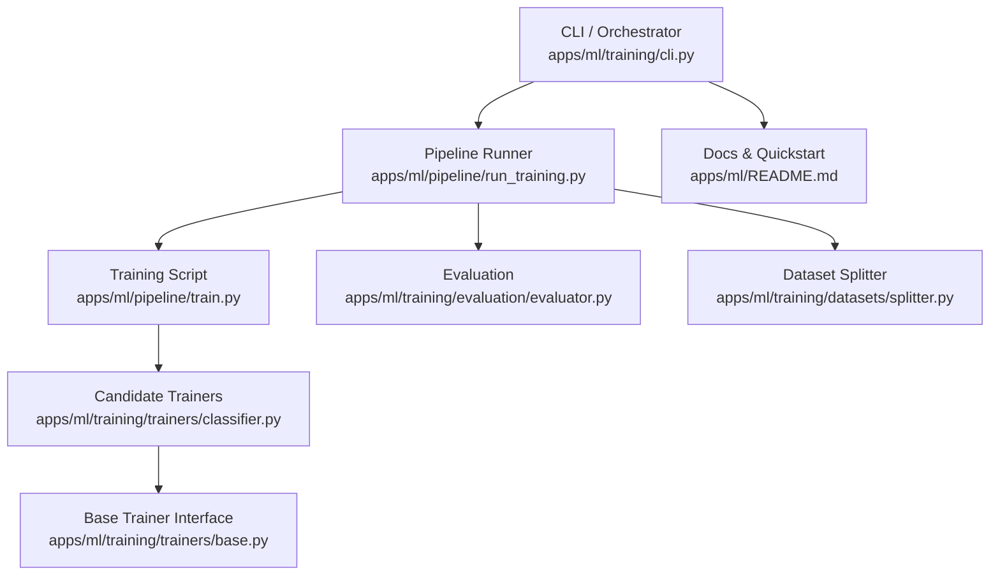
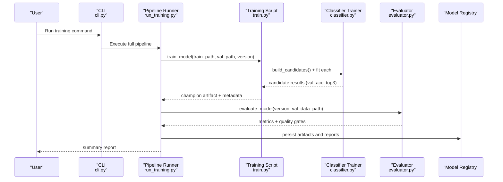
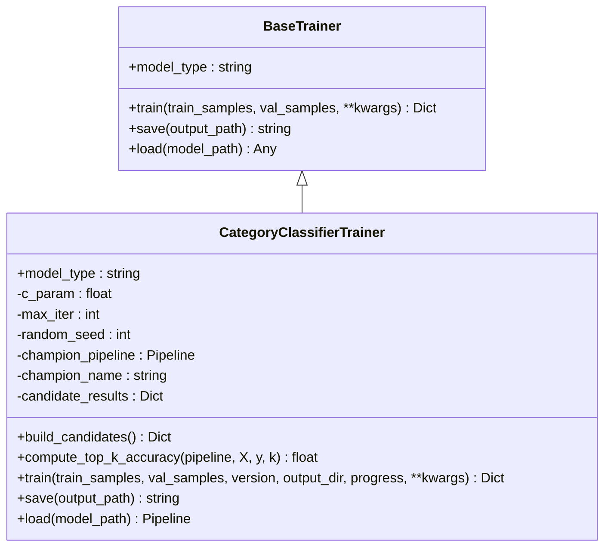
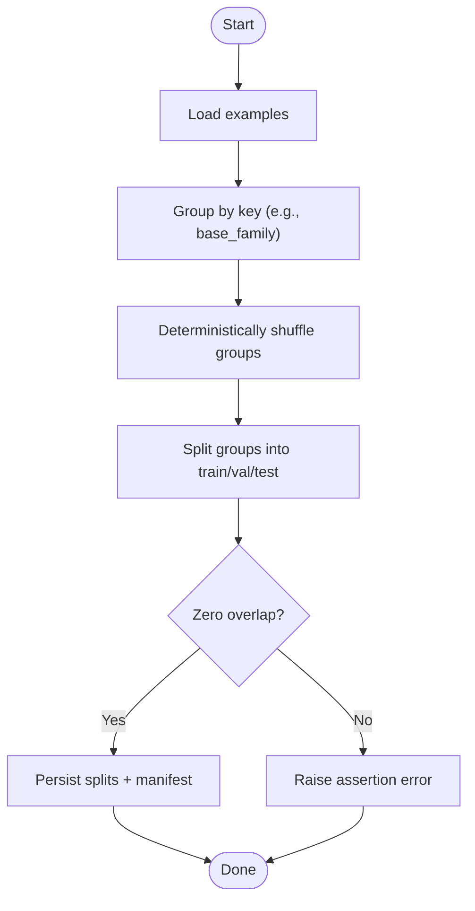
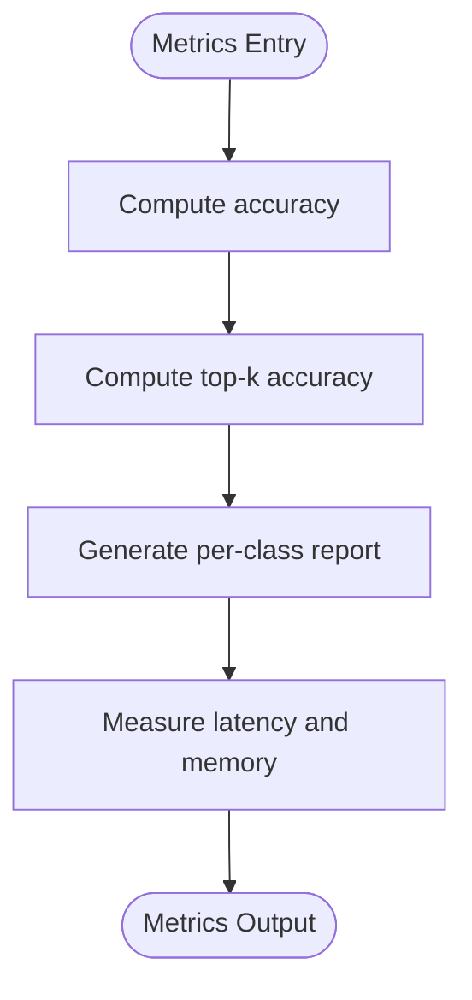
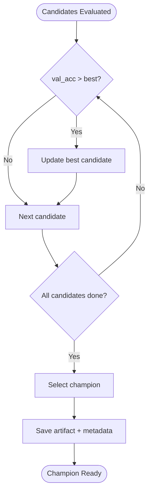
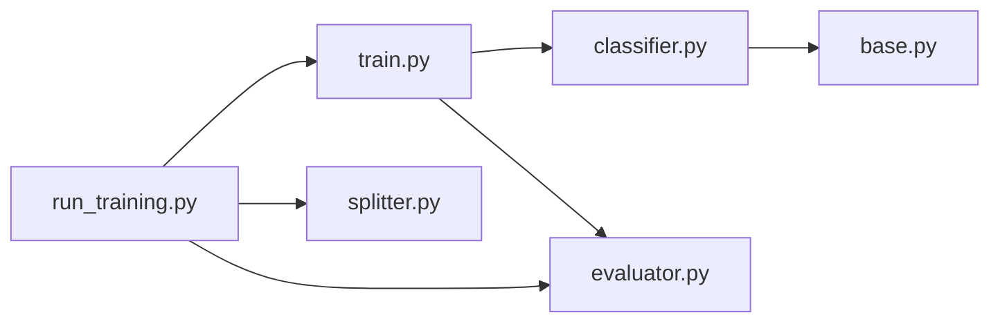

# Model Training

<cite>
**Referenced Files in This Document**
- [run_training.py](file://apps/ml/pipeline/run_training.py)
- [train.py](file://apps/ml/pipeline/train.py)
- [classifier.py](file://apps/ml/training/trainers/classifier.py)
- [base.py](file://apps/ml/training/trainers/base.py)
- [evaluator.py](file://apps/ml/training/evaluation/evaluator.py)
- [splitter.py](file://apps/ml/training/datasets/splitter.py)
- [cli.py](file://apps/ml/training/cli.py)
- [README.md](file://apps/ml/README.md)
</cite>

## Table of Contents
1. [Introduction](#introduction)
2. [Project Structure](#project-structure)
3. [Core Components](#core-components)
4. [Architecture Overview](#architecture-overview)
5. [Detailed Component Analysis](#detailed-component-analysis)
6. [Dependency Analysis](#dependency-analysis)
7. [Performance Considerations](#performance-considerations)
8. [Troubleshooting Guide](#troubleshooting-guide)
9. [Conclusion](#conclusion)
10. [Appendices](#appendices)

## Introduction
This document explains the model training workflow for category classification, focusing on candidate architecture evaluation and selection. It covers three candidate models (character n-grams, word n-grams, hybrid union), the training process including hyperparameter tuning, cross-validation via grouped splits, and performance metrics calculation. It also details the champion selection algorithm that evaluates candidates based on validation accuracy and top-k performance, provides practical examples to start and monitor training runs, and addresses error handling, retry mechanisms, resource management, and extending the pipeline with new architectures or strategies.

## Project Structure
The training system is implemented in two complementary layers:
- Pipeline layer (RFC-0058): an end-to-end orchestrator that runs data collection, validation, dataset building, training, evaluation, and deployment.
- Training workspace layer: a modular development environment with reusable trainers, evaluators, dataset splitters, and CLI commands.

**Diagram sources**
- [run_training.py:1-149](file://apps/ml/pipeline/run_training.py#L1-L149)
- [train.py:1-203](file://apps/ml/pipeline/train.py#L1-L203)
- [classifier.py:1-224](file://apps/ml/training/trainers/classifier.py#L1-L224)
- [base.py:1-33](file://apps/ml/training/trainers/base.py#L1-L33)
- [evaluator.py:1-275](file://apps/ml/training/evaluation/evaluator.py#L1-L275)
- [splitter.py:1-141](file://apps/ml/training/datasets/splitter.py#L1-L141)
- [README.md:92-188](file://apps/ml/README.md#L92-L188)

**Section sources**
- [run_training.py:1-149](file://apps/ml/pipeline/run_training.py#L1-L149)
- [README.md:92-188](file://apps/ml/README.md#L92-L188)

## Core Components
- Candidate architectures: character n-grams, word n-grams, hybrid union of both.
- Trainer interface and implementation: abstract base trainer and concrete classifier trainer.
- Dataset splitting: deterministic, zero-leakage group-based splitter.
- Evaluation: metrics computation, quality gates, and promotion eligibility.
- Orchestration: end-to-end pipeline runner and CLI entry points.

Key responsibilities:
- Build and train multiple candidate pipelines.
- Compute accuracy and top-k metrics.
- Select champion by validation accuracy (with tie-breaking by top-k).
- Persist artifacts and metadata to a versioned registry.
- Evaluate against quality gates and active baseline.

**Section sources**
- [train.py:54-80](file://apps/ml/pipeline/train.py#L54-L80)
- [classifier.py:41-67](file://apps/ml/training/trainers/classifier.py#L41-L67)
- [splitter.py:22-80](file://apps/ml/training/datasets/splitter.py#L22-L80)
- [evaluator.py:82-223](file://apps/ml/training/evaluation/evaluator.py#L82-L223)
- [run_training.py:29-133](file://apps/ml/pipeline/run_training.py#L29-L133)

## Architecture Overview
The training workflow integrates data preparation, multi-candidate training, evaluation, and optional deployment. The pipeline orchestrator coordinates stages and produces a comprehensive summary report.

**Diagram sources**
- [run_training.py:29-133](file://apps/ml/pipeline/run_training.py#L29-L133)
- [train.py:99-193](file://apps/ml/pipeline/train.py#L99-L193)
- [classifier.py:82-209](file://apps/ml/training/trainers/classifier.py#L82-L209)
- [evaluator.py:91-223](file://apps/ml/training/evaluation/evaluator.py#L91-L223)

## Detailed Component Analysis

### Candidate Architectures
Three feature extraction strategies are evaluated:
- Character n-grams (3–5) with TF-IDF and Logistic Regression.
- Word n-grams (1–2) with TF-IDF and Logistic Regression.
- Hybrid Union combining both character and word features before classification.

These candidates are built identically across the pipeline script and the training workspace trainer, ensuring consistent behavior.

**Diagram sources**
- [base.py:9-33](file://apps/ml/training/trainers/base.py#L9-L33)
- [classifier.py:28-224](file://apps/ml/training/trainers/classifier.py#L28-L224)

**Section sources**
- [train.py:54-80](file://apps/ml/pipeline/train.py#L54-L80)
- [classifier.py:41-67](file://apps/ml/training/trainers/classifier.py#L41-L67)

### Training Process and Hyperparameters
- Feature extraction: TF-IDF vectorizer with sublinear TF scaling.
- Classifier: Logistic Regression with fixed regularization strength and iteration limit.
- Random seed: set for reproducibility.
- Data loading: supports separate train/validation JSON files; falls back to single file with 80/20 split if needed.
- Metrics: per-candidate training accuracy, validation accuracy, and top-3 accuracy.

Hyperparameter values are explicitly defined in the candidate builders and can be tuned by adjusting the trainer parameters.

**Section sources**
- [train.py:23-52](file://apps/ml/pipeline/train.py#L23-L52)
- [train.py:54-80](file://apps/ml/pipeline/train.py#L54-L80)
- [classifier.py:33-67](file://apps/ml/training/trainers/classifier.py#L33-L67)
- [classifier.py:82-132](file://apps/ml/training/trainers/classifier.py#L82-L132)

### Cross-Validation and Data Splits
- Group-based splitting ensures zero leakage by partitioning groups (e.g., base family or MPN) into train/val/test.
- Deterministic shuffling uses a fixed random seed for reproducibility.
- Manifests include checksums, split counts, and verification flags.

**Diagram sources**
- [splitter.py:22-80](file://apps/ml/training/datasets/splitter.py#L22-L80)
- [splitter.py:82-141](file://apps/ml/training/datasets/splitter.py#L82-L141)

**Section sources**
- [splitter.py:22-80](file://apps/ml/training/datasets/splitter.py#L22-L80)
- [splitter.py:82-141](file://apps/ml/training/datasets/splitter.py#L82-L141)

### Performance Metrics Calculation
- Accuracy: standard classification accuracy on train and validation sets.
- Top-k accuracy: proportion of samples where the true label appears in the top-k predicted probabilities.
- Per-class metrics: precision, recall, F1-score, support derived from sklearn’s classification report.
- System metrics: latency and memory footprint measured during evaluation.

**Diagram sources**
- [train.py:82-97](file://apps/ml/pipeline/train.py#L82-L97)
- [evaluator.py:107-145](file://apps/ml/training/evaluation/evaluator.py#L107-L145)

**Section sources**
- [train.py:82-97](file://apps/ml/pipeline/train.py#L82-L97)
- [evaluator.py:107-145](file://apps/ml/training/evaluation/evaluator.py#L107-L145)

### Champion Selection Algorithm
- Primary criterion: highest validation accuracy among candidates.
- Tie-breaker: higher top-3 accuracy when validation accuracies are equal.
- Selected champion is serialized to the versioned registry along with metadata and classification report.

**Diagram sources**
- [train.py:119-143](file://apps/ml/pipeline/train.py#L119-L143)
- [classifier.py:152-173](file://apps/ml/training/trainers/classifier.py#L152-L173)

**Section sources**
- [train.py:119-143](file://apps/ml/pipeline/train.py#L119-L143)
- [classifier.py:152-173](file://apps/ml/training/trainers/classifier.py#L152-L173)

### Practical Examples: Starting, Monitoring, and Interpreting Results
- Full pipeline run (single command):
  - Use the documented command to execute all six stages, including training and optional deployment.
- Individual stage execution:
  - Run collect, validate, build_dataset, train, evaluate, deploy independently for debugging.
- Local CLI training:
  - Use the training workspace CLI to train candidates, split datasets, and evaluate with live progress updates.

Monitoring and interpretation:
- Progress events and stage logs provide real-time feedback during training and evaluation.
- Outputs include model artifacts, metadata, evaluation reports (JSON and Markdown), and a pipeline summary.

**Section sources**
- [README.md:92-188](file://apps/ml/README.md#L92-L188)
- [cli.py:640-704](file://apps/ml/training/cli.py#L640-L704)

## Dependency Analysis
The training system composes several modules with clear boundaries:
- Orchestrator depends on pipeline scripts for each stage.
- Training script depends on candidate builders and metric utilities.
- Trainer implements the abstract interface for extensibility.
- Evaluator depends on metrics and optionally loads active baseline model.
- Splitter enforces zero leakage and persists manifests.

**Diagram sources**
- [run_training.py:22-27](file://apps/ml/pipeline/run_training.py#L22-L27)
- [train.py:10-21](file://apps/ml/pipeline/train.py#L10-L21)
- [classifier.py:19-24](file://apps/ml/training/trainers/classifier.py#L19-L24)
- [base.py:9-33](file://apps/ml/training/trainers/base.py#L9-L33)
- [evaluator.py:17-21](file://apps/ml/training/evaluation/evaluator.py#L17-L21)
- [splitter.py:18-19](file://apps/ml/training/datasets/splitter.py#L18-L19)

**Section sources**
- [run_training.py:22-27](file://apps/ml/pipeline/run_training.py#L22-L27)
- [train.py:10-21](file://apps/ml/pipeline/train.py#L10-L21)
- [classifier.py:19-24](file://apps/ml/training/trainers/classifier.py#L19-L24)
- [base.py:9-33](file://apps/ml/training/trainers/base.py#L9-L33)
- [evaluator.py:17-21](file://apps/ml/training/evaluation/evaluator.py#L17-L21)
- [splitter.py:18-19](file://apps/ml/training/datasets/splitter.py#L18-L19)

## Performance Considerations
- CPU-first design: statistical classifiers operate efficiently on CPU with low memory footprint.
- Latency targets: evaluation measures P95 latency and peak memory usage to ensure fast inference.
- Deterministic splits: group-based splitting avoids data leakage and improves generalization assessment.
- Artifact size: persisted model artifacts are tracked for storage efficiency.

[No sources needed since this section provides general guidance]

## Troubleshooting Guide
Common issues and resolutions:
- Missing training data:
  - Ensure train and validation paths exist; the training script raises a FileNotFoundError if data is missing.
- No validation set provided:
  - Falls back to using training accuracy; consider providing a held-out validation set for reliable metrics.
- Quality gates fail:
  - Check accuracy regression vs baseline, duplicate precision/recall thresholds, latency/memory limits, and provenance verification.
- Promotion blocked:
  - Review evaluation report and quality gate failures; adjust model or data to meet thresholds.

Error handling patterns:
- Explicit exceptions for missing files and invalid configurations.
- Assertions to enforce zero leakage during dataset splitting.
- Graceful fallbacks when optional components (e.g., TUI events) are unavailable.

Retry mechanisms:
- The autonomous collection subsystem includes robust retries and rate limiting; training scripts focus on deterministic execution without network calls.

Resource management:
- Memory and latency are measured during evaluation; keep datasets and models within specified limits to maintain performance.

**Section sources**
- [train.py:27-52](file://apps/ml/pipeline/train.py#L27-L52)
- [splitter.py:71-74](file://apps/ml/training/datasets/splitter.py#L71-L74)
- [evaluator.py:154-167](file://apps/ml/training/evaluation/evaluator.py#L154-L167)

## Conclusion
The training workflow evaluates three candidate architectures—character n-grams, word n-grams, and hybrid union—using deterministic, zero-leakage splits and computes accuracy and top-k metrics to select a champion. The pipeline orchestrates data ingestion, validation, dataset building, training, evaluation, and optional deployment, producing versioned artifacts and comprehensive reports. Extensibility is supported through a base trainer interface and modular evaluator, enabling addition of new architectures or strategies while maintaining rigorous quality gates.

[No sources needed since this section summarizes without analyzing specific files]

## Appendices

### How to Extend the Pipeline
- Add a new candidate architecture:
  - Implement a new pipeline builder in the trainer or training script, following existing patterns for feature extraction and classification.
- Introduce a new training strategy:
  - Create a new trainer subclassing the base trainer, implementing train/save/load methods.
- Customize evaluation:
  - Extend the evaluator with additional metrics or quality gates, updating the report structure accordingly.

**Section sources**
- [base.py:9-33](file://apps/ml/training/trainers/base.py#L9-L33)
- [classifier.py:28-224](file://apps/ml/training/trainers/classifier.py#L28-L224)
- [evaluator.py:82-223](file://apps/ml/training/evaluation/evaluator.py#L82-L223)