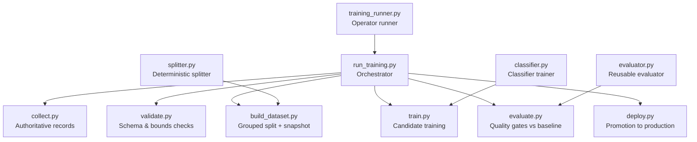
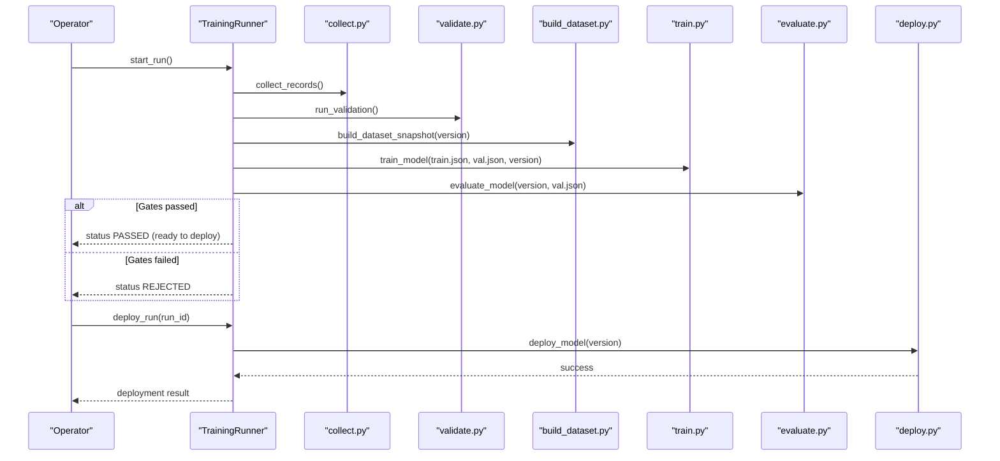
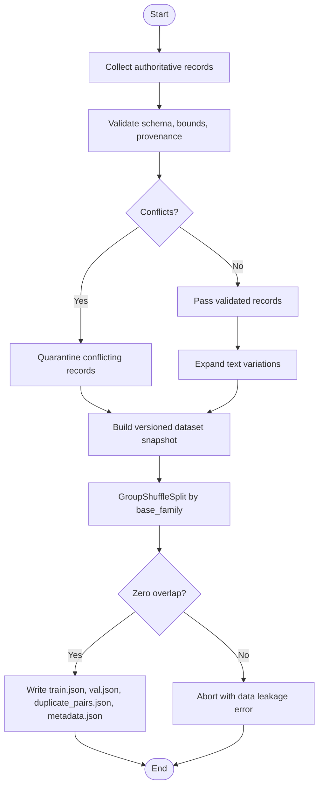
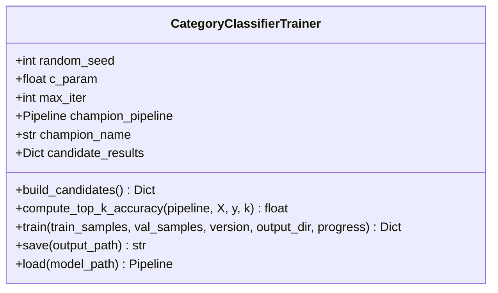
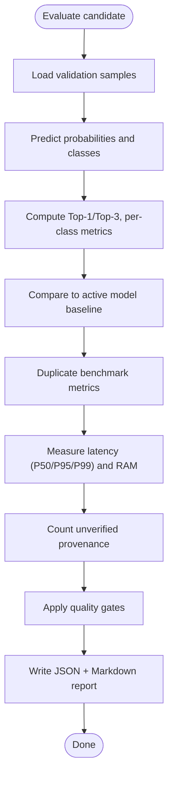
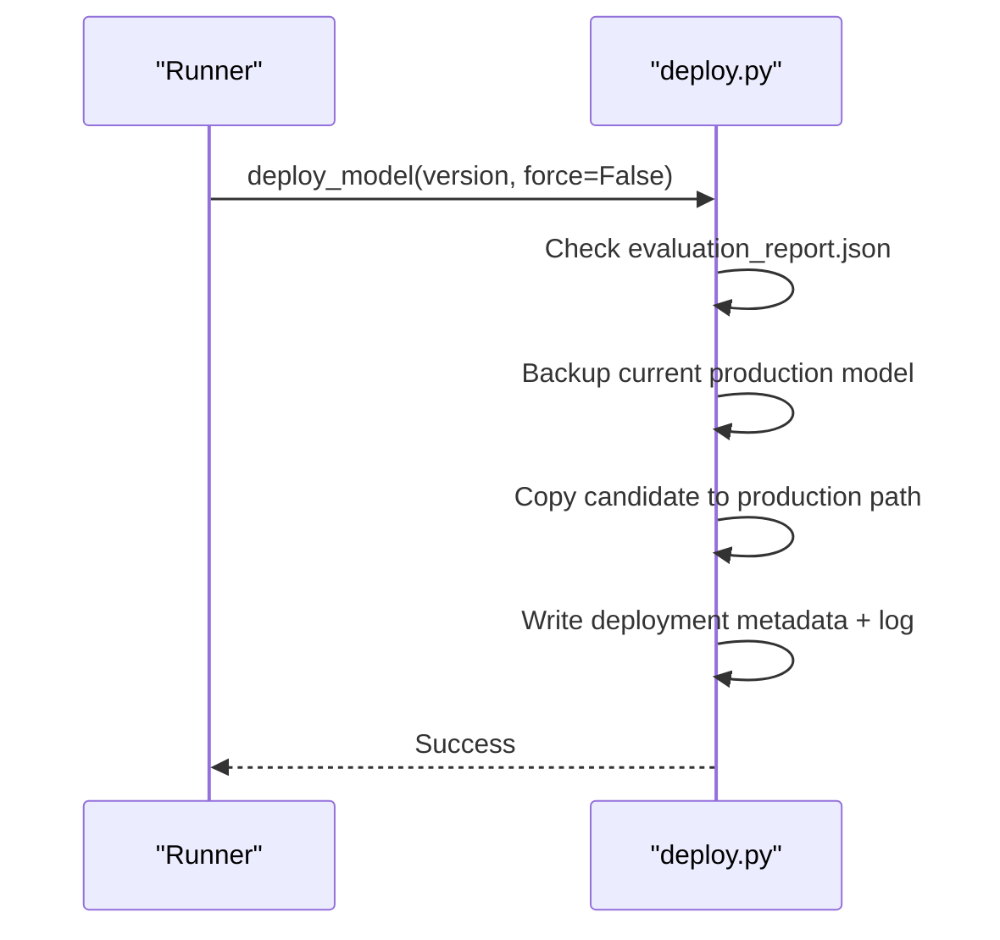
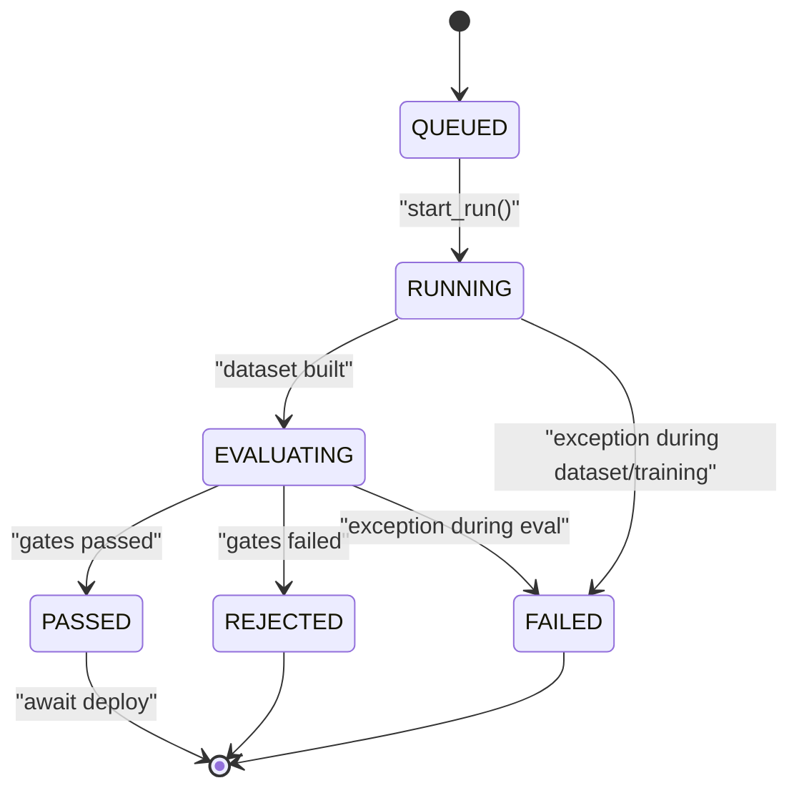
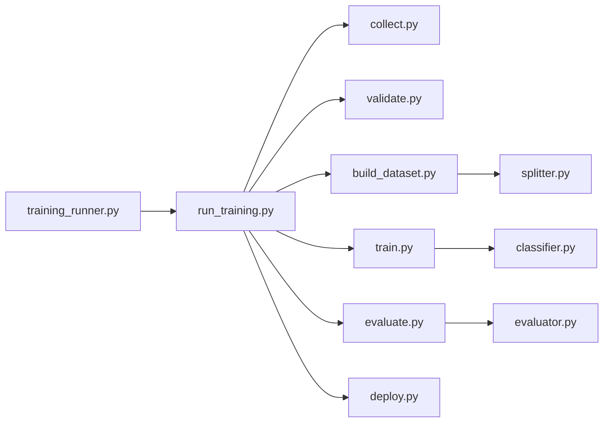

# Training Pipeline

<cite>
**Referenced Files in This Document**
- [run_training.py](file://apps/ml/pipeline/run_training.py)
- [collect.py](file://apps/ml/pipeline/collect.py)
- [validate.py](file://apps/ml/pipeline/validate.py)
- [build_dataset.py](file://apps/ml/pipeline/build_dataset.py)
- [train.py](file://apps/ml/pipeline/train.py)
- [evaluate.py](file://apps/ml/pipeline/evaluate.py)
- [deploy.py](file://apps/ml/pipeline/deploy.py)
- [training_runner.py](file://apps/ml/app/services/training_runner.py)
- [splitter.py](file://apps/ml/training/datasets/splitter.py)
- [classifier.py](file://apps/ml/training/trainers/classifier.py)
- [evaluator.py](file://apps/ml/training/evaluation/evaluator.py)
- [README.md](file://apps/ml/README.md)
</cite>

## Table of Contents
1. Introduction
2. Project Structure
3. Core Components
4. Architecture Overview
5. Detailed Component Analysis
6. Dependency Analysis
7. Performance Considerations
8. Troubleshooting Guide
9. Conclusion
10. Appendices

## Introduction
This document explains the ML training pipeline for component intelligence, covering dataset construction from authoritative sources, model training with candidate architectures and validation metrics, evaluation against quality gates, and safe deployment to production. It also documents the TrainingRunner lifecycle that manages run initiation, monitoring, and completion handling, including error classification and resource constraints. Practical examples are provided for starting runs, monitoring progress, and interpreting results. Guidance is included for extending the pipeline with new model types or strategies.

## Project Structure
The ML training system is organized around a six-stage pipeline (collect, validate, build dataset, train, evaluate, deploy) orchestrated by a single command and an operator-facing runner. Supporting utilities provide deterministic splitting, reusable evaluators, and a classifier trainer.

**Diagram sources**
- [run_training.py:29-133](file://apps/ml/pipeline/run_training.py#L29-L133)
- [training_runner.py:253-351](file://apps/ml/app/services/training_runner.py#L253-L351)
- [build_dataset.py:140-243](file://apps/ml/pipeline/build_dataset.py#L140-L243)
- [train.py:99-193](file://apps/ml/pipeline/train.py#L99-L193)
- [evaluate.py:27-245](file://apps/ml/pipeline/evaluate.py#L27-L245)
- [deploy.py:16-116](file://apps/ml/pipeline/deploy.py#L16-L116)
- [splitter.py:22-141](file://apps/ml/training/datasets/splitter.py#L22-L141)
- [classifier.py:28-224](file://apps/ml/training/trainers/classifier.py#L28-L224)
- [evaluator.py:82-275](file://apps/ml/training/evaluation/evaluator.py#L82-L275)

**Section sources**
- [README.md:92-188](file://apps/ml/README.md#L92-L188)
- [run_training.py:1-149](file://apps/ml/pipeline/run_training.py#L1-L149)

## Core Components
- Authoritative data collection with provenance and optional human feedback ingestion.
- Validation and conflict detection to quarantine ambiguous or invalid records.
- Deterministic dataset building with zero leakage via grouped splits and immutable snapshots.
- Multi-candidate training selecting a champion based on validation accuracy and top-k performance.
- Evaluation against active baseline with strict quality gates (accuracy, duplicates, latency, memory, provenance).
- Safe promotion to production with backup and rollback support.
- Operator-facing TrainingRunner that executes the pipeline in a background thread, tracks state, logs bounded step logs, classifies errors, and exposes deployment controls.

**Section sources**
- [collect.py:611-672](file://apps/ml/pipeline/collect.py#L611-L672)
- [validate.py:193-225](file://apps/ml/pipeline/validate.py#L193-L225)
- [build_dataset.py:140-243](file://apps/ml/pipeline/build_dataset.py#L140-L243)
- [train.py:99-193](file://apps/ml/pipeline/train.py#L99-L193)
- [evaluate.py:27-245](file://apps/ml/pipeline/evaluate.py#L27-L245)
- [deploy.py:16-116](file://apps/ml/pipeline/deploy.py#L16-L116)
- [training_runner.py:116-388](file://apps/ml/app/services/training_runner.py#L116-L388)

## Architecture Overview
The end-to-end flow starts with collecting authoritative records, validating them, building versioned datasets, training candidates, evaluating against quality gates, and optionally deploying. The TrainingRunner wraps this flow for operator control, ensuring only one job runs at a time, capturing bounded logs, and reporting clear statuses.

**Diagram sources**
- [training_runner.py:154-351](file://apps/ml/app/services/training_runner.py#L154-L351)
- [run_training.py:29-133](file://apps/ml/pipeline/run_training.py#L29-L133)
- [collect.py:611-672](file://apps/ml/pipeline/collect.py#L611-L672)
- [validate.py:193-225](file://apps/ml/pipeline/validate.py#L193-L225)
- [build_dataset.py:140-243](file://apps/ml/pipeline/build_dataset.py#L140-L243)
- [train.py:99-193](file://apps/ml/pipeline/train.py#L99-L193)
- [evaluate.py:27-245](file://apps/ml/pipeline/evaluate.py#L27-L245)
- [deploy.py:16-116](file://apps/ml/pipeline/deploy.py#L16-L116)

## Detailed Component Analysis

### Dataset Construction
- Source ingestion: authoritative records with full provenance; optional ingestion of human-reviewed feedback and extra catalogs.
- Validation: schema checks, taxonomy enforcement, physical sanity bounds, cross-source conflict detection; quarantines conflicting records for audit.
- Dataset building: maps supplier taxonomies to canonical categories, expands non-semantic variations, enforces zero leakage using group-based splitting by base family, generates duplicate pairs, and writes immutable snapshots with metadata.

**Diagram sources**
- [collect.py:611-672](file://apps/ml/pipeline/collect.py#L611-L672)
- [validate.py:58-191](file://apps/ml/pipeline/validate.py#L58-L191)
- [build_dataset.py:59-138](file://apps/ml/pipeline/build_dataset.py#L59-L138)
- [build_dataset.py:140-243](file://apps/ml/pipeline/build_dataset.py#L140-L243)
- [splitter.py:22-141](file://apps/ml/training/datasets/splitter.py#L22-L141)

**Section sources**
- [collect.py:611-672](file://apps/ml/pipeline/collect.py#L611-L672)
- [validate.py:193-225](file://apps/ml/pipeline/validate.py#L193-L225)
- [build_dataset.py:140-243](file://apps/ml/pipeline/build_dataset.py#L140-L243)
- [splitter.py:22-141](file://apps/ml/training/datasets/splitter.py#L22-L141)

### Model Training Workflow
- Candidate architectures: character n-grams, word n-grams, and hybrid union features, each followed by logistic regression.
- Metrics: per-candidate training/validation accuracy and top-3 accuracy; champion selected by highest validation accuracy (tie-break by top-3).
- Artifacts: champion pipeline saved to registry with metadata including sample counts, categories, and per-class report.

**Diagram sources**
- [classifier.py:28-224](file://apps/ml/training/trainers/classifier.py#L28-L224)

**Section sources**
- [train.py:54-193](file://apps/ml/pipeline/train.py#L54-L193)
- [classifier.py:41-209](file://apps/ml/training/trainers/classifier.py#L41-L209)

### Evaluation and Quality Gates
- Metrics: Top-1 and Top-3 category accuracy, manufacturer resolution accuracy, duplicate detection precision/recall, critical false merges, latency percentiles, peak memory, unverified provenance count.
- Baseline comparison: candidate must not regress more than a defined margin below the active model’s Top-1 accuracy.
- Gate thresholds: accuracy ≥ 70% and no significant regression; duplicate precision ≥ 95% with zero critical false merges; duplicate recall ≥ 95%; P95 latency ≤ 5 ms; peak memory ≤ 256 MB; zero unverified provenance.

**Diagram sources**
- [evaluate.py:27-245](file://apps/ml/pipeline/evaluate.py#L27-L245)
- [evaluator.py:91-223](file://apps/ml/training/evaluation/evaluator.py#L91-L223)

**Section sources**
- [evaluate.py:27-245](file://apps/ml/pipeline/evaluate.py#L27-L245)
- [evaluator.py:82-275](file://apps/ml/training/evaluation/evaluator.py#L82-L275)

### Deployment and Promotion
- Safety: requires evaluation report indicating eligibility unless forced; backs up current production artifact before promotion.
- Rollback: supports restoring previous artifact via backup file.
- Metadata: records checksums, timestamps, source artifacts, and deployment state.

**Diagram sources**
- [deploy.py:16-116](file://apps/ml/pipeline/deploy.py#L16-L116)
- [training_runner.py:392-453](file://apps/ml/app/services/training_runner.py#L392-L453)

**Section sources**
- [deploy.py:16-116](file://apps/ml/pipeline/deploy.py#L16-L116)
- [training_runner.py:392-453](file://apps/ml/app/services/training_runner.py#L392-L453)

### TrainingRunner Lifecycle
- Initiation: creates a unique run id, assigns a candidate version, sets initial phase to preparing dataset, and starts a daemon thread to execute the pipeline.
- Monitoring: exposes active_run, get_run, list_runs; maintains bounded logs and durations; updates phases and metrics as steps complete.
- Completion: marks run as PASSED if gates pass, REJECTED otherwise; on failure, classifies error codes by phase and records stack traces.
- Deployment: validates run state and artifact eligibility before calling deploy tool; reloads running model and reports status.

**Diagram sources**
- [training_runner.py:51-83](file://apps/ml/app/services/training_runner.py#L51-L83)
- [training_runner.py:154-351](file://apps/ml/app/services/training_runner.py#L154-L351)
- [training_runner.py:367-388](file://apps/ml/app/services/training_runner.py#L367-L388)

**Section sources**
- [training_runner.py:116-388](file://apps/ml/app/services/training_runner.py#L116-L388)

## Dependency Analysis
- Orchestrator dependencies: run_training.py imports all pipeline stages and composes their outputs into a summary report.
- Runner dependencies: training_runner.py conditionally imports pipeline modules inside execution to keep startup lightweight and isolates failures.
- Data dependencies: build_dataset.py depends on validated records and produces versioned snapshots consumed by train.py and evaluate.py.
- Model dependencies: train.py writes artifacts consumed by evaluate.py and deploy.py; evaluate.py compares against active model artifact.
- Reusable components: splitter.py provides deterministic grouping; classifier.py encapsulates candidate training; evaluator.py centralizes gate logic and reporting.

**Diagram sources**
- [run_training.py:22-27](file://apps/ml/pipeline/run_training.py#L22-L27)
- [training_runner.py:262-268](file://apps/ml/app/services/training_runner.py#L262-L268)
- [build_dataset.py:140-243](file://apps/ml/pipeline/build_dataset.py#L140-L243)
- [train.py:99-193](file://apps/ml/pipeline/train.py#L99-L193)
- [evaluate.py:27-245](file://apps/ml/pipeline/evaluate.py#L27-L245)
- [deploy.py:16-116](file://apps/ml/pipeline/deploy.py#L16-L116)
- [splitter.py:22-141](file://apps/ml/training/datasets/splitter.py#L22-L141)
- [classifier.py:28-224](file://apps/ml/training/trainers/classifier.py#L28-L224)
- [evaluator.py:82-275](file://apps/ml/training/evaluation/evaluator.py#L82-L275)

**Section sources**
- [run_training.py:29-133](file://apps/ml/pipeline/run_training.py#L29-L133)
- [training_runner.py:253-351](file://apps/ml/app/services/training_runner.py#L253-L351)

## Performance Considerations
- CPU-first design: statistical classifiers with small artifacts and low inference latency targets.
- Latency gates: P95 latency constrained to ensure sub-20ms inference characteristics.
- Memory footprint: peak memory constrained to maintain low resource usage.
- Zero leakage: group-based splits prevent overfitting and ensure reliable generalization estimates.
- Artifact size: model artifacts kept small for fast loading and minimal memory pressure.

[No sources needed since this section provides general guidance]

## Troubleshooting Guide
Common issues and resolutions:
- Missing inputs: FileNotFoundError raised when expected files (validated records, candidate models, evaluation reports) are absent. Ensure prior stages completed successfully.
- Data leakage: AssertionError triggered if group overlap detected during dataset splitting; verify base_family grouping and split logic.
- Quality gates failure: Promotion blocked if any gate fails; inspect evaluation report for specific gate status and adjust data or model accordingly.
- Deployment refusal: deploy.py rejects promotion without eligible evaluation report unless forced; use --force only for exceptional cases.
- Runner conflicts: Starting a new run while one is active raises a conflict error; wait for completion or resolve concurrency.
- Resource limits: If memory or latency gates fail, consider reducing feature complexity or optimizing preprocessing.

**Section sources**
- [build_dataset.py:181-192](file://apps/ml/pipeline/build_dataset.py#L181-L192)
- [evaluate.py:178-218](file://apps/ml/pipeline/evaluate.py#L178-L218)
- [deploy.py:38-49](file://apps/ml/pipeline/deploy.py#L38-L49)
- [training_runner.py:166-171](file://apps/ml/app/services/training_runner.py#L166-L171)
- [training_runner.py:353-365](file://apps/ml/app/services/training_runner.py#L353-L365)

## Conclusion
The pipeline provides a robust, auditable, and safe path from authoritative data to production-ready models. It emphasizes provenance, zero leakage, strict quality gates, and operator-controlled promotion. The TrainingRunner offers a controlled interface for initiating, monitoring, and deploying runs while maintaining safety boundaries and clear diagnostics.

[No sources needed since this section summarizes without analyzing specific files]

## Appendices

### Practical Examples
- Start a full training run:
  - Command: python -m apps.ml.pipeline.run_training --version 1.4.0
  - Options: --feedback-file, --extra-catalog, --no-deploy
- Run individual stages:
  - Collect: python -m apps.ml.pipeline.collect
  - Validate: python -m apps.ml.pipeline.validate
  - Build dataset: python -m apps.ml.pipeline.build_dataset --version 1.4.0
  - Train: python -m apps.ml.pipeline.train --version 1.4.0
  - Evaluate: python -m apps.ml.pipeline.evaluate --version 1.4.0
  - Deploy: python -m apps.ml.pipeline.deploy --version 1.4.0
- Monitor via TrainingRunner:
  - Start: call start_run() to queue and begin a background run
  - Query: use active_run(), get_run(), list_runs() to inspect status, phase, logs, and metrics
  - Deploy: call deploy_run(run_id) after a PASSED run to promote the candidate

**Section sources**
- [README.md:96-174](file://apps/ml/README.md#L96-L174)
- [run_training.py:135-149](file://apps/ml/pipeline/run_training.py#L135-L149)
- [training_runner.py:154-171](file://apps/ml/app/services/training_runner.py#L154-L171)
- [training_runner.py:392-453](file://apps/ml/app/services/training_runner.py#L392-L453)

### Extending the Pipeline
- New model types:
  - Implement a new trainer subclassing BaseTrainer (or follow the pattern in classifier.py), define candidate pipelines, and integrate selection logic in the training stage.
  - Add new features or preprocessors to existing pipelines while preserving reproducibility and validation.
- New training strategies:
  - Introduce additional candidate architectures in build_candidates() and update champion selection criteria if necessary.
  - Extend evaluation metrics in evaluator.py and update quality gates in evaluate.py consistently.
- New dataset sources:
  - Extend collect.py to ingest additional verified sources with proper provenance and verificationStatus.
  - Update taxonomy mapping in build_dataset.py if new categories are introduced.
- Improved splitting:
  - Use splitter.py for deterministic multi-way splits (train/val/test) with manifest generation and checksums.

**Section sources**
- [classifier.py:41-209](file://apps/ml/training/trainers/classifier.py#L41-L209)
- [evaluator.py:91-223](file://apps/ml/training/evaluation/evaluator.py#L91-L223)
- [collect.py:611-672](file://apps/ml/pipeline/collect.py#L611-L672)
- [build_dataset.py:59-138](file://apps/ml/pipeline/build_dataset.py#L59-L138)
- [splitter.py:22-141](file://apps/ml/training/datasets/splitter.py#L22-L141)