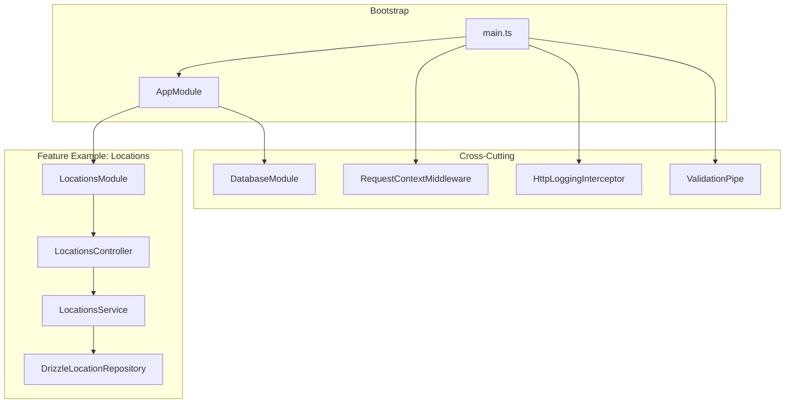
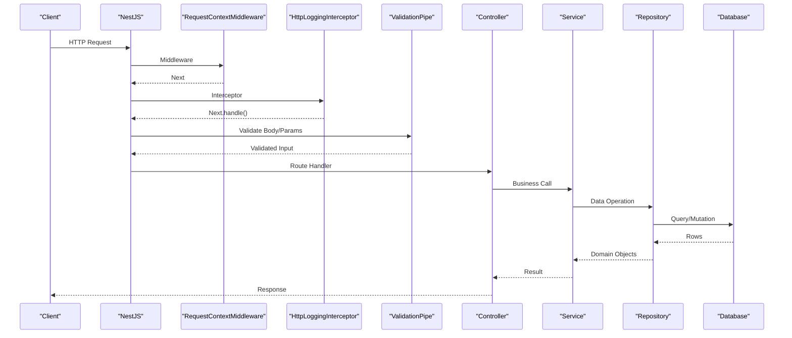
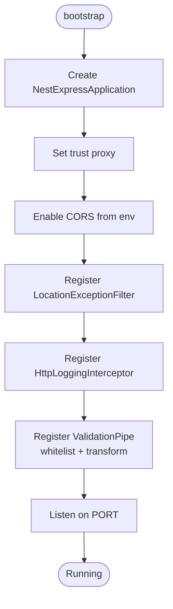
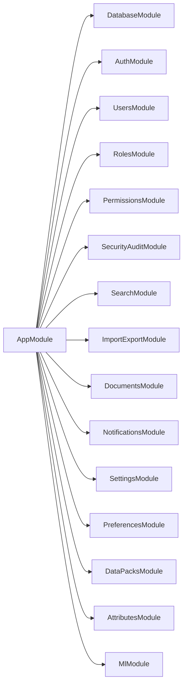
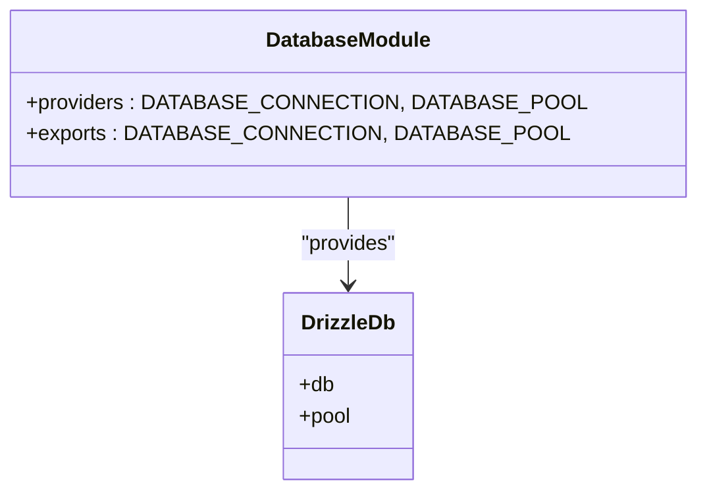
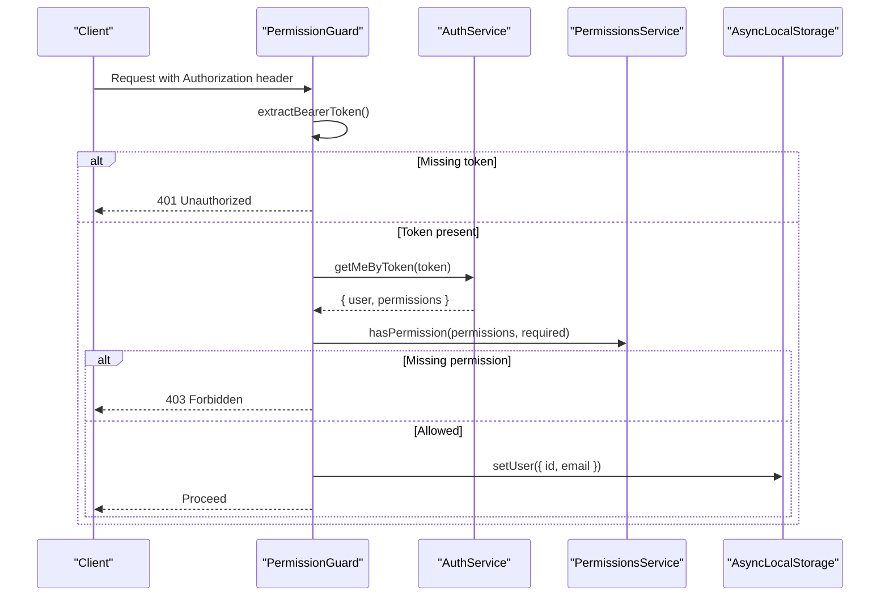
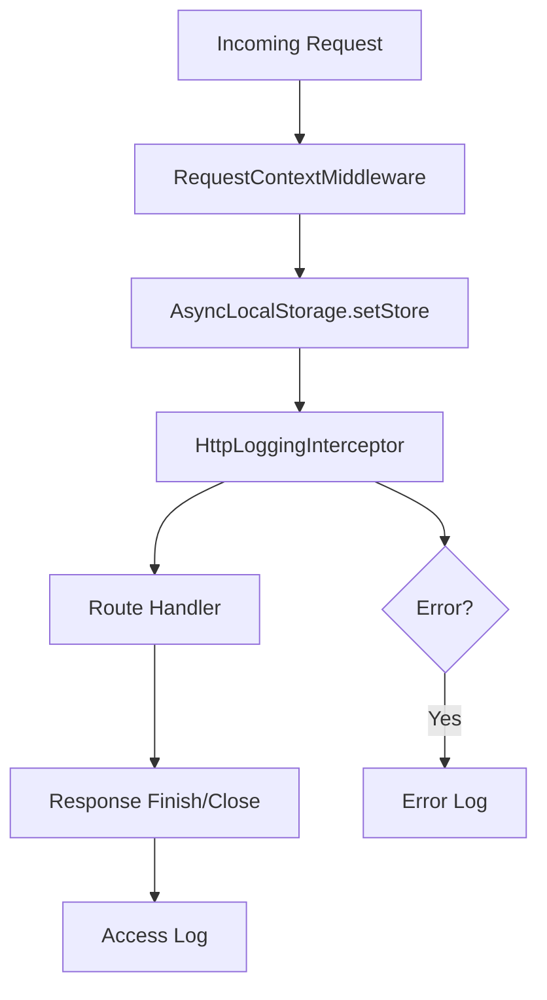
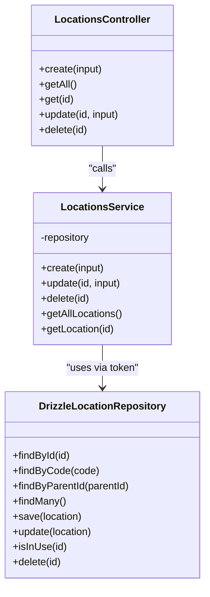
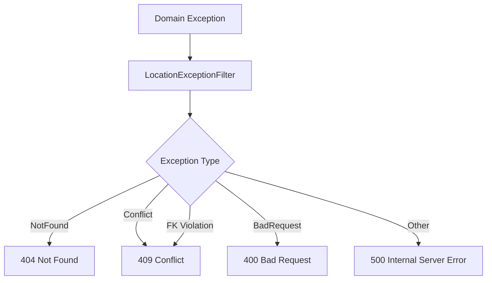
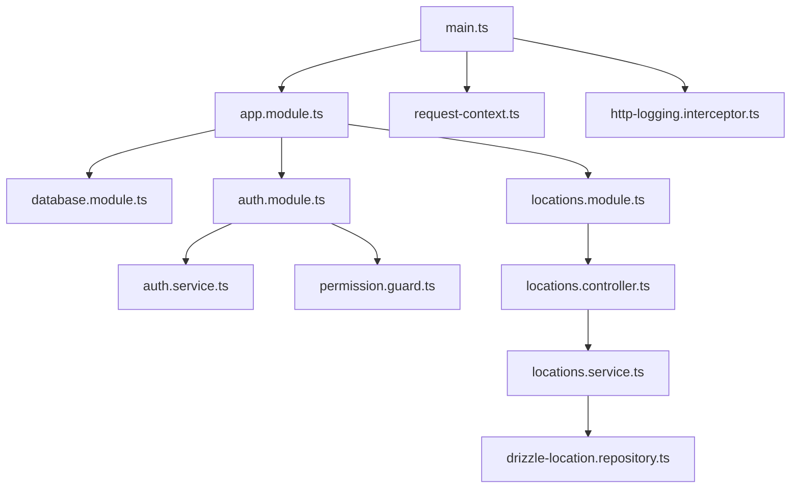

# Application Layer (NestJS API)

<cite>
**Referenced Files in This Document**
- [main.ts](file://apps/api/src/main.ts)
- [app.module.ts](file://apps/api/src/app.module.ts)
- [auth.module.ts](file://apps/api/src/auth/auth.module.ts)
- [auth.service.ts](file://apps/api/src/auth/auth.service.ts)
- [permission.guard.ts](file://apps/api/src/auth/permission.guard.ts)
- [request-context.ts](file://apps/api/src/common/context/request-context.ts)
- [http-logging.interceptor.ts](file://apps/api/src/common/logging/http-logging.interceptor.ts)
- [database.module.ts](file://apps/api/src/database/database.module.ts)
- [locations.module.ts](file://apps/api/src/locations/locations.module.ts)
- [locations.controller.ts](file://apps/api/src/locations/locations.controller.ts)
- [locations.service.ts](file://apps/api/src/locations/locations.service.ts)
- [drizzle-location.repository.ts](file://apps/api/src/infrastructure/repositories/drizzle-location.repository.ts)
- [create-location.dto.ts](file://apps/api/src/locations/create-location.dto.ts)
- [location-exception.filter.ts](file://apps/api/src/locations/location-exception.filter.ts)
</cite>

## Table of Contents
1. [Introduction](#introduction)
2. [Project Structure](#project-structure)
3. [Core Components](#core-components)
4. [Architecture Overview](#architecture-overview)
5. [Detailed Component Analysis](#detailed-component-analysis)
6. [Dependency Analysis](#dependency-analysis)
7. [Performance Considerations](#performance-considerations)
8. [Troubleshooting Guide](#troubleshooting-guide)
9. [Conclusion](#conclusion)

## Introduction
This document describes the NestJS application layer for Ananya ERP. It explains the modular architecture, dependency injection patterns, and controller-service-repository separation. It also documents authentication and authorization, request lifecycle, middleware stack, interceptors, filters, DTO validation, error handling, logging, database configuration, query patterns, security best practices, and testing strategies.

## Project Structure
The API is a NestJS monorepo application under apps/api. The root module wires domain modules, global infrastructure, and cross-cutting concerns. Each feature typically follows:
- Controller: HTTP endpoints and input binding
- Service: business orchestration
- Repository: data access abstraction over Drizzle ORM
- Module: wiring and DI tokens
- DTOs: request validation with class-validator
- Filters: domain exception mapping to HTTP responses

**Diagram sources**
- [main.ts:12-40](file://apps/api/src/main.ts#L12-L40)
- [app.module.ts:83-170](file://apps/api/src/app.module.ts#L83-L170)
- [database.module.ts:5-19](file://apps/api/src/database/database.module.ts#L5-L19)
- [locations.module.ts:7-18](file://apps/api/src/locations/locations.module.ts#L7-L18)
- [locations.controller.ts:19-52](file://apps/api/src/locations/locations.controller.ts#L19-L52)
- [locations.service.ts:14-52](file://apps/api/src/locations/locations.service.ts#L14-L52)
- [drizzle-location.repository.ts:53-207](file://apps/api/src/infrastructure/repositories/drizzle-location.repository.ts#L53-L207)

**Section sources**
- [main.ts:12-40](file://apps/api/src/main.ts#L12-L40)
- [app.module.ts:83-170](file://apps/api/src/app.module.ts#L83-L170)

## Core Components
- Bootstrap and global configuration: CORS, trust proxy, global pipes, filters, interceptors, port.
- Root module: imports all feature modules and registers a global request context middleware.
- Database module: exposes Drizzle db and pool as globally available providers.
- Authentication module: provides login/session management, password reset, session revocation, and permission utilities.
- Permission guard: factory-based guard enforcing token validation and permission checks.
- Request context: AsyncLocalStorage-backed store for per-request metadata.
- Logging interceptor: structured access/error logs with request IDs and timing.
- Feature example (Locations): demonstrates controller-service-repository pattern with DI tokens and repository implementations.

**Section sources**
- [main.ts:12-40](file://apps/api/src/main.ts#L12-L40)
- [app.module.ts:83-170](file://apps/api/src/app.module.ts#L83-L170)
- [database.module.ts:5-19](file://apps/api/src/database/database.module.ts#L5-L19)
- [auth.module.ts:12-33](file://apps/api/src/auth/auth.module.ts#L12-L33)
- [permission.guard.ts:67-150](file://apps/api/src/auth/permission.guard.ts#L67-L150)
- [request-context.ts:17-70](file://apps/api/src/common/context/request-context.ts#L17-L70)
- [http-logging.interceptor.ts:22-74](file://apps/api/src/common/logging/http-logging.interceptor.ts#L22-L74)
- [locations.module.ts:7-18](file://apps/api/src/locations/locations.module.ts#L7-L18)
- [locations.controller.ts:19-52](file://apps/api/src/locations/locations.controller.ts#L19-L52)
- [locations.service.ts:14-52](file://apps/api/src/locations/locations.service.ts#L14-L52)
- [drizzle-location.repository.ts:53-207](file://apps/api/src/infrastructure/repositories/drizzle-location.repository.ts#L53-L207)

## Architecture Overview
The API uses a layered, feature-driven architecture:
- Controllers are thin and delegate to services.
- Services encapsulate business logic and use repositories via DI tokens.
- Repositories implement domain interfaces and interact with Drizzle ORM.
- Cross-cutting concerns (auth, permissions, logging, validation, context) are applied globally or at route boundaries.

**Diagram sources**
- [main.ts:12-40](file://apps/api/src/main.ts#L12-L40)
- [app.module.ts:166-170](file://apps/api/src/app.module.ts#L166-L170)
- [locations.controller.ts:19-52](file://apps/api/src/locations/locations.controller.ts#L19-L52)
- [locations.service.ts:14-52](file://apps/api/src/locations/locations.service.ts#L14-L52)
- [drizzle-location.repository.ts:53-207](file://apps/api/src/infrastructure/repositories/drizzle-location.repository.ts#L53-L207)

## Detailed Component Analysis

### Bootstrap and Global Configuration
- Trusts upstream proxies for accurate client IP resolution.
- Configures CORS from environment; supports multiple origins.
- Registers global filter, interceptor, and validation pipe with whitelist and transform enabled.
- Starts Express server on configured port.

**Diagram sources**
- [main.ts:12-40](file://apps/api/src/main.ts#L12-L40)

**Section sources**
- [main.ts:12-40](file://apps/api/src/main.ts#L12-L40)

### Root Module and Middleware Registration
- Imports many feature modules including Auth, Users, Roles, Permissions, SecurityAudit, Search, ImportExport, Documents, Notifications, Settings, Preferences, DataPacks, Attributes, ML, and Database.
- Registers RequestContextMiddleware globally for all routes.

**Diagram sources**
- [app.module.ts:83-170](file://apps/api/src/app.module.ts#L83-L170)

**Section sources**
- [app.module.ts:83-170](file://apps/api/src/app.module.ts#L83-L170)

### Database Connection Setup
- Exposes Drizzle db connection and pool as global providers using constants.
- Available across all modules without explicit imports.

**Diagram sources**
- [database.module.ts:5-19](file://apps/api/src/database/database.module.ts#L5-L19)

**Section sources**
- [database.module.ts:5-19](file://apps/api/src/database/database.module.ts#L5-L19)

### Authentication and Authorization
- Session-based authentication using random tokens stored in userSessions.
- Login validates credentials, updates lastLoginAt, creates session, records audit events.
- Logout revokes sessions; getMeByToken validates active sessions and returns user profile plus permissions.
- Password change and reset flows with secure hashing and audit logging.
- Permission guard factory enforces Bearer token presence, session validity, user status, and required permission.

**Diagram sources**
- [permission.guard.ts:32-150](file://apps/api/src/auth/permission.guard.ts#L32-L150)
- [auth.service.ts:37-184](file://apps/api/src/auth/auth.service.ts#L37-L184)

Key behaviors:
- Only authentication-related failures map to 401; operational errors propagate as 5xx.
- Active user check ensures disabled users cannot proceed.
- User identity is attached to the request and persisted into AsyncLocalStorage for downstream components.

**Section sources**
- [auth.service.ts:37-184](file://apps/api/src/auth/auth.service.ts#L37-L184)
- [permission.guard.ts:67-150](file://apps/api/src/auth/permission.guard.ts#L67-L150)

### Request Context and Logging
- RequestContextMiddleware captures client IP, user agent, request ID, and authenticated user info, then runs the rest of the pipeline within an AsyncLocalStorage context.
- HttpLoggingInterceptor adds X-Request-Id, logs access and error events, and measures duration.

**Diagram sources**
- [request-context.ts:48-70](file://apps/api/src/common/context/request-context.ts#L48-L70)
- [http-logging.interceptor.ts:30-74](file://apps/api/src/common/logging/http-logging.interceptor.ts#L30-L74)

**Section sources**
- [request-context.ts:17-70](file://apps/api/src/common/context/request-context.ts#L17-L70)
- [http-logging.interceptor.ts:22-151](file://apps/api/src/common/logging/http-logging.interceptor.ts#L22-L151)

### Controller-Service-Repository Pattern (Locations Example)
- Controller defines REST endpoints and delegates to service.
- Service composes domain operations and uses repository via DI token.
- Repository implements domain interface and maps between rows and domain objects.

**Diagram sources**
- [locations.controller.ts:19-52](file://apps/api/src/locations/locations.controller.ts#L19-L52)
- [locations.service.ts:14-52](file://apps/api/src/locations/locations.service.ts#L14-L52)
- [drizzle-location.repository.ts:53-207](file://apps/api/src/infrastructure/repositories/drizzle-location.repository.ts#L53-L207)

**Section sources**
- [locations.module.ts:7-18](file://apps/api/src/locations/locations.module.ts#L7-L18)
- [locations.controller.ts:19-52](file://apps/api/src/locations/locations.controller.ts#L19-L52)
- [locations.service.ts:14-52](file://apps/api/src/locations/locations.service.ts#L14-L52)
- [drizzle-location.repository.ts:53-207](file://apps/api/src/infrastructure/repositories/drizzle-location.repository.ts#L53-L207)

### DTO Validation
- Uses class-validator decorators to enforce shape and constraints.
- Global ValidationPipe whitelists fields, forbids non-whitelisted properties, and transforms payloads.

Example path:
- [create-location.dto.ts:1-33](file://apps/api/src/locations/create-location.dto.ts#L1-L33)

**Section sources**
- [main.ts:30-36](file://apps/api/src/main.ts#L30-L36)
- [create-location.dto.ts:1-33](file://apps/api/src/locations/create-location.dto.ts#L1-L33)

### Error Handling Strategy
- Domain-specific exceptions are mapped to appropriate HTTP statuses by feature-level exception filters.
- PostgreSQL foreign key violations are converted to domain errors and surfaced as conflicts.
- Global logging interceptor captures error details and durations.

**Diagram sources**
- [location-exception.filter.ts:23-77](file://apps/api/src/locations/location-exception.filter.ts#L23-L77)
- [drizzle-location.repository.ts:197-206](file://apps/api/src/infrastructure/repositories/drizzle-location.repository.ts#L197-L206)

**Section sources**
- [location-exception.filter.ts:23-77](file://apps/api/src/locations/location-exception.filter.ts#L23-L77)
- [drizzle-location.repository.ts:197-206](file://apps/api/src/infrastructure/repositories/drizzle-location.repository.ts#L197-L206)

### Database Queries and Optimization Patterns
- Repositories perform targeted selects with ordering and limit clauses.
- Bulk reads map rows to domain aggregates.
- Delete operations handle foreign key constraint violations and convert them to domain errors.
- Use of Drizzle’s eq/or helpers for readable queries.

Optimization notes:
- Prefer indexed columns in where clauses (e.g., id, code).
- Limit result sets where possible.
- Avoid N+1 by batching lookups when feasible.

**Section sources**
- [drizzle-location.repository.ts:53-207](file://apps/api/src/infrastructure/repositories/drizzle-location.repository.ts#L53-L207)

### API Versioning, Rate Limiting, CORS, and Security Best Practices
- API versioning: No explicit versioning strategy is implemented in the analyzed files.
- Rate limiting: Not configured in the analyzed bootstrap; consider adding express-rate-limit if needed.
- CORS: Enabled with configurable origins from environment; credentials allowed.
- Security best practices observed:
  - Session tokens are random and time-bound.
  - Audit logging for sensitive actions.
  - Strict DTO validation and whitelist enforcement.
  - Structured logging with request correlation IDs.

**Section sources**
- [main.ts:18-26](file://apps/api/src/main.ts#L18-L26)
- [auth.service.ts:85-138](file://apps/api/src/auth/auth.service.ts#L85-L138)
- [http-logging.interceptor.ts:30-74](file://apps/api/src/common/logging/http-logging.interceptor.ts#L30-L74)

### Testing Strategies
- Unit tests for services and guards exist (e.g., auth.service.spec.ts, component-write.guard.spec.ts).
- Integration tests are organized under apps/api/test/integration.
- Recommended approach:
  - Mock repositories and external dependencies in unit tests.
  - Use Nest TestingModule to test controllers and services in isolation.
  - For integration tests, spin up a test database and seed fixtures.
  - Assert HTTP status codes, response shapes, and audit log entries.

**Section sources**
- [auth.service.spec.ts](file://apps/api/src/auth/auth.service.spec.ts)
- [component-write.guard.spec.ts](file://apps/api/src/auth/component-write.guard.spec.ts)
- [apps/api/test/integration](file://apps/api/test/integration)

## Dependency Analysis
High-level relationships among core modules and components:

**Diagram sources**
- [main.ts:12-40](file://apps/api/src/main.ts#L12-L40)
- [app.module.ts:83-170](file://apps/api/src/app.module.ts#L83-L170)
- [database.module.ts:5-19](file://apps/api/src/database/database.module.ts#L5-L19)
- [auth.module.ts:12-33](file://apps/api/src/auth/auth.module.ts#L12-L33)
- [auth.service.ts:37-184](file://apps/api/src/auth/auth.service.ts#L37-L184)
- [permission.guard.ts:67-150](file://apps/api/src/auth/permission.guard.ts#L67-L150)
- [locations.module.ts:7-18](file://apps/api/src/locations/locations.module.ts#L7-L18)
- [locations.controller.ts:19-52](file://apps/api/src/locations/locations.controller.ts#L19-L52)
- [locations.service.ts:14-52](file://apps/api/src/locations/locations.service.ts#L14-L52)
- [drizzle-location.repository.ts:53-207](file://apps/api/src/infrastructure/repositories/drizzle-location.repository.ts#L53-L207)

**Section sources**
- [app.module.ts:83-170](file://apps/api/src/app.module.ts#L83-L170)

## Performance Considerations
- Use global pipes and interceptors judiciously; they run on every request.
- Keep DTO validations minimal and focused to reduce overhead.
- Prefer specific column selection and limit clauses in repositories.
- Leverage AsyncLocalStorage for request-scoped data without passing it through call stacks.
- Monitor access logs for slow endpoints and optimize hot paths.

## Troubleshooting Guide
Common issues and resolutions:
- 401 Unauthorized during guarded routes:
  - Ensure Authorization header contains a valid Bearer token.
  - Verify session is not expired or revoked.
- 403 Forbidden:
  - Check that the authenticated user holds the required permission.
- 404 Not Found:
  - Confirm resource exists before mutation.
- 409 Conflict:
  - Indicates domain conflict such as duplicate code or foreign key violation.
- Logging gaps:
  - Confirm HTTP_ACCESS_LOGGING and HTTP_ERROR_LOGGING are not set to false.
  - Inspect X-Request-Id in requests and logs for correlation.

**Section sources**
- [permission.guard.ts:78-150](file://apps/api/src/auth/permission.guard.ts#L78-L150)
- [location-exception.filter.ts:23-77](file://apps/api/src/locations/location-exception.filter.ts#L23-L77)
- [http-logging.interceptor.ts:25-28](file://apps/api/src/common/logging/http-logging.interceptor.ts#L25-L28)

## Conclusion
Ananya’s NestJS application layer follows a clear, modular design with strong separation of concerns. Controllers remain thin, services encapsulate business logic, and repositories abstract data access. Authentication relies on session tokens with robust auditing, while permission guards provide fine-grained authorization. Global middleware, interceptors, and filters standardize logging, validation, and error handling. The database layer uses Drizzle with typed queries and domain-aware repository implementations. Security and observability are prioritized through CORS configuration, structured logging, and audit trails. Testing is supported by unit and integration suites, and performance can be further improved with careful query design and selective middleware usage.