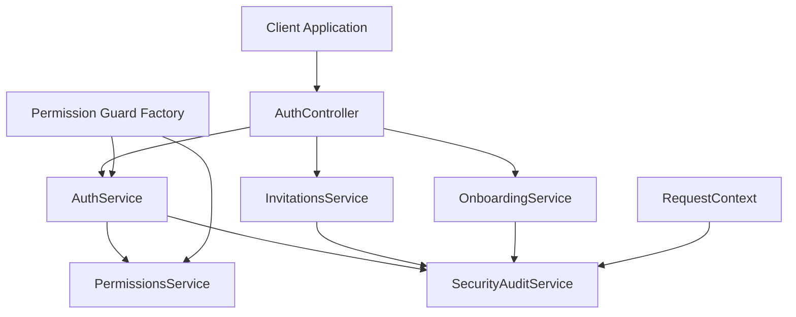
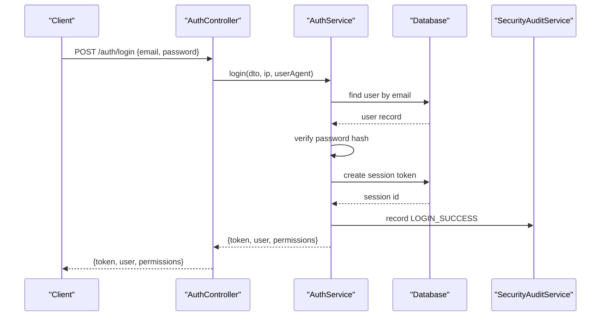
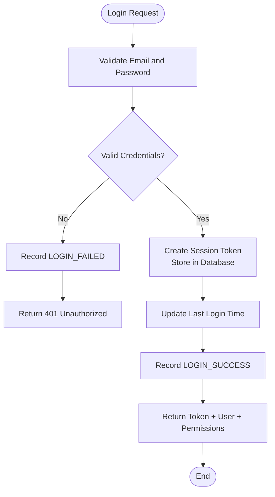
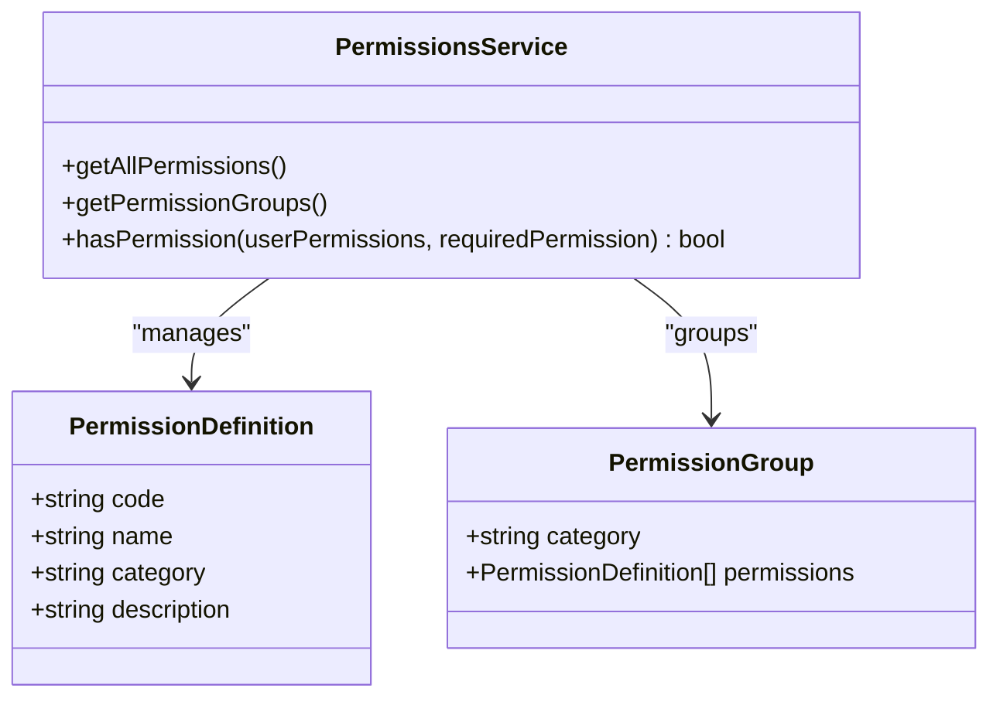
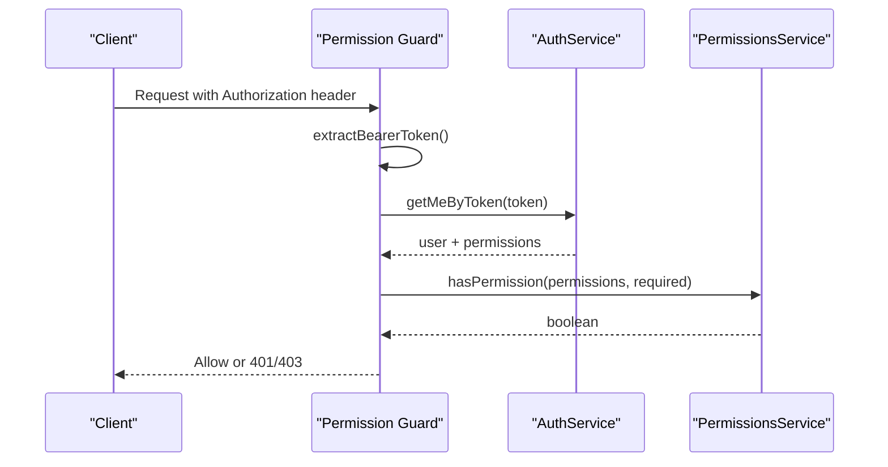
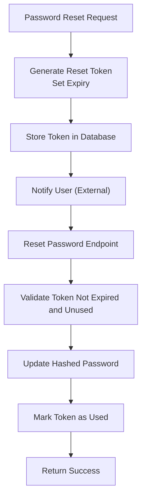
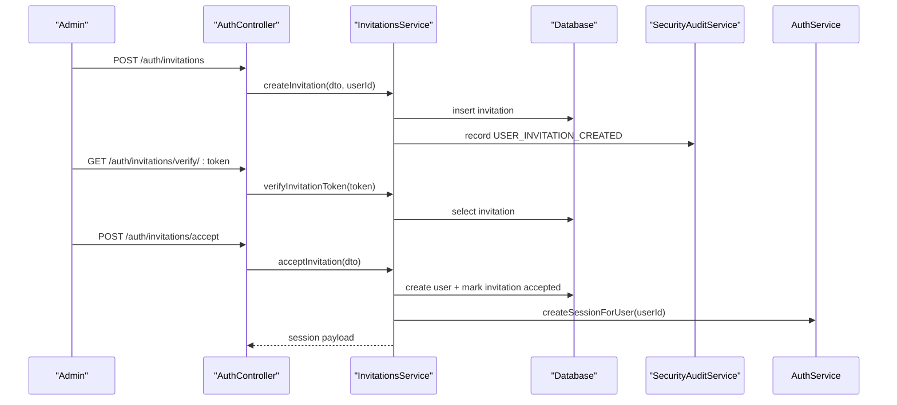
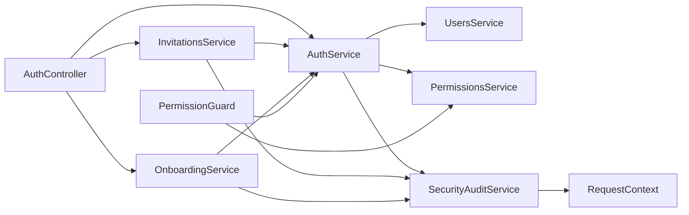

# Authentication & Authorization

<cite>
**Referenced Files in This Document**
- [auth.controller.ts](file://apps/api/src/auth/auth.controller.ts)
- [auth.service.ts](file://apps/api/src/auth/auth.service.ts)
- [dtos.ts](file://apps/api/src/auth/dtos.ts)
- [invitations.service.ts](file://apps/api/src/auth/invitations.service.ts)
- [onboarding.service.ts](file://apps/api/src/auth/onboarding.service.ts)
- [permission.guard.ts](file://apps/api/src/auth/permission.guard.ts)
- [component-write.guard.ts](file://apps/api/src/auth/component-write.guard.ts)
- [permissions.service.ts](file://apps/api/src/permissions/permissions.service.ts)
- [security-audit.service.ts](file://apps/api/src/security-audit/security-audit.service.ts)
- [request-context.ts](file://apps/api/src/common/context/request-context.ts)
- [AUTHENTICATION.md](file://docs/AUTHENTICATION.md)
</cite>

## Table of Contents
1. [Introduction](#introduction)
2. [Project Structure](#project-structure)
3. [Core Components](#core-components)
4. [Architecture Overview](#architecture-overview)
5. [Detailed Component Analysis](#detailed-component-analysis)
6. [Dependency Analysis](#dependency-analysis)
7. [Performance Considerations](#performance-considerations)
8. [Troubleshooting Guide](#troubleshooting-guide)
9. [Conclusion](#conclusion)
10. [Appendices](#appendices)

## Introduction
This document explains Ananya ERP’s authentication and authorization system as implemented in the API layer. It covers:
- Session-based authentication using server-side session tokens
- Role-based access control (RBAC) with permission codes and guards
- User registration, login, password change, and password reset flows
- Invitation-based onboarding for joining existing organizations
- Security audit logging and request context propagation
- Guidance for implementing custom guards, protecting routes, and checking permissions
- Current limitations regarding JWT, multi-tenant isolation, API keys, and OAuth

The implementation uses a session token stored in the database rather than stateless JWTs. Guards validate sessions and enforce permissions through a centralized permissions service.

## Project Structure
Authentication-related code is primarily located under `apps/api/src/auth`, with supporting services for permissions, security auditing, and request context. The documentation also references the high-level authentication design in `docs/AUTHENTICATION.md`.

**Diagram sources**
- [auth.controller.ts:26-113](file://apps/api/src/auth/auth.controller.ts#L26-L113)
- [auth.service.ts:29-332](file://apps/api/src/auth/auth.service.ts#L29-L332)
- [invitations.service.ts:20-139](file://apps/api/src/auth/invitations.service.ts#L20-L139)
- [onboarding.service.ts:26-181](file://apps/api/src/auth/onboarding.service.ts#L26-L181)
- [permission.guard.ts:67-150](file://apps/api/src/auth/permission.guard.ts#L67-L150)
- [permissions.service.ts:214-247](file://apps/api/src/permissions/permissions.service.ts#L214-L247)
- [security-audit.service.ts:16-56](file://apps/api/src/security-audit/security-audit.service.ts#L16-L56)
- [request-context.ts:17-70](file://apps/api/src/common/context/request-context.ts#L17-L70)

**Section sources**
- [auth.controller.ts:26-113](file://apps/api/src/auth/auth.controller.ts#L26-L113)
- [AUTHENTICATION.md:1-65](file://docs/AUTHENTICATION.md#L1-L65)

## Core Components
- **AuthController**: Exposes HTTP endpoints for login, logout, profile retrieval, password management, invitations, and organization setup.
- **AuthService**: Implements session creation, validation, revocation, password hashing, password reset token handling, and user session management.
- **InvitationsService**: Manages invitation creation, verification, acceptance, and automatic session creation after acceptance.
- **OnboardingService**: Handles initial organization setup, root admin user creation, and bootstrapping system settings.
- **Permission Guard Factory**: Provides reusable guards that authenticate via session token and enforce RBAC permissions.
- **PermissionsService**: Defines permission codes, groups, system role mappings, and permission evaluation logic.
- **SecurityAuditService**: Records security-relevant events such as login attempts, password changes, and session revocations.
- **RequestContext**: Propagates client IP, user identity, and request ID across the request lifecycle using async local storage.

**Section sources**
- [auth.controller.ts:26-113](file://apps/api/src/auth/auth.controller.ts#L26-L113)
- [auth.service.ts:29-332](file://apps/api/src/auth/auth.service.ts#L29-L332)
- [invitations.service.ts:20-139](file://apps/api/src/auth/invitations.service.ts#L20-L139)
- [onboarding.service.ts:26-181](file://apps/api/src/auth/onboarding.service.ts#L26-L181)
- [permission.guard.ts:67-150](file://apps/api/src/auth/permission.guard.ts#L67-L150)
- [permissions.service.ts:15-247](file://apps/api/src/permissions/permissions.service.ts#L15-L247)
- [security-audit.service.ts:16-56](file://apps/api/src/security-audit/security-audit.service.ts#L16-L56)
- [request-context.ts:17-70](file://apps/api/src/common/context/request-context.ts#L17-L70)

## Architecture Overview
Ananya ERP uses a session-based authentication model:
- Clients send credentials to `/auth/login`.
- The server validates credentials, creates a session token, stores it in the database, and returns the token along with user data and permissions.
- Protected endpoints require an `Authorization: Bearer <token>` header.
- Guards or controllers call `AuthService.getMeByToken` to validate sessions and retrieve user context.
- RBAC checks are performed by `PermissionsService.hasPermission` against the user’s permission list.

**Diagram sources**
- [auth.controller.ts:34-39](file://apps/api/src/auth/auth.controller.ts#L34-L39)
- [auth.service.ts:37-137](file://apps/api/src/auth/auth.service.ts#L37-L137)
- [security-audit.service.ts:18-35](file://apps/api/src/security-audit/security-audit.service.ts#L18-L35)

## Detailed Component Analysis

### Session-Based Authentication Flow
The authentication flow does not use JWT. Instead, it generates a random session token and persists it in the database. Login validates the user’s email and password, updates last login time, creates a session, and records a successful login event. Logout marks the session as revoked. Profile retrieval (`GET /auth/me`) validates the session and returns user details plus permissions.

Key behaviors:
- Passwords are hashed before comparison.
- Sessions have expiration times based on the “remember me” option.
- Revoked or expired sessions are rejected.
- All security-sensitive actions are logged.

**Diagram sources**
- [auth.service.ts:37-137](file://apps/api/src/auth/auth.service.ts#L37-L137)
- [security-audit.service.ts:18-35](file://apps/api/src/security-audit/security-audit.service.ts#L18-L35)

**Section sources**
- [auth.controller.ts:34-51](file://apps/api/src/auth/auth.controller.ts#L34-L51)
- [auth.service.ts:37-184](file://apps/api/src/auth/auth.service.ts#L37-L184)

### Token Generation, Validation, and Refresh Mechanisms
- **Generation**: A cryptographically random token is generated per session and stored with metadata including IP address, user agent, device info, and expiry.
- **Validation**: `getMeByToken` looks up the session, ensures it is not revoked, and checks expiry. If valid, it returns the user profile and permissions.
- **Refresh**: There is no explicit refresh endpoint. To extend session lifetime, clients should re-authenticate or rely on the “remember me” flag during login.

Important notes:
- Tokens are opaque server-side identifiers, not JWTs.
- No cryptographic signature or payload decoding occurs.
- Session revocation is supported for single sessions and bulk revocation of other sessions.

**Section sources**
- [auth.service.ts:85-137](file://apps/api/src/auth/auth.service.ts#L85-L137)
- [auth.service.ts:164-184](file://apps/api/src/auth/auth.service.ts#L164-L184)
- [auth.service.ts:295-331](file://apps/api/src/auth/auth.service.ts#L295-L331)

### Role-Based Access Control (RBAC)
RBAC is implemented through permission codes and a permissions service:
- Permission definitions include domain-scoped codes like `Inventory.Read`, `Inventory.Update`, etc.
- System roles map to sets of permissions; the Administrator role has wildcard access.
- Guards check whether the authenticated user holds the required permission.

**Diagram sources**
- [permissions.service.ts:15-247](file://apps/api/src/permissions/permissions.service.ts#L15-L247)

**Section sources**
- [permissions.service.ts:15-247](file://apps/api/src/permissions/permissions.service.ts#L15-L247)

### Permission Guards and Route Protection
The repository provides a factory function to create permission guards:
- `createPermissionGuard(permission, subject)` builds a NestJS guard that:
  - Extracts the bearer token from the request
  - Validates the session via `AuthService.getMeByToken`
  - Ensures the user is active
  - Checks the required permission via `PermissionsService.hasPermission`
  - Populates `request.user` and request context
- A concrete guard `ComponentWriteGuard` enforces `Inventory.Update` for component write operations.

Usage patterns:
- Apply guards at the controller or method level to protect routes.
- Use the guard’s populated `request.user` in controllers/services instead of parsing headers manually.

**Diagram sources**
- [permission.guard.ts:67-150](file://apps/api/src/auth/permission.guard.ts#L67-L150)
- [component-write.guard.ts:30-33](file://apps/api/src/auth/component-write.guard.ts#L30-L33)

**Section sources**
- [permission.guard.ts:14-150](file://apps/api/src/auth/permission.guard.ts#L14-L150)
- [component-write.guard.ts:8-33](file://apps/api/src/auth/component-write.guard.ts#L8-L33)

### User Registration, Login, Password Reset, and Session Management
- **Registration**: New users can be created via invitation acceptance or organization bootstrap. Passwords are hashed before storage.
- **Login**: Validates credentials, creates a session, and returns token and permissions.
- **Password Change**: Requires current password verification and updates the hashed password.
- **Password Reset**: Generates a one-time token with expiry; resetting marks the token as used.
- **Session Management**: Supports listing active sessions, revoking individual sessions, and revoking all other sessions.

**Diagram sources**
- [auth.service.ts:219-284](file://apps/api/src/auth/auth.service.ts#L219-L284)

**Section sources**
- [auth.controller.ts:53-71](file://apps/api/src/auth/auth.controller.ts#L53-L71)
- [auth.service.ts:186-284](file://apps/api/src/auth/auth.service.ts#L186-L284)
- [auth.service.ts:286-331](file://apps/api/src/auth/auth.service.ts#L286-L331)

### Invitation-Based Onboarding
Invitations allow adding users to existing organizations:
- Creation requires an email and optional role/department.
- Verification ensures the invitation is pending and not expired.
- Acceptance creates the user account, marks the invitation accepted, logs activity, and creates a session.

**Diagram sources**
- [auth.controller.ts:73-97](file://apps/api/src/auth/auth.controller.ts#L73-L97)
- [invitations.service.ts:29-139](file://apps/api/src/auth/invitations.service.ts#L29-L139)

**Section sources**
- [invitations.service.ts:29-139](file://apps/api/src/auth/invitations.service.ts#L29-L139)

### Organization Bootstrap and Multi-Tenant Context
Organization bootstrap creates the first admin user and initializes organizational settings. The documentation describes a multi-tenant membership model where users are mapped to organizations via memberships. However, the current API implementation focuses on single-organization bootstrap and does not show tenant-scoped queries or middleware in the referenced files.

Key points:
- Bootstrap creates an admin user and sets organization profile and system settings.
- The design document outlines organization membership and switching active organizations without re-authentication.
- The current auth flow does not explicitly bind sessions to an organization scope in the analyzed files.

**Section sources**
- [onboarding.service.ts:54-181](file://apps/api/src/auth/onboarding.service.ts#L54-L181)
- [AUTHENTICATION.md:45-57](file://docs/AUTHENTICATION.md#L45-L57)

### Security Audit Logging
All critical security events are recorded through `SecurityAuditService`:
- Login success/failure
- Account disabled login attempts
- Password changes and resets
- Session revocations
- Invitation creation and acceptance

The service resolves user context from `RequestContext` when available and persists structured audit entries.

**Section sources**
- [security-audit.service.ts:16-56](file://apps/api/src/security-audit/security-audit.service.ts#L16-L56)
- [auth.service.ts:37-137](file://apps/api/src/auth/auth.service.ts#L37-L137)
- [invitations.service.ts:59-67](file://apps/api/src/auth/invitations.service.ts#L59-L67)

### Request Context Propagation
`RequestContext` uses Node.js `AsyncLocalStorage` to propagate:
- Client IP address
- User agent
- Request ID
- Authenticated user ID and email

Guards set the user context, and audit logging consumes it to attribute actions.

**Section sources**
- [request-context.ts:17-70](file://apps/api/src/common/context/request-context.ts#L17-L70)
- [permission.guard.ts:130-138](file://apps/api/src/auth/permission.guard.ts#L130-L138)

## Dependency Analysis
The authentication subsystem depends on:
- Database schema entities for users, sessions, password reset tokens, and audit logs
- Users service for user lookup
- Permissions service for RBAC evaluation
- Security audit service for logging
- Request context for cross-cutting concerns

**Diagram sources**
- [auth.controller.ts:26-113](file://apps/api/src/auth/auth.controller.ts#L26-L113)
- [auth.service.ts:29-332](file://apps/api/src/auth/auth.service.ts#L29-L332)
- [invitations.service.ts:20-139](file://apps/api/src/auth/invitations.service.ts#L20-L139)
- [onboarding.service.ts:26-181](file://apps/api/src/auth/onboarding.service.ts#L26-L181)
- [permission.guard.ts:67-150](file://apps/api/src/auth/permission.guard.ts#L67-L150)
- [security-audit.service.ts:16-56](file://apps/api/src/security-audit/security-audit.service.ts#L16-L56)
- [request-context.ts:17-70](file://apps/api/src/common/context/request-context.ts#L17-L70)

**Section sources**
- [auth.controller.ts:26-113](file://apps/api/src/auth/auth.controller.ts#L26-L113)
- [auth.service.ts:29-332](file://apps/api/src/auth/auth.service.ts#L29-L332)
- [invitations.service.ts:20-139](file://apps/api/src/auth/invitations.service.ts#L20-L139)
- [onboarding.service.ts:26-181](file://apps/api/src/auth/onboarding.service.ts#L26-L181)
- [permission.guard.ts:67-150](file://apps/api/src/auth/permission.guard.ts#L67-L150)
- [security-audit.service.ts:16-56](file://apps/api/src/security-audit/security-audit.service.ts#L16-L56)
- [request-context.ts:17-70](file://apps/api/src/common/context/request-context.ts#L17-L70)

## Performance Considerations
- Session lookups occur on every protected request; ensure database indexes exist on session tokens and user IDs.
- Avoid heavy computations inside guards; keep guard logic minimal and delegate to services.
- Batch session revocations carefully to avoid N+1 queries; the current loop revokes sessions individually.
- Audit logging is synchronous; consider asynchronous processing if audit volume becomes high.

[No sources needed since this section provides general guidance]

## Troubleshooting Guide
Common issues and resolutions:
- **Invalid or expired session**: Ensure the client sends a valid bearer token and that the session has not been revoked or expired.
- **Missing permission**: Verify the user’s permission list includes the required permission code or wildcard.
- **Infrastructure errors surfaced as 401**: Guards intentionally do not mask operational failures; investigate underlying database or service errors.
- **Password reset token invalid/expired**: Confirm the token was generated recently and not already used.
- **Disabled account login blocked**: Disabled accounts cannot log in; enable the account or contact an administrator.

**Section sources**
- [permission.guard.ts:78-140](file://apps/api/src/auth/permission.guard.ts#L78-L140)
- [auth.service.ts:164-184](file://apps/api/src/auth/auth.service.ts#L164-L184)
- [auth.service.ts:246-284](file://apps/api/src/auth/auth.service.ts#L246-L284)

## Conclusion
Ananya ERP’s authentication system relies on server-side session tokens rather than JWTs. Authorization is enforced through RBAC with permission codes evaluated by a central permissions service. Guards provide reusable protection for routes, and security audit logging captures key events. While the documentation outlines multi-tenant membership concepts, the current API implementation focuses on single-organization bootstrap and does not demonstrate tenant-scoped authentication in the analyzed files. For advanced needs such as JWT, API keys, or OAuth, additional modules would need to be implemented following the established patterns.

[No sources needed since this section summarizes without analyzing specific files]

## Appendices

### Implementing Custom Guards
To protect a route requiring a specific permission:
- Import `createPermissionGuard` from the permission guard module.
- Define a guard bound to the required permission code and a human-readable subject.
- Apply the guard at the controller or method level.

Example pattern:
- `const MyFeatureGuard = createPermissionGuard('MyFeature.Write', 'write my feature data');`
- Decorate controller methods with `@UseGuards(MyFeatureGuard)`.

**Section sources**
- [permission.guard.ts:67-150](file://apps/api/src/auth/permission.guard.ts#L67-L150)
- [component-write.guard.ts:30-33](file://apps/api/src/auth/component-write.guard.ts#L30-L33)

### Checking Permissions in Controllers and Services
- Controllers receive `request.user` populated by guards, containing user identity and permissions.
- Services can receive the user’s permission list as a parameter or resolve it from context.
- Use `PermissionsService.hasPermission` for consistent evaluation, including wildcard support.

**Section sources**
- [permission.guard.ts:130-138](file://apps/api/src/auth/permission.guard.ts#L130-L138)
- [permissions.service.ts:235-247](file://apps/api/src/permissions/permissions.service.ts#L235-L247)

### Security Policies and Account Lockout
Current implementation:
- Passwords are hashed before storage.
- Login attempts are audited but there is no explicit lockout mechanism in the analyzed files.
- Disabled accounts are blocked from logging in.

Recommendations:
- Add rate limiting for login attempts.
- Implement configurable account lockout thresholds.
- Enforce password complexity policies at the DTO/validation layer.

**Section sources**
- [auth.service.ts:37-83](file://apps/api/src/auth/auth.service.ts#L37-L83)
- [auth.service.ts:186-217](file://apps/api/src/auth/auth.service.ts#L186-L217)

### JWT, Multi-Tenant Authentication, API Keys, and OAuth
- **JWT**: Not implemented; the system uses server-side session tokens.
- **Multi-Tenant**: Documentation describes organization membership, but the current auth flow does not bind sessions to tenants in the analyzed files.
- **API Keys**: Not present in the analyzed authentication files.
- **OAuth**: Not present in the analyzed authentication files.

If extending the system:
- Introduce a separate strategy for API keys and OAuth providers.
- Add tenant scoping to session validation and permission evaluation.
- Maintain backward compatibility with existing session-based flows.

**Section sources**
- [AUTHENTICATION.md:45-65](file://docs/AUTHENTICATION.md#L45-L65)