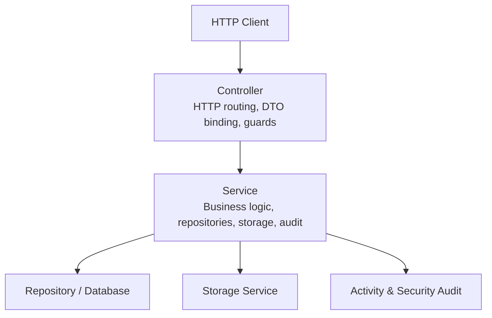
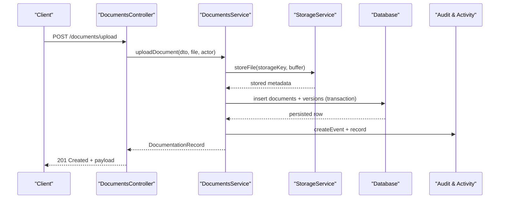
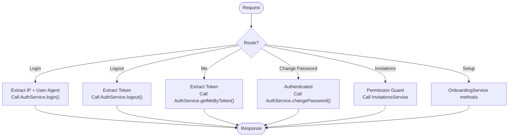
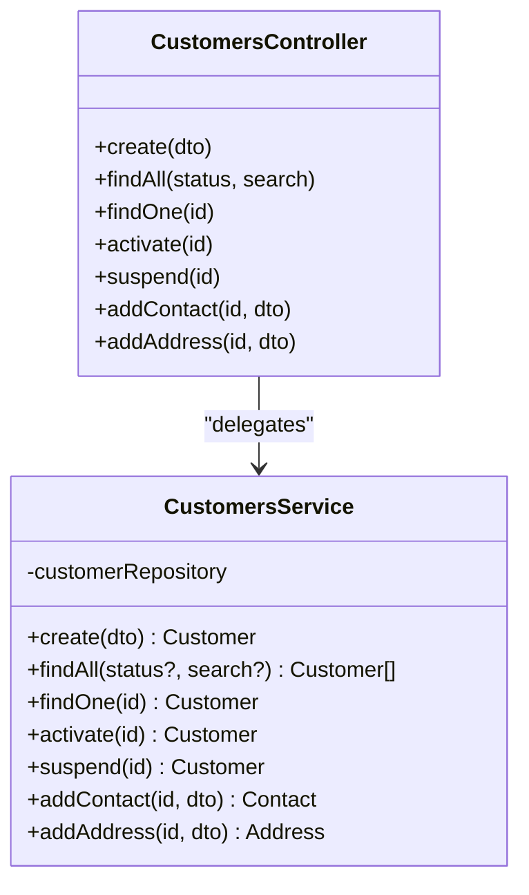
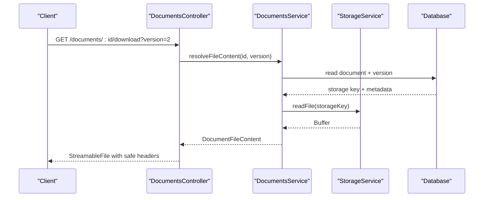
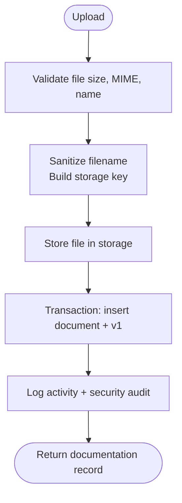
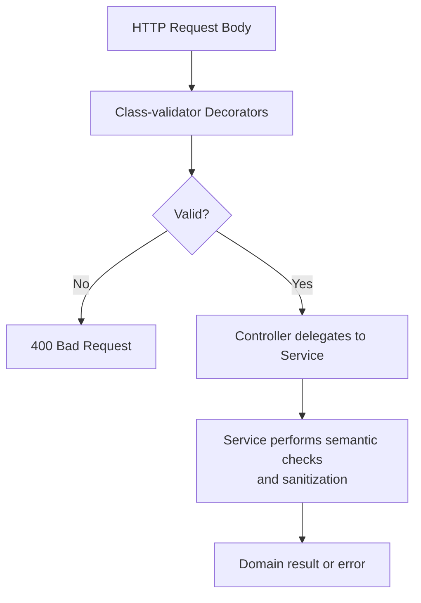
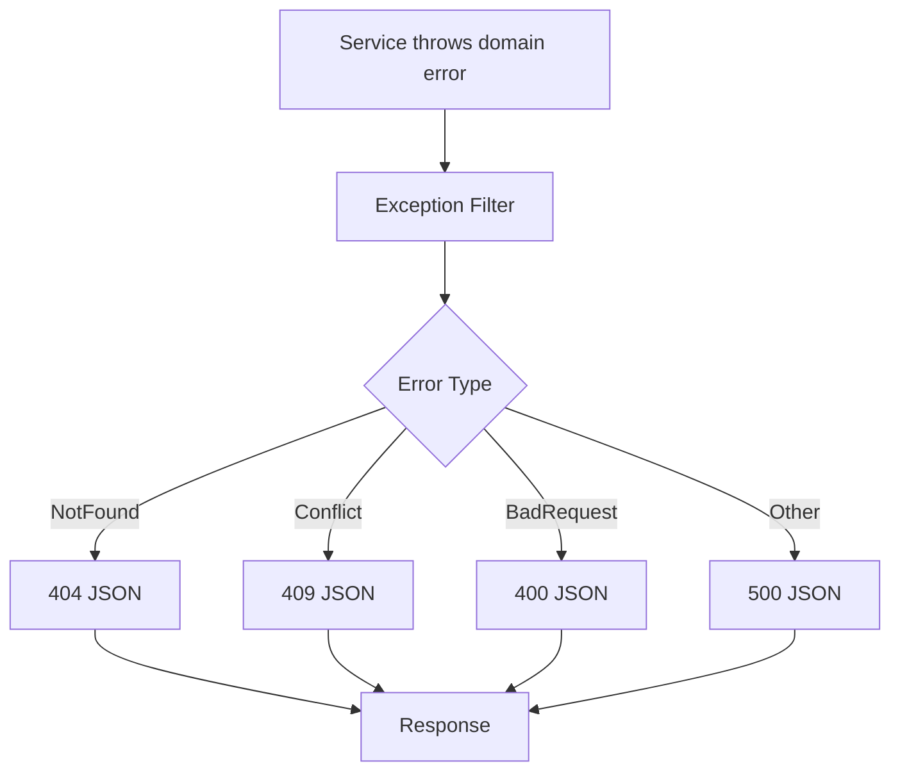
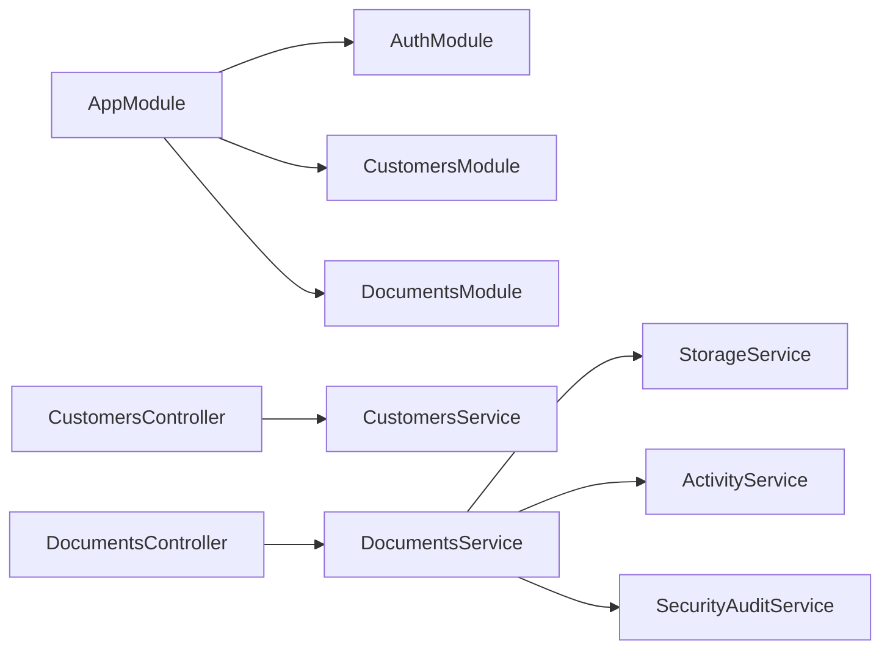

# Controllers & Services Layer

<cite>
**Referenced Files in This Document**
- [app.module.ts](file://apps/api/src/app.module.ts)
- [app.controller.ts](file://apps/api/src/app.controller.ts)
- [auth.controller.ts](file://apps/api/src/auth/auth.controller.ts)
- [customers.controller.ts](file://apps/api/src/customers/customers.controller.ts)
- [customers.service.ts](file://apps/api/src/customers/customers.service.ts)
- [customers/dtos.ts](file://apps/api/src/customers/dtos.ts)
- [documents.controller.ts](file://apps/api/src/documents/documents.controller.ts)
- [documents.service.ts](file://apps/api/src/documents/documents.service.ts)
- [documents/dtos.ts](file://apps/api/src/documents/dtos.ts)
- [bom-exception.filter.ts](file://apps/api/src/boms/bom-exception.filter.ts)
- [category-exception.filter.ts](file://apps/api/src/categories/category-exception.filter.ts)
- [gr-exception.filter.ts](file://apps/api/src/goods-receipts/gr-exception.filter.ts)
- [cycle-count-exception.filter.ts](file://apps/api/src/cycle-counts/cycle-count-exception.filter.ts)
</cite>

## Table of Contents
1. [Introduction](#introduction)
2. [Project Structure](#project-structure)
3. [Core Components](#core-components)
4. [Architecture Overview](#architecture-overview)
5. [Detailed Component Analysis](#detailed-component-analysis)
6. [Dependency Analysis](#dependency-analysis)
7. [Performance Considerations](#performance-considerations)
8. [Troubleshooting Guide](#troubleshooting-guide)
9. [Conclusion](#conclusion)

## Introduction
This document explains the controller-service layer pattern used by Ananya ERP’s API. It focuses on how HTTP endpoints are implemented as thin controllers, how business logic is encapsulated in services, and how request validation, sanitization, error handling, file uploads, streaming responses, and async processing are handled. The goal is to make the separation of concerns clear for both new contributors and experienced developers.

Key principles:
- Controllers handle HTTP concerns: routing, parameter extraction, authentication/authorization guards, input DTO validation, and response formatting.
- Services encapsulate business logic, domain operations, persistence coordination, external storage access, activity logging, and audit recording.
- DTOs define request shape and constraints using class-validator decorators.
- Domain errors from packages are mapped to HTTP status codes through exception filters.

## Project Structure
The API is a NestJS application organized by feature modules. Each module typically contains:
- A controller exposing REST endpoints.
- A service implementing business logic.
- DTOs defining validated request payloads.
- Optional exception filters mapping domain errors to HTTP responses.

**Diagram sources**
- [app.module.ts:83-163](file://apps/api/src/app.module.ts#L83-L163)
- [customers.controller.ts:10-51](file://apps/api/src/customers/customers.controller.ts#L10-L51)
- [customers.service.ts:17-84](file://apps/api/src/customers/customers.service.ts#L17-L84)
- [documents.controller.ts:47-154](file://apps/api/src/documents/documents.controller.ts#L47-L154)
- [documents.service.ts:116-124](file://apps/api/src/documents/documents.service.ts#L116-L124)

**Section sources**
- [app.module.ts:83-163](file://apps/api/src/app.module.ts#L83-L163)

## Core Components
- Controllers: Thin HTTP handlers that validate inputs via DTOs, enforce permissions with guards, and delegate work to services.
- Services: Business units that coordinate domain objects, repositories, storage, activity events, and security audits.
- DTOs: Request models annotated with class-validator rules for type, format, length, and allowed values.
- Exception Filters: Map domain or infrastructure errors to consistent JSON error responses with appropriate HTTP status codes.

Examples across the codebase:
- Authentication endpoints in AuthController demonstrate public vs protected routes, bearer token handling, and delegation to AuthService.
- CustomersController shows standard CRUD plus state transitions and sub-resource creation.
- DocumentsController demonstrates file upload, metadata updates, versioning, download/preview streaming, and permission-based access.

**Section sources**
- [auth.controller.ts:33-130](file://apps/api/src/auth/auth.controller.ts#L33-L130)
- [customers.controller.ts:10-51](file://apps/api/src/customers/customers.controller.ts#L10-L51)
- [documents.controller.ts:47-154](file://apps/api/src/documents/documents.controller.ts#L47-L154)

## Architecture Overview
The API follows a layered architecture:
- Presentation layer (controllers) handles HTTP protocol details.
- Application/business layer (services) implements use cases and orchestrates domain logic.
- Infrastructure layer (repositories, storage, database) persists data and manages external resources.

**Diagram sources**
- [documents.controller.ts:51-60](file://apps/api/src/documents/documents.controller.ts#L51-L60)
- [documents.service.ts:126-233](file://apps/api/src/documents/documents.service.ts#L126-L233)

## Detailed Component Analysis

### Authentication Controller
AuthController exposes login, logout, profile retrieval, password changes, reset flows, invitations, and organization setup. It uses:
- Public decorator for unauthenticated routes.
- Bearer token extraction and optional header fallback.
- IP and user-agent capture for login.
- Permission guard for administrative actions.

**Diagram sources**
- [auth.controller.ts:41-129](file://apps/api/src/auth/auth.controller.ts#L41-L129)

**Section sources**
- [auth.controller.ts:33-130](file://apps/api/src/auth/auth.controller.ts#L33-L130)

### Customers Module: CRUD and State Transitions
CustomersController provides:
- Create customer
- List customers with optional status and search
- Get single customer
- Activate/suspend customer
- Add contact/address sub-resources

The service enforces domain invariants, generates identifiers, and persists changes.

**Diagram sources**
- [customers.controller.ts:10-51](file://apps/api/src/customers/customers.controller.ts#L10-L51)
- [customers.service.ts:17-84](file://apps/api/src/customers/customers.service.ts#L17-L84)

**Section sources**
- [customers.controller.ts:10-51](file://apps/api/src/customers/customers.controller.ts#L10-L51)
- [customers.service.ts:17-84](file://apps/api/src/customers/customers.service.ts#L17-L84)

### Documents Module: Uploads, Streaming, Versioning, and Permissions
DocumentsController implements:
- File upload with interceptor and write guard
- External URL reference creation
- Entity-scoped listing
- Metadata update
- Version creation
- Download and preview streaming with safe headers
- Delete

DocumentsService coordinates:
- File validation, sanitization, and size/type checks
- Storage interaction
- Database transactions for document and version records
- Activity and security audit events
- Safe deletion order (storage before DB)

**Diagram sources**
- [documents.controller.ts:98-125](file://apps/api/src/documents/documents.controller.ts#L98-L125)
- [documents.service.ts:371-437](file://apps/api/src/documents/documents.service.ts#L371-L437)

**Diagram sources**
- [documents.controller.ts:51-60](file://apps/api/src/documents/documents.controller.ts#L51-L60)
- [documents.service.ts:126-233](file://apps/api/src/documents/documents.service.ts#L126-L233)

**Section sources**
- [documents.controller.ts:47-154](file://apps/api/src/documents/documents.controller.ts#L47-L154)
- [documents.service.ts:116-800](file://apps/api/src/documents/documents.service.ts#L116-L800)

### DTO Validation and Input Sanitization
DTOs define request contracts:
- Customers DTOs enforce required fields, email format, optional booleans, and address types.
- Documents DTOs constrain entity types, UUIDs, allowed document types, string lengths, tags arrays, and boolean flags.

Validation occurs at the controller boundary; services perform additional semantic validation and sanitization.

**Diagram sources**
- [customers/dtos.ts:10-86](file://apps/api/src/customers/dtos.ts#L10-L86)
- [documents/dtos.ts:43-157](file://apps/api/src/documents/dtos.ts#L43-L157)

**Section sources**
- [customers/dtos.ts:10-86](file://apps/api/src/customers/dtos.ts#L10-L86)
- [documents/dtos.ts:43-157](file://apps/api/src/documents/dtos.ts#L43-L157)

### Error Handling Strategy
Domain errors from packages are caught by feature-specific exception filters and converted into consistent JSON responses with appropriate HTTP status codes:
- Not found → 404
- Conflict → 409
- Business rule violations → 400
- Unknown errors → 500

**Diagram sources**
- [bom-exception.filter.ts:19-58](file://apps/api/src/boms/bom-exception.filter.ts#L19-L58)
- [category-exception.filter.ts:18-57](file://apps/api/src/categories/category-exception.filter.ts#L18-L57)
- [gr-exception.filter.ts:15-46](file://apps/api/src/goods-receipts/gr-exception.filter.ts#L15-L46)
- [cycle-count-exception.filter.ts:14-36](file://apps/api/src/cycle-counts/cycle-count-exception.filter.ts#L14-L36)

**Section sources**
- [bom-exception.filter.ts:19-58](file://apps/api/src/boms/bom-exception.filter.ts#L19-L58)
- [category-exception.filter.ts:18-57](file://apps/api/src/categories/category-exception.filter.ts#L18-L57)
- [gr-exception.filter.ts:15-46](file://apps/api/src/goods-receipts/gr-exception.filter.ts#L15-L46)
- [cycle-count-exception.filter.ts:14-36](file://apps/api/src/cycle-counts/cycle-count-exception.filter.ts#L14-L36)

## Dependency Analysis
Module composition and cross-cutting concerns:
- AppModule imports many feature modules and registers global middleware.
- Controllers depend on services via dependency injection.
- Services depend on repositories, storage, activity, and audit services.
- DTOs depend on shared enums and constants from domain packages.

**Diagram sources**
- [app.module.ts:83-163](file://apps/api/src/app.module.ts#L83-L163)
- [customers.controller.ts:10-51](file://apps/api/src/customers/customers.controller.ts#L10-L51)
- [documents.controller.ts:47-154](file://apps/api/src/documents/documents.controller.ts#L47-L154)
- [documents.service.ts:116-124](file://apps/api/src/documents/documents.service.ts#L116-L124)

**Section sources**
- [app.module.ts:83-163](file://apps/api/src/app.module.ts#L83-L163)

## Performance Considerations
- Streaming responses: For large files, use StreamableFile with explicit Content-Type, Content-Length, and secure headers to avoid browser sniffing and caching issues.
- Transactional writes: Use database transactions to ensure consistency when creating documents and versions concurrently.
- Early validation: Perform cheap validations before expensive I/O to fail fast.
- Storage cleanup: On failures after storing files, remove temporary storage objects to prevent orphaned data.
- Caching strategy: Avoid caching sensitive content; set private and no-store headers for downloads and previews.
- Rate limiting: Apply rate limiting at the gateway or NestJS level for sensitive endpoints such as login and password resets.
- Connection pooling and query optimization: Ensure repository queries are selective and indexed appropriately.

[No sources needed since this section provides general guidance]

## Troubleshooting Guide
Common issues and resolutions:
- Invalid DTO fields: Check class-validator decorators and ensure client sends correct types and formats.
- Missing files during download/preview: Verify storage keys exist and document source type is uploaded file, not external URL.
- Version selection errors: Ensure version query parameter is a positive integer; malformed values should return a client error.
- Domain errors: Inspect thrown domain exceptions and verify corresponding exception filter maps them to expected HTTP statuses.
- Orphaned files: If a transaction fails after storage, confirm cleanup routines remove temporary files.

**Section sources**
- [documents.controller.ts:160-196](file://apps/api/src/documents/documents.controller.ts#L160-L196)
- [documents.service.ts:743-777](file://apps/api/src/documents/documents.service.ts#L743-L777)
- [bom-exception.filter.ts:19-58](file://apps/api/src/boms/bom-exception.filter.ts#L19-L58)
- [category-exception.filter.ts:18-57](file://apps/api/src/categories/category-exception.filter.ts#L18-L57)
- [gr-exception.filter.ts:15-46](file://apps/api/src/goods-receipts/gr-exception.filter.ts#L15-L46)
- [cycle-count-exception.filter.ts:14-36](file://apps/api/src/cycle-counts/cycle-count-exception.filter.ts#L14-L36)

## Conclusion
Ananya ERP’s API cleanly separates HTTP concerns from business logic. Controllers focus on routing, validation, and authorization, while services encapsulate domain operations, persistence, storage, and auditing. DTOs provide strong request contracts, and exception filters deliver consistent error responses. This design supports robust CRUD operations, secure file uploads, streaming responses, and scalable async workflows.

[No sources needed since this section summarizes without analyzing specific files]