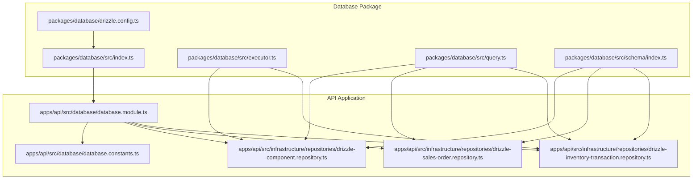
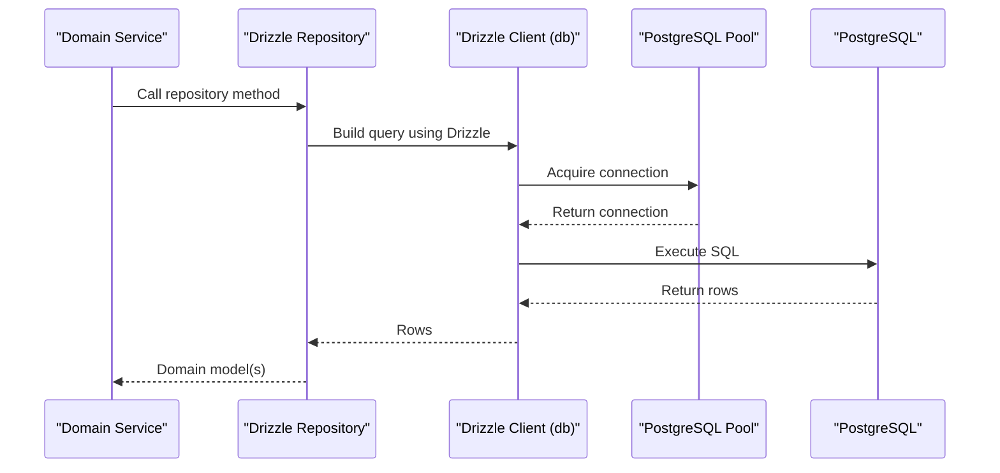
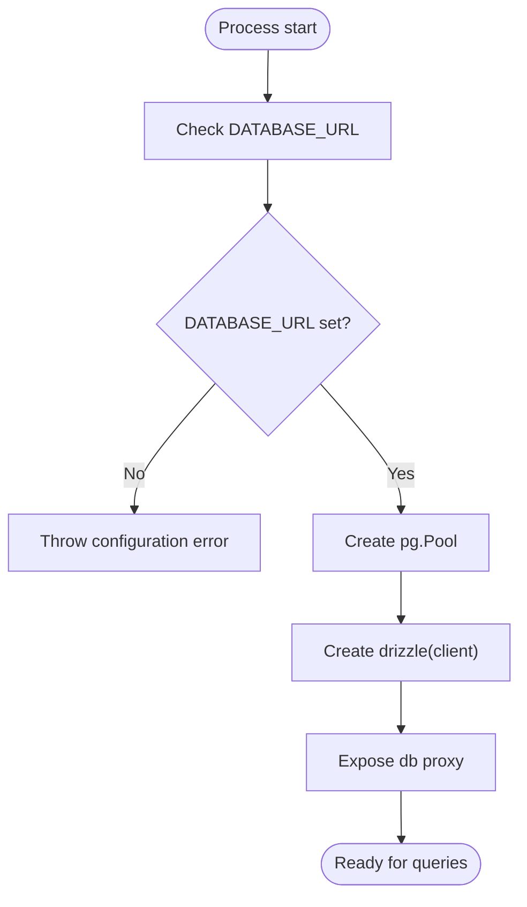
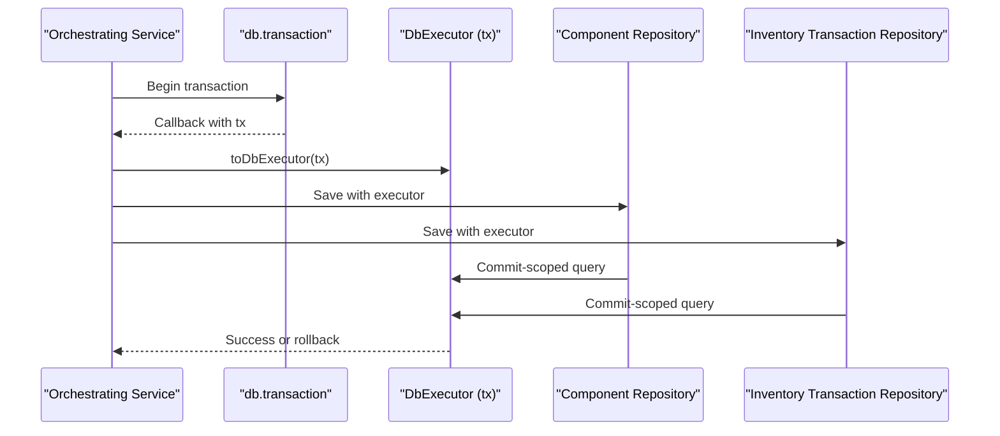
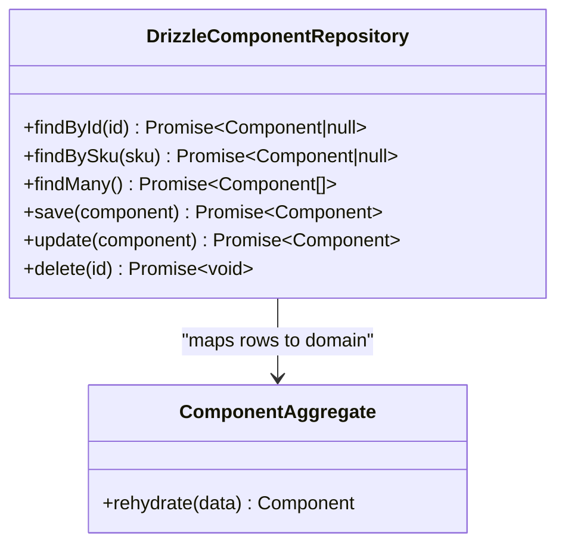
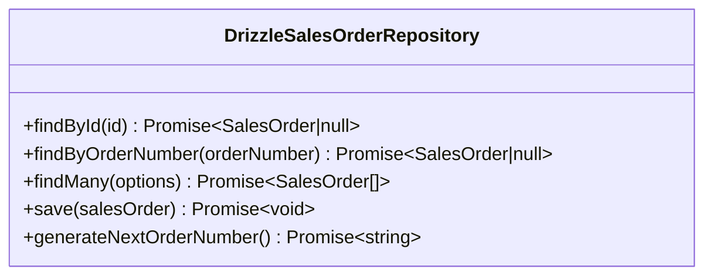
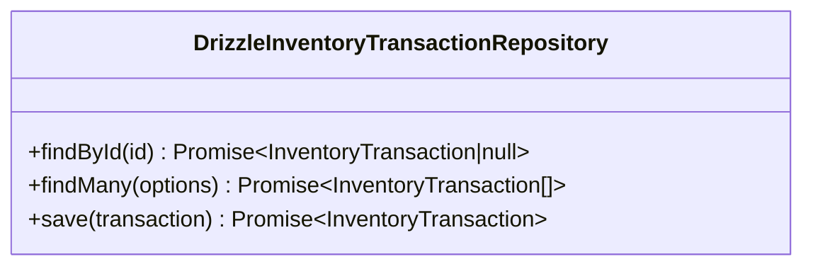
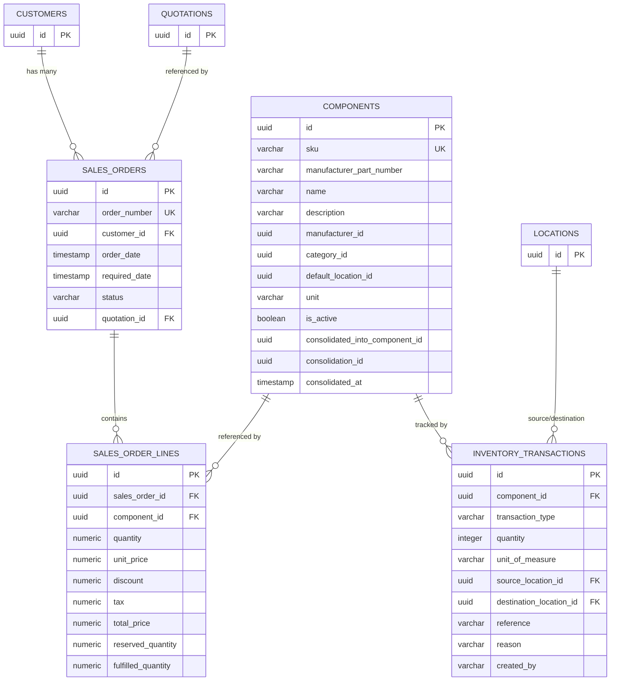
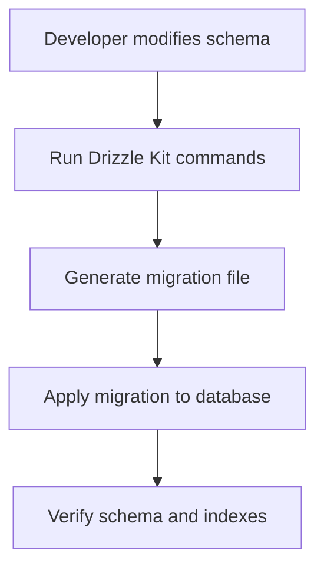
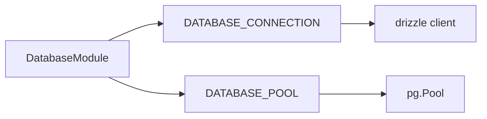

# Database Integration & Repository Pattern

<cite>
**Referenced Files in This Document**
- [packages/database/src/index.ts](file://packages/database/src/index.ts)
- [packages/database/src/executor.ts](file://packages/database/src/executor.ts)
- [packages/database/src/query.ts](file://packages/database/src/query.ts)
- [packages/database/src/schema/index.ts](file://packages/database/src/schema/index.ts)
- [packages/database/src/schema/components.ts](file://packages/database/src/schema/components.ts)
- [packages/database/src/schema/sales-orders.ts](file://packages/database/src/schema/sales-orders.ts)
- [packages/database/src/schema/inventory-transactions.ts](file://packages/database/src/schema/inventory-transactions.ts)
- [packages/database/drizzle.config.ts](file://packages/database/drizzle.config.ts)
- [apps/api/src/database/database.module.ts](file://apps/api/src/database/database.module.ts)
- [apps/api/src/database/database.constants.ts](file://apps/api/src/database/database.constants.ts)
- [apps/api/src/infrastructure/repositories/drizzle-component.repository.ts](file://apps/api/src/infrastructure/repositories/drizzle-component.repository.ts)
- [apps/api/src/infrastructure/repositories/drizzle-sales-order.repository.ts](file://apps/api/src/infrastructure/repositories/drizzle-sales-order.repository.ts)
- [apps/api/src/infrastructure/repositories/drizzle-inventory-transaction.repository.ts](file://apps/api/src/infrastructure/repositories/drizzle-inventory-transaction.repository.ts)
- [apps/api/test/integration/database.integration-spec.ts](file://apps/api/test/integration/database.integration-spec.ts)
- [docs/database/README.md](file://docs/database/README.md)
</cite>

## Table of Contents
1. [Introduction](#introduction)
2. [Project Structure](#project-structure)
3. [Core Components](#core-components)
4. [Architecture Overview](#architecture-overview)
5. [Detailed Component Analysis](#detailed-component-analysis)
6. [Dependency Analysis](#dependency-analysis)
7. [Performance Considerations](#performance-considerations)
8. [Troubleshooting Guide](#troubleshooting-guide)
9. [Conclusion](#conclusion)

## Introduction
This document explains how Ananya ERP integrates with PostgreSQL using Drizzle ORM and implements a repository pattern for database access. It covers schema management, migrations, connection pooling, transaction handling, query building, entity relationships, and performance strategies. The repository layer abstracts persistence details from domain services while preserving type safety through Drizzle-generated types and shared query helpers.

The database package owns schema definitions, migrations, and database connections. Domain code defines repository interfaces; the API layer provides Drizzle-backed implementations.

**Section sources**
- [docs/database/README.md:1-85](file://docs/database/README.md#L1-L85)

## Project Structure
Ananya’s database integration is split between a shared database package and API-specific repository implementations:

- Database package (`packages/database`)
  - Schema definitions under `src/schema`
  - Connection and pool initialization under `src/index.ts`
  - Transaction executor abstraction under `src/executor.ts`
  - Query helper re-exports under `src/query.ts`
  - Drizzle configuration under `drizzle.config.ts`
- API application (`apps/api`)
  - NestJS module exposing Drizzle client and pool as global providers
  - Repository implementations under `src/infrastructure/repositories`

**Diagram sources**
- [packages/database/src/index.ts:1-61](file://packages/database/src/index.ts#L1-L61)
- [packages/database/src/executor.ts:1-62](file://packages/database/src/executor.ts#L1-L62)
- [packages/database/src/query.ts:1-17](file://packages/database/src/query.ts#L1-L17)
- [packages/database/src/schema/index.ts:1-61](file://packages/database/src/schema/index.ts#L1-L61)
- [packages/database/drizzle.config.ts:1-23](file://packages/database/drizzle.config.ts#L1-L23)
- [apps/api/src/database/database.module.ts:1-20](file://apps/api/src/database/database.module.ts#L1-L20)
- [apps/api/src/database/database.constants.ts:1-3](file://apps/api/src/database/database.constants.ts#L1-L3)
- [apps/api/src/infrastructure/repositories/drizzle-component.repository.ts:1-157](file://apps/api/src/infrastructure/repositories/drizzle-component.repository.ts#L1-L157)
- [apps/api/src/infrastructure/repositories/drizzle-sales-order.repository.ts:1-154](file://apps/api/src/infrastructure/repositories/drizzle-sales-order.repository.ts#L1-L154)
- [apps/api/src/infrastructure/repositories/drizzle-inventory-transaction.repository.ts:1-114](file://apps/api/src/infrastructure/repositories/drizzle-inventory-transaction.repository.ts#L1-L114)

**Section sources**
- [packages/database/src/index.ts:1-61](file://packages/database/src/index.ts#L1-L61)
- [packages/database/src/executor.ts:1-62](file://packages/database/src/executor.ts#L1-L62)
- [packages/database/src/query.ts:1-17](file://packages/database/src/query.ts#L1-L17)
- [packages/database/src/schema/index.ts:1-61](file://packages/database/src/schema/index.ts#L1-L61)
- [packages/database/drizzle.config.ts:1-23](file://packages/database/drizzle.config.ts#L1-L23)
- [apps/api/src/database/database.module.ts:1-20](file://apps/api/src/database/database.module.ts#L1-L20)
- [apps/api/src/database/database.constants.ts:1-3](file://apps/api/src/database/database.constants.ts#L1-L3)

## Core Components
- Connection and pooling
  - Lazy initialization of a PostgreSQL connection pool and Drizzle client
  - Global proxies expose `db` and `pool` without requiring explicit instantiation
  - Graceful shutdown via `closeDatabaseConnection()`
- Transaction executor abstraction
  - `DbExecutor` unifies root client and transaction handles
  - `toDbExecutor(tx)` enables repositories to participate in multi-repository transactions
- Query helpers
  - Re-exported Drizzle operators for filtering, ordering, aggregation, and raw SQL fragments
- Schema registry
  - Central index exports all table schemas used by repositories

Key responsibilities:
- Provide a single source of truth for database connectivity
- Keep repository implementations independent of connection lifecycle
- Enable atomic operations across multiple repositories

**Section sources**
- [packages/database/src/index.ts:1-61](file://packages/database/src/index.ts#L1-L61)
- [packages/database/src/executor.ts:1-62](file://packages/database/src/executor.ts#L1-L62)
- [packages/database/src/query.ts:1-17](file://packages/database/src/query.ts#L1-L17)
- [packages/database/src/schema/index.ts:1-61](file://packages/database/src/schema/index.ts#L1-L61)

## Architecture Overview
The system follows a layered architecture:

- Domain layer defines repository interfaces
- Infrastructure layer implements repositories using Drizzle
- Database package manages schema, migrations, and connections
- NestJS exposes Drizzle client and pool globally

**Diagram sources**
- [packages/database/src/index.ts:1-61](file://packages/database/src/index.ts#L1-L61)
- [apps/api/src/infrastructure/repositories/drizzle-component.repository.ts:1-157](file://apps/api/src/infrastructure/repositories/drizzle-component.repository.ts#L1-L157)
- [apps/api/src/infrastructure/repositories/drizzle-sales-order.repository.ts:1-154](file://apps/api/src/infrastructure/repositories/drizzle-sales-order.repository.ts#L1-L154)
- [apps/api/src/infrastructure/repositories/drizzle-inventory-transaction.repository.ts:1-114](file://apps/api/src/infrastructure/repositories/drizzle-inventory-transaction.repository.ts#L1-L114)

## Detailed Component Analysis

### Connection Management and Pooling
- Lazy pool creation ensures environment variables are available before connecting
- Global `db` proxy defers Drizzle initialization until first use
- Test suite verifies lazy initialization and connection closure

**Diagram sources**
- [packages/database/src/index.ts:1-61](file://packages/database/src/index.ts#L1-L61)
- [apps/api/test/integration/database.integration-spec.ts:1-39](file://apps/api/test/integration/database.integration-spec.ts#L1-L39)

**Section sources**
- [packages/database/src/index.ts:1-61](file://packages/database/src/index.ts#L1-L61)
- [apps/api/test/integration/database.integration-spec.ts:1-39](file://apps/api/test/integration/database.integration-spec.ts#L1-L39)

### Transaction Handling and Atomic Operations
- Repositories accept a `DbExecutor`, defaulting to the global client
- Multi-repository operations can be wrapped in `db.transaction(...)` and pass a shared executor
- This design prevents partial updates during complex workflows such as component consolidation

**Diagram sources**
- [packages/database/src/executor.ts:1-62](file://packages/database/src/executor.ts#L1-L62)
- [apps/api/src/infrastructure/repositories/drizzle-component.repository.ts:1-157](file://apps/api/src/infrastructure/repositories/drizzle-component.repository.ts#L1-L157)
- [apps/api/src/infrastructure/repositories/drizzle-inventory-transaction.repository.ts:1-114](file://apps/api/src/infrastructure/repositories/drizzle-inventory-transaction.repository.ts#L1-L114)

**Section sources**
- [packages/database/src/executor.ts:1-62](file://packages/database/src/executor.ts#L1-L62)

### Repository Pattern Implementation

#### Component Repository
Responsibilities:
- Find components by ID or SKU
- List components
- Create, update, and delete components
- Map database rows to domain models and back
- Handle unique constraint violations with domain errors

**Diagram sources**
- [apps/api/src/infrastructure/repositories/drizzle-component.repository.ts:1-157](file://apps/api/src/infrastructure/repositories/drizzle-component.repository.ts#L1-L157)

**Section sources**
- [apps/api/src/infrastructure/repositories/drizzle-component.repository.ts:1-157](file://apps/api/src/infrastructure/repositories/drizzle-component.repository.ts#L1-L157)

#### Sales Order Repository
Responsibilities:
- Load orders with lines
- Filter orders by customer and status
- Upsert orders and lines using conflict resolution
- Generate next order number using aggregation

**Diagram sources**
- [apps/api/src/infrastructure/repositories/drizzle-sales-order.repository.ts:1-154](file://apps/api/src/infrastructure/repositories/drizzle-sales-order.repository.ts#L1-L154)

**Section sources**
- [apps/api/src/infrastructure/repositories/drizzle-sales-order.repository.ts:1-154](file://apps/api/src/infrastructure/repositories/drizzle-sales-order.repository.ts#L1-L154)

#### Inventory Transaction Repository
Responsibilities:
- Find transactions by filters including component, location, type, creator, and search text
- Insert new inventory transactions
- Map rows to domain models

**Diagram sources**
- [apps/api/src/infrastructure/repositories/drizzle-inventory-transaction.repository.ts:1-114](file://apps/api/src/infrastructure/repositories/drizzle-inventory-transaction.repository.ts#L1-L114)

**Section sources**
- [apps/api/src/infrastructure/repositories/drizzle-inventory-transaction.repository.ts:1-114](file://apps/api/src/infrastructure/repositories/drizzle-inventory-transaction.repository.ts#L1-L114)

### Entity Relationships and Schema Design
Key relationships:
- Sales orders belong to customers and optionally originate from quotations
- Sales order lines reference components
- Inventory transactions reference components and locations
- Components may be consolidated into canonical components

**Diagram sources**
- [packages/database/src/schema/sales-orders.ts:1-83](file://packages/database/src/schema/sales-orders.ts#L1-L83)
- [packages/database/src/schema/components.ts:1-130](file://packages/database/src/schema/components.ts#L1-L130)
- [packages/database/src/schema/inventory-transactions.ts:1-79](file://packages/database/src/schema/inventory-transactions.ts#L1-L79)

**Section sources**
- [packages/database/src/schema/sales-orders.ts:1-83](file://packages/database/src/schema/sales-orders.ts#L1-L83)
- [packages/database/src/schema/components.ts:1-130](file://packages/database/src/schema/components.ts#L1-L130)
- [packages/database/src/schema/inventory-transactions.ts:1-79](file://packages/database/src/schema/inventory-transactions.ts#L1-L79)

### Migrations and Schema Management
- Drizzle configuration reads `DATABASE_URL` and points to the schema entry point
- Migrations live under `packages/database/drizzle`
- Schema changes must include corresponding migration files

**Diagram sources**
- [packages/database/drizzle.config.ts:1-23](file://packages/database/drizzle.config.ts#L1-L23)

**Section sources**
- [packages/database/drizzle.config.ts:1-23](file://packages/database/drizzle.config.ts#L1-L23)
- [docs/database/README.md:59-65](file://docs/database/README.md#L59-L65)

### Query Building Patterns
Common patterns observed in repositories:
- Single-row lookups with `select().from(...).where(eq(...)).limit(1)`
- Filtering with optional conditions using builder composition
- Ordering results with `desc` or `asc`
- Aggregation with `count()`
- Case normalization and string matching with `ilike`

Examples:
- Component lookup by ID or SKU
- Sales order listing with optional filters
- Inventory transaction search across reference and reason fields

**Section sources**
- [apps/api/src/infrastructure/repositories/drizzle-component.repository.ts:68-95](file://apps/api/src/infrastructure/repositories/drizzle-component.repository.ts#L68-L95)
- [apps/api/src/infrastructure/repositories/drizzle-sales-order.repository.ts:46-93](file://apps/api/src/infrastructure/repositories/drizzle-sales-order.repository.ts#L46-L93)
- [apps/api/src/infrastructure/repositories/drizzle-inventory-transaction.repository.ts:58-99](file://apps/api/src/infrastructure/repositories/drizzle-inventory-transaction.repository.ts#L58-L99)

### Data Access Abstraction
- Repositories encapsulate persistence logic behind domain-oriented methods
- Mapping functions convert between database rows and domain aggregates
- Shared query helpers keep filter expressions consistent and readable

Benefits:
- Decouples business logic from database specifics
- Enables testing with alternative executors or mocks
- Improves maintainability and clarity

**Section sources**
- [apps/api/src/infrastructure/repositories/drizzle-component.repository.ts:26-63](file://apps/api/src/infrastructure/repositories/drizzle-component.repository.ts#L26-L63)
- [apps/api/src/infrastructure/repositories/drizzle-sales-order.repository.ts:15-44](file://apps/api/src/infrastructure/repositories/drizzle-sales-order.repository.ts#L15-L44)
- [apps/api/src/infrastructure/repositories/drizzle-inventory-transaction.repository.ts:13-43](file://apps/api/src/infrastructure/repositories/drizzle-inventory-transaction.repository.ts#L13-L43)

## Dependency Analysis
NestJS exposes Drizzle client and pool as global providers so modules can inject them consistently.

**Diagram sources**
- [apps/api/src/database/database.module.ts:1-20](file://apps/api/src/database/database.module.ts#L1-L20)
- [apps/api/src/database/database.constants.ts:1-3](file://apps/api/src/database/database.constants.ts#L1-L3)

**Section sources**
- [apps/api/src/database/database.module.ts:1-20](file://apps/api/src/database/database.module.ts#L1-L20)
- [apps/api/src/database/database.constants.ts:1-3](file://apps/api/src/database/database.constants.ts#L1-L3)

## Performance Considerations
Indexing strategy:
- Unique constraints on identifiers and business keys
- Indexes on foreign keys and frequently filtered columns
- Partial and functional indexes for normalized searches and active-record filtering

Query optimization tips:
- Use targeted `where` clauses and avoid unnecessary joins
- Prefer pagination and limiting result sets
- Use aggregation functions like `count` for counters instead of loading full rows
- Normalize data at the repository layer to reduce repeated transformations

Connection tuning:
- Ensure `DATABASE_URL` is configured correctly
- Monitor pool usage and adjust pool size based on workload
- Close connections gracefully in tests and long-running processes

**Section sources**
- [packages/database/src/schema/components.ts:90-125](file://packages/database/src/schema/components.ts#L90-L125)
- [packages/database/src/schema/sales-orders.ts:35-77](file://packages/database/src/schema/sales-orders.ts#L35-L77)
- [packages/database/src/schema/inventory-transactions.ts:61-73](file://packages/database/src/schema/inventory-transactions.ts#L61-L73)
- [apps/api/test/integration/database.integration-spec.ts:1-39](file://apps/api/test/integration/database.integration-spec.ts#L1-L39)

## Troubleshooting Guide
Common issues and resolutions:
- Missing `DATABASE_URL`
  - Cause: Environment variable not set
  - Resolution: Configure `DATABASE_URL` before starting the application
- Unique constraint violations
  - Cause: Duplicate values inserted
  - Resolution: Catch Postgres error codes and map to domain errors
- Lazy initialization failures
  - Cause: Attempting to use `db` or `pool` before configuration
  - Resolution: Ensure environment is ready and test cleanup calls `closeDatabaseConnection`

Operational checks:
- Validate that Drizzle migrations are applied
- Confirm indexes exist for high-cardinality and frequently filtered columns
- Review repository methods for N+1 queries and consider batching or joins where appropriate

**Section sources**
- [packages/database/src/index.ts:7-18](file://packages/database/src/index.ts#L7-L18)
- [apps/api/src/infrastructure/repositories/drizzle-component.repository.ts:97-115](file://apps/api/src/infrastructure/repositories/drizzle-component.repository.ts#L97-L115)
- [apps/api/test/integration/database.integration-spec.ts:1-39](file://apps/api/test/integration/database.integration-spec.ts#L1-L39)

## Conclusion
Ananya ERP’s database integration centers on a clean separation between domain logic and persistence. Drizzle ORM provides type-safe schema definitions and query building, while the repository pattern encapsulates data access. Connection pooling and transaction support ensure reliable and efficient operations. With careful indexing, query construction, and error handling, the system scales effectively and remains maintainable as new domains are added.