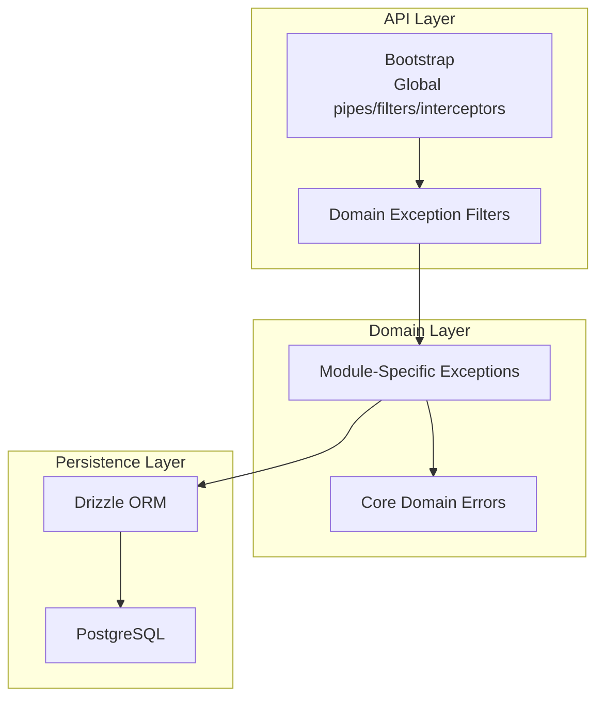
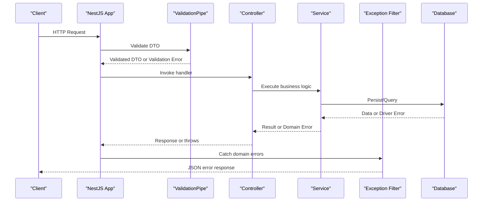
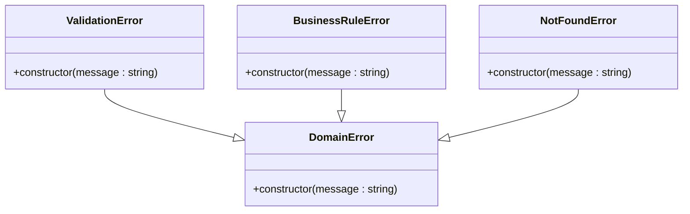
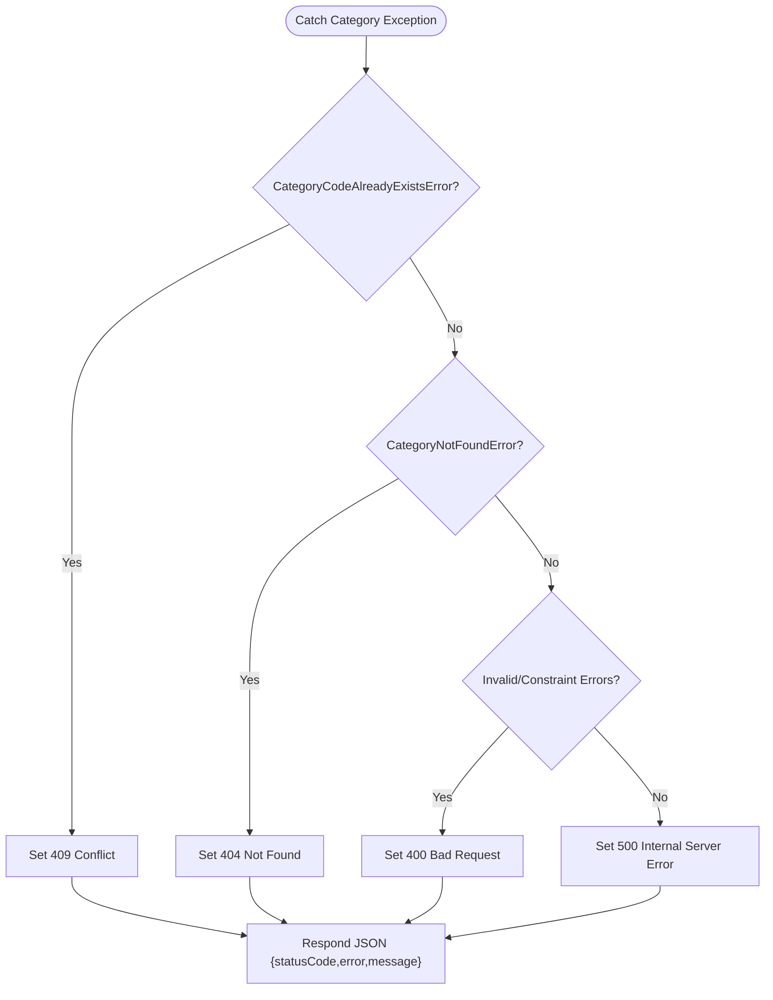
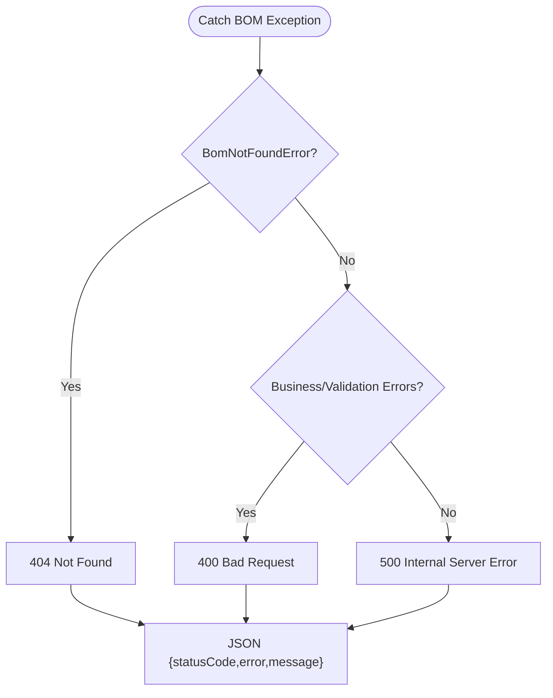
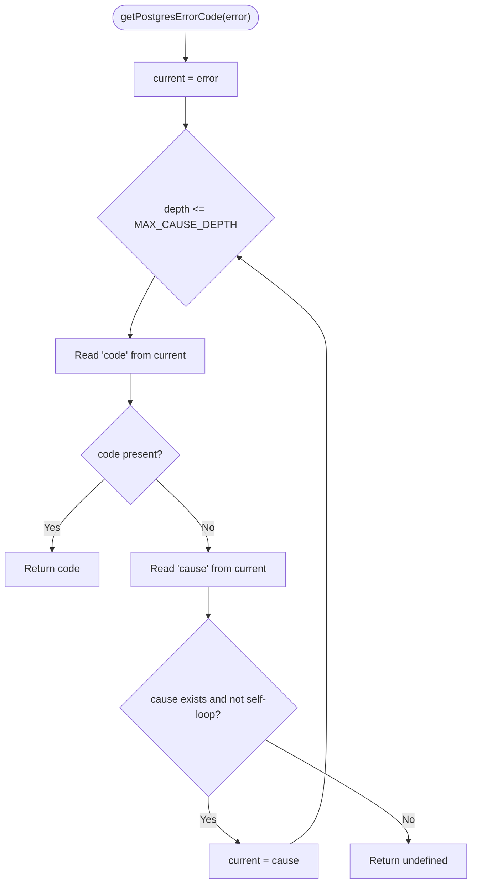
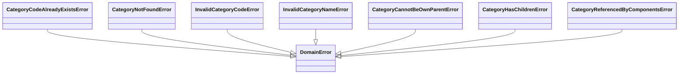
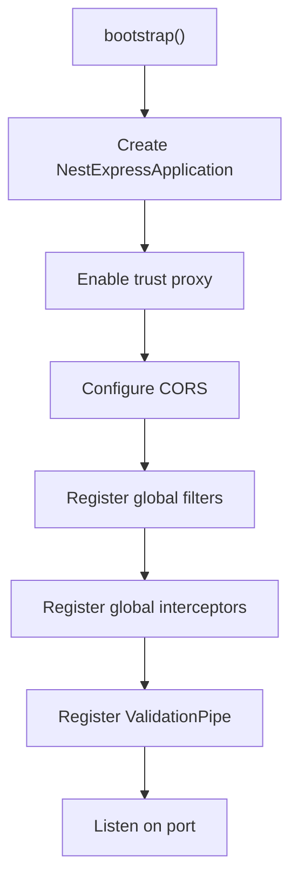
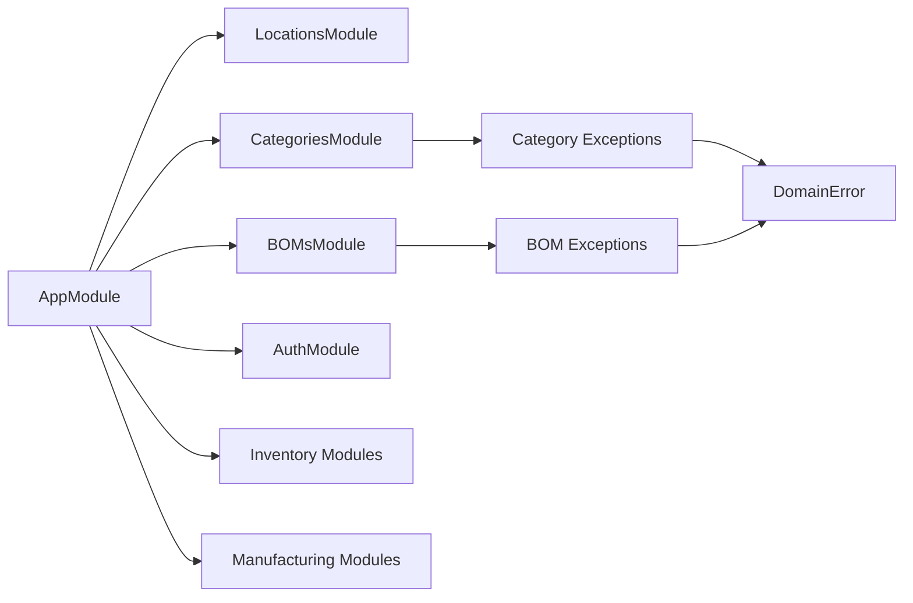

# Error Handling & Exception Filters

<cite>
**Referenced Files in This Document**
- [main.ts](file://apps/api/src/main.ts)
- [app.module.ts](file://apps/api/src/app.module.ts)
- [bom-exception.filter.ts](file://apps/api/src/boms/bom-exception.filter.ts)
- [category-exception.filter.ts](file://apps/api/src/categories/category-exception.filter.ts)
- [domain-error.ts](file://packages/core/src/errors/domain-error.ts)
- [validation-error.ts](file://packages/core/src/errors/validation-error.ts)
- [not-found-error.ts](file://packages/core/src/errors/not-found-error.ts)
- [domain-rule-violation-error.ts](file://packages/core/src/errors/domain-rule-violation-error.ts)
- [postgres-error.ts](file://apps/api/src/common/utils/postgres-error.ts)
- [category.errors.ts](file://packages/inventory/src/categories/category.errors.ts)
</cite>

## Table of Contents
1. [Introduction](#introduction)
2. [Project Structure](#project-structure)
3. [Core Components](#core-components)
4. [Architecture Overview](#architecture-overview)
5. [Detailed Component Analysis](#detailed-component-analysis)
6. [Dependency Analysis](#dependency-analysis)
7. [Performance Considerations](#performance-considerations)
8. [Troubleshooting Guide](#troubleshooting-guide)
9. [Conclusion](#conclusion)
10. [Appendices](#appendices)

## Introduction
This document explains the error handling strategy in Ananya ERP’s API layer. It covers exception filters, global error handling, custom domain exceptions, HTTP status code mapping, error response formatting, logging integration, and database error translation. It also provides guidance for creating custom exceptions, handling validation errors, implementing retry logic, tracking errors, debugging techniques, production monitoring, graceful degradation, fallbacks, and user-friendly messages.

## Project Structure
Error handling spans three layers:
- Core domain errors (base classes and shared types)
- Domain-specific exceptions per module
- API-level exception filters that map domain errors to HTTP responses

**Diagram sources**
- [main.ts:12-36](file://apps/api/src/main.ts#L12-L36)
- [bom-exception.filter.ts:19-57](file://apps/api/src/boms/bom-exception.filter.ts#L19-L57)
- [category-exception.filter.ts:18-56](file://apps/api/src/categories/category-exception.filter.ts#L18-L56)
- [domain-error.ts:1-10](file://packages/core/src/errors/domain-error.ts#L1-L10)
- [postgres-error.ts:1-49](file://apps/api/src/common/utils/postgres-error.ts#L1-L49)

**Section sources**
- [main.ts:12-36](file://apps/api/src/main.ts#L12-L36)
- [app.module.ts:83-163](file://apps/api/src/app.module.ts#L83-L163)

## Core Components
- Base domain error hierarchy:
  - DomainError: base class for all domain errors
  - ValidationError: invalid input or constraints
  - BusinessRuleError: violation of business rules
  - NotFoundError: resource not found
- Domain-specific exceptions live in feature packages (e.g., inventory categories)
- API exception filters translate domain exceptions into consistent HTTP responses
- Global configuration applies ValidationPipe and a global exception filter; additional filters are registered at module boundaries

Key responsibilities:
- Centralize error taxonomy via core domain errors
- Keep HTTP concerns out of domain logic by using domain exceptions
- Provide consistent error payloads across endpoints
- Map Postgres SQLSTATE codes to domain violations where applicable

**Section sources**
- [domain-error.ts:1-10](file://packages/core/src/errors/domain-error.ts#L1-L10)
- [validation-error.ts:1-11](file://packages/core/src/errors/validation-error.ts#L1-L11)
- [domain-rule-violation-error.ts:1-11](file://packages/core/src/errors/domain-rule-violation-error.ts#L1-L11)
- [not-found-error.ts:1-11](file://packages/core/src/errors/not-found-error.ts#L1-L11)

## Architecture Overview
The request lifecycle with error handling:

**Diagram sources**
- [main.ts:28-36](file://apps/api/src/main.ts#L28-L36)
- [bom-exception.filter.ts:30-57](file://apps/api/src/boms/bom-exception.filter.ts#L30-L57)
- [category-exception.filter.ts:28-56](file://apps/api/src/categories/category-exception.filter.ts#L28-L56)

## Detailed Component Analysis

### Domain Error Hierarchy
The base classes define a clear taxonomy for domain failures. All domain exceptions should extend DomainError to ensure consistent behavior and filtering.

**Diagram sources**
- [domain-error.ts:1-10](file://packages/core/src/errors/domain-error.ts#L1-L10)
- [validation-error.ts:1-11](file://packages/core/src/errors/validation-error.ts#L1-L11)
- [domain-rule-violation-error.ts:1-11](file://packages/core/src/errors/domain-rule-violation-error.ts#L1-L11)
- [not-found-error.ts:1-11](file://packages/core/src/errors/not-found-error.ts#L1-L11)

**Section sources**
- [domain-error.ts:1-10](file://packages/core/src/errors/domain-error.ts#L1-L10)
- [validation-error.ts:1-11](file://packages/core/src/errors/validation-error.ts#L1-L11)
- [domain-rule-violation-error.ts:1-11](file://packages/core/src/errors/domain-rule-violation-error.ts#L1-L11)
- [not-found-error.ts:1-11](file://packages/core/src/errors/not-found-error.ts#L1-L11)

### Category Exception Filter
Maps category domain errors to HTTP status codes and returns a standardized JSON payload.

**Diagram sources**
- [category-exception.filter.ts:18-56](file://apps/api/src/categories/category-exception.filter.ts#L18-L56)

**Section sources**
- [category-exception.filter.ts:18-56](file://apps/api/src/categories/category-exception.filter.ts#L18-L56)

### BOM Exception Filter
Similar mapping for manufacturing BOM domain errors.

**Diagram sources**
- [bom-exception.filter.ts:19-57](file://apps/api/src/boms/bom-exception.filter.ts#L19-L57)

**Section sources**
- [bom-exception.filter.ts:19-57](file://apps/api/src/boms/bom-exception.filter.ts#L19-L57)

### PostgreSQL Error Translation Utilities
Provides helpers to unwrap Drizzle-wrapped driver errors and extract SQLSTATE codes for constraint violations.

**Diagram sources**
- [postgres-error.ts:16-44](file://apps/api/src/common/utils/postgres-error.ts#L16-L44)

**Section sources**
- [postgres-error.ts:1-49](file://apps/api/src/common/utils/postgres-error.ts#L1-L49)

### Domain-Specific Exceptions Example: Categories
Shows how domain modules define specific exceptions that inherit from DomainError.

**Diagram sources**
- [category.errors.ts:1-48](file://packages/inventory/src/categories/category.errors.ts#L1-L48)
- [domain-error.ts:1-10](file://packages/core/src/errors/domain-error.ts#L1-L10)

**Section sources**
- [category.errors.ts:1-48](file://packages/inventory/src/categories/category.errors.ts#L1-L48)

### Global Error Handling Setup
The bootstrap configures:
- Trust proxy for accurate client IP resolution
- CORS policy
- A global LocationExceptionFilter
- Global ValidationPipe with whitelist, forbidNonWhitelisted, and transform enabled
- Logging interceptor for request/response tracing

**Diagram sources**
- [main.ts:12-40](file://apps/api/src/main.ts#L12-L40)

**Section sources**
- [main.ts:12-40](file://apps/api/src/main.ts#L12-L40)

## Dependency Analysis
- AppModule imports many feature modules; each can register its own exception filters within module scope.
- Global filters are applied in main.ts; domain filters are typically bound to their respective controllers or modules.
- Domain exceptions depend on core DomainError; API filters depend on domain exceptions and NestJS common utilities.

**Diagram sources**
- [app.module.ts:83-163](file://apps/api/src/app.module.ts#L83-L163)
- [category.errors.ts:1-48](file://packages/inventory/src/categories/category.errors.ts#L1-L48)
- [bom-exception.filter.ts:19-57](file://apps/api/src/boms/bom-exception.filter.ts#L19-L57)

**Section sources**
- [app.module.ts:83-163](file://apps/api/src/app.module.ts#L83-L163)

## Performance Considerations
- Avoid heavy logging in hot paths; prefer structured logs with correlation IDs.
- Use ValidationPipe efficiently; keep DTOs minimal and validated early.
- Prefer domain exceptions over generic errors to reduce branching in filters.
- Limit cause-chain traversal depth when unwrapping database errors to avoid overhead.

[No sources needed since this section provides general guidance]

## Troubleshooting Guide
Common issues and resolutions:
- Unexpected 500 responses: Ensure domain exceptions are thrown instead of raw errors; verify filter registration order.
- Validation errors not surfaced: Confirm ValidationPipe is configured globally and DTOs use proper decorators.
- Database constraint violations mapped incorrectly: Verify Postgres error code extraction utility usage in repositories/services.
- Missing error context: Add correlation IDs and request metadata via the logging interceptor and request context middleware.

Recommended checks:
- Inspect the JSON error payload fields: statusCode, error, message.
- Validate that domain exceptions extend DomainError.
- Confirm that exception filters catch the exact exception types they intend to handle.

**Section sources**
- [main.ts:28-36](file://apps/api/src/main.ts#L28-L36)
- [postgres-error.ts:1-49](file://apps/api/src/common/utils/postgres-error.ts#L1-L49)

## Conclusion
Ananya ERP’s error handling centers on a clean domain error hierarchy, explicit domain exceptions per module, and focused exception filters that translate these into consistent HTTP responses. Global configuration ensures robust validation and logging, while Postgres error utilities enable precise database error translation. Following these patterns yields predictable, user-friendly error experiences and simplifies debugging and monitoring.

[No sources needed since this section summarizes without analyzing specific files]

## Appendices

### Creating Custom Exceptions
- Extend DomainError for new domain-specific failures.
- Provide descriptive messages and, if helpful, contextual identifiers (e.g., IDs or codes).
- Register corresponding mappings in the relevant module’s exception filter to return appropriate HTTP status codes.

**Section sources**
- [domain-error.ts:1-10](file://packages/core/src/errors/domain-error.ts#L1-L10)
- [category.errors.ts:1-48](file://packages/inventory/src/categories/category.errors.ts#L1-L48)

### Handling Validation Errors
- Use DTOs with validation decorators.
- Rely on ValidationPipe to enforce schema and produce standard validation errors.
- For domain-level validation, throw ValidationError or BusinessRuleError.

**Section sources**
- [main.ts:30-36](file://apps/api/src/main.ts#L30-L36)
- [validation-error.ts:1-11](file://packages/core/src/errors/validation-error.ts#L1-L11)
- [domain-rule-violation-error.ts:1-11](file://packages/core/src/errors/domain-rule-violation-error.ts#L1-L11)

### Implementing Retry Logic
- Apply retry policies around transient external calls (e.g., third-party APIs).
- Use exponential backoff and jitter.
- Distinguish between transient and permanent failures; do not retry on domain validation errors.
- Log retries with correlation IDs for observability.

[No sources needed since this section provides general guidance]

### Error Tracking and Debugging
- Capture correlation IDs from incoming requests and propagate them through logs.
- Include stack traces only in development; in production, log sanitized details plus an error ID.
- Integrate with an error tracking service to aggregate and alert on recurring issues.

[No sources needed since this section provides general guidance]

### Production Monitoring and Graceful Degradation
- Monitor HTTP error rates by status code and endpoint.
- Define fallback behaviors for non-critical features (e.g., cache defaults, degraded modes).
- Surface user-friendly messages while preserving detailed diagnostics internally.

[No sources needed since this section provides general guidance]