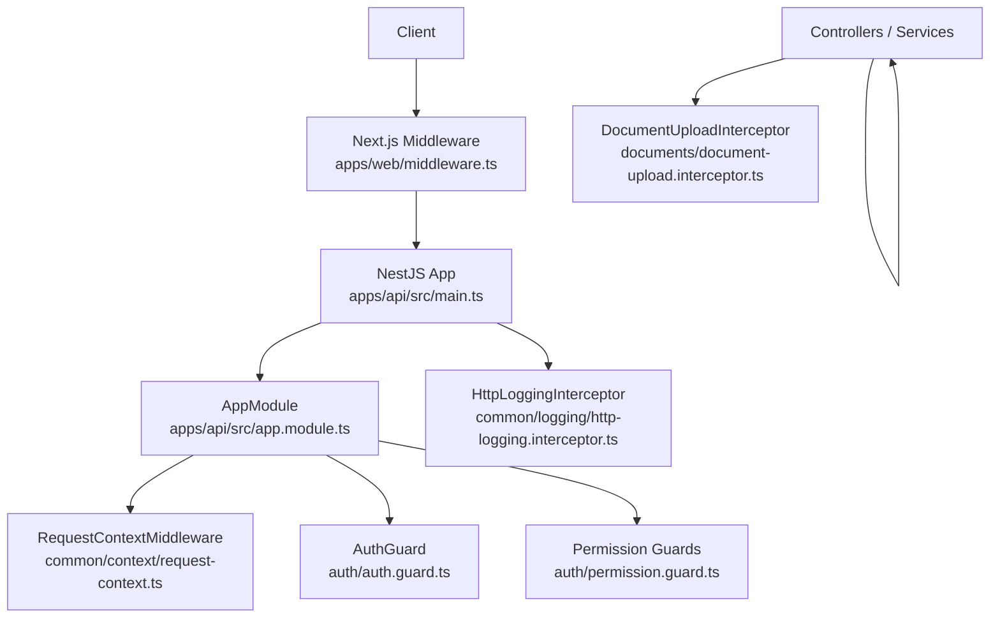
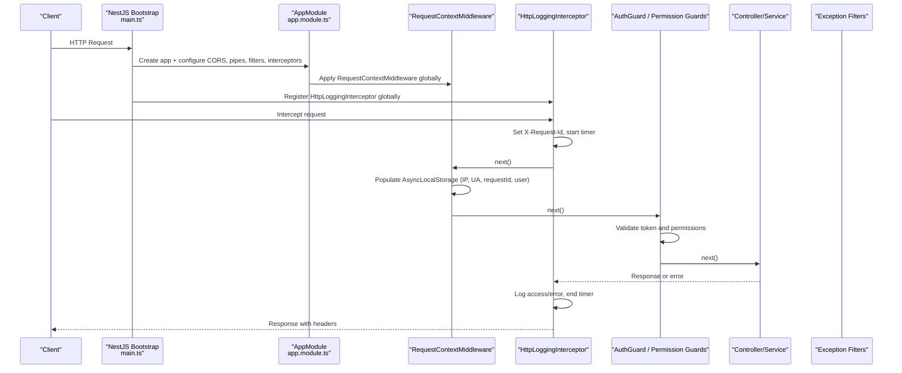
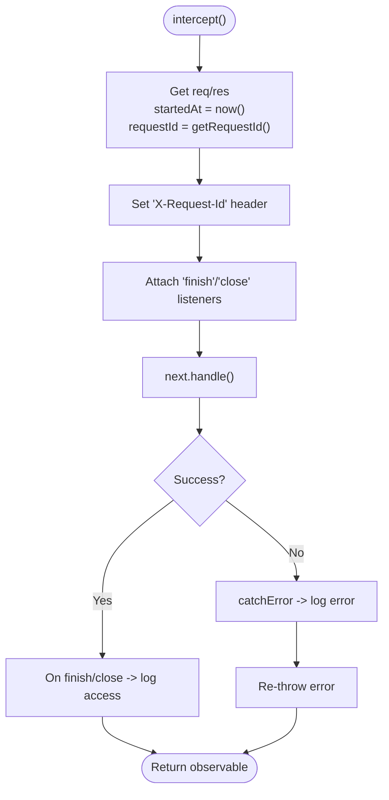
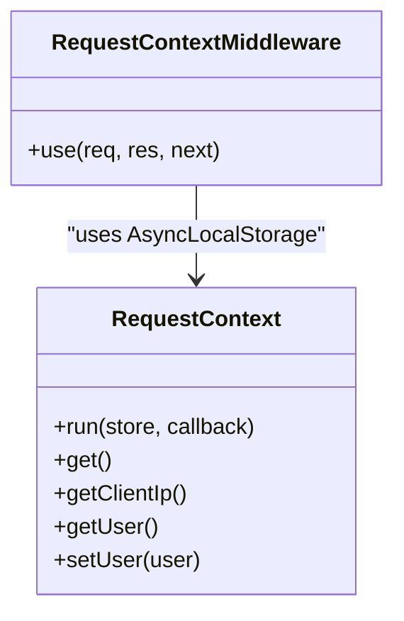
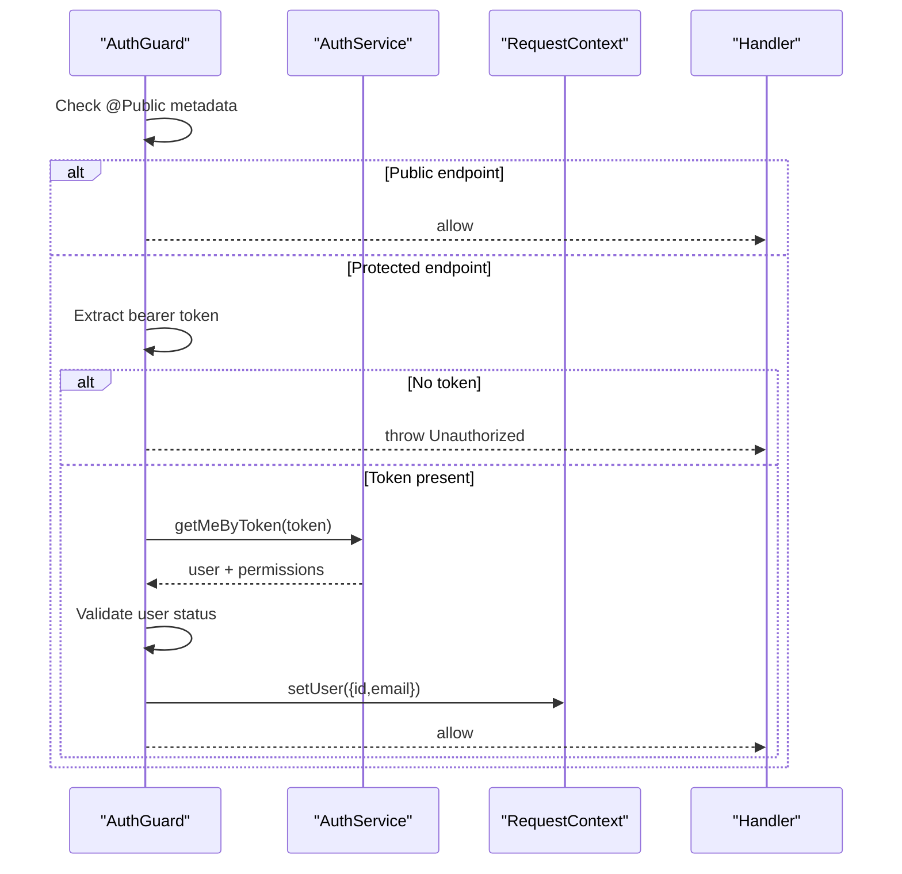
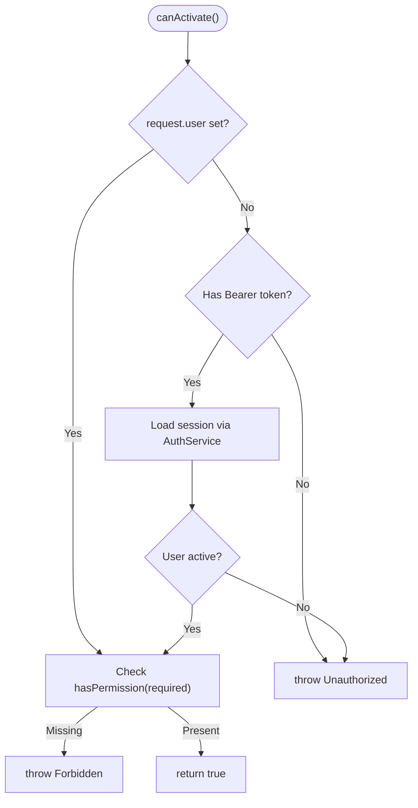
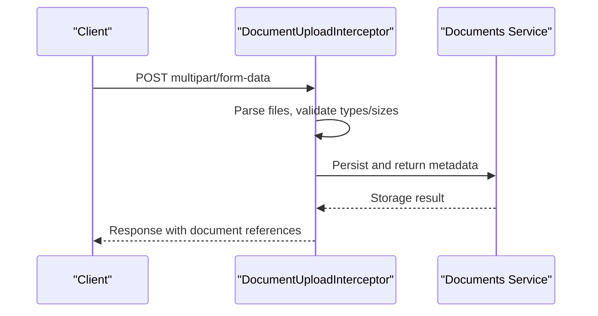
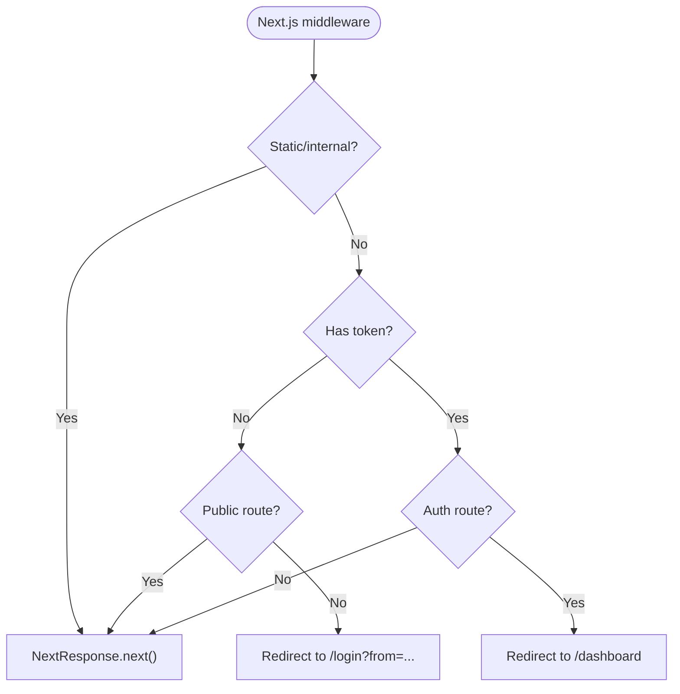
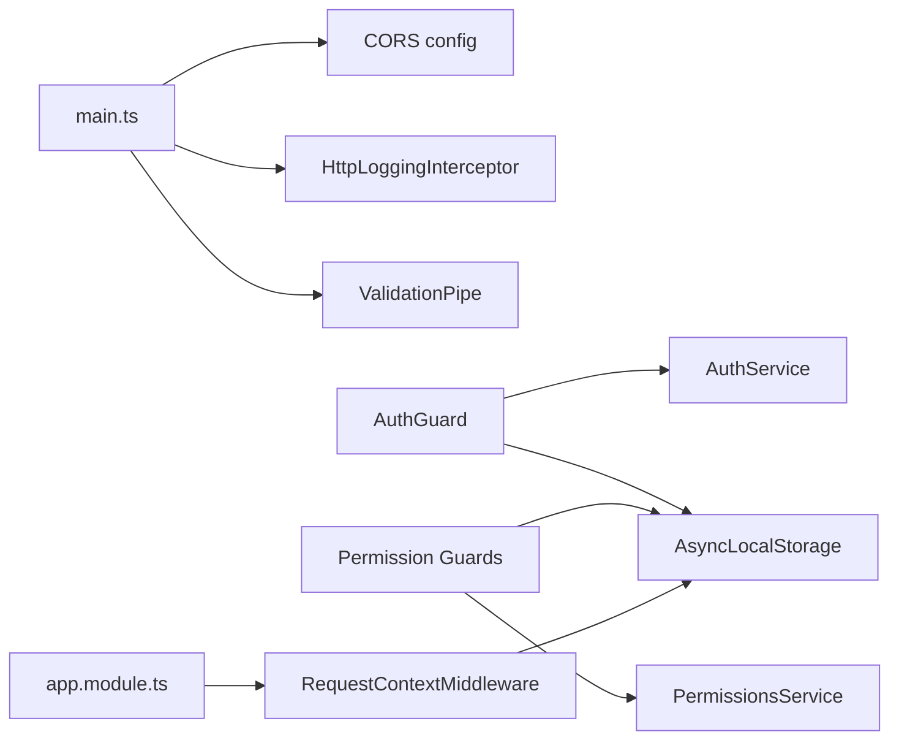

# Middleware & Interceptors

<cite>
**Referenced Files in This Document**
- [main.ts](file://apps/api/src/main.ts)
- [app.module.ts](file://apps/api/src/app.module.ts)
- [http-logging.interceptor.ts](file://apps/api/src/common/logging/http-logging.interceptor.ts)
- [request-context.ts](file://apps/api/src/common/context/request-context.ts)
- [auth.guard.ts](file://apps/api/src/auth/auth.guard.ts)
- [permission.guard.ts](file://apps/api/src/auth/permission.guard.ts)
- [middleware.ts](file://apps/web/middleware.ts)
- [document-upload.interceptor.ts](file://apps/api/src/documents/document-upload.interceptor.ts)
</cite>

## Table of Contents
1. Introduction
2. Project Structure
3. Core Components
4. Architecture Overview
5. Detailed Component Analysis
6. Dependency Analysis
7. Performance Considerations
8. Troubleshooting Guide
9. Conclusion

## Introduction
This document explains how Ananya ERP’s API and web application implement middleware and interceptors to handle cross-cutting concerns such as logging, authentication, authorization, request context propagation, file uploads, validation, response modification, CORS, compression, and security headers. It covers global vs local middleware, execution order, context sharing via AsyncLocalStorage, and best practices for building custom interceptors and guards.

## Project Structure
The API is a NestJS application that configures global middleware, interceptors, pipes, filters, and CORS at bootstrap. A module-level middleware sets up per-request context. The Next.js web app includes a server-side middleware for route-based access control.

**Diagram sources**
- [main.ts:12-36](file://apps/api/src/main.ts#L12-L36)
- [app.module.ts:166-169](file://apps/api/src/app.module.ts#L166-L169)
- [http-logging.interceptor.ts:22-74](file://apps/api/src/common/logging/http-logging.interceptor.ts#L22-L74)
- [request-context.ts:48-70](file://apps/api/src/common/context/request-context.ts#L48-L70)
- [auth.guard.ts:25-84](file://apps/api/src/auth/auth.guard.ts#L25-L84)
- [permission.guard.ts:67-162](file://apps/api/src/auth/permission.guard.ts#L67-L162)
- [document-upload.interceptor.ts](file://apps/api/src/documents/document-upload.interceptor.ts)

**Section sources**
- [main.ts:12-36](file://apps/api/src/main.ts#L12-L36)
- [app.module.ts:166-169](file://apps/api/src/app.module.ts#L166-L169)
- [middleware.ts:14-49](file://apps/web/middleware.ts#L14-L49)

## Core Components
- Global HTTP logging interceptor: Adds an X-Request-Id header, logs access and errors with timing, IP, user agent, and route details.
- Request context middleware: Captures client IP, user agent, request ID, and authenticated user info into AsyncLocalStorage for the entire request lifecycle.
- Authentication guard: Enforces fail-closed authentication by default; supports public endpoints via metadata decorator.
- Permission guards: Factory-based guards for fine-grained authorization checks against permissions.
- File upload interceptor: Handles multipart uploads for documents (path provided).
- Validation pipe: Global DTO validation with whitelist and transform enabled.
- CORS configuration: Configured at bootstrap from environment variables.

**Section sources**
- [http-logging.interceptor.ts:22-74](file://apps/api/src/common/logging/http-logging.interceptor.ts#L22-L74)
- [request-context.ts:17-70](file://apps/api/src/common/context/request-context.ts#L17-L70)
- [auth.guard.ts:25-84](file://apps/api/src/auth/auth.guard.ts#L25-L84)
- [permission.guard.ts:67-162](file://apps/api/src/auth/permission.guard.ts#L67-L162)
- [main.ts:18-36](file://apps/api/src/main.ts#L18-L36)

## Architecture Overview
The request/response pipeline combines Express-level middleware, NestJS middleware, interceptors, guards, pipes, and controllers/services. Execution order is controlled by where each component is registered.

**Diagram sources**
- [main.ts:12-36](file://apps/api/src/main.ts#L12-L36)
- [app.module.ts:166-169](file://apps/api/src/app.module.ts#L166-L169)
- [http-logging.interceptor.ts:30-74](file://apps/api/src/common/logging/http-logging.interceptor.ts#L30-L74)
- [request-context.ts:48-70](file://apps/api/src/common/context/request-context.ts#L48-L70)
- [auth.guard.ts:32-84](file://apps/api/src/auth/auth.guard.ts#L32-L84)
- [permission.guard.ts:78-151](file://apps/api/src/auth/permission.guard.ts#L78-L151)

## Detailed Component Analysis

### Global Logging Interceptor
- Responsibilities:
  - Ensures every response carries an X-Request-Id header.
  - Logs access entries on response finish/close with method, route, status code, duration, IP, user agent.
  - Logs structured error entries when downstream throws, preserving stack traces and status codes.
  - Respects environment toggles for access and error logging.
- Error handling:
  - Uses RxJS catchError to log without swallowing exceptions; rethrows so exception filters can format responses.
- Performance:
  - Measures duration using performance.now(); avoids heavy serialization outside hot paths.

**Diagram sources**
- [http-logging.interceptor.ts:30-74](file://apps/api/src/common/logging/http-logging.interceptor.ts#L30-L74)
- [http-logging.interceptor.ts:76-150](file://apps/api/src/common/logging/http-logging.interceptor.ts#L76-L150)

**Section sources**
- [http-logging.interceptor.ts:22-150](file://apps/api/src/common/logging/http-logging.interceptor.ts#L22-L150)

### Request Context Middleware
- Responsibilities:
  - Extracts client IP, user agent, and request ID (from header or generated).
  - Reads authenticated user from request.user if present.
  - Stores all above in AsyncLocalStorage under a per-request store.
  - Exposes static helpers to read/update context anywhere in the request chain.
- Usage:
  - Applied globally across all routes via AppModule.configure.
  - Consumers can call static methods to retrieve current request context.

**Diagram sources**
- [request-context.ts:17-70](file://apps/api/src/common/context/request-context.ts#L17-L70)

**Section sources**
- [request-context.ts:17-70](file://apps/api/src/common/context/request-context.ts#L17-L70)
- [app.module.ts:166-169](file://apps/api/src/app.module.ts#L166-L169)

### Authentication Guard
- Responsibilities:
  - Enforces authentication by default across the API surface.
  - Allows bypassing via a public metadata decorator.
  - Validates bearer token, loads session, ensures user is active, attaches user to request, and updates RequestContext.
- Behavior:
  - Missing or invalid token results in Unauthorized.
  - Non-authentication failures during session lookup are re-thrown to preserve operational error semantics.

**Diagram sources**
- [auth.guard.ts:32-84](file://apps/api/src/auth/auth.guard.ts#L32-L84)

**Section sources**
- [auth.guard.ts:25-84](file://apps/api/src/auth/auth.guard.ts#L25-L84)

### Permission Guards
- Responsibilities:
  - Provide fine-grained authorization by checking required permission codes.
  - Reuse existing session validation flow when request.user is not yet populated.
  - Attach authenticated principal to request and update RequestContext.
- Design:
  - Factory function creates distinct guard classes per permission, improving DI diagnostics.
  - Distinguishes between authentication failures (401) and other operational failures (rethrown).

**Diagram sources**
- [permission.guard.ts:78-151](file://apps/api/src/auth/permission.guard.ts#L78-L151)

**Section sources**
- [permission.guard.ts:67-162](file://apps/api/src/auth/permission.guard.ts#L67-L162)

### File Upload Handling
- Purpose:
  - Centralizes multipart file upload logic for document-related endpoints.
- Typical responsibilities:
  - Parse multipart payloads, validate files, persist to storage, and attach metadata to domain entities.
- Integration:
  - Applied at controller/method level to ensure only relevant endpoints process uploads.

**Diagram sources**
- [document-upload.interceptor.ts](file://apps/api/src/documents/document-upload.interceptor.ts)

**Section sources**
- [document-upload.interceptor.ts](file://apps/api/src/documents/document-upload.interceptor.ts)

### Request Validation and Response Modification
- Validation:
  - Global ValidationPipe with whitelist and transform enabled enforces DTO contracts and strips unknown fields.
- Response modification:
  - Logging interceptor adds X-Request-Id header.
  - Custom interceptors can modify responses before they are sent.

**Section sources**
- [main.ts:18-36](file://apps/api/src/main.ts#L18-L36)
- [http-logging.interceptor.ts:30-38](file://apps/api/src/common/logging/http-logging.interceptor.ts#L30-L38)

### Web Middleware (Next.js)
- Purpose:
  - Protects UI routes by redirecting unauthenticated users to login and preventing authenticated users from accessing auth pages.
- Behavior:
  - Skips static assets and internal Next.js routes.
  - Checks cookies or Authorization header for tokens.

**Diagram sources**
- [middleware.ts:14-49](file://apps/web/middleware.ts#L14-L49)

**Section sources**
- [middleware.ts:14-49](file://apps/web/middleware.ts#L14-L49)

## Dependency Analysis
- Bootstrap wiring:
  - main.ts enables CORS, registers global exception filter, logging interceptor, and validation pipe.
  - app.module.ts applies RequestContextMiddleware globally.
- Cross-cutting dependencies:
  - Logging interceptor depends on client IP utility and environment flags.
  - Guards depend on AuthService and PermissionsService; both update RequestContext.
  - Web middleware depends on cookies and Authorization header parsing.

**Diagram sources**
- [main.ts:18-36](file://apps/api/src/main.ts#L18-L36)
- [app.module.ts:166-169](file://apps/api/src/app.module.ts#L166-L169)
- [auth.guard.ts:32-84](file://apps/api/src/auth/auth.guard.ts#L32-L84)
- [permission.guard.ts:78-151](file://apps/api/src/auth/permission.guard.ts#L78-L151)
- [request-context.ts:17-70](file://apps/api/src/common/context/request-context.ts#L17-L70)

**Section sources**
- [main.ts:18-36](file://apps/api/src/main.ts#L18-L36)
- [app.module.ts:166-169](file://apps/api/src/app.module.ts#L166-L169)

## Performance Considerations
- Logging overhead:
  - Access logging runs only once per response; uses lightweight JSON serialization.
  - Error logging is gated by environment flag to avoid overhead in production.
- Context propagation:
  - AsyncLocalStorage provides zero-allocation context reads after initial setup.
- Validation:
  - Whitelisting reduces payload size and prevents unnecessary processing.
- Recommendations:
  - Keep interceptors fast; defer heavy work to services.
  - Use environment toggles to disable verbose logging in high-throughput environments.
  - Ensure CORS origins list is minimal to reduce header computation.

[No sources needed since this section provides general guidance]

## Troubleshooting Guide
- Missing X-Request-Id:
  - Verify the logging interceptor is registered globally and response headers are not overwritten later.
- Authentication failures:
  - Ensure Authorization header is correctly formatted as Bearer token.
  - Confirm the endpoint is not marked public unintentionally.
- Permission denied:
  - Check that the user’s permissions include the required code and that guards are applied to the target handlers.
- Context unavailable:
  - Confirm RequestContextMiddleware is applied globally and that async operations remain within the same request context.
- CORS errors:
  - Validate CORS_ORIGIN environment variable and ensure credentials are allowed when needed.

**Section sources**
- [http-logging.interceptor.ts:22-74](file://apps/api/src/common/logging/http-logging.interceptor.ts#L22-L74)
- [auth.guard.ts:32-84](file://apps/api/src/auth/auth.guard.ts#L32-L84)
- [permission.guard.ts:78-151](file://apps/api/src/auth/permission.guard.ts#L78-L151)
- [request-context.ts:48-70](file://apps/api/src/common/context/request-context.ts#L48-L70)
- [main.ts:18-26](file://apps/api/src/main.ts#L18-L26)

## Conclusion
Ananya ERP’s middleware and interceptor strategy centers on a small set of global components: request context propagation, structured logging, robust authentication and authorization, and strict validation. These provide a consistent foundation for building secure, observable, and maintainable features across the API. The Next.js middleware complements this by protecting UI routes. Following the patterns and best practices outlined here will help you create reliable custom interceptors and guards while keeping performance and security in mind.