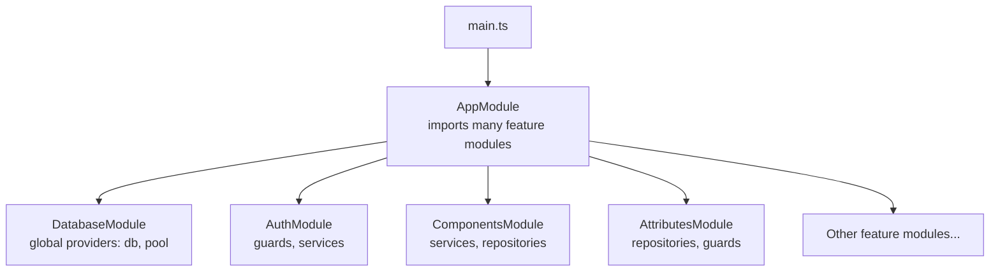
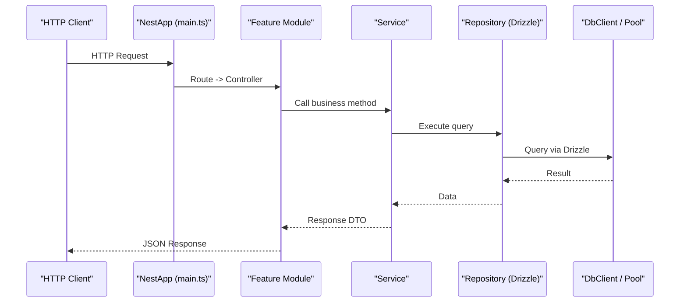
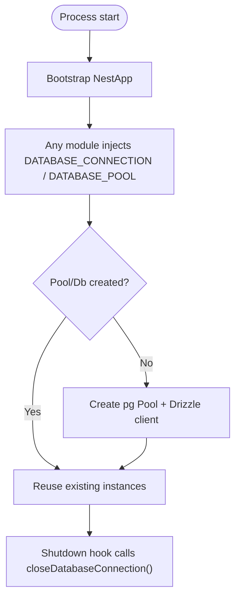
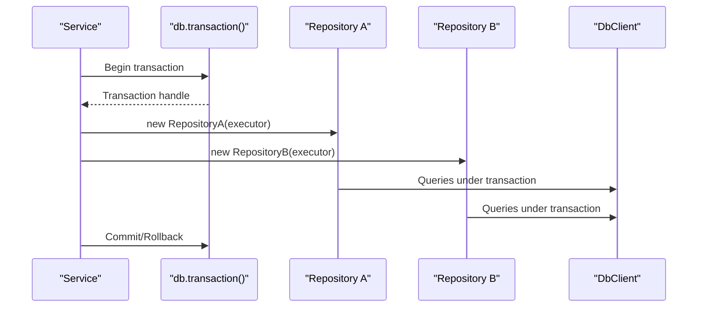
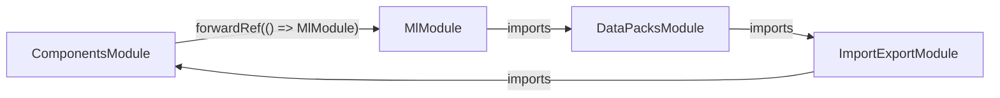
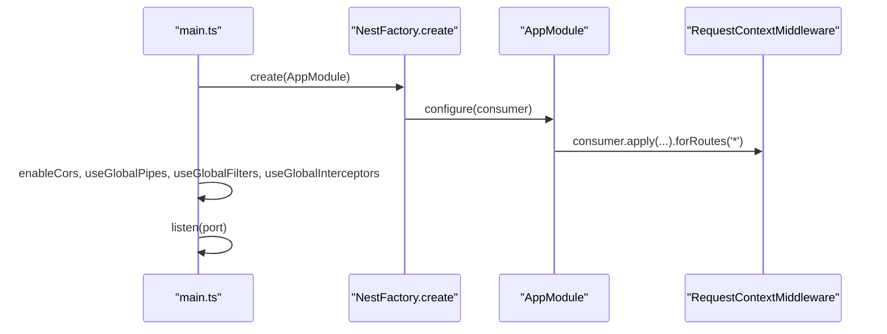
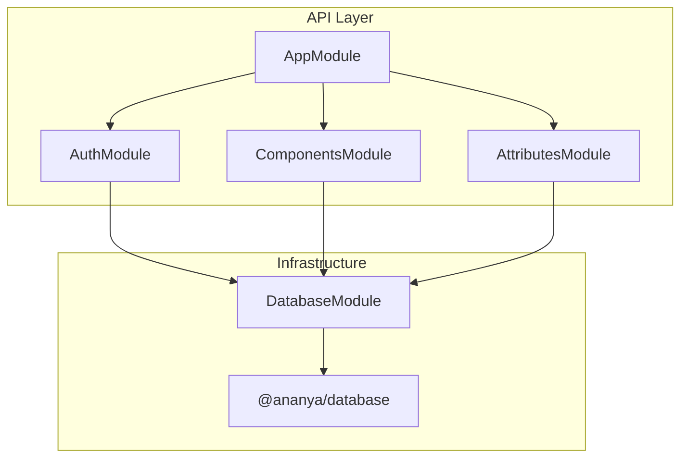

# Module Architecture & Dependency Injection

<cite>
**Referenced Files in This Document**
- [main.ts](file://apps/api/src/main.ts)
- [app.module.ts](file://apps/api/src/app.module.ts)
- [database.module.ts](file://apps/api/src/database/database.module.ts)
- [index.ts](file://packages/database/src/index.ts)
- [executor.ts](file://packages/database/src/executor.ts)
- [auth.module.ts](file://apps/api/src/auth/auth.module.ts)
- [invitations.service.ts](file://apps/api/src/auth/invitations.service.ts)
- [components.module.ts](file://apps/api/src/components/components.module.ts)
- [attributes.module.ts](file://apps/api/src/attributes/attributes.module.ts)
- [bulk-action.service.spec.ts](file://apps/api/src/import-export/bulk-action.service.spec.ts)
</cite>

## Table of Contents
1. [Introduction](#introduction)
2. [Project Structure](#project-structure)
3. [Core Components](#core-components)
4. [Architecture Overview](#architecture-overview)
5. [Detailed Component Analysis](#detailed-component-analysis)
6. [Dependency Analysis](#dependency-analysis)
7. [Performance Considerations](#performance-considerations)
8. [Troubleshooting Guide](#troubleshooting-guide)
9. [Conclusion](#conclusion)
10. [Appendices](#appendices)

## Introduction
This document explains Ananya ERP’s NestJS module architecture and dependency injection (DI) patterns as implemented in the API application. It covers modular design principles, module organization strategies, inter-module communication, DI container usage, service providers, configuration management, database module setup, connection pooling, transaction management, creating new modules, registering providers, handling lifecycle events, circular dependencies, lazy loading, dynamic modules, and testing strategies for modules and their dependencies.

## Project Structure
The API is bootstrapped by a single entry point that creates the Nest application, configures global middleware, pipes, filters, interceptors, and CORS, then listens on a configurable port. The root module aggregates all feature modules and registers a request-scoped context middleware.

**Diagram sources**
- [main.ts:12-40](file://apps/api/src/main.ts#L12-L40)
- [app.module.ts:83-169](file://apps/api/src/app.module.ts#L83-L169)
- [database.module.ts:5-19](file://apps/api/src/database/database.module.ts#L5-L19)
- [auth.module.ts:15-42](file://apps/api/src/auth/auth.module.ts#L15-L42)
- [components.module.ts:21-45](file://apps/api/src/components/components.module.ts#L21-L45)
- [attributes.module.ts:32-75](file://apps/api/src/attributes/attributes.module.ts#L32-L75)

**Section sources**
- [main.ts:1-46](file://apps/api/src/main.ts#L1-L46)
- [app.module.ts:1-171](file://apps/api/src/app.module.ts#L1-L171)

## Core Components
- Application bootstrap: Creates the Nest app, enables trust proxy, configures CORS from environment, applies global exception filter, logging interceptor, and validation pipe, then starts listening.
- Root module: Declares a large set of imported feature modules and registers a global request-context middleware for all routes.
- Database module: Exposes a globally available Drizzle client and pg Pool via custom tokens so any module can inject them without importing a specific module.
- Auth module: Registers authentication guard globally via APP_GUARD and exposes auth-related services and guards.
- Feature modules: Each domain area (e.g., components, attributes) declares controllers, services, repository bindings to Drizzle implementations, and imports only what they need.

Key responsibilities:
- Configuration management: Environment-driven settings (CORS, port) are applied at bootstrap.
- DI container usage: Services use constructor injection; repositories are bound to tokens; some modules export tokens for cross-module reuse.
- Global vs scoped providers: DatabaseModule is marked global to avoid repeated imports across modules.

**Section sources**
- [main.ts:12-40](file://apps/api/src/main.ts#L12-L40)
- [app.module.ts:83-169](file://apps/api/src/app.module.ts#L83-L169)
- [database.module.ts:5-19](file://apps/api/src/database/database.module.ts#L5-L19)
- [auth.module.ts:15-42](file://apps/api/src/auth/auth.module.ts#L15-L42)

## Architecture Overview
At runtime, requests flow through global middleware and pipes into controllers, which delegate to services. Services depend on repositories injected via tokens or direct classes. Cross-cutting concerns like authentication are enforced via a global guard. Database access uses a shared Drizzle client with a pooled connection. Transactions are managed at the service layer using Drizzle transactions and an executor abstraction to ensure atomicity across multiple repositories.

**Diagram sources**
- [main.ts:12-40](file://apps/api/src/main.ts#L12-L40)
- [app.module.ts:83-169](file://apps/api/src/app.module.ts#L83-L169)
- [index.ts:20-26](file://packages/database/src/index.ts#L20-L26)
- [executor.ts:17-40](file://packages/database/src/executor.ts#L17-L40)

## Detailed Component Analysis

### Database Module and Connection Pooling
- Global provider registration: The database module is marked global and provides two tokens: one for the Drizzle client instance and one for the underlying pg Pool. Any module can inject these tokens directly.
- Lazy initialization: The database package lazily creates the pool and Drizzle client on first access, ensuring minimal startup overhead.
- Cleanup: A close function is exported to end the pool during shutdown.

**Diagram sources**
- [database.module.ts:5-19](file://apps/api/src/database/database.module.ts#L5-L19)
- [index.ts:7-18](file://packages/database/src/index.ts#L7-L18)
- [index.ts:20-34](file://packages/database/src/index.ts#L20-L34)

**Section sources**
- [database.module.ts:1-20](file://apps/api/src/database/database.module.ts#L1-L20)
- [index.ts:1-60](file://packages/database/src/index.ts#L1-L60)

### Transaction Management with Executor Abstraction
- Executor type: The database package defines a DbExecutor type that represents either the root Drizzle client or a transaction handle.
- Binding strategy: Repositories accept a DbExecutor in their constructor. When a service needs atomicity across multiple repositories, it opens a transaction and passes the same executor to each repository, ensuring all operations participate in the same transaction boundary.
- Enforcement: Tests assert that consolidation logic binds every repository to the provided executor and that adapters either take a repository or read the executor from context.

**Diagram sources**
- [executor.ts:17-40](file://packages/database/src/executor.ts#L17-L40)
- [executor.ts:42-61](file://packages/database/src/executor.ts#L42-L61)

**Section sources**
- [executor.ts:1-61](file://packages/database/src/executor.ts#L1-L61)

### Inter-Module Communication and Circular Dependencies
- Global guards: The auth module registers a global guard via APP_GUARD to enforce authorization across all routes.
- Token-based coupling: Modules bind repository implementations to tokens and inject them where needed, decoupling consumers from concrete implementations.
- Forward references: Some modules have cyclic dependencies (e.g., components depends on ML, which may depend back on data packs and import/export). These cycles are resolved using forwardRef in module imports.
- Example: InvitationsService injects AuthService using forwardRef to break a potential cycle between services.

**Diagram sources**
- [components.module.ts:21-31](file://apps/api/src/components/components.module.ts#L21-L31)
- [invitations.service.ts:22-29](file://apps/api/src/auth/invitations.service.ts#L22-L29)

**Section sources**
- [auth.module.ts:15-42](file://apps/api/src/auth/auth.module.ts#L15-L42)
- [components.module.ts:1-46](file://apps/api/src/components/components.module.ts#L1-L46)
- [invitations.service.ts:1-173](file://apps/api/src/auth/invitations.service.ts#L1-L173)

### Creating New Modules and Registering Providers
- Module declaration: Create a module file that lists controllers, providers (services), imports for dependencies, and exports for reusable services or tokens.
- Provider binding: Bind repository interfaces to Drizzle implementations using provide/useClass pairs within the module.
- Token usage: Define tokens for abstractions (e.g., repositories) and inject them with @Inject in services.
- Example pattern: AttributesModule binds multiple repository tokens to Drizzle implementations and exports selected tokens for other modules.

```mermaid
classDiagram
class AttributesModule {
+controllers : ["AttributesController"]
+providers : ["AttributesService", "AttributeReadGuard", "AttributeWriteGuard", "AttributeDeleteGuard", "ATTRIBUTE_DEFINITION_REPOSITORY -> DrizzleAttributeDefinitionRepository", "ATTRIBUTE_OPTION_REPOSITORY -> DrizzleAttributeOptionRepository", "CATEGORY_ATTRIBUTE_REPOSITORY -> DrizzleCategoryAttributeRepository", "COMPONENT_ATTRIBUTE_REPOSITORY -> DrizzleComponentAttributeRepository", "CATEGORY_REPOSITORY -> DrizzleCategoryRepository", "UNIT_REPOSITORY -> DrizzleUnitRepository"]
+exports : ["AttributesService", "ATTRIBUTE_DEFINITION_REPOSITORY", "ATTRIBUTE_OPTION_REPOSITORY", "CATEGORY_ATTRIBUTE_REPOSITORY", "COMPONENT_ATTRIBUTE_REPOSITORY"]
}
```

**Diagram sources**
- [attributes.module.ts:32-75](file://apps/api/src/attributes/attributes.module.ts#L32-L75)

**Section sources**
- [attributes.module.ts:1-76](file://apps/api/src/attributes/attributes.module.ts#L1-L76)

### Lifecycle Events and Middleware
- Global middleware: AppModule implements NestModule.configure to apply RequestContextMiddleware to all routes, enabling per-request context propagation.
- Bootstrap-time configuration: main.ts sets up global pipes, filters, interceptors, and CORS before starting the server.

**Diagram sources**
- [main.ts:12-40](file://apps/api/src/main.ts#L12-L40)
- [app.module.ts:166-169](file://apps/api/src/app.module.ts#L166-L169)

**Section sources**
- [main.ts:1-46](file://apps/api/src/main.ts#L1-L46)
- [app.module.ts:166-169](file://apps/api/src/app.module.ts#L166-L169)

### Dynamic Modules
- While no explicit dynamic module factory is shown in the analyzed files, the codebase demonstrates patterns commonly used with dynamic modules: token-based provider registration and exporting tokens for reuse. If you need to configure modules at runtime (e.g., feature toggles or multi-tenant settings), define a static forRoot factory that returns a module with conditional providers based on configuration.

[No sources needed since this section provides general guidance]

## Dependency Analysis
- Coupling: Feature modules depend on shared infrastructure (DatabaseModule) via global tokens, reducing import coupling. Domain modules depend on auth and permissions when their routes require authorization.
- Cohesion: Each module encapsulates its own controllers, services, and repository bindings, keeping domain logic cohesive.
- External dependencies: Drizzle ORM and pg Pool are centralized in the database package and exposed via proxies to ensure singleton-like behavior and lazy initialization.

**Diagram sources**
- [app.module.ts:83-169](file://apps/api/src/app.module.ts#L83-L169)
- [database.module.ts:5-19](file://apps/api/src/database/database.module.ts#L5-L19)
- [index.ts:1-60](file://packages/database/src/index.ts#L1-L60)

**Section sources**
- [app.module.ts:83-169](file://apps/api/src/app.module.ts#L83-L169)
- [database.module.ts:1-20](file://apps/api/src/database/database.module.ts#L1-L20)
- [index.ts:1-60](file://packages/database/src/index.ts#L1-L60)

## Performance Considerations
- Lazy database initialization: The database package defers pool and client creation until first use, minimizing cold-start time.
- Connection pooling: Using pg Pool ensures efficient reuse of connections under load.
- Global guards: A single global guard reduces per-route guard instantiation overhead but should be designed to be lightweight.
- Middleware: Applying a single global middleware for request context avoids per-route duplication while still providing necessary context.

[No sources needed since this section provides general guidance]

## Troubleshooting Guide
- Circular dependency errors: Use forwardRef in module imports or service constructors to break cycles. For example, InvitationsService injects AuthService via forwardRef.
- Missing providers: Ensure repository tokens are bound in the module that owns the controller/service consuming them.
- Global guard misconfiguration: Verify that the auth module registers APP_GUARD and that required dependencies (users, permissions, security audit) are imported.
- Database not configured: If DATABASE_URL is missing, the database package throws an error during first access.

**Section sources**
- [invitations.service.ts:22-29](file://apps/api/src/auth/invitations.service.ts#L22-L29)
- [auth.module.ts:15-42](file://apps/api/src/auth/auth.module.ts#L15-L42)
- [index.ts:7-18](file://packages/database/src/index.ts#L7-L18)

## Conclusion
Ananya’s API leverages NestJS’s DI container to build a modular, testable, and maintainable system. The global database module centralizes connection management, while feature modules encapsulate domain logic and bind repository implementations to tokens. Circular dependencies are handled with forwardRef, and transactions are coordinated via an executor abstraction to ensure atomicity across repositories. Testing relies on Nest’s testing utilities to isolate modules and mock dependencies.

## Appendices

### Testing Strategies for Modules and Dependencies
- Unit tests: Use Test.createTestingModule to construct isolated modules, override providers with mocks, and assert service behavior.
- Mocking services: In bulk action tests, helper functions create mock services to stub dependencies and validate interactions.
- Integration tests: Build a full or partial module graph to exercise real integrations with mocked external systems.

**Section sources**
- [bulk-action.service.spec.ts:36-61](file://apps/api/src/import-export/bulk-action.service.spec.ts#L36-L61)