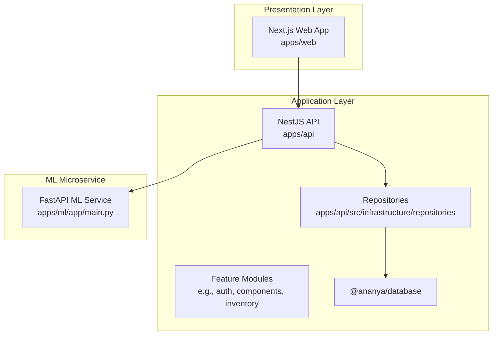
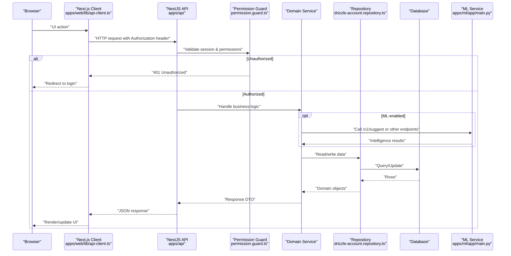
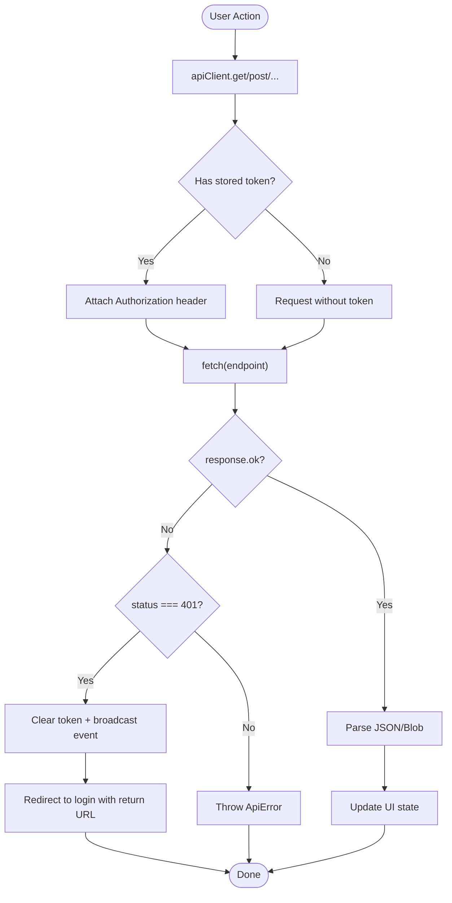
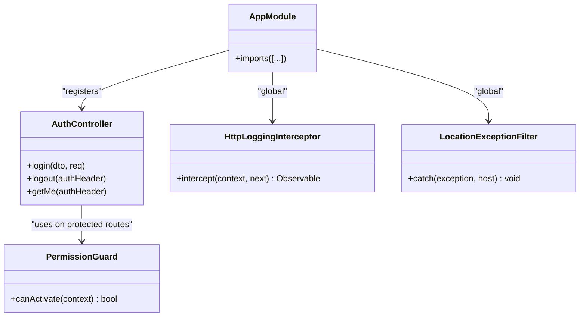
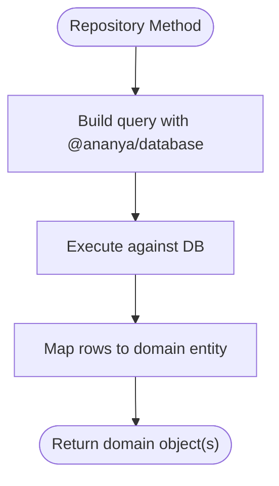
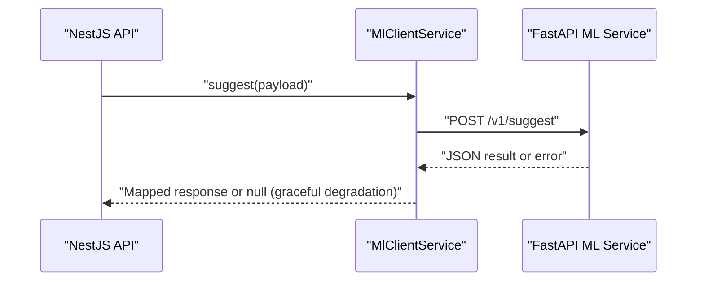
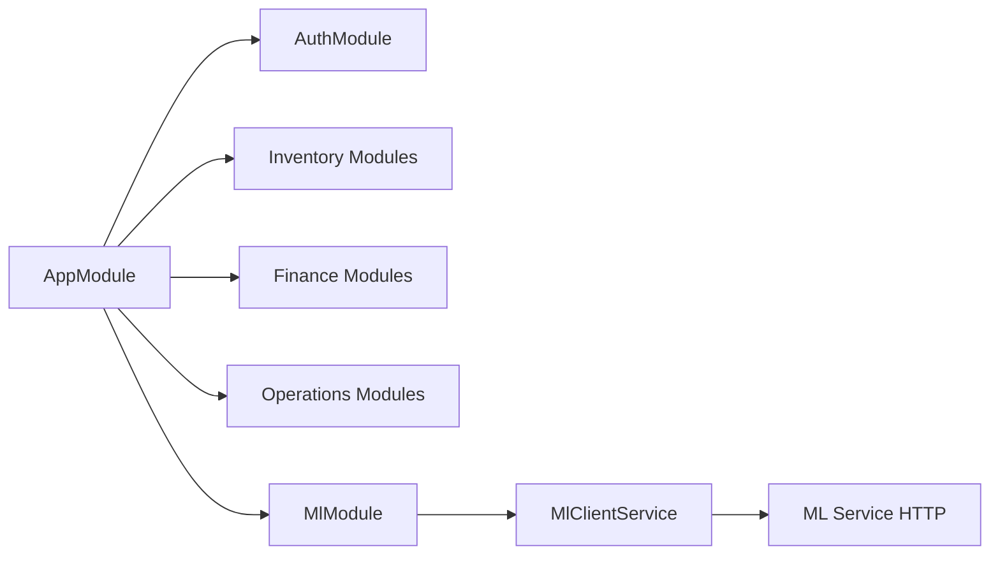

# Application Layers

<cite>
**Referenced Files in This Document**
- [main.ts](file://apps/api/src/main.ts)
- [app.module.ts](file://apps/api/src/app.module.ts)
- [http-logging.interceptor.ts](file://apps/api/src/common/logging/http-logging.interceptor.ts)
- [location-exception.filter.ts](file://apps/api/src/locations/location-exception.filter.ts)
- [permission.guard.ts](file://apps/api/src/auth/permission.guard.ts)
- [auth.controller.ts](file://apps/api/src/auth/auth.controller.ts)
- [auth.service.ts](file://apps/api/src/auth/auth.service.ts)
- [drizzle-account.repository.ts](file://apps/api/src/infrastructure/repositories/drizzle-account.repository.ts)
- [next.config.mjs](file://apps/web/next.config.mjs)
- [api-client.ts](file://apps/web/lib/api-client.ts)
- [ml.module.ts](file://apps/api/src/ml/ml.module.ts)
- [ml-client.service.ts](file://apps/api/src/ml/ml-client.service.ts)
- [main.py](file://apps/ml/app/main.py)
</cite>

## Table of Contents
1. [Introduction](#introduction)
2. [Project Structure](#project-structure)
3. [Core Components](#core-components)
4. [Architecture Overview](#architecture-overview)
5. [Detailed Component Analysis](#detailed-component-analysis)
6. [Dependency Analysis](#dependency-analysis)
7. [Performance Considerations](#performance-considerations)
8. [Troubleshooting Guide](#troubleshooting-guide)
9. [Conclusion](#conclusion)

## Introduction
This document explains Ananya ERP’s application-layer architecture across three tiers:
- Presentation Layer: Next.js web app that renders UI and calls the API.
- Application Layer: NestJS API that orchestrates business logic, enforces security, validates input, and coordinates data access and ML microservice calls.
- Data Access Layer: Repository implementations over a shared database package.

It also documents the ML microservice integration pattern, request/response flow (including authentication middleware, error handling, and response formatting), module organization, dependency injection patterns, cross-cutting concerns (logging, validation, security), and performance considerations such as caching and scaling strategies per layer.

## Project Structure
The repository is organized into applications and shared packages:
- apps/web: Next.js frontend with route-based pages and a centralized API client.
- apps/api: NestJS backend with feature modules, global interceptors/filters/pipes, and an ML client.
- apps/ml: Python FastAPI service providing component intelligence endpoints.
- packages/*: Framework-independent domain and infrastructure packages consumed by the API.

**Diagram sources**
- [app.module.ts:82-162](file://apps/api/src/app.module.ts#L82-L162)
- [drizzle-account.repository.ts:1-88](file://apps/api/src/infrastructure/repositories/drizzle-account.repository.ts#L1-L88)
- [main.py:60-101](file://apps/ml/app/main.py#L60-L101)

**Section sources**
- [app.module.ts:82-162](file://apps/api/src/app.module.ts#L82-L162)
- [next.config.mjs:1-30](file://apps/web/next.config.mjs#L1-L30)

## Core Components
- Global bootstrap and cross-cutting setup:
  - CORS, global exception filter, logging interceptor, and validation pipe are configured at startup.
- Authentication and authorization:
  - Auth controller exposes login/logout/me; permission guard validates sessions and permissions.
- Feature modules:
  - Each domain area (e.g., accounts, components, inventory) is a NestJS module with controllers, services, and repositories.
- Data access:
  - Repositories implement domain interfaces and use a shared database package for queries.
- ML integration:
  - MlClientService encapsulates HTTP calls to the ML microservice with timeouts and graceful degradation.

**Section sources**
- [main.ts:11-38](file://apps/api/src/main.ts#L11-L38)
- [auth.controller.ts:24-49](file://apps/api/src/auth/auth.controller.ts#L24-L49)
- [permission.guard.ts:66-147](file://apps/api/src/auth/permission.guard.ts#L66-L147)
- [drizzle-account.repository.ts:26-87](file://apps/api/src/infrastructure/repositories/drizzle-account.repository.ts#L26-L87)
- [ml-client.service.ts:310-401](file://apps/api/src/ml/ml-client.service.ts#L310-L401)

## Architecture Overview
End-to-end request flow from browser to database and back, including ML integration:

**Diagram sources**
- [api-client.ts:62-118](file://apps/web/lib/api-client.ts#L62-L118)
- [permission.guard.ts:77-136](file://apps/api/src/auth/permission.guard.ts#L77-L136)
- [drizzle-account.repository.ts:26-87](file://apps/api/src/infrastructure/repositories/drizzle-account.repository.ts#L26-L87)
- [ml-client.service.ts:340-401](file://apps/api/src/ml/ml-client.service.ts#L340-L401)
- [main.py:103-153](file://apps/ml/app/main.py#L103-L153)

## Detailed Component Analysis

### Presentation Layer (Next.js Web App)
- Centralized API client:
  - Adds Bearer token from storage, handles JSON and binary responses, and implements a global 401 handler that clears tokens and redirects to login while preserving the intended destination.
- Build-time configuration:
  - Standalone output, unoptimized images, and custom headers for service worker cache control.

**Diagram sources**
- [api-client.ts:62-118](file://apps/web/lib/api-client.ts#L62-L118)
- [api-client.ts:145-175](file://apps/web/lib/api-client.ts#L145-L175)
- [next.config.mjs:10-26](file://apps/web/next.config.mjs#L10-L26)

**Section sources**
- [api-client.ts:62-118](file://apps/web/lib/api-client.ts#L62-L118)
- [api-client.ts:145-175](file://apps/web/lib/api-client.ts#L145-L175)
- [next.config.mjs:1-30](file://apps/web/next.config.mjs#L1-L30)

### Application Layer (NestJS API)
- Bootstrap and cross-cutting concerns:
  - Enables CORS, registers a global exception filter, logging interceptor, and validation pipe with whitelist enforcement.
- Authentication and authorization:
  - AuthController provides login/logout/me endpoints. Permission guard extracts bearer token, validates session via AuthService, checks permissions, and attaches user context to the request.
- Module organization:
  - AppModule imports many feature modules (auth, users, roles, permissions, domains like inventory, procurement, finance, etc.), demonstrating clear separation of concerns and dependency injection boundaries.
- Logging and error handling:
  - HttpLoggingInterceptor logs access and errors with request IDs and timing; LocationExceptionFilter normalizes error responses.

**Diagram sources**
- [app.module.ts:82-162](file://apps/api/src/app.module.ts#L82-L162)
- [auth.controller.ts:24-49](file://apps/api/src/auth/auth.controller.ts#L24-L49)
- [permission.guard.ts:66-147](file://apps/api/src/auth/permission.guard.ts#L66-L147)
- [http-logging.interceptor.ts:21-73](file://apps/api/src/common/logging/http-logging.interceptor.ts#L21-L73)
- [location-exception.filter.ts:60-78](file://apps/api/src/locations/location-exception.filter.ts#L60-L78)

**Section sources**
- [main.ts:11-38](file://apps/api/src/main.ts#L11-L38)
- [app.module.ts:82-162](file://apps/api/src/app.module.ts#L82-L162)
- [auth.controller.ts:24-49](file://apps/api/src/auth/auth.controller.ts#L24-L49)
- [permission.guard.ts:66-147](file://apps/api/src/auth/permission.guard.ts#L66-L147)
- [http-logging.interceptor.ts:21-73](file://apps/api/src/common/logging/http-logging.interceptor.ts#L21-L73)
- [location-exception.filter.ts:60-78](file://apps/api/src/locations/location-exception.filter.ts#L60-L78)

### Data Access Layer (Repositories)
- Repository pattern:
  - Each repository implements a domain interface and uses a shared database package for typed queries and schema definitions.
- Example: Account repository:
  - Provides findById, findByNumber, findMany with filters/search, and save with upsert semantics. Domain entities are hydrated from raw rows.

**Diagram sources**
- [drizzle-account.repository.ts:26-87](file://apps/api/src/infrastructure/repositories/drizzle-account.repository.ts#L26-L87)

**Section sources**
- [drizzle-account.repository.ts:1-88](file://apps/api/src/infrastructure/repositories/drizzle-account.repository.ts#L1-L88)

### ML Microservice Integration Pattern
- NestJS ML client:
  - Encapsulates HTTP calls to the ML service with timeouts, disabled mode fallback, and robust error parsing for both string and structured detail bodies.
  - Methods include suggest, extract datasheet, attribute suggestions, and operations endpoints.
- ML service surface:
  - FastAPI app with health/ready endpoints and versioned routes for category prediction, manufacturer resolution, duplicate detection, datasheet extraction, and attribute intelligence.
  - Training control plane endpoints for runs, model registry, deployment, rollback, and reload.

**Diagram sources**
- [ml-client.service.ts:340-401](file://apps/api/src/ml/ml-client.service.ts#L340-L401)
- [main.py:103-153](file://apps/ml/app/main.py#L103-L153)

**Section sources**
- [ml.module.ts:1-12](file://apps/api/src/ml/ml.module.ts#L1-L12)
- [ml-client.service.ts:310-401](file://apps/api/src/ml/ml-client.service.ts#L310-L401)
- [main.py:60-101](file://apps/ml/app/main.py#L60-L101)
- [main.py:103-153](file://apps/ml/app/main.py#L103-L153)
- [main.py:383-475](file://apps/ml/app/main.py#L383-L475)

## Dependency Analysis
- AppModule aggregates feature modules, establishing clear boundaries and enabling DI per domain.
- Cross-cutting dependencies:
  - ValidationPipe ensures DTOs are validated and transformed.
  - HttpLoggingInterceptor adds observability across all requests.
  - LocationExceptionFilter standardizes error payloads.
- ML integration decouples ML logic behind MlClientService, allowing graceful degradation when disabled or unreachable.

**Diagram sources**
- [app.module.ts:82-162](file://apps/api/src/app.module.ts#L82-L162)
- [ml.module.ts:1-12](file://apps/api/src/ml/ml.module.ts#L1-L12)
- [ml-client.service.ts:310-401](file://apps/api/src/ml/ml-client.service.ts#L310-L401)

**Section sources**
- [app.module.ts:82-162](file://apps/api/src/app.module.ts#L82-L162)
- [ml.module.ts:1-12](file://apps/api/src/ml/ml.module.ts#L1-L12)

## Performance Considerations
- Presentation Layer (Next.js):
  - Use standalone output for efficient deployments.
  - Avoid heavy client-side caching for dynamic content; rely on server-side caching where appropriate.
  - Minimize payload sizes and leverage streaming for large responses.
- Application Layer (NestJS):
  - Leverage global ValidationPipe to reduce invalid request processing overhead.
  - Use HttpLoggingInterceptor to identify slow endpoints and hot paths.
  - Implement caching strategies:
    - Read-heavy endpoints can use in-memory caches (e.g., per-process) or external caches (Redis) with TTLs.
    - Cache busting on writes and invalidation keys based on resource IDs.
  - Connection pooling and query optimization in repositories; avoid N+1 queries by batching or using joins where possible.
  - Graceful degradation for ML calls to keep core flows responsive.
- Data Access Layer:
  - Prefer indexed queries and selective column projection.
  - Use transactions for multi-step writes to maintain consistency and reduce retries.
  - Monitor slow queries and adjust indexes accordingly.
- ML Microservice:
  - Short timeouts and non-blocking calls prevent API stalls.
  - Batch endpoints (e.g., batch category prediction) reduce round-trips.
  - Health/ready endpoints enable readiness probes and auto-scaling decisions.

[No sources needed since this section provides general guidance]

## Troubleshooting Guide
- Authentication failures:
  - Frontend clears tokens and redirects on 401; ensure CORS and token storage are correct.
  - Backend permission guard returns 401 for missing/expired sessions and 403 for insufficient permissions.
- Validation errors:
  - Global ValidationPipe rejects non-whitelisted fields; check DTOs and request payloads.
- Error responses:
  - LocationExceptionFilter and other filters normalize error shapes; inspect statusCode, error, and message fields.
- Logging:
  - HttpLoggingInterceptor emits structured logs with requestId, method, route, durationMs, and error details; correlate issues via requestId.

**Section sources**
- [api-client.ts:92-118](file://apps/web/lib/api-client.ts#L92-L118)
- [permission.guard.ts:77-136](file://apps/api/src/auth/permission.guard.ts#L77-L136)
- [location-exception.filter.ts:60-78](file://apps/api/src/locations/location-exception.filter.ts#L60-L78)
- [http-logging.interceptor.ts:21-73](file://apps/api/src/common/logging/http-logging.interceptor.ts#L21-L73)

## Conclusion
Ananya ERP’s application layers are cleanly separated:
- The Next.js frontend focuses on UI and user interactions, delegating data fetching to a robust API client.
- The NestJS API centralizes cross-cutting concerns, enforces security, and orchestrates domain logic through modular services and repositories.
- The ML microservice provides specialized intelligence with a stable HTTP contract and operational endpoints, integrated via a resilient client.

This structure supports scalability, maintainability, and observability, with clear extension points for new features and performance optimizations.